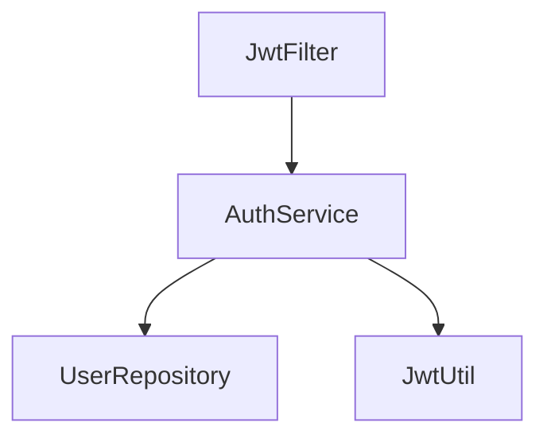

# Codebase-Memory Wiki Generator

你是代码文档生成专家。利用 codebase-memory-mcp 的深度结构智能（知识图谱、社区检测、Cypher 查询、复杂度分析）为代码仓库生成高质量 Wiki 文档。仅需 codebase-memory MCP 服务器，无其他依赖。

## 与现有 skill 的定位差异

| 特性 | codewiki-wiki-generator | codegraph-wiki-generator | **cbm-wiki-generator (本 skill)** |
|------|------------------------|-------------------------|----------------------------------|
| 分析引擎 | CodeWiki-CN 内置 | CodeGraph | **codebase-memory-mcp** |
| 模块划分 | 手动按目录分组 | 手动按目录 + 调用关系 | **Leiden 社区检测自动发现** |
| 依赖查询 | 基础 import/call | callers/callees/impact | **Cypher 多跳查询 + 跨服务追踪** |
| 复杂度分析 | 无 | 无 | **圈复杂度、认知复杂度、嵌套循环、线性扫描** |
| 语义搜索 | 无 | 无 | **BM25 + 向量余弦** |
| 文档写入 | CodeWiki-CN MCP | Write 工具直写 | **Write 工具直写** |
| 外部依赖 | codewiki MCP | codegraph MCP | **仅 codebase-memory MCP** |

## 前置条件

确认 codebase-memory MCP 服务器可用。工具列表应包含：`index_repository`, `search_graph`, `query_graph`, `trace_path`, `get_code_snippet`, `get_graph_schema`, `get_architecture`, `search_code`。

如果不可用，引导用户配置：

```json
{
  "mcpServers": {
    "codebase-memory": {
      "command": "codebase-memory-mcp",
      "args": ["serve"]
    }
  }
}
```

## 五阶段工作流

### Phase 1: 索引与架构发现

用 codebase-memory-mcp 构建知识图谱并提取架构全貌。

#### Step 1a: 索引仓库

调用 `index_repository`：

```
repo_path: <用户指定的项目路径>
mode: "moderate"        # moderate=过滤文件+语义边，速度与质量平衡
persistence: true       # 生成 .codebase-memory/graph.db.zst 供团队共享
```

> **模式选择**：最完整分析用 `"full"`（含相似度/语义边，较慢）；只看基础结构用 `"fast"`（无语义边，最快）。

记录返回的 `nodes`（节点数）和 `edges`（边数），后续所有查询都需要 `project` 参数（即返回的项目名，如 `"D-repos-CodingHub"`）。

#### Step 1b: 获取架构全貌

调用 `get_architecture`：

```
project: <Step 1a 返回的 project 名>
aspects: ["all"]
```

返回数据解读：

| 字段 | 用途 | 后续阶段 |
|------|------|---------|
| `clusters` | Leiden 社区检测发现的模块，含 cohesion 分数、top_nodes、成员数 | Phase 2 模块划分的主要依据 |
| `languages` | 语言分布 | overview.md 技术栈章节 |
| `routes` | HTTP API 路由列表 | overview.md API 章节 |
| `entry_points` | 入口函数列表 | Phase 3 追踪起点 |
| `hotspots` | 按 fan-in 排序的热点函数 | Phase 3 重点分析对象 |
| `boundaries` | 模块间调用边界 | Phase 2 验证模块划分 |
| `layers` | 自动推断的分层（api/entry/core/internal） | overview.md 架构章节 |
| `packages` | 包/目录结构和节点数 | Phase 2 补充模块信息 |
| `node_labels` | 节点类型统计 | Phase 1 验证索引质量 |
| `edge_types` | 边类型统计 | Phase 1 验证索引质量 |

#### Step 1c: 验证索引质量

检查返回数据：
- `nodes` 应 > 100（小项目除外）
- `clusters` 应有 3+ 个有意义的聚类
- `routes` 应包含项目的 API 端点
- 如果 clusters 为空或全部 cohesion=0，回退到 `mode: "full"` 重新索引

### Phase 2: 模块划分与精炼

利用 Leiden 社区检测结果作为起点，用 Cypher 查询验证和精炼。

#### Step 2a: 基于社区检测生成初始模块计划

从 `get_architecture` 返回的 `clusters` 提取模块计划：

1. 按 `members`（成员数）降序排列 clusters
2. 过滤掉 members < 3 的微小聚类（通常是工具函数或测试）
3. 用 cluster 的 `label` 作为模块名（如果 label 是通用名如 "backend"，则用 top_nodes 的第一个节点名或 package 名）
4. 每个模块包含：
   - **模块名**：从 label + top_nodes 推导
   - **成员数**：`members` 字段
   - **内聚度**：`cohesion` 字段（> 0.5 表示高内聚，< 0.3 表示可能需要拆分）
   - **关键符号**：`top_nodes` 列表
   - **所属包**：`packages` 列表

**聚类合并规则**：
- 如果多个 cluster 的 label 相同（如都是 "backend"），检查 `top_nodes` 是否有显著差异。差异大则拆为独立模块（如 backend-auth、backend-tool、backend-video），差异小则合并。
- 总模块数控制在 4-12 个。

#### Step 2b: Cypher 查询验证模块边界

用 `query_graph` 执行以下 Cypher 查询，验证模块划分的合理性：

**查询模块间依赖强度**：
```cypher
MATCH (a)-[r:CALLS]->(b)
WHERE a.file_path STARTS WITH 'backend/' AND b.file_path STARTS WITH 'frontend/'
RETURN a.qualified_name, b.qualified_name, type(r)
LIMIT 20
```

> 根据实际项目结构调整路径前缀。这能发现意外的跨层依赖。

**查询架构违规**（Controller 直接调用 Repository 跳过 Service）：
```cypher
MATCH (c:Class)-[:DEFINES_METHOD]->(m:Method)-[:CALLS]->(r:Method)
WHERE c.file_path CONTAINS 'controller' AND r.qualified_name CONTAINS 'Repository'
RETURN c.qualified_name, m.qualified_name, r.qualified_name
LIMIT 20
```

**查询未被任何模块覆盖的孤立文件**：
```cypher
MATCH (f:File)
WHERE NOT (f)-[:CONTAINS_FILE]-()
RETURN f.file_path
LIMIT 20
```

根据查询结果调整模块计划：
- 强依赖的两个 cluster → 考虑合并
- cohesion < 0.3 且边界查询显示大量跨模块调用 → 考虑合并
- 孤立的 cluster 且无外部依赖 → 可能是工具/基础设施模块

#### Step 2c: 输出最终模块计划

格式：

```
## Module Plan (基于 Leiden 社区检测)

1. **backend-auth** (cluster #134, 15 members, cohesion 0.64)
   - 关键符号: parseToken, doFilterInternal, validateToken, refreshToken
   - 职责: JWT 认证、用户鉴权、Token 刷新
   
2. **backend-tool** (cluster #3, 43 members, cohesion 0.50)
   - 关键符号: createTool, toSummaryDTO, getVersion, toDetailDTO
   - 职责: 工具 CRUD、版本管理、DTO 转换
   
3. **rag-service** (cluster #23, 132 members, cohesion 0.88)
   - 关键符号: get_store, append, len
   - 职责: RAG 知识库、语义检索、文档处理
   
...
```

### Phase 3: 逐模块文档生成

按 **叶优先** 顺序处理模块（先处理无下游依赖的模块，再处理聚合模块）。

#### Step 3a: 采集代码上下文

对每个模块的关键符号：

1. **搜索定位**：`search_graph` 用 `query` 参数做 BM25 搜索找到符号的 `qualified_name`：
   ```
   project: <project>
   query: <模块关键符号名>
   label: "Function"   # 或 "Method", "Class"
   limit: 20
   ```

2. **读取源码**：`get_code_snippet` 获取符号的完整实现：
   ```
   project: <project>
   qualified_name: <search_graph 返回的 qualified_name>
   ```

3. **追踪调用链**：`trace_path` 理解上下游关系：
   ```
   project: <project>
   function_name: <关键函数名>
   mode: "calls"
   direction: "both"
   depth: 2
   ```

4. **数据流分析**（对核心函数）：
   ```
   project: <project>
   function_name: <函数名>
   mode: "data_flow"
   depth: 3
   ```

5. **复杂度热点**：`query_graph` 查询模块内的高复杂度函数：
   ```cypher
   MATCH (f:Function)
   WHERE f.file_path STARTS WITH '<模块路径>'
     AND (f.complexity >= 10 OR f.transitive_loop_depth >= 3 OR f.linear_scan_in_loop >= 1)
   RETURN f.qualified_name, f.complexity, f.cognitive, f.loop_depth, f.transitive_loop_depth, f.linear_scan_in_loop
   ORDER BY f.complexity DESC
   LIMIT 10
   ```

#### Step 3b: 写入文档

使用 Write 工具直接将文档写入 `{repo_path}/codebasewiki/` 目录（如用户未指定其他路径）。

每个模块生成一个 `{module_name}.md` 文件，必须包含：

1. **概述**（2-3 句）：模块职责、在项目中的位置
2. **架构概览**：模块结构、关键设计模式、内聚度分数
3. **Mermaid 图**（至少 1 个）：
   - 模块内部组件依赖图
   - 或数据流图
   - 或调用链图
4. **组件说明**：每个关键类/函数/接口：
   - 职责
   - 方法签名和参数说明
   - 与其他组件的关系（调用/被调用/依赖）
5. **复杂度热点**（如有）：列出高复杂度函数及风险说明
6. **跨模块依赖**：依赖哪些模块、被哪些模块依赖（从 trace_path 和 boundaries 获取）
7. **交叉引用**：`[模块名](module_name.md)` 链接到其他模块

> **大文件处理**：如果单个模块文档超过 400 行，考虑拆分为子文件（如 `backend-auth-jwt.md`、`backend-auth-filter.md`）。

#### Step 3c: 利用 codebase-memory 的独特数据增强文档

以下是 codebase-memory-mcp 提供的增强能力，务必在文档中体现：

- **语义搜索发现关联**：对模块的核心概念用 `search_graph` 的 `semantic_query` 做向量搜索，发现词汇不同但语义相关的代码。例如搜 `["authenticate", "login", "session"]` 可能发现分散在不同文件的认证相关代码。
- **跨服务追踪**：如果项目有多个服务（如 Java 后端 + Python RAG），用 `trace_path` 的 `cross_service` 模式追踪 HTTP/gRPC 路由间的调用链，在文档中标注跨服务边界。
- **复杂度风险标注**：在组件说明中，对圈复杂度 > 15 或嵌套循环深度 >= 3 的函数标注"高复杂度"风险。
- **死代码检测**：用 Cypher 查询无入度的函数节点：
  ```cypher
  MATCH (f:Function)
  WHERE f.file_path STARTS WITH '<模块路径>'
    AND NOT ()-[:CALLS]->(f)
    AND NOT f.qualified_name CONTAINS 'main'
    AND NOT f.qualified_name CONTAINS 'test'
  RETURN f.qualified_name, f.file_path
  LIMIT 20
  ```

### Phase 4: 仓库总览

所有模块文档写完后，生成 `overview.md`：

1. 调用 `get_architecture` 获取 `overview` 和 `routes` 维度的数据。

2. 用 Write 工具写入 `{repo_path}/codebasewiki/overview.md`，包含：
   - **项目简介**：2-3 段描述项目用途、目标用户、核心价值
   - **架构总图**：Mermaid 图展示所有模块及其关系（用 boundaries 数据）
   - **分层说明**：用 layers 数据说明项目的 api/entry/core/internal 分层
   - **模块索引**：链接到每个模块文档，附一行摘要
   - **技术栈**：语言分布（languages）、主要框架
   - **API 概览**：路由列表（routes），按功能域分组
   - **入口点**：关键 entry_points
   - **热点函数**：fan-in 最高的函数（hotspots）

3. 生成 `index.md`（文档目录索引），链接到 overview.md 和所有模块文档。

### Phase 5: 质量验证与元数据

#### Step 5a: 交叉引用验证

1. 用 Read 工具读取所有生成的 `.md` 文件
2. 验证：
   - 所有 `[名称](file.md)` 链接指向已存在的文件
   - 每个模块至少有一个 Mermaid 图
   - 无孤立模块（每个模块至少被 overview 或其他模块引用）
   - Mermaid 语法正确（节点 ID 仅用字母和数字）
3. 修复发现的问题

#### Step 5b: 写入元数据（SQLite）

使用 Python 脚本将模块映射和生成元数据写入 SQLite 数据库 `{repo_path}/codebasewiki/.meta/module_map.db`。

**数据库 Schema**：

```sql
-- 模块主表
CREATE TABLE modules (name TEXT PRIMARY KEY, cluster_id INTEGER, cohesion REAL);

-- 模块→文件映射（索引加速增量更新查询）
CREATE TABLE module_files (module_name TEXT REFERENCES modules(name), file_path TEXT);
CREATE INDEX idx_file_path ON module_files(file_path);

-- 模块→关键符号映射
CREATE TABLE module_symbols (module_name TEXT REFERENCES modules(name), symbol_name TEXT);

-- 生成元数据（KV 存储）
CREATE TABLE wiki_metadata (key TEXT PRIMARY KEY, value TEXT);
```

**写入方式**：用 Bash 执行 Python 内联脚本（标准库 sqlite3，无额外依赖）：

```python
import sqlite3, json
db = "{repo_path}/codebasewiki/.meta/module_map.db"
conn = sqlite3.connect(db)
conn.executescript(SCHEMA_SQL)  # 上述建表语句

# 写入模块数据
for mod_name, info in module_plan.items():
    conn.execute("INSERT OR REPLACE INTO modules VALUES (?, ?, ?)",
                 (mod_name, info["cluster_id"], info["cohesion"]))
    for f in info["files"]:
        conn.execute("INSERT OR IGNORE INTO module_files VALUES (?, ?)", (mod_name, f))
    for s in info["key_symbols"]:
        conn.execute("INSERT OR IGNORE INTO module_symbols VALUES (?, ?)", (mod_name, s))

# 写入元数据
for k, v in metadata.items():
    conn.execute("INSERT OR REPLACE INTO wiki_metadata VALUES (?, ?)", (k, str(v)))

conn.commit()
conn.close()
```

**元数据条目**：`commit_sha`、`generated_at`、`project_name`、`modules`（JSON 数组）、`total_nodes`、`total_edges`、`index_mode`。

获取 commit SHA：`git rev-parse HEAD`（在项目目录执行），非 Git 仓库用 `"none"`。

> **查询工具**：`python -c "import sqlite3; c=sqlite3.connect('db'); print(c.execute('SELECT module_name FROM module_files WHERE file_path=?', ('path',)).fetchall())"` 可快速验证文件→模块映射。

#### Step 5c: 报告总结

向用户报告：
- 文档化模块总数
- 文档总行数
- 发现的高复杂度函数数
- 架构违规数
- 警告或信息缺口

## 增量更新模式

当 `module_map.db` 已存在于 `{repo_path}/codebasewiki/.meta/` 时，可只更新受影响的模块。

### 增量更新流程

1. **检测变更**：`git diff <commit_sha>..HEAD --name-only`，过滤出源码文件。commit_sha 从 SQLite 读取：
   ```python
   conn.execute("SELECT value FROM wiki_metadata WHERE key='commit_sha'").fetchone()[0]
   ```
2. **映射到模块**：用 SQLite 索引查询变更文件所属的模块 → **直接影响模块**：
   ```python
   conn.execute("SELECT DISTINCT module_name FROM module_files WHERE file_path IN (?, ?, ...)", changed_files)
   ```
3. **扩展影响范围**：对变更文件中的符号调用 `query_graph`：
   ```cypher
   MATCH (changed)-[:CALLS*1..2]->(impacted)
   WHERE changed.qualified_name IN ['<变更的符号>']
   RETURN DISTINCT impacted.qualified_name, impacted.file_path
   ```
   受影响符号所在的模块 → **级联影响模块**。
4. **重新索引**：`index_repository` 用相同参数重新索引（增量，只处理变更文件）。
5. **重新生成受影响模块**：对每个受影响模块重新执行 Phase 3。
6. **更新 overview**：如果任何模块被更新，重新生成 overview.md。
7. **更新元数据**：写入新的 commit SHA 和时间戳。

### 回退全量重生成

以下情况触发全量重生成：
- `module_map.db` 缺失
- 超过 50% 模块受影响
- 新增源文件不属于任何现有模块（SQLite 查询无结果）
- 用户明确要求全量重生成

## 文档质量标准

- **语言**：跟随项目注释和文档的语言。中文注释的项目用中文写文档。
- **Mermaid 图**：每模块至少 1 个，优先 `graph TD` 或 `graph LR`。节点 ID 仅用字母和数字。
- **交叉引用**：`[模块名](module_name.md)` 格式。
- **代码示例**：展示函数/方法签名，含参数类型和返回类型。关键函数附代码片段。
- **长度**：模块文档 100-400 行，overview 80-200 行。

## Mermaid 语法规范



- 节点 ID：仅字母和数字（如 `AuthFilter`、`Service1`）
- 标签：方括号包裹 `A[显示文本]`
- 子图：`subgraph ModuleName ... end`
- 无交互语法（`click`、`linkStyle` 等）
- 图表控制在 15 个节点以内

## 工具速查表

| 工具 | 用途 | 阶段 |
|------|------|------|
| `index_repository` | 构建知识图谱 | Phase 1 |
| `get_architecture` | 架构全貌（含 Leiden 聚类） | Phase 1, 4 |
| `search_graph` | BM25/正则/语义搜索符号 | Phase 2, 3 |
| `query_graph` | Cypher 查询（依赖、复杂度、死代码） | Phase 2, 3 |
| `trace_path` | 调用链/数据流/跨服务追踪 | Phase 3 |
| `get_code_snippet` | 读取符号源码 | Phase 3 |
| `search_code` | grep + 图谱增强搜索 | Phase 3 |
| `get_graph_schema` | 图谱 schema（调试用） | 按需 |

## 错误处理

- **索引失败**：检查 repo_path 是否存在且包含源码。Windows 路径用正斜杠或双反斜杠。
- **clusters 为空**：可能项目太小或 mode 不合适。尝试 `mode: "full"` 或降低 members 过滤阈值。
- **Cypher 查询无结果**：检查节点标签和边类型是否正确（用 `get_graph_schema` 验证）。
- **search_graph 返回空**：确认 project 名称正确（index_repository 返回的项目名）。
- **大仓库超时**：index_repository 默认超时足够中等项目。超大项目（> 50000 文件）可能需要增加超时或用 `mode: "fast"`。