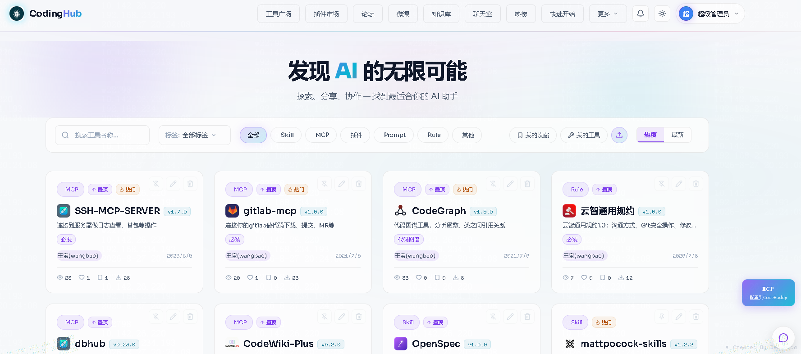

# CodingHub

> AI 工具及使用经验分享平台 —— 离线部署，仅需 MySQL 8.0+ 与 JDK 17，简洁安全，专为企业内部网络管控环境打造。

## 项目简介

CodingHub 是一个支持**离线部署**的 AI 工具发现与经验分享网站。项目仅依赖 **MySQL 8.0+** 和 **JDK 17**，无需 Redis、Elasticsearch 等额外中间件，部署极简。特别适用于**网络管控严格的企事业单位**——所有服务在局域网内运行，数据不外泄，安全可控。

### 核心特性

| 特性 | 说明 |
|------|------|
| 🔌 **极简依赖** | 仅需 MySQL 8.0+ 和 JDK 17，无其他中间件 |
| 🏢 **企业友好** | 支持完全离线部署，数据留存本地，满足内网安全要求 |
| 🔗 **MCP Server** | 内置 MCP Server，任意智能体可对接，一次配置自动拉取 |
| 🎨 **双主题设计** | Cyberpunk Glassmorphism 暗色/亮色主题切换 |
| 🔐 **安全第一** | JWT 认证 + XSS 防护 + 参数校验 |
| 📦 **开箱即用** | 一键启动脚本，Windows / Linux / macOS 均支持 |

## 预览截图

> 将截图文件放入 `docs/screenshot.png` 即可显示。



## 技术栈

| 层级 | 技术 | 版本 |
|------|------|------|
| 后端框架 | Spring Boot | 3.2.5 |
| 编程语言 | Java | 17 |
| 前端框架 | Vue 3 | 3.x |
| 构建工具 | Vite | 5.x |
| 数据库 | MySQL | 8.x |
| 认证 | JWT | 0.12.5 |

## 项目结构

```
CodingHub/
├── backend/                    # Java Spring Boot 后端
│   └── src/main/java/com/iaihub/toolbox/
│       ├── controller/        # REST API 控制器
│       ├── service/           # 业务逻辑层
│       ├── repository/        # 数据访问层 (JPA)
│       ├── model/             # 实体类
│       ├── dto/               # 数据传输对象
│       ├── config/            # 配置类 (Security, JWT, Upload)
│       ├── exception/         # 异常处理
│       └── util/              # 工具类
├── frontend/                  # Vue 3 + TypeScript 前端
│   └── src/
│       ├── components/        # Vue 组件
│       ├── pages/             # 页面
│       ├── services/          # API 调用
│       ├── stores/            # 状态管理
│       ├── router/            # 路由配置
│       └── types/             # TypeScript 类型定义
├── codinghub/                 # MCP Server 配置
├── docs/                      # 详细文档
├── design-system/             # 设计系统
├── harness/                   # Agent 基础设施
├── scripts/                   # 脚本工具
├── specs/                     # 功能规格说明
└── Makefile                   # 快速命令
```

## MCP Server

CodingHub 内置 MCP (Model Context Protocol) Server，允许任意支持 MCP 的智能体（如 CodeBuddy、Claude Desktop、Cursor 等）直接对接本网站。

### 智能体对接方式

在智能体的 MCP 配置中添加 CodingHub Server 即可实现：

- **工具发现**: 智能体自动拉取 CodingHub 中收录的 AI 工具列表
- **经验检索**: 智能体查询工具使用经验、最佳实践
- **一次配置，自动同步**: 网站内容更新后，智能体自动获取最新数据

```json
{
  "mcpServers": {
    "CodingHub-mcp": {
      "type": "sse",
      "url": "http://127.0.0.1:8082/sse",
      "description": "CodingHub MCP Server",
      "disabled": false
    }
  }
}
```

## 快速开始

### 环境要求

- Java 17+
- Node.js 18+
- MySQL 8.x
- npm

### Windows 一键启动

```powershell
# 初始化数据库 + 安装依赖 + 启动服务
.\setup-windows.ps1

# 启动全部服务
.\run-windows.ps1

# 停止全部服务
.\stop-windows.ps1
```

### Linux / macOS

```bash
# 初始化数据库
make db

# 安装前端依赖
make install

# 启动后端 (8082)
make backend

# 启动前端 (5173)
make frontend

# 同时启动后端+前端
make run

# 停止所有服务
make stop
```

### 端口配置

| 服务 | 端口 | 说明 |
|------|------|------|
| 后端 | 8082 | Spring Boot 应用 |
| 前端 | 5173 | Vite 开发服务器 |
| MySQL | 3306 | 数据库服务 |

## API 入口点

### 后端 API (http://localhost:8082)

#### 认证相关

| 方法 | 路径 | 说明 | 认证 |
|------|------|------|------|
| POST | `/api/auth/register` | 用户注册 | 否 |
| POST | `/api/auth/login` | 用户登录 | 否 |
| GET | `/api/auth/me` | 获取当前用户 | 是 |

#### 工具相关

| 方法 | 路径 | 说明 | 认证 |
|------|------|------|------|
| GET | `/api/tools` | 工具列表 (分页) | 否 |
| GET | `/api/tools/{id}` | 工具详情 | 否 |
| POST | `/api/tools` | 创建工具 | 是 |
| PUT | `/api/tools/{id}` | 更新工具 | 是 |
| DELETE | `/api/tools/{id}` | 删除工具 | 是 |

#### 分类相关

| 方法 | 路径 | 说明 | 认证 |
|------|------|------|------|
| GET | `/api/categories` | 分类列表 | 否 |

#### 文件上传

| 方法 | 路径 | 说明 | 认证 |
|------|------|------|------|
| POST | `/api/v1/tools/{id}/files` | 上传文件（支持同名替换） | 是 |
| GET | `/api/v1/tools/{toolId}/files` | 获取文件列表 | 否 |
| DELETE | `/api/v1/tools/{toolId}/files/{fileId}` | 删除文件 | 是 |

### 前端页面 (http://localhost:5173)

| 路径 | 说明 |
|------|------|
| `/` | 首页/工具列表 |
| `/login` | 登录页 |
| `/register` | 注册页 |
| `/tools/{id}` | 工具详情 |
| `/profile` | 用户中心 |

## 数据库表结构

- **user**: id, email, password, username, created_at, updated_at, last_login_at
- **category**: id, name, icon, sort_order, created_at
- **tool**: id, name, version, category_id, content, uploader_id, status, view_count, like_count, comment_count, score, created_at, updated_at
- **tool_file**: id, tool_id, original_name, stored_path, file_size, content_type, status, created_at

## 设计风格

本项目采用 **Cyberpunk Glassmorphism** 双主题设计：

| 属性 | 暗色主题 | 亮色主题 |
|------|----------|----------|
| 背景色 | `#0D0D0D` 深黑 | `#F5F0FF` 淡紫白 |
| 主色调 | `#00FFFF` Cyan | `#7C3AED` 紫罗兰 |
| 辅助色 | `#FF00FF` Magenta | `#F97316` 活力橙 |
| 字体 | Fira Code + Fira Sans | Fira Code + Fira Sans |

详细设计规范请参阅 [design-system/CodingHub/MASTER.md](design-system/CodingHub/MASTER.md)。

## 离线部署

CodingHub 专为离线环境设计：

1. **打包依赖**: 后端使用 Gradle 将所有依赖打包为 Fat JAR
2. **前端构建**: 前端构建为静态资源，由后端直接托管
3. **数据库迁移**: Flyway 自动执行 SQL 迁移，无需手动建表
4. **无需外网**: 所有资源内嵌，启动后即可通过局域网访问

## 约束规则

### 代码约束

1. **禁止循环依赖**: controller → service → repository → model 单向依赖
2. **XSS 防护**: 所有用户输入通过 `XssSanitizer.sanitize()` 过滤
3. **JWT 认证**: 需要认证的接口在 Header 携带 `Authorization: Bearer <token>`
4. **禁止 null 返回**: 方法不返回 null，抛异常或返回 Optional
5. **禁止循环调用**: 禁止在循环中请求数据库或调用接口

### Git 约束

1. **禁止私自提交**: 需求开发过程中不得私自提交代码
2. 提交信息遵循 Conventional Commits 格式
3. 单次提交不超过 1000 行更改

## 相关文档

- [架构详情](docs/ARCHITECTURE.md) - 详细架构说明
- [Agent 导航地图](AGENTS.md) - AI 代理快速参考
- [环境配置](harness/config/environment.json) - 运行时环境变量

---

**最后更新**: 2026-06-10
