# AI Skills 模块文档

## 模块简介

AI Skills 模块（`ui-ux-pro-max`）是一个**跨平台 AI 编码助手技能**，旨在为 UI/UX 设计提供智能化的设计系统生成能力。该模块以 BM25 文本检索算法为核心搜索引擎，基于 CSV 知识库对 UI 风格、配色方案、排版、落地页模式等多个领域进行多维度检索，并通过推理规则引擎聚合搜索结果，最终生成完整的设计系统推荐方案。

该技能被同时部署到三个 AI 编码助手平台：**Qoder**（`.qoder/skills/`）、**Windsurf**（`.windsurf/skills/`）和 **CodeBuddy**（`.codebuddy/skills/`），三个副本代码完全一致，仅部署路径不同。

---

## 目录

- [架构总览](#架构总览)
- [核心组件](#核心组件)
  - [BM25 搜索引擎（core.py）](#bm25-搜索引擎corepy)
  - [设计系统生成器（design_system.py）](#设计系统生成器design_systempy)
- [数据流与处理流程](#数据流与处理流程)
- [知识库结构](#知识库结构)
- [持久化机制](#持久化机制)
- [跨平台部署](#跨平台部署)
- [与其他模块的关系](#与其他模块的关系)

---

## 架构总览

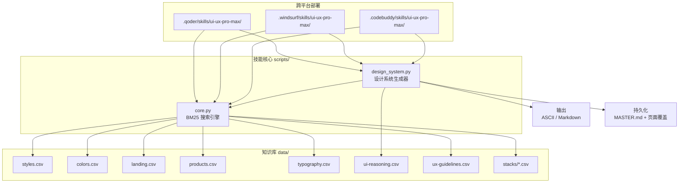

### 分层架构

模块采用三层架构设计：

| 层级 | 职责 | 核心组件 |
|------|------|----------|
| **搜索引擎层** | 基于 BM25 算法对 CSV 知识库进行全文检索 | `BM25` 类、`search()`、`search_stack()` |
| **推理聚合层** | 加载推理规则、多域搜索聚合、最佳匹配选择 | `DesignSystemGenerator` 类 |
| **输出与持久化层** | 格式化输出（ASCII/Markdown）及文件持久化 | `format_ascii_box()`、`format_master_md()`、`persist_design_system()` |

---

## 核心组件

### BM25 搜索引擎（core.py）

`core.py` 是整个技能的基础设施层，实现了基于 BM25 算法的文本检索引擎，支持 10 个设计领域和 13 个技术栈的搜索。

#### BM25 类

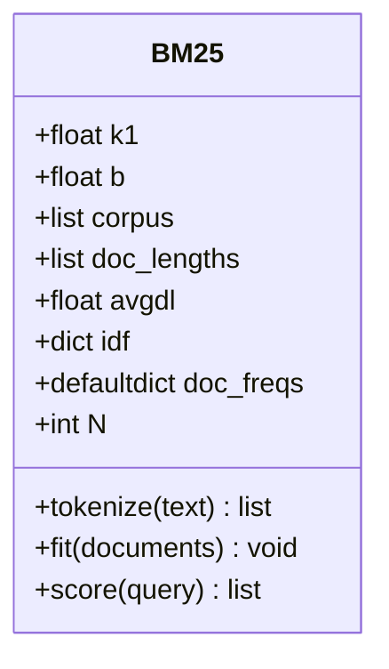

**算法参数：**

| 参数 | 默认值 | 说明 |
|------|--------|------|
| `k1` | 1.5 | 词频饱和参数，控制词频对评分的影响程度 |
| `b` | 0.75 | 文档长度归一化参数，控制文档长度对评分的影响 |

**核心方法说明：**

- **`tokenize(text)`**：将文本转换为小写，移除标点符号，按空格分词，并过滤长度 ≤ 2 的短词。
- **`fit(documents)`**：构建 BM25 索引。计算每个文档的词频、文档频率（DF）和逆文档频率（IDF），以及平均文档长度。
- **`score(query)`**：对查询进行分词后，使用 BM25 公式对所有文档评分，返回按分数降序排列的 `(文档索引, 分数)` 列表。

**BM25 评分公式：**

```
score(q, d) = Σ IDF(qi) × [ tf(qi,d) × (k1 + 1) ] / [ tf(qi,d) + k1 × (1 - b + b × |d| / avgdl) ]
```

其中：
- `IDF(qi) = log((N - df(qi) + 0.5) / (df(qi) + 0.5) + 1)`
- `tf(qi,d)` 为词 `qi` 在文档 `d` 中的出现频率
- `|d|` 为文档 `d` 的长度
- `avgdl` 为所有文档的平均长度

#### 搜索领域配置（CSV_CONFIG）

`core.py` 通过 `CSV_CONFIG` 字典定义了 10 个搜索领域，每个领域指定了对应的 CSV 文件、搜索列和输出列：

| 领域 | CSV 文件 | 搜索列 | 用途 |
|------|----------|--------|------|
| `style` | `styles.csv` | Style Category, Keywords, Best For, Type, AI Prompt Keywords | UI 风格搜索（极简、玻璃态、新拟态等） |
| `color` | `colors.csv` | Product Type, Notes | 配色方案搜索 |
| `chart` | `charts.csv` | Data Type, Keywords, Best Chart Type, Accessibility Notes | 图表类型推荐 |
| `landing` | `landing.csv` | Pattern Name, Keywords, Conversion Optimization, Section Order | 落地页布局模式 |
| `product` | `products.csv` | Product Type, Keywords, Primary Style Recommendation, Key Considerations | 产品类型识别 |
| `ux` | `ux-guidelines.csv` | Category, Issue, Description, Platform | UX 最佳实践指南 |
| `typography` | `typography.csv` | Font Pairing Name, Category, Mood/Style Keywords, Best For, Heading Font, Body Font | 字体配对推荐 |
| `icons` | `icons.csv` | Category, Icon Name, Keywords, Best For | 图标库推荐 |
| `react` | `react-performance.csv` | Category, Issue, Keywords, Description | React 性能优化指南 |
| `web` | `web-interface.csv` | Category, Issue, Keywords, Description | Web 接口最佳实践 |

#### 技术栈配置（STACK_CONFIG）

支持 13 个技术栈的特定指南搜索：

```
html-tailwind, react, nextjs, astro, vue, nuxtjs, nuxt-ui,
svelte, swiftui, react-native, flutter, shadcn, jetpack-compose
```

每个技术栈对应 `data/stacks/` 目录下的一个 CSV 文件，使用统一的搜索列和输出列配置。

#### 核心搜索函数

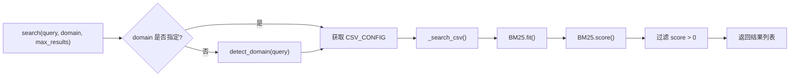

- **`detect_domain(query)`**：基于关键词匹配自动检测查询所属领域。每个领域预定义了一组关键词，通过统计查询中匹配的关键词数量来选择最佳领域。默认回退到 `style`。
- **`search(query, domain, max_results)`**：主搜索函数。若未指定领域则自动检测，加载对应 CSV，构建 BM25 索引并返回排序后的搜索结果。
- **`search_stack(query, stack, max_results)`**：技术栈特定搜索。验证技术栈名称后，使用统一的列配置进行 BM25 搜索。

---

### 设计系统生成器（design_system.py）

`design_system.py` 是技能的核心业务层，通过聚合多域搜索结果并应用推理规则，生成完整的设计系统推荐方案。

#### DesignSystemGenerator 类

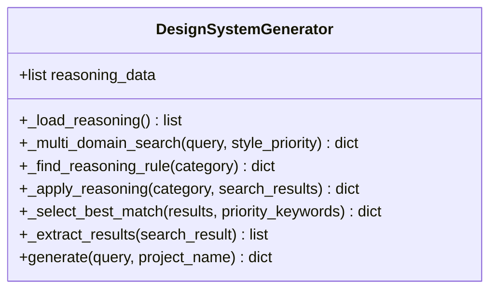

#### 生成流程（generate 方法）

`generate()` 方法是设计系统生成的核心入口，采用 **5 步流水线** 处理：

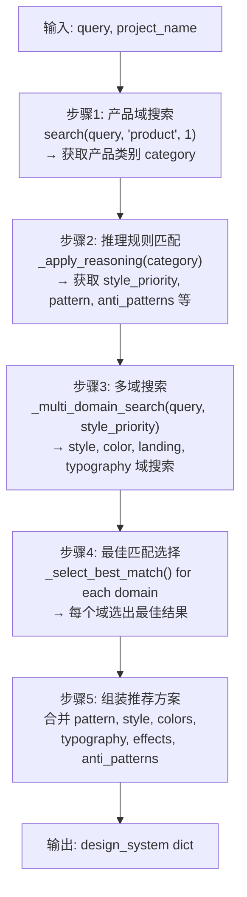

**各步骤详细说明：**

**步骤 1 — 产品类别识别：**
通过 `product` 域搜索确定查询对应的产品类型（如 SaaS、电商、金融科技等），作为后续推理的输入。

**步骤 2 — 推理规则匹配：**
`_find_reasoning_rule()` 方法采用三级匹配策略查找推理规则：
1. **精确匹配**：`UI_Category` 字段与类别完全匹配
2. **部分匹配**：类别字符串互相包含
3. **关键词匹配**：将类别拆分为关键词后逐一匹配

`_apply_reasoning()` 方法将匹配到的规则解析为结构化数据，包括推荐模式、风格优先级、配色情绪、排版情绪、关键效果、反模式、决策规则和严重程度。若未找到匹配规则，返回默认值。

**步骤 3 — 多域搜索：**
`_multi_domain_search()` 方法根据 `SEARCH_CONFIG` 配置同时对 5 个领域进行搜索。对于 `style` 域，会将推理规则中的风格优先级关键词拼接到查询中，以提升搜索精度。

搜索配置：

| 领域 | 最大结果数 | 说明 |
|------|-----------|------|
| `product` | 1 | 产品类型识别 |
| `style` | 3 | UI 风格（含优先级增强） |
| `color` | 2 | 配色方案 |
| `landing` | 2 | 落地页模式 |
| `typography` | 2 | 字体配对 |

**步骤 4 — 最佳匹配选择：**
`_select_best_match()` 方法通过两级评分机制选择最佳结果：
1. **精确名称匹配**：优先级关键词与结果的 `Style Category` 字段互相包含
2. **关键词评分**：对每个结果按字段匹配度评分
   - 风格名称匹配：+10 分
   - 关键词字段匹配：+3 分
   - 其他字段匹配：+1 分

**步骤 5 — 推荐方案组装：**
将各域最佳结果合并为统一的设计系统字典，包含以下结构：

```python
{
    "project_name": str,        # 项目名称
    "category": str,            # 产品类别
    "pattern": {                # 页面布局模式
        "name", "sections", "cta_placement",
        "color_strategy", "conversion"
    },
    "style": {                  # UI 风格
        "name", "type", "effects", "keywords",
        "best_for", "performance", "accessibility"
    },
    "colors": {                 # 配色方案
        "primary", "secondary", "cta",
        "background", "text", "notes"
    },
    "typography": {             # 排版
        "heading", "body", "mood", "best_for",
        "google_fonts_url", "css_import"
    },
    "key_effects": str,         # 关键动效
    "anti_patterns": str,       # 反模式
    "decision_rules": dict,     # 决策规则（JSON）
    "severity": str             # 严重程度
}
```

#### 输出格式化

模块支持两种输出格式：

| 格式 | 函数 | 用途 |
|------|------|------|
| ASCII Box | `format_ascii_box()` | 终端友好的 ASCII 框格式，含预交付检查清单 |
| Markdown | `format_markdown()` | 结构化 Markdown 文档，含表格和代码块 |

两种格式均包含以下内容板块：
- **Pattern**：页面布局模式、转化策略、CTA 位置、区块顺序
- **Style**：风格名称、关键词、适用场景、性能与可访问性
- **Colors**：主色、辅色、CTA 色、背景色、文字色（Hex 值）
- **Typography**：标题字体、正文字体、情绪、Google Fonts 链接、CSS 导入
- **Key Effects**：关键动效描述
- **Anti-patterns**：应避免的设计模式
- **Pre-Delivery Checklist**：预交付检查清单（7 项）

---

## 数据流与处理流程

### 完整数据流

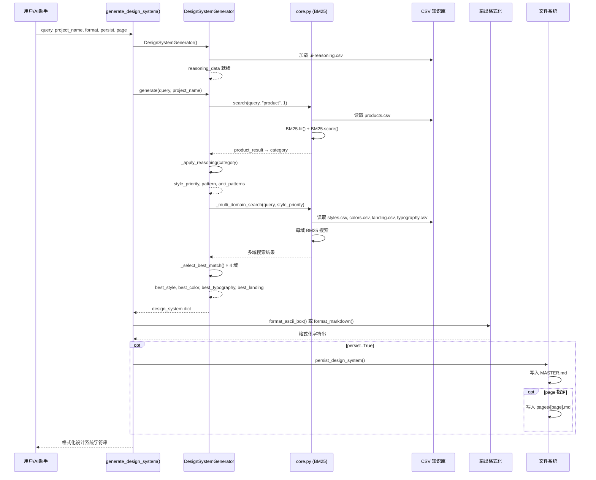

### 搜索域自动检测流程

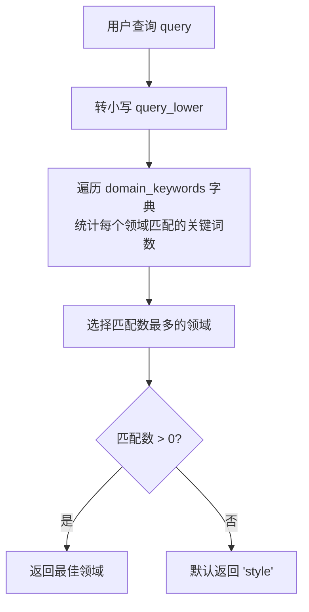

---

## 知识库结构

所有 CSV 数据文件位于各平台技能目录下的 `data/` 文件夹中，通过 `DATA_DIR = Path(__file__).parent.parent / "data"` 定位。

### 知识库领域关系图

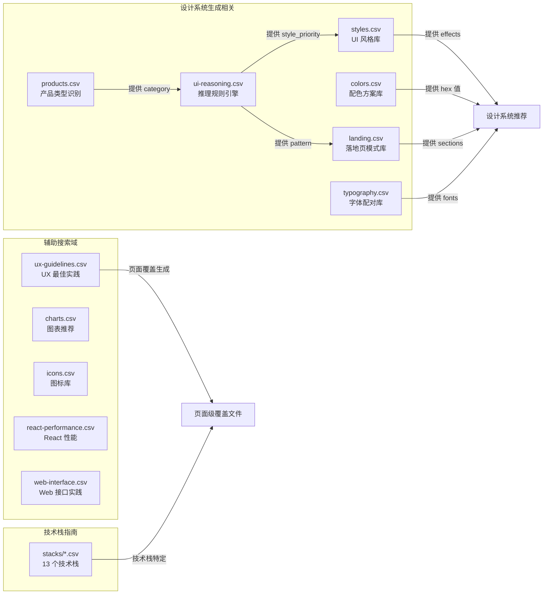

### 推理规则文件（ui-reasoning.csv）

推理规则文件是设计系统生成的"大脑"，包含以下关键字段：

| 字段 | 说明 |
|------|------|
| `UI_Category` | UI 类别名称，用于匹配 |
| `Recommended_Pattern` | 推荐的页面布局模式 |
| `Style_Priority` | 风格优先级（`+` 分隔） |
| `Color_Mood` | 配色情绪倾向 |
| `Typography_Mood` | 排版情绪倾向 |
| `Key_Effects` | 关键动效建议 |
| `Anti_Patterns` | 应避免的反模式 |
| `Decision_Rules` | 决策规则（JSON 格式） |
| `Severity` | 严重程度（LOW/MEDIUM/HIGH） |

---

## 持久化机制

模块支持将生成的设计系统持久化为文件，采用 **Master + Overrides（主文件 + 页面覆盖）** 模式：

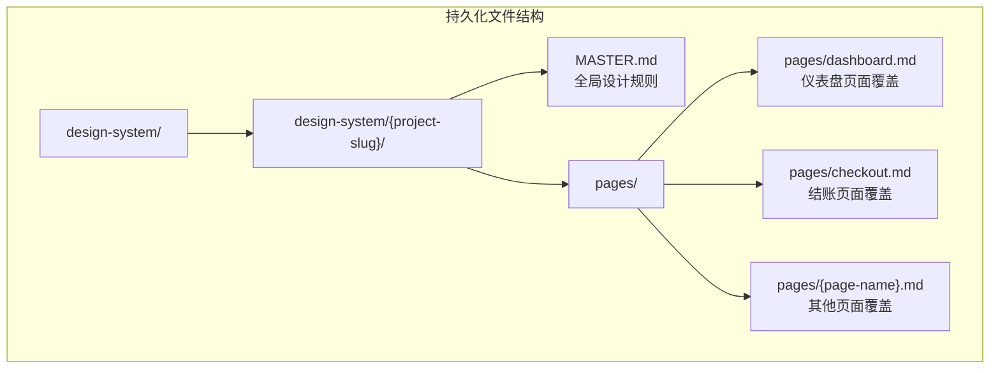

### 覆盖逻辑

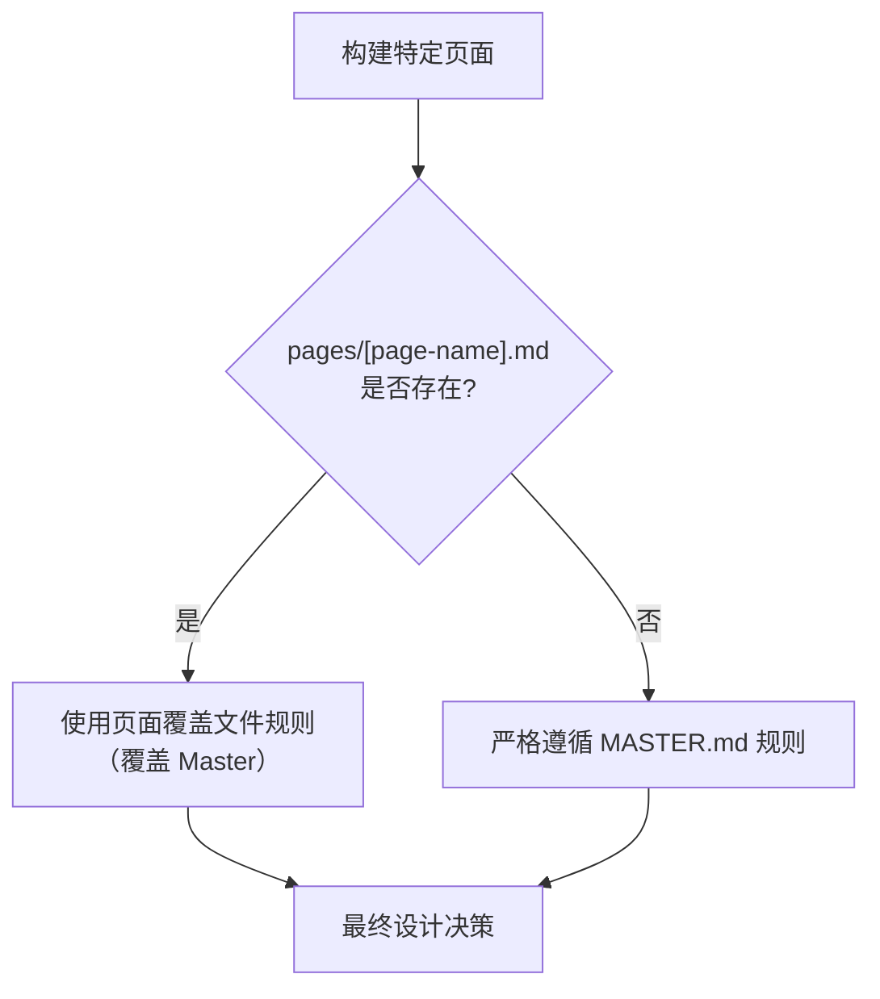

### MASTER.md 内容结构

`format_master_md()` 函数生成的 MASTER.md 包含以下板块：

| 板块 | 内容 |
|------|------|
| **Global Rules** | 全局规则（颜色调色板、排版、间距变量、阴影深度） |
| **Component Specs** | 组件规格（按钮、卡片、输入框、模态框的 CSS 代码） |
| **Style Guidelines** | 风格指南（风格名称、关键词、适用场景、关键动效） |
| **Page Pattern** | 页面模式（模式名称、转化策略、CTA 位置、区块顺序） |
| **Anti-Patterns** | 反模式列表（含通用禁止模式） |
| **Pre-Delivery Checklist** | 预交付检查清单（10 项） |

### 页面覆盖文件生成

`_generate_intelligent_overrides()` 函数通过**分层搜索**生成页面级覆盖内容，而非硬编码页面类型：

1. **组合上下文**：将页面名称和查询合并为搜索上下文
2. **多域搜索**：对 `style`、`ux`、`landing` 三个域进行搜索
3. **页面类型检测**：`_detect_page_type()` 基于关键词模式匹配识别 10 种页面类型
4. **覆盖内容生成**：从搜索结果中提取布局、间距、排版、颜色、组件覆盖及推荐建议

支持的页面类型检测：

| 页面类型 | 触发关键词 |
|----------|-----------|
| Dashboard / Data View | dashboard, admin, analytics, data, metrics, stats |
| Checkout / Payment | checkout, payment, cart, purchase, order |
| Settings / Profile | settings, profile, account, preferences |
| Landing / Marketing | landing, marketing, homepage, hero |
| Authentication | login, signin, signup, register, auth |
| Pricing / Plans | pricing, plans, subscription, tiers |
| Blog / Article | blog, article, post, news, content |
| Product Detail | product, item, detail, pdp, shop |
| Search Results | search, results, browse, filter, catalog |
| Empty State | empty, 404, error, not found |

---

## 跨平台部署

该技能以完全相同的代码部署到三个 AI 编码助手平台：

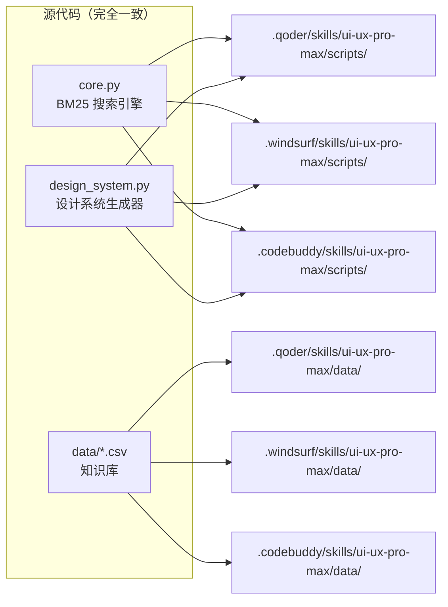

| 平台 | 部署路径 | 说明 |
|------|----------|------|
| Qoder | `.qoder/skills/ui-ux-pro-max/` | Qoder AI 编码助手技能目录 |
| Windsurf | `.windsurf/skills/ui-ux-pro-max/` | Windsurf (Codeium) AI 编码助手技能目录 |
| CodeBuddy | `.codebuddy/skills/ui-ux-pro-max/` | CodeBuddy AI 编码助手技能目录 |

每个平台副本包含：
- `scripts/core.py` — BM25 搜索引擎
- `scripts/design_system.py` — 设计系统生成器
- `data/` — CSV 知识库文件（10 个领域 + 13 个技术栈）

### CLI 支持

`design_system.py` 支持命令行直接调用：

```bash
python design_system.py "SaaS dashboard" --project-name "MyProject" --format markdown
```

| 参数 | 说明 |
|------|------|
| `query` | 搜索查询（位置参数，必填） |
| `--project-name, -p` | 项目名称（可选） |
| `--format, -f` | 输出格式：`ascii`（默认）或 `markdown` |

### API 调用示例

```python
from design_system import generate_design_system

# 基本用法
result = generate_design_system("SaaS dashboard", "My Project")

# Markdown 格式输出
result = generate_design_system("e-commerce luxury", "LuxStore", output_format="markdown")

# 持久化到文件（Master + 页面覆盖）
result = generate_design_system("SaaS dashboard", "My Project", persist=True)
result = generate_design_system("SaaS dashboard", "My Project", persist=True, page="dashboard")
```

---

## 与其他模块的关系

AI Skills 模块是一个**独立的 AI 编码助手技能**，不直接依赖项目的后端或前端代码。但其生成的设计系统可用于指导项目前端界面的开发。

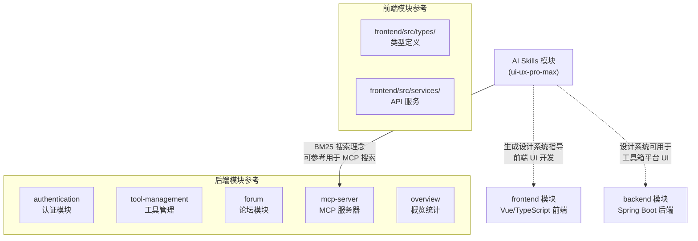

### 关联说明

| 关联模块 | 关系类型 | 说明 |
|----------|----------|------|
| [frontend](frontend.md) | 输出消费者 | AI Skills 生成的设计系统（颜色、排版、组件规格）可直接应用于前端模块的 UI 开发 |
| [mcp-server](mcp-server.md) | 理念参考 | AI Skills 的 BM25 搜索引擎与 MCP 搜索服务（`McpSearchService`）在搜索理念上相似，可互相参考 |
| [tool-management](tool-management.md) | 间接关联 | 工具管理模块的前端界面可使用 AI Skills 生成的设计系统规范 |
| [forum](forum.md) | 间接关联 | 论坛模块的前端界面可使用 AI Skills 生成的设计系统规范 |
| [overview](overview.md) | 间接关联 | 概览仪表盘页面可使用 AI Skills 的 Dashboard 页面类型覆盖 |

### 设计系统在前端中的应用

AI Skills 生成的 MASTER.md 中包含的 CSS 变量和组件规格可直接用于前端项目：

- **CSS 变量**：`--color-primary`、`--color-secondary`、`--space-md` 等
- **组件规格**：按钮（`.btn-primary`、`.btn-secondary`）、卡片（`.card`）、输入框（`.input`）、模态框（`.modal`）
- **响应式断点**：375px、768px、1024px、1440px
- **可访问性规则**：4.5:1 对比度、键盘导航焦点状态、`prefers-reduced-motion`

---

## 组件交互总览

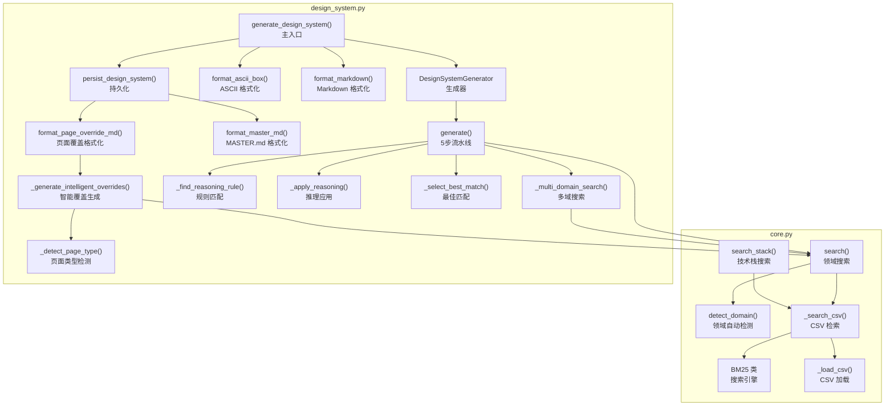

---

## 关键设计决策

### 1. BM25 而非向量搜索

模块选择 BM25 算法而非嵌入向量搜索，原因包括：
- **零依赖**：仅需 Python 标准库（`csv`、`re`、`math`、`collections`），无需安装额外包
- **确定性**：相同输入始终产生相同输出，便于调试和测试
- **知识库规模适中**：CSV 知识库规模较小，BM25 的精确匹配能力优于语义搜索
- **可解释性**：评分基于词频和文档频率，结果可追溯

### 2. 多域搜索 + 推理聚合

采用"先搜索后推理"的策略，而非端到端生成：
- 各域独立搜索，保证结果多样性
- 推理规则作为"胶水"层，将多域结果聚合为连贯的设计系统
- 风格优先级从推理规则反馈到搜索查询，形成闭环优化

### 3. Master + Overrides 持久化模式

采用分层覆盖而非单一文件：
- **MASTER.md** 包含全局设计规则，适用于所有页面
- **页面覆盖文件** 仅记录与 Master 的差异，减少冗余
- 构建特定页面时优先检查覆盖文件，实现灵活的页面级定制

### 4. 跨平台代码一致性

三份代码副本完全一致，确保在不同 AI 编码助手中行为统一。维护时需同步更新三个副本。
