# 认证模块（Authentication）

## 模块简介

认证模块是 IAIHub Toolbox 平台的安全基石，负责用户注册、登录、令牌管理、身份验证以及头像文件管理。该模块基于 **Spring Security + JWT（JSON Web Token）** 实现无状态（Stateless）认证架构，通过 Access Token / Refresh Token 双令牌机制保障安全性与用户体验的平衡。

### 核心能力

| 能力 | 说明 |
|------|------|
| 用户注册 | 校验用户名/昵称唯一性，BCrypt 加密密码，注册后直接签发令牌 |
| 用户登录 | 凭证校验，更新最后登录时间，签发双令牌 |
| 令牌刷新 | 使用 Refresh Token 获取新的 Access Token |
| JWT 认证过滤 | 拦截请求，解析 Bearer Token，注入 SecurityContext |
| 安全策略配置 | 路由级权限控制、CORS 跨域、CSRF 禁用、无状态会话 |
| 用户资料管理 | 当前用户信息、公开用户资料查询 |
| 头像管理 | 上传、删除、静态资源服务，含安全校验与路径穿越防护 |

---

## 架构总览

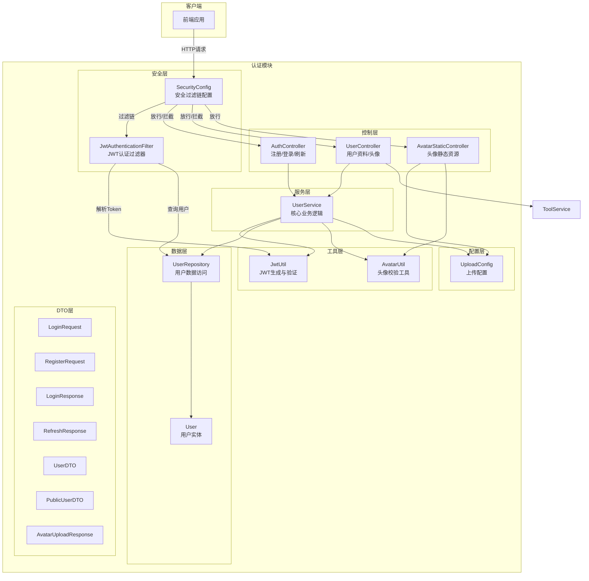

---

## 组件详解

### 1. 安全配置层

#### SecurityConfig

`SecurityConfig` 是 Spring Security 的核心配置类，定义了整个应用的安全策略。

**关键配置项：**

| 配置 | 值 | 说明 |
|------|-----|------|
| CSRF | 禁用 | 无状态 API 不需要 CSRF 保护 |
| 会话策略 | `STATELESS` | 不创建 HTTP Session，完全依赖 JWT |
| CORS | 全局允许 | 允许所有来源、标准 HTTP 方法、凭证 |
| 密码编码器 | `BCryptPasswordEncoder` | 单向哈希加密 |

**路由权限矩阵：**

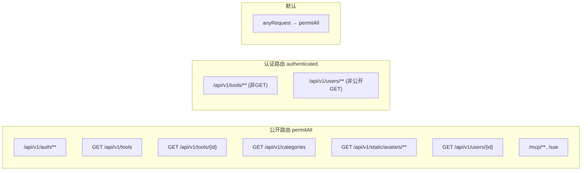

**过滤器链顺序：**

```
请求 → CorsFilter → JwtAuthenticationFilter → UsernamePasswordAuthenticationFilter → Controller
```

`JwtAuthenticationFilter` 被添加在 `UsernamePasswordAuthenticationFilter` 之前，确保在每个请求到达 Controller 之前完成 JWT 认证。

---

#### JwtAuthenticationFilter

继承 `OncePerRequestFilter`，每个请求只执行一次。

**处理流程：**

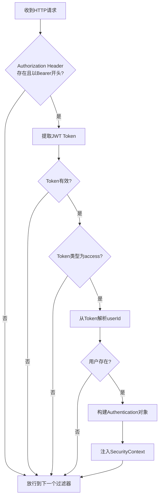

**核心逻辑说明：**

- 从 `Authorization` 请求头提取 `Bearer <token>` 格式的 JWT
- 仅接受 `type=access` 的令牌，拒绝 Refresh Token 用于接口认证
- 认证成功后，将 `User` 实体作为 Principal 注入 `SecurityContextHolder`
- Controller 层可通过 `@AuthenticationPrincipal User` 直接获取当前用户
- 任何异常都不会中断请求，仅记录日志后放行（未认证请求由授权层拦截）

---

### 2. JWT 工具层

#### JwtUtil

负责 JWT 的生成、解析与验证，使用 `io.jsonwebtoken`（JJWT）库实现。

**令牌结构：**

```json
{
  "sub": "用户ID",
  "email": "用户名",
  "type": "access | refresh",
  "iat": 签发时间,
  "exp": 过期时间
}
```

**双令牌机制：**

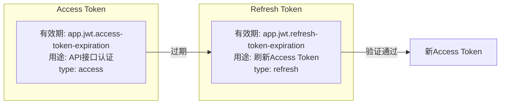

**配置参数（application.yml）：**

```yaml
app:
  jwt:
    secret: ${JWT_SECRET}                    # HMAC-SHA 签名密钥
    access-token-expiration: 3600000         # Access Token 有效期（毫秒）
    refresh-token-expiration: 604800000      # Refresh Token 有效期（毫秒）
```

**核心方法：**

| 方法 | 功能 |
|------|------|
| `generateAccessToken(userId, email)` | 生成 Access Token |
| `generateRefreshToken(userId, email)` | 生成 Refresh Token |
| `validateToken(token)` | 验证签名与有效期 |
| `isRefreshToken(token)` | 判断是否为 Refresh Token |
| `getUserIdFromToken(token)` | 从 Token 提取用户 ID |
| `parseToken(token)` | 解析 Token 返回 Claims |

---

### 3. 服务层

#### UserService

认证模块的核心业务服务，整合用户管理、令牌生成与头像处理。

**方法总览：**

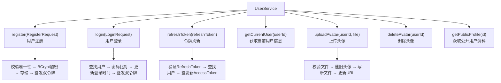

**注册流程详解：**

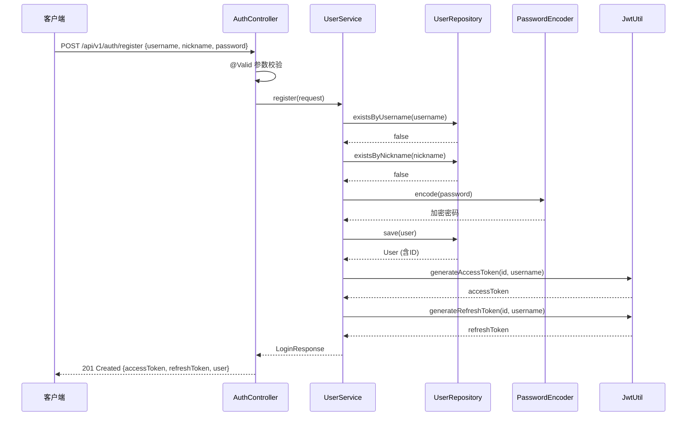

**登录流程详解：**

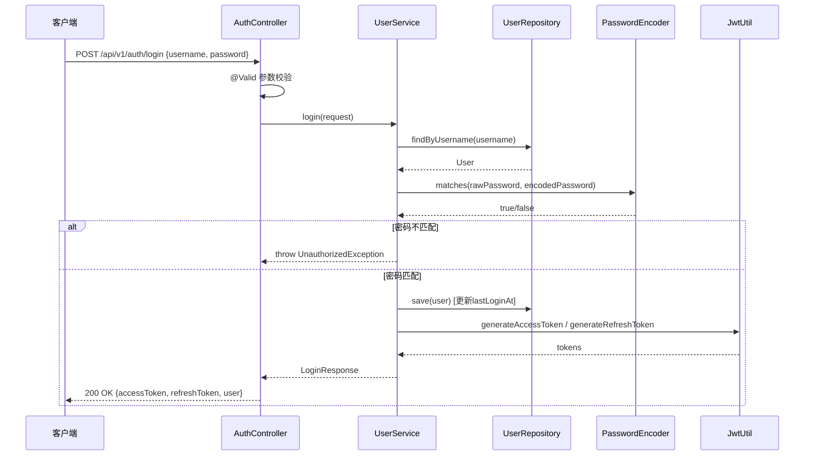

**令牌刷新流程：**

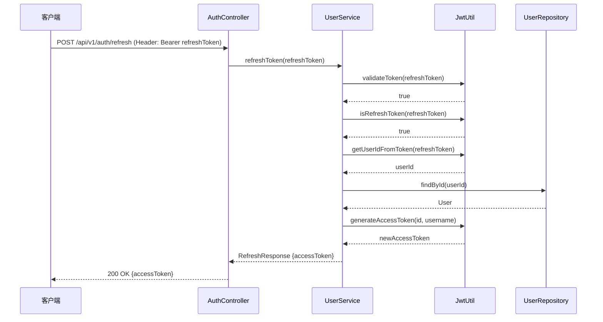

---

### 4. 控制器层

#### AuthController

认证端点控制器，路由前缀 `/api/v1/auth`。

| 端点 | 方法 | 认证 | 请求体 | 响应 | 说明 |
|------|------|------|--------|------|------|
| `/register` | POST | 公开 | `RegisterRequest` | `201 LoginResponse` | 注册并返回令牌 |
| `/login` | POST | 公开 | `LoginRequest` | `200 LoginResponse` | 登录并返回令牌 |
| `/refresh` | POST | 公开 | Header: `Authorization: Bearer <refreshToken>` | `200 RefreshResponse` | 刷新 Access Token |

#### UserController

用户管理控制器，路由前缀 `/api/v1/users`。

| 端点 | 方法 | 认证 | 说明 |
|------|------|------|------|
| `/me` | GET | 认证 | 获取当前登录用户完整信息 |
| `/me/tools` | GET | 认证 | 获取当前用户发布的工具列表（分页） |
| `/me/avatar` | POST | 认证 | 上传头像（multipart/form-data） |
| `/me/avatar` | DELETE | 认证 | 删除头像 |
| `/{id}` | GET | 公开 | 获取指定用户的公开资料 |

> `/me/tools` 端点依赖 [工具管理模块](tool-management.md) 的 `ToolService.getMyTools()` 方法。

#### AvatarStaticController

头像静态资源服务控制器，路由前缀 `/api/v1/static/avatars`。

| 端点 | 方法 | 认证 | 说明 |
|------|------|------|------|
| `/{userId}` | GET | 公开 | 获取用户头像图片 |

**头像服务逻辑：**

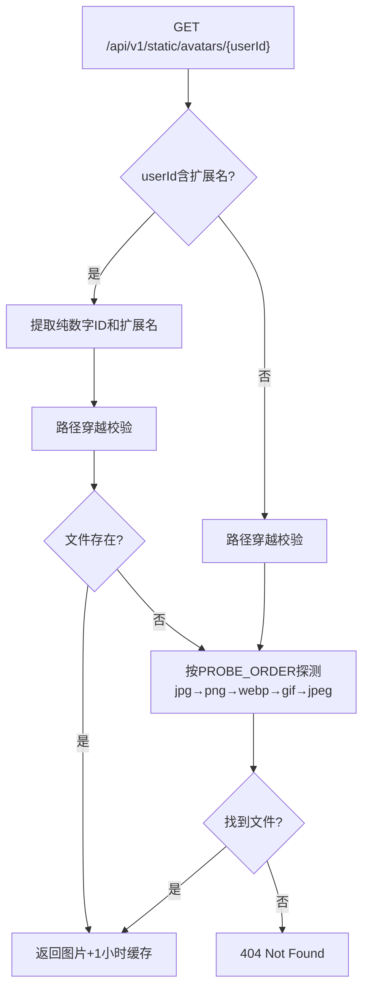

**安全措施：**
- `AvatarUtil.validatePathSafe()` 校验 userId 为纯数字，防止路径穿越攻击
- 设置 1 小时 HTTP 缓存（`Cache-Control: max-age=3600, public`）
- 根据扩展名设置正确的 `Content-Type`

---

### 5. 数据模型层

#### User 实体

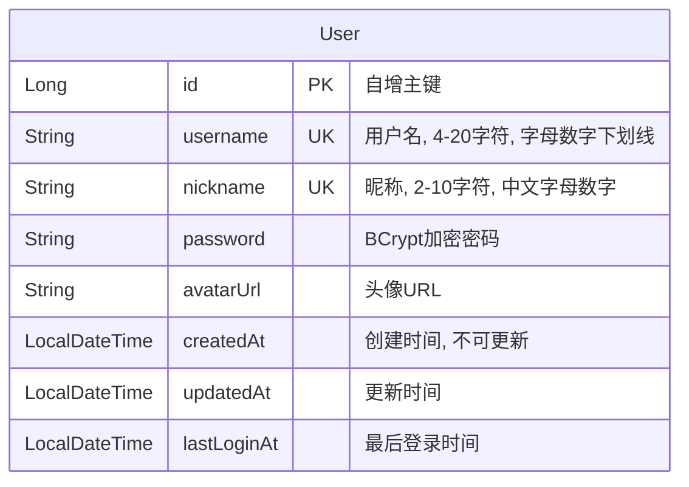

**数据库索引：**
- `idx_user_username`：username 唯一索引
- `idx_user_nickname`：nickname 唯一索引

**生命周期回调：**
- `@PrePersist`：创建时自动设置 `createdAt` 和 `updatedAt`
- `@PreUpdate`：更新时自动设置 `updatedAt`

#### UserRepository

| 方法 | 说明 |
|------|------|
| `findByUsername(username)` | 按用户名查找用户 |
| `findByNickname(nickname)` | 按昵称查找用户 |
| `existsByUsername(username)` | 检查用户名是否已存在 |
| `existsByNickname(nickname)` | 检查昵称是否已存在 |
| `findById(id)` | 继承自 JpaRepository，按 ID 查找 |

---

### 6. DTO 层

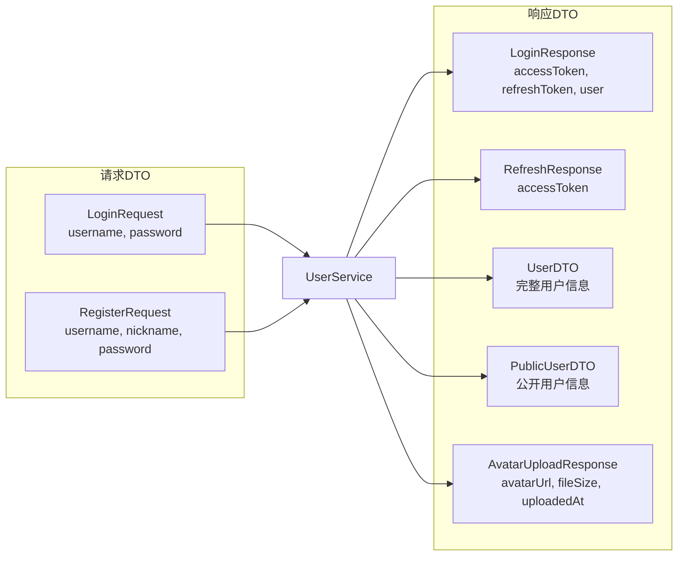

**DTO 字段对比：**

| 字段 | UserDTO（认证用户） | PublicUserDTO（公开） |
|------|:---:|:---:|
| id | ✅ | ✅ |
| username | ✅ | ✅ |
| nickname | ✅ | ✅ |
| avatarUrl | ✅ | ✅ |
| createdAt | ✅ | ✅ |
| lastLoginAt | ✅ | ❌ |

**RegisterRequest 校验规则：**

| 字段 | 规则 |
|------|------|
| username | 非空，4-20字符，仅字母/数字/下划线 |
| nickname | 非空，2-10字符，仅中文/字母/数字 |
| password | 非空，最少6位 |

---

### 7. 头像管理子系统

#### AvatarUtil

头像文件安全校验工具类，提供以下能力：

| 方法 | 功能 |
|------|------|
| `validateAndGetExtension(file)` | 校验文件非空、扩展名白名单、MIME 类型匹配 |
| `validatePathSafe(userIdStr)` | 校验用户 ID 为纯数字，防止路径穿越 |
| `normalizeExt(ext)` | 标准化扩展名（`jpeg` → `jpg`） |

**安全策略：**

| 类别 | 内容 |
|------|------|
| 允许的扩展名 | `jpg`, `jpeg`, `png`, `webp`, `gif` |
| 危险扩展名（拒绝） | `svg`, `html`, `htm`, `xml`, `js` |
| 允许的 MIME 类型 | `image/jpeg`, `image/png`, `image/webp`, `image/gif` |

#### UploadConfig

上传配置类，通过 `app.upload` 前缀绑定配置属性。

| 属性 | 默认值 | 说明 |
|------|--------|------|
| `baseDir` | `~/aifiles` | 上传根目录 |
| `maxFileSize` | `50MB` | 通用文件最大大小 |
| `maxRequestSize` | `200MB` | 请求最大大小 |
| `avatarSubdir` | `avatars` | 头像子目录名 |
| `avatarMaxFileSize` | `2MB` | 头像文件最大大小 |
| `avatarAllowedExtensions` | `jpg,jpeg,png,webp,gif` | 头像允许的扩展名 |

**初始化流程（`@PostConstruct`）：**

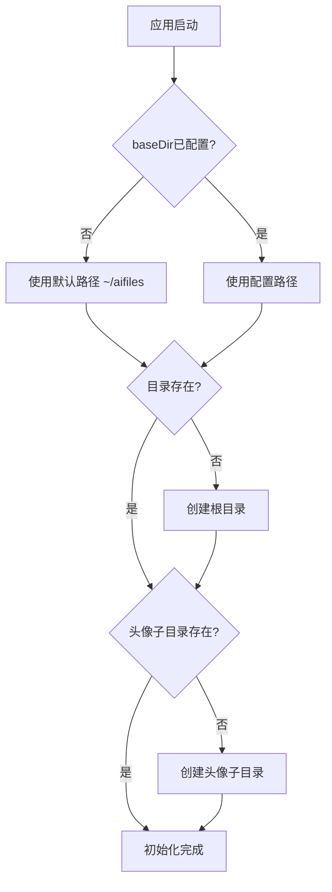

**头像上传完整流程：**

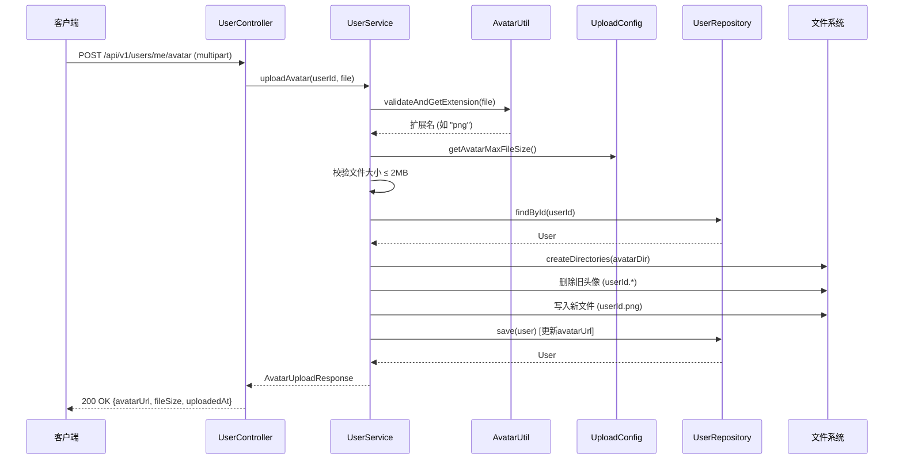

---

## 认证完整流程

### 端到端认证时序

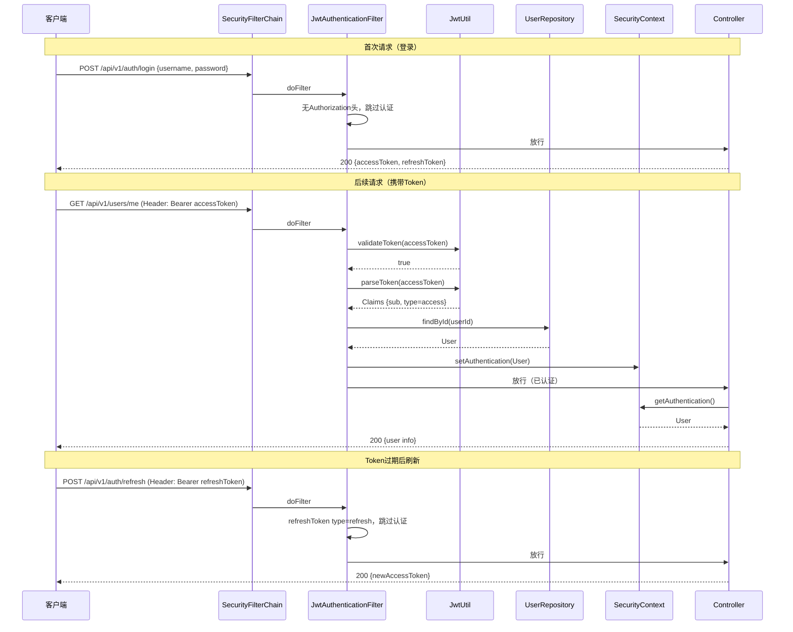

---

## 异常处理

认证模块涉及的自定义异常：

| 异常类 | 触发场景 | HTTP 状态码 |
|--------|----------|-------------|
| `UnauthorizedException` | 用户名/密码错误、无效刷新令牌、用户不存在 | 401 |
| `DuplicateResourceException` | 用户名或昵称已被注册 | 409 |
| `UserNotFoundException` | 头像操作时用户不存在 | 404 |
| `AvatarValidationException` | 头像文件格式/大小/MIME 不合法、未登录 | 400 |

---

## 模块依赖关系

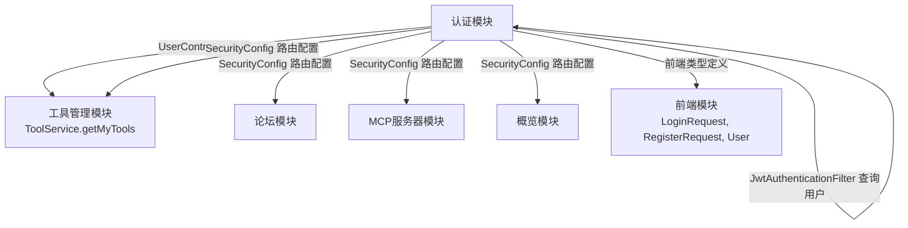

> 认证模块作为基础设施层，被 [工具管理模块](tool-management.md)、[论坛模块](forum.md)、[MCP服务器模块](mcp-server.md)、[概览模块](overview.md) 等业务模块依赖。所有需要认证的接口均通过 `@AuthenticationPrincipal User` 获取当前用户身份。

---

## API 端点汇总

### 认证端点（`/api/v1/auth`）

```yaml
POST /api/v1/auth/register:
  request: RegisterRequest {username, nickname, password}
  response: 201 ApiResponse<LoginResponse>
  auth: 公开

POST /api/v1/auth/login:
  request: LoginRequest {username, password}
  response: 200 ApiResponse<LoginResponse>
  auth: 公开

POST /api/v1/auth/refresh:
  header: Authorization: Bearer <refreshToken>
  response: 200 ApiResponse<RefreshResponse>
  auth: 公开
```

### 用户端点（`/api/v1/users`）

```yaml
GET /api/v1/users/me:
  response: 200 ApiResponse<UserDTO>
  auth: 认证

GET /api/v1/users/me/tools:
  params: categoryId?, keyword?, sortBy=latest, page=0, size=12
  response: 200 ApiResponse<PageResponse<ToolSummaryDTO>>
  auth: 认证

POST /api/v1/users/me/avatar:
  request: multipart/form-data (avatar)
  response: 200 ApiResponse<AvatarUploadResponse>
  auth: 认证

DELETE /api/v1/users/me/avatar:
  response: 200 ApiResponse<Void>
  auth: 认证

GET /api/v1/users/{id}:
  response: 200 ApiResponse<PublicUserDTO>
  auth: 公开
```

### 头像静态资源（`/api/v1/static/avatars`）

```yaml
GET /api/v1/static/avatars/{userId}:
  pathvar: userId (数字或 数字.扩展名)
  response: 图片二进制流 (image/*)
  cache: max-age=3600, public
  auth: 公开
```

---

## 安全设计要点

### 1. 密码安全
- 使用 `BCryptPasswordEncoder` 进行密码哈希，每次加密生成不同盐值
- 密码明文从不存储、不返回、不记录日志

### 2. JWT 安全
- HMAC-SHA 签名，密钥通过配置注入
- Access Token 与 Refresh Token 通过 `type` claim 区分
- `JwtAuthenticationFilter` 仅接受 `type=access` 的令牌
- Token 验证失败时静默放行，由授权层决定是否拒绝

### 3. 头像上传安全
- 扩展名白名单 + MIME 类型双重校验
- 危险扩展名（svg/html/js 等）显式拒绝
- 文件大小限制（默认 2MB）
- 路径穿越防护（userId 纯数字校验）
- 文件以 `{userId}.{ext}` 命名存储，避免文件名注入

### 4. CORS 配置
- 允许所有来源（`*` pattern）
- 允许凭证（`allowCredentials=true`）
- 预检请求缓存 1 小时（`maxAge=3600`）

### 5. 用户信息隔离
- `UserDTO`：包含 `lastLoginAt` 等敏感字段，仅返回给认证用户自身
- `PublicUserDTO`：仅包含公开信息，可供其他用户查看
- `password` 字段在任何 DTO 中均不暴露
