# 论坛模块（Forum）文档

## 概述

论坛模块是 IAIHub Toolbox 平台的社区交流核心，提供帖子发布、评论互动、点赞、收藏、标签管理和分类浏览等完整的社区功能。模块采用分层架构设计，包含数据模型层（Model）、数据访问层（Repository）、业务逻辑层（Service）和接口控制层（Controller），支持登录用户和匿名访客两种身份的差异化交互。

---

## 架构总览

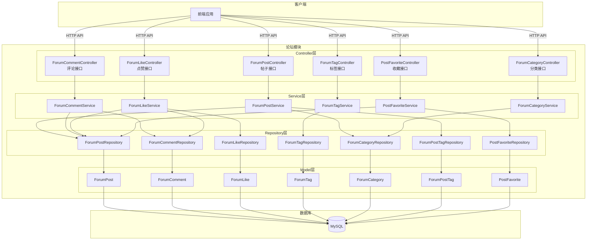

---

## 数据模型

### 实体关系图

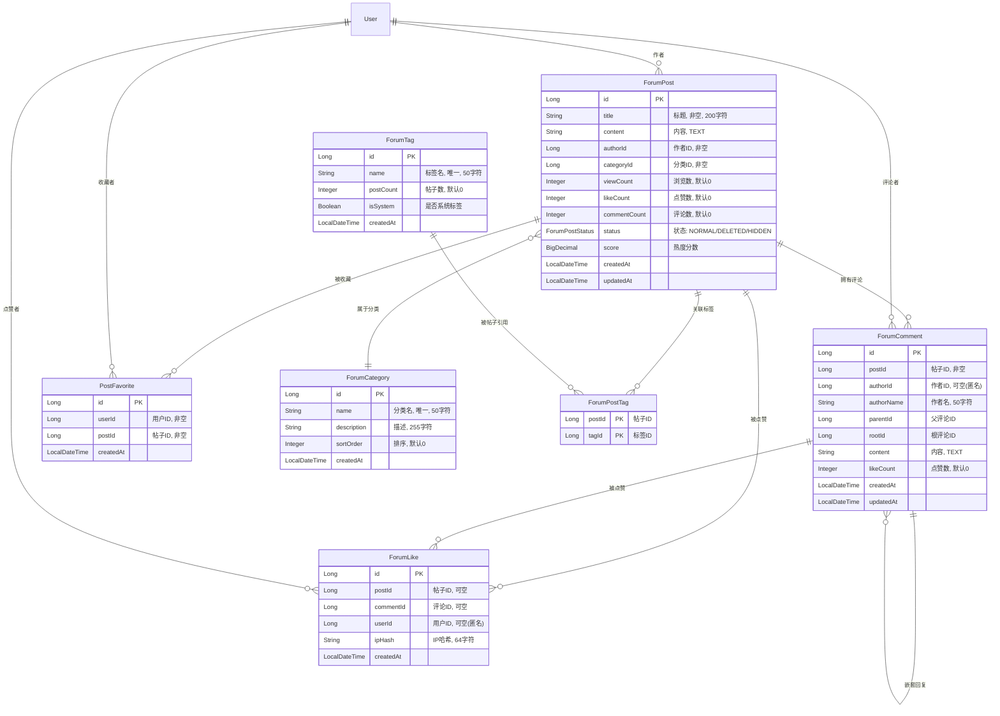

### 帖子状态枚举（ForumPostStatus）

| 状态值 | 说明 |
|--------|------|
| `NORMAL` | 正常状态，可见可交互 |
| `DELETED` | 已删除（软删除），列表不展示 |
| `HIDDEN` | 已隐藏，列表不展示 |

### 热度评分算法

`ForumPost` 实体内置了热度评分计算方法，评分公式为：

```
score = viewCount × 1 + likeCount × 3 + commentCount × 5
```

该评分用于 [overview 模块](overview.md) 的帖子排行榜功能，按分类对帖子进行热度排名。

---

## Service 层详解

### 1. ForumPostService — 帖子服务

负责帖子的完整生命周期管理，包括创建、查询、更新、删除（软删除）。

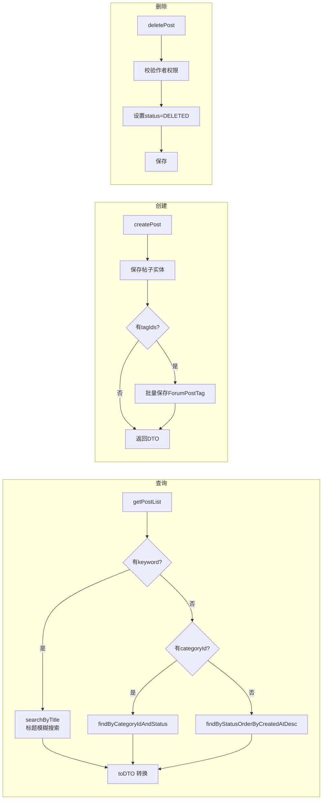

**核心方法：**

| 方法 | 说明 | 事务 |
|------|------|------|
| `getPostList(categoryId, keyword, pageable)` | 分页查询帖子列表，支持按分类筛选和标题搜索 | 否 |
| `getMyPosts(userId, pageable)` | 查询指定用户的帖子 | 否 |
| `getPostById(id)` | 获取帖子详情，**自动增加浏览数** | 否 |
| `createPost(authorId, request)` | 创建帖子并关联标签 | 是 |
| `updatePost(postId, userId, request)` | 更新帖子（仅作者可操作） | 是 |
| `deletePost(postId, userId)` | 软删除帖子（仅作者可操作） | 是 |

> **权限控制**：更新和删除操作通过比较 `post.getAuthorId()` 与当前用户 ID 实现所有权校验，不匹配时抛出 `ForbiddenException`。

### 2. ForumCommentService — 评论服务

支持评论的创建、回复（嵌套）和删除，并维护帖子的评论计数。

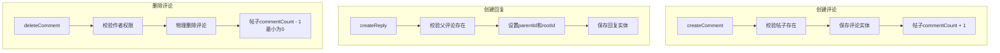

**嵌套回复设计：**

评论采用两级嵌套模型，通过 `parentId` 和 `rootId` 实现：

- **`parentId`**：直接父评论的 ID
- **`rootId`**：根评论的 ID（若回复的是根评论，则 `rootId = parentId`；若回复的是子评论，则 `rootId` 继承父评论的 `rootId`）

这种设计允许前端通过 `rootId` 将同一讨论线程下的所有评论聚合展示。

> **匿名评论支持**：当用户未登录时，`authorId` 为 `null`，使用 `authorName` 作为匿名标识。已登录用户的 `authorName` 会被置为 `null`，以 `authorId` 为准。

### 3. ForumLikeService — 点赞服务

支持帖子和评论的点赞/取消点赞，同时兼容登录用户和匿名访客。

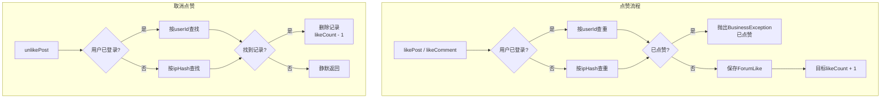

**防重复点赞机制：**

| 身份 | 去重标识 | 说明 |
|------|----------|------|
| 登录用户 | `userId` | 每个用户对同一帖子/评论只能点赞一次 |
| 匿名访客 | `ipHash` | 同一 IP 对同一帖子/评论只能点赞一次 |

> **IP 哈希处理**：在 `ForumLikeController` 中，匿名用户的 IP 地址通过 SHA-256 哈希处理后存储，保护用户隐私的同时实现去重。

### 4. ForumTagService — 标签服务

| 方法 | 说明 |
|------|------|
| `getAllTags()` | 获取全部标签列表 |
| `getHotTags()` | 获取热门标签（按 `postCount` 降序取前 10） |
| `createTag(name, isSystem)` | 创建标签，重名时抛出 `DuplicateResourceException` |

### 5. ForumCategoryService — 分类服务

提供论坛分类的查询功能，按 `sortOrder` 升序返回所有分类。

### 6. PostFavoriteService — 收藏服务

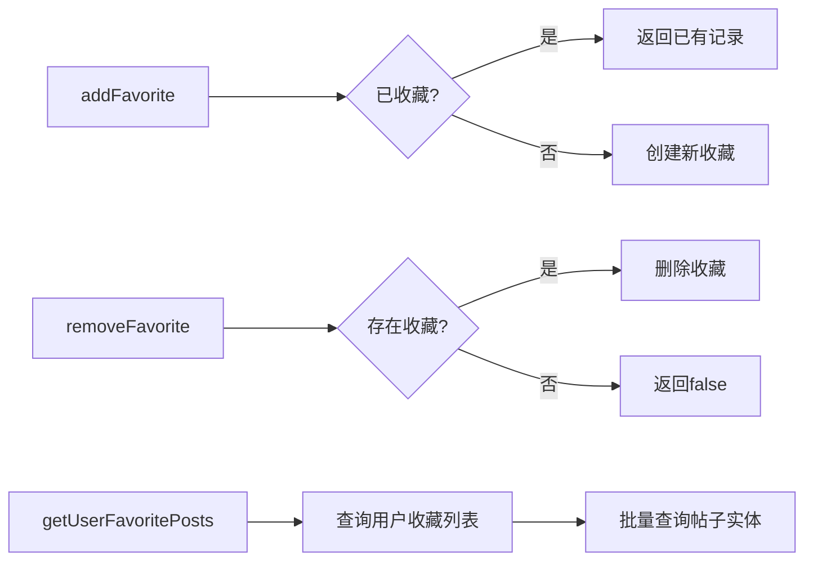

收藏服务通过 `PostFavorite` 实体的唯一约束（`user_id` + `post_id`）保证幂等性，重复收藏不会创建多条记录。

---

## Controller 层 — API 接口

### 接口总览

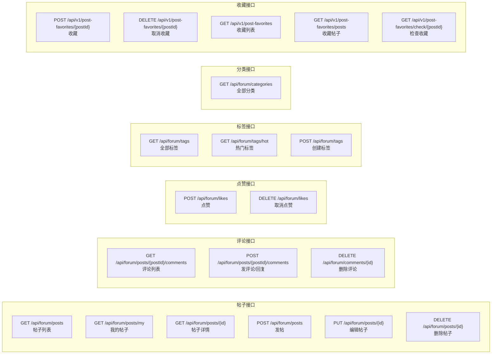

### 接口详情

#### 帖子接口（ForumPostController）

| 方法 | 路径 | 认证 | 参数 | 说明 |
|------|------|------|------|------|
| GET | `/api/forum/posts` | 否 | `category`, `tag`, `keyword`, `page`(默认0), `size`(默认10) | 分页查询帖子列表 |
| GET | `/api/forum/posts/my` | **是** | `page`, `size` | 查询当前用户的帖子 |
| GET | `/api/forum/posts/{id}` | 否 | — | 获取帖子详情（自动+1浏览数） |
| POST | `/api/forum/posts` | **是** | `ForumPostCreateRequest` | 创建帖子 |
| PUT | `/api/forum/posts/{id}` | **是** | `ForumPostCreateRequest` | 更新帖子（仅作者） |
| DELETE | `/api/forum/posts/{id}` | **是** | — | 删除帖子（仅作者，软删除） |

#### 评论接口（ForumCommentController）

| 方法 | 路径 | 认证 | 参数 | 说明 |
|------|------|------|------|------|
| GET | `/api/forum/posts/{postId}/comments` | 否 | — | 获取帖子的全部评论 |
| POST | `/api/forum/posts/{postId}/comments` | 可选 | `ForumCommentCreateRequest` | 发表评论或回复（含 `parentId` 时为回复） |
| DELETE | `/api/forum/comments/{id}` | **是** | — | 删除评论（仅作者） |

#### 点赞接口（ForumLikeController）

| 方法 | 路径 | 认证 | 参数 | 说明 |
|------|------|------|------|------|
| POST | `/api/forum/likes` | 可选 | `ForumLikeRequest` | 点赞帖子或评论 |
| DELETE | `/api/forum/likes` | 可选 | `ForumLikeRequest` | 取消点赞帖子 |

> `ForumLikeRequest` 中 `postId` 和 `commentId` 二选一，不可同时为空或同时有值（构造时校验）。

#### 标签接口（ForumTagController）

| 方法 | 路径 | 认证 | 参数 | 说明 |
|------|------|------|------|------|
| GET | `/api/forum/tags` | 否 | — | 获取全部标签 |
| GET | `/api/forum/tags/hot` | 否 | — | 获取热门标签 Top 10 |
| POST | `/api/forum/tags` | 可选 | `TagCreateRequest{name, isSystem}` | 创建标签 |

#### 分类接口（ForumCategoryController）

| 方法 | 路径 | 认证 | 说明 |
|------|------|------|------|
| GET | `/api/forum/categories` | 否 | 获取全部分类（按 sortOrder 排序） |

#### 收藏接口（PostFavoriteController）

| 方法 | 路径 | 认证 | 说明 |
|------|------|------|------|
| POST | `/api/v1/post-favorites/{postId}` | **是** | 收藏帖子 |
| DELETE | `/api/v1/post-favorites/{postId}` | **是** | 取消收藏 |
| GET | `/api/v1/post-favorites` | **是** | 获取用户收藏列表 |
| GET | `/api/v1/post-favorites/posts` | **是** | 获取用户收藏的帖子实体列表 |
| GET | `/api/v1/post-favorites/check/{postId}` | **是** | 检查是否已收藏 |

> **认证差异**：收藏接口通过 `HttpServletRequest` 手动解析 JWT Token 获取用户 ID（依赖 `JwtUtil`），而其他论坛接口使用 Spring Security 的 `@AuthenticationPrincipal User` 注解。详见 [authentication 模块](authentication.md)。

---

## DTO 数据传输对象

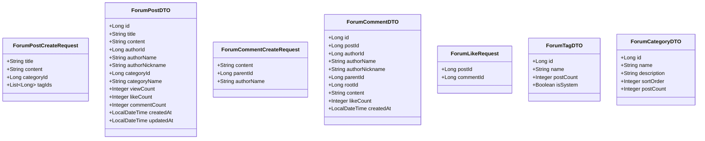

---

## 核心业务流程

### 发帖流程

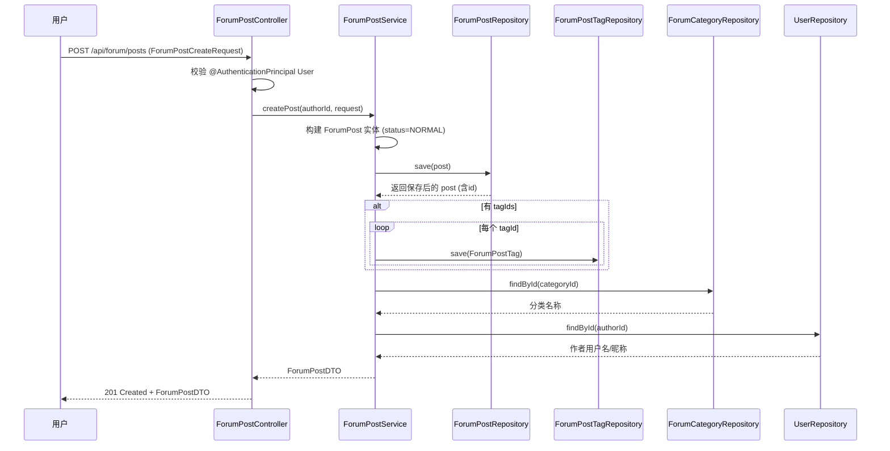

### 评论与嵌套回复流程

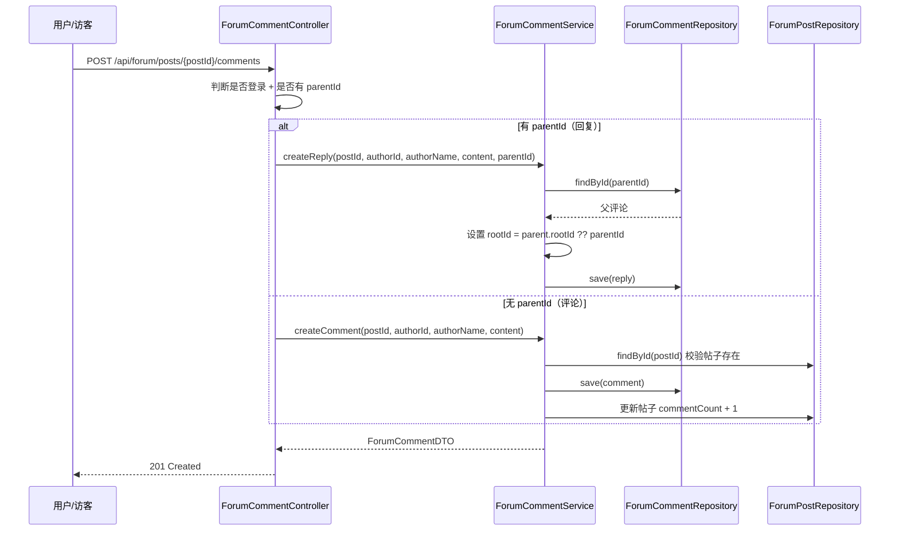

### 点赞流程（登录用户 vs 匿名用户）

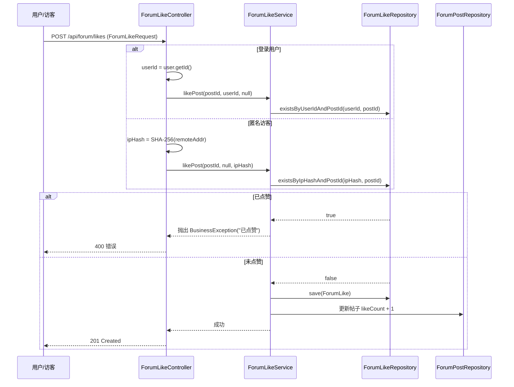

---

## 跨模块依赖

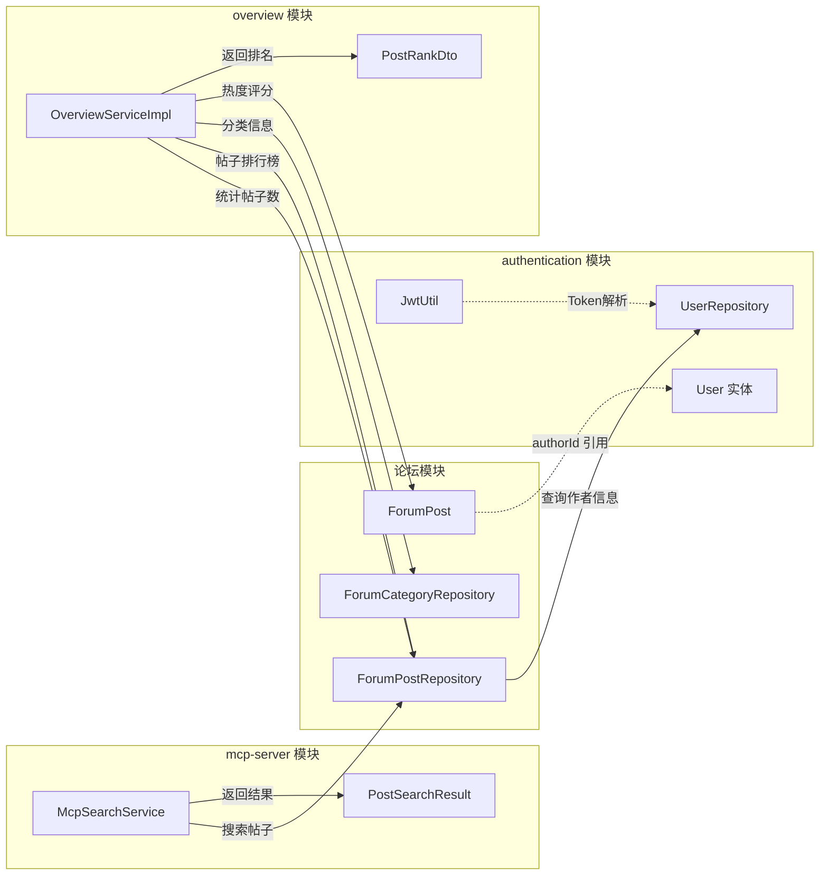

### 依赖说明

| 依赖方向 | 说明 | 参考文档 |
|----------|------|----------|
| forum → authentication | 帖子和评论通过 `authorId` 关联 `User` 实体；收藏接口使用 `JwtUtil` 解析 Token | [authentication.md](authentication.md) |
| mcp-server → forum | `McpSearchService` 调用 `ForumPostRepository` 搜索帖子，返回 `PostSearchResult` | [mcp-server.md](mcp-server.md) |
| overview → forum | `OverviewServiceImpl` 统计帖子总数、按分类生成帖子热度排行榜（使用 `ForumPost.score`） | [overview.md](overview.md) |

---

## 数据库索引设计

| 表名 | 索引名 | 索引列 | 用途 |
|------|--------|--------|------|
| `forum_post` | `idx_forum_post_author` | `author_id` | 加速按作者查询帖子 |
| `forum_post` | `idx_forum_post_category` | `category_id` | 加速按分类筛选帖子 |
| `forum_post` | `idx_forum_post_created` | `created_at` | 加速按时间排序查询 |
| `forum_comment` | `idx_forum_comment_post` | `post_id` | 加速按帖子查询评论 |
| `forum_comment` | `idx_forum_comment_root` | `root_id` | 加速按根评论聚合回复线程 |
| `post_favorites` | 唯一约束 | `user_id, post_id` | 防止重复收藏 |

---

## 前端类型映射

论坛模块的前端类型定义在 `frontend/src/types/forum.ts` 中，与后端 DTO 保持一一对应：

| 后端 DTO | 前端接口 | 差异说明 |
|----------|----------|----------|
| `ForumPostDTO` | `ForumPost` | 前端额外包含 `authorAvatarUrl`、`isFavorited`、`favoriteCount` 字段 |
| `ForumCategoryDTO` | `ForumCategory` | 完全一致 |
| `ForumTagDTO` | `ForumTag` | 完全一致 |
| `ForumPostCreateRequest` | `ForumPostCreateRequest` | 完全一致 |
| `ForumCommentCreateRequest` | `ForumCommentCreateRequest` | 完全一致 |
| `ForumLikeRequest` | `ForumLikeRequest` | 完全一致 |
| `ForumCommentDTO` | `ForumComment` | 完全一致 |
| Spring `Page<T>` | `PageResponse<T>` | 字段映射：`content`/`totalElements`/`totalPages`/`size`/`number` |

---

## 设计要点总结

1. **软删除策略**：帖子删除采用状态标记（`DELETED`）而非物理删除，保留数据可追溯性；评论删除为物理删除。
2. **双身份支持**：点赞和评论功能同时支持登录用户（`userId`）和匿名访客（`ipHash`/`authorName`），降低参与门槛。
3. **计数冗余**：帖子的 `viewCount`、`likeCount`、`commentCount` 作为冗余字段存储，避免实时聚合查询，但需在相关操作中同步维护。
4. **嵌套评论模型**：通过 `parentId` + `rootId` 两级引用实现评论线程，支持无限深度的回复展示。
5. **热度评分**：帖子内置 `score` 字段和 `updateScore()` 方法，采用加权公式（浏览×1 + 点赞×3 + 评论×5）量化热度，供排行榜使用。
6. **标签多对多**：通过 `ForumPostTag` 关联表实现帖子与标签的多对多关系，使用复合主键（`postId` + `tagId`）。
