# 前端模块文档（Frontend）

## 简介

CodingHub 前端是一个基于 **Vue 3 + TypeScript + Vite** 构建的单页应用（SPA），为 AI 工具广场平台提供完整的用户交互界面。前端集成了工具管理、论坛社区、数据概览、用户认证等核心功能，通过 RESTful API 与后端进行通信，并支持 MCP（Model Context Protocol）服务器配置以实现与 AI 编程助手的集成。

### 技术栈

| 技术 | 版本 | 用途 |
|------|------|------|
| Vue 3 | ^3.4.21 | 前端框架（Composition API） |
| TypeScript | ^5.4.5 | 类型安全 |
| Vite | ^5.2.8 | 构建工具与开发服务器 |
| Vue Router | ^4.3.0 | 客户端路由 |
| Pinia | ^2.1.7 | 状态管理 |
| Axios | ^1.6.8 | HTTP 请求 |
| Element Plus | ^2.7.0 | UI 组件库 |
| Lucide Vue | ^1.17.0 | 图标库 |
| Markdown-it | ^14.1.0 | Markdown 渲染 |
| Highlight.js | ^11.9.0 | 代码高亮 |

---

## 架构总览

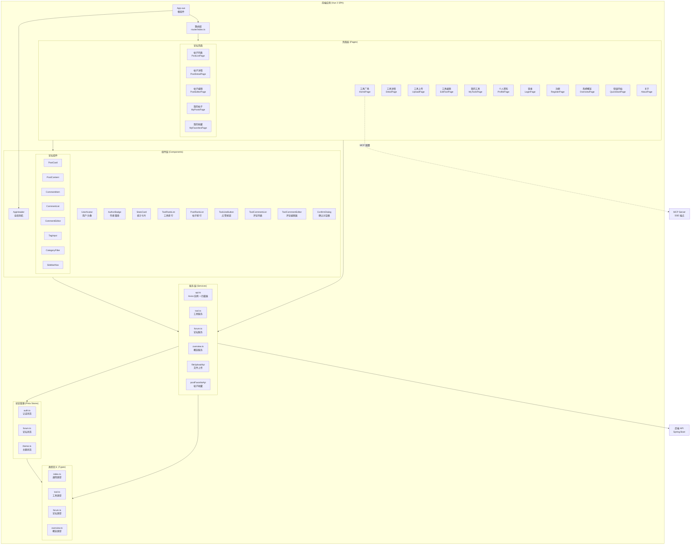

---

## 目录结构

```
frontend/src/
├── main.ts                    # 应用入口
├── App.vue                    # 根组件
├── vite-env.d.ts              # Vite 环境变量类型声明
├── assets/
│   └── main.css               # 全局样式
├── router/
│   └── index.ts               # 路由配置与导航守卫
├── stores/
│   ├── auth.ts                # 认证状态管理
│   ├── forum.ts               # 论坛状态管理
│   └── theme.ts               # 主题状态管理
├── services/
│   ├── api.ts                 # Axios 实例与拦截器
│   ├── tool.ts                # 工具相关 API 服务
│   ├── forum.ts               # 论坛相关 API 服务
│   └── overview.ts            # 概览数据 API 服务
├── types/
│   ├── index.ts               # 通用类型定义
│   ├── tool.ts                # 工具类型定义
│   ├── forum.ts               # 论坛类型定义
│   └── overview.ts            # 概览类型定义
├── pages/
│   ├── HomePage.vue           # 工具广场（首页）
│   ├── DetailPage.vue         # 工具详情
│   ├── UploadPage.vue         # 工具上传
│   ├── EditToolPage.vue       # 工具编辑
│   ├── MyToolsPage.vue        # 我的工具
│   ├── ProfilePage.vue        # 个人资料
│   ├── LoginPage.vue          # 登录
│   ├── RegisterPage.vue       # 注册
│   ├── OverviewPage.vue       # 热榜概览
│   ├── QuickStartPage.vue     # 快速开始
│   ├── AboutPage.vue          # 关于
│   ├── NotFoundPage.vue       # 404 页面
│   └── forum/
│       ├── PostListPage.vue   # 帖子列表
│       ├── PostDetailPage.vue # 帖子详情
│       ├── PostEditorPage.vue # 帖子编辑
│       ├── MyPostsPage.vue    # 我的帖子
│       └── MyFavoritesPage.vue# 我的收藏
└── components/
    ├── AppHeader.vue           # 全局导航栏
    ├── UserAvatar.vue          # 用户头像
    ├── AuthorBadge.vue         # 作者徽章
    ├── StatsCard.vue           # 统计卡片
    ├── ToolRankList.vue        # 工具排行榜
    ├── PostRankList.vue        # 帖子排行榜
    ├── ToolLikeButton.vue      # 工具点赞按钮
    ├── ToolCommentList.vue     # 工具评论列表
    ├── ToolCommentEditor.vue   # 工具评论编辑器
    ├── common/
    │   └── ConfirmDialog.vue   # 确认对话框
    └── forum/
        ├── PostCard.vue        # 帖子卡片
        ├── PostContent.vue     # 帖子内容渲染
        ├── CommentItem.vue     # 评论项
        ├── CommentList.vue     # 评论列表
        ├── CommentEditor.vue   # 评论编辑器
        ├── TagInput.vue        # 标签输入
        ├── CategoryFilter.vue  # 分类筛选
        └── SidebarNav.vue      # 侧边导航
```

---

## 核心模块详解

### 1. 应用入口与初始化

`main.ts` 是应用的入口文件，负责初始化 Vue 应用并注册所有必要的插件：

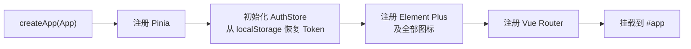

**关键初始化逻辑：**
- Pinia 状态管理在路由守卫之前初始化，确保 `useAuthStore()` 可用
- `initFromStorage()` 从 `localStorage` 恢复 `accessToken`、`refreshToken` 和 `user` 信息
- Element Plus 图标全局注册，可在模板中直接使用

### 2. 路由系统

路由使用 `createWebHistory` 模式，支持懒加载和路由守卫。

#### 路由表

| 路径 | 名称 | 组件 | 需要认证 |
|------|------|------|----------|
| `/` | Home | HomePage.vue | 否 |
| `/tools/:id` | ToolDetail | DetailPage.vue | 否 |
| `/tools/upload` | UploadTool | UploadPage.vue | ✅ |
| `/me/tools` | MyTools | MyToolsPage.vue | ✅ |
| `/me/profile` | Profile | ProfilePage.vue | ✅ |
| `/me/tools/:id/edit` | EditTool | EditToolPage.vue | ✅ |
| `/login` | Login | LoginPage.vue | 否 |
| `/register` | Register | RegisterPage.vue | 否 |
| `/forum` | ForumList | PostListPage.vue | 否 |
| `/forum/posts/:id` | ForumPostDetail | PostDetailPage.vue | 否 |
| `/forum/editor` | ForumEditor | PostEditorPage.vue | ✅ |
| `/forum/my-posts` | MyPosts | MyPostsPage.vue | ✅ |
| `/forum/my-favorites` | MyFavorites | MyFavoritesPage.vue | ✅ |
| `/overview` | Overview | OverviewPage.vue | 否 |
| `/quickstart` | QuickStart | QuickStartPage.vue | 否 |
| `/about` | About | AboutPage.vue | 否 |
| `/:pathMatch(.*)*` | NotFound | NotFoundPage.vue | 否 |

#### 导航守卫

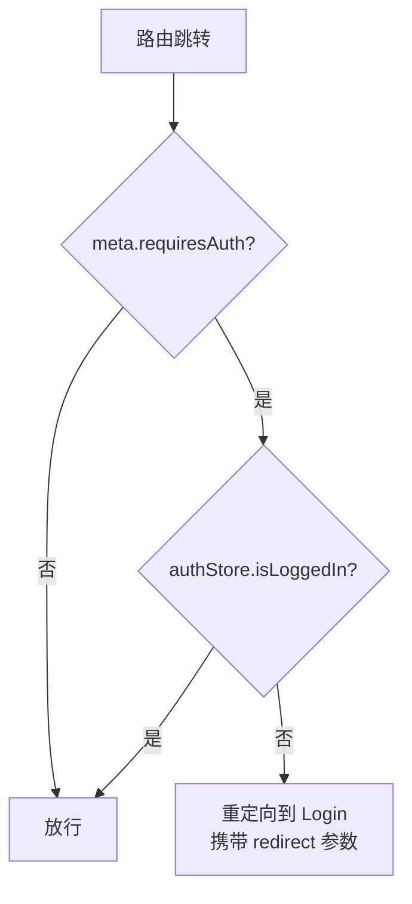

### 3. 状态管理（Pinia Stores）

#### 3.1 AuthStore — 认证状态

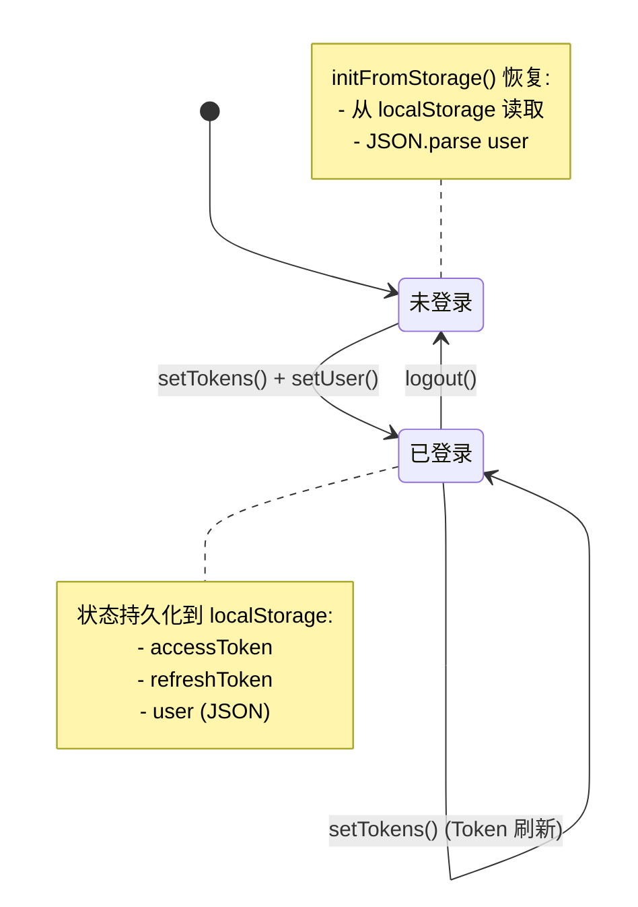

**核心状态：**

| 状态 | 类型 | 说明 |
|------|------|------|
| `accessToken` | `string \| null` | JWT 访问令牌 |
| `refreshToken` | `string \| null` | JWT 刷新令牌 |
| `user` | `User \| null` | 当前用户信息 |
| `isLoggedIn` | `computed<boolean>` | 是否已登录（基于 accessToken） |

**核心方法：**
- `setTokens(access, refresh)` — 设置并持久化 Token 对
- `setUser(userData)` — 设置并持久化用户信息
- `logout()` — 清除所有认证状态和 localStorage
- `initFromStorage()` — 从 localStorage 恢复状态（应用启动时调用）

#### 3.2 ForumStore — 论坛状态

采用 Options API 风格的 Pinia Store，管理论坛帖子的列表、分页、分类和标签状态。

**状态结构：**
```typescript
{
  posts: ForumPost[]           // 帖子列表
  currentPost: ForumPost | null // 当前查看的帖子
  categories: ForumCategory[]  // 分类列表
  tags: ForumTag[]             // 标签列表
  pagination: {                // 分页信息
    page, size, totalElements, totalPages
  }
  loading: boolean             // 加载状态
}
```

**Actions：**
- `fetchPosts(params)` — 获取帖子列表（支持分类、标签、关键词筛选与分页）
- `fetchPostById(id)` — 获取单个帖子详情
- `fetchCategories()` — 获取分类列表
- `fetchTags()` — 获取标签列表
- `fetchMyPosts()` — 获取当前用户的帖子
- `deletePost(id)` — 删除帖子（含错误码映射）

#### 3.3 ThemeStore — 主题状态

管理深色/浅色主题切换，通过 `data-theme` 属性控制 CSS 变量。

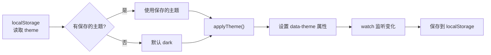

### 4. 服务层（Services）

#### 4.1 API 实例与拦截器（api.ts）

这是整个前端 HTTP 通信的核心，创建了一个配置好的 Axios 实例。

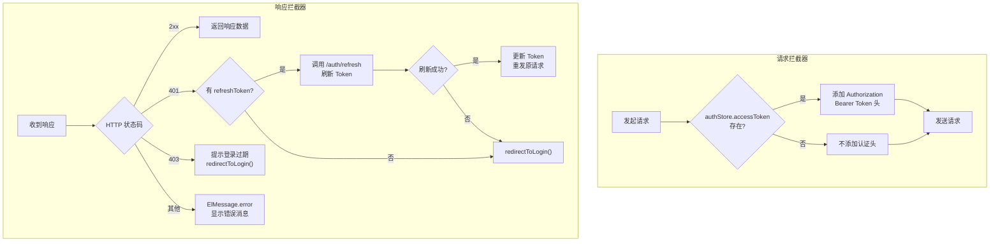

**配置参数：**
- `baseURL`: 从环境变量 `VITE_API_BASE_URL` 读取，默认 `/api/v1`
- `timeout`: 60000ms（60秒）
- `Content-Type`: `application/json`

**Token 刷新机制：**
当收到 401 响应时，拦截器会尝试使用 `refreshToken` 调用 `/auth/refresh` 端点获取新的 `accessToken`。如果刷新成功，自动重发原始请求；如果失败，则清除认证状态并重定向到登录页。

#### 4.2 工具服务（tool.ts）

提供工具详情、点赞和评论相关的 API 调用。

| 方法 | HTTP | 端点 | 说明 |
|------|------|------|------|
| `getToolDetail(id)` | GET | `/tools/{id}` | 获取工具详情 |
| `likeTool(id)` | POST | `/tools/{id}/like` | 点赞工具 |
| `unlikeTool(id)` | DELETE | `/tools/{id}/like` | 取消点赞 |
| `getLikeStatus(id)` | GET | `/tools/{id}/like-status` | 获取点赞状态 |
| `getComments(id)` | GET | `/tools/{id}/comments` | 获取评论列表 |
| `addComment(id, content)` | POST | `/tools/{id}/comments` | 添加评论 |

**扩展类型：**
- `ToolDetailVO` — 继承自 `ToolDetailDTO`，增加 `viewCount`、`likeCount`、`commentCount`、`score`、`isLiked` 字段
- `Comment` — 工具评论类型，包含 `id`、`content`、`username`、`createdAt`

#### 4.3 论坛服务（forum.ts）

创建独立的 Axios 实例（`baseURL: /api/forum`），包含请求拦截器自动携带 Token。

| 方法 | HTTP | 端点 | 说明 |
|------|------|------|------|
| `getPostList(params)` | GET | `/posts` | 获取帖子列表（分页/筛选） |
| `getMyPosts()` | GET | `/posts/my` | 获取我的帖子 |
| `getPostById(id)` | GET | `/posts/{id}` | 获取帖子详情 |
| `createPost(data)` | POST | `/posts` | 创建帖子 |
| `updatePost(id, data)` | PUT | `/posts/{id}` | 更新帖子 |
| `deletePost(id)` | DELETE | `/posts/{id}` | 删除帖子 |
| `getCategories()` | GET | `/categories` | 获取分类列表 |
| `getTags()` | GET | `/tags` | 获取标签列表 |
| `getHotTags()` | GET | `/tags/hot` | 获取热门标签 |
| `createTag(name, isSystem)` | POST | `/tags` | 创建标签 |
| `getComments(postId)` | GET | `/posts/{postId}/comments` | 获取评论 |
| `createComment(postId, data)` | POST | `/posts/{postId}/comments` | 创建评论 |
| `deleteComment(commentId)` | DELETE | `/comments/{commentId}` | 删除评论 |
| `like(data)` | POST | `/likes` | 点赞（帖子/评论） |
| `unlike(data)` | DELETE | `/likes` | 取消点赞 |

#### 4.4 概览服务（overview.ts）

| 方法 | HTTP | 端点 | 说明 |
|------|------|------|------|
| `fetchStats()` | GET | `/overview/stats` | 获取平台统计数据 |
| `fetchToolRanks()` | GET | `/overview/tool-ranks` | 获取工具排行榜 |
| `fetchPostRanks()` | GET | `/overview/post-ranks` | 获取帖子排行榜 |

#### 4.5 文件上传与帖子收藏 API

在 `api.ts` 中还导出了两个 API 对象：

**fileUploadApi：**
- `uploadFiles(toolId, files, readme, onProgress)` — 上传工具文件（支持进度回调）
- `getToolFiles(toolId)` — 获取工具文件列表
- `deleteFile(toolId, fileId)` — 删除文件
- `downloadFile(toolId, fileId, fileName)` — 下载文件（Blob 方式）

**postFavoriteApi：**
- `addFavorite(postId)` — 收藏帖子
- `removeFavorite(postId)` — 取消收藏
- `getMyFavorites()` — 获取我的收藏列表
- `checkFavorite(postId)` — 检查是否已收藏
- `toggleFavorite(postId)` — 切换收藏状态

### 5. 类型定义（Types）

#### 5.1 通用类型（index.ts）

```mermaid
classDiagram
    class ApiResponse~T~ {
        +code: number
        +message: string
        +data: T
    }
    
    class PageResponse~T~ {
        +content: T[]
        +totalElements: number
        +totalPages: number
        +page: number
        +size: number
    }
    
    class User {
        +id: number
        +username: string
        +nickname?: string
        +avatarUrl?: string|null
        +createdAt?: string
        +lastLoginAt?: string
    }
    
    class Category {
        +id: number
        +name: string
        +icon: string
        +sortOrder: number
    }
    
    class ToolSummary {
        +id: number
        +name: string
        +version?: string
        +categoryName: string
        +categoryIcon: string
        +uploaderUsername: string
        +uploaderNickname?: string
        +uploaderAvatarUrl?: string|null
        +createdAt: string
    }
    
    class ToolDetail {
        +id: number
        +name: string
        +version?: string
        +categoryName: string
        +categoryIcon: string
        +content: string
        +uploaderId: number
        +uploaderUsername: string
        +uploaderNickname?: string
        +uploaderAvatarUrl?: string|null
        +createdAt: string
        +updatedAt: string
    }
    
    class ToolFile {
        +id: number
        +toolId: number
        +originalName: string
        +storedPath: string
        +fileSize: number
        +contentType: string
        +createdAt: string
    }
    
    class FileUploadResponse {
        +toolId: number
        +files: ToolFile[]
        +readmeSaved: boolean
    }
    
    class FileListResponse {
        +toolId: number
        +folderPath: string
        +files: ToolFile[]
        +readmeExists: boolean
    }
    
    class LoginRequest {
        +username: string
        +password: string
    }
    
    class RegisterRequest {
        +username: string
        +nickname: string
        +password: string
    }
    
    class CreateToolRequest {
        +name: string
        +categoryId: number
        +content: string
        +version: string
    }
    
    class UpdateToolRequest {
        +name: string
        +categoryId: number
        +content: string
        +version?: string
    }
    
    FileUploadResponse --> ToolFile
    FileListResponse --> ToolFile
```

> **注意：** `PageResponse` 在 `index.ts` 和 `forum.ts` 中有不同定义。`index.ts` 使用 `page` 字段，`forum.ts` 使用 `number` 字段表示当前页码。

#### 5.2 工具类型（tool.ts）

```typescript
interface ToolDetailDTO {
  id: number;
  name: string;
  categoryName: string;
  categoryIcon: string;
  content: string;
  uploaderId: number;
  uploaderUsername: string;
  createdAt: string;
  updatedAt: string;
  viewCount?: number;
  likeCount?: number;
  commentCount?: number;
  score?: number;
  isLiked?: boolean;
}
```

#### 5.3 论坛类型（forum.ts）

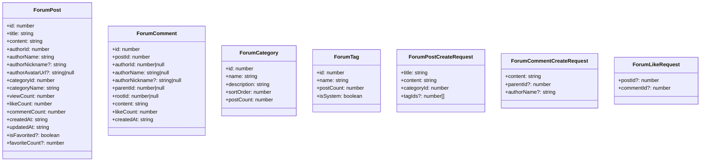

#### 5.4 概览类型（overview.ts）

```typescript
interface StatsDto {
  userCount: number;
  postCount: number;
  toolCount: number;
}

interface ToolRankDto {
  id: number;
  category: string;
  toolName: string;
  score: number;
}

interface PostRankDto {
  id: number;
  category: string;
  postTitle: string;
  score: number;
}
```

### 6. 环境变量

通过 `vite-env.d.ts` 声明环境变量类型：

| 变量名 | 类型 | 说明 |
|--------|------|------|
| `VITE_API_BASE_URL` | `string` | API 基础地址，默认 `/api/v1` |
| `VITE_BACKEND_PORT` | `string` | 后端端口（用于 MCP 配置），默认 `8082` |

---

## 前后端交互流程

### 认证流程

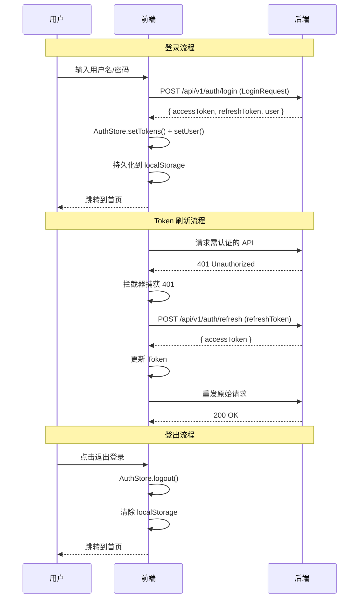

> 更多认证后端实现细节，请参考 [认证模块文档](authentication.md)

### 工具管理流程

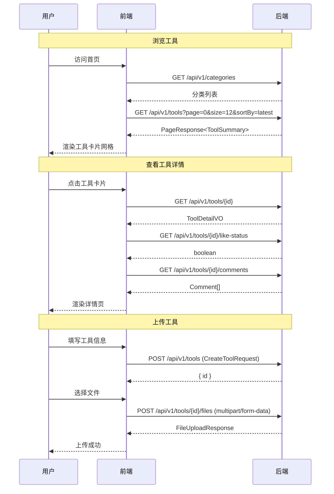

> 更多工具管理后端实现细节，请参考 [工具管理模块文档](tool-management.md)

### 论坛交互流程

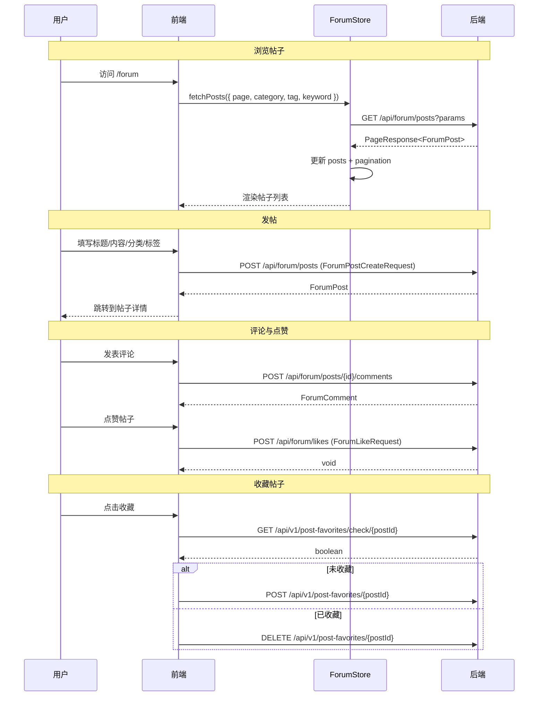

> 更多论坛后端实现细节，请参考 [论坛模块文档](forum.md)

### 概览数据流程

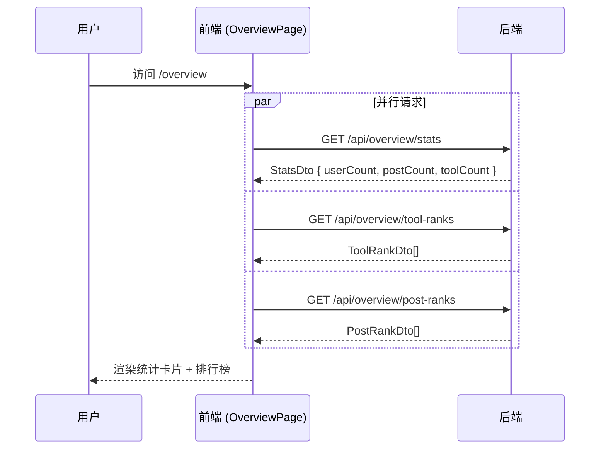

> 更多概览后端实现细节，请参考 [概览模块文档](overview.md)

---

## 组件交互关系

```mermaid
graph TD
    subgraph Layout["布局组件"]
        App["App.vue"]
        Header["AppHeader.vue"]
    end
    
    subgraph ToolPages["工具页面"]
        Home["HomePage"]
        Detail["DetailPage"]
        Upload["UploadPage"]
        Edit["EditToolPage"]
        MyTools["MyToolsPage"]
        Profile["ProfilePage"]
    end
    
    subgraph ForumPages["论坛页面"]
        FList["PostListPage"]
        FDetail["PostDetailPage"]
        FEditor["PostEditorPage"]
        FMyPosts["MyPostsPage"]
        FMyFav["MyFavoritesPage"]
    end
    
    subgraph SharedComponents["共享组件"]
        Avatar["UserAvatar"]
        AuthorBadge["AuthorBadge"]
        Confirm["ConfirmDialog"]
    end
    
    subgraph ToolComponents["工具组件"]
        LikeBtn["ToolLikeButton"]
        CommentList["ToolCommentList"]
        CommentEditor["ToolCommentEditor"]
        TRank["ToolRankList"]
        PRank["PostRankList"]
        Stats["StatsCard"]
    end
    
    subgraph ForumComponents["论坛组件"]
        PostCard["PostCard"]
        PostContent["PostContent"]
        CmtItem["CommentItem"]
        CmtList["CommentList"]
        CmtEditor["CommentEditor"]
        TagInput["TagInput"]
        CatFilter["CategoryFilter"]
        SideNav["SidebarNav"]
    end
    
    App --> Header
    Header --> Avatar
    Header -.->|"使用"| AuthStore["AuthStore"]
    Header -.->|"使用"| ThemeStore["ThemeStore"]
    
    Home --> AuthorBadge
    Detail --> LikeBtn
    Detail --> CommentList
    Detail --> CommentEditor
    Detail --> AuthorBadge
    Upload --> Confirm
    Edit --> Confirm
    MyTools --> Confirm
    Profile --> Avatar
    
    FList --> PostCard
    FList --> CatFilter
    FList --> SideNav
    FDetail --> PostContent
    FDetail --> CmtList
    FDetail --> CmtEditor
    FEditor --> TagInput
    FEditor --> CatFilter
    CmtList --> CmtItem
    
    OverviewPage["OverviewPage"] --> Stats
    OverviewPage --> TRank
    OverviewPage --> PRank
```

---

## 依赖关系图

```mermaid
graph TD
    subgraph External["外部依赖"]
        Vue["vue"]
        Router["vue-router"]
        Pinia["pinia"]
        Axios["axios"]
        ElementPlus["element-plus"]
        Lucide["@lucide/vue"]
        MarkdownIt["markdown-it"]
        HighlightJS["highlight.js"]
        VueUse["@vueuse/core"]
    end
    
    subgraph Internal["内部模块"]
        Main["main.ts"]
        AppVue["App.vue"]
        RouterIndex["router/index.ts"]
        ApiSvc["services/api.ts"]
        ToolSvc["services/tool.ts"]
        ForumSvc["services/forum.ts"]
        OverviewSvc["services/overview.ts"]
        AuthStore["stores/auth.ts"]
        ForumStore["stores/forum.ts"]
        ThemeStore["stores/theme.ts"]
        TypesIndex["types/index.ts"]
        TypesTool["types/tool.ts"]
        TypesForum["types/forum.ts"]
        TypesOverview["types/overview.ts"]
    end
    
    Main --> Vue
    Main --> Pinia
    Main --> ElementPlus
    Main --> AppVue
    Main --> RouterIndex
    Main --> AuthStore
    
    AppVue --> RouterIndex
    AppVue --> Header["AppHeader.vue"]
    
    RouterIndex --> Vue
    RouterIndex --> Router
    RouterIndex --> AuthStore
    
    ApiSvc --> Axios
    ApiSvc --> AuthStore
    ApiSvc --> RouterIndex
    ApiSvc --> ElementPlus
    ApiSvc --> TypesIndex
    
    ToolSvc --> ApiSvc
    ToolSvc --> TypesTool
    
    ForumSvc --> Axios
    ForumSvc --> AuthStore
    ForumSvc --> TypesForum
    
    OverviewSvc --> Axios
    OverviewSvc --> TypesOverview
    
    AuthStore --> Pinia
    AuthStore --> Vue
    AuthStore --> TypesIndex
    
    ForumStore --> Pinia
    ForumStore --> ForumSvc
    ForumStore --> TypesForum
    
    ThemeStore --> Pinia
    ThemeStore --> Vue
```

---

## MCP 集成

前端首页提供 MCP（Model Context Protocol）服务器配置入口，用户可以一键复制配置并添加到 AI 编程助手（如 CodeBuddy）中。

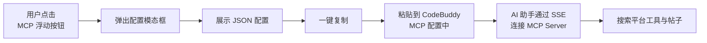

**MCP 配置示例：**
```json
{
  "CodingHub-mcp": {
    "type": "sse",
    "url": "http://{hostname}:8082/sse",
    "description": "CodingHub MCP Server",
    "disabled": false
  }
}
```

> 更多 MCP 后端实现细节，请参考 [MCP 服务器模块文档](mcp-server.md)

---

## 主题系统

前端支持深色（默认）和浅色两种主题，通过 CSS 变量实现切换。

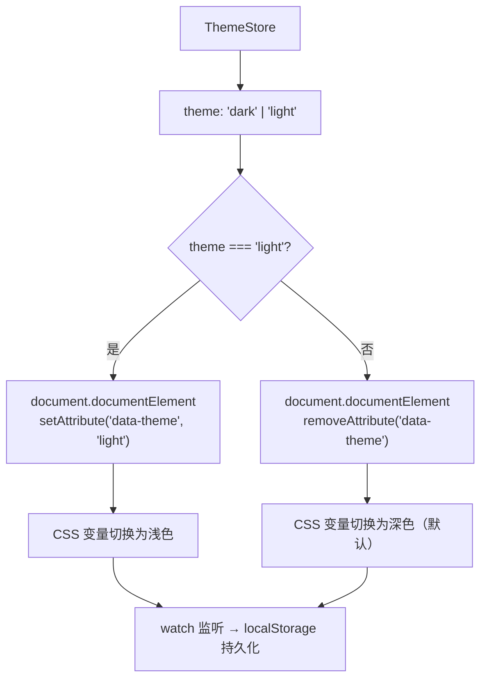

主题切换通过 `data-theme` 属性控制，CSS 中使用 `[data-theme="light"]` 选择器覆盖默认深色变量。

---

## 关键设计决策

### 1. 双 Axios 实例
- **主实例（api.ts）**：`baseURL: /api/v1`，用于工具管理、认证、文件上传等核心 API
- **论坛实例（forum.ts）**：`baseURL: /api/forum`，独立配置以适应论坛 API 的不同前缀

两个实例都通过请求拦截器自动从 `AuthStore` 获取并附加 JWT Token。

### 2. Token 自动刷新
响应拦截器实现了透明的 Token 刷新机制，用户无需在 Token 过期时手动重新登录。刷新失败时才重定向到登录页，并携带 `redirect` 参数以便登录后返回原页面。

### 3. 路由懒加载
所有页面组件均使用动态 `import()` 实现懒加载，减小初始包体积，提升首屏加载速度。

### 4. 状态持久化
认证状态（Token、用户信息）和主题偏好通过 `localStorage` 持久化，应用启动时通过 `initFromStorage()` 恢复，实现刷新不丢失登录状态。

### 5. 类型安全
全量使用 TypeScript，所有 API 请求和响应都有明确的类型定义。`ApiResponse<T>` 和 `PageResponse<T>` 泛型确保数据结构的类型安全。

---

## 相关模块文档

| 模块 | 说明 | 文档链接 |
|------|------|----------|
| 认证模块 | JWT 认证、用户管理、安全配置 | [authentication.md](authentication.md) |
| 工具管理模块 | 工具 CRUD、文件管理、分类、评论 | [tool-management.md](tool-management.md) |
| 论坛模块 | 帖子、评论、点赞、标签、收藏 | [forum.md](forum.md) |
| MCP 服务器模块 | MCP 协议集成、工具搜索 | [mcp-server.md](mcp-server.md) |
| 概览模块 | 平台统计、排行榜 | [overview.md](overview.md) |
