# MCP Server 模块文档

## 简介

MCP（Model Context Protocol）Server 模块是 H3CodingHub 平台的核心集成层，基于 **MCP SDK 2.0.0** 实现，通过 **SSE（Server-Sent Events）** 传输协议为 AI 客户端（如 Claude、Cursor 等）提供标准化的工具调用接口。该模块将平台的工具管理、社区论坛和用户认证能力封装为 11 个 MCP 工具，使 AI 客户端能够搜索工具、获取详情、创建内容、管理文件等，实现 AI 与平台的双向交互。

> **架构定位**：MCP Server 作为 AI 客户端与 H3CodingHub 后端服务之间的桥梁，所有 AI 驱动的操作均通过此模块路由到对应的业务服务。

---

## 架构概览

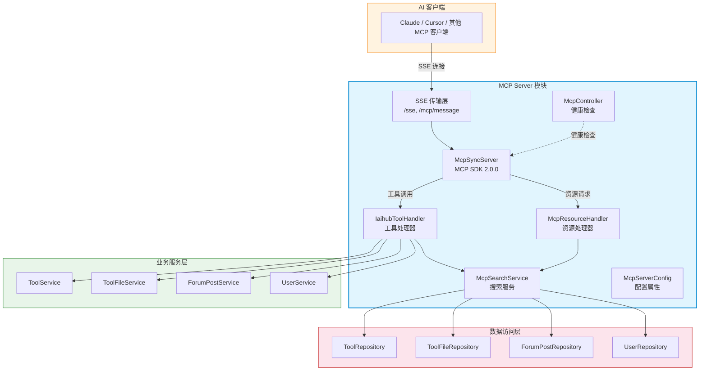

## 模块依赖关系

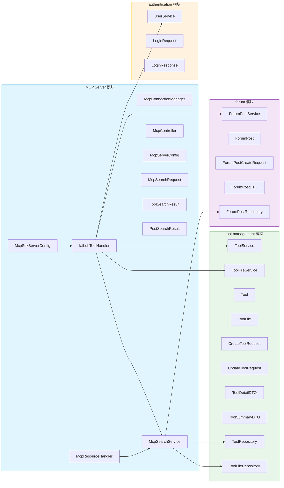

> 模块依赖说明：MCP Server 模块依赖 [authentication](authentication.md) 模块进行用户认证，依赖 [tool-management](tool-management.md) 模块进行工具 CRUD 操作，依赖 [forum](forum.md) 模块进行帖子管理。

---

## 核心组件详解

### 1. McpSdkServerConfig — MCP SDK 服务器配置

**文件**：`backend/src/main/java/com/iaihub/toolbox/mcp/McpSdkServerConfig.java`

这是 MCP Server 的核心配置类，负责：

- **初始化 MCP SDK 同步服务器**：使用 `McpServer.sync()` 创建 `McpSyncServer` 实例，服务器名称为 `H3CodingHub-MCP-Server`，版本 `2.0.0`
- **配置 SSE 传输层**：通过 `HttpServletSseServerTransportProvider` 提供 SSE 传输，注册到 `/sse` 和 `/mcp/message` 端点
- **注册 11 个 MCP 工具**：每个工具包含名称、描述、JSON Schema 输入定义和处理函数
- **配置 JSON 映射器**：使用 Jackson 作为 JSON 序列化/反序列化引擎

#### 注册的 MCP 工具列表

| 工具名称 | 功能描述 | 是否需要认证 |
|---------|---------|:----------:|
| `h3_coding_hub_tool_search` | 按关键词和分类搜索工具列表 | ❌ |
| `h3_coding_hub_tool_get` | 获取工具详情（含完整 Markdown 文档） | ❌ |
| `h3_coding_hub_tool_files` | 获取工具文件下载信息 | ❌ |
| `h3_coding_hub_post_search` | 搜索社区帖子 | ❌ |
| `h3_coding_hub_post_get` | 获取帖子内容（含完整 Markdown） | ❌ |
| `h3_coding_hub_tool_download` | 获取工具文件下载链接 | ❌ |
| `h3_coding_hub_tool_create` | 创建新工具 | ✅ |
| `h3_coding_hub_post_create` | 创建新帖子 | ✅ |
| `h3_coding_hub_tool_file_upload` | 获取文件上传接口信息 | ❌ |
| `h3_coding_hub_tool_modify` | 修改已创建的工具 | ✅ |
| `h3_coding_hub_tool_file_delete` | 删除工具文件 | ✅ |

#### 工具注册流程

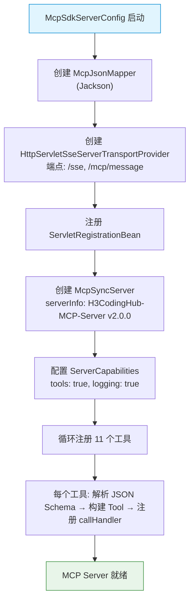

#### 关键 Bean 定义

| Bean 名称 | 类型 | 作用 |
|-----------|------|------|
| `mcpJsonMapper` | `JacksonMcpJsonMapper` | MCP 协议 JSON 序列化 |
| `servletSseServerTransportProvider` | `HttpServletSseServerTransportProvider` | SSE 传输提供者 |
| `customServletBean` | `ServletRegistrationBean` | Servlet 注册（`/sse`, `/mcp/message`） |
| `mcpSyncServer` | `McpSyncServer` | MCP 同步服务器（destroyMethod = "close"） |

---

### 2. IaihubToolHandler — MCP 工具处理器

**文件**：`backend/src/main/java/com/iaihub/toolbox/mcp/IaihubToolHandler.java`

这是 MCP 工具调用的核心处理器，所有 11 个工具的实际业务逻辑都在此实现。它作为 MCP SDK 与业务服务层之间的适配器，负责：

- **接收 MCP 工具调用请求**：从 `McpSchema.CallToolRequest` 中提取参数
- **路由到对应业务服务**：调用 `ToolService`、`ToolFileService`、`ForumPostService`、`UserService` 等
- **认证处理**：对于需要认证的操作，使用 MCP 客户端传入的账号密码进行登录验证
- **结果封装**：将业务结果转换为 `McpSchema.CallToolResult`（成功/错误）

#### 依赖注入的服务

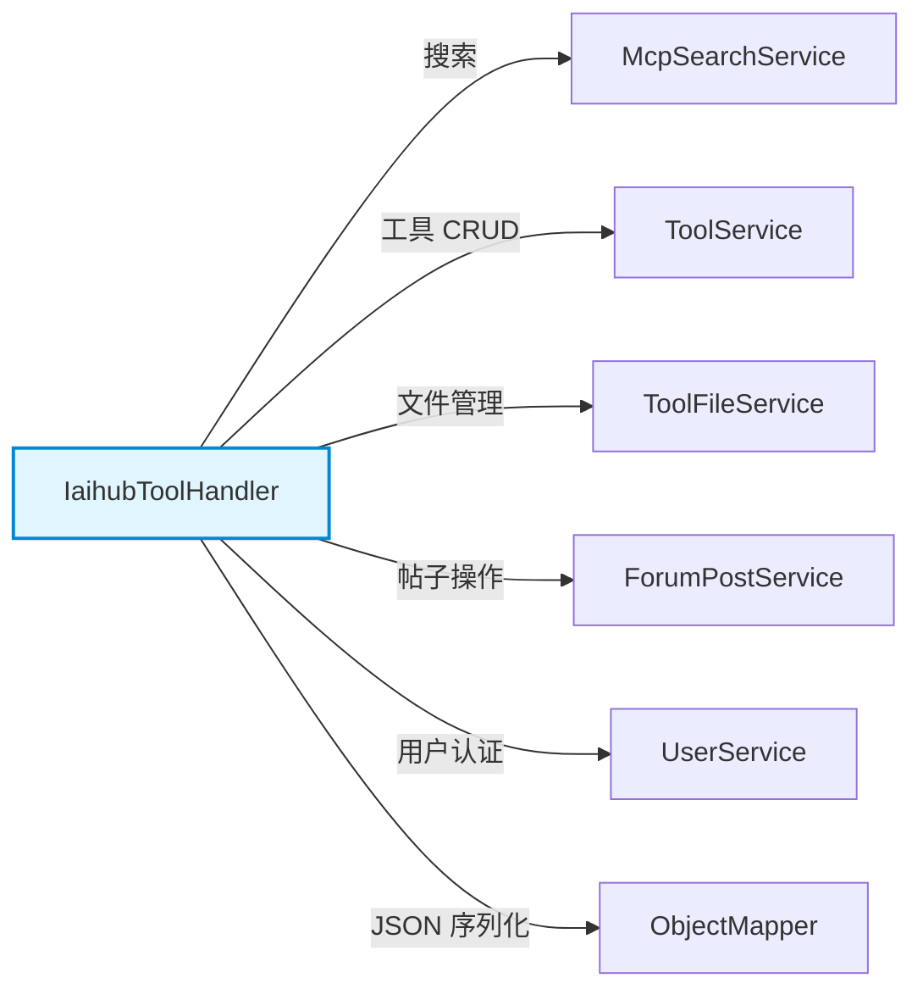

#### 工具处理方法详解

##### 查询类工具（无需认证）

| 方法 | 对应工具 | 核心逻辑 |
|------|---------|---------|
| `handleToolSearch` | `h3_coding_hub_tool_search` | 调用 `McpSearchService.searchTools()` 按关键词/分类搜索 |
| `handleToolGet` | `h3_coding_hub_tool_get` | 调用 `McpSearchService.getToolById()` 获取完整工具详情 |
| `handleToolFiles` | `h3_coding_hub_tool_files` | 调用 `McpSearchService.getToolFiles()` 获取文件列表 |
| `handlePostSearch` | `h3_coding_hub_post_search` | 调用 `McpSearchService.searchPosts()` 搜索帖子 |
| `handlePostGet` | `h3_coding_hub_post_get` | 调用 `McpSearchService.getPostById()` 获取帖子详情 |
| `handleToolDownload` | `h3_coding_hub_tool_download` | 调用 `McpSearchService.getToolFile()` 获取下载链接 |
| `handleToolFileUploadInfo` | `h3_coding_hub_tool_file_upload` | 返回 REST API 上传接口信息（告知客户端如何上传） |

##### 写操作类工具（需要认证）

| 方法 | 对应工具 | 认证方式 | 核心逻辑 |
|------|---------|---------|---------|
| `handleToolCreate` | `h3_coding_hub_tool_create` | 账号密码登录 | 登录后调用 `ToolService.createTool()` |
| `handlePostCreate` | `h3_coding_hub_post_create` | 账号密码登录 | 登录后调用 `ForumPostService.createPost()` |
| `handleToolModify` | `h3_coding_hub_tool_modify` | 账号密码登录 | 登录后调用 `ToolService.updateTool()`，支持版本自动递增 |
| `handleToolFileDelete` | `h3_coding_hub_tool_file_delete` | 账号密码登录 | 登录后调用 `ToolFileService.deleteToolFile()` |

#### 认证流程

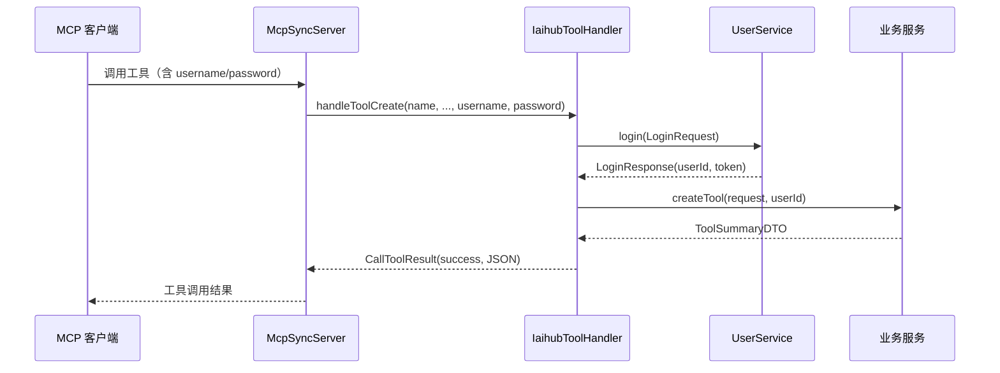

#### 版本号自动递增逻辑

`handleToolModify` 方法中实现了版本号自动递增功能（`incrementVersion` 方法）：

| 当前版本 | 递增后 | 说明 |
|---------|--------|------|
| `1.0.0` | `1.0.1` | 最后一位数字 +1 |
| `1.0.0-beta` | `1.0.1-beta` | 保留后缀，数字部分 +1 |
| `1.0.alpha` | `1.0.alpha.1` | 最后一段非数字，追加 `.1` |
| `null` / 空 | `1.0.1` | 默认值 |

#### 内部响应 DTO

`IaihubToolHandler` 定义了多个内部静态 DTO 类用于封装 MCP 工具响应：

| DTO 类 | 用途 |
|--------|------|
| `ToolSearchResponse` | 工具搜索结果（含 tools 列表和 count） |
| `ToolDetailResponse` | 工具详情（id, name, version, content, category） |
| `ToolFilesResponse` | 工具文件列表（含 files 和 toolId） |
| `PostSearchResponse` | 帖子搜索结果（含 posts 列表和 count） |
| `PostDetailResponse` | 帖子详情（id, title, content, authorId, createdAt） |
| `FileDownloadResponse` | 文件下载信息（fileId, fileName, downloadUrl 等） |
| `FileUploadInfoResponse` | 文件上传接口信息（uploadUrl, httpMethod, contentType 等） |
| `FileDeleteResponse` | 文件删除结果（toolId, fileId, deleted） |
| `ErrorResponse` | 错误响应（error message） |

---

### 3. McpResourceHandler — MCP 资源处理器

**文件**：`backend/src/main/java/com/iaihub/toolbox/mcp/McpResourceHandler.java`

负责 MCP 协议中的资源（Resource）管理，提供以下能力：

| 方法 | 功能 |
|------|------|
| `listTools()` | 列出所有可用工具作为 MCP 资源（最多 50 个），每个资源包含 name、description 和 inputSchema |
| `searchTools(query, category, limit)` | 代理调用 `McpSearchService.searchTools()` 进行工具搜索 |
| `getToolContent(toolId)` | 获取指定工具的 Markdown 内容 |

> **注意**：当前 MCP SDK 配置中未显式注册资源处理器到 `McpSyncServer`，资源功能作为辅助能力存在。

---

### 4. McpSearchService — MCP 搜索服务

**文件**：`backend/src/main/java/com/iaihub/toolbox/service/McpSearchService.java`

这是 MCP 模块的搜索服务层，封装了对工具和帖子的检索逻辑，直接操作 Repository 层。

#### 核心方法

| 方法 | 数据源 | 说明 |
|------|--------|------|
| `searchTools(query, category, limit)` | `ToolRepository` | 搜索已审核工具，返回 `ToolSearchResult` 列表（内容截取前 100 字符作为摘要） |
| `getToolById(toolId)` | `ToolRepository` | 获取工具详情（含分类和上传者关联） |
| `getToolFiles(toolId)` | `ToolFileRepository` | 获取工具的正常状态文件列表 |
| `searchPosts(query, limit)` | `ForumPostRepository` + `UserRepository` | 搜索帖子，关联查询作者名称 |
| `getPostById(postId)` | `ForumPostRepository` | 获取帖子详情 |
| `getToolFile(toolId, fileId)` | `ToolFileRepository` | 获取指定工具下的指定文件 |

#### 搜索数据流

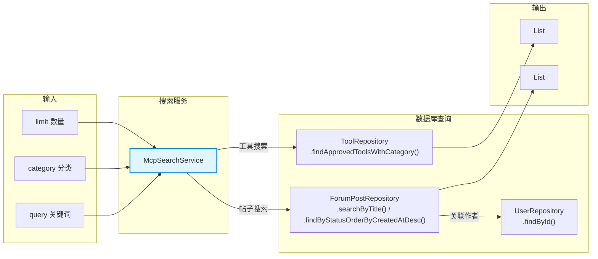

---

### 5. McpController — MCP HTTP 端点

**文件**：`backend/src/main/java/com/iaihub/toolbox/controller/McpController.java`

REST 控制器，映射到 `/mcp` 路径，提供健康检查端点。

> **重要说明**：实际的 SSE 连接和 MCP 协议交互由 `McpSdkServerConfig` 中注册的 `HttpServletSseServerTransportProvider` Servlet 处理（映射到 `/sse` 和 `/mcp/message`），此控制器仅提供辅助端点。

| 端点 | 方法 | 功能 |
|------|------|------|
| `/mcp/health` | GET | 健康检查，返回服务器状态、版本和时间戳 |

---

### 6. McpServerConfig — 服务器配置属性

**文件**：`backend/src/main/java/com/iaihub/toolbox/config/McpServerConfig.java`

使用 `@ConfigurationProperties(prefix = "mcp.server")` 绑定配置属性：

| 属性 | 默认值 | 说明 |
|------|--------|------|
| `port` | `8082` | MCP Server 监听端口 |
| `host` | `0.0.0.0` | 监听地址 |
| `enabled` | `true` | 是否启用 MCP Server |
| `maxConnections` | `10` | 最大连接数 |
| `connectionTimeoutMs` | `30000` | 连接超时时间（毫秒） |

---

### 7. McpConnectionManager — SSE 连接管理器（已弃用）

**文件**：`backend/src/main/java/com/iaihub/toolbox/mcp/McpConnectionManager.java`

> ⚠️ **已弃用**：此类标记为 `@Deprecated`，连接管理已由 MCP SDK 的 `HttpServletSseServerTransportProvider` 内部处理。保留此代码仅为向后兼容参考。

原功能包括：
- SSE 连接注册与生命周期管理（超时 30 分钟）
- 事件广播（`broadcastEvent`）和定向发送（`sendToEmitter`）
- 心跳检测和连接清理
- 自定义 `SseEmitter` 包装类（避免命名冲突）

---

### 8. DTO 组件

#### McpSearchRequest

**文件**：`backend/src/main/java/com/iaihub/toolbox/dto/McpSearchRequest.java`

MCP 搜索请求 DTO，包含输入验证：

| 字段 | 类型 | 验证规则 | 说明 |
|------|------|---------|------|
| `query` | `String` | `@Size(max = 200)` | 搜索关键词 |
| `category` | `String` | — | 分类名称 |
| `limit` | `Integer` | `@Min(1)`, `@Max(100)` | 返回数量限制，默认 20 |

#### ToolSearchResult

**文件**：`backend/src/main/java/com/iaihub/toolbox/dto/ToolSearchResult.java`

工具搜索结果 DTO，使用 `@JsonProperty` 注解确保 JSON 字段命名：

| 字段 | 类型 | 说明 |
|------|------|------|
| `id` | `Long` | 工具 ID |
| `name` | `String` | 工具名称 |
| `description` | `String` | 工具描述（内容前 100 字符） |
| `category` | `String` | 分类名称 |
| `version` | `String` | 版本号 |
| `createdAt` | `String` | 创建时间 |

#### PostSearchResult

**文件**：`backend/src/main/java/com/iaihub/toolbox/dto/PostSearchResult.java`

帖子搜索结果 DTO：

| 字段 | 类型 | 说明 |
|------|------|------|
| `id` | `Long` | 帖子 ID |
| `title` | `String` | 帖子标题 |
| `summary` | `String` | 帖子摘要（内容前 100 字符） |
| `authorName` | `String` | 作者用户名 |
| `createdAt` | `String` | 创建时间 |

---

## 端到端数据流

### 工具搜索流程

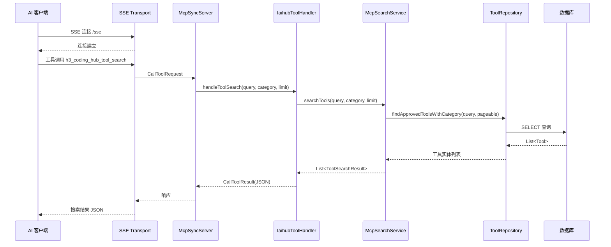

### 创建工具流程（含认证）

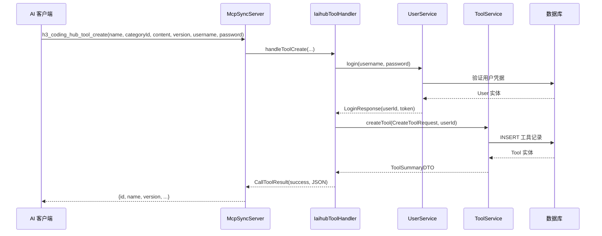

### 文件上传信息获取流程

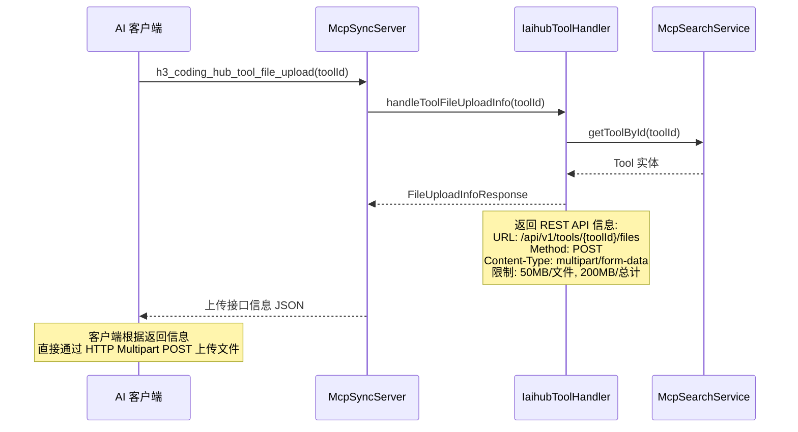

---

## MCP 工具调用分类

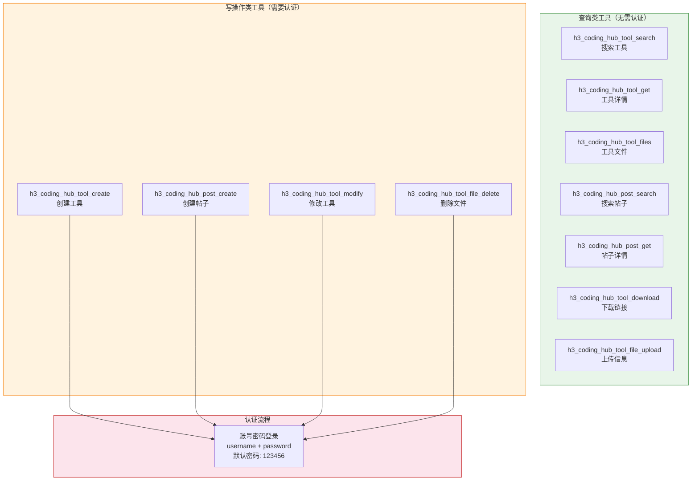

---

## 与其他模块的交互

### 与 authentication 模块的交互

MCP Server 通过 `UserService.login()` 方法进行用户认证。对于需要认证的写操作工具，MCP 客户端需传入 `username` 和 `password` 参数，处理器内部调用 `UserService.login()` 获取 `userId`，再将 `userId` 传递给后续业务服务。

> 详细认证机制请参考 [authentication 模块文档](authentication.md)。

### 与 tool-management 模块的交互

| MCP 工具 | 调用的服务方法 | 说明 |
|---------|--------------|------|
| `h3_coding_hub_tool_create` | `ToolService.createTool()` | 创建工具，含 XSS 过滤和重名校验 |
| `h3_coding_hub_tool_modify` | `ToolService.updateTool()` | 修改工具，仅更新传入字段 |
| `h3_coding_hub_tool_file_delete` | `ToolFileService.deleteToolFile()` | 删除文件（物理文件 + 数据库记录） |
| `h3_coding_hub_tool_file_upload` | 返回 REST API 信息 | 客户端直接调用 `/api/v1/tools/{toolId}/files` |

> 详细工具管理逻辑请参考 [tool-management 模块文档](tool-management.md)。

### 与 forum 模块的交互

| MCP 工具 | 调用的服务方法 | 说明 |
|---------|--------------|------|
| `h3_coding_hub_post_create` | `ForumPostService.createPost()` | 创建帖子，支持标签关联 |

> 详细论坛逻辑请参考 [forum 模块文档](forum.md)。

---

## 配置与部署

### 配置项

MCP Server 通过 `application.yml` 或环境变量进行配置：

```yaml
mcp:
  server:
    port: 8082           # MCP Server 端口
    host: 0.0.0.0        # 监听地址
    enabled: true         # 是否启用
    max-connections: 10   # 最大连接数
    connection-timeout-ms: 30000  # 连接超时
```

### 端点映射

| 端点 | 协议 | 处理者 | 说明 |
|------|------|--------|------|
| `/sse` | SSE | `HttpServletSseServerTransportProvider` | SSE 连接建立 |
| `/mcp/message` | HTTP POST | `HttpServletSseServerTransportProvider` | MCP 消息交互 |
| `/mcp/health` | HTTP GET | `McpController` | 健康检查 |
| `/api/v1/tools/{toolId}/files` | HTTP POST (multipart) | `ToolFileController` | 文件上传（MCP 客户端直接调用） |
| `/api/v1/tools/{toolId}/files/{fileId}/download` | HTTP GET | `ToolFileController` | 文件下载 |

### 文件上传限制

| 限制项 | 值 |
|--------|-----|
| 单文件最大 | 50 MB |
| 总上传最大 | 200 MB |
| 认证要求 | 无（已放通权限） |

---

## 安全注意事项

1. **认证密码默认值**：MCP 工具的认证密码默认为 `123456`，生产环境应修改默认密码
2. **文件上传放通**：`/api/v1/tools/{toolId}/files` 端点已放通认证，任何 MCP 客户端均可上传文件
3. **XSS 防护**：工具内容通过 `XssSanitizer.sanitize()` 进行 XSS 过滤（由 `ToolService` 处理）
4. **权限校验**：修改和删除操作通过 `userId` 校验资源所有权（由业务服务层处理）
5. **搜索限制**：`McpSearchRequest` 限制 query 最大 200 字符，limit 范围 1-100

---

## 组件关系总览

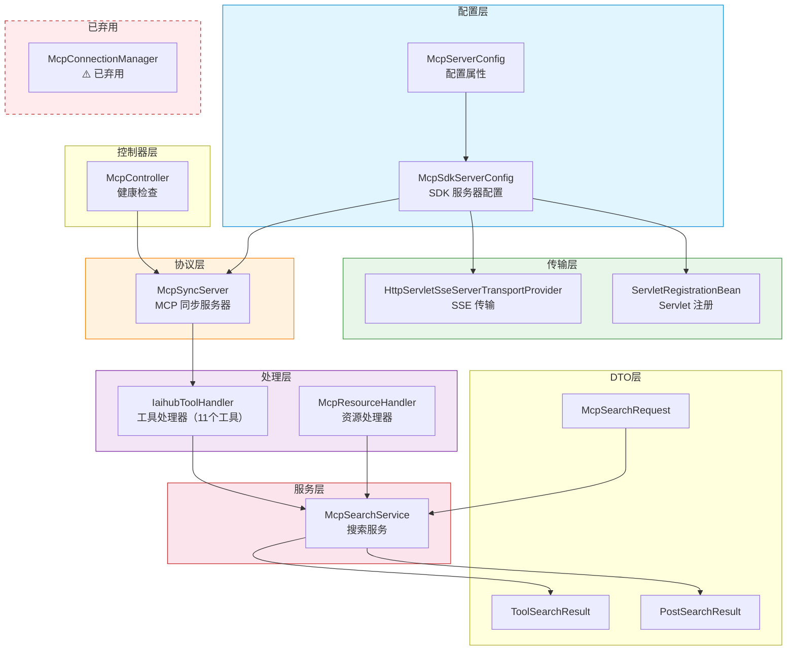
