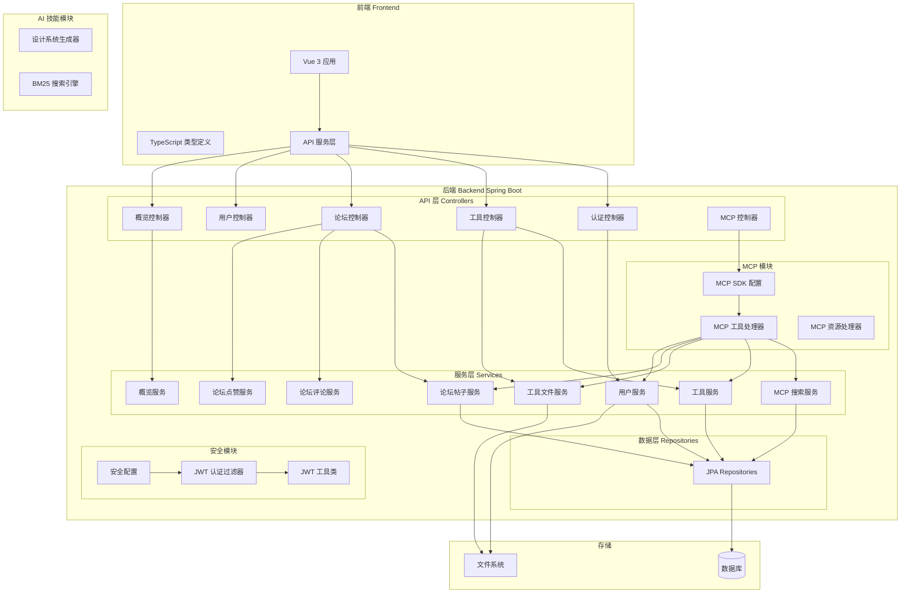
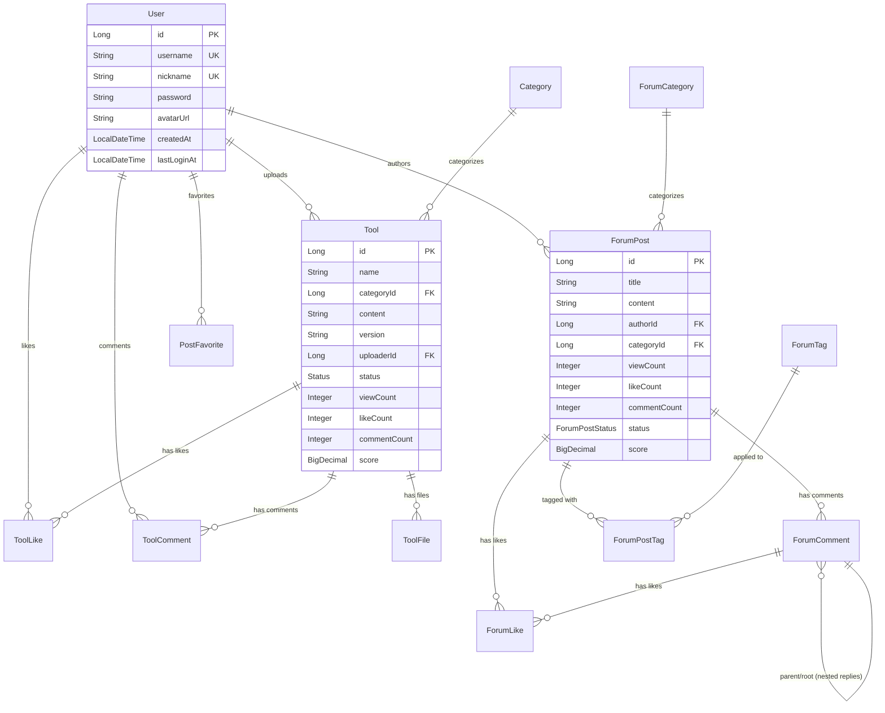
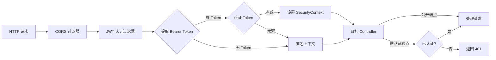

# CodingHub 系统文档

## 概述

CodingHub（工具广场）是一个综合性的 AI 工具与社区平台，基于 **Spring Boot + Vue 3** 技术栈构建。系统提供 AI 工具的发布、管理、检索功能，社区论坛互动功能，以及通过 **MCP（Model Context Protocol）** 协议为 AI 客户端提供工具调用能力。

### 核心功能

| 功能模块 | 描述 |
|---------|------|
| 🔐 用户认证 | JWT 双令牌认证（Access Token + Refresh Token），用户注册/登录/头像管理 |
| 🛠️ 工具管理 | 工具的创建、编辑、删除、搜索、分类筛选、文件上传/下载、点赞与评论 |
| 💬 社区论坛 | 帖子发布、评论（支持嵌套回复）、点赞（登录用户 + 匿名 IP）、标签、收藏 |
| 📊 数据概览 | 用户/帖子/工具数量统计，按分类的热门工具与帖子排行榜 |
| 🔌 MCP 服务 | 通过 SSE 协议提供 11 个 MCP 工具，支持 AI 客户端搜索/创建/修改工具与帖子 |
| 🎨 AI 设计系统 | 基于 BM25 搜索引擎的 UI/UX 设计系统推荐生成器 |

---

## 系统架构



### 技术栈

| 层级 | 技术 |
|------|------|
| 后端框架 | Spring Boot 3.x, Spring Security, Spring Data JPA |
| 数据库 | 关系型数据库（通过 JPA/Hibernate） |
| 认证 | JWT (jjwt), BCrypt 密码加密 |
| MCP 协议 | MCP SDK 2.0.0 (SSE 传输) |
| 前端框架 | Vue 3, TypeScript, Vite |
| AI 技能 | Python, BM25 搜索算法 |

---

## 子模块文档

### 1. 用户认证与安全管理 ([authentication.md](authentication.md))

负责用户注册、登录、JWT 令牌管理、头像上传、安全过滤链配置。

**核心组件：**
- `UserService` — 用户注册/登录/刷新令牌/头像管理
- `JwtUtil` — JWT 令牌生成与验证
- `JwtAuthenticationFilter` — 请求认证过滤器
- `SecurityConfig` — Spring Security 安全配置
- `AuthController` / `UserController` — 认证与用户 API 端点

**关键特性：**
- 双令牌机制：Access Token（短期）+ Refresh Token（长期）
- BCrypt 密码加密存储
- 无状态会话（STATELESS）
- 头像文件上传与静态资源服务
- CORS 跨域配置

---

### 2. 工具管理 ([tool-management.md](tool-management.md))

提供 AI 工具的全生命周期管理，包括创建、编辑、删除、搜索、文件管理、点赞与评论。

**核心组件：**
- `ToolService` — 工具 CRUD、点赞、评论、浏览量统计
- `ToolFileService` — 文件上传/下载/删除，README 管理
- `ToolController` / `ToolFileController` — REST API 端点
- `Tool` / `ToolFile` / `ToolLike` / `ToolComment` — 数据模型

**关键特性：**
- 工具评分系统：`score = viewCount × 1 + likeCount × 3 + commentCount × 5`
- 文件上传限制：单文件 50MB，总计 200MB
- XSS 内容净化
- 软删除机制（Status 枚举）
- 同一用户同一分类下工具名唯一约束

---

### 3. 社区论坛 ([forum.md](forum.md))

完整的社区论坛系统，支持帖子、评论（嵌套回复）、点赞、标签、分类和收藏功能。

**核心组件：**
- `ForumPostService` — 帖子 CRUD、浏览量统计
- `ForumCommentService` — 评论创建、嵌套回复、删除
- `ForumLikeService` — 帖子/评论点赞（支持匿名 IP 哈希）
- `ForumTagService` / `ForumCategoryService` — 标签与分类管理
- `PostFavoriteService` — 帖子收藏

**关键特性：**
- 评论嵌套回复（parentId + rootId 双指针）
- 匿名点赞（IP SHA-256 哈希）
- 帖子评分系统（与工具相同的评分公式）
- 标签热度排行
- 帖子收藏功能

---

### 4. MCP 服务 ([mcp-server.md](mcp-server.md))

通过 MCP（Model Context Protocol）协议为 AI 客户端提供 11 个工具调用能力，使用 SSE 传输。

**核心组件：**
- `McpSdkServerConfig` — MCP Server 配置与工具注册
- `IaihubToolHandler` — 11 个 MCP 工具的处理器
- `McpResourceHandler` — MCP 资源列表与检索
- `McpSearchService` — 工具与帖子搜索封装
- `McpController` — MCP 健康检查端点

**提供的 MCP 工具：**

| 工具名 | 功能 | 认证 |
|--------|------|------|
| `h3_coding_hub_tool_search` | 搜索工具列表 | 否 |
| `h3_coding_hub_tool_get` | 获取工具详情 | 否 |
| `h3_coding_hub_tool_files` | 获取工具文件 | 否 |
| `h3_coding_hub_post_search` | 搜索帖子 | 否 |
| `h3_coding_hub_post_get` | 获取帖子详情 | 否 |
| `h3_coding_hub_tool_download` | 获取文件下载链接 | 否 |
| `h3_coding_hub_tool_create` | 创建工具 | 是 |
| `h3_coding_hub_post_create` | 创建帖子 | 是 |
| `h3_coding_hub_tool_file_upload` | 获取上传接口信息 | 否 |
| `h3_coding_hub_tool_modify` | 修改工具（自动版本递增） | 是 |
| `h3_coding_hub_tool_file_delete` | 删除工具文件 | 是 |

---

### 5. 数据概览 ([overview.md](overview.md))

提供平台整体数据统计与排行榜功能。

**核心组件：**
- `OverviewController` — 统计数据 API 端点
- `OverviewService` / `OverviewServiceImpl` — 统计逻辑实现
- `StatsDto` / `ToolRankDto` / `PostRankDto` — 统计数据 DTO

**API 端点：**
- `GET /api/overview/stats` — 用户/帖子/工具总数
- `GET /api/overview/tool-ranks` — 按分类的工具排行榜（每类 Top 5）
- `GET /api/overview/post-ranks` — 按分类的帖子排行榜（每类 Top 5）

---

### 6. 前端类型与服务 ([frontend.md](frontend.md))

前端 TypeScript 类型定义与 API 服务层，与后端 DTO 一一对应。

**核心文件：**
- `frontend/src/types/index.ts` — 通用类型（User, Category, Tool, ApiResponse 等）
- `frontend/src/types/forum.ts` — 论坛相关类型
- `frontend/src/types/tool.ts` — 工具详情类型
- `frontend/src/types/overview.ts` — 概览统计类型
- `frontend/src/services/tool.ts` — 工具 API 服务

---

### 7. AI 设计系统技能 ([ai-skills.md](ai-skills.md))

基于 BM25 搜索引擎的 UI/UX 设计系统推荐生成器，为多个 AI 编程助手（Qoder, Windsurf, CodeBuddy）提供设计指导。

**核心组件：**
- `DesignSystemGenerator` — 设计系统推荐生成器
- `BM25` — BM25 文本搜索排名算法
- 多域搜索：style, color, typography, landing, product, ux, icons, react, web

---

## 数据模型关系



---

## API 端点总览

### 认证 API (`/api/v1/auth`)
| 方法 | 路径 | 认证 | 描述 |
|------|------|------|------|
| POST | `/register` | 否 | 用户注册 |
| POST | `/login` | 否 | 用户登录 |
| POST | `/refresh` | 是 | 刷新令牌 |

### 用户 API (`/api/v1/users`)
| 方法 | 路径 | 认证 | 描述 |
|------|------|------|------|
| GET | `/me` | 是 | 获取当前用户信息 |
| GET | `/me/tools` | 是 | 获取我的工具列表 |
| POST | `/me/avatar` | 是 | 上传头像 |
| DELETE | `/me/avatar` | 是 | 删除头像 |
| GET | `/{id}` | 否 | 获取公开用户信息 |

### 工具 API (`/api/v1/tools`)
| 方法 | 路径 | 认证 | 描述 |
|------|------|------|------|
| GET | `/` | 否 | 工具列表（分页/筛选/排序） |
| GET | `/{id}` | 否 | 工具详情 |
| POST | `/` | 是 | 创建工具 |
| PUT | `/{id}` | 是 | 更新工具 |
| DELETE | `/{id}` | 是 | 删除工具 |
| POST | `/{id}/like` | 是 | 点赞 |
| DELETE | `/{id}/like` | 是 | 取消点赞 |
| GET | `/{id}/like-status` | 否 | 点赞状态 |
| POST | `/{id}/comments` | 是 | 添加评论 |
| GET | `/{id}/comments` | 否 | 评论列表 |

### 工具文件 API (`/api/v1/tools/{toolId}/files`)
| 方法 | 路径 | 认证 | 描述 |
|------|------|------|------|
| POST | `/` | 否 | 上传文件 |
| GET | `/` | 否 | 文件列表 |
| GET | `/{fileId}/download` | 否 | 下载文件 |
| DELETE | `/{fileId}` | 是 | 删除文件 |

### 论坛 API (`/api/forum`)
| 方法 | 路径 | 认证 | 描述 |
|------|------|------|------|
| GET | `/posts` | 否 | 帖子列表 |
| GET | `/posts/{id}` | 否 | 帖子详情 |
| POST | `/posts` | 是 | 创建帖子 |
| PUT | `/posts/{id}` | 是 | 更新帖子 |
| DELETE | `/posts/{id}` | 是 | 删除帖子 |
| GET | `/posts/{id}/comments` | 否 | 评论列表 |
| POST | `/posts/{id}/comments` | 是 | 创建评论 |
| DELETE | `/comments/{id}` | 是 | 删除评论 |
| POST | `/likes` | 否 | 点赞 |
| DELETE | `/likes` | 否 | 取消点赞 |
| GET | `/categories` | 否 | 论坛分类列表 |
| GET | `/tags` | 否 | 标签列表 |
| GET | `/tags/hot` | 否 | 热门标签 |

### 概览 API (`/api/overview`)
| 方法 | 路径 | 认证 | 描述 |
|------|------|------|------|
| GET | `/stats` | 否 | 统计数据 |
| GET | `/tool-ranks` | 否 | 工具排行榜 |
| GET | `/post-ranks` | 否 | 帖子排行榜 |

### MCP API (`/mcp`)
| 方法 | 路径 | 认证 | 描述 |
|------|------|------|------|
| GET | `/health` | 否 | 健康检查 |
| GET | `/sse` | 否 | SSE 连接端点 |
| POST | `/mcp/message` | 否 | MCP 消息端点 |

---

## 安全架构



### 安全策略要点

1. **CSRF 禁用**：无状态 API 不需要 CSRF 保护
2. **CORS 全开放**：允许所有来源、方法、头部
3. **公开端点**：认证、工具列表/详情、评论列表、文件上传/下载、MCP 端点
4. **认证端点**：工具创建/编辑/删除、点赞、评论、用户信息
5. **密码加密**：BCrypt 算法
6. **XSS 防护**：`XssSanitizer` 对用户输入内容进行 HTML 转义

---

## 评分系统

工具和帖子共享同一套评分算法：

```
score = viewCount × 1 + likeCount × 3 + commentCount × 5
```

| 交互行为 | 权重 |
|---------|------|
| 浏览 | ×1 |
| 点赞 | ×3 |
| 评论 | ×5 |

评分在每次交互时实时更新，用于排行榜排序。

---

## 应用启动

```java
// 主入口
@SpringBootApplication
public class ToolSquareApplication {
    public static void main(String[] args) {
        SpringApplication.run(ToolSquareApplication.class, args);
    }
}
```

### 初始化数据

系统启动时通过 `DataInitializer` 自动创建默认工具分类：
- 🛠️ Skill
- 🔌 MCP
- 💬 Prompt
- 📦 其他

### 配置项

| 配置前缀 | 说明 |
|---------|------|
| `app.jwt.secret` | JWT 签名密钥 |
| `app.jwt.access-token-expiration` | Access Token 过期时间 |
| `app.jwt.refresh-token-expiration` | Refresh Token 过期时间 |
| `app.upload.base-dir` | 文件上传根目录 |
| `app.upload.max-file-size` | 单文件最大大小 |
| `app.upload.max-request-size` | 请求总大小限制 |
| `app.upload.avatar-subdir` | 头像子目录 |
| `app.upload.avatar-max-file-size` | 头像最大大小 |
| `mcp.server.port` | MCP Server 端口（默认 8082） |
| `mcp.server.enabled` | MCP Server 启用开关 |
