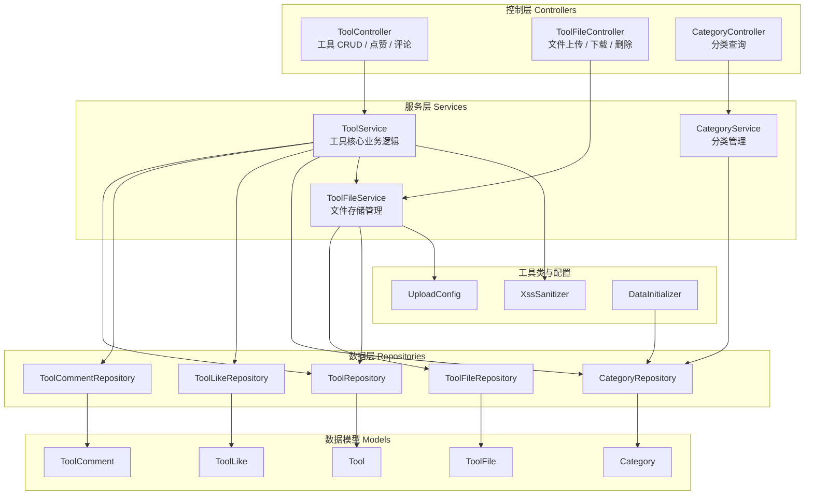
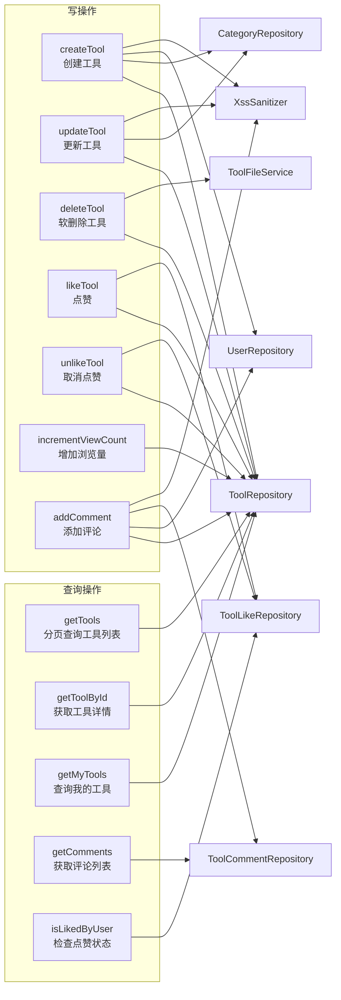
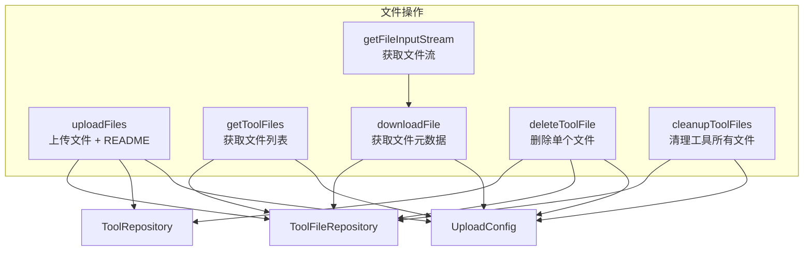
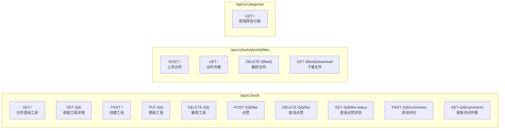
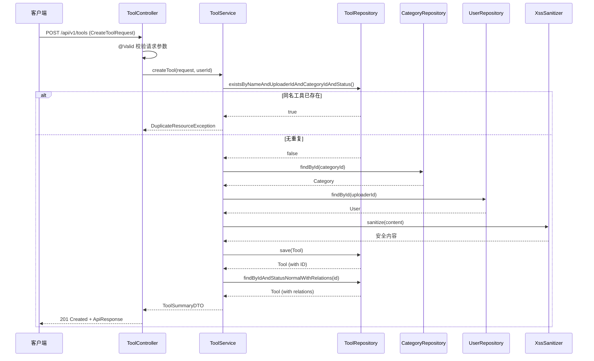
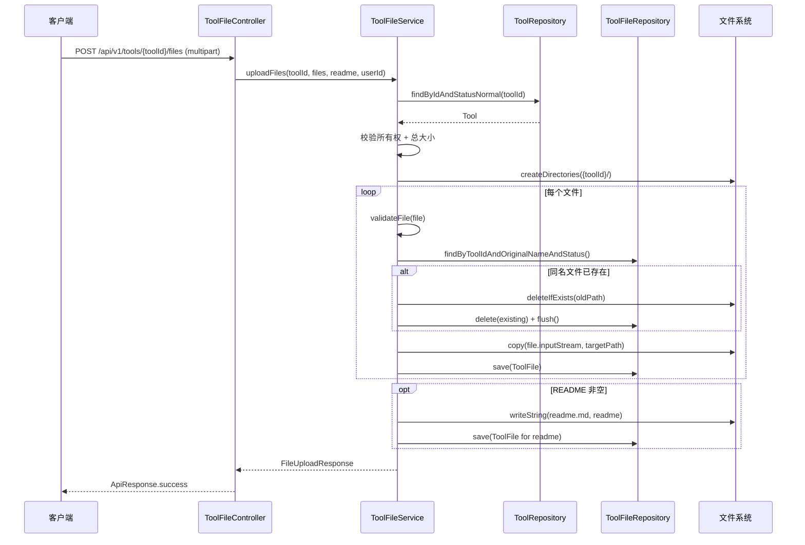
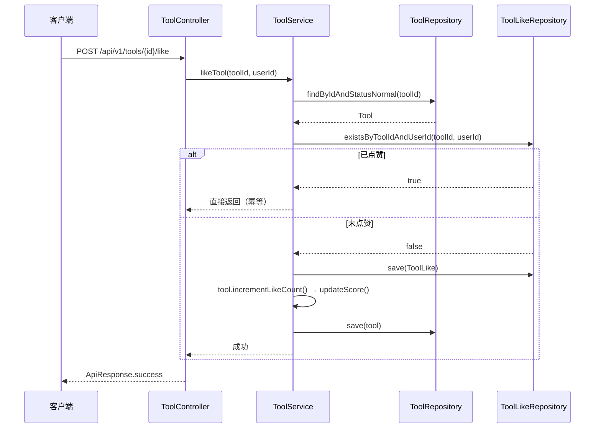
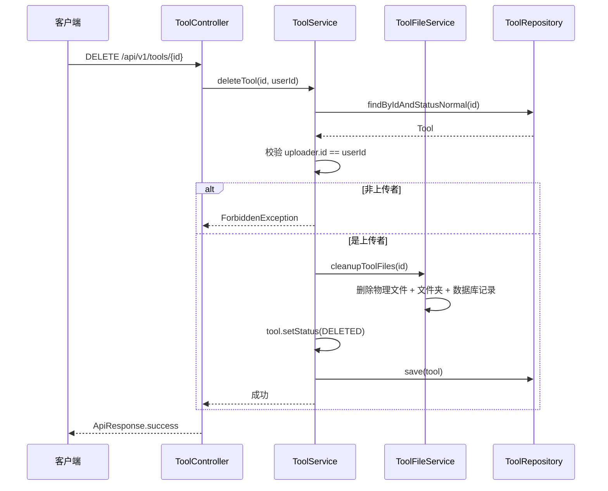
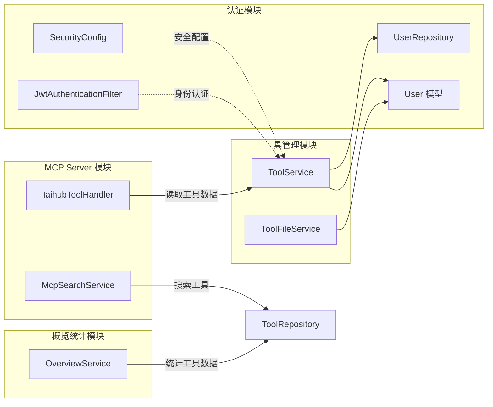
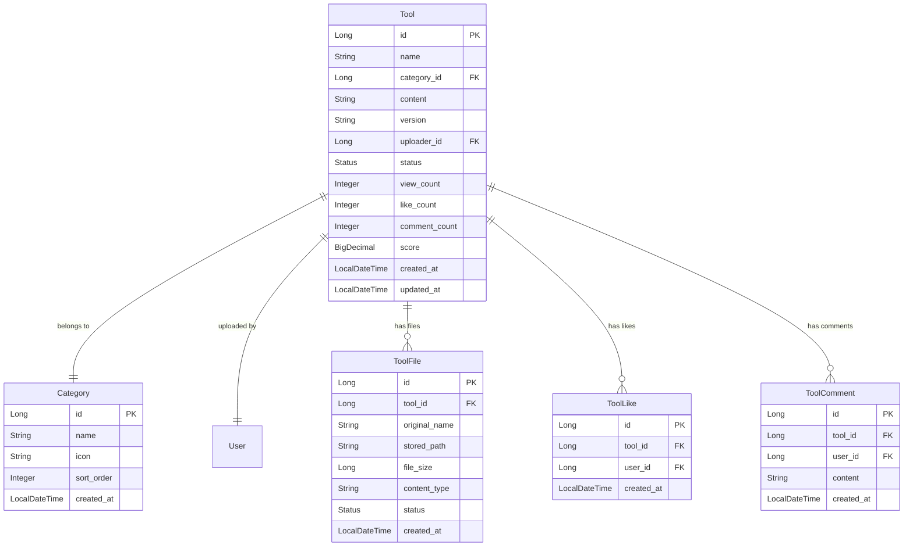

# 工具管理模块 (Tool Management)

## 模块简介

工具管理模块是 IAIHub Toolbox 平台的核心业务模块之一，负责工具的完整生命周期管理，包括工具的创建、查询、更新、删除（软删除），以及工具文件上传/下载、分类管理、点赞、评论和浏览统计等功能。该模块为 [MCP Server 模块](mcp-server.md) 提供工具数据源，同时被 [概览统计模块](overview.md) 用于数据聚合展示。

---

## 架构总览



---

## 核心组件详解

### 1. 数据模型层 (Models)

#### Tool（工具实体）

工具的核心实体，记录工具的基本信息与统计数据。

| 字段 | 类型 | 说明 |
|------|------|------|
| `id` | `Long` | 主键，自增 |
| `name` | `String` | 工具名称（1-100字符） |
| `category` | `Category` | 所属分类（多对一关联） |
| `content` | `String` | 工具介绍内容（TEXT，经 XSS 过滤） |
| `version` | `String` | 版本号（语义化版本格式，如 `1.0.0`） |
| `uploader` | `User` | 上传者（多对一关联） |
| `status` | `Status` | 状态：`NORMAL` / `DELETED`（软删除） |
| `viewCount` | `Integer` | 浏览次数 |
| `likeCount` | `Integer` | 点赞次数 |
| `commentCount` | `Integer` | 评论次数 |
| `score` | `BigDecimal` | 综合评分 |
| `createdAt` | `LocalDateTime` | 创建时间 |
| `updatedAt` | `LocalDateTime` | 更新时间 |

**评分算法：**

```
score = viewCount × 1 + likeCount × 3 + commentCount × 5
```

每次浏览、点赞、评论操作均会自动触发 `updateScore()` 重新计算评分。

**数据库约束：**
- 唯一约束 `uk_tool_uploader_name_category`：同一用户在同一分类下不能上传同名工具
- 索引：`category_id + status`、`uploader_id + status`、`name + status`、`version`

#### ToolFile（工具文件实体）

| 字段 | 类型 | 说明 |
|------|------|------|
| `id` | `Long` | 主键 |
| `toolId` | `Long` | 关联工具 ID |
| `originalName` | `String` | 原始文件名 |
| `storedPath` | `String` | 存储相对路径（唯一约束） |
| `fileSize` | `Long` | 文件大小（字节） |
| `contentType` | `String` | MIME 类型 |
| `status` | `Status` | 状态：`NORMAL` / `DELETED` |

#### ToolLike（工具点赞实体）

| 字段 | 类型 | 说明 |
|------|------|------|
| `id` | `Long` | 主键 |
| `toolId` | `Long` | 关联工具 ID |
| `userId` | `Long` | 点赞用户 ID |
| `createdAt` | `LocalDateTime` | 点赞时间 |

**唯一约束** `uk_tool_like_tool_user`：同一用户对同一工具只能点赞一次。

#### ToolComment（工具评论实体）

| 字段 | 类型 | 说明 |
|------|------|------|
| `id` | `Long` | 主键 |
| `toolId` | `Long` | 关联工具 ID |
| `userId` | `Long` | 评论用户 ID |
| `content` | `String` | 评论内容（TEXT，经 XSS 过滤） |
| `createdAt` | `LocalDateTime` | 评论时间 |

#### Category（分类实体）

| 字段 | 类型 | 说明 |
|------|------|------|
| `id` | `Long` | 主键 |
| `name` | `String` | 分类名称（唯一） |
| `icon` | `String` | 分类图标（Emoji） |
| `sortOrder` | `Integer` | 排序权重 |
| `createdAt` | `LocalDateTime` | 创建时间 |

**默认分类（由 `DataInitializer` 初始化）：**

| 排序 | 名称 | 图标 |
|------|------|------|
| 1 | Skill | 🛠️ |
| 2 | MCP | 🔌 |
| 3 | Prompt | 💬 |
| 4 | 其他 | 📦 |

---

### 2. DTO 层

#### 请求 DTO

| DTO | 用途 | 关键校验 |
|-----|------|----------|
| `CreateToolRequest` | 创建工具 | 名称非空且匹配正则 `^[a-zA-Z0-9\u4e00-\u9fa5_-]+$`；版本号匹配语义化版本格式；内容最大 5000 字符 |
| `UpdateToolRequest` | 更新工具 | 所有字段可选（部分更新）；校验规则同创建 |
| `CreateCommentRequest` | 创建评论 | 内容非空 |

#### 响应 DTO

| DTO | 用途 | 包含字段 |
|-----|------|----------|
| `ToolSummaryDTO` | 工具列表/摘要 | id, name, version, categoryName, categoryIcon, uploaderUsername, uploaderNickname, createdAt |
| `ToolDetailDTO` | 工具详情 | 在 Summary 基础上增加 content, uploaderId, updatedAt, viewCount, likeCount, commentCount, score |
| `ToolFileDTO` | 文件信息 | id, toolId, originalName, storedPath, fileSize, contentType, createdAt |
| `ToolCommentDto` | 评论信息 | id, content, username, createdAt |
| `FileUploadResponse` | 上传响应 | toolId, files(列表), readmeSaved |
| `FileListResponse` | 文件列表 | toolId, folderPath, files(列表), readmeExists |
| `CategoryDTO` | 分类信息 | id, name, icon, sortOrder |

> **通用响应包装**：所有 API 响应均使用 `ApiResponse<T>` 包装，包含 `code`、`message`、`data` 字段。分页响应使用 `PageResponse<T>`，包含 `content`、`totalElements`、`totalPages`、`page`、`size` 字段。

---

### 3. 服务层 (Services)

#### ToolService — 工具核心服务



**核心业务规则：**

1. **创建工具**：检查同一用户在同一分类下是否已存在同名工具（防重复），内容经 `XssSanitizer` 过滤后存储
2. **更新工具**：仅允许工具上传者编辑；名称或分类变更时重新检查重复
3. **删除工具**：软删除（`status` 设为 `DELETED`），删除前调用 `ToolFileService.cleanupToolFiles()` 清理物理文件
4. **点赞/取消点赞**：幂等操作，已点赞则直接返回；取消时同步递减计数
5. **评论**：内容经 XSS 过滤，保存后递增工具评论计数

#### ToolFileService — 文件存储服务



**文件存储规则：**

| 规则 | 说明 |
|------|------|
| 存储根目录 | `UploadConfig.baseDir`（默认 `~/aifiles/`） |
| 工具文件夹 | `{baseDir}/{toolId}/` |
| README 文件 | `{baseDir}/{toolId}/readme.md` |
| 单文件大小限制 | 50MB |
| 单次请求总大小限制 | 200MB |
| 扩展名白名单 | 默认不限制；配置 `app.upload.allowed-extensions` 后启用校验 |
| 同名文件覆盖 | 上传同名文件时，先删除旧物理文件和数据库记录，再保存新文件 |
| 匿名上传 | 当 `userId` 为 null 时跳过所有权校验（用于 MCP 客户端匿名上传） |

#### CategoryService — 分类服务

提供分类列表查询功能。特殊处理：将数据库中的 `"API"` 分类名在返回时统一映射为 `"插件"`。

---

### 4. 控制器层 (Controllers)

#### API 端点总览



#### API 详细说明

##### 工具管理 API

| 方法 | 路径 | 认证 | 说明 |
|------|------|------|------|
| GET | `/api/v1/tools` | 公开 | 分页查询工具，支持 `categoryId`、`keyword`、`sortBy`（latest/name）、`page`、`size` 参数 |
| GET | `/api/v1/tools/{id}` | 公开 | 获取工具详情 |
| POST | `/api/v1/tools` | 需登录 | 创建工具，返回 201 状态码 |
| PUT | `/api/v1/tools/{id}` | 需登录 | 更新工具（仅上传者可操作） |
| DELETE | `/api/v1/tools/{id}` | 需登录 | 删除工具（仅上传者可操作） |
| POST | `/api/v1/tools/{id}/like` | 需登录 | 点赞工具 |
| DELETE | `/api/v1/tools/{id}/like` | 需登录 | 取消点赞 |
| GET | `/api/v1/tools/{id}/like-status` | 可选 | 查询当前用户是否已点赞 |
| POST | `/api/v1/tools/{id}/comments` | 需登录 | 添加评论 |
| GET | `/api/v1/tools/{id}/comments` | 公开 | 获取评论列表 |

##### 文件管理 API

| 方法 | 路径 | 认证 | 说明 |
|------|------|------|------|
| POST | `/api/v1/tools/{toolId}/files` | 可选 | 上传文件（multipart/form-data），支持 `files`（多文件）和 `readme` 参数 |
| GET | `/api/v1/tools/{toolId}/files` | 公开 | 获取工具文件列表 |
| DELETE | `/api/v1/tools/{toolId}/files/{fileId}` | 需登录 | 删除文件（仅上传者可操作） |
| GET | `/api/v1/tools/{toolId}/files/{fileId}/download` | 公开 | 下载文件 |

##### 分类 API

| 方法 | 路径 | 认证 | 说明 |
|------|------|------|------|
| GET | `/api/v1/categories` | 公开 | 获取所有分类（按 sortOrder 排序） |

> **认证机制**：接口认证与用户身份解析由 [认证模块](authentication.md) 的 `JwtAuthenticationFilter` 和 `SecurityConfig` 统一处理。控制器通过 `@AuthenticationPrincipal User` 获取当前登录用户。

---

### 5. 数据访问层 (Repositories)

#### ToolRepository

提供工具数据的查询能力，包含以下关键方法：

| 方法 | 说明 |
|------|------|
| `findByFilters` | 按分类/关键词分页查询，按创建时间倒序 |
| `findByFiltersOrderByName` | 按分类/关键词分页查询，按名称正序 |
| `findByIdAndStatusNormal` | 按 ID 查询正常状态工具 |
| `findByIdAndStatusNormalWithRelations` | 按 ID 查询并 JOIN FETCH 关联的 category 和 uploader |
| `findByUploaderIdAndFilters` | 按上传者 ID + 分类/关键词分页查询 |
| `existsByNameAndUploaderIdAndCategoryIdAndStatus` | 检查同名工具是否存在（创建时） |
| `existsByNameAndUploaderIdAndCategoryIdAndStatusAndIdNot` | 检查同名工具是否存在（更新时排除自身） |
| `findTop10ByStatusAndNameContainingIgnoreCase` | MCP Server 搜索用：按关键词模糊搜索前 10 条 |
| `findTop10ByStatusOrderByCreatedAtDesc` | MCP Server 用：获取最新 10 条工具 |
| `countByStatus` | 按状态统计工具数量 |

#### 其他 Repository

| Repository | 关键方法 |
|------------|----------|
| `ToolFileRepository` | `findByToolId`、`findByToolIdAndStatusNormal`、`findByToolIdAndOriginalNameAndStatus`、`findByIdAndToolId`、`deleteByToolId` |
| `ToolLikeRepository` | `existsByToolIdAndUserId`、`findByToolIdAndUserId`、`deleteByToolIdAndUserId` |
| `ToolCommentRepository` | `findByToolIdOrderByCreatedAtDesc` |
| `CategoryRepository` | `findAllByOrderBySortOrderAsc` |

---

### 6. 工具类与配置

#### XssSanitizer

XSS 防护工具类，用于对所有用户输入内容进行安全过滤：

1. 使用 `StringEscapeUtils.escapeHtml4()` 转义 HTML 特殊字符
2. 移除 `javascript:` 协议模式
3. 移除 `on*=` 事件处理器模式

**应用场景**：工具内容（`content`）、评论内容（`content`）在写入数据库前均经过 `XssSanitizer.sanitize()` 处理。

#### UploadConfig

文件上传配置类，读取 `app.upload.*` 前缀配置：

| 配置项 | 默认值 | 说明 |
|--------|--------|------|
| `baseDir` | `~/aifiles/` | 文件存储根目录 |
| `maxFileSize` | `50MB` | 单文件大小限制 |
| `maxRequestSize` | `200MB` | 单次请求总大小限制 |
| `allowedExtensions` | 空（不限制） | 允许的文件扩展名白名单 |
| `avatarSubdir` | `avatars` | 头像子目录 |
| `avatarMaxFileSize` | `2MB` | 头像文件大小限制 |
| `avatarAllowedExtensions` | jpg, jpeg, png, webp, gif | 头像允许的扩展名 |

#### DataInitializer

实现 `CommandLineRunner`，在应用启动时检查分类表是否为空，若为空则初始化默认分类数据（Skill、MCP、Prompt、其他）。

---

## 核心业务流程

### 工具创建流程



### 文件上传流程



### 点赞流程



### 工具删除流程



---

## 模块间依赖关系



### 与其他模块的交互

| 交互模块 | 关系 | 说明 |
|----------|------|------|
| [认证模块](authentication.md) | 依赖 | `Tool` 实体通过 `@ManyToOne` 关联 `User`；`ToolService` 注入 `UserRepository` 查询用户信息；API 认证由 `SecurityConfig` 和 `JwtAuthenticationFilter` 统一处理 |
| [MCP Server 模块](mcp-server.md) | 被依赖 | `IaihubToolHandler` 通过 `ToolRepository` 读取工具数据；`McpSearchService` 使用 `ToolRepository` 的搜索方法；`ToolFileController` 支持匿名上传（`userId=null`）供 MCP 客户端使用 |
| [概览统计模块](overview.md) | 被依赖 | `OverviewService` 通过 `ToolRepository` 获取工具统计数据（如工具总数、热门工具排名等） |

---

## 数据库 ER 图



---

## 安全设计

### XSS 防护

所有用户输入的文本内容（工具介绍、评论）在持久化前均通过 `XssSanitizer.sanitize()` 进行处理：
- HTML4 实体转义
- 移除 `javascript:` 协议
- 移除 `on*=` 事件处理器

### 权限控制

| 操作 | 权限要求 |
|------|----------|
| 查询工具/分类/评论/文件列表 | 公开（无需认证） |
| 下载文件 | 公开 |
| 创建工具/评论/点赞 | 需登录 |
| 更新/删除工具 | 需登录 + 工具上传者 |
| 删除文件 | 需登录 + 工具上传者 |
| 上传文件 | 可选认证（支持匿名上传供 MCP 使用） |

### 文件安全

- 文件大小限制：单文件 50MB，单次请求 200MB
- 文件路径使用 `StringUtils.cleanPath()` 清理，防止路径遍历攻击
- 扩展名白名单可选配置（默认不限制）

---

## 设计要点总结

1. **软删除机制**：工具删除采用 `status = DELETED` 软删除方式，保留数据可追溯性，所有查询默认过滤 `NORMAL` 状态
2. **评分系统**：内置综合评分算法（浏览×1 + 点赞×3 + 评论×5），每次互动操作自动更新，可用于工具热度排序
3. **幂等点赞**：点赞操作幂等设计，重复点赞不会产生重复记录
4. **文件管理**：文件以工具 ID 为目录隔离存储，支持同名文件覆盖更新，删除工具时自动清理关联文件
5. **MCP 兼容**：文件上传支持匿名模式，`ToolRepository` 提供 MCP Server 专用查询方法，实现与 MCP 协议的无缝集成
6. **数据初始化**：`DataInitializer` 确保系统首次启动时自动创建默认分类数据
