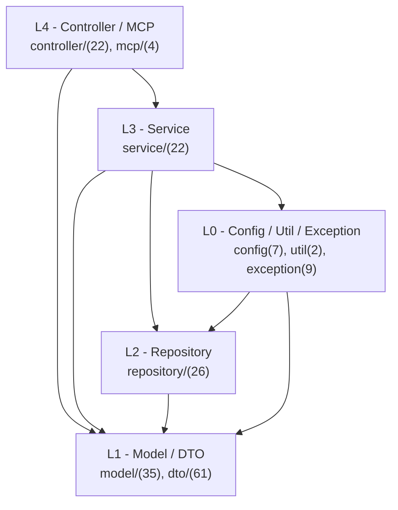
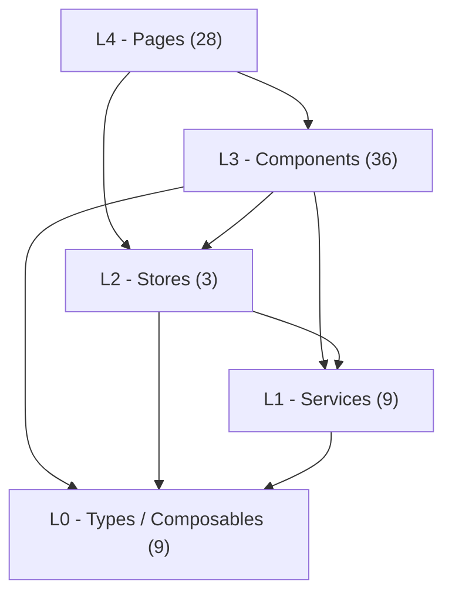
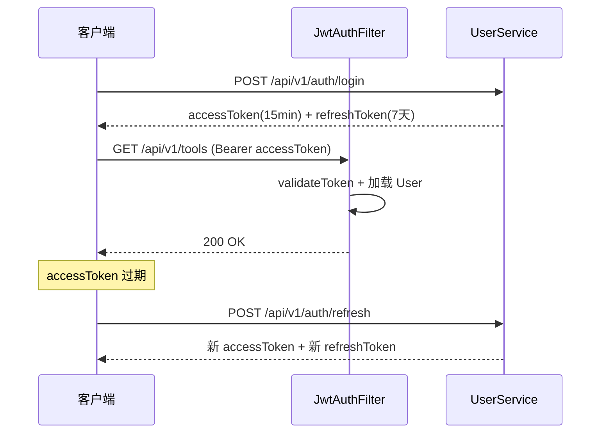
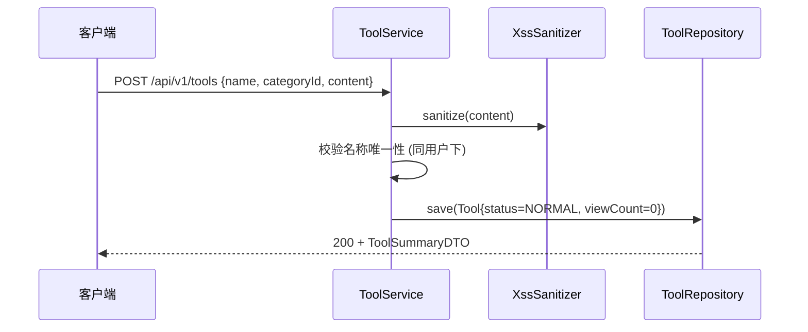
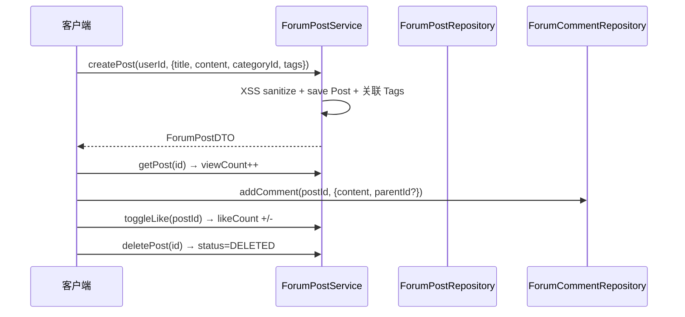
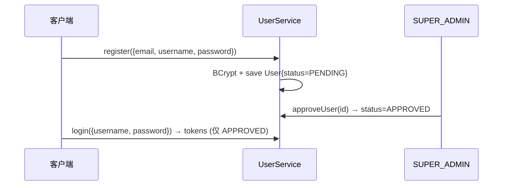
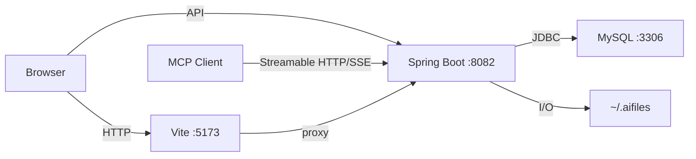

# CodingHub - 架构文档

> 完整的系统设计参考，涵盖分层架构、实体关系、API 设计、安全机制与关键代码路径。

## 1. 系统概述

CodingHub (ai-tool-square) 是一个全栈 Web 应用，提供 AI 工具/资源的管理、分享、社区论坛和微课视频功能。

### 1.1 技术栈

| 层级 | 技术 | 版本 | 说明 |
|------|------|------|------|
| 后端框架 | Spring Boot | 3.2.5 | Web + JPA + Security + Validation |
| 编程语言 | Java | 17 | LTS, source/target 17 |
| 前端框架 | Vue | 3.4.21 | Composition API + `<script setup>` |
| 前端语言 | TypeScript | 5.4.5 | 严格类型检查 |
| 构建 (前端) | Vite | 5.2.8 | HMR + 生产构建 |
| 构建 (后端) | Gradle | 8.5 | Wrapper 模式 |
| UI 组件库 | Element Plus | 2.7.0 | + @element-plus/icons-vue 2.3.1 |
| 数据库 | MySQL | 8.x | utf8mb4, InnoDB, HikariCP |
| ORM | Spring Data JPA | (内置) | Hibernate, ddl-auto=update |
| 认证 | JJWT | 0.12.5 | access 15min + refresh 7 天 |
| XSS 过滤 | commons-text | 1.11.0 | XssSanitizer 封装 |
| MCP SDK | mcp-bom | 2.0.0-RC1 | Model Context Protocol over Streamable HTTP/SSE |
| HTTP 客户端 | Axios | 1.6.8 | 前端 API 调用 |
| 状态管理 | Pinia | 2.1.7 | auth, forum, theme |
| Markdown | markdown-it | 14.1.0 | + highlight.js 11.9 |

### 1.2 端口

| 服务 | 端口 | 说明 |
|------|------|------|
| Spring Boot | 8082 | 后端 API + MCP Streamable HTTP/SSE |
| Vite Dev Server | 5173 | 前端 (proxy /api -> 8082) |
| MySQL | 3306 | 库名: ai_tool_square |

## 2. 后端架构

### 2.1 分层依赖图



> config/ 注入 repository 是 Spring Security 标准用法，不算违规。

### 2.2 包结构总览

| 包 | 核心 | forum/ | video/ | feedback/ | kb/ | notification/ | tag/ | 合计 |
|----|------|--------|--------|-----------|-----|--------------|------|------|
| controller/ | 11 | 5 | 2 | 1 | 1 | 1 | 1 | 22 |
| service/ | 11 | 5 | 2 | 1 | 1 | 1 | 1 | 22 |
| repository/ | 9 | 6 | 4 | 1 | 2 | 1 | 3 | 26 |
| model/ | 12 | 7 | 5 | 2 | 3 | 2 | 4 | 35 |
| dto/ | 34 | 7 | 7 | 3 | 7 | 1 | 2 | 61 |
| config/ | 7 | - | - | - | - | - | - | 7 |
| exception/ | 9 | - | - | - | - | - | - | 9 |
| util/ | 2 | - | - | - | - | - | - | 2 |
| mcp/ | 4 | - | - | - | - | - | - | 4 |

**核心 controller**: AuthController, ToolController, ToolFileController, CategoryController, UserController, AdminController, OverviewController, McpController, PostFavoriteController, AvatarStaticController, StaticController, UnifiedInteractionController

**核心 service**: ToolService, CategoryService, ToolFileService, UserService, OverviewServiceImpl, McpSearchService, PostFavoriteService, UnifiedCommentService, UnifiedFavoriteService, UnifiedLikeService, RagApiClient

**核心 model**: User, Tool, Category, ToolFile, ToolLike, ToolComment, PostFavorite, UnifiedComment, UnifiedFavorite, UnifiedLike, TargetType, Role(enum), AccountStatus(enum)

**config 组件**: SecurityConfig, JwtAuthenticationFilter, McpServerConfig, DataInitializer, UploadConfig, VideoStorageConfig, RagConfig

## 3. 前端架构

### 3.1 分层依赖图



### 3.2 目录总览

| 目录 | 核心 | admin/ | forum/ | video/ | knowledge/ | feedback/ | 合计 |
|------|------|--------|--------|--------|------------|-----------|------|
| pages/ | 11 | 2 | 6 | 6 | 3 | 1 | 28 |
| components/ | 7 | - | 7 | 4 | 7 | 2 | 27 (+9 common/) |

**其他目录**:
- services/(9): api.ts, tool.ts, forum.ts, video.ts, overview.ts, feedback.ts, knowledge.ts, notification.ts, interaction.ts
- stores/(3): auth.ts, forum.ts, theme.ts
- types/(7): index.ts, tool.ts, forum.ts, video.ts, overview.ts, feedback.ts, knowledge.ts
- composables/(2): useContentPermissions.ts, useInteraction.ts

**路由守卫**: `meta.requiresAuth` 检查登录状态; `meta.roles` 检查角色 (如 admin 页面要求 `['SUPER_ADMIN']`)

## 4. 实体关系图

```mermaid
erDiagram
    USER ||--o{ TOOL : uploads
    USER ||--o{ FORUM_POST : authors
    USER ||--o{ FORUM_COMMENT : authors
    USER ||--o{ TOOL_LIKE : likes
    USER ||--o{ FORUM_LIKE : likes
    USER ||--o{ POST_FAVORITE : favorites
    USER ||--o{ VIDEO : uploads
    USER ||--o{ VIDEO_LIKE : likes
    USER ||--o{ VIDEO_FAVORITE : favorites
    USER ||--o{ NOTIFICATION : receives
    USER ||--o{ FEEDBACK_MESSAGE : submits
    CATEGORY ||--o{ TOOL : classifies
    TOOL ||--o{ TOOL_FILE : has
    TOOL ||--o{ TOOL_LIKE : has
    TOOL ||--o{ TOOL_COMMENT : has
    TOOL ||--o{ TOOL_TAG : tagged
    TAG ||--o{ TOOL_TAG : tags
    TAG ||--o{ VIDEO_TAG : tags
    TAG ||--o{ FORUM_POST_TAG : tags
    FORUM_CATEGORY ||--o{ FORUM_POST : categorizes
    FORUM_POST ||--o{ FORUM_POST_TAG : tagged
    FORUM_TAG ||--o{ FORUM_POST_TAG : tags
    FORUM_POST ||--o{ FORUM_COMMENT : comments
    FORUM_POST ||--o{ FORUM_LIKE : likes
    FORUM_POST ||--o{ POST_FAVORITE : favorites
    FORUM_COMMENT ||--o{ FORUM_COMMENT : replies
    VIDEO ||--o{ VIDEO_COMMENT : comments
    VIDEO ||--o{ VIDEO_LIKE : likes
    VIDEO ||--o{ VIDEO_FAVORITE : favorites
    VIDEO ||--o{ DANMAKU : has
    KNOWLEDGE_BASE ||--o{ KB_DOCUMENT : contains

    USER { int id PK, string email UK, string password, string username, string role, string accountStatus, string avatar }
    TOOL { int id PK, string name, int categoryId FK, string content, int uploaderId FK, string version, string status, int viewCount, float score }
    CATEGORY { int id PK, string name UK, string icon, int sortOrder }
    TOOL_FILE { int id PK, int toolId FK, string filePath, string originalName, int fileSize, string contentType }
    TAG { int id PK, string name, string tagType, int usageCount }
    FORUM_POST { int id PK, string title, string content, int authorId FK, int categoryId FK, string status, int viewCount, float score }
    FORUM_COMMENT { int id PK, int postId FK, int authorId, int parentId, int rootId, string content }
    VIDEO { int id PK, string title, int uploaderId FK, string videoPath, string coverPath, string status, int viewCount }
    DANMAKU { int id PK, int videoId FK, string content, int time, string color }
    NOTIFICATION { int id PK, int userId FK, string type, string content, boolean read }
    FEEDBACK_MESSAGE { int id PK, string content, string nickname, string category, int userId FK, string status, string adminReply }
    KNOWLEDGE_BASE { int id PK, string name, string description }
    KB_DOCUMENT { int id PK, int kbId FK, string title, string content }
```

## 5. API 设计

### 5.1 认证与用户

| 方法 | 路径 | 说明 | 认证 |
|------|------|------|------|
| POST | /api/v1/auth/register | 注册 (status=PENDING) | 否 |
| POST | /api/v1/auth/login | 登录 → accessToken + refreshToken | 否 |
| POST | /api/v1/auth/refresh | 刷新 Token | refreshToken |
| GET | /api/v1/auth/me | 当前用户信息 | 是 |
| GET/PUT | /api/v1/users/me | 获取/更新个人信息 | 是 |
| POST | /api/v1/users/me/avatar | 上传头像 | 是 |

### 5.2 工具与文件

| 方法 | 路径 | 说明 | 认证 |
|------|------|------|------|
| GET | /api/v1/tools | 列表 (分页/搜索/分类) | 否 |
| GET | /api/v1/tools/{id} | 详情 (viewCount++) | 否 |
| POST | /api/v1/tools | 创建 | USER+ |
| PUT | /api/v1/tools/{id} | 更新 (isOwner \|\| isAdmin) | USER+ |
| DELETE | /api/v1/tools/{id} | 软删除 | isOwner \|\| isAdmin |
| POST | /api/v1/tools/{id}/like | 点赞切换 | USER+ |
| GET | /api/v1/tools/my | 我的工具 | USER+ |
| GET | /api/v1/tools/ranking | 排行榜 | 否 |
| POST | /api/v1/tools/{toolId}/files | 上传文件 | USER+ |
| GET | /api/v1/tools/{toolId}/files | 文件列表 | 否 |
| DELETE | /api/v1/tools/{toolId}/files/{fileId} | 删除文件 | isOwner |
| GET | /api/v1/tools/{toolId}/files/{fileId}/download | 下载 | 否 |

### 5.3 分类与概览

| 方法 | 路径 | 说明 |
|------|------|------|
| GET | /api/v1/categories | 工具分类列表 |
| GET | /api/overview/stats | 全局统计 |
| GET | /api/overview/tool-ranking | 工具排行 |
| GET | /api/overview/post-ranking | 帖子排行 |

### 5.4 论坛

| 方法 | 路径 | 说明 | 认证 |
|------|------|------|------|
| GET | /api/forum/posts | 帖子列表 | 否 |
| GET | /api/forum/posts/{id} | 帖子详情 | 否 |
| POST | /api/forum/posts | 创建帖子 | USER+ |
| PUT | /api/forum/posts/{id} | 更新 | isOwner |
| DELETE | /api/forum/posts/{id} | 软删除 | isOwner \|\| isAdmin |
| GET | /api/forum/posts/{postId}/comments | 评论列表 | 否 |
| POST | /api/forum/posts/{postId}/comments | 创建评论 | 否* |
| DELETE | /api/forum/comments/{id} | 删除评论 | isOwner \|\| isAdmin |
| POST | /api/forum/likes | 点赞切换 | 否* |
| GET | /api/forum/categories | 分类列表 | 否 |
| GET | /api/forum/tags | 标签列表 | 否 |
| GET/POST | /api/v1/post-favorites | 收藏列表/切换 | USER+ |

> *评论和点赞支持匿名 (authorId/userId 可选)。

### 5.5 微课视频

| 方法 | 路径 | 说明 | 认证 |
|------|------|------|------|
| GET | /api/v1/videos | 视频列表 | 否 |
| GET | /api/v1/videos/{id} | 视频详情 | 否 |
| POST | /api/v1/videos | 上传 (multipart, max 1GB) | USER+ |
| PUT | /api/v1/videos/{id} | 更新 | isOwner |
| DELETE | /api/v1/videos/{id} | 软删除 | isOwner \|\| isAdmin |
| POST | /api/v1/videos/{id}/like | 点赞切换 | USER+ |
| POST | /api/v1/videos/{id}/favorite | 收藏切换 | USER+ |
| GET/POST | /api/v1/videos/{id}/comments | 评论列表/创建 | 否/USER+ |

### 5.6 管理

| 方法 | 路径 | 说明 | 权限 |
|------|------|------|------|
| GET | /api/v1/admin/pending-users | 待审批用户 | SUPER_ADMIN |
| POST | /api/v1/admin/users/{id}/approve | 审批通过 | SUPER_ADMIN |
| POST | /api/v1/admin/users/{id}/reject | 审批拒绝 | SUPER_ADMIN |
| GET | /api/v1/admin/users | 全部用户列表 | ADMIN+ |
| PUT | /api/v1/admin/users/{id}/status | 修改用户状态 | ADMIN+ |

### 5.7 知识库

| 方法 | 路径 | 说明 | 认证 |
|------|------|------|------|
| GET | /api/v1/knowledge | 知识库列表 (分页/排序) | 否 |
| GET | /api/v1/knowledge/{id} | 知识库详情 | 否 |
| POST | /api/v1/knowledge | 创建知识库 | USER+ |
| PUT | /api/v1/knowledge/{id} | 更新知识库 | isOwner |
| DELETE | /api/v1/knowledge/{id} | 删除知识库 | isOwner \|\| isAdmin |
| POST | /api/v1/knowledge/{id}/search | 语义搜索知识库内容 | 否 |

### 5.8 留言反馈

| 方法 | 路径 | 说明 | 认证 |
|------|------|------|------|
| GET | /api/v1/feedback | 留言列表 (分页/分类筛选) | 否 |
| POST | /api/v1/feedback | 提交留言 | 否 |
| PUT | /api/v1/feedback/{id}/reply | 管理员回复 | ADMIN+ |
| DELETE | /api/v1/feedback/{id} | 删除留言 | ADMIN+ |

### 5.9 通知

| 方法 | 路径 | 说明 | 认证 |
|------|------|------|------|
| GET | /api/v1/notifications | 我的通知列表 | USER+ |
| GET | /api/v1/notifications/unread-count | 未读通知计数 | USER+ |
| PUT | /api/v1/notifications/{id}/read | 标记已读 | USER+ |
| PUT | /api/v1/notifications/read-all | 全部标记已读 | USER+ |

### 5.10 统一标签

| 方法 | 路径 | 说明 | 认证 |
|------|------|------|------|
| GET | /api/v1/tags | 标签列表 (按类型筛选) | 否 |
| GET | /api/v1/tags/hot | 热门标签 | 否 |
| POST | /api/v1/tags | 创建标签 | 否 |

### 5.11 统一互动

| 方法 | 路径 | 说明 | 认证 |
|------|------|------|------|
| POST | /api/v1/interactions/likes | 切换点赞/取消 | 否* |
| GET | /api/v1/interactions/likes/status | 点赞状态 | 否* |
| POST | /api/v1/interactions/comments | 添加评论 | 否* |
| GET | /api/v1/interactions/comments | 评论列表 | 否 |
| DELETE | /api/v1/interactions/comments/{id} | 删除评论 | isOwner \|\| isAdmin |
| POST | /api/v1/interactions/favorites | 切换收藏 | USER+ |
| GET | /api/v1/interactions/favorites | 我的收藏 | USER+ |
| GET | /api/v1/interactions/favorites/status | 收藏状态 | USER+ |

> *点赞和评论支持匿名 (IP 哈希或无登录 userName)。

### 5.12 MCP (18 tools via Streamable HTTP/SSE)

Streamable HTTP 入口: `POST /mcp` | SSE 兼容入口: `GET /sse` | 消息: `POST /mcp/message`

| 工具 | 说明 | 认证 |
|------|------|------|
| h3_coding_hub_tool_search / tool_get / tool_files / tool_download | 搜索/详情/文件/下载 | 否 |
| h3_coding_hub_post_search / post_get | 搜索帖子/帖子详情 | 否 |
| h3_coding_hub_tool_create / tool_modify | 创建/修改工具 | username+password |
| h3_coding_hub_post_create | 创建帖子 | username+password |
| h3_coding_hub_tool_file_upload / tool_file_delete | 上传/删除文件 | username+password |
| h3_coding_hub_kb_list / kb_search / kb_create / kb_update / kb_delete / kb_upload_document / kb_document_status | 知识库 CRUD + 搜索 + 文档状态 | kb_create/update/delete 需认证 |

## 6. 安全机制

### 6.1 JWT 认证流程



- Access Token: 15 分钟, 用于 API 认证
- Refresh Token: 7 天, 用于换取新 access token (rotation)
- 密码: BCrypt 哈希存储

### 6.2 权限模型

| 角色 | 权限 |
|------|------|
| USER | 创建/编辑/删除自己的内容 |
| ADMIN | USER + 管理用户 + 删除任意内容 |
| SUPER_ADMIN | ADMIN + 审批用户 + 角色管理 |

内容权限判断: `isOwner(userId) || isAdmin(userRole)`，通过 `useContentPermissions` composable (前端) 和 Service 层 (后端) 双重校验。

### 6.3 防护措施

- **XSS**: 用户输入经 `XssSanitizer.sanitize()` (commons-text) 过滤
- **文件上传**: 可配置后缀白名单 (默认放开)、大小限制 (50MB/文件, 200MB/请求)
- **CORS**: SecurityConfig 配置允许的前端源
- **初始管理员**: admin / Cloud@1234 (DataInitializer)

## 7. 关键请求流程序列图

### 7.1 工具创建



### 7.2 论坛帖子生命周期



### 7.3 用户注册与审批



## 8. 数据库设计

### 8.1 核心表 (6)

| 表名 | 关键字段 | 索引 |
|------|----------|------|
| user | email(UK), password, username, role, accountStatus, avatar, nickname | idx_email |
| category | name(UK), icon, sortOrder | - |
| tool | name, categoryId(FK), uploaderId(FK), status, version, viewCount, likeCount, score | idx_category, idx_uploader, uk_uploader_name, idx_score |
| tool_file | toolId(FK), filePath, originalName, fileSize, contentType | - |
| tool_like | toolId(FK), userId(FK) | uk(tool_id, user_id) |
| tool_comment | toolId(FK), userId(FK), content | - |

### 8.2 统一标签表 (3)

| 表名 | 关键字段 | 说明 |
|------|----------|------|
| tag | name, tagType(TOOL/FORUM/VIDEO), usageCount | 统一标签, uk(name, tagType) |
| tool_tag | toolId(FK), tagId(FK) | 工具-标签关联(复合PK) |
| video_tag | videoId(FK), tagId(FK) | 视频-标签关联(复合PK) |

### 8.3 论坛表 (7)

| 表名 | 关键字段 | 说明 |
|------|----------|------|
| forum_category | name(UK), description, sortOrder | 帖子分类 |
| forum_tag | name(UK), postCount, isSystem | 遗留论坛标签(兼容) |
| forum_post | title, content, authorId(FK), categoryId(FK), status, score | 帖子 (NORMAL/DELETED/HIDDEN) |
| forum_post_tag | postId(FK) + tagId(FK) (复合PK) | 帖子-统一标签关联 |
| forum_comment | postId(FK), authorId, parentId, rootId, content | 嵌套评论 |
| forum_like | postId, commentId, userId, ipHash | 支持匿名 |
| post_favorite | postId(FK), userId(FK) | 帖子收藏 |

### 8.4 微课表 (5)

| 表名 | 关键字段 | 说明 |
|------|----------|------|
| video | title, uploaderId(FK), videoPath, coverPath, status | NORMAL/DELETED |
| video_comment | videoId(FK), userId(FK), content | 视频评论 |
| video_like | videoId(FK), userId(FK) | 点赞 |
| video_favorite | videoId(FK), userId(FK) | 收藏 |
| danmaku | videoId(FK), content, time, color, type | 弹幕 |

### 8.5 知识库表 (2)

| 表名 | 关键字段 | 说明 |
|------|----------|------|
| knowledge_base | name, description, ownerId(FK), status | RAG 知识库 |
| kb_document | kbId(FK), title, content, filePath, fileType | 知识库文档 |

### 8.6 通知表 (1)

| 表名 | 关键字段 | 说明 |
|------|----------|------|
| notification | userId(FK), type(LIKE/COMMENT/SYSTEM), content, isRead | 用户通知 |

### 8.7 留言表 (1)

| 表名 | 关键字段 | 说明 |
|------|----------|------|
| feedback_message | content, nickname, contact, category, userId(FK), status, adminReply | 留言反馈 |

> 完整建表 SQL 见 `Makefile` 的 `db` target。

## 9. 部署架构



- **部署模式**: 本地裸机，无 Docker/CI
- **文件存储**: `~/.aifiles` (环境变量 `AIHUB_FILE_BASE_DIR` 可覆盖)
- **上传限制**: 工具 50MB/文件, 200MB/请求; 视频 1GB
- **初始管理员**: admin / Cloud@1234

## 10. 关键代码路径

| 流程 | 入口 | 核心步骤 |
|------|------|----------|
| 登录 | AuthController.login -> UserService.login | 查找用户 -> BCrypt 校验 -> 检查 APPROVED -> 生成双 Token -> 更新 lastLoginAt |
| Token 刷新 | AuthController.refresh -> UserService.refreshToken | 验证 refreshToken -> 加载最新 User -> 生成新双 Token (rotation) |
| 工具 CRUD | ToolController -> ToolService | XSS 过滤 -> 唯一性校验 -> 权限 (isOwner\|\|isAdmin) -> 软删除 (status=DELETED) |
| 帖子生命周期 | ForumPostController -> ForumPostService | 创建+关联 Tags -> 浏览 viewCount++ -> 评论 (嵌套 parentId) -> 点赞 -> 收藏 -> 软删除 |
| MCP 调用 | McpController -> McpSdkServerConfig -> IaihubToolHandler | Streamable HTTP/SSE 连接 -> tools/call 路由 -> 认证工具: username/password 登录 -> JSON 响应 |
