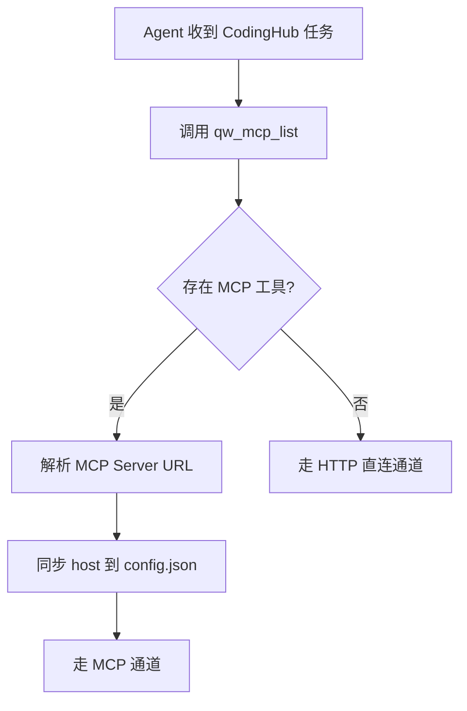

## 理论框架：Anthropic Skill 制作方法论

> 本节内容提炼自 [Skills 制作最佳实践（Anthropic 官方方法论）](Skill制作最佳实践.md)，原文来源为 Anthropic 技术团队成员 Thariq Shihipar（Claude Code 项目）于 2026-06-03 发布的博客 *[Lessons from Building Claude Code: How We Use Skills](https://claude.com/blog/lessons-from-building-claude-code-how-we-use-skills)*。

### Skill 不是 Markdown，是文件夹

> *"A common misconception we hear about skills is that they are 'just markdown files.' They're actually folders that can include scripts, assets, data, etc. that the agent can discover, explore and manipulate."*

很多人认为 Skill "只是 Markdown 文件"，实际上 Skill 是**文件夹**，包含指令、脚本、资源和数据文件，Agent 能**发现、探索和操作**其中的所有内容。

**Skill 的三种组成要素**：

| 要素 | 说明 | 示例 |
|------|------|------|
| **指令** (Instructions) | SKILL.md 核心文件 | 触发条件、工作流程模板 |
| **脚本** (Scripts) | 可执行的辅助代码 | `scripts/` 目录中的 Python/Node.js 脚本 |
| **资源** (Resources) | 参考文档、数据文件、模板 | `references/api.md`、`assets/template.md`、`config.json` |

### 四大设计哲学

| 设计原则 | 含义 | 关键启示 |
|----------|------|----------|
| **渐进式信息披露** | 把文件系统作为上下文工程手段，让 AI 按需读取，不一次性塞满上下文窗口 | SKILL.md 只做"目录"，详细信息拆分到子文件 |
| **灵活性优于严格指令** | 避免"轨道化" AI，给信息但保留适应空间 | 不要写成 SOP 流水线，要写成"知识 + 工具" |
| **为模型而非人类编写** | 模型扫描 Skill 列表来决定"有 Skill 能处理这个请求吗？" | 描述字段不是摘要，是触发说明，要包含触发词 |
| **从实践中演化** | 最佳 Skills 都是"几行指令 + 一个 gotcha"起步 | 不要追求一步到位，持续积累 Gotchas |

### 九条最佳实践概览

| # | 实践 | 核心要点 |
|---|------|----------|
| 1 | 不要陈述显而易见的内容 | 把精力集中在能把 AI 推出"舒适区"的信息上 |
| 2 | 构建 Gotchas（最高信号密度） | 每遇到一次 AI 犯错就加一条 Gotcha，比写大段说明高效 |
| 3 | 善用文件系统的渐进式信息披露 | SKILL.md 只做目录，指向其他子文件 |
| 4 | 避免过度限制灵活性 | 给 AI 知识 + 工具，而不是 SOP |
| 5 | 仔细考虑设置流程 | 配置存储在 `config.json`，支持向用户询问 |
| 6 | 为模型编写描述 | 描述字段包含触发词，让模型自动匹配 |
| 7 | 帮 Claude 构建"记忆" | 通过日志/JSON/SQLite 存储状态，实现跨会话连续操作 |
| 8 | 存储脚本并生成代码 | 给 Claude 脚本和库，让它把精力花在组合而非重建模板 |
| 9 | 使用按需钩子 | 仅在 Skill 被调用时激活的钩子，会话期间有效 |

> **核心洞察**：最好的 Skill 不是给 AI 更多通用知识，而是给它那些"不说不知道"的关键信息和可复用的代码能力。

---

# CodingHub Skill 优化经验总结

> 基于上述理论框架，结合 CodingHub Skill 从 MVP 到 v3.3.0 的完整迭代过程，提炼可复用的 Skill 构建经验。

---

## 1. 背景与概述

CodingHub Skill 是 CodingHub 工具广场的 AI 操作指南，支持 Agent 通过 **MCP（优先）** 或 **HTTP 直连（降级）** 搜索、安装、发布、更新工具，论坛发帖，以及知识库管理。

**关键数据**：
- 首次提交：`eefd203`（2026-06-27）
- 最新版本：`v3.3.0`（2026-07-13）
- 累计 9 次 Skill 专有提交，横跨 **17 天**
- 目录结构从最简 `SKILL.md + config.json` 演化为包含子目录的多文件体系

### 目录结构演化

```
初始版（eefd203, 2026-06-27）       v3.3.0（当前）
                                   
skill/                              skill/
├── SKILL.md                        ├── SKILL.md
                                    ├── config.json
                                    ├── config.json.example
                                    ├── gotchas.md
                                    ├── tools.version
                                    ├── assets/
                                    │   └── template.md
                                    ├── references/
                                    │   ├── kb-management.md
                                    │   └── tool-reference.md
                                    └── scripts/
                                        ├── chub.cjs
                                        └── chub.py
```

---

## 2. 四大设计哲学的实践映射

### 2.1 渐进式信息披露

> **Anthropic 原则**：把文件系统作为上下文工程手段，让 AI 按需读取，不一次性塞满上下文窗口。

**我们的实践**：

| 手法 | 具体操作 | 效果 |
|------|---------|------|
| **SKILL.md 做"目录"** | 核心工作流保持精炼，用 `按需加载` 指导指向子文件 | Agent 第一次激活时只读 300+ 行 SKILL.md |
| **Gotchas 独立文件** | 12 条常见陷阱从 SKILL.md 抽出到 `gotchas.md` | SKILL.md 保持「指令」属性，gotchas 按需加载 |
| **模板文件** | 任务结果报告模板放到 `assets/template.md` | 标准化输出，无需硬编码格式 |
| **子命令速查表** | 功能等价的子命令压缩为表格，不写成大段描述 | 一目十行，减少上下文消耗 |

**关键引用**（SKILL.md 第 186 行）：
```markdown
按需加载：工具参数与 HTTP API 完整对照表详见 references/tool-reference.md；
知识库完整操作详见 references/kb-management.md；常见陷阱速查详见 gotchas.md；
任务完成后按 assets/template.md 格式输出结果报告。
```

### 2.2 灵活性优于严格指令

> **Anthropic 原则**：避免"轨道化" AI，给信息但保留适应空间。

**我们的实践**：

- **双运行时选择**：不强制 Python 或 Node，而是通过检测自动选择（Python 优先 → Node 降级），Agent 无需关心底层实现
- **`$CHUB` 变量模式**：初始化脚本缓存 CLI 路径，后续命令统一使用 `$CHUB`，Agent 只需执行子命令即可
- **MCP / HTTP 双通道**：给出通道选择流程（MCP 优先 → HTTP 降级），让 Agent 自行决策
- **Partial Update**：`modify` 子命令只更新传入字段，`version` 不传自动递增，Agent 无需纠结版本号

### 2.3 为模型而非人类编写

> **Anthropic 原则**：描述字段不是摘要，是何时触发该 Skill 的说明；包含触发词。

**我们的实践**：

description 字段（`SKILL.md` 第 2-3 行）：
```yaml
description: CodingHub 工具广场操作指南。当用户要求搜索/安装/发布/更新 CodingHub 工具，
  发帖到论坛，管理知识库，或与 CodingHub 平台交互时使用。支持双通道：MCP 优先，HTTP 直连
  自动降级（Python 或 Node.js CJS CLI 封装，跨平台）。
```

**触发词覆盖**：
- 搜索/安装/发布/更新 CodingHub 工具
- 发帖到论坛
- 管理知识库
- 与 CodingHub 平台交互


## 3. 九条最佳实践的映射

### 实践 1：不要陈述显而易见的内容

> Claude 已经会编码、能读代码库。重述默认行为的 Skill 只会浪费上下文。

**我们的方式**：SKILL.md 不解释`curl`、`JSON`、`HTTP`等通用概念，专注 CodingHub 特有的 API 结构（双通道、Token 三级降级、退出码约定）。

### 实践 2：构建 Gotchas（最高信号密度）

> 这是任何 Skill 中信号价值最高的部分。

gotchas.md（12 条）覆盖了 Agent 最容易犯错的关键场景：
- 文件上传走 REST 不走 MCP
- 下载链接是相对路径需拼接 baseUrl
- MCP 端点无需 JWT
- chub CLI 自动处理 token
- 知识库文档上传后异步处理（必须等全部 READY 后再检索）
- 含图片文档必须预处理

### 实践 3：善用文件系统的渐进式信息披露

整个 codinghub Skill 是这一原则的典型实践——参见 [2.1 渐进式信息披露](#21-渐进式信息披露)。

### 实践 4：避免过度限制 Claude 的灵活性

**反面示例**（我们避免的做法）：
```
你必须先调用 tool-search，然后调用 tool-get，然后调用 tool-files...
```

**我们的做法**：给出双通道选择流程图（第 15-24 行），让 Agent 根据环境自主决策走哪个通道。

### 实践 5：仔细考虑设置流程

**三个维度的配置设计**：

1. **配置结构演化**：从单字段 `baseUrl` 拆分为 `host` + `backendPort` + `frontendPort`，明确职责
   ```json
   // 旧版（v1）
   { "baseUrl": "http://localhost:8082" }
   
   // 新版（v3.3.0）
   { "host": "http://localhost", "backendPort": "8082", "frontendPort": "80" }
   ```

2. **自动同步**：MCP 通道检测时自动提取 server URL 的 host 部分写入配置，无需手动设置

3. **凭据获取策略**：配置 → 记忆 → 询问 三级降级，始终写入 config.json

### 实践 6：为模型编写描述

参见 [2.3 为模型而非人类编写](#23-为模型而非人类编写)。

### 实践 7：帮 Claude 构建"记忆"

**三级 Token 降级机制**（内置在 chub CLI 中）：
1. access 未过期 → 直接复用（读 config.json）
2. access 过期、refresh 存在 → 调 refresh 接口
3. refresh 失效 → 自动重新 login

所有 token 自动写回 config.json，Agent 无感。

### 实践 8：存储脚本并生成代码

**双运行时 CLI 架构**：

| 文件 | 语言 | 依赖 | 优先级 |
|------|------|------|--------|
| `scripts/chub.py` | Python 3.8+ | requests 库 | **首选** |
| `scripts/chub.cjs` | Node.js ≥ 18.13 | 零第三方依赖 | 降级 |

**设计要旨**：Agent 无需重复实现 API 调用逻辑，只需执行 `$CHUB tool-create/tool-search/post-create` 等高层子命令。脚本内置健康检查、Token 管理、401 自动重试、JSON 统一输出。

### 实践 9：使用按需钩子

**MCP 通道检测 hook**：每次 Session 首次调用前，自动检测 MCP 可用性。

**MCP Host 同步**：检测到 MCP 工具后，自动解析 server URL 并同步到 config.json 的 `host` 字段——后续网站访问和 HTTP 降级都基于此地址。



---

## 4. 具体优化案例详解

### 案例 1：运行时优先级反转

**背景**：原先默认 Node.js ≥ 18.13（首选），Python 3.8+（降级）。

**问题**：Windows 开发环境通常 Python 更常见（系统预装），且 Python 的 `requests` 库在处理文件下载、SSE 等方面更成熟。

**优化**（当前状态）：Python 3.8+ 与 `requests` 库 **首选**，Node.js 降级。初始化脚本自动检测 `import requests`：

```bash
if command -v python >/dev/null 2>&1 && python -c "import requests" 2>/dev/null; then
  CHUB="python scripts/chub.py"
elif command -v node >/dev/null 2>&1; then
  CHUB="node scripts/chub.cjs"
fi
```

**启示**：运行时选择应基于实际可用性而非设计者偏好，使用自动检测而非硬编码。

### 案例 2：Config 字段拆分

**背景**：原来 `baseUrl` 一个字段同时承载协议+主机+后端端口，前端端口无法配置。

**问题**：
- 前端端口和后端端口是不同的端口（5173 vs 8082）
- 网站访问和 API 调用需要不同的端口
- 无法灵活切换 IP（如从 localhost 改为局域网 IP）

**优化**（当前状态）：
```json
{
  "host": "http://localhost",
  "backendPort": "8082",
  "frontendPort": "80"
}
```

运行时 `loadConfig()` 动态拼接 `baseUrl`：
```python
cfg["baseUrl"] = f"{cfg['host']}:{cfg['backendPort']}"
```

**启示**：配置文件字段设计应遵循**单一职责原则**——每个字段只存一个信息，组合在运行时完成。避免为了"方便"而合并不同含义的字段。

### 案例 3：Gotchas 独立抽取

**背景**：12 条常见陷阱原来散布在 SKILL.md 的工作流描述中。

**问题**：
- Agent 每次激活都需要读这些陷阱，即使当前任务不涉及
- SKILL.md 越来越长，指令密度下降
- 新增陷阱时需要在多个位置插入

**优化**：全部抽取到独立的 `gotchas.md`，SKILL.md 通过"按需加载"引用。

**启示**：这是**渐进式信息披露**最直接的体现。Gotchas 不应该挤占 SKILL.md 的"指令"空间，它们应该按需加载。

### 案例 4：任务结果标准化

**背景**：Agent 执行完操作后，输出结果格式不统一，有时没有网页访问地址。

**优化**：创建 `assets/template.md`，标准化输出结构：
```markdown
**操作描述**
简要说明执行了什么操作

**操作结果**
操作执行的结果
- 工具访问地址: {host}:{frontendPort}/tools/{toolId}
- 帖子访问地址: {host}:{frontendPort}/forum/posts/{postId}
```

**启示**：模板文件让 Agent 输出**可预测**，同时降低了"每次都要想怎么输出"的认知负担。这是**实践 7（帮 Claude 构建记忆）** 的延伸——不是记录历史，而是标准化行为。

### 案例 5：MCP Host 自动同步

**背景**：MCP 通道和 HTTP 降级通道共用同一套服务的 IP 地址。如果用户的环境 IP 变化（如从 localhost 切换到局域网 IP），config.json 需要同步更新。

**优化**：在通道选择流程中增加 MCP host 同步步骤：
1. 调用 `qw_mcp_list` 检测 MCP 工具
2. 从工具元数据或 MCP 客户端配置文件提取 server URL
3. 解析 URL 中的 `协议+主机名` 写入 config.json 的 `host` 字段

**启示**：配置不应是静态的。Skill 可以利用运行时检测能力自动维护配置一致性，减少手动设置负担。

---

## 5. 架构决策记录

### 决策 1：双通道架构（MCP + HTTP）

- **选择理由**：MCP 是官方推荐模式，但 Agent 环境中 MCP 可能未配置；HTTP 直连作为通用降级方案
- **权衡**：HTTP 直连需要管理 Token（chub CLI 内置三级降级解决）、需要配置 baseUrl
- **效果**：两种环境下均可正常工作，用户无需配置 MCP

### 决策 2：双运行时脚本（Python + Node.js）

- **选择理由**：跨平台兼容，不强制 Python 依赖（Windows 可能没有 Python）
- **权衡**：维护两套代码的成本；子命令和输出格式必须完全一致
- **效果**：19 个子命令在两种运行时表现完全一致，Agent 切换无感知

### 决策 3：baseUrl 动态拼接而非硬编码

- **选择理由**：config.json 只存原始数据，拼接逻辑在脚本的 `loadConfig()` 中完成
- **好处**：新旧 config 兼容；可随时修改 host/port 而无需改动脚本
- **注意**：Agent 执行 curl 命令时需要自行拼接，SKILL.md 中有明确说明

### 决策 4：不兼容旧版 baseUrl

- **选择理由**：旧版 `baseUrl` 字段无法支撑前端端口和主机分离的需求
- **迁移方式**：所有 chub 脚本统一用 `cfg["baseUrl"] = f"{cfg['host']}:{cfg['backendPort']}"` 动态拼接
- **启示**：在项目早期阶段，不必为了向后兼容而保留设计不良的字段。快速埋葬旧模式，让代码保持简洁。

---

## 6. 经验教训与行动建议

### 做得好的

| 实践 | 经验 | 效果 |
|------|------|------|
| **从 MVP 开始** | 初始 SKILL.md 不到 100 行，逐步迭代 | 17 天 9 次提交，每次改进一个点 |
| **关注 Gotchas** | 12 条陷阱全部来自真实 Agent 失败 | Agent 操作正确率显著提升 |
| **脚本 > 指令** | CLI 脚本封装复杂逻辑（Token 管理、401 重试） | Agent 只需执行子命令，无需理解 Token 机制 |
| **渐进式拆分** | 从单文件到多目录，每次拆都有明确理由 | 信息密度始终保持在合适水平 |
| **双通道兜底** | MCP 不可用时自动降级 HTTP | 无需用户任何配置即可工作 |

### 可以改进的

| 改进点 | 建议 | 优先级 |
|--------|------|--------|
| **验证闭环** | 增加 `validate.py` 脚本，操作后自动验证状态 | 中 |
| **记忆持久化** | 将操作日志追加到 skill 目录下的 `.log` 文件，实现跨会话连续操作 | 低 |
| **错误模式积累** | 遇到新的 Agent 失败，系统化收集到 gotchas.md | 持续 |
| **单元测试** | 为 chub.py 和 chub.cjs 编写测试用例，确保双运行时输出一致 | 中 |

### 核心洞察

1. **文件系统是最好的上下文工程工具**——通过渐进式披露，让 AI 在正确时机获取正确信息
2. **Gotchas 是最具投资回报率的内容**——每条陷阱都来自真实失败，比写大段说明效率高得多
3. **脚本是给 AI 最强的武器**——Agnet 最擅长"组合"而非"实现"，把复杂度封装到 CLI 脚本中
4. **配置设计要面向未来**——字段拆分比字段合并容易百倍，`baseUrl` → `host + backendPort` 的教训值得记住
5. **最好的 Skill 不是给 AI 更多通用知识，而是给它那些"不说不知道"的关键信息和可复用的代码能力**

---

> **最后更新**：2026-07-14
>
> **相关文档**：[Skill制作最佳实践](Skill制作最佳实践.md) | [CodingHub 架构总览](ARCHITECTURE.md)
