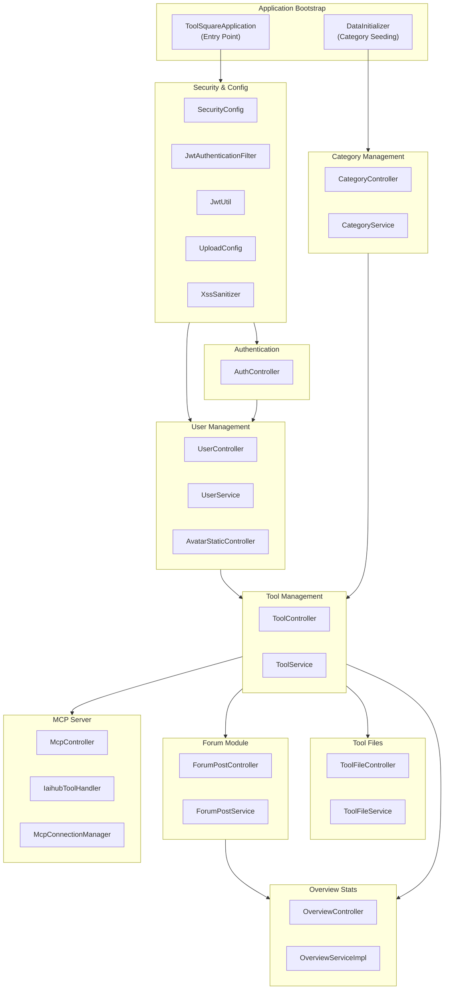
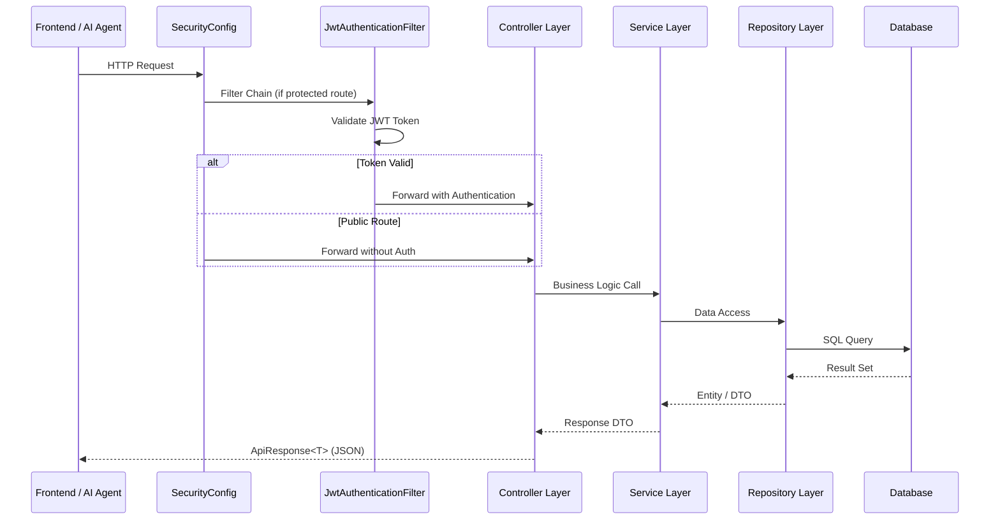
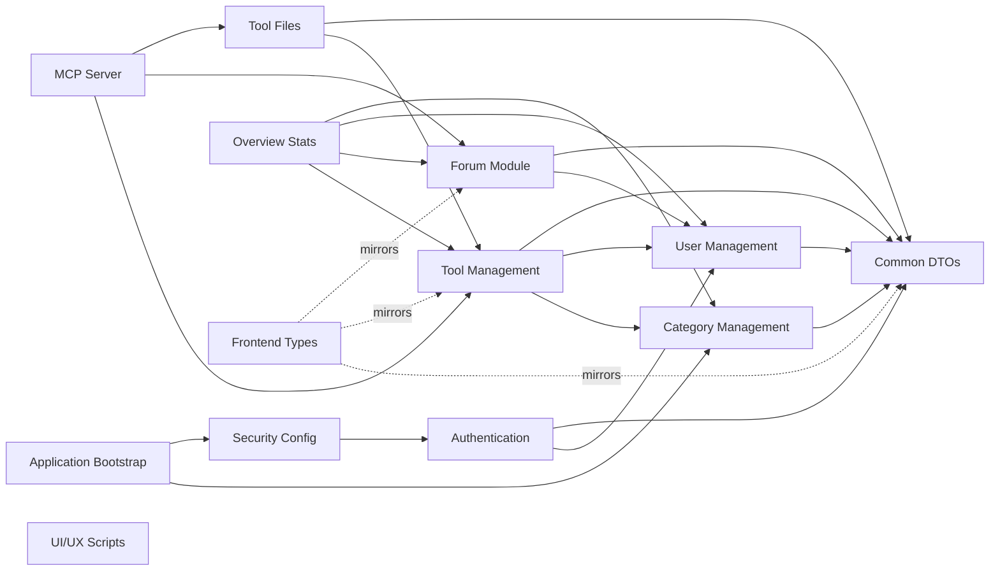

# Application Bootstrap Module

## 1. Introduction

The **Application Bootstrap** module is the entry point of the **ToolSquare** platform — a Spring Boot-based toolbox application that enables users to share, discover, and manage AI tools, prompts, and MCP (Model Context Protocol) resources. The platform also includes a community forum, file management, and an MCP server for AI agent integration.

This module is responsible for:

- **Application startup** — Bootstrapping the Spring Boot application context via `ToolSquareApplication`.
- **Data seeding** — Initializing default tool categories on first run via `DataInitializer`.

## 2. Architecture Overview

ToolSquare follows a classic **layered Spring Boot architecture** with controllers, services, repositories, and models. The application is organized into the following functional sub-modules:



### Request Flow



## 3. Core Components

### 3.1 ToolSquareApplication

The main Spring Boot application class. It uses the `@SpringBootApplication` annotation which enables:

- **Auto-configuration** — Spring Boot automatically configures beans based on classpath dependencies.
- **Component scanning** — Scans the `com.iaihub.toolbox` package for Spring components (`@Controller`, `@Service`, `@Repository`, `@Component`, `@Configuration`).
- **Configuration** — Registers the class as a configuration source.

```java
@SpringBootApplication
public class ToolSquareApplication {
    public static void main(String[] args) {
        SpringApplication.run(ToolSquareApplication.class, args);
    }
}
```

### 3.2 DataInitializer

A `CommandLineRunner` component that executes after the application context is fully initialized. It seeds the database with default tool categories if none exist:

| Category | Icon | Sort Order |
|----------|------|------------|
| Skill    | 🛠️  | 1          |
| MCP      | 🔌  | 2          |
| Prompt   | 💬  | 3          |
| 其他 (Other) | 📦 | 4      |

This ensures the application is usable immediately after a fresh deployment without manual data setup. The `DataInitializer` depends on the [Category Management](#5-sub-module-overview) module's `CategoryRepository`.

## 4. Application Configuration

The bootstrap module integrates with several configuration classes that are loaded at startup:

| Configuration | Prefix | Purpose |
|--------------|--------|---------|
| `SecurityConfig` | — | Spring Security filter chain, CORS, password encoder |
| `UploadConfig` | `app.upload` | File upload directory, size limits, extension whitelists |
| `McpServerConfig` | `mcp.server` | MCP server host, port, connection limits |

### Security Configuration Highlights

The `SecurityConfig` defines a **stateless** security model (no server-side sessions) with JWT-based authentication:

- **Public endpoints**: `/api/v1/auth/**`, `GET /api/v1/tools`, `GET /api/v1/categories`, `/mcp/**`, `/sse`, avatar static resources
- **Protected endpoints**: `POST/PUT/DELETE /api/v1/tools/**`, `/api/v1/users/**`
- **CORS**: All origins, methods, and headers allowed with credentials
- **Password encoding**: BCrypt

### Upload Configuration

The `UploadConfig` initializes file storage directories at startup:
- Default base directory: `~/aifiles/`
- Avatar subdirectory: `~/aifiles/avatars/`
- Max file size: 50MB (tools), 2MB (avatars)
- Avatar allowed extensions: jpg, jpeg, png, webp, gif

## 5. Sub-Module Overview

The following sub-modules make up the ToolSquare platform. Each has its own detailed documentation:

### 5.1 Security & Configuration ([security_config.md](security_config.md))
Manages JWT-based authentication, CORS, XSS sanitization, and file upload configuration. Core components include `SecurityConfig`, `JwtAuthenticationFilter`, `JwtUtil`, `UploadConfig`, and `XssSanitizer`.

### 5.2 Authentication ([authentication.md](authentication.md))
Handles user registration, login, and JWT token refresh. Exposes endpoints under `/api/v1/auth/**`. Core components include `AuthController` and associated request/response DTOs.

### 5.3 User Management ([user_management.md](user_management.md))
Manages user profiles, avatar uploads, and public user profiles. Includes `UserController`, `AvatarStaticController`, `UserService`, `UserRepository`, and the `User` entity.

### 5.4 Common DTOs ([common_dto.md](common_dto.md))
Shared data transfer objects used across all modules:
- **`ApiResponse<T>`** — Standard wrapper with `code`, `message`, and `data` fields. Provides static factory methods: `success()`, `created()`, `error()`.
- **`PageResponse<T>`** — Paginated response wrapper for list endpoints.

### 5.5 Category Management ([category_management.md](category_management.md))
Manages tool categories (Skill, MCP, Prompt, Other). Includes `CategoryController`, `CategoryService`, `CategoryRepository`, and the `Category` entity. Categories are seeded by `DataInitializer` on first startup.

### 5.6 Tool Management ([tool_management.md](tool_management.md))
The core module for managing tools — CRUD operations, likes, comments, and scoring. Includes `ToolController`, `ToolService`, `ToolRepository`, and related models (`Tool`, `ToolComment`, `ToolLike`). Tools have a scoring system: `score = viewCount × 1 + likeCount × 3 + commentCount × 5`.

### 5.7 Tool Files ([tool_files.md](tool_files.md))
Handles file upload, download, and listing for tools. Includes `ToolFileController`, `ToolFileService`, `ToolFileRepository`, and the `ToolFile` entity. Files are stored on the local filesystem under the configured upload directory.

### 5.8 Forum Module ([forum_module.md](forum_module.md))
A community forum with posts, comments, likes, tags, categories, and favorites. Includes multiple controllers (`ForumPostController`, `ForumCommentController`, `ForumLikeController`, `ForumCategoryController`, `ForumTagController`, `PostFavoriteController`) and their corresponding services and repositories.

### 5.9 MCP Server ([mcp_server.md](mcp_server.md))
Implements a Model Context Protocol (MCP) server that exposes tools, posts, and files to AI agents via SSE (Server-Sent Events). Includes `McpController`, `IaihubToolHandler`, `McpConnectionManager`, `McpResourceHandler`, and `McpSearchService`. The MCP server runs on a configurable port (default: 8082).

### 5.10 Overview Stats ([overview_stats.md](overview_stats.md))
Provides dashboard statistics including user/post/tool counts and top-ranked tools and posts by category. Includes `OverviewController`, `OverviewServiceImpl`, and ranking DTOs.

### 5.11 Frontend Types ([frontend_types.md](frontend_types.md))
TypeScript type definitions for the Vue.js frontend, covering tools, forum, users, categories, files, and overview stats. These types mirror the backend DTOs for type-safe API communication.

### 5.12 UI/UX Skills Scripts ([ui_ux_skills_scripts.md](ui_ux_skills_scripts.md))
Development tooling scripts including a BM25 search algorithm implementation and a design system generator. These are used in IDE skill configurations (CodeBuddy, Windsurf) for UI/UX assistance.

## 6. Module Dependency Graph



## 7. Technology Stack

| Layer | Technology |
|-------|-----------|
| Framework | Spring Boot (Java) |
| Security | Spring Security + JWT |
| ORM | Spring Data JPA / Hibernate |
| Database | Relational (via JPA) |
| API Style | RESTful (`/api/v1/**`) |
| MCP Protocol | SSE (Server-Sent Events) |
| Frontend | Vue.js + TypeScript |
| Build | Maven / Gradle |
| File Storage | Local filesystem |

## 8. API Endpoint Summary

| Module | Base Path | Key Endpoints |
|--------|-----------|---------------|
| Authentication | `/api/v1/auth` | `POST /register`, `POST /login`, `POST /refresh` |
| User Management | `/api/v1/users` | `GET /{id}`, `PUT /profile`, `POST /avatar` |
| Tool Management | `/api/v1/tools` | `GET`, `GET /{id}`, `POST`, `PUT /{id}`, `DELETE /{id}`, `POST /{id}/like`, `POST /{id}/comments` |
| Tool Files | `/api/v1/tools/{toolId}/files` | `GET`, `POST`, `GET /{fileId}/download` |
| Category Management | `/api/v1/categories` | `GET` |
| Forum | `/api/forum` | `/posts`, `/comments`, `/categories`, `/tags`, `/likes`, `/favorites` |
| MCP Server | `/mcp`, `/sse` | MCP protocol endpoints |
| Overview Stats | `/api/v1/overview` | `GET /stats`, `GET /tool-ranks`, `GET /post-ranks` |
