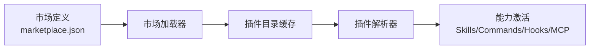
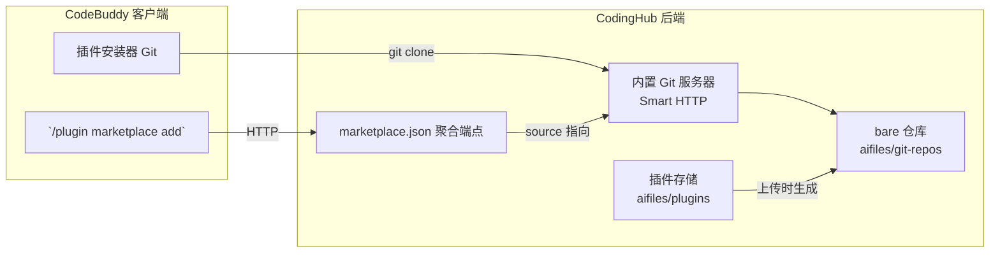

# 从零构建 AI 编码助手的插件生态：CodeBuddy 插件市场对接实战

> 本文从插件（Plugin）的基本概念出发，讲解 CodeBuddy 插件市场的机制与对接规范（兼容 Claude Code 规范），并给出一个完整的落地案例——用 CodingHub 平台自建插件市场，实现从「本地目录分发」到「内置 Git 服务器 + URL 市场」的完整闭环。

---

## 一、什么是插件（Plugin）？

插件是**扩展 AI 编码助手能力的最小单元**。它把一组相互关联的能力（技能、命令、钩子、MCP 服务）打包成一个可安装、可分发、可版本化的实体，让 AI 助手在基础能力之外，获得领域化的增强。

### 插件能提供什么能力？

| 能力类型 | 说明 | 典型例子 |
|---------|------|---------|
| **Skills（技能）** | 注入领域知识与工作流，对话中可被调用 | 代码审查、数据库建模、UI 设计 |
| **Commands（命令）** | 提供 `/xxx` 形式的斜杠命令 | `/review`、`/commit`、`/migrate` |
| **Hooks（钩子）** | 在特定事件触发时自动执行 | PreToolUse、PostToolUse、SessionStart |
| **MCP Servers** | 接入外部工具/数据源的模型上下文协议服务 | 搜索、数据库、浏览器控制 |
| **LSP Servers** | 语言服务器协议支持 | 自定义语言提示与诊断 |
| **Agents（代理）** | 预配置的子代理（Subagent） | 专职审查者、专职研究者 |

### 一句话概括

> 插件 = 能力的「安装包」。它让 AI 助手像装 App 一样，按需获得新技能，而不是每次手动粘贴配置。

### 为什么需要插件机制？

在 AI 编码助手（CodeBuddy、Claude Code 等）普及之前，能力扩展往往意味着修改助手本体配置、克隆多个 GitHub 仓库、手工维护目录。插件的出现解决了三个痛点：

1. **能力打包**：把散落的能力收敛成结构清晰的包，统一入口、统一版本。
2. **标准化分发**：遵循统一规范，任何兼容的助手都能识别并安装。
3. **生态复用**：开发者发布一次，所有用户即装即用。

---

## 二、CodeBuddy 插件市场

### 插件市场的角色

CodeBuddy 的插件市场（Plugin Marketplace）是一个**插件分发的中枢**。它的职责可以拆解为三个部分：



1. **市场定义**：一个 `marketplace.json` 清单，列出该市场提供的所有插件及其来源。
2. **插件拉取**：按清单把每个插件克隆/下载到本地缓存目录。
3. **能力激活**：解析插件的 `plugin.json`，把其中的 Skill、Command、Hook 等能力注册到运行时，使其可用。

### 市场支持的四种类型

CodeBuddy 支持通过四种方式添加市场：

| 类型 | 添加方式 | 说明 |
|------|---------|------|
| **Directory** | `/plugin marketplace add <本地目录路径>` | 本地目录市场，插件为相对路径 |
| **GitHub** | 指向 GitHub 仓库 | 以 git 仓库为市场源 |
| **Git** | 指向任意 git 仓库 URL | GitLab、Bitbucket 等 |
| **URL** | `/plugin marketplace add <http://.../marketplace.json>` | 通过 HTTP(S) 加载市场清单 |

### 插件 `source` 字段的两种格式

`source` 是 `marketplace.json` 中每个插件的关键字段，CodeBuddy 通过它决定用哪个「安装器」拉取插件：

| 格式 | 安装器 | 场景 |
|------|--------|------|
| **字符串**（相对路径 `./plugins/xxx`） | Local 安装器 | 插件与市场在同一仓库内 |
| **对象** `{ "source": "github"/"url", ... }` | Git 安装器 | 插件来自远程 git 仓库 |

对象格式的两种写法：

```json
{
  "name": "github-plugin",
  "source": { "source": "github", "repo": "owner/plugin-repo" }
}
```

```json
{
  "name": "git-plugin",
  "source": { "source": "url", "url": "https://your-host/repos/plugin.git" }
}
```

### 一个容易踩的坑：裸 HTTP URL 不被识别

插件市场的 `source` 必须满足**上述两种格式之一**。如果直接把一个 `.zip` 下载地址作为字符串 source：

```json
{
  "name": "code-reviewer",
  "source": "http://localhost:8082/api/v1/plugins/1/download"
}
```

CodeBuddy 的 Local 安装器会把它当成**相对路径**去拼接，Git 安装器又只接受对象形式——**两种都不匹配，导致「点安装没反应」**。这是自建市场时最常见的坑。

---

## 三、对接规范：兼容 Claude Code

CodeBuddy 的插件规范**兼容 Claude Code 的插件（Plugin）与技能（Skill）生态**，这意味着已有的 Claude Code 插件可以近乎零改动地在 CodeBuddy 中运行。

### 标准插件目录结构

```text
my-plugin/
├── .codebuddy-plugin/       # CodeBuddy 插件清单目录
│   └── plugin.json          # 插件主清单（必填）
├── skills/                  # 技能目录（可选）
│   └── my-skill/
│       └── SKILL.md         # 技能定义
├── commands/                # 斜杠命令目录（可选）
│   └── my-command/
│       └── my-command.md
├── hooks/                   # 钩子目录（可选）
│   └── my-hook/
│       └── hook.py
├── agents/                  # 子代理目录（可选）
├── .mcp.json                # MCP 服务配置（可选）
├── .lsp.json                # LSP 服务配置（可选）
└── settings.json            # 插件设置（可选）
```

### `plugin.json` 清单核心字段

```json
{
  "name": "my-plugin",
  "version": "1.0.0",
  "description": "插件描述",
  "author": "作者",
  "icon": "图标 URL",
  "commands": ["./commands/core/"],
  "agents": ["./agents/reviewer.md"],
  "skills": ["./skills/deployment.md"],
  "hooks": { "...": "..." },
  "mcpServers": { "...": "..." },
  "strict": false
}
```

### 关键约定

- **`name`** 使用 kebab-case（小写字母/数字/连字符），如 `code-reviewer`。
- **`plugin.json`** 必须位于 `.codebuddy-plugin/` 目录或插件根目录。
- **能力目录**（skills、commands、agents 等）均为**可选**，按需声明。
- **`strict`** 控制是否强制要求插件包含 `plugin.json` 清单。

### 插件安装后的激活

插件克隆并解析成功后，需要执行一次激活，能力才会生效：

```
/reload-plugins
```

该命令会重新加载所有活跃插件，并打印统计信息（插件数、技能数、代理数、钩子数、MCP 服务器数等）。

> ⚠️ **注意**：不同版本/客户端对「重新加载」的支持不同。部分版本不支持 `/reload-plugins` 命令，此时需**重启编辑器**，启动时才会重新扫描市场缓存并加载插件能力。插件解析成功的标志是市场缓存中出现 `_capabilitiesLoaded: true` 字段。

---

## 四、用 CodingHub 实现插件市场

### 需求与选型

目标是让 CodingHub 平台作为一个**自托管的插件市场**，CodeBuddy 用户通过一条 URL 即可加载市场并安装插件。

选型上需要回答一个问题：**插件源码用什么方式分发？** 对比下来：

| 方案 | 是否被 CodeBuddy 支持 | 落地成本 |
|------|---------------------|---------|
| 后端直接返回 `.zip` URL | ❌ 裸 URL 不被安装器识别 | 低（但不可用） |
| 本地目录市场（Directory） | ✅ 本机可用 | 低（但不可远程分发） |
| GitHub / 外部 Git 仓库 | ✅ | 依赖第三方平台 |
| **自建 Git 服务器（Smart HTTP）** | ✅ | 中（JGit，纯 Java） |

最终选择 **自建内置 Git 服务器**：CodingHub 后端本身就是一台 Git 服务器，为每个插件维护 bare 仓库，通过 Smart HTTP 协议对外提供 `git clone`。这样既满足「URL 市场」的远程分发需求，又完全自托管、不依赖第三方。

### 整体架构



### 数据流

1. **上传插件**：开发者上传插件 `.zip`，后端解压、校验 `plugin.json`、持久化 zip 原件。
2. **生成仓库**：将解压后的插件源码 `git init` + 提交，再克隆为 bare 仓库，存到 `git-repos/<name>.git`。
3. **聚合市场**：`marketplace.json` 端点实时读取插件表，把每个插件的 `source` 生成为 `{ "source": "url", "url": ".../git/<name>.git" }`。
4. **客户端安装**：CodeBuddy 加载市场清单，对每个插件执行 `git clone <url>`，再激活能力。

### 核心代码实现

**① 引入 JGit（Jakarta 版本，匹配 Spring Boot 3.2）**

```gradle
implementation 'org.eclipse.jgit:org.eclipse.jgit:7.3.0.202506031305-r'
implementation 'org.eclipse.jgit:org.eclipse.jgit.http.server:7.3.0.202506031305-r'
```

> ⚠️ 版本选择：JGit 6.x 基于 `javax.servlet`，与 Spring Boot 3.2 的 `jakarta.servlet` 冲突。**必须使用 7.x**（已迁移到 Jakarta）。

**② 注册内置 Git 服务器**

```java
@Configuration
public class GitHttpConfig {

    @Bean
    public ServletRegistrationBean<Servlet> gitServletRegistrationBean(UploadConfig uploadConfig) {
        File root = new File(uploadConfig.getBaseDir(), "git-repos");
        if (!root.exists()) {
            root.mkdirs();
        }

        GitServlet gitServlet = new GitServlet();
        // FileResolver: 将 URL 路径映射到 root 下的 bare 仓库，exportAll=true 仅允许读取
        FileResolver<HttpServletRequest> resolver = new FileResolver<>(root, true);
        gitServlet.setRepositoryResolver(resolver);

        ServletRegistrationBean<Servlet> bean = new ServletRegistrationBean<>(gitServlet);
        bean.addUrlMappings("/git/*");
        bean.setLoadOnStartup(1);
        return bean;
    }
}
```

**③ 上传时生成 bare 仓库**

```java
private void initGitRepo(Path tmpDir, String name, String version)
        throws IOException, GitAPIException {
    Path reposRoot = Paths.get(uploadConfig.getBaseDir(), "git-repos");
    Path bareRepo = reposRoot.resolve(name + ".git");
    deleteQuietly(bareRepo);

    // 临时工作目录：tmpDir 已解压插件内容，直接作为 working tree 提交
    try (Git git = Git.init().setDirectory(tmpDir.toFile()).call()) {
        git.add().addFilepattern(".").call();
        git.commit()
                .setMessage("plugin " + name + " v" + version)
                .setAuthor("CodingHub", "codinghub@local")
                .setCommitter("CodingHub", "codinghub@local")
                .call();
    }

    // 从 working tree 克隆为 bare 仓库
    try (Git git = Git.cloneRepository()
            .setURI(tmpDir.toUri().toString())
            .setBare(true)
            .setDirectory(bareRepo.toFile())
            .call()) {
        // 克隆完成即生成 bare 仓库
    }
}
```

**④ `marketplace.json` 返回 Git 对象 source**

```java
String gitUrl = ServletUriComponentsBuilder.fromCurrentContextPath()
        .path("/git/{name}.git")
        .buildAndExpand(plugin.getName())
        .toUriString();
Map<String, Object> sourceObj = new LinkedHashMap<>();
sourceObj.put("source", "url");
sourceObj.put("url", gitUrl);
item.put("source", sourceObj);
```

**⑤ 安全放行（匿名 git clone）**

```java
// Built-in git server (Smart HTTP) — 匿名 git clone / fetch
.requestMatchers("/git/**").permitAll()
```

### 接入 CodeBuddy

后端启动后，CodeBuddy 里执行：

```
/plugin marketplace add http://localhost:8082/api/v1/plugin-market/marketplace.json
```

加载成功后，市场列表出现 `codinghub-market`，展开即可看到插件，点击「安装」。随后执行 `/reload-plugins`（或重启编辑器）激活能力。

### 验证结果

- `git clone http://localhost:8082/git/code-reviewer.git` 成功，内容与上传 zip 完全一致。
- CodeBuddy 成功解析插件，市场缓存出现 `_capabilitiesLoaded: true`，识别出 `code-review` 技能与 MCP 服务。
- skill 激活后即可在对话中调用。

---

## 五、踩坑经验总结

### 1. JGit 版本与 Servlet API 冲突

JGit 6.x 用 `javax.servlet`，Spring Boot 3.2 用 `jakarta.servlet`，直接使用会报「找不到 HttpServlet」。**升级到 JGit 7.x** 解决。

### 2. 插件 `source` 不能用裸 zip URL

CodeBuddy 安装器只认两种 `source`：字符串相对路径（Local）或对象 git 引用（Git）。**裸 `.zip` 绝对 URL 两种都不认**，导致「点安装没反应」。解法是把插件源码做成 git 仓库，用 `{ "source": "url", "url": ".../xxx.git" }`。

### 3. 安装成功 ≠ 能力生效

插件被克隆 + 解析（`_capabilitiesLoaded: true`）只代表「市场识别到插件」，Skill 要**激活**后才可用。部分版本需执行 `/reload-plugins`，不支持的版本要**重启编辑器**。

### 4. 市场缓存与安装位置

CodeBuddy 会把市场 clone 到 `~/.codebuddy/plugins/marketplaces/<市场名>/`。排查问题时，可查看该目录下的 `.plugins-cache.json` 确认插件是否被解析、识别出了哪些能力。

---

## 六、结语

插件机制让 AI 编码助手从「单一工具」进化为「可生长的生态」。通过理解 CodeBuddy（兼容 Claude Code）的插件规范，我们为 CodingHub 构建了一条完整的插件分发链路：**上传 zip → 生成 git 仓库 → 聚合市场清单 → URL 市场加载 → git clone 安装 → 能力激活**。

这套方案完全自托管、不依赖第三方，既可用于团队内部分发，也可扩展为企业级插件中心。如果你也想让自己的平台成为 AI 助手的「应用商店」，这份实践或许是一个不错的起点。

---

*发布于 CodingHub 社区 · 2026-08-26*
