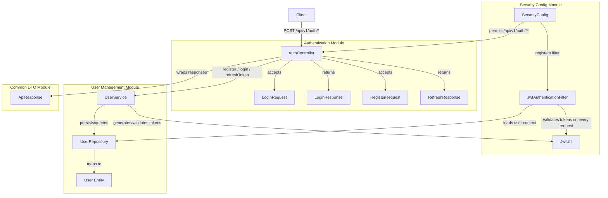
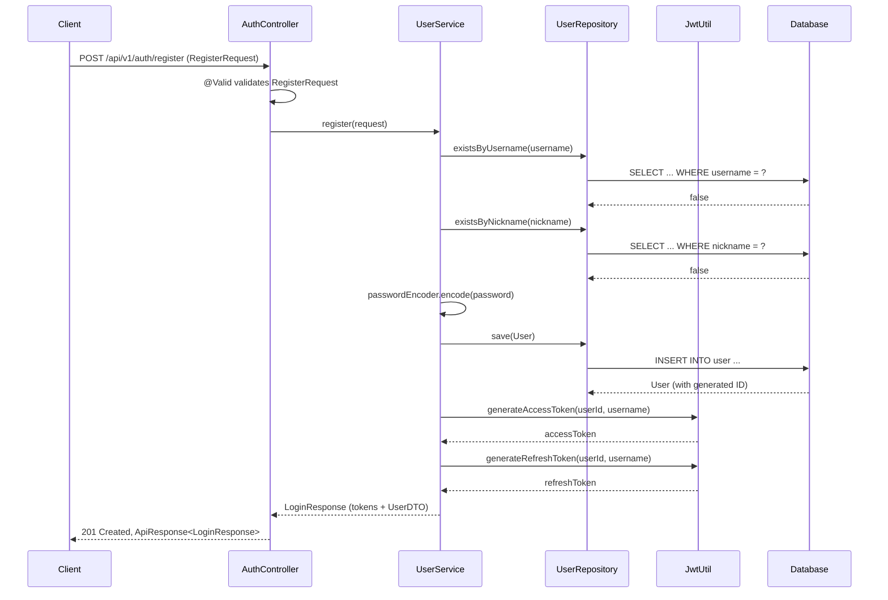
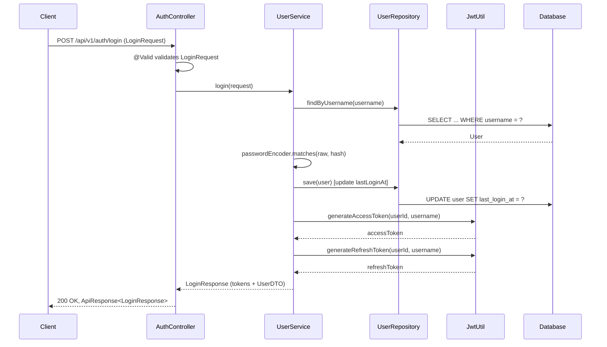
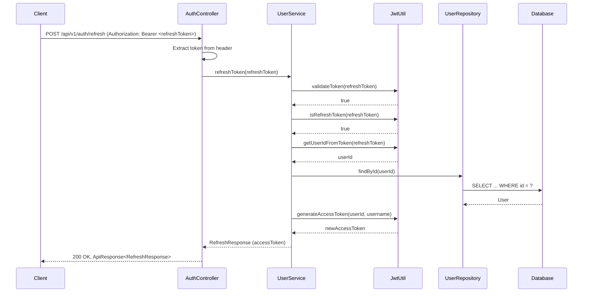
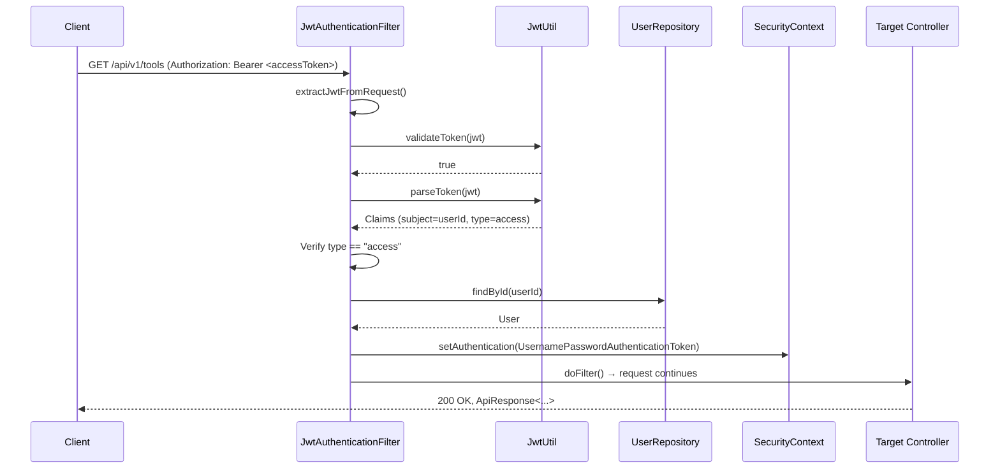
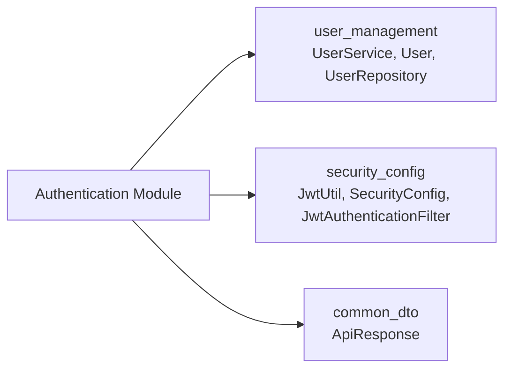

# Authentication Module

## Overview

The **Authentication Module** provides the core identity and access management functionality for the IAIHub Toolbox platform. It handles user registration, login, and JWT-based token refresh operations through a RESTful API. The module works in close conjunction with the [security_config](security_config.md) module (which handles JWT generation, validation, and request filtering) and the [user_management](user_management.md) module (which provides the `UserService` business logic and `User` entity).

### Key Responsibilities

| Responsibility | Description |
|---|---|
| **User Registration** | Validates and creates new user accounts, returning JWT tokens immediately upon successful registration |
| **User Login** | Authenticates credentials and issues access/refresh token pairs |
| **Token Refresh** | Exchanges a valid refresh token for a new short-lived access token |
| **Request DTOs** | Defines validated request/response payloads for all auth endpoints |

---

## Architecture



### Module Boundaries

The authentication module is intentionally thin — it consists of a controller and DTOs only. All business logic (password encoding, duplicate checking, token generation, user persistence) is delegated to `UserService` in the [user_management](user_management.md) module. JWT cryptographic operations are handled by `JwtUtil` in the [security_config](security_config.md) module.

---

## Core Components

### AuthController

The central REST controller that exposes three endpoints under `/api/v1/auth`. It delegates all business logic to `UserService` and wraps responses in the standard `ApiResponse` envelope from the [common_dto](common_dto.md) module.

| Endpoint | Method | Path | Request Body | Response Body | HTTP Status |
|---|---|---|---|---|---|
| Register | `POST` | `/api/v1/auth/register` | `RegisterRequest` | `ApiResponse<LoginResponse>` | `201 Created` |
| Login | `POST` | `/api/v1/auth/login` | `LoginRequest` | `ApiResponse<LoginResponse>` | `200 OK` |
| Refresh | `POST` | `/api/v1/auth/refresh` | — (Bearer token in `Authorization` header) | `ApiResponse<RefreshResponse>` | `200 OK` |

> **Security Note:** All `/api/v1/auth/**` endpoints are configured as `permitAll()` in `SecurityConfig`, meaning they do not require an existing JWT token. This is necessary because registration and login are the entry points for obtaining tokens. See [security_config](security_config.md) for the full security filter chain configuration.

---

### Data Transfer Objects (DTOs)

#### LoginRequest

A simple credential payload with Jakarta Bean Validation constraints.

| Field | Type | Validation | Description |
|---|---|---|---|
| `username` | `String` | `@NotBlank` | User's login username |
| `password` | `String` | `@NotBlank` | User's plaintext password (compared against BCrypt hash) |

#### RegisterRequest

A registration payload with strict format validation to enforce username/nickname conventions.

| Field | Type | Validation | Description |
|---|---|---|---|
| `username` | `String` | `@NotBlank`, `@Size(min=4, max=20)`, `@Pattern(^\w+$)` | Alphanumeric + underscore only, 4–20 characters |
| `nickname` | `String` | `@NotBlank`, `@Size(min=2, max=10)`, `@Pattern(Chinese/alphanumeric)` | Supports Chinese characters, letters, and digits, 2–10 characters |
| `password` | `String` | `@NotBlank`, `@Size(min=6)` | Minimum 6 characters |

#### LoginResponse

Returned by both the register and login endpoints. Contains the token pair and a lightweight user profile.

| Field | Type | Description |
|---|---|---|
| `accessToken` | `String` | Short-lived JWT used for authenticating API requests |
| `refreshToken` | `String` | Long-lived JWT used to obtain new access tokens |
| `user` | `UserDTO` (nested) | Basic user profile |

**Nested `UserDTO`:**

| Field | Type | Description |
|---|---|---|
| `id` | `Long` | User's database ID |
| `username` | `String` | Login username |
| `nickname` | `String` | Display name |
| `avatarUrl` | `String` | Avatar image URL (may be `null`) |

#### RefreshResponse

Returned by the refresh endpoint. Contains only a new access token.

| Field | Type | Description |
|---|---|---|
| `accessToken` | `String` | Newly generated short-lived JWT |

---

## Authentication Flows

### Registration Flow



### Login Flow



### Token Refresh Flow



### Subsequent Authenticated Request Flow

Once the client possesses an access token, every subsequent request to a protected endpoint is processed by `JwtAuthenticationFilter` from the [security_config](security_config.md) module:



---

## JWT Token Strategy

The authentication module relies on a dual-token strategy implemented by `JwtUtil` (see [security_config](security_config.md)):

| Token Type | Purpose | Lifetime | Claim `type` | Usage |
|---|---|---|---|---|
| **Access Token** | Authenticate individual API requests | Short (configurable via `app.jwt.access-token-expiration`) | `"access"` | Sent in `Authorization: Bearer <token>` header; validated by `JwtAuthenticationFilter` on every protected request |
| **Refresh Token** | Obtain new access tokens without re-login | Long (configurable via `app.jwt.refresh-token-expiration`) | `"refresh"` | Sent to `POST /api/v1/auth/refresh`; rejected by `JwtAuthenticationFilter` for regular API access |

Both tokens are signed using HMAC-SHA with a secret key configured via `app.jwt.secret`. The `JwtAuthenticationFilter` explicitly rejects refresh tokens for regular API access by checking the `type` claim.

---

## Error Handling

The authentication endpoints rely on custom exceptions thrown by `UserService` that are handled by a global exception handler (not part of this module). Key error scenarios:

| Scenario | Exception | Typical HTTP Response |
|---|---|---|
| Username already registered | `DuplicateResourceException` | `409 Conflict` |
| Nickname already in use | `DuplicateResourceException` | `409 Conflict` |
| Invalid username or password | `UnauthorizedException` | `401 Unauthorized` |
| Invalid or expired refresh token | `UnauthorizedException` | `401 Unauthorized` |
| User referenced by token no longer exists | `UnauthorizedException` | `401 Unauthorized` |
| Validation constraint violation (e.g., short password) | `MethodArgumentNotValidException` | `400 Bad Request` |

---

## Dependencies



| Dependency Module | Components Used | Purpose |
|---|---|---|
| [user_management](user_management.md) | `UserService`, `User`, `UserRepository` | Business logic for registration, login, and token refresh; user persistence |
| [security_config](security_config.md) | `JwtUtil`, `SecurityConfig`, `JwtAuthenticationFilter` | JWT generation/validation, security filter chain configuration, request-level authentication |
| [common_dto](common_dto.md) | `ApiResponse` | Standardized JSON response envelope with `code`, `message`, and `data` fields |

---

## Configuration Properties

The authentication module's behavior is influenced by the following application properties (consumed by `JwtUtil` and `SecurityConfig` in the [security_config](security_config.md) module):

| Property | Description | Example |
|---|---|---|
| `app.jwt.secret` | HMAC-SHA signing secret key | `mySecretKey...` |
| `app.jwt.access-token-expiration` | Access token lifetime in milliseconds | `3600000` (1 hour) |
| `app.jwt.refresh-token-expiration` | Refresh token lifetime in milliseconds | `604800000` (7 days) |

---

## API Reference Summary

### Register

```
POST /api/v1/auth/register
Content-Type: application/json

{
  "username": "john_doe",
  "nickname": "John",
  "password": "secret123"
}
```

**Response (201 Created):**
```json
{
  "code": 201,
  "message": "注册成功",
  "data": {
    "accessToken": "eyJhbGciOi...",
    "refreshToken": "eyJhbGciOi...",
    "user": {
      "id": 1,
      "username": "john_doe",
      "nickname": "John",
      "avatarUrl": null
    }
  }
}
```

### Login

```
POST /api/v1/auth/login
Content-Type: application/json

{
  "username": "john_doe",
  "password": "secret123"
}
```

**Response (200 OK):**
```json
{
  "code": 200,
  "message": "登录成功",
  "data": {
    "accessToken": "eyJhbGciOi...",
    "refreshToken": "eyJhbGciOi...",
    "user": {
      "id": 1,
      "username": "john_doe",
      "nickname": "John",
      "avatarUrl": null
    }
  }
}
```

### Refresh

```
POST /api/v1/auth/refresh
Authorization: Bearer <refreshToken>
```

**Response (200 OK):**
```json
{
  "code": 200,
  "message": "success",
  "data": {
    "accessToken": "eyJhbGciOi..."
  }
}
```
