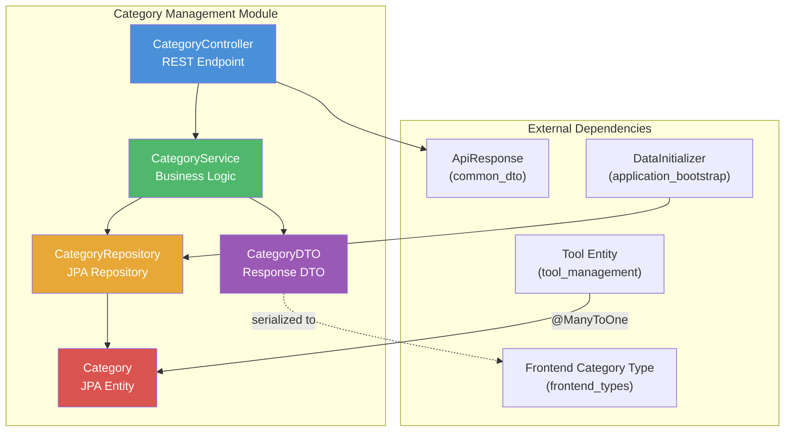
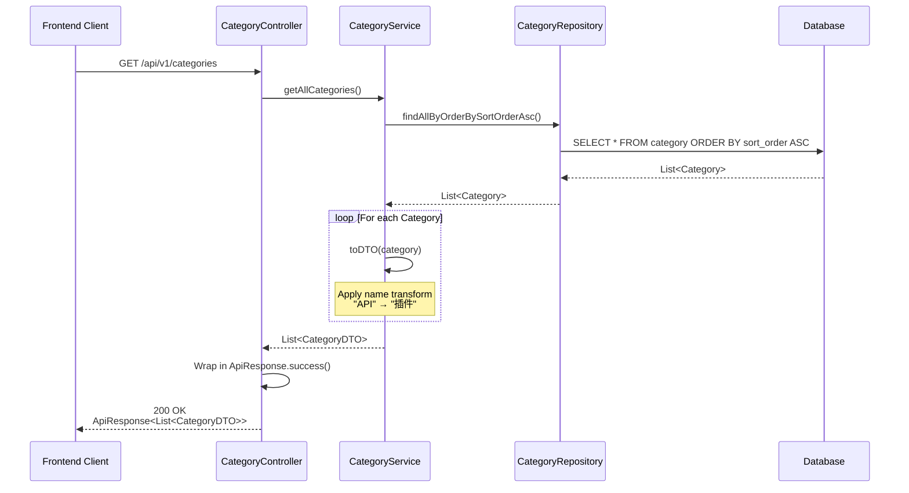
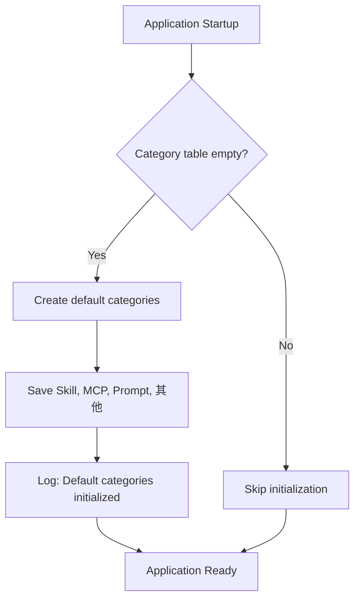
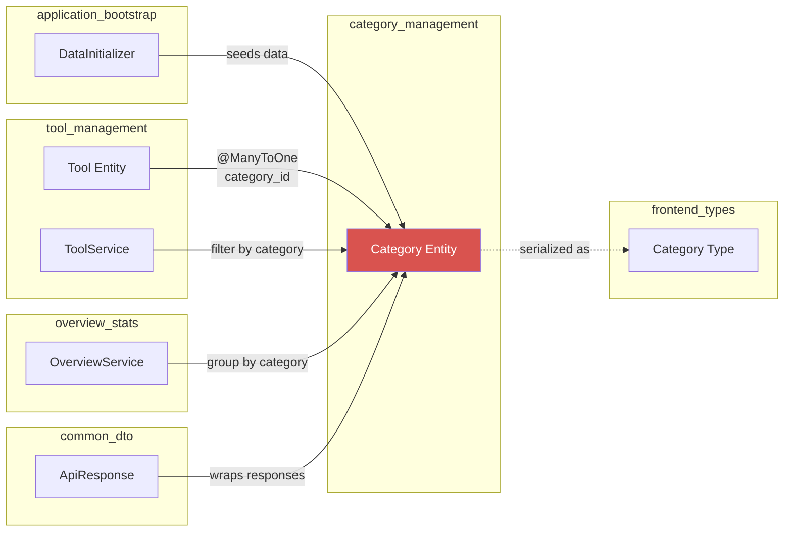

# Category Management Module

## Overview

The **Category Management** module provides the classification taxonomy for tools within the ToolSquare application. It is a lightweight, read-oriented module responsible for defining, storing, and serving tool categories (e.g., Skill, MCP, Prompt, etc.) that are used to organize and filter tools across the platform.

Categories serve as the primary organizational axis for the [tool_management](tool_management.md) module — every `Tool` entity is associated with exactly one `Category` via a many-to-one relationship. The module also feeds category data to the [overview_stats](overview_stats.md) module for dashboard grouping and to the [frontend_types](frontend_types.md) layer for UI rendering.

---

## Architecture

The module follows a standard Spring Boot layered architecture (Controller → Service → Repository → Model), with a dedicated DTO for API responses.



### Layer Responsibilities

| Layer | Component | Responsibility |
|-------|-----------|----------------|
| **Controller** | `CategoryController` | Exposes REST endpoint `GET /api/v1/categories`; delegates to service; wraps response in `ApiResponse` |
| **Service** | `CategoryService` | Retrieves categories ordered by `sortOrder`; applies display-name transformation; maps entities to DTOs |
| **Repository** | `CategoryRepository` | JPA repository interface; provides custom ordered query `findAllByOrderBySortOrderAsc()` |
| **Model** | `Category` | JPA entity mapped to `category` table; holds `id`, `name`, `icon`, `sortOrder`, `createdAt` |
| **DTO** | `CategoryDTO` | Lightweight transfer object with `id`, `name`, `icon`, `sortOrder` |

---

## Component Details

### CategoryController

The controller exposes a single read-only endpoint. It is intentionally minimal — categories are managed at startup via `DataInitializer` (see [application_bootstrap](application_bootstrap.md)) and are not created, updated, or deleted through the API.

| Method | Path | Description | Auth Required |
|--------|------|-------------|---------------|
| `GET` | `/api/v1/categories` | Returns all categories ordered by `sortOrder` ascending | No (public) |

**Response format:** `ApiResponse<List<CategoryDTO>>` — see [common_dto](common_dto.md) for the `ApiResponse` wrapper structure.

### CategoryService

The service layer contains the core business logic:

1. **Ordered Retrieval** — Fetches all categories sorted by `sortOrder` ascending via the repository's custom query method.
2. **Display Name Transformation** — Applies a runtime name mapping where the category name `"API"` is replaced with `"插件"` (Chinese for "plugin") in the DTO output. This is a presentation-layer concern handled in the service to keep the controller clean.
3. **Entity-to-DTO Mapping** — Converts `Category` entities to `CategoryDTO` objects, exposing only the fields needed by the frontend (`id`, `name`, `icon`, `sortOrder`).

> **Note:** The name transformation (`"API"` → `"插件"`) is applied only in the DTO output. The underlying database record retains the original name.

### CategoryRepository

A standard Spring Data JPA repository extending `JpaRepository<Category, Long>`. It defines one custom query method:

| Method | Return Type | Description |
|--------|-------------|-------------|
| `findAllByOrderBySortOrderAsc()` | `List<Category>` | Returns all categories ordered by `sortOrder` in ascending order |

### Category Entity

The `Category` entity maps to the `category` database table and represents a tool classification.

| Field | Type | Column | Constraints | Description |
|-------|------|--------|-------------|-------------|
| `id` | `Long` | `id` | PK, auto-generated | Unique identifier |
| `name` | `String` | `name` | NOT NULL, UNIQUE, max 50 chars | Category name (e.g., "Skill", "MCP") |
| `icon` | `String` | `icon` | max 255 chars | Emoji or icon identifier for UI display |
| `sortOrder` | `Integer` | `sort_order` | NOT NULL, default 0 | Display ordering (ascending) |
| `createdAt` | `LocalDateTime` | `created_at` | NOT NULL, non-updatable | Timestamp set on creation via `@PrePersist` |

### CategoryDTO

A simple Lombok `@Builder` DTO used for API responses. It intentionally excludes `createdAt` since it is not needed by the frontend.

| Field | Type | Description |
|-------|------|-------------|
| `id` | `Long` | Category identifier |
| `name` | `String` | Display name (after transformation) |
| `icon` | `String` | Icon/emoji for UI |
| `sortOrder` | `Integer` | Sort position |

---

## Data Flow



---

## Data Initialization

Default categories are seeded at application startup by `DataInitializer` (part of the [application_bootstrap](application_bootstrap.md) module). The initializer checks if the `category` table is empty and, if so, inserts the following default categories:

| Sort Order | Name | Icon |
|------------|------|------|
| 1 | Skill | 🛠️ |
| 2 | MCP | 🔌 |
| 3 | Prompt | 💬 |
| 4 | 其他 (Other) | 📦 |



---

## Cross-Module Relationships



### Key Relationships

| Relationship | Direction | Description |
|-------------|-----------|-------------|
| **Tool → Category** | `@ManyToOne` | Each `Tool` belongs to exactly one `Category`. The `Tool` entity (see [tool_management](tool_management.md)) holds a `category_id` foreign key with a database index (`idx_tool_category`). |
| **DataInitializer → CategoryRepository** | Dependency injection | Seeds default categories on first startup. See [application_bootstrap](application_bootstrap.md). |
| **ApiResponse → CategoryDTO** | Generic wrapper | All API responses are wrapped in `ApiResponse<T>` from [common_dto](common_dto.md). |
| **OverviewService → Category** | Read | The [overview_stats](overview_stats.md) module may reference categories for dashboard grouping and statistics. |
| **Frontend Category Type** | Serialization target | The `Category` type defined in `frontend/src/types/index.ts` mirrors `CategoryDTO` for TypeScript consumers. See [frontend_types](frontend_types.md). |

---

## API Reference

### Get All Categories

```
GET /api/v1/categories
```

**Description:** Retrieves all tool categories ordered by `sortOrder` ascending.

**Authentication:** Not required (public endpoint).

**Response (200 OK):**

```json
{
  "code": 200,
  "message": "success",
  "data": [
    {
      "id": 1,
      "name": "Skill",
      "icon": "🛠️",
      "sortOrder": 1
    },
    {
      "id": 2,
      "name": "MCP",
      "icon": "🔌",
      "sortOrder": 2
    },
    {
      "id": 3,
      "name": "Prompt",
      "icon": "💬",
      "sortOrder": 3
    },
    {
      "id": 4,
      "name": "其他",
      "icon": "📦",
      "sortOrder": 4
    }
  ]
}
```

---

## Design Decisions

1. **Read-Only API** — The module exposes only a `GET` endpoint. Categories are treated as semi-static reference data, seeded at startup and not mutated through the API. This simplifies the module and avoids the need for admin authorization on category mutations.

2. **Display Name Transformation in Service Layer** — The `"API"` → `"插件"` name mapping is applied in `CategoryService.toDTO()` rather than in the controller or database. This keeps the transformation logic centralized and testable while preserving the original database value.

3. **Sort Order as First-Class Field** — The `sortOrder` field allows flexible reordering of categories in the UI without changing IDs or names. The repository's custom query method ensures consistent ordering at the database level.

4. **DTO Excludes Timestamps** — `CategoryDTO` deliberately omits `createdAt` since it has no frontend utility, keeping the API payload minimal.

5. **Unique Name Constraint** — The `name` column has a `UNIQUE` constraint at the database level, preventing duplicate category names and ensuring data integrity.
