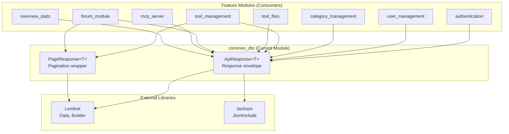
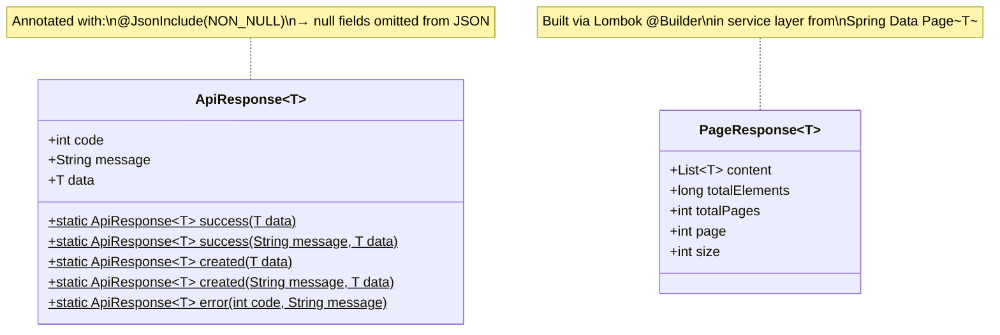
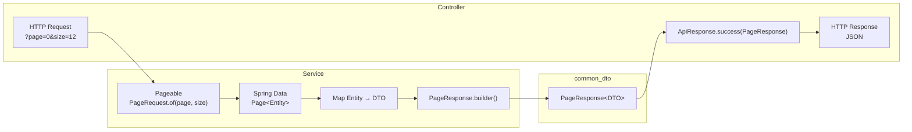
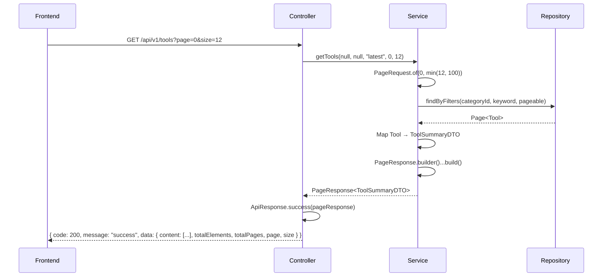
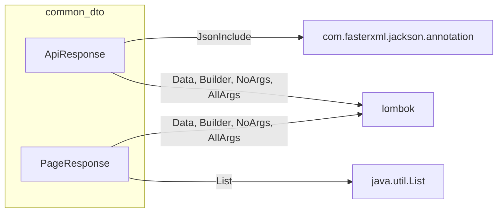

# Common DTO Module

## Overview

The `common_dto` module provides the two foundational Data Transfer Object (DTO) wrappers that establish a **uniform response contract** across the entire backend API. Every controller endpoint that follows the standard convention wraps its payload in `ApiResponse<T>`, and every paginated list endpoint wraps its results in `PageResponse<T>`. These two generic classes are the backbone of the API's serialization layer, ensuring that frontend consumers always receive a predictable JSON structure regardless of which domain module produced the data.

### Core Components

| Component | File | Purpose |
|---|---|---|
| `ApiResponse<T>` | `dto/ApiResponse.java` | Generic envelope wrapper for all API responses — carries an HTTP-style status `code`, a human-readable `message`, and a typed `data` payload. |
| `PageResponse<T>` | `dto/PageResponse.java` | Generic pagination container — carries the `content` list along with pagination metadata (`totalElements`, `totalPages`, `page`, `size`). |

---

## Architecture

### Module Position

The `common_dto` module sits at the **lowest layer** of the application's DTO hierarchy. It has zero dependencies on any other module — it depends only on Lombok and Jackson. In turn, nearly every feature module in the system depends on it.



### Component Design

Both classes are designed with the same philosophy: **generic, immutable-friendly, builder-pattern DTOs** that leverage Lombok to eliminate boilerplate.



---

## ApiResponse&lt;T&gt;

### Purpose

`ApiResponse<T>` is the **universal response envelope**. It standardizes how every API endpoint communicates outcomes to the frontend by wrapping the actual payload `data` with a numeric `code` and a `message` string.

### Fields

| Field | Type | Description |
|---|---|---|
| `code` | `int` | HTTP-style status code (e.g., `200` for success, `201` for creation, `4xx`/`5xx` for errors). |
| `message` | `String` | Human-readable status message (e.g., `"success"`, `"登录成功"`, `"工具不存在或已删除"`). |
| `data` | `T` | The generic payload. Omitted from JSON serialization when `null` (via `@JsonInclude(NON_NULL)`). |

### Static Factory Methods

The class provides a set of static factory methods that controllers use to construct responses. This keeps response construction consistent and concise across the codebase.

| Method | Code | Message | Data | Typical Use |
|---|---|---|---|---|
| `success(T data)` | `200` | `"success"` | provided | Standard GET / PUT / DELETE success |
| `success(String message, T data)` | `200` | provided | provided | Success with custom Chinese message (e.g., `"更新成功"`) |
| `created(T data)` | `201` | `"success"` | provided | POST resource creation |
| `created(String message, T data)` | `201` | provided | provided | Creation with custom message (e.g., `"注册成功"`) |
| `error(int code, String message)` | provided | provided | `null` | Error responses (used by global exception handlers) |

### JSON Serialization Behavior

The `@JsonInclude(JsonInclude.Include.NON_NULL)` annotation ensures that when `data` is `null` (e.g., in delete operations or error responses), the `data` field is **omitted entirely** from the JSON output rather than serialized as `"data": null`.

**Example — success with data:**
```json
{
  "code": 200,
  "message": "success",
  "data": { "id": 1, "name": "Example Tool" }
}
```

**Example — success without data (delete operation):**
```json
{
  "code": 200,
  "message": "删除成功"
}
```

**Example — error response:**
```json
{
  "code": 404,
  "message": "工具不存在或已删除"
}
```

---

## PageResponse&lt;T&gt;

### Purpose

`PageResponse<T>` is the **standardized pagination container**. It decouples the API's pagination contract from Spring Data's `Page<T>` interface, giving the frontend a stable, minimal structure that doesn't leak Spring-specific fields.

### Fields

| Field | Type | Description |
|---|---|---|
| `content` | `List<T>` | The list of items on the current page. |
| `totalElements` | `long` | Total number of items across all pages. |
| `totalPages` | `int` | Total number of pages available. |
| `page` | `int` | Current page number (0-based). |
| `size` | `int` | Number of items per page. |

### Construction Pattern

`PageResponse` is typically constructed in the **service layer** by converting a Spring Data `Page<T>` into the custom wrapper using the Lombok builder. The service maps domain entities to DTOs and populates pagination metadata.



**Example — from `ToolService.getTools()`:**
```java
Page<Tool> toolPage = toolRepository.findByFilters(categoryId, keyword, pageable);

return PageResponse.<ToolSummaryDTO>builder()
        .content(toolPage.getContent().stream().map(this::toSummaryDTO).toList())
        .totalElements(toolPage.getTotalElements())
        .totalPages(toolPage.getTotalPages())
        .page(page)
        .size(size)
        .build();
```

### JSON Output Example

```json
{
  "code": 200,
  "message": "success",
  "data": {
    "content": [
      { "id": 1, "name": "Tool A" },
      { "id": 2, "name": "Tool B" }
    ],
    "totalElements": 42,
    "totalPages": 4,
    "page": 0,
    "size": 12
  }
}
```

---

## Usage Across the System

### ApiResponse Adoption

The following controllers wrap their responses in `ApiResponse`:

| Module | Controller | Example Usage |
|---|---|---|
| [authentication](authentication.md) | `AuthController` | `ApiResponse.success("登录成功", response)` / `ApiResponse.created("注册成功", response)` |
| [user_management](user_management.md) | `UserController` | `ApiResponse.success(userDTO)` |
| [category_management](category_management.md) | `CategoryController` | `ApiResponse.success(categories)` |
| [tool_management](tool_management.md) | `ToolController` | `ApiResponse.success(response)` / `ApiResponse.created("上传成功", tool)` |
| [tool_files](tool_files.md) | `ToolFileController` | `ApiResponse.success(fileList)` |

> **Note:** The [forum_module](forum_module.md) (`ForumPostController`, etc.) and [overview_stats](overview_stats.md) (`OverviewController`) currently return **raw DTOs or Spring `Page<T>` objects** without wrapping them in `ApiResponse`. This is an inconsistency in the codebase — those endpoints do not follow the standard envelope convention.

### PageResponse Adoption

| Module | Service | Usage |
|---|---|---|
| [tool_management](tool_management.md) | `ToolService.getTools()` | `PageResponse<ToolSummaryDTO>` — paginated tool listing |
| [tool_management](tool_management.md) | `ToolService.getMyTools()` | `PageResponse<ToolSummaryDTO>` — user's own tools |

> **Note:** The forum module uses Spring Data's `Page<ForumPostDTO>` directly rather than the custom `PageResponse<T>`.

---

## Frontend Contract

The frontend mirrors these DTOs as TypeScript interfaces, establishing a typed full-stack contract.

### `frontend/src/types/index.ts`

```typescript
interface ApiResponse<T> {
  code: number
  message: string
  data: T
}

interface PageResponse<T> {
  content: T[]
  totalElements: number
  totalPages: number
  page: number
  size: number
}
```

### Frontend Type Discrepancy

The forum module's frontend types (`frontend/src/types/forum.ts`) define a **separate** `PageResponse<T>` interface that uses `number` instead of `page` for the current page field:

```typescript
// frontend/src/types/forum.ts — divergent definition
interface PageResponse<T> {
  content: T[];
  totalElements: number;
  totalPages: number;
  size: number;
  number: number;  // ← uses Spring Data's field name instead of "page"
}
```

This divergence exists because the forum backend returns Spring Data's `Page<T>` directly (which serializes the current page as `number`), while the standard `PageResponse<T>` uses `page`. See [frontend_types](frontend_types.md) for the complete frontend type catalog.

---

## Data Flow: End-to-End Request Lifecycle

The diagram below illustrates how `ApiResponse` and `PageResponse` participate in a typical paginated list request:



### Size Capping

Services enforce a **maximum page size of 100** via `Math.min(size, 100)` when creating the `Pageable`. This prevents excessively large queries and is reflected in the `size` field of the returned `PageResponse`.

---

## Design Decisions

1. **Generic typing (`<T>`)** — Both classes use Java generics, allowing type-safe reuse across all domain DTOs without casting.

2. **Builder pattern** — Lombok's `@Builder` enables fluent, readable construction, especially useful for `PageResponse` where 5 fields must be set.

3. **`@JsonInclude(NON_NULL)` on ApiResponse** — Only `ApiResponse` carries this annotation. This means error responses (which have no `data`) and delete responses (which return `null` data) produce cleaner JSON without a `"data": null` field.

4. **Static factory methods on ApiResponse** — Centralizing response construction in factory methods (`success()`, `created()`, `error()`) ensures consistent status codes and messages across all controllers.

5. **Decoupling from Spring Data** — `PageResponse` intentionally does not extend or wrap Spring's `Page<T>`. This keeps the API contract stable even if the persistence layer changes, and avoids leaking Spring-specific serialization fields (like `pageable`, `sort`, `empty`, `first`, `last`) to the frontend.

---

## Dependencies



**No internal module dependencies.** This module is a pure leaf dependency — it imports nothing from the `com.iaihub.toolbox` package itself.
