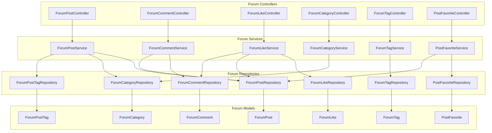
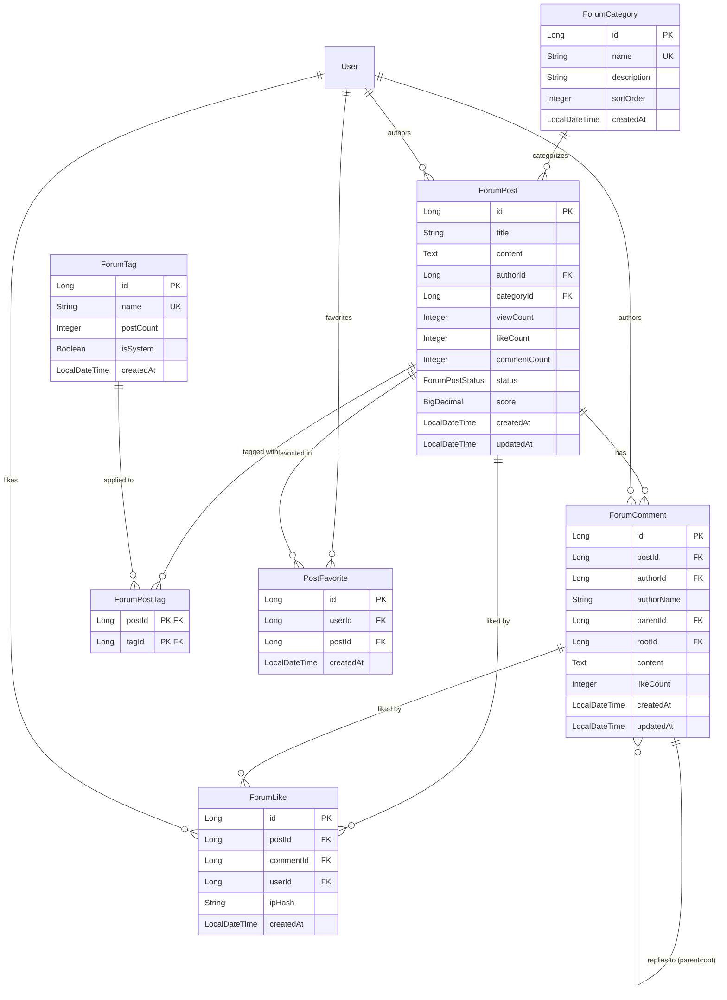
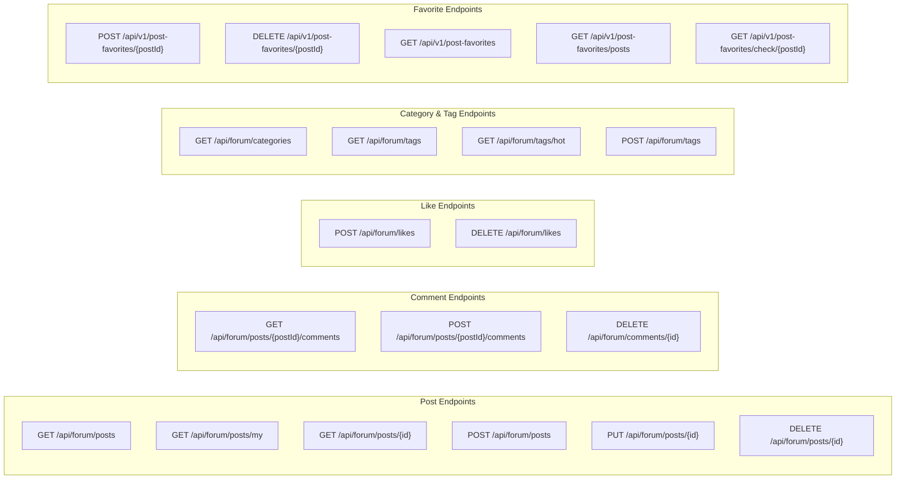
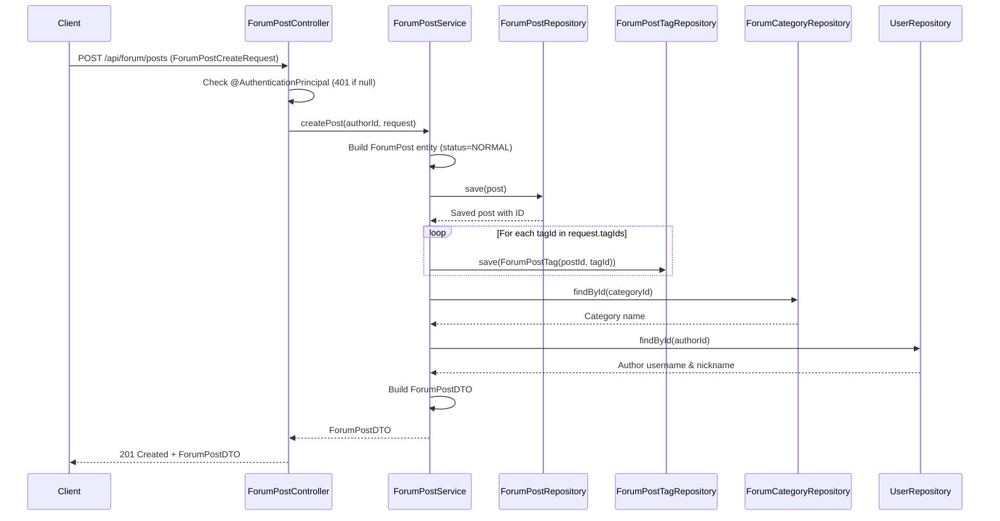
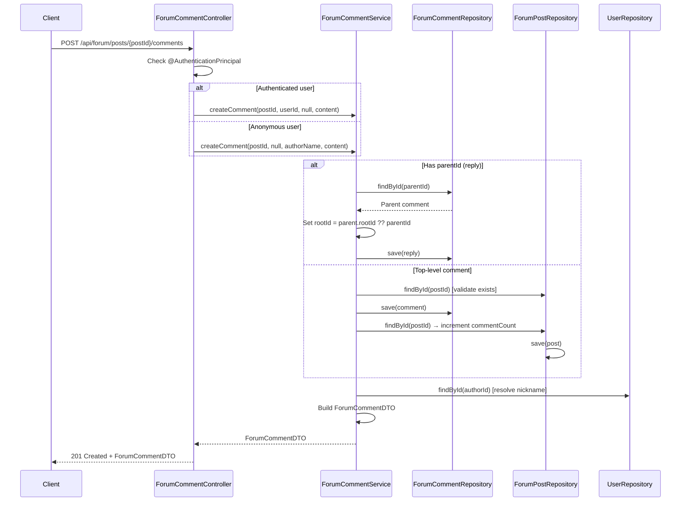
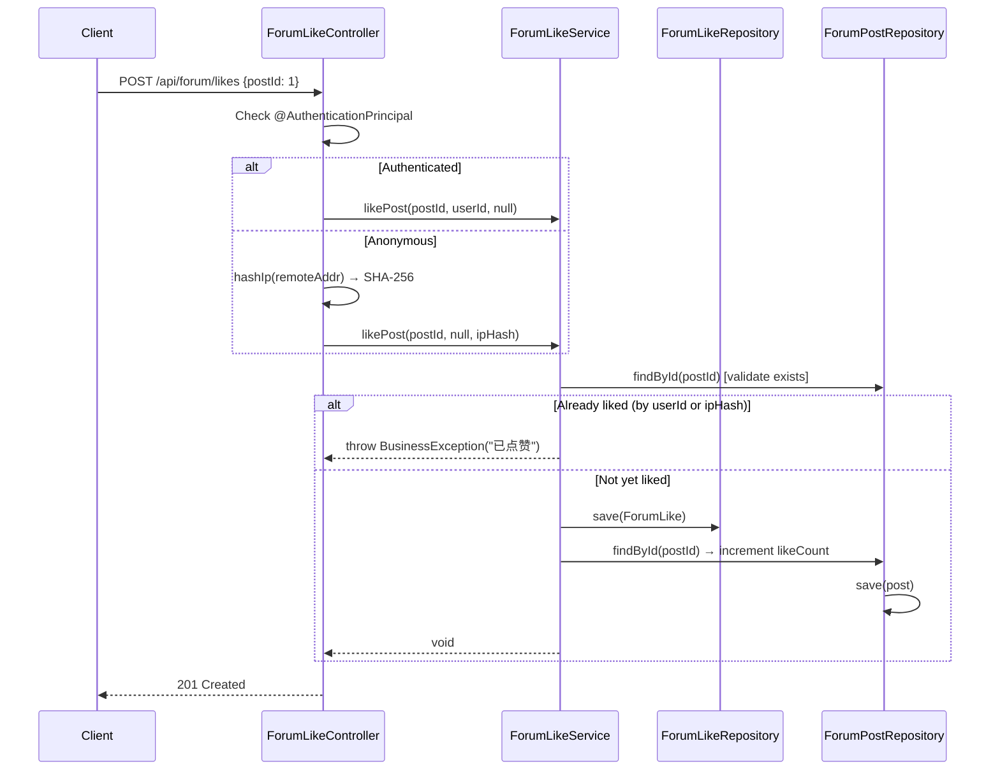
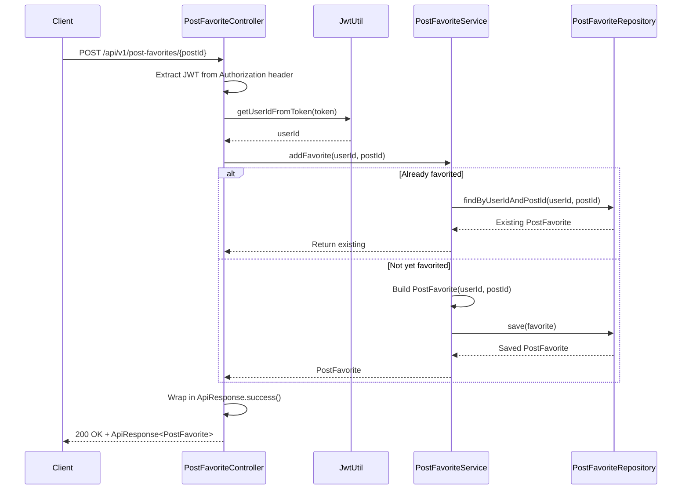
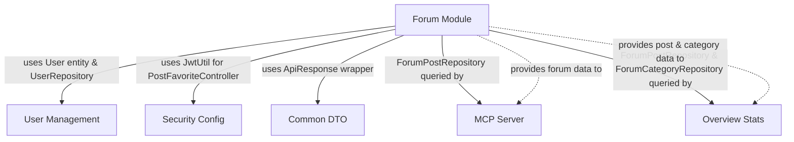

# Forum Module

## Introduction

The **Forum Module** provides a full-featured community discussion platform within the IAIHub Toolbox application. It enables users to create posts, comment (with nested replies), like posts and comments, tag posts, categorize content, and bookmark (favorite) posts for later reference. The module supports both authenticated and anonymous interactions — anonymous users can comment and like using IP-hash-based identification, while post creation, editing, deletion, and favoriting require authentication.

The module follows a standard layered architecture (Controller → Service → Repository → Model) and integrates with several other modules in the system, including [security_config](security_config.md) for authentication, [user_management](user_management.md) for user data, [mcp_server](mcp_server.md) for AI-powered search, and [overview_stats](overview_stats.md) for dashboard analytics.

---

## Architecture Overview



### Layered Architecture

The forum module adheres to a strict **Controller → Service → Repository → Model** layered pattern:

| Layer | Responsibility | Key Classes |
|-------|---------------|-------------|
| **Controller** | HTTP request handling, input validation, auth principal extraction | `ForumPostController`, `ForumCommentController`, `ForumLikeController`, `ForumCategoryController`, `ForumTagController`, `PostFavoriteController` |
| **Service** | Business logic, transaction management, DTO mapping | `ForumPostService`, `ForumCommentService`, `ForumLikeService`, `ForumCategoryService`, `ForumTagService`, `PostFavoriteService` |
| **Repository** | Data access via Spring Data JPA | `ForumPostRepository`, `ForumCommentRepository`, `ForumLikeRepository`, `ForumCategoryRepository`, `ForumTagRepository`, `ForumPostTagRepository`, `PostFavoriteRepository` |
| **Model** | JPA entities representing database tables | `ForumPost`, `ForumComment`, `ForumLike`, `ForumCategory`, `ForumTag`, `ForumPostTag`, `PostFavorite` |

---

## Data Model

### Entity Relationship Diagram



### Entity Details

#### ForumPost

The central entity of the forum module. Each post belongs to a category and is authored by a registered user.

| Field | Type | Description |
|-------|------|-------------|
| `id` | `Long` | Primary key (auto-generated) |
| `title` | `String(200)` | Post title (required) |
| `content` | `TEXT` | Post body content (required) |
| `authorId` | `Long` | FK to `User.id` (required) |
| `categoryId` | `Long` | FK to `ForumCategory.id` (required) |
| `viewCount` | `Integer` | Total view count (default: 0) |
| `likeCount` | `Integer` | Total like count (default: 0) |
| `commentCount` | `Integer` | Total comment count (default: 0) |
| `status` | `ForumPostStatus` | `NORMAL`, `DELETED`, or `HIDDEN` (default: `NORMAL`) |
| `score` | `BigDecimal(10,2)` | Computed engagement score (default: 0) |
| `createdAt` | `LocalDateTime` | Creation timestamp |
| `updatedAt` | `LocalDateTime` | Last update timestamp |

**Score Calculation:** `score = viewCount × 1 + likeCount × 3 + commentCount × 5`

The `updateScore()` method is available but must be called explicitly — it is not automatically triggered by lifecycle events.

#### ForumComment

Supports **nested replies** via `parentId` (direct parent) and `rootId` (top-level ancestor) fields, enabling threaded comment trees.

| Field | Type | Description |
|-------|------|-------------|
| `id` | `Long` | Primary key |
| `postId` | `Long` | FK to `ForumPost.id` (required) |
| `authorId` | `Long` | FK to `User.id` (nullable for anonymous) |
| `authorName` | `String(50)` | Display name for anonymous commenters |
| `parentId` | `Long` | FK to parent `ForumComment.id` (nullable for top-level) |
| `rootId` | `Long` | FK to root `ForumComment.id` (nullable for top-level) |
| `content` | `TEXT` | Comment content (required) |
| `likeCount` | `Integer` | Like count (default: 0) |
| `createdAt` / `updatedAt` | `LocalDateTime` | Timestamps |

#### ForumLike

A polymorphic-like entity that can reference either a post or a comment. Supports both authenticated (via `userId`) and anonymous (via `ipHash`) likes.

| Field | Type | Description |
|-------|------|-------------|
| `id` | `Long` | Primary key |
| `postId` | `Long` | FK to `ForumPost.id` (set when liking a post) |
| `commentId` | `Long` | FK to `ForumComment.id` (set when liking a comment) |
| `userId` | `Long` | FK to `User.id` (for authenticated likes) |
| `ipHash` | `String(64)` | SHA-256 hash of IP (for anonymous likes) |
| `createdAt` | `LocalDateTime` | Creation timestamp |

> **Note:** Exactly one of `postId` or `commentId` should be set, and exactly one of `userId` or `ipHash` should be set.

#### ForumCategory

Organizes posts into categories with display ordering.

| Field | Type | Description |
|-------|------|-------------|
| `id` | `Long` | Primary key |
| `name` | `String(50)` | Category name (unique, required) |
| `description` | `String(255)` | Category description |
| `sortOrder` | `Integer` | Display order (default: 0) |
| `createdAt` | `LocalDateTime` | Creation timestamp |

#### ForumTag

Tags that can be associated with posts. Supports both system-defined and user-created tags.

| Field | Type | Description |
|-------|------|-------------|
| `id` | `Long` | Primary key |
| `name` | `String(50)` | Tag name (unique, required) |
| `postCount` | `Integer` | Number of posts using this tag (default: 0) |
| `isSystem` | `Boolean` | Whether it's a system tag (default: false) |
| `createdAt` | `LocalDateTime` | Creation timestamp |

#### ForumPostTag

A **join entity** with a composite primary key (`postId`, `tagId`) implementing the many-to-many relationship between `ForumPost` and `ForumTag`. Uses `@IdClass` with the inner `ForumPostTagId` class.

#### PostFavorite

Represents a user's bookmarked/favorited post. Has a unique constraint on `(userId, postId)` to prevent duplicate favorites.

| Field | Type | Description |
|-------|------|-------------|
| `id` | `Long` | Primary key |
| `userId` | `Long` | FK to `User.id` (required) |
| `postId` | `Long` | FK to `ForumPost.id` (required) |
| `createdAt` | `LocalDateTime` | Creation timestamp |

### ForumPostStatus Enum

| Value | Description |
|-------|-------------|
| `NORMAL` | Post is visible and active (default) |
| `DELETED` | Post is soft-deleted (hidden from listings) |
| `HIDDEN` | Post is hidden (e.g., by moderation) |

---

## API Endpoints

### Endpoint Overview



### Post Endpoints

| Method | Path | Auth Required | Description |
|--------|------|:---:|-------------|
| `GET` | `/api/forum/posts` | No | List posts with optional filtering by `category`, `keyword`, pagination via `page` & `size` |
| `GET` | `/api/forum/posts/my` | Yes | List posts authored by the current user |
| `GET` | `/api/forum/posts/{id}` | No | Get a single post by ID (increments view count) |
| `POST` | `/api/forum/posts` | Yes | Create a new post |
| `PUT` | `/api/forum/posts/{id}` | Yes | Update a post (author only) |
| `DELETE` | `/api/forum/posts/{id}` | Yes | Soft-delete a post (author only, sets status to `DELETED`) |

**Create/Update Request Body** (`ForumPostCreateRequest`):
```json
{
  "title": "Post title (required, non-blank)",
  "content": "Post content (required, non-blank)",
  "categoryId": 1,
  "tagIds": [1, 2, 3]
}
```

### Comment Endpoints

| Method | Path | Auth Required | Description |
|--------|------|:---:|-------------|
| `GET` | `/api/forum/posts/{postId}/comments` | No | List all comments for a post (ordered by creation time) |
| `POST` | `/api/forum/posts/{postId}/comments` | Optional | Create a comment or reply. Authenticated users use their account; anonymous users provide `authorName` |
| `DELETE` | `/api/forum/comments/{id}` | Yes | Delete a comment (author only) |

**Create Comment Request Body** (`ForumCommentCreateRequest`):
```json
{
  "content": "Comment content (required, non-blank)",
  "parentId": null,
  "authorName": "Anonymous name (required if not authenticated)"
}
```

> When `parentId` is provided, the service creates a **reply**. The `rootId` is automatically set to the parent's `rootId` (or the parent's own ID if the parent is a top-level comment), enabling efficient threaded comment retrieval.

### Like Endpoints

| Method | Path | Auth Required | Description |
|--------|------|:---:|-------------|
| `POST` | `/api/forum/likes` | Optional | Like a post or comment. Authenticated users are tracked by `userId`; anonymous users by SHA-256 IP hash |
| `DELETE` | `/api/forum/likes` | Optional | Unlike a post (authenticated by `userId` or `ipHash`) |

**Like Request Body** (`ForumLikeRequest`):
```json
{
  "postId": 1,
  "commentId": null
}
```

> Exactly one of `postId` or `commentId` must be provided. The controller hashes the client IP using SHA-256 for anonymous like tracking.

### Category Endpoints

| Method | Path | Auth Required | Description |
|--------|------|:---:|-------------|
| `GET` | `/api/forum/categories` | No | List all categories ordered by `sortOrder` |

### Tag Endpoints

| Method | Path | Auth Required | Description |
|--------|------|:---:|-------------|
| `GET` | `/api/forum/tags` | No | List all tags |
| `GET` | `/api/forum/tags/hot` | No | List top 10 tags by post count |
| `POST` | `/api/forum/tags` | Optional | Create a new tag (checks for duplicates) |

### Favorite Endpoints

| Method | Path | Auth Required | Description |
|--------|------|:---:|-------------|
| `POST` | `/api/v1/post-favorites/{postId}` | Yes | Add a post to favorites (idempotent — returns existing if already favorited) |
| `DELETE` | `/api/v1/post-favorites/{postId}` | Yes | Remove a post from favorites |
| `GET` | `/api/v1/post-favorites` | Yes | List user's favorite records |
| `GET` | `/api/v1/post-favorites/posts` | Yes | List user's favorited posts (full `ForumPost` entities) |
| `GET` | `/api/v1/post-favorites/check/{postId}` | Yes | Check if a post is favorited by the current user |

> **Note:** The `PostFavoriteController` uses a different authentication pattern than other forum controllers. Instead of `@AuthenticationPrincipal`, it manually extracts the JWT token from the `Authorization` header and uses `JwtUtil` to obtain the user ID. See [security_config](security_config.md) for JWT details.

---

## Component Documentation

### Controllers

#### ForumPostController

Manages the full CRUD lifecycle of forum posts. Uses `@AuthenticationPrincipal User` for authentication, returning `401` when authentication is required but absent. Post listing supports filtering by category and keyword search, with pagination via Spring's `Pageable`.

**Key behaviors:**
- **List posts:** Filters by keyword (title search) or category, defaulting to all normal-status posts sorted by creation date descending
- **View post:** Increments `viewCount` on each access
- **Create post:** Associates tags via `ForumPostTag` join records
- **Update post:** Only the original author can modify (enforced via `ForbiddenException`)
- **Delete post:** Soft-delete only — sets `status` to `DELETED`

#### ForumCommentController

Handles comment creation (including nested replies), retrieval, and deletion. Supports both authenticated and anonymous commenting.

**Key behaviors:**
- **Anonymous commenting:** When no authenticated user is present, the `authorName` from the request body is used; `authorId` is set to `null`
- **Authenticated commenting:** `authorId` is set from the security principal; `authorName` is set to `null`
- **Reply creation:** When `parentId` is provided, delegates to `createReply()` which sets `rootId` for threaded navigation
- **Comment count sync:** Creating/deleting comments updates the parent post's `commentCount`

#### ForumLikeController

Manages liking/unliking of posts and comments with dual-mode tracking (authenticated vs. anonymous).

**Key behaviors:**
- **IP hashing:** Anonymous likes are tracked via SHA-256 hash of the client's IP address (64-char hex string), providing privacy while preventing duplicate anonymous likes from the same IP
- **Polymorphic targeting:** Routes to `likePost()` or `likeComment()` based on which ID is present in the request
- **Unlike:** Currently only supports unliking posts (not comments)

#### ForumCategoryController

Simple read-only controller that returns all forum categories ordered by `sortOrder`.

#### ForumTagController

Manages tag listing (all and hot), and tag creation. Tag creation checks for name uniqueness and throws `DuplicateResourceException` on conflict.

#### PostFavoriteController

Manages user post bookmarks/favorites. Uses a different base path (`/api/v1/post-favorites`) and authentication approach (manual JWT extraction via `JwtUtil`) compared to other forum controllers. All responses are wrapped in `ApiResponse<T>` from [common_dto](common_dto.md).

---

### Services

#### ForumPostService

Central service for post management with the following responsibilities:

- **Post listing:** Supports three query modes — keyword search (title `LIKE`), category filter, or all normal posts
- **DTO enrichment:** The `toDTO()` method enriches each post with category name and author display information (username and nickname) by querying `ForumCategoryRepository` and `UserRepository`
- **Tag association:** On post creation, iterates through `tagIds` and creates `ForumPostTag` join records
- **Authorization:** Update and delete operations verify that the requesting user is the post author
- **Soft delete:** Deletion sets `status` to `DELETED` rather than removing the record

#### ForumCommentService

Manages comment lifecycle with nested reply support:

- **Comment creation:** Validates post existence, creates the comment, and increments the post's `commentCount`
- **Reply creation:** Validates parent comment existence, sets `rootId` to the parent's `rootId` (or parent's ID if parent is top-level)
- **Comment deletion:** Verifies author ownership, deletes the comment, and decrements the post's `commentCount` (clamped to 0)
- **DTO enrichment:** Resolves author nickname from `UserRepository` when `authorId` is present

#### ForumLikeService

Handles like/unlike operations with duplicate prevention:

- **Duplicate detection:** Checks `existsByUserIdAndPostId` / `existsByIpHashAndPostId` (and comment equivalents) before creating a like, throwing `BusinessException` if already liked
- **Count synchronization:** Increments/decrements `likeCount` on the target post or comment
- **Unlike:** Searches by `userId` first, then falls back to `ipHash` to find the existing like record

#### ForumCategoryService

Simple service that retrieves all categories ordered by `sortOrder` and maps them to `ForumCategoryDTO`.

#### ForumTagService

Manages tag operations:

- **All tags:** Returns all tags as DTOs
- **Hot tags:** Returns top 10 tags by `postCount` descending
- **Tag creation:** Validates name uniqueness, creates the tag with optional `isSystem` flag

#### PostFavoriteService

Manages post bookmarking:

- **Add favorite:** Idempotent — returns existing record if already favorited
- **Remove favorite:** Deletes the favorite record, returns `false` if not found
- **Check favorite:** Boolean check for whether a user has favorited a specific post
- **Get favorite posts:** Retrieves full `ForumPost` entities for all of a user's favorited posts

---

### Repositories

All repositories extend `JpaRepository` and are Spring Data JPA interfaces:

| Repository | Entity | Custom Query Methods |
|-----------|--------|---------------------|
| `ForumPostRepository` | `ForumPost` | `findByStatusOrderByCreatedAtDesc`, `findByCategoryIdAndStatus`, `findByAuthorIdAndStatus`, `searchByTitle` (JPQL `LIKE` query) |
| `ForumCommentRepository` | `ForumComment` | `findByPostIdOrderByCreatedAtAsc`, `findByRootId`, `findByParentId`, `countByPostId` |
| `ForumLikeRepository` | `ForumLike` | `findByUserIdAndPostId`, `findByIpHashAndPostId`, `findByUserIdAndCommentId`, `findByIpHashAndCommentId`, plus `existsBy*` variants |
| `ForumCategoryRepository` | `ForumCategory` | `findAllByOrderBySortOrderAsc` |
| `ForumTagRepository` | `ForumTag` | `findByName`, `findTop10ByOrderByPostCountDesc`, `findByNameContaining` |
| `ForumPostTagRepository` | `ForumPostTag` | (none — basic CRUD only) |
| `PostFavoriteRepository` | `PostFavorite` | `findByUserIdAndPostId`, `findByUserId`, `deleteByUserIdAndPostId` |

---

## Key Process Flows

### Post Creation Flow



### Comment Creation with Reply Threading



### Like/Unlike Flow (Dual-Mode)



### Favorite Post Flow



---

## Cross-Module Dependencies



### Dependency Details

| Dependency Module | Usage in Forum Module |
|-------------------|----------------------|
| [user_management](user_management.md) | `User` entity (for `@AuthenticationPrincipal`), `UserRepository` (for resolving author names/nicknames in DTOs) |
| [security_config](security_config.md) | `JwtUtil` (used by `PostFavoriteController` for manual token extraction), `JwtAuthenticationFilter` (provides `@AuthenticationPrincipal User`) |
| [common_dto](common_dto.md) | `ApiResponse<T>` wrapper (used by `PostFavoriteController` responses) |

### Modules That Depend on the Forum Module

| Dependent Module | Forum Components Used |
|------------------|----------------------|
| [mcp_server](mcp_server.md) | `ForumPostRepository` (for `searchPosts()` and `getPostById()` in `McpSearchService`), `ForumPostStatus` enum |
| [overview_stats](overview_stats.md) | `ForumPostRepository` (for post count in `getStats()`), `ForumCategoryRepository` (for post ranking by category in `getPostRanks()`), `ForumPost.score` field for ranking |

---

## Error Handling

The forum module uses a hierarchy of custom exceptions (all extending `BusinessException`):

| Exception | HTTP Code | Usage in Forum Module |
|-----------|:---------:|----------------------|
| `ResourceNotFoundException` | 404 | Post/comment/category/tag not found |
| `ForbiddenException` | 403 | Non-author attempting to update/delete a post or comment |
| `BusinessException` | 400 | Duplicate like attempt ("已点赞") |
| `DuplicateResourceException` | 409 | Duplicate tag name on creation |

These exceptions are handled by a global exception handler (defined in the application bootstrap layer) that converts them to appropriate HTTP responses.

---

## Frontend Type Mapping

The frontend TypeScript types in `frontend/src/types/forum.ts` mirror the backend DTOs:

| Backend DTO | Frontend Interface | Notes |
|-------------|-------------------|-------|
| `ForumPostDTO` | `ForumPost` | Frontend adds `authorAvatarUrl`, `isFavorited`, `favoriteCount` fields |
| `ForumCommentDTO` | `ForumComment` | Direct mapping |
| `ForumCategoryDTO` | `ForumCategory` | Direct mapping |
| `ForumTagDTO` | `ForumTag` | Direct mapping |
| `ForumPostCreateRequest` | `ForumPostCreateRequest` | Direct mapping |
| `ForumCommentCreateRequest` | `ForumCommentCreateRequest` | Direct mapping |
| `ForumLikeRequest` | `ForumLikeRequest` | Direct mapping |

---

## Design Decisions

1. **Soft Delete for Posts:** Posts are never physically deleted — `status` is set to `DELETED`. This preserves referential integrity for comments, likes, and favorites.

2. **Dual-Mode Authentication:** Comments and likes support both authenticated and anonymous interactions. Anonymous likes are tracked via SHA-256 IP hashes to prevent duplicate likes while preserving privacy.

3. **Threaded Comments:** The `parentId`/`rootId` pattern enables efficient retrieval of comment threads. `rootId` points to the top-level comment in a thread, allowing all replies in a thread to be fetched via `findByRootId()`.

4. **Denormalized Counters:** `viewCount`, `likeCount`, and `commentCount` are stored directly on `ForumPost` (and `likeCount` on `ForumComment`) rather than computed on-the-fly, trading write complexity for read performance.

5. **Engagement Score:** The `score` field on `ForumPost` uses a weighted formula (`views×1 + likes×3 + comments×5`) to rank posts. This is consumed by the [overview_stats](overview_stats.md) module for dashboard rankings.

6. **Two Authentication Patterns:** Most forum controllers use Spring Security's `@AuthenticationPrincipal`, while `PostFavoriteController` manually extracts JWT tokens. This inconsistency exists because `PostFavoriteController` was developed with a different API versioning convention (`/api/v1/`).

7. **Composite Key for Tags:** The `ForumPostTag` join table uses `@IdClass` with a composite key (`postId`, `tagId`) rather than a surrogate key, which is more efficient for the many-to-many relationship and prevents duplicate tag assignments.
