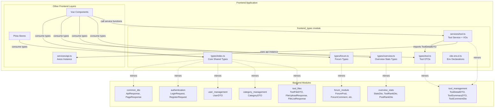
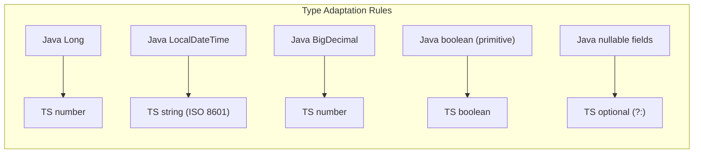
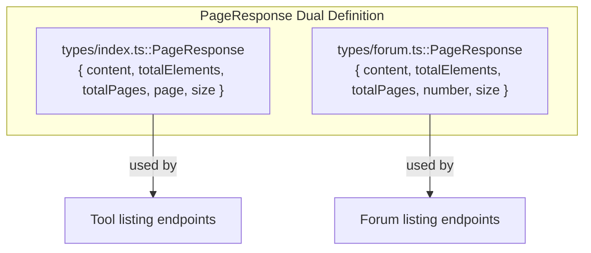
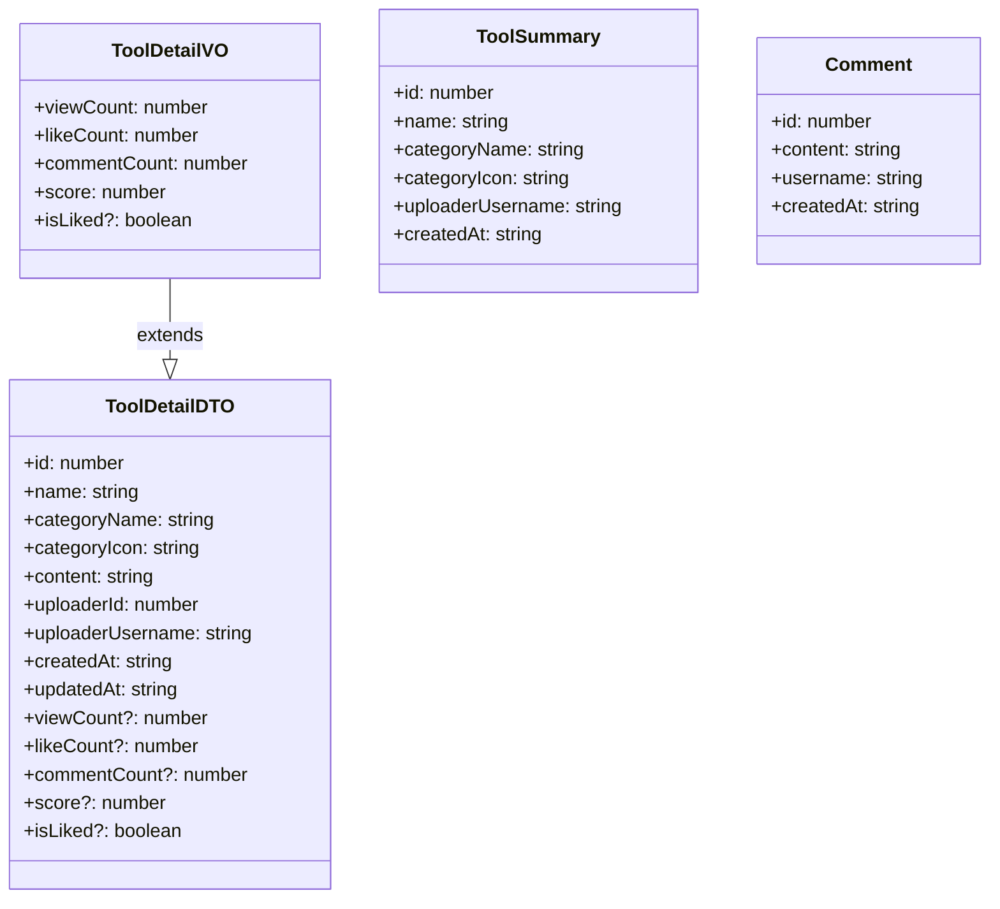
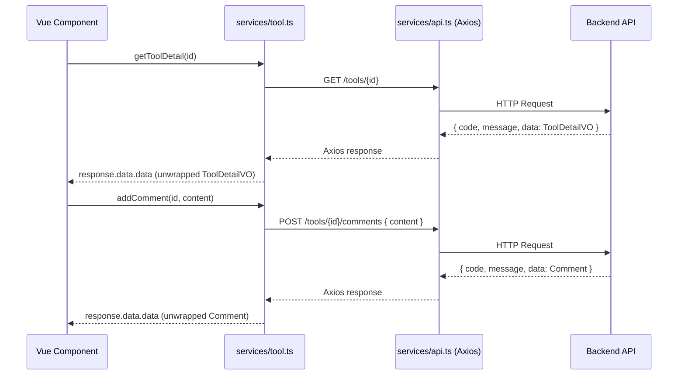
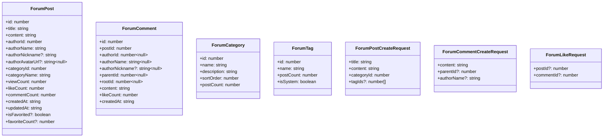
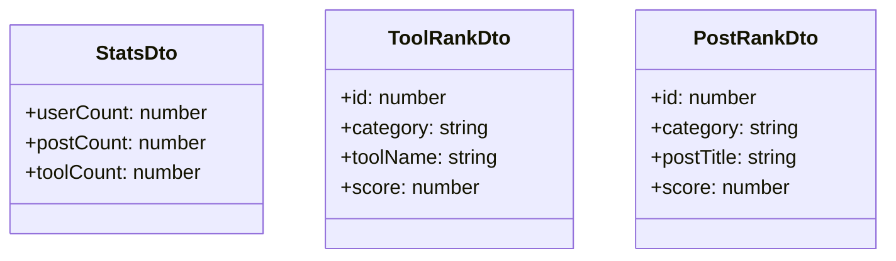
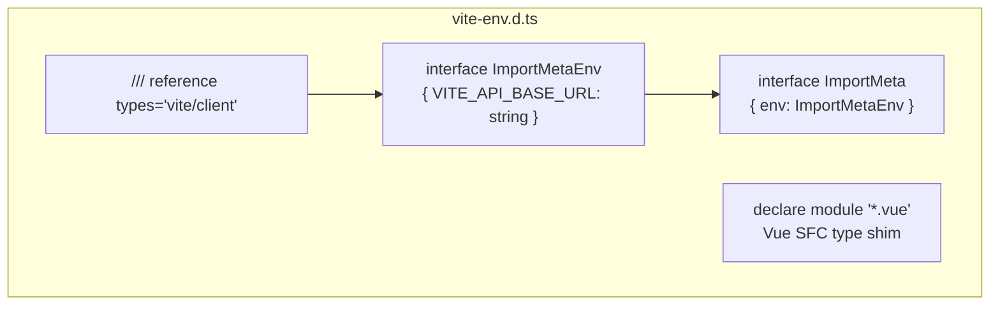
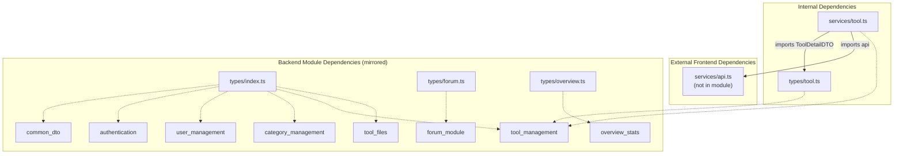

# Frontend Types Module

## Introduction

The **frontend_types** module is the TypeScript type-definition layer of the IAIHub Toolbox frontend application. It defines all shared interfaces, request/response contracts, and environment type declarations that the Vue 3 frontend uses to communicate with the Spring Boot backend. This module acts as the single source of truth for frontend data shapes, ensuring type safety across API calls, component props, and state management.

The module spans six files organized by domain concern:

| File | Purpose |
|------|---------|
| `frontend/src/types/index.ts` | Core shared types (User, Category, Tool, Auth, Files, generic wrappers) |
| `frontend/src/types/tool.ts` | Tool-specific DTOs (`ToolDetailDTO`, `ToolSummary`) |
| `frontend/src/types/forum.ts` | Forum domain types (posts, comments, categories, tags, pagination) |
| `frontend/src/types/overview.ts` | Dashboard/overview statistics types |
| `frontend/src/services/tool.ts` | Tool service layer — API functions + view-object types (`ToolDetailVO`, `Comment`) |
| `frontend/src/vite-env.d.ts` | Vite environment & Vue SFC type declarations |

---

## Architecture Overview



---

## Type-to-Backend Mapping

The frontend types are designed to mirror backend Java DTOs. The table below documents the correspondence, noting key type adaptations (e.g., `Long` → `number`, `LocalDateTime` → `string`, `BigDecimal` → `number`).



### Core Shared Types (`types/index.ts`)

| Frontend Type | Backend DTO | Backend Module | Notes |
|---------------|-------------|----------------|-------|
| `ApiResponse<T>` | `ApiResponse<T>` | [common_dto](common_dto.md) | `{ code, message, data }` — identical structure |
| `PageResponse<T>` | `PageResponse<T>` | [common_dto](common_dto.md) | Uses `page` field (0-based). Note: forum's `PageResponse` uses `number` instead — see [Forum Types](#forum-types-typesforumts) |
| `User` | `UserDTO` | [user_management](user_management.md) | `avatarUrl` and `nickname` are optional on frontend |
| `Category` | `CategoryDTO` | [category_management](category_management.md) | Direct 1:1 mapping |
| `LoginRequest` | `LoginRequest` | [authentication](authentication.md) | `{ username, password }` |
| `RegisterRequest` | `RegisterRequest` | [authentication](authentication.md) | `{ username, nickname, password }` |
| `CreateToolRequest` | `CreateToolRequest` | [tool_management](tool_management.md) | `{ name, categoryId, content, version }` |
| `UpdateToolRequest` | `UpdateToolRequest` | [tool_management](tool_management.md) | `version` is optional on frontend (matches backend `@Pattern` optional) |
| `ToolSummary` | `ToolSummaryDTO` | [tool_management](tool_management.md) | Richer version with `uploaderNickname`, `uploaderAvatarUrl` |
| `ToolDetail` | `ToolDetailDTO` | [tool_management](tool_management.md) | Frontend-only type; includes `version`, `content`, uploader info |
| `ToolFile` | `ToolFileDTO` | [tool_files](tool_files.md) | Direct 1:1 mapping |
| `FileUploadResponse` | `FileUploadResponse` | [tool_files](tool_files.md) | `files` is `ToolFile[]` on frontend |
| `FileListResponse` | `FileListResponse` | [tool_files](tool_files.md) | `files` is `ToolFile[]` on frontend |

### Tool DTOs (`types/tool.ts`)

| Frontend Type | Backend DTO | Backend Module | Notes |
|---------------|-------------|----------------|-------|
| `ToolDetailDTO` | `ToolDetailDTO` | [tool_management](tool_management.md) | `viewCount`, `likeCount`, `commentCount`, `score`, `isLiked` are optional. Backend `version` and `uploaderNickname` are omitted on this frontend type |
| `ToolSummary` | `ToolSummaryDTO` | [tool_management](tool_management.md) | Simplified version — omits `version`, `uploaderNickname` |

### Tool Service View Objects (`services/tool.ts`)

| Frontend Type | Backend DTO | Backend Module | Notes |
|---------------|-------------|----------------|-------|
| `ToolDetailVO` | `ToolDetailDTO` | [tool_management](tool_management.md) | **Extends** `ToolDetailDTO` from `types/tool.ts`; makes `viewCount`, `likeCount`, `commentCount`, `score` required and adds `isLiked?: boolean` |
| `Comment` | `ToolCommentDto` | [tool_management](tool_management.md) | `{ id, content, username, createdAt }` — direct mapping |

### Forum Types (`types/forum.ts`)

| Frontend Type | Backend Entity/DTO | Backend Module | Notes |
|---------------|-------------------|----------------|-------|
| `ForumPost` | `ForumPost` model + service projection | [forum_module](forum_module.md) | Flattened view with author info, counts, and favorite status |
| `ForumPostCreateRequest` | Controller request body | [forum_module](forum_module.md) | `{ title, content, categoryId, tagIds? }` |
| `ForumComment` | `ForumComment` model + service projection | [forum_module](forum_module.md) | Includes `parentId`, `rootId` for threaded comments |
| `ForumCommentCreateRequest` | Controller request body | [forum_module](forum_module.md) | `{ content, parentId?, authorName? }` |
| `ForumCategory` | `ForumCategory` model + projection | [forum_module](forum_module.md) | Includes `postCount` and `sortOrder` |
| `ForumTag` | `ForumTag` model + projection | [forum_module](forum_module.md) | Includes `postCount` and `isSystem` flag |
| `ForumLikeRequest` | Controller request body | [forum_module](forum_module.md) | `{ postId?, commentId? }` — one must be set |
| `PageResponse<T>` | Spring `Page<T>` serialization | [forum_module](forum_module.md) | Uses `number` field (Spring Data Pageable convention) — **differs** from `types/index.ts` `PageResponse` which uses `page` |

### Overview Types (`types/overview.ts`)

| Frontend Type | Backend DTO | Backend Module | Notes |
|---------------|-------------|----------------|-------|
| `StatsDto` | `StatsDto` | [overview_stats](overview_stats.md) | `{ userCount, postCount, toolCount }` — `Long` → `number` |
| `ToolRankDto` | `ToolRankDto` | [overview_stats](overview_stats.md) | `{ id, category, toolName, score }` — `BigDecimal` → `number` |
| `PostRankDto` | `PostRankDto` | [overview_stats](overview_stats.md) | `{ id, category, postTitle, score }` — `BigDecimal` → `number` |

---

## Component Documentation

### Generic Wrapper Types

#### `ApiResponse<T>`

The universal response envelope used by all backend API endpoints. Every API call returns this structure.

```typescript
interface ApiResponse<T> {
  code: number       // HTTP-like status code (200 = success, 201 = created)
  message: string    // Human-readable status message
  data: T            // The actual payload
}
```

**Usage pattern:** The `services/tool.ts` API functions unwrap the `ApiResponse` envelope, extracting `response.data.data` and returning the inner `T` directly to callers.

#### `PageResponse<T>` (two variants)

There are **two distinct** `PageResponse` definitions in the codebase:

| Location | Current Page Field | Source Convention |
|----------|-------------------|-------------------|
| `types/index.ts` | `page` | Custom backend `PageResponse` DTO |
| `types/forum.ts` | `number` | Spring Data `Page` serialization |

Both share `content`, `totalElements`, `totalPages`, and `size`. Developers must import the correct variant based on which backend endpoint they are calling.



---

### Tool Domain Types

#### Type Hierarchy



#### `ToolDetailDTO` (`types/tool.ts`)

The base tool detail type. Several fields are optional because the backend `ToolDetailDTO` may not always populate them (e.g., when returning a minimal detail view).

#### `ToolDetailVO` (`services/tool.ts`)

A **View Object** that extends `ToolDetailDTO` by making engagement metrics (`viewCount`, `likeCount`, `commentCount`, `score`) **required**. This type represents the fully-populated tool detail returned by the `getToolDetail()` and `getTool()` service functions.

#### `Comment` (`services/tool.ts`)

Represents a tool comment with author username. Maps directly to the backend `ToolCommentDto`.

#### `ToolSummary` (`types/tool.ts`)

A lightweight tool representation for list views. Note: a **different, richer** `ToolSummary` also exists in `types/index.ts` that includes `version`, `uploaderNickname`, and `uploaderAvatarUrl`.

---

### Tool Service Layer (`services/tool.ts`)

The `tool.ts` service file is unique in this module — it contains both type definitions and **API service functions** that perform HTTP calls via the shared Axios instance (`services/api.ts`).



**Service Functions:**

| Function | HTTP Method | Endpoint | Returns | Description |
|----------|-------------|----------|---------|-------------|
| `getToolDetail(id)` | GET | `/tools/{id}` | `ToolDetailVO` | Fetches full tool detail with engagement metrics |
| `getTool(id)` | GET | `/tools/{id}` | `ToolDetailVO` | Alias for `getToolDetail` (returns raw response) |
| `likeTool(id)` | POST | `/tools/{id}/like` | `void` | Likes a tool |
| `unlikeTool(id)` | DELETE | `/tools/{id}/like` | `void` | Removes a like |
| `getLikeStatus(id)` | GET | `/tools/{id}/like-status` | `boolean` | Checks if current user liked the tool |
| `getComments(id)` | GET | `/tools/{id}/comments` | `Comment[]` | Fetches all comments for a tool |
| `addComment(id, content)` | POST | `/tools/{id}/comments` | `Comment` | Adds a new comment |

All functions unwrap the `ApiResponse` envelope internally, returning the `data` payload directly.

---

### Forum Domain Types (`types/forum.ts`)



**Key design notes:**

- **`ForumComment`** supports threaded discussions via `parentId` (immediate parent) and `rootId` (top-level ancestor). Both can be `null` for top-level comments.
- **`ForumPost`** is a flattened projection that includes denormalized author info (`authorName`, `authorNickname`, `authorAvatarUrl`) and category name, avoiding additional API calls.
- **`ForumLikeRequest`** uses a discriminated pattern where either `postId` or `commentId` should be set (but not both).
- **`ForumTag`** distinguishes system tags (`isSystem: true`) from user-created tags.

---

### Overview Statistics Types (`types/overview.ts`)

Simple flat DTOs for the dashboard/overview page:



These types mirror the backend DTOs in the [overview_stats](overview_stats.md) module. `StatsDto` provides aggregate counts, while `ToolRankDto` and `PostRankDto` provide ranked listings sorted by `score`.

---

### Environment Declarations (`vite-env.d.ts`)

This file provides TypeScript type augmentation for the Vite build tool and Vue Single-File Components (SFCs):



- **`ImportMetaEnv`** — Declares the `VITE_API_BASE_URL` environment variable as a readonly `string`. This variable configures the base URL for all API requests.
- **`ImportMeta`** — Augments the global `ImportMeta` interface to expose the typed `env` property.
- **`*.vue` module declaration** — Provides a type shim so TypeScript can import `.vue` files as Vue components.

---

## Data Flow: Frontend Types in API Communication

```mermaid
flowchart TD
    subgraph "Request Flow"
        REQ_TYPE["Request Type<br/>(e.g., CreateToolRequest)"]
        REQ_BODY["JSON Request Body"]
        HTTP_REQ["HTTP POST/PUT"]
        BACKEND_CTRL["Backend Controller"]
        BACKEND_SVC["Backend Service"]
        DB["Database"]
    end

    subgraph "Response Flow"
        DB2["Database"]
        BACKEND_SVC2["Backend Service"]
        BACKEND_DTO["Backend DTO<br/>(e.g., ToolDetailDTO)"]
        JSON_RESP["JSON Response<br/>{ code, message, data }"]
        API_INTERCEPTOR["Axios Interceptor"]
        FE_TYPE["Frontend Type<br/>(e.g., ToolDetailVO)"]
        COMPONENT["Vue Component"]
    end

    REQ_TYPE --> REQ_BODY
    REQ_BODY --> HTTP_REQ
    HTTP_REQ --> BACKEND_CTRL
    BACKEND_CTRL --> BACKEND_SVC
    BACKEND_SVC --> DB

    DB2 --> BACKEND_SVC2
    BACKEND_SVC2 --> BACKEND_DTO
    BACKEND_DTO --> JSON_RESP
    JSON_RESP --> API_INTERCEPTOR
    API_INTERCEPTOR -->|"unwrap data"| FE_TYPE
    FE_TYPE --> COMPONENT
```



The frontend types serve as compile-time contracts. At runtime, TypeScript types are erased, and the actual data shape depends on the backend JSON serialization. The `ApiResponse<T>` envelope is consistently unwrapped by service functions (as seen in `services/tool.ts`) before returning data to components.

---

## Dependency Graph



---

## Design Decisions & Caveats

### 1. Duplicate Type Names

Several type names are defined in multiple files with different shapes:

| Type Name | Location 1 | Location 2 | Difference |
|-----------|-----------|-----------|------------|
| `ToolSummary` | `types/index.ts` (richer: includes `version`, `uploaderNickname`, `uploaderAvatarUrl`) | `types/tool.ts` (minimal: 6 fields) | The `index.ts` version is the superset |
| `PageResponse` | `types/index.ts` (uses `page` field) | `types/forum.ts` (uses `number` field) | Different current-page field names |
| `ToolDetail` | `types/index.ts` (standalone interface) | `ToolDetailDTO` in `types/tool.ts` (similar but different field optionality) | `ToolDetail` includes `version`; `ToolDetailDTO` includes engagement metrics |

Developers should be aware of which file they import from to avoid type mismatches.

### 2. View Object Pattern (`ToolDetailVO`)

The `ToolDetailVO` in `services/tool.ts` follows the **View Object** pattern — it extends a base DTO (`ToolDetailDTO`) and tightens optionality to reflect the guarantees of a specific API endpoint. This pattern could be extended to other service files as the application grows.

### 3. Nullable vs Optional

The frontend distinguishes between:
- **Optional fields** (`field?: T`) — may be absent from the JSON payload
- **Nullable fields** (`field: T | null`) — present but can be `null`

For example, `ForumPost.authorAvatarUrl` is `string | null` (present but nullable), while `ForumPost.isFavorited` is `boolean?` (may be absent entirely).

### 4. No Runtime Validation

All types are compile-time only (TypeScript interfaces). There is no runtime schema validation (e.g., Zod or Joi). If the backend changes its response shape, type errors will not surface until runtime. Consider adding runtime validation for critical data flows.
