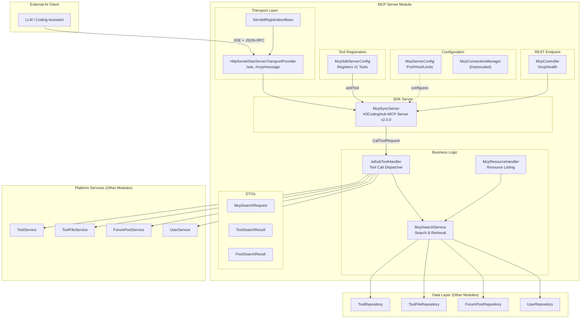
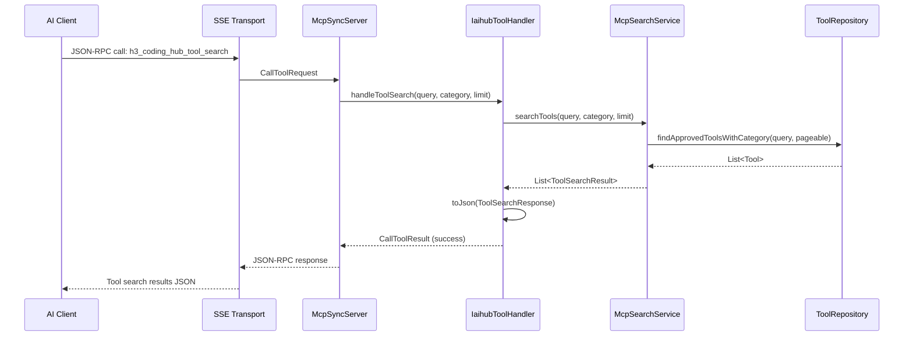
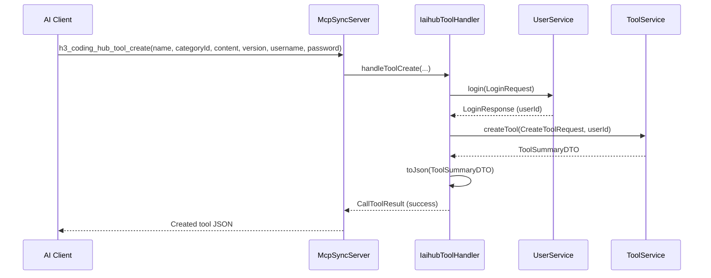
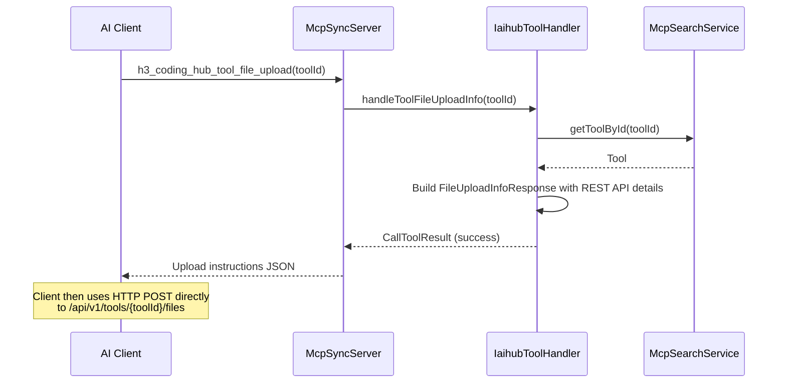
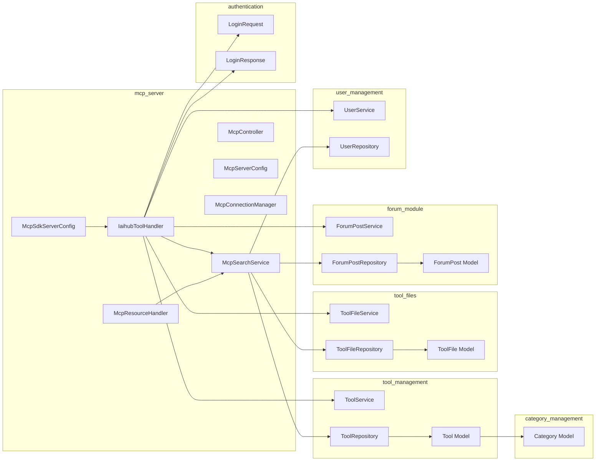
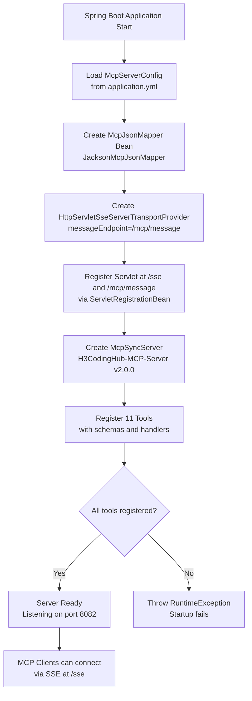

# MCP Server Module

## Introduction

The **MCP (Model Context Protocol) Server** module exposes the IAIHub Toolbox platform's tools, forum posts, and file management capabilities to external AI clients (e.g., LLM-powered coding assistants) via the standardized Model Context Protocol. Built on the official Java MCP SDK 2.0.0, the server runs on a dedicated port (default `8082`) and provides 11 registered tools covering read-only search operations as well as authenticated write operations (tool creation, modification, file upload/delete, and post creation). Communication uses SSE (Server-Sent Events) transport with a JSON message endpoint.

---

## Architecture Overview



---

## Component Reference

### Configuration Components

#### McpServerConfig

`backend/src/main/java/com/iaihub/toolbox/config/McpServerConfig.java`

A Spring `@ConfigurationProperties` bean bound to the `mcp.server.*` prefix. It defines the operational parameters for the MCP server:

| Property | Default | Description |
|---|---|---|
| `port` | `8082` | Dedicated port for the MCP server |
| `host` | `0.0.0.0` | Bind address |
| `enabled` | `true` | Whether the MCP server is active |
| `maxConnections` | `10` | Maximum concurrent SSE connections |
| `connectionTimeoutMs` | `30000` | Connection timeout in milliseconds |

#### McpSdkServerConfig

`backend/src/main/java/com/iaihub/toolbox/mcp/McpSdkServerConfig.java`

The central `@Configuration` class that wires the MCP SDK into the Spring application. It creates the following beans:

1. **`McpJsonMapper`** — Jackson-based JSON mapper for MCP protocol serialization.
2. **`HttpServletSseServerTransportProvider`** — SSE transport provider configured with `/mcp/message` as the message endpoint.
3. **`ServletRegistrationBean`** — Registers the transport servlet at `/sse` and `/mcp/message` URL paths.
4. **`McpSyncServer`** — The synchronous MCP server instance (`H3CodingHub-MCP-Server` v2.0.0) with tools and logging capabilities enabled. All 11 tools are registered here via the `registerTool()` helper method.

Each tool is registered with:
- A unique name (e.g., `h3_coding_hub_tool_search`)
- A human-readable description
- A JSON Schema input definition
- A `BiFunction` handler that delegates to `IaihubToolHandler`

### Controller

#### McpController

`backend/src/main/java/com/iaihub/toolbox/controller/McpController.java`

A lightweight `@RestController` mapped to `/mcp` that provides a single health-check endpoint:

| Endpoint | Method | Description |
|---|---|---|
| `/mcp/health` | GET | Returns server status, version, name, and timestamp |

> **Note:** The actual SSE connection and MCP protocol handling are managed by the `HttpServletSseServerTransportProvider` servlet registered at `/sse` and `/mcp/message`, not by this controller.

### Core Business Logic

#### IaihubToolHandler

`backend/src/main/java/com/iaihub/toolbox/mcp/IaihubToolHandler.java`

The central `@Component` that dispatches all MCP tool calls to the appropriate platform services. It acts as the bridge between the MCP protocol layer and the application's business services. The handler receives parsed arguments from the SDK, performs authentication (for write operations), delegates to services, and wraps results into `McpSchema.CallToolResult` objects.

**Authentication Pattern:** Write operations (tool create, tool modify, file delete, post create) require `username` and `password` parameters passed by the MCP client. The handler calls `UserService.login()` to authenticate and obtain a `userId`, which is then forwarded to the underlying service. This avoids the need for JWT token management within the MCP protocol.

**Version Auto-Increment:** The `handleToolModify` method supports automatic version incrementing. If no `version` is provided, the `incrementVersion()` utility parses the current version string and increments the last numeric segment (e.g., `1.0.0` → `1.0.1`, `1.0.0-beta` → `1.0.1-beta`).

**Internal Response DTOs:** The handler defines several private static inner classes for structured JSON responses:
- `ToolSearchResponse` — list of tools with count
- `ToolDetailResponse` — full tool details (id, name, version, content, category)
- `ToolFilesResponse` — file list with count and toolId
- `FileInfo` — individual file metadata (name, size, downloadUrl, createdAt)
- `PostSearchResponse` — list of posts with count
- `PostDetailResponse` — full post details (id, title, content, authorId, createdAt)
- `FileDownloadResponse` — download link and file metadata
- `FileUploadInfoResponse` — REST API instructions for file upload
- `FileDeleteResponse` — deletion confirmation
- `ErrorResponse` — error message wrapper

#### McpResourceHandler

`backend/src/main/java/com/iaihub/toolbox/mcp/McpResourceHandler.java`

A `@Component` that provides resource-level access to tools. It supports:
- **`listTools()`** — Returns up to 50 tools as MCP resource descriptors (name, description, inputSchema)
- **`searchTools(query, category, limit)`** — Delegates to `McpSearchService`
- **`getToolContent(toolId)`** — Returns the raw markdown content of a tool

#### McpSearchService

`backend/src/main/java/com/iaihub/toolbox/service/McpSearchService.java`

A `@Service` that encapsulates all search and retrieval operations for the MCP module. It queries repositories directly (rather than going through higher-level services) for optimized read-only access:

| Method | Description | Repositories Used |
|---|---|---|
| `searchTools(query, category, limit)` | Search approved tools by keyword, returns `ToolSearchResult` list with truncated descriptions (100 chars) | `ToolRepository` |
| `getToolById(toolId)` | Fetch a single tool with category and uploader relations | `ToolRepository` |
| `getToolFiles(toolId)` | List all normal-status files for a tool | `ToolFileRepository` |
| `searchPosts(query, limit)` | Search forum posts by title, includes author name lookup | `ForumPostRepository`, `UserRepository` |
| `getPostById(postId)` | Fetch a single forum post | `ForumPostRepository` |
| `getToolFile(toolId, fileId)` | Fetch a specific tool file by composite key | `ToolFileRepository` |

### Deprecated Components

#### McpConnectionManager

`backend/src/main/java/com/iaihub/toolbox/mcp/McpConnectionManager.java`

**@Deprecated** — This component was the original custom SSE connection manager. It has been superseded by the MCP SDK's `HttpServletSseServerTransportProvider`, which handles connection lifecycle internally. The class remains in the codebase for reference but should not be used.

It included:
- `SseEmitter` — A wrapper around Spring's `SseEmitter` to avoid naming conflicts
- `SseEmitterEvent` — An SSE event builder
- Connection registration, broadcasting, heartbeat, and shutdown methods

### DTOs

#### McpSearchRequest

`backend/src/main/java/com/iaihub/toolbox/dto/McpSearchRequest.java`

Validated request DTO for search operations:
- `query` — Search keyword (max 200 characters)
- `category` — Category filter
- `limit` — Result limit (1–100, default 20)

#### ToolSearchResult

`backend/src/main/java/com/iaihub/toolbox/dto/ToolSearchResult.java`

Represents a tool search result with JSON properties: `id`, `name`, `description`, `category`, `version`, `createdAt`.

#### PostSearchResult

`backend/src/main/java/com/iaihub/toolbox/dto/PostSearchResult.java`

Represents a post search result with JSON properties: `id`, `title`, `summary`, `authorName`, `createdAt`.

---

## Registered MCP Tools

The following 11 tools are registered in `McpSdkServerConfig` and handled by `IaihubToolHandler`:

### Read-Only Tools (No Authentication)

| # | Tool Name | Description | Key Parameters |
|---|---|---|---|
| 1 | `h3_coding_hub_tool_search` | Search tools by keyword and category | `query`, `category`, `limit` (default 20) |
| 2 | `h3_coding_hub_tool_get` | Get full tool details including markdown content | `toolId` (required) |
| 3 | `h3_coding_hub_tool_files` | List files attached to a tool | `toolId` (required) |
| 4 | `h3_coding_hub_post_search` | Search community forum posts | `query`, `limit` (default 20) |
| 5 | `h3_coding_hub_post_get` | Get full post content | `postId` (required) |
| 6 | `h3_coding_hub_tool_download` | Get download URL for a tool file | `toolId`, `fileId` (both required) |
| 7 | `h3_coding_hub_tool_file_upload` | Get REST API instructions for uploading files | `toolId` (required) |

### Authenticated Tools (Require username/password)

| # | Tool Name | Description | Key Parameters |
|---|---|---|---|
| 8 | `h3_coding_hub_tool_create` | Create a new tool | `name`, `categoryId`, `content`, `version`, `username`, `password` |
| 9 | `h3_coding_hub_post_create` | Create a new forum post | `title`, `content`, `categoryId`, `username`, `password` |
| 10 | `h3_coding_hub_tool_modify` | Modify an existing tool (auto-increments version if omitted) | `toolId`, `username`, `password` (required); `name`, `categoryId`, `content`, `version` (optional) |
| 11 | `h3_coding_hub_tool_file_delete` | Delete a file from a tool | `toolId`, `fileId`, `username`, `password` |

---

## Data Flow Diagrams

### Tool Search Flow



### Authenticated Tool Creation Flow



### File Upload Information Flow



---

## Module Dependencies



The MCP Server module depends on several other platform modules:

- **[tool_management](tool_management.md)** — `ToolService` for tool creation and modification; `ToolRepository` for search queries; `Tool` model for data access
- **[tool_files](tool_files.md)** — `ToolFileService` for file deletion; `ToolFileRepository` for file listing; `ToolFile` model
- **[forum_module](forum_module.md)** — `ForumPostService` for post creation; `ForumPostRepository` for post search; `ForumPost` model
- **[user_management](user_management.md)** — `UserService` for authentication during write operations; `UserRepository` for author name resolution
- **[authentication](authentication.md)** — `LoginRequest` and `LoginResponse` DTOs for credential-based authentication
- **[category_management](category_management.md)** — `Category` model (accessed via `Tool.category` relation)

---

## Process Flow: Server Startup



---

## Key Design Decisions

### 1. Dedicated Port Isolation
The MCP server runs on a separate port (`8082`) from the main application, allowing independent scaling and security policies. File upload/download endpoints accessed by MCP clients use relative paths that must be prefixed with the MCP server base URL.

### 2. Credential-Based Authentication (Not JWT)
Write operations use username/password parameters passed directly in the MCP tool call rather than JWT tokens. This simplifies the protocol for AI clients that may not have token management capabilities. The default password is `123456` for MCP client system accounts.

### 3. Direct Repository Access for Reads
`McpSearchService` queries repositories directly instead of going through `ToolService` or `ForumPostService`. This avoids unnecessary business logic (e.g., view count increments, DTO transformations) and provides optimized read-only queries.

### 4. File Upload via REST API Guidance
Since MCP protocol doesn't natively support binary file transfers, the `h3_coding_hub_tool_file_upload` tool returns REST API instructions. The AI client then performs a direct HTTP multipart POST to `/api/v1/tools/{toolId}/files`, bypassing the MCP protocol for binary data.

### 5. SDK-Managed Connections
The deprecated `McpConnectionManager` has been replaced by the MCP SDK's built-in `HttpServletSseServerTransportProvider`, which handles SSE connection lifecycle, heartbeat, and cleanup internally.

---

## Configuration Example

```yaml
# application.yml
mcp:
  server:
    port: 8082
    host: 0.0.0.0
    enabled: true
    max-connections: 10
    connection-timeout-ms: 30000
```

---

## API Endpoints Summary

| Endpoint | Protocol | Description |
|---|---|---|
| `/sse` | SSE | MCP SSE connection endpoint (managed by SDK transport) |
| `/mcp/message` | HTTP POST | MCP JSON-RPC message endpoint |
| `/mcp/health` | HTTP GET | Health check endpoint |
| `/api/v1/tools/{toolId}/files` | HTTP POST (multipart) | Direct file upload (used by MCP clients) |
| `/api/v1/tools/{toolId}/files/{fileId}/download` | HTTP GET | File download (used by MCP clients) |
