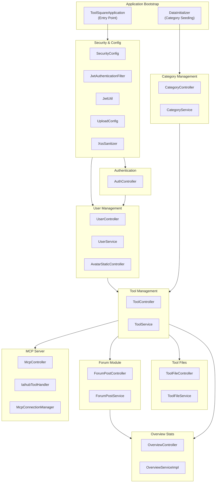

# CodingHub Repository Overview

## Purpose
The CodingHub repository (also known as ToolSquare) is a Spring Boot-based platform designed for sharing, discovering, and managing AI tools, prompts, and MCP (Model Context Protocol) resources. It provides a comprehensive backend with JWT-based authentication, user management, tool categorization, file handling, and a community forum. Additionally, it features an MCP server that exposes platform capabilities to external AI agents via Server-Sent Events (SSE), along with a Vue.js/TypeScript frontend and UI/UX design generation scripts.

## Architecture
The application follows a classic layered Spring Boot architecture (Controllers → Services → Repositories → Models) and is organized into several functional sub-modules. The high-level architecture and module dependencies are visualized below:

## Core Modules
- [Application Bootstrap](application_bootstrap.md): The entry point of the platform, responsible for application startup and data seeding.
- [Security & Configuration](security_config.md): Manages JWT-based authentication, CORS, XSS sanitization, and file upload configurations.
- [Authentication](authentication.md): Handles user registration, login, and JWT token refresh operations.
- [User Management](user_management.md): Manages user profiles, avatar uploads, and public user profiles.
- [Common DTOs](common_dto.md): Shared data transfer objects (`ApiResponse`, `PageResponse`) used across all modules.
- [Category Management](category_management.md): Manages tool categories (Skill, MCP, Prompt, Other).
- [Tool Management](tool_management.md): The core module for CRUD operations on tools, including likes, comments, and scoring.
- [Tool Files](tool_files.md): Handles file upload, download, and listing for tools.
- [Forum Module](forum_module.md): A community forum with posts, comments, likes, tags, categories, and favorites.
- [MCP Server](mcp_server.md): Implements a Model Context Protocol (MCP) server exposing tools, posts, and files to AI agents.
- [Overview Stats](overview_stats.md): Provides dashboard statistics and top-ranked tools and posts by category.
- [Frontend Types](frontend_types.md): TypeScript type definitions for the Vue.js frontend, mirroring backend DTOs.
- [UI/UX Skills Scripts](ui_ux_skills_scripts.md): Development tooling scripts including a BM25 search algorithm and design system generator.