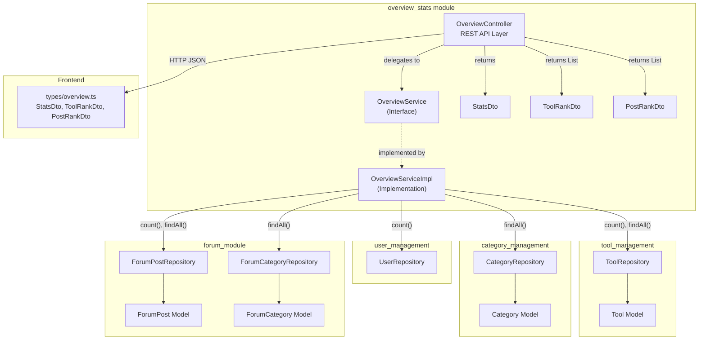
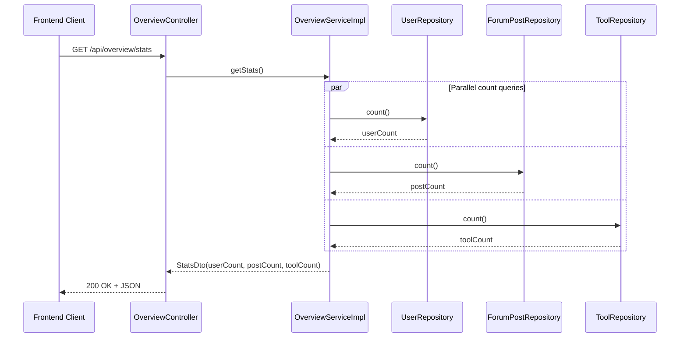
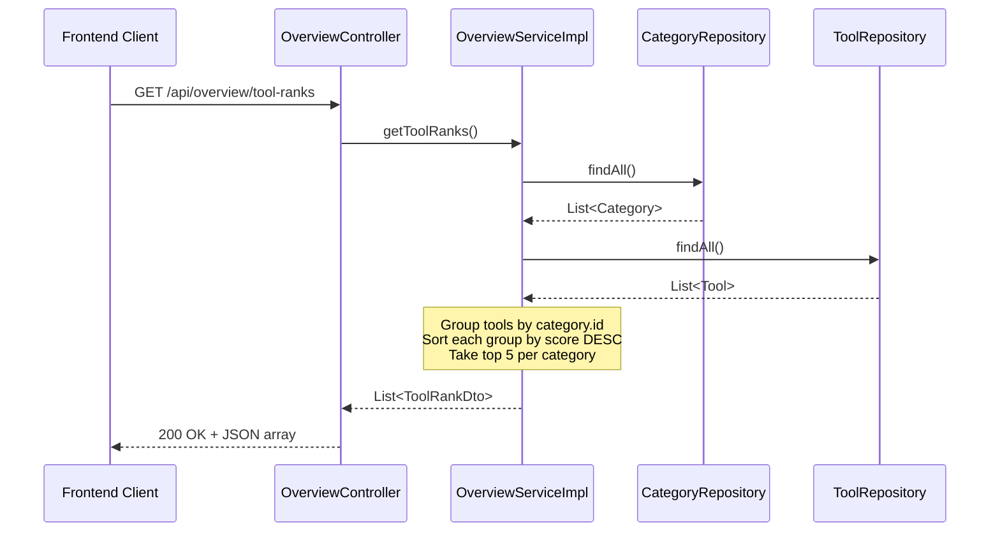
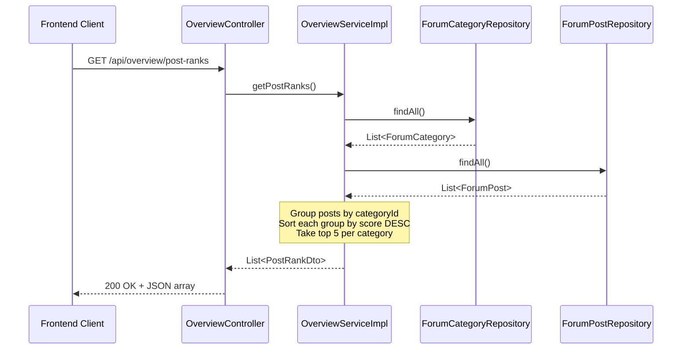
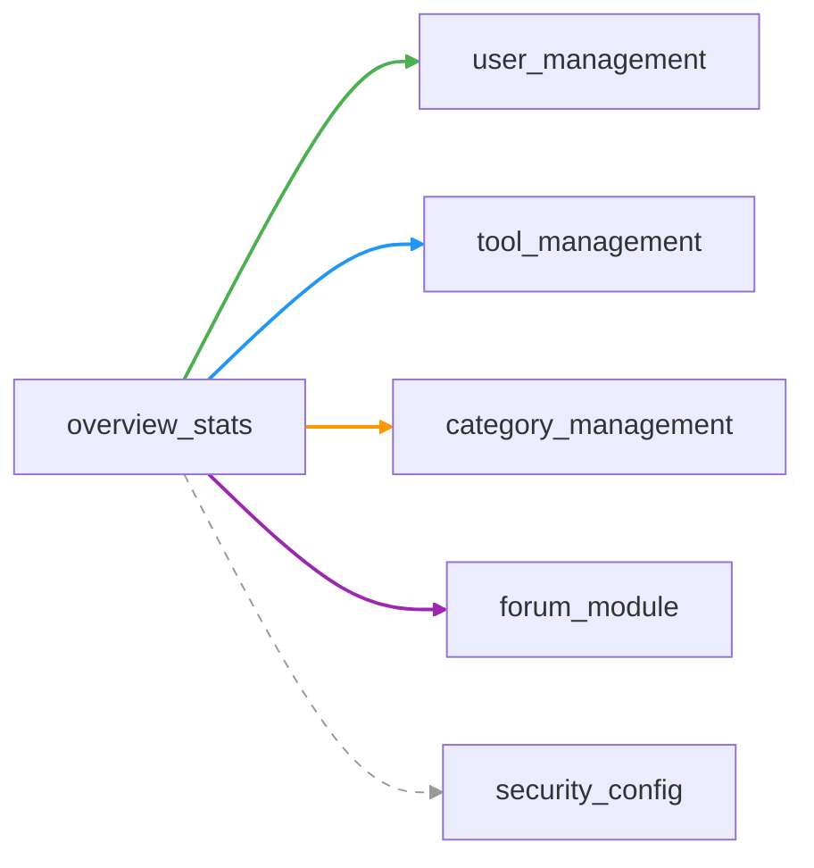

# Overview Stats Module

## Introduction

The **overview_stats** module is a read-only analytics and dashboard layer for the ToolSquare platform. It aggregates data across three core domains — users, tools, and forum posts — to expose platform-wide statistics and per-category ranking leaderboards through a single REST controller. This module does not own any persistent entities; instead, it queries repositories owned by the [user_management](user_management.md), [tool_management](tool_management.md), [category_management](category_management.md), and [forum_module](forum_module.md) modules to compose its responses.

---

## Architecture Overview



The module follows a standard **Controller → Service → Repository** layered architecture. The `OverviewServiceImpl` acts as an aggregation hub, pulling data from five distinct repositories across four other modules and transforming it into ranking and statistics DTOs.

---

## Core Components

### 1. OverviewController

| Attribute | Value |
|-----------|-------|
| **File** | `backend/src/main/java/com/iaihub/toolbox/controller/OverviewController.java` |
| **Base Path** | `/api/overview` |
| **Authentication** | Public (no auth required — falls under `anyRequest().permitAll()` in [security_config](security_config.md)) |

The controller is a lightweight REST entry point that delegates all logic to `OverviewService`. It exposes three GET endpoints:

| Endpoint | HTTP | Returns | Description |
|----------|------|---------|-------------|
| `/api/overview/stats` | GET | `StatsDto` | Platform-wide aggregate counts |
| `/api/overview/tool-ranks` | GET | `List<ToolRankDto>` | Top 5 tools per category, ranked by score |
| `/api/overview/post-ranks` | GET | `List<PostRankDto>` | Top 5 forum posts per category, ranked by score |

### 2. OverviewService (Interface)

| Attribute | Value |
|-----------|-------|
| **File** | `backend/src/main/java/com/iaihub/toolbox/service/OverviewService.java` |

Defines the service contract with three methods mirroring the controller endpoints:

```java
StatsDto getStats();
List<ToolRankDto> getToolRanks();
List<PostRankDto> getPostRanks();
```

### 3. OverviewServiceImpl

| Attribute | Value |
|-----------|-------|
| **File** | `backend/src/main/java/com/iaihub/toolbox/service/OverviewServiceImpl.java` |
| **Annotation** | `@Service` |

The implementation injects five repositories via constructor injection:

| Repository | Source Module | Usage |
|------------|--------------|-------|
| `UserRepository` | [user_management](user_management.md) | `count()` for total user count |
| `ToolRepository` | [tool_management](tool_management.md) | `count()` for total tool count; `findAll()` for tool rankings |
| `CategoryRepository` | [category_management](category_management.md) | `findAll()` for tool category grouping |
| `ForumPostRepository` | [forum_module](forum_module.md) | `count()` for total post count; `findAll()` for post rankings |
| `ForumCategoryRepository` | [forum_module](forum_module.md) | `findAll()` for forum category grouping |

#### Key Implementation Details

- **`getStats()`**: Simply calls `count()` on the user, forum post, and tool repositories and wraps the results in a `StatsDto`.
- **`getToolRanks()`**: Loads all categories and all tools, groups tools by `category.id`, then for each category sorts tools by `score` (descending) and takes the top 5.
- **`getPostRanks()`**: Same pattern as tool ranks but for forum posts, grouping by `categoryId` and sorting by `score` (descending), top 5 per category.

> **Note**: The current implementation uses `findAll()` to load all tools and posts into memory for grouping and sorting. This is suitable for small-to-medium datasets but may need optimization (e.g., database-level queries with `ORDER BY` and `LIMIT`) for large-scale deployments.

### 4. Data Transfer Objects (DTOs)

#### StatsDto

| Field | Type | Description |
|-------|------|-------------|
| `userCount` | `Long` | Total number of registered users |
| `postCount` | `Long` | Total number of forum posts |
| `toolCount` | `Long` | Total number of tools |

#### ToolRankDto

| Field | Type | Description |
|-------|------|-------------|
| `id` | `Long` | Tool ID |
| `category` | `String` | Category name |
| `toolName` | `String` | Tool name |
| `score` | `BigDecimal` | Composite engagement score |

#### PostRankDto

| Field | Type | Description |
|-------|------|-------------|
| `id` | `Long` | Forum post ID |
| `category` | `String` | Forum category name |
| `postTitle` | `String` | Post title |
| `score` | `BigDecimal` | Composite engagement score |

---

## Score Calculation

Both the `Tool` model (from [tool_management](tool_management.md)) and the `ForumPost` model (from [forum_module](forum_module.md)) maintain a `score` field that drives the ranking logic in this module. The score is a weighted composite of engagement metrics:

```
score = viewCount × 1 + likeCount × 3 + commentCount × 5
```

| Metric | Weight | Rationale |
|--------|--------|-----------|
| View Count | ×1 | Lowest engagement signal |
| Like Count | ×3 | Moderate active engagement |
| Comment Count | ×5 | Highest active engagement |

The score is recalculated automatically whenever view, like, or comment counts change via the model's `updateScore()` method. This pre-computed score allows the overview module to sort and rank efficiently without recalculating at query time.

---

## Data Flow

### Statistics Flow



### Tool Ranking Flow



### Post Ranking Flow



---

## Module Dependencies



| Dependency | Type | Description |
|------------|------|-------------|
| [user_management](user_management.md) | Repository | `UserRepository.count()` for user statistics |
| [tool_management](tool_management.md) | Repository + Model | `ToolRepository` for count and ranking; `Tool` model for score field |
| [category_management](category_management.md) | Repository + Model | `CategoryRepository` for tool category grouping; `Category` model |
| [forum_module](forum_module.md) | Repository + Model | `ForumPostRepository` and `ForumCategoryRepository` for post statistics and ranking; `ForumPost` and `ForumCategory` models |
| [security_config](security_config.md) | Configuration | Overview endpoints are publicly accessible (no authentication) |

---

## Frontend Integration

The frontend defines corresponding TypeScript interfaces in `frontend/src/types/overview.ts` that mirror the backend DTOs:

```typescript
interface StatsDto {
  userCount: number;
  postCount: number;
  toolCount: number;
}

interface ToolRankDto {
  id: number;
  category: string;
  toolName: string;
  score: number;
}

interface PostRankDto {
  id: number;
  category: string;
  postTitle: string;
  score: number;
}
```

These types are part of the [frontend_types](frontend_types.md) module and are consumed by dashboard/overview UI components to render platform statistics and ranking leaderboards.

---

## API Reference Summary

```
GET /api/overview/stats
  → 200 OK
  → { "userCount": 150, "postCount": 320, "toolCount": 45 }

GET /api/overview/tool-ranks
  → 200 OK
  → [
      { "id": 1, "category": "AI Tools", "toolName": "ChatBot Pro", "score": 1250.00 },
      { "id": 5, "category": "AI Tools", "toolName": "ImageGen", "score": 980.00 },
      ...
    ]

GET /api/overview/post-ranks
  → 200 OK
  → [
      { "id": 10, "category": "Discussion", "postTitle": "Best practices", "score": 450.00 },
      { "id": 22, "category": "Discussion", "postTitle": "New release", "score": 320.00 },
      ...
    ]
```

All endpoints are **public** (no authentication required) and return data directly without wrapping in `ApiResponse`, unlike most other controllers in the system.

---

## Design Considerations

1. **Read-Only Module**: This module performs no writes. It is purely a query/aggregation layer, making it safe for caching strategies (e.g., HTTP cache headers, CDN caching) if needed.

2. **In-Memory Aggregation**: The ranking logic loads all entities into memory for grouping and sorting. For production scale, consider replacing `findAll()` with database-level queries using `GROUP BY`, `ORDER BY score DESC`, and `LIMIT` to reduce memory footprint.

3. **No Status Filtering**: The current implementation does not filter tools by `Status.NORMAL` or forum posts by `ForumPostStatus.NORMAL` when computing rankings. This means deleted/abnormal items may appear in rankings. This may need to be addressed depending on business requirements.

4. **Direct DTO Return**: Unlike other controllers that wrap responses in `ApiResponse<T>`, the `OverviewController` returns DTOs directly. This is a deliberate simplification for dashboard data consumption.
