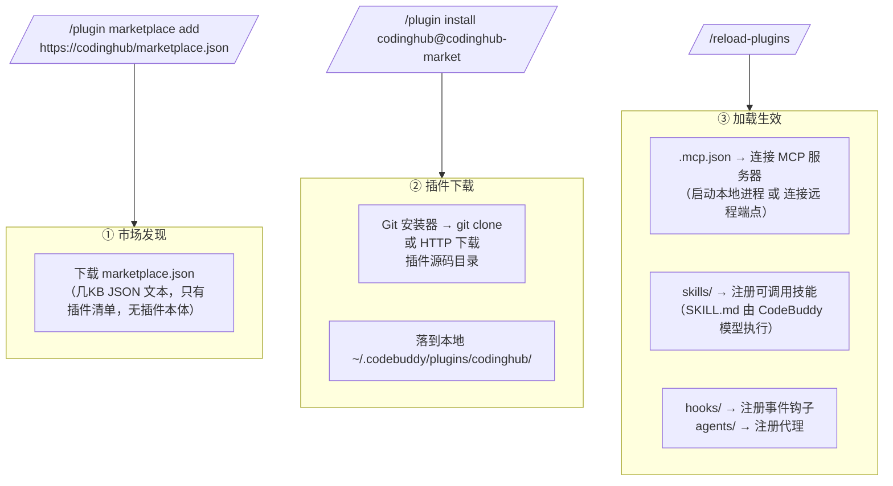
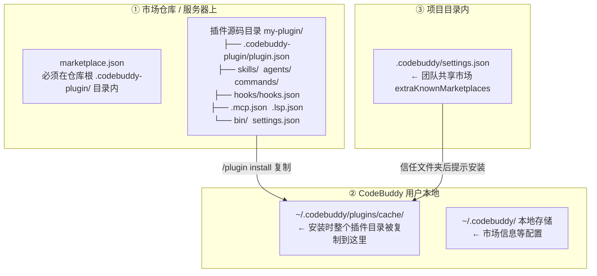
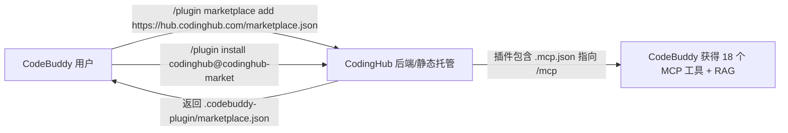

# 研究报告：CodeBuddy 插件市场接入可行性

> 日期：2026-08-26
> 结论：**可行，且 CodingHub 的形态与插件市场天然契合**。推荐「自建 HTTP 型插件市场 + 把 CodingHub 封装成 CodeBuddy 插件」路径，用户一行命令即可把 CodingHub 配置进 CodeBuddy。
> 来源：腾讯云 CodeBuddy 官方文档《插件市场（Plugin Marketplaces）》《创建插件》。

---

## 1. 结论摘要

| 问题 | 结论 |
|------|------|
| CodeBuddy 插件市场是什么 | 一个**插件目录文件**（`.codebuddy-plugin/marketplace.json`），通过 GitHub / Git / HTTP URL / 本地目录分发插件 |
| 用户如何接入自定义市场 | `/plugin marketplace add <地址>` 一行命令，之后 `/plugin install <插件名>@<市场名>` |
| CodingHub 能否提供插件市场 | **能**。插件市场本质是 JSON 目录 + 静态托管，CodingHub 后端加一个接口、前端加一个页面即可 |
| 把 CodingHub「配到 CodeBuddy 插件市场中」 | 两条路径：A) CodingHub 自建市场，用户添加 CodingHub 市场地址；B) 提交到官方市场 `codebuddy-plugins-official`（提交流程官方未公开，需另行联系） |
| 核心收益 | 用户安装 CodingHub 插件后，CodeBuddy 可直接获得 CodingHub 的 18 个 MCP 工具 + RAG 知识库能力 |

---

## 2. CodeBuddy 插件市场机制（官方文档梳理）

### 2.1 插件市场 = 一个 JSON 目录文件

市场核心文件位于仓库的 `.codebuddy-plugin/marketplace.json`，schema 如下：

```json
{
  "name": "company-tools",
  "owner": { "name": "DevTools Team", "email": "team@example.com" },
  "description": "可选",
  "version": "1.0.0",
  "plugins": [
    {
      "name": "code-formatter",
      "source": "./plugins/formatter",
      "description": "Automatic code formatting on save",
      "version": "2.1.0"
    }
  ]
}
```

**Marketplace 字段**：`name`（kebab-case 标识符，必填）、`owner`（必填）、`plugins`（必填）、`description`/`version`（可选）。

**Plugin Entry 字段**：

| 字段 | 说明 |
|------|------|
| `name` / `source` / `description` | 必填；source 支持相对路径 / GitHub `{owner}/{repo}` / Git URL |
| `version` / `author` / `homepage` / `repository` / `license` / `keywords` / `category` | 可选元数据 |
| `strict` | 是否强制要求插件含 `plugin.json`（默认 `true`） |
| `commands` / `agents` / `skills` / `hooks` / `mcpServers` | 可选组件路径覆盖 |

### 2.2 用户接入市场的命令流

```bash
# 添加市场（支持 GitHub / Git URL / HTTP URL / 本地目录 / 直接指定 json）
/plugin marketplace add your-org/codebuddy-plugins
/plugin marketplace add https://gitlab.com/company/plugins.git
/plugin marketplace add https://example.com/marketplace.json
/plugin marketplace add ./my-marketplace

# 安装插件（插件名@市场名，支持 --scope project）
/plugin install github@codebuddy-plugins-official

# 管理市场
/plugin marketplace list | update <名> | remove <名>
/reload-plugins   # 安装/启用后热重载，无需重启
```

**团队分发**：项目 `.codebuddy/settings.json` 中声明 `extraKnownMarketplaces`，团队成员信任该文件夹时市场与插件自动安装：

```json
{
  "extraKnownMarketplaces": {
    "my-team-tools": {
      "source": { "source": "github", "repo": "your-org/codebuddy-plugins" }
    }
  }
}
```

### 2.3 插件的目录结构与能力组件

```
my-plugin/
├── .codebuddy-plugin/plugin.json   # 清单（name/description/version/author...）
├── skills/   commands/   agents/   hooks/hooks.json
├── .mcp.json  # 声明 MCP 服务器（command + args 或 指向远程）
├── .lsp.json  # 声明 LSP 服务器
├── bin/       # 可执行文件（启用后加入 PATH）
└── settings.json  # 默认设置（如默认激活某 agent）
```

> ⚠️ **官方明确警告**：`.codebuddy-plugin/` 目录内**只能放 `plugin.json`**；`commands/`、`agents/`、`skills/`、`hooks/`、`.mcp.json`、`.lsp.json`、`bin/`、`settings.json` 都必须在**插件根目录**层级。

- **Skills**：`skills/<名>/SKILL.md`（frontmatter 含 name/description），以 `/插件名:技能名` 命名空间化
- **MCP 服务器**：`.mcp.json` 声明，装插件即得 MCP 工具 —— **这是 CodingHub 直接受益点**
- 本地开发验证：`codebuddy --plugin-dir ./my-plugin`、`codebuddy plugin validate /path/to/plugin`

### 2.4 下发与加载链路（工作原理）

**核心认知：插件不是"编译好的安装包"，而是一个源代码目录（文件夹）；下发的本质 = 把文件夹克隆/下载到本地，然后 CodeBuddy 按目录内的清单文件加载生效。**



#### 三个环节

**① 市场发现 —— 只下载一个 JSON 清单**

`/plugin marketplace add` 时，CodeBuddy 只把 `marketplace.json`（几 KB 的目录文件）下载/克隆下来（`MarketplaceFactory` 按 source 类型创建市场实例）。里面只有插件名、来源、描述，**没有插件本体**。

**② 插件下载 —— 按 source 拉取源码目录**

`/plugin install` 时，安装器按插件条目 `source` 拉取：

| source 类型 | 安装器动作 |
|------------|-----------|
| GitHub `owner/repo` | `git clone` |
| Git URL | `git clone`（支持 `#v1.0.0` 指定分支） |
| 相对路径 / 本地 | 复制本地目录 |
| HTTP URL | 下载文件 |

安装器统一实现 `support() / isInstalled() / install() / update()`。安装后插件目录被**复制到本地缓存 `~/.codebuddy/plugins/cache/`**（官方原文："插件被复制到缓存，所以引用插件目录外的文件路径无法工作"），清缓存即 `rm -rf ~/.codebuddy/plugins/cache` 后重启。

**③ 加载生效 —— 配置被 CodeBuddy 执行，不是程序被安装**

- **MCP 服务器两种形态**：
  - 本地型：`.mcp.json` 写 `command + args`，CodeBuddy 在用户机器上启动该进程
  - 远程型（CodingHub 场景）：`.mcp.json` 写 URL，CodeBuddy **不下载任何东西，直接 HTTP 连接远端** `/mcp`（Streamable HTTP/SSE），获得 18 个工具
- **Skill**：`SKILL.md` 是 Markdown 指令文档，CodeBuddy 读 frontmatter（name/description）注册成 `/插件名:技能名`，执行主体是 CodeBuddy 自己的大模型
- **Hooks/Agents**：同样是配置注册，非二进制安装

> 一句话：**"下发" = git clone / HTTP 下载一个插件文件夹；"生效" = CodeBuddy 按 .mcp.json 连上你的 MCP 端点、按 SKILL.md 注册技能。** 对 CodingHub 而言，用户机器上无需运行任何服务——插件只是告诉 CodeBuddy "去连 http://<host>:8082/mcp"，真正的能力全在 CodingHub 后端。

### 2.5 文件位置总览（四层地图）



| 层 | 位置 | 内容 |
|----|------|------|
| ① 发布侧 | 仓库根 `.codebuddy-plugin/marketplace.json` | 市场清单（必填字段：name/owner/plugins） |
| ① 发布侧 | 插件根 `.codebuddy-plugin/plugin.json` | 插件清单（name/description/version/author） |
| ① 发布侧 | 插件根：`skills/ agents/ commands/ hooks/ .mcp.json .lsp.json bin/ settings.json` | 能力组件；⚠️ 均**不能**放进 `.codebuddy-plugin/` 内 |
| ② 用户本地 | `~/.codebuddy/plugins/cache/` | 插件安装后被整体复制到这里，插件内引用只能指向自身目录内 |
| ② 用户本地 | `~/.codebuddy/`（本地存储） | 市场信息等配置；清缓存 `rm -rf ~/.codebuddy/plugins/cache` |
| ③ 项目内 | `<项目根>/.codebuddy/settings.json` | `extraKnownMarketplaces` 团队市场声明 |
| ④ 非插件 | `<项目根>/.codebuddy/commands/ skills/ agents/` | 个人/项目独立配置，不经过市场 |

**CodingHub 场景对应**：只需产出 ① 层 —— 一个 Git 仓库：

```
codinghub-plugin/                  ← 一个 Git 仓库（GitHub 托管最省事）
├── .codebuddy-plugin/
│   └── marketplace.json           ← 市场清单（指向下面这个插件）
└── codinghub/
    ├── .codebuddy-plugin/plugin.json
    ├── .mcp.json                  ← 指向 http://<CodingHub>:8082/mcp
    └── README.md
```

### 2.6 关键注意点（坑）

- **URL 型市场中相对路径 source 不可用**（"路径未找到"），需改用 Git 型市场或绝对 URL —— 直接影响 CodingHub 自建 HTTP 市场时的插件 source 设计
- 插件可执行任意代码，安全上等同安装软件，需信任来源
- 官方市场 `codebuddy-plugins-official` 启动时自动可用、默认自动更新；第三方市场默认**不**自动更新（可用 `CODEBUDDY_AUTO_UPDATE_THIRD_PARTY_MARKETPLACES=true` 开启）

---

## 3. CodingHub 现状盘点

| 项 | 现状 | 与插件市场的关系 |
|----|------|------------------|
| MCP 服务 | `backend/.../mcp/` 6 个类，18 tools，走 **Streamable HTTP/SSE**，路径 `/mcp`，端口 8082 | 可直接作为插件的 `.mcp.json` 远程端点；**这是把 CodingHub 包装成插件的最短路径** |
| RAG 服务 | `rag/` Python 服务（MCP + REST） | 可并入插件能力 |
| 插件市场功能 | **未找到**（前端/后端搜索 plugin/marketplace/extension 仅 `upload`/`platform` 子串误报） | 需要新建 |
| 市场形态产品 | 已有「工具市场」模块（工具 CRUD、分类、搜索、下载、互动） | 产品形态可复用：插件市场 = 工具市场的特例 |
| 对外配置 | 后端 8082 / 前端 5173，默认本机部署 | 插件市场需**公网可达**地址（或 GitHub 托管），是主要前置条件 |

---

## 4. 可行性评估：三条路径

### 路径 A（推荐）：CodingHub 自建插件市场



- 后端新增 `GET /api/v1/plugin-market/marketplace.json`（或静态资源托管），返回市场目录
- 制作一个 `codinghub` 插件：`plugin.json` + `.mcp.json`（`mcpServers` 指向 `http://<host>:8082/mcp`）+ README
- **关键决策**：插件 source 用 GitHub 仓库（推荐，更新管理成熟）或 CodingHub 托管的绝对 URL；不能依赖相对路径
- 前端新增「插件市场」页：展示插件卡片 + 一键复制安装命令（复用工具市场页面的 UI 模式）

### 路径 B：提交到官方市场 `codebuddy-plugins-official`

- 官方市场内置可用，但**官方文档未公开提交流程与仓库地址**；社区可见镜像仓库（`masx200/codebuddy-plugins-official`、`cnb.cool/codebuddy/marketplace`）接受 PR
- 不确定性高，建议作为后续触点：通过腾讯云工单/社区确认正式投稿渠道

### 路径 C：团队市场（`extraKnownMarketplaces`）

- 面向 CodingHub 内部/授权团队：在团队项目 `.codebuddy/settings.json` 声明 `extraKnownMarketplaces` 指向 CodingHub 市场，信任文件夹即自动安装
- 与路径 A 同源，仅分发方式不同，可同时启用

---

## 5. 落地建议（路径 A 最小实现）

1. **插件仓库**（一次性，人工）：
   - 新建 `codinghub-plugin` 仓库：`.codebuddy-plugin/plugin.json` + `.mcp.json`（mcpServers 指向 CodingHub 部署地址的 `/mcp`）+ README + `skills/`（可选，如"查工具"、"查知识库"）
   - 仓库根放 `.codebuddy-plugin/marketplace.json`（自身即市场，source 指向本仓库）
2. **CodingHub 后端**（1 个接口）：
   - `PluginMarketController`：`GET /api/v1/plugin-market/marketplace.json`，从数据库/配置动态生成市场 JSON（后续可支持多插件、版本管理）
3. **CodingHub 前端**（1 个页面）：
   - `PluginMarketPage.vue`：插件列表 + 安装命令展示 + 使用文档
4. **用户侧**（一行命令）：
   ```bash
   /plugin marketplace add https://<codinghub-host>/api/v1/plugin-market/marketplace.json
   /plugin install codinghub@codinghub-market
   /reload-plugins
   ```

---

## 6. 风险与前置条件

| 风险/前置 | 说明 |
|-----------|------|
| 公网可达地址 | 插件市场 URL 需用户可访问；本地 8082 仅在开发场景可用，需部署域名或改用 GitHub 托管 |
| source 相对路径坑 | HTTP 市场内插件 source 必须用 GitHub 或绝对 URL |
| MCP 端点鉴权 | CodingHub `/mcp` 若接入 JWT 鉴权，需确认 CodeBuddy 侧 MCP 认证方式（.mcp.json 是否支持 header/token） |
| 安全信任 | 插件可执行任意代码，发布前需官方/社区背书 |
| 官方市场投稿 | 路径 B 需向腾讯确认正式流程 |

---

## 7. 参考来源

- 腾讯云 CodeBuddy 官方文档 — 插件市场（Plugin Marketplaces）：https://www.codebuddy.ai/docs/zh/cli/plugin-marketplaces
- 腾讯云 CodeBuddy 官方文档 — 创建插件：https://www.codebuddy.ai/docs/zh/cli/plugins
- 腾讯云 CodeBuddy 插件参考文档：https://www.codebuddy.cn/docs/cli/plugins-reference
- 社区实践仓库：`studyzy/codebuddy-best-practice`、`masx200/codebuddy-plugins-official`
- CodingHub 项目文件：`harness/config/environment.json`、`backend/src/main/java/com/iaihub/toolbox/mcp/`、`docs/工具市场.md`
