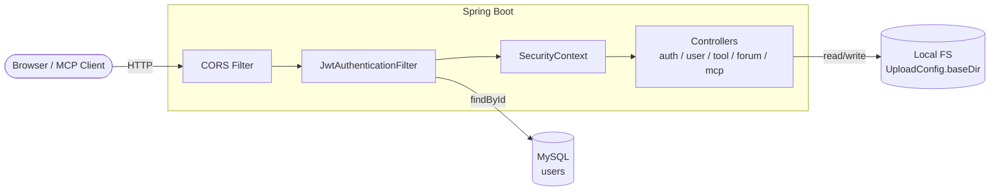
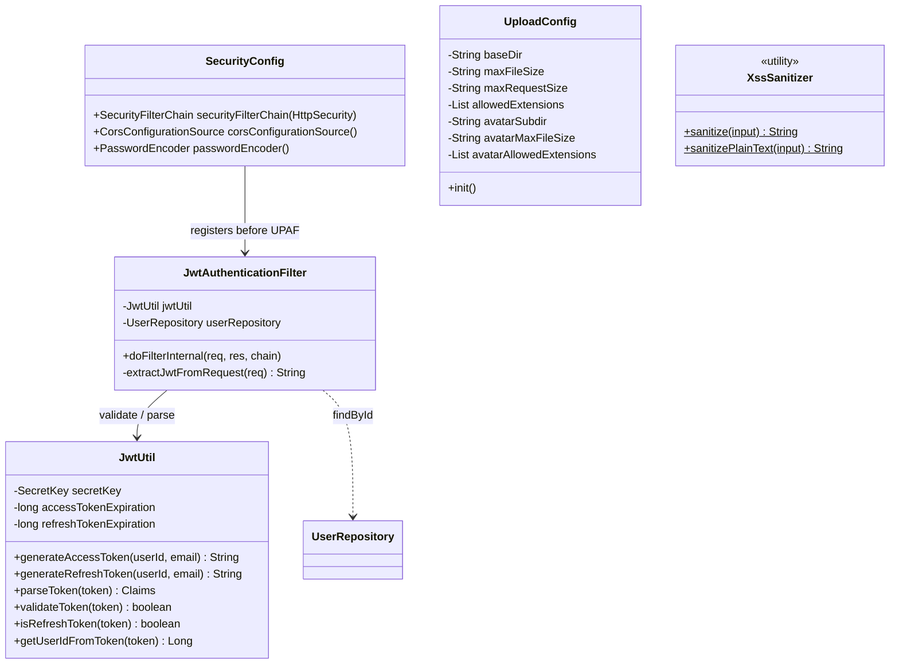
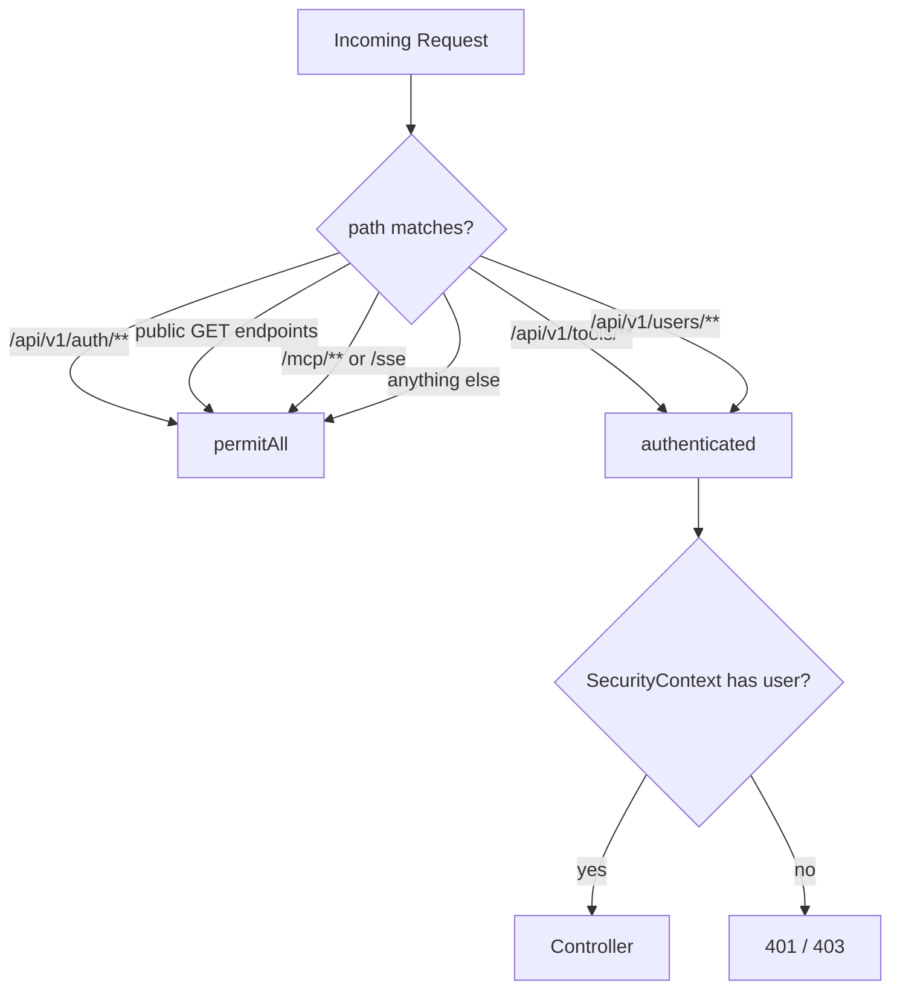
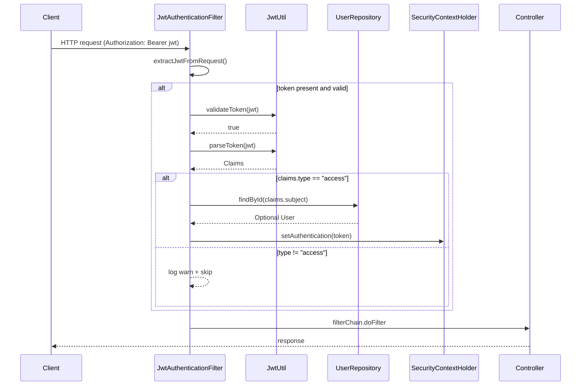
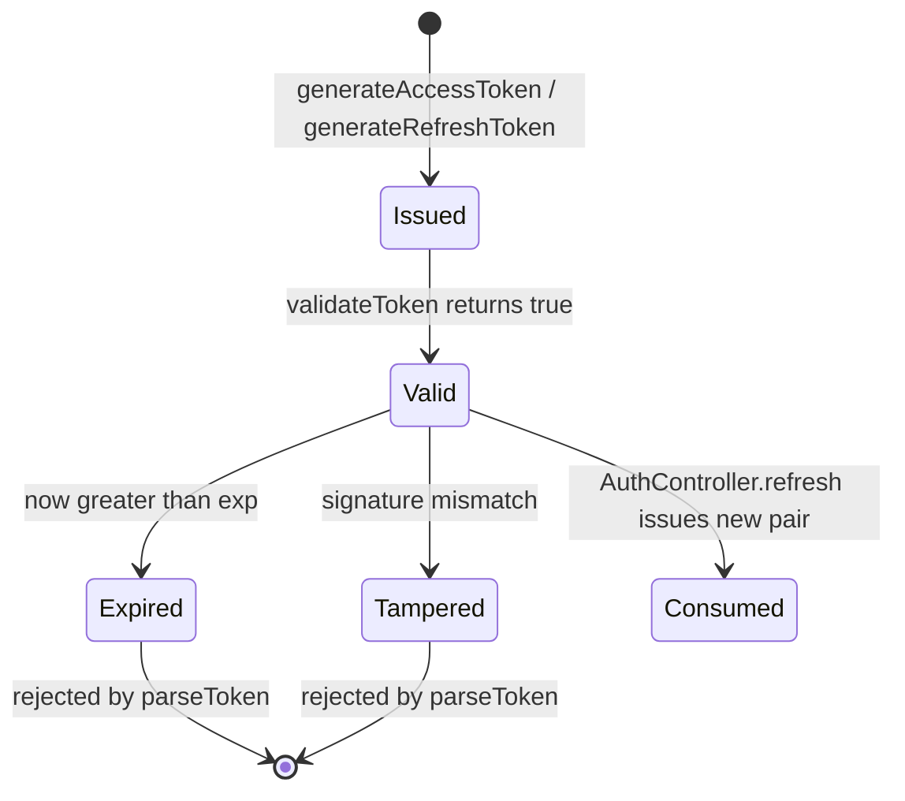
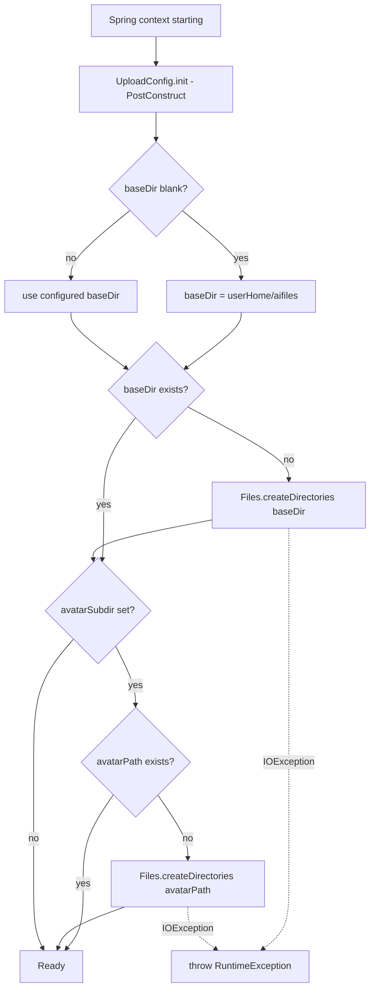
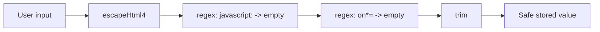
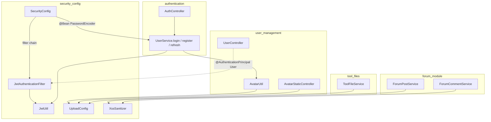
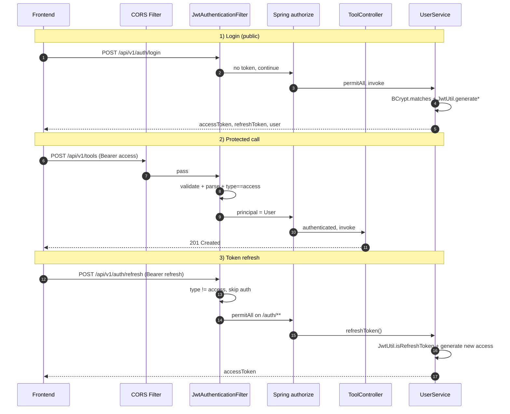

# Security & Configuration Module (`security_config`)

## 1. Introduction & Purpose

The `security_config` module is the **security backbone** of the ToolSquare backend. It provides
the cross-cutting infrastructure that protects every HTTP request entering the application,
issues and validates user identity tokens, configures file-upload constraints, and sanitizes
user-supplied content against XSS attacks.

It is **not** a feature module; instead it is a horizontal layer that the
[`authentication`](authentication.md), [`user_management`](user_management.md),
[`tool_management`](tool_management.md), [`tool_files`](tool_files.md),
[`forum_module`](forum_module.md), and [`mcp_server`](mcp_server.md) modules all depend on.

### Responsibilities

| Concern | Component | Description |
|---------|-----------|-------------|
| HTTP security policy | `SecurityConfig` | Spring Security filter chain, CORS, public/protected route rules |
| Per-request authentication | `JwtAuthenticationFilter` | Extracts & validates the JWT, populates `SecurityContextHolder` |
| Token issuance & validation | `JwtUtil` | Signs/parses access & refresh tokens (HS256) |
| File-upload policy | `UploadConfig` | Base directory, size limits, extension whitelists, avatar settings |
| Content sanitization | `XssSanitizer` | HTML-escape user input, strip dangerous patterns |
| Password hashing | `SecurityConfig#passwordEncoder` | BCrypt encoder bean for the [`user_management`](user_management.md) module |

---

## 2. Architecture Overview

### 2.1 High-level placement



### 2.2 Component relationships inside `security_config`



---


## 3. Component-Level Documentation

### 3.1 `SecurityConfig` — Spring Security wiring

`SecurityConfig` is the central `@Configuration` that defines the **`SecurityFilterChain`** bean.

Key decisions encoded here:

- **CSRF disabled** — the API is stateless and uses bearer tokens, not cookies.
- **Stateless session policy** — `SessionCreationPolicy.STATELESS`; no `HttpSession` is created.
- **CORS enabled globally** — all origins/methods/headers allowed (`setAllowedOriginPatterns("*")`,
  `allowCredentials=true`, `maxAge=3600`). Suitable for development; tighten for production.
- **`JwtAuthenticationFilter` inserted before** `UsernamePasswordAuthenticationFilter` so JWT
  authentication runs on every request prior to Spring's default form-login filter.
- **`BCryptPasswordEncoder`** is exposed as a `@Bean` so `UserService`
  (see [`user_management`](user_management.md)) can hash and verify passwords.

#### Authorization rules

Routes are evaluated **top-down**; the first matching rule wins.

| Pattern | Method | Access |
|---------|--------|--------|
| `/api/v1/auth/**` | * | `permitAll` |
| `/api/v1/tools` | GET | `permitAll` |
| `/api/v1/tools/{id}` | GET | `permitAll` |
| `/api/v1/tools/{id}/like-status` | GET | `permitAll` |
| `/api/v1/tools/{id}/comments` | GET | `permitAll` |
| `/api/v1/categories` | GET | `permitAll` |
| `/api/v1/tools/{toolId}/files` | GET / POST | `permitAll` |
| `/api/v1/tools/{toolId}/files/{fileId}/download` | GET | `permitAll` |
| `/api/v1/static/avatars/**` | GET | `permitAll` |
| `/api/v1/users/{id}` | GET | `permitAll` (public profile) |
| `/mcp/**`, `/sse` | * | `permitAll` |
| `/api/v1/tools/**` | * | `authenticated` |
| `/api/v1/users/**` | * | `authenticated` |
| *anything else* | * | `permitAll` |



> **Ordering note** — endpoints under `/api/v1/tools/{toolId}/files/**` are intentionally
> declared **before** `/api/v1/tools/**` so that file routes remain public.
> See [`tool_files`](tool_files.md) for the file APIs themselves.

---

### 3.2 `JwtAuthenticationFilter` — per-request authentication

A `OncePerRequestFilter` registered as a Spring `@Component`. It executes on **every** request
(regardless of whether the route requires auth), so that "optional auth" routes such as
`GET /api/v1/tools` can still observe the current user when a token is present.



Important details:

- **Token type guard** — only tokens with `claim.type == "access"` populate the security context.
  Refresh tokens are accepted *only* by `AuthController#refresh`
  (see [`authentication`](authentication.md)).
- **Principal** — the entire `User` entity is stored as the authentication principal, allowing
  controllers to use `@AuthenticationPrincipal User user` directly.
- **Authorities** — currently `Collections.emptyList()`; the system has no role-based
  authorization yet — all "protected" routes simply require *any* authenticated user.
- **Failure mode** — any exception is logged and the chain continues *unauthenticated*; the
  downstream `authorizeHttpRequests` rules then decide whether to return 401 / 403.
- **Header convention** — `Authorization: Bearer <jwt>`; anything else is ignored.

---

### 3.3 `JwtUtil` — token issuance & validation

A stateless utility component using the **`io.jsonwebtoken` (jjwt 0.12+)** API.

| Property (in `application.yml`) | Purpose |
|---------------------------------|---------|
| `app.jwt.secret` | HMAC-SHA secret bytes (UTF-8) |
| `app.jwt.access-token-expiration` | Access TTL (ms) |
| `app.jwt.refresh-token-expiration` | Refresh TTL (ms) |

#### Token shape

```json
{
  "sub":   "<userId>",
  "email": "<user email>",
  "type":  "access | refresh",
  "iat":   1700000000,
  "exp":   1700003600
}
```

Signed with `HS256` using `Keys.hmacShaKeyFor(secret.getBytes(UTF_8))`.

#### Public API

| Method | Caller | Purpose |
|--------|--------|---------|
| `generateAccessToken(userId, email)` | `UserService.login/register` | Short-lived bearer token |
| `generateRefreshToken(userId, email)` | `UserService.login/register` | Long-lived rotation token |
| `parseToken(token)` | `JwtAuthenticationFilter`, `UserService.refreshToken` | Returns `Claims` or throws |
| `validateToken(token)` | `JwtAuthenticationFilter` | Boolean wrapper around `parseToken` |
| `isRefreshToken(token)` | `UserService.refreshToken` | Guards refresh endpoint against access-token misuse |
| `getUserIdFromToken(token)` | utility | Convenience accessor for `sub` |

#### Lifecycle



---


### 3.4 `UploadConfig` — file-upload configuration properties

A `@ConfigurationProperties("app.upload")` bean that **also bootstraps the upload directory**
on application startup via `@PostConstruct init()`.

| Property | Default | Used by |
|----------|---------|---------|
| `baseDir` | `${user.home}/aifiles` | All file storage |
| `maxFileSize` | `50MB` | Tool-attachment size cap |
| `maxRequestSize` | `200MB` | Multipart request cap |
| `allowedExtensions` | *(empty → no whitelist)* | Tool-file extension validation |
| `avatarSubdir` | `avatars` | Subfolder for avatars |
| `avatarMaxFileSize` | `2MB` | Avatar size cap |
| `avatarAllowedExtensions` | `jpg, jpeg, png, webp, gif` | Avatar extension whitelist |

#### Startup behavior



#### Consumers

- [`tool_files`](tool_files.md) — `ToolFileService` writes attachments under `baseDir`.
- [`user_management`](user_management.md) — `UserService` / `AvatarUtil` writes avatars under
  `baseDir/avatarSubdir`, and `AvatarStaticController` serves them at
  `/api/v1/static/avatars/**` (a `permitAll` route in `SecurityConfig`).

---

### 3.5 `XssSanitizer` — content sanitization utility

A final, non-instantiable utility class used by services that persist
user-supplied free-text (forum posts, comments, tool descriptions). It relies on
**Apache Commons Text** for HTML entity escaping.

| Method | Behavior | Suitable for |
|--------|----------|--------------|
| `sanitize(String)` | `escapeHtml4` + strip `javascript:` URIs and `on*=` event handlers, then `trim()` | Markdown content rendered later by `markdown-it` |
| `sanitizePlainText(String)` | Plain `escapeHtml4` only | Plain-text fields (titles, names) |



> The sanitizer is intentionally **conservative** — it does not attempt to allow-list HTML tags.
> Markdown rendering is performed on the client (`markdown-it`) which handles the
> escaped entities safely.

---


## 4. Cross-Module Interactions

The diagram below summarises how `security_config` interlocks with the feature modules.



| Direction | Module | Interaction |
|-----------|--------|-------------|
| `security_config` → `authentication` | [`authentication`](authentication.md) | `JwtUtil` and `PasswordEncoder` consumed by `UserService` for login/register/refresh; `/api/v1/auth/**` whitelisted in `SecurityConfig` |
| `security_config` → `user_management` | [`user_management`](user_management.md) | `UploadConfig` provides avatar storage paths; `JwtAuthenticationFilter` populates the `User` principal injected into `UserController` |
| `security_config` → `tool_files` | [`tool_files`](tool_files.md) | `UploadConfig.baseDir` / size limits used for attachment persistence |
| `security_config` → `forum_module` | [`forum_module`](forum_module.md) | `XssSanitizer` cleans post/comment content before persistence |
| `security_config` → `mcp_server` | [`mcp_server`](mcp_server.md) | `/mcp/**` and `/sse` whitelisted (no auth) so external MCP clients can connect |
| `application_bootstrap` → `security_config` | [`application_bootstrap`](application_bootstrap.md) | `ToolSquareApplication` triggers Spring component scan that picks up `@Configuration` and `@Component` classes here |

---

## 5. End-to-End Request Flow

The following sequence shows three representative interactions: login, an authenticated
request, and a token refresh.



---

## 6. Configuration Reference

Minimal `application.yml` settings consumed by this module:

```yaml
app:
  jwt:
    secret: "<at-least-32-bytes-utf8>"
    access-token-expiration:  3600000        # 1h in ms
    refresh-token-expiration: 604800000      # 7d in ms

  upload:
    base-dir: /var/lib/toolbox/aifiles       # optional; defaults to ${user.home}/aifiles
    max-file-size: 50MB
    max-request-size: 200MB
    allowed-extensions: []                   # empty = no whitelist
    avatar-subdir: avatars
    avatar-max-file-size: 2MB
    avatar-allowed-extensions: [jpg, jpeg, png, webp, gif]
```

---

## 7. Operational Notes & Hardening Checklist

| Area | Current state | Recommendation for production |
|------|---------------|-------------------------------|
| CORS | `*` origins, `allowCredentials=true` | Replace with explicit allow-list; `*` + credentials is rejected by modern browsers |
| CSRF | Disabled | OK for stateless JWT API; ensure no cookie-based session ever returns |
| JWT secret | Loaded from `app.jwt.secret` | Inject from secret manager / env, rotate periodically |
| Token revocation | Not implemented | Add a deny-list (Redis) keyed by `jti` if logout-everywhere is required |
| Authorities | `emptyList()` | Introduce roles (`ROLE_USER`, `ROLE_ADMIN`) once admin features land |
| Upload extensions | Whitelist empty | Populate `app.upload.allowed-extensions` to block executable types |
| Upload path | Local FS | For multi-instance deployments, switch `UploadConfig.baseDir` to a shared mount or replace with object storage |
| XSS | Conservative HTML escape | Already safe for Markdown; no further action needed for current rendering pipeline |

---

## 8. Source File Index

| File | Component | Role |
|------|-----------|------|
| `backend/src/main/java/com/iaihub/toolbox/config/SecurityConfig.java` | `SecurityConfig` | Filter chain, CORS, password encoder |
| `backend/src/main/java/com/iaihub/toolbox/config/JwtAuthenticationFilter.java` | `JwtAuthenticationFilter` | Per-request JWT auth |
| `backend/src/main/java/com/iaihub/toolbox/config/UploadConfig.java` | `UploadConfig` | Upload paths / limits |
| `backend/src/main/java/com/iaihub/toolbox/util/JwtUtil.java` | `JwtUtil` | Token signing & parsing |
| `backend/src/main/java/com/iaihub/toolbox/util/XssSanitizer.java` | `XssSanitizer` | Content sanitization |

### See also

- [`application_bootstrap`](application_bootstrap.md) — Spring Boot entry point that wires this module
- [`authentication`](authentication.md) — primary consumer of `JwtUtil` and `PasswordEncoder`
- [`user_management`](user_management.md) — consumer of `UploadConfig` (avatars) and the auth principal
- [`tool_files`](tool_files.md) — consumer of `UploadConfig` (attachments)
- [`forum_module`](forum_module.md) — consumer of `XssSanitizer`
- [`mcp_server`](mcp_server.md) — whitelisted public endpoints (`/mcp/**`, `/sse`)
- [`common_dto`](common_dto.md) — `ApiResponse` shape returned by auth endpoints

