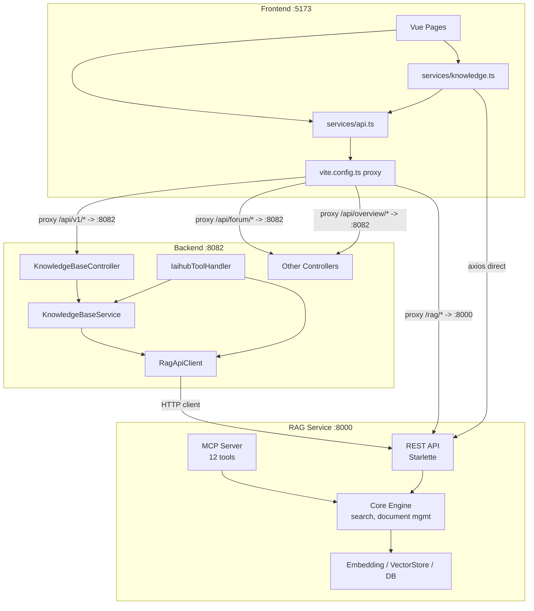

# 三服务调用关系图

```mermaid
flowchart TB
    subgraph FE[Frontend :5173]
        direction LR
        F1[Vue Pages]
        F2[services/api.ts]
        F3[services/knowledge.ts]
        F4[vite.config.ts proxy]
    end

    subgraph BE[Backend :8082]
        direction LR
        B1[KnowledgeBaseController]
        B2[KnowledgeBaseService]
        B3[RagApiClient]
        B4[IaihubToolHandler]
        B5[Other Controllers]
    end

    subgraph RAG[RAG Service :8000]
        direction LR
        R1[MCP Server<br/>12 tools]
        R2[REST API<br/>Starlette]
        R3[Core Engine<br/>search, document mgmt]
        R4[Embedding / VectorStore / DB]
    end

    F1 --> F2
    F1 --> F3
    F3 --> F2
    F2 --> F4
    F4 -->|proxy /api/v1/* -> :8082| B1
    F4 -->|proxy /api/forum/* -> :8082| B5
    F4 -->|proxy /api/overview/* -> :8082| B5
    F4 -->|proxy /rag/* -> :8000| R2

    F3 -->|axios direct| R2

    B1 --> B2
    B2 --> B3
    B4 --> B2
    B4 --> B3

    B3 -->|HTTP client| R2

    R2 --> R3
    R1 --> R3
    R3 --> R4
```
