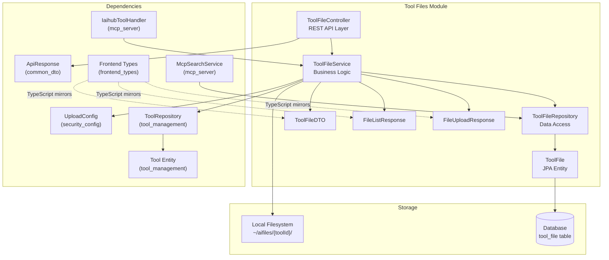
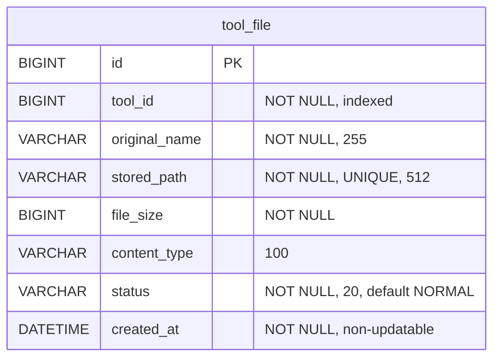
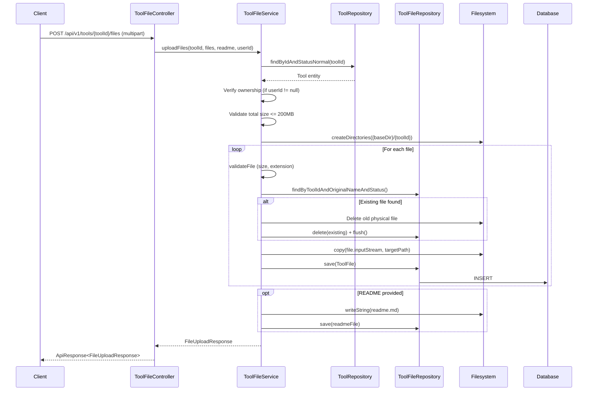
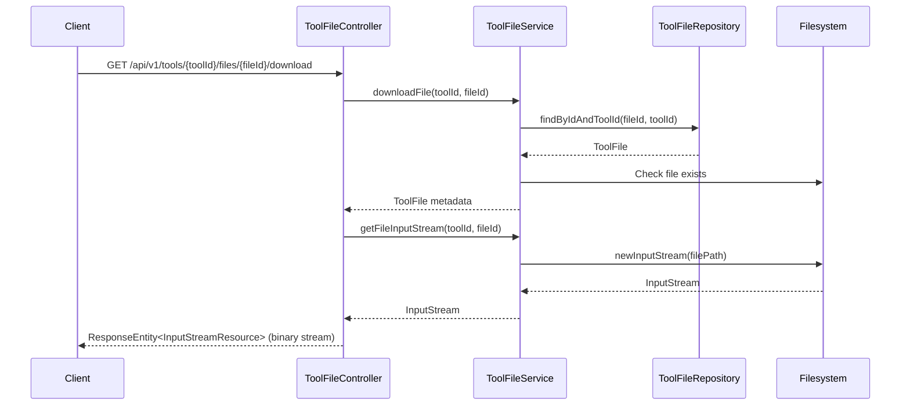
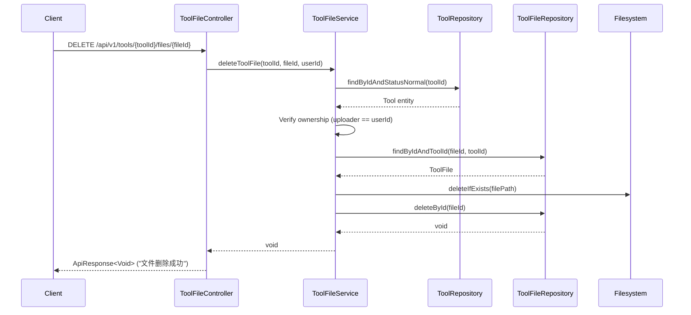
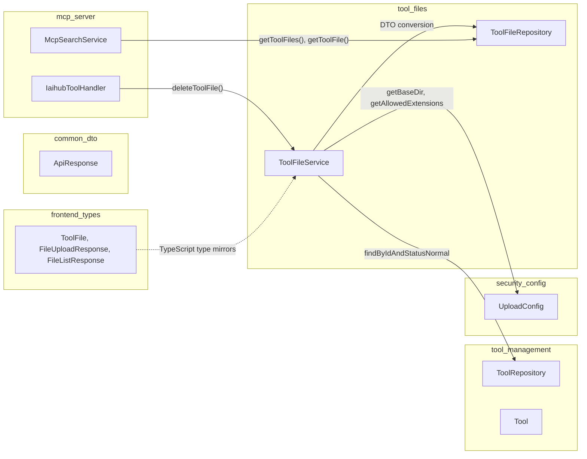
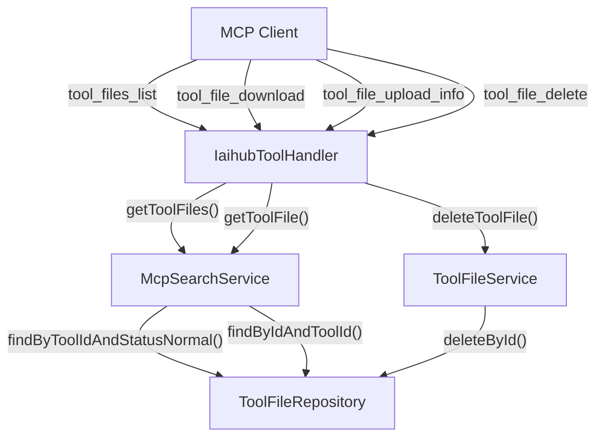

# Tool Files Module

## Introduction

The **Tool Files** module provides file attachment management for tools in the IAIHub Toolbox platform. It handles the complete lifecycle of tool-associated files — including multi-file uploads (with optional README), file listing, secure downloads, deletion, and bulk cleanup when a tool is removed. Files are stored on the local filesystem organized by tool ID, while metadata is persisted in the database via JPA. The module also serves as a core data provider for the [mcp_server](mcp_server.md) module, enabling MCP (Model Context Protocol) clients to discover, download, and manage tool files programmatically.

---

## Architecture Overview



The module follows a standard layered architecture: **Controller → Service → Repository**, with the filesystem acting as a secondary persistence layer alongside the database.

---

## Core Components

### 1. ToolFileController

**File:** `backend/src/main/java/com/iaihub/toolbox/controller/ToolFileController.java`

The REST controller exposes file management endpoints scoped under each tool. All routes are nested under `/api/v1/tools/{toolId}/files`.

| HTTP Method | Path | Description | Auth Required |
|---|---|---|---|
| `POST` | `/api/v1/tools/{toolId}/files` | Upload one or more files (multipart) with optional README | Optional (owner check enforced in service) |
| `GET` | `/api/v1/tools/{toolId}/files` | List all files for a tool | No |
| `DELETE` | `/api/v1/tools/{toolId}/files/{fileId}` | Delete a specific file | Yes (owner only) |
| `GET` | `/api/v1/tools/{toolId}/files/{fileId}/download` | Download a file as a binary stream | No |

**Key design decisions:**
- The upload endpoint accepts `@AuthenticationPrincipal User` with `expression = "null"`, allowing anonymous uploads (used by MCP clients that authenticate separately). Ownership is enforced inside the service layer when a `userId` is present.
- The download endpoint returns a `ResponseEntity<InputStreamResource>` with proper `Content-Disposition`, `Content-Type`, and `Content-Length` headers for browser-compatible file downloads.

### 2. ToolFileService

**File:** `backend/src/main/java/com/iaihub/toolbox/service/ToolFileService.java`

The service layer contains all business logic for file operations. It coordinates between the database (`ToolFileRepository`), the filesystem (via `UploadConfig.getBaseDir()`), and ownership checks (via `ToolRepository`).

#### Methods

| Method | Transaction | Description |
|---|---|---|
| `uploadFiles(toolId, files, readme, userId)` | `@Transactional` | Validates ownership & size limits, creates the tool folder, saves each file to disk + DB, optionally writes a `readme.md` |
| `getToolFiles(toolId)` | `@Transactional(readOnly)` | Returns all NORMAL-status files plus a `readmeExists` flag |
| `downloadFile(toolId, fileId)` | `@Transactional(readOnly)` | Fetches file metadata and verifies physical existence |
| `getFileInputStream(toolId, fileId)` | `@Transactional(readOnly)` | Opens an `InputStream` to the physical file |
| `deleteToolFile(toolId, fileId, userId)` | `@Transactional` | Verifies ownership, deletes physical file + DB record |
| `cleanupToolFiles(toolId)` | `@Transactional` | Bulk-deletes all files (physical + DB) and the tool folder — called when a tool is deleted |

#### Validation Rules

| Rule | Limit | Exception |
|---|---|---|
| Per-file size | 50 MB (`MAX_FILE_SIZE`) | `FileValidationException` |
| Total request size | 200 MB (`MAX_REQUEST_SIZE`) | `FileValidationException` |
| Empty file | Not allowed | `FileValidationException` |
| File extension whitelist | Only enforced if `UploadConfig.allowedExtensions` is non-empty | `FileValidationException` |

#### File Replacement Logic

When uploading a file whose `originalName` already exists for the same tool (status `NORMAL`), the service:
1. Deletes the old physical file from disk
2. Deletes the old DB record (with `flush()` to release the unique constraint on `stored_path`)
3. Saves the new file to disk and DB

This ensures the `stored_path` unique constraint is never violated and users can re-upload updated versions of the same file.

### 3. ToolFileRepository

**File:** `backend/src/main/java/com/iaihub/toolbox/repository/ToolFileRepository.java`

A Spring Data JPA repository extending `JpaRepository<ToolFile, Long>`.

| Method | Return Type | Description |
|---|---|---|
| `findByToolId(toolId)` | `List<ToolFile>` | All files for a tool (any status) |
| `findByToolIdAndStatusNormal(toolId)` | `List<ToolFile>` | Only NORMAL-status files (custom JPQL) |
| `findByToolIdAndOriginalNameAndStatus(toolId, name, status)` | `Optional<ToolFile>` | Lookup by name + status (used for replacement check) |
| `findByIdAndToolId(id, toolId)` | `Optional<ToolFile>` | Lookup by composite key (file ID + tool ID) |
| `deleteByToolId(toolId)` | `void` | Bulk delete all files for a tool (`@Modifying` + `@Query`) |

### 4. ToolFile (Entity)

**File:** `backend/src/main/java/com/iaihub/toolbox/model/ToolFile.java`



**Key attributes:**
- **`Status` enum** — `NORMAL` or `DELETED` (soft-delete support, though current implementation uses hard deletes)
- **`stored_path`** — Unique constraint ensures one file per path; format is `{toolId}/{originalName}`
- **`@PrePersist`** — Auto-sets `createdAt` and defaults `status` to `NORMAL`
- **Index** — `idx_tool_file_tool_id` on `tool_id` for efficient lookups

> **Note:** The `ToolFile` entity does **not** have a JPA `@ManyToOne` relationship to `Tool`. Instead, it stores `toolId` as a plain `Long` column. This is a deliberate design choice to keep file operations decoupled from the Tool entity lifecycle and avoid lazy-loading overhead.

### 5. DTOs

#### ToolFileDTO
Represents a single file's metadata in API responses. Mirrored on the frontend as the `ToolFile` TypeScript interface.

| Field | Type | Description |
|---|---|---|
| `id` | `Long` | File record ID |
| `toolId` | `Long` | Parent tool ID |
| `originalName` | `String` | Original uploaded filename |
| `storedPath` | `String` | Relative storage path (`{toolId}/{filename}`) |
| `fileSize` | `Long` | File size in bytes |
| `contentType` | `String` | MIME type |
| `createdAt` | `LocalDateTime` | Upload timestamp |

#### FileListResponse
Returned by the `GET /files` endpoint.

| Field | Type | Description |
|---|---|---|
| `toolId` | `Long` | Tool ID |
| `folderPath` | `String` | Relative folder path (`{toolId}`) |
| `files` | `List<ToolFileDTO>` | List of file metadata |
| `readmeExists` | `boolean` | Whether a `readme.md` file exists on disk |

#### FileUploadResponse
Returned by the `POST /files` endpoint.

| Field | Type | Description |
|---|---|---|
| `toolId` | `Long` | Tool ID |
| `files` | `List<ToolFileDTO>` | Metadata of successfully saved files |
| `readmeSaved` | `boolean` | Whether the README was saved |

---

## Data Flow

### File Upload Flow



### File Download Flow



### File Delete Flow



---

## Cross-Module Interactions



### Dependency Details

| Dependency Module | Component Used | Purpose |
|---|---|---|
| [security_config](security_config.md) | `UploadConfig` | Provides `baseDir` (filesystem root), `allowedExtensions` (whitelist), and size limit configuration |
| [tool_management](tool_management.md) | `ToolRepository`, `Tool` | Ownership verification — ensures only the tool uploader can upload/delete files; `Tool.getUploader().getId()` is checked against the current user |
| [common_dto](common_dto.md) | `ApiResponse<T>` | Standardized JSON response wrapper for all controller endpoints |
| [mcp_server](mcp_server.md) | `IaihubToolHandler`, `McpSearchService` | MCP integration — `IaihubToolHandler` calls `ToolFileService.deleteToolFile()` for MCP-initiated file deletion (with username/password auth); `McpSearchService` queries `ToolFileRepository` directly for file listing and lookup |
| [frontend_types](frontend_types.md) | `ToolFile`, `FileUploadResponse`, `FileListResponse` | TypeScript interfaces that mirror the backend DTOs for type-safe frontend integration |

---

## MCP Integration

The [mcp_server](mcp_server.md) module integrates with tool files in two ways:

1. **`IaihubToolHandler`** — Acts as an MCP tool handler that:
   - Lists tool files (`handleToolFiles`) via `McpSearchService.getToolFiles()`
   - Provides download info (`handleToolDownload`) — returns a REST download URL
   - Provides upload instructions (`handleToolFileUploadInfo`) — returns REST API details for the MCP client to call directly
   - Deletes files (`handleToolFileDelete`) — authenticates via username/password, then calls `ToolFileService.deleteToolFile()`

2. **`McpSearchService`** — Directly accesses `ToolFileRepository` for read operations (file listing and single-file lookup) without going through the service layer, optimizing for search/query performance.



---

## Filesystem Storage Layout

```
{UploadConfig.baseDir}/              ← defaults to ~/aifiles/
├── {toolId}/                        ← one folder per tool
│   ├── readme.md                    ← optional README (if provided during upload)
│   ├── file1.zip                    ← uploaded files retain original names
│   ├── file2.pdf
│   └── ...
├── avatars/                         ← avatar storage (user_management module)
└── ...
```

- **Base directory** is configured via `app.upload.base-dir` in `application.yml`; defaults to `~/aifiles/` if unset (see [security_config](security_config.md) for `UploadConfig` details).
- Each tool gets its own subdirectory named by `toolId`.
- Files are stored with their original filenames; the `stored_path` column in the database records the relative path (`{toolId}/{filename}`).
- The `stored_path` column has a **unique constraint**, enforced by both the database and the service-layer replacement logic.

---

## Security Considerations

| Concern | Mitigation |
|---|---|
| **Unauthorized upload** | Ownership check in `ToolFileService.uploadFiles()` — only the tool's uploader can add files (skipped for `null` userId, enabling MCP anonymous upload with separate auth) |
| **Unauthorized deletion** | Ownership check in `ToolFileService.deleteToolFile()` — verifies `tool.getUploader().getId()` matches `userId` |
| **Path traversal** | `StringUtils.cleanPath()` is applied to original filenames; files are resolved within the tool-specific folder |
| **File size abuse** | Per-file limit (50 MB) and total request limit (200 MB) enforced in `validateFile()` and `uploadFiles()` |
| **File type restriction** | Optional extension whitelist via `UploadConfig.allowedExtensions` (disabled by default — open format policy) |
| **MCP file deletion** | `IaihubToolHandler.handleToolFileDelete()` authenticates via username/password before calling `deleteToolFile()` |

---

## API Reference Summary

### Upload Files
```
POST /api/v1/tools/{toolId}/files
Content-Type: multipart/form-data

Form Fields:
  files   (required) - List<MultipartFile>
  readme  (optional) - String (markdown text)

Response: ApiResponse<FileUploadResponse>
```

### List Files
```
GET /api/v1/tools/{toolId}/files

Response: ApiResponse<FileListResponse>
```

### Delete File
```
DELETE /api/v1/tools/{toolId}/files/{fileId}
Authorization: Bearer <JWT>

Response: ApiResponse<Void>
```

### Download File
```
GET /api/v1/tools/{toolId}/files/{fileId}/download

Response: Binary stream (Content-Disposition: attachment)
```

---

## Frontend Type Mapping

The [frontend_types](frontend_types.md) module defines TypeScript interfaces that mirror the backend DTOs:

| Backend DTO | Frontend Interface | File |
|---|---|---|
| `ToolFileDTO` | `ToolFile` | `frontend/src/types/index.ts` |
| `FileUploadResponse` | `FileUploadResponse` | `frontend/src/types/index.ts` |
| `FileListResponse` | `FileListResponse` | `frontend/src/types/index.ts` |

```typescript
// frontend/src/types/index.ts
interface ToolFile {
  id: number
  toolId: number
  originalName: string
  storedPath: string
  fileSize: number
  contentType: string
  createdAt: string
}
```

---

## Cleanup & Lifecycle

The `cleanupToolFiles(toolId)` method provides bulk cleanup when a tool is deleted. It is designed to be called by the [tool_management](tool_management.md) module's `ToolService` during tool deletion. The method:

1. Fetches all files for the tool (any status)
2. Deletes each physical file from disk
3. Removes the tool's folder directory
4. Bulk-deletes all database records via `deleteByToolId()`

This ensures no orphaned files remain on disk or in the database after a tool is removed.
