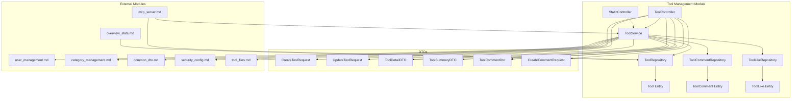
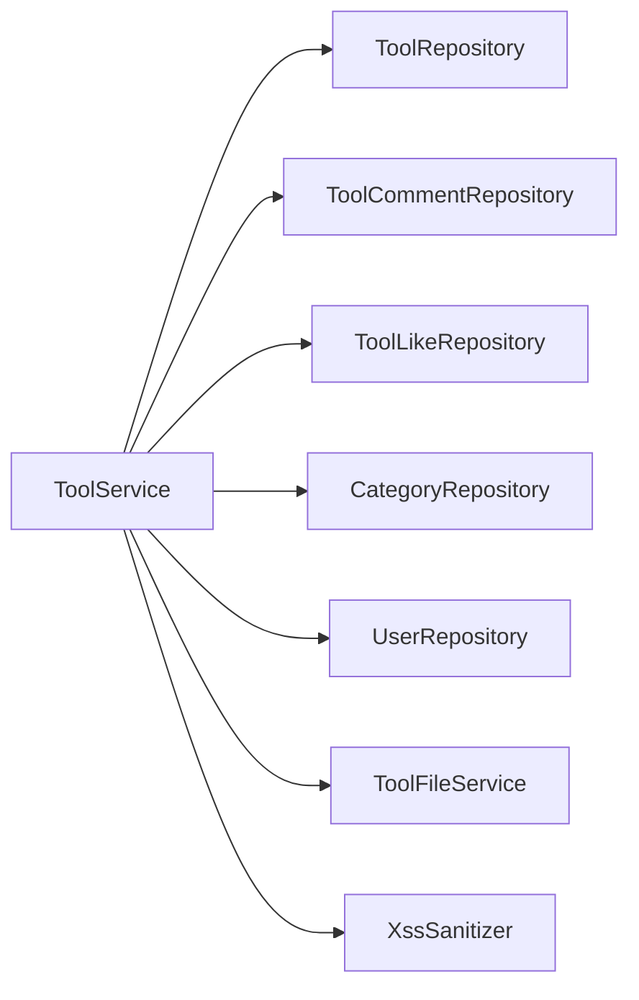
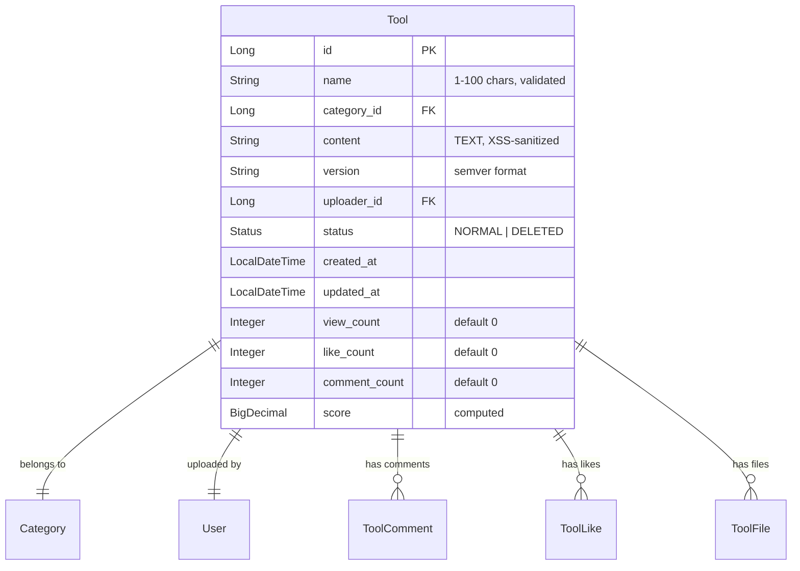
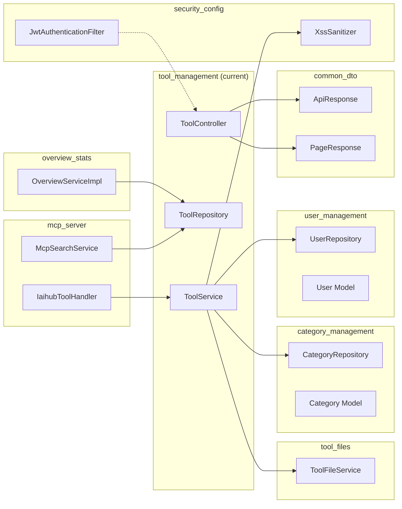
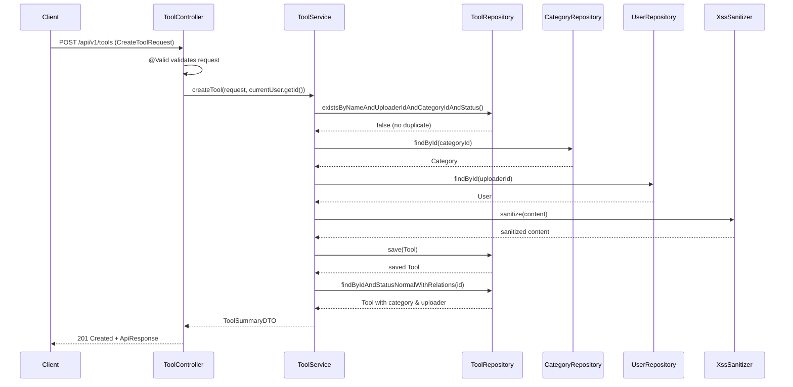
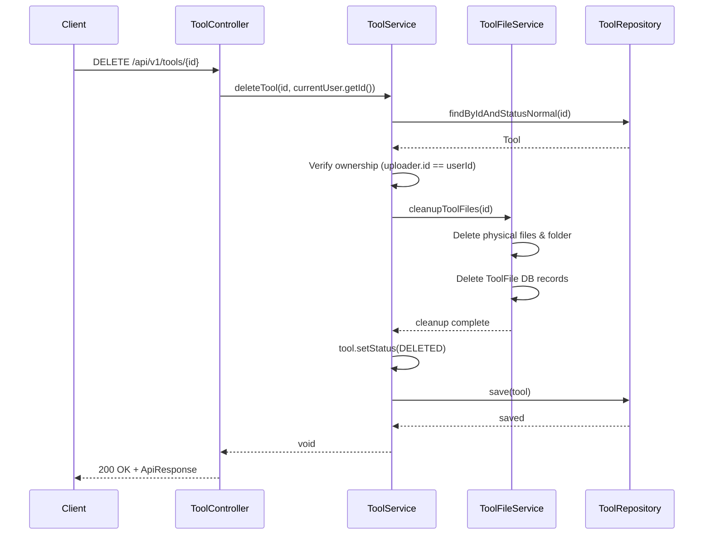
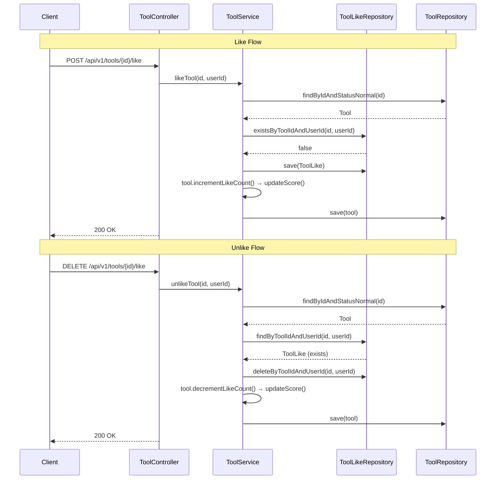
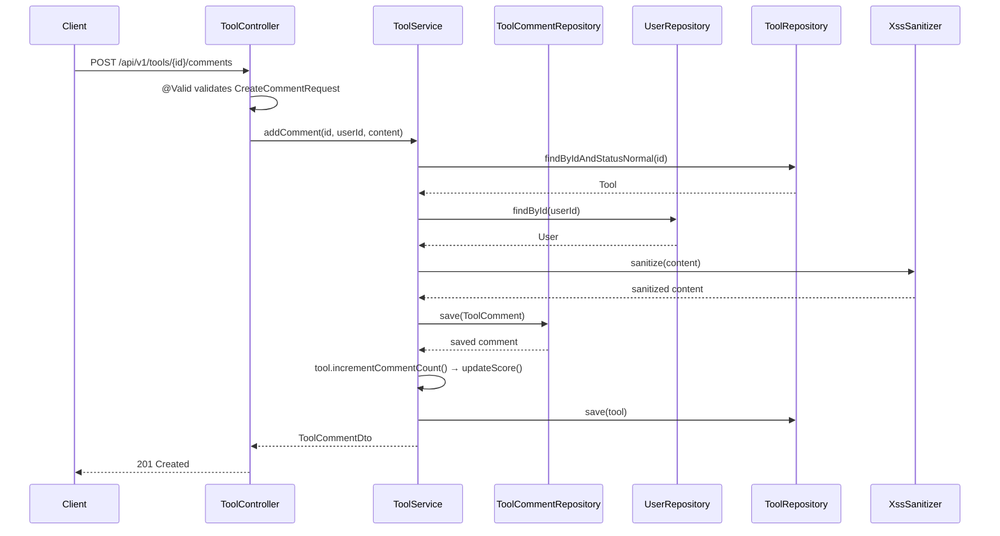
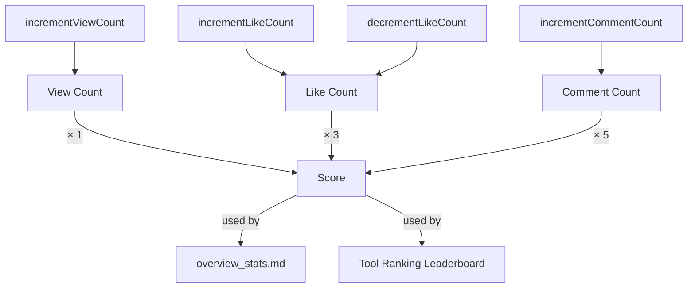
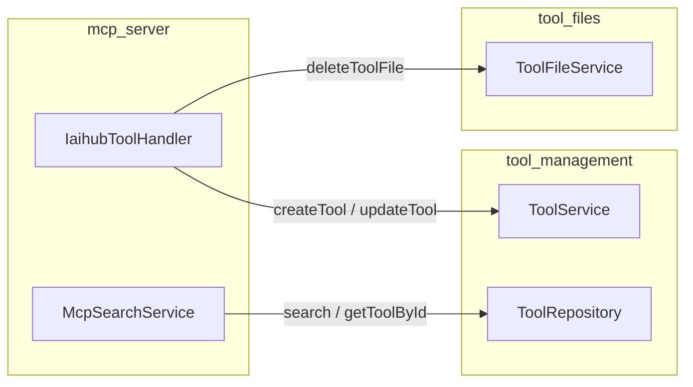

# Tool Management Module

## Introduction

The **Tool Management** module is the core content management subsystem of the IAIHub Toolbox platform. It provides full lifecycle management for "tools" — software packages, utilities, or resources that users upload, categorize, and share with the community. The module encompasses tool creation, retrieval, update, deletion (soft-delete), social interactions (likes and comments), and serves as the primary data source for the MCP (Model Context Protocol) server and overview statistics dashboards.

This module follows a classic layered architecture: **Controller → Service → Repository → Model**, with dedicated DTOs for request validation and response shaping.

---

## Architecture Overview



---

## Component Reference

### Controllers

#### ToolController

The primary REST controller exposing all tool-related endpoints under `/api/v1/tools`. It delegates entirely to `ToolService` and wraps responses in `ApiResponse<T>` (see [common_dto.md](common_dto.md)).

| Method | Endpoint | Description | Auth Required |
|--------|----------|-------------|---------------|
| `GET` | `/api/v1/tools` | Paginated tool listing with filtering & sorting | No |
| `GET` | `/api/v1/tools/{id}` | Get detailed tool information | No |
| `POST` | `/api/v1/tools` | Create a new tool | Yes |
| `PUT` | `/api/v1/tools/{id}` | Update an existing tool (owner only) | Yes |
| `DELETE` | `/api/v1/tools/{id}` | Soft-delete a tool (owner only) | Yes |
| `POST` | `/api/v1/tools/{id}/like` | Like a tool | Yes |
| `DELETE` | `/api/v1/tools/{id}/like` | Unlike a tool | Yes |
| `GET` | `/api/v1/tools/{id}/like-status` | Check if current user liked a tool | Optional |
| `POST` | `/api/v1/tools/{id}/comments` | Add a comment to a tool | Yes |
| `GET` | `/api/v1/tools/{id}/comments` | List all comments for a tool | No |

**Query Parameters for Listing (`GET /api/v1/tools`):**

| Parameter | Type | Default | Description |
|-----------|------|---------|-------------|
| `categoryId` | Long | `null` | Filter by category |
| `keyword` | String | `null` | Search by tool name (LIKE match) |
| `sortBy` | String | `latest` | `latest` (by createdAt DESC) or `name` (alphabetical) |
| `page` | int | `0` | Zero-based page index |
| `size` | int | `12` | Page size (capped at 100) |

#### StaticController

A lightweight controller under `/api/v1` that serves the project README as Markdown. It first attempts to load from `classpath:static/README.md`, then falls back to a filesystem path. This controller is independent of the tool service layer and exists to provide static content to the frontend.

---

### Service Layer

#### ToolService

The central business logic component for all tool operations. It is annotated with `@Service` and uses constructor injection via Lombok's `@RequiredArgsConstructor`.

**Key Responsibilities:**

1. **Tool CRUD** — Create, read, update, and soft-delete tools with ownership validation
2. **Duplicate Prevention** — Enforces uniqueness of tool name per uploader per category
3. **XSS Protection** — Sanitizes all user-supplied content via `XssSanitizer` (see [security_config.md](security_config.md))
4. **Social Interactions** — Manages likes (with idempotency) and comments
5. **Engagement Scoring** — Delegates score recalculation to the `Tool` entity's `updateScore()` method
6. **File Cleanup** — Coordinates with `ToolFileService` (see [tool_files.md](tool_files.md)) to remove physical files before soft-deletion
7. **DTO Mapping** — Converts `Tool` entities to `ToolSummaryDTO` and `ToolDetailDTO` with explicit Hibernate initialization for lazy-loaded relations

**Dependency Injection Map:**



**Core Methods:**

| Method | Transaction | Description |
|--------|-------------|-------------|
| `getTools(categoryId, keyword, sortBy, page, size)` | `readOnly` | Paginated listing with filters |
| `getToolById(id)` | `readOnly` | Fetch single tool by ID (NORMAL status only) |
| `createTool(request, uploaderId)` | Read-Write | Create tool with duplicate check & XSS sanitization |
| `updateTool(id, request, userId)` | Read-Write | Partial update with ownership check & duplicate validation |
| `deleteTool(id, userId)` | Read-Write | Soft-delete (status → DELETED) with file cleanup |
| `likeTool(toolId, userId)` | Read-Write | Idempotent like with counter increment |
| `unlikeTool(toolId, userId)` | Read-Write | Remove like with counter decrement |
| `isLikedByUser(toolId, userId)` | Read-Write | Check like existence |
| `incrementViewCount(toolId)` | Read-Write | Increment views & recalculate score |
| `addComment(toolId, userId, content)` | Read-Write | Add comment with XSS sanitization & counter increment |
| `getComments(toolId)` | `readOnly` | List comments ordered by createdAt DESC |
| `getMyTools(uploaderId, categoryId, keyword, sortBy, page, size)` | `readOnly` | Paginated listing filtered by uploader |

---

### Repository Layer

#### ToolRepository

Extends `JpaRepository<Tool, Long>` with custom JPQL queries and Spring Data derived methods.

| Method | Return Type | Description |
|--------|-------------|-------------|
| `findByFilters(categoryId, keyword, pageable)` | `Page<Tool>` | Filtered listing ordered by `createdAt DESC` |
| `findByFiltersOrderByName(categoryId, keyword, pageable)` | `Page<Tool>` | Filtered listing ordered by `name ASC` |
| `findByIdAndStatusNormal(id)` | `Optional<Tool>` | Fetch by ID where status = NORMAL |
| `findByIdAndStatusNormalWithRelations(id)` | `Optional<Tool>` | Fetch by ID with JOIN FETCH on category & uploader |
| `findByUploaderIdAndFilters(uploaderId, categoryId, keyword, pageable)` | `Page<Tool>` | Uploader-specific filtered listing |
| `existsByNameAndUploaderIdAndCategoryIdAndStatus(...)` | `boolean` | Duplicate name check for creation |
| `existsByNameAndUploaderIdAndCategoryIdAndStatusAndIdNot(...)` | `boolean` | Duplicate name check for updates (excludes self) |
| `findApprovedToolsWithCategory(keyword, pageable)` | `List<Tool>` | MCP search with category JOIN FETCH |
| `findTop10ByStatusAndNameContainingIgnoreCase(...)` | `List<Tool>` | Top 10 keyword search (MCP) |
| `findTop10ByStatusOrderByCreatedAtDesc(...)` | `List<Tool>` | Top 10 latest tools (MCP) |
| `countByStatus(status)` | `long` | Count by status (used by overview stats) |

#### ToolCommentRepository

Simple repository extending `JpaRepository<ToolComment, Long>`:

| Method | Return Type | Description |
|--------|-------------|-------------|
| `findByToolIdOrderByCreatedAtDesc(toolId)` | `List<ToolComment>` | All comments for a tool, newest first |

#### ToolLikeRepository

Extends `JpaRepository<ToolLike, Long>` with like-specific queries:

| Method | Return Type | Description |
|--------|-------------|-------------|
| `existsByToolIdAndUserId(toolId, userId)` | `boolean` | Check if a like exists |
| `findByToolIdAndUserId(toolId, userId)` | `Optional<ToolLike>` | Find a specific like record |
| `deleteByToolIdAndUserId(toolId, userId)` | `void` | Remove a like record |

---

### Data Models (Entities)

#### Tool

The primary entity representing a tool in the system.



**Database Indexes:**

| Index Name | Columns | Purpose |
|------------|---------|---------|
| `idx_tool_category` | `category_id, status` | Category-filtered queries |
| `idx_tool_uploader` | `uploader_id, status` | Uploader-filtered queries |
| `idx_tool_name_status` | `name, status` | Name search & duplicate checks |
| `idx_tool_version` | `version` | Version-based lookups |

**Unique Constraint:** `uk_tool_uploader_name_category` on `(uploader_id, name, category_id, status)` — prevents duplicate tool names per user per category.

**Status Enum:**

| Value | Description |
|-------|-------------|
| `NORMAL` | Active, visible tool |
| `DELETED` | Soft-deleted, hidden from listings |

**Scoring Algorithm:**

The `Tool` entity maintains a computed `score` field that is automatically recalculated whenever view, like, or comment counts change:

```
score = viewCount × 1 + likeCount × 3 + commentCount × 5
```

This score is used by the [overview_stats.md](overview_stats.md) module for tool ranking leaderboards.

**Lifecycle Callbacks:**

- `@PrePersist` — Sets `createdAt`, `updatedAt`, and defaults `status` to `NORMAL`
- `@PreUpdate` — Updates `updatedAt`

#### ToolComment

Stores user comments on tools. Uses plain Long foreign keys (`toolId`, `userId`) rather than JPA relations for simplicity and performance.

| Field | Type | Description |
|-------|------|-------------|
| `id` | `Long` | Primary key |
| `toolId` | `Long` | FK to Tool (indexed) |
| `userId` | `Long` | FK to User |
| `content` | `String (TEXT)` | XSS-sanitized comment text |
| `createdAt` | `LocalDateTime` | Set via `@PrePersist` |

#### ToolLike

Records user likes on tools. Enforces uniqueness via `uk_tool_like_tool_user` constraint on `(tool_id, user_id)`.

| Field | Type | Description |
|-------|------|-------------|
| `id` | `Long` | Primary key |
| `toolId` | `Long` | FK to Tool |
| `userId` | `Long` | FK to User |
| `createdAt` | `LocalDateTime` | Set via `@PrePersist` |

---

### DTOs

#### Request DTOs

**CreateToolRequest** — Validated request for tool creation:

| Field | Type | Validation |
|-------|------|------------|
| `name` | `String` | `@NotBlank`, 1-100 chars, alphanumeric/Chinese/`_`/`-` only |
| `categoryId` | `Long` | `@NotNull` |
| `content` | `String` | `@NotBlank`, max 5000 chars |
| `version` | `String` | `@NotBlank`, semver pattern `^\d+\.\d+\.\d+(-[a-zA-Z0-9]+)?$` |

**UpdateToolRequest** — Partial update request (all fields optional):

| Field | Type | Validation |
|-------|------|------------|
| `name` | `String` | 1-100 chars, same pattern as create |
| `categoryId` | `Long` | Optional |
| `content` | `String` | Max 5000 chars |
| `version` | `String` | Semver pattern |

**CreateCommentRequest** — Comment creation:

| Field | Type | Validation |
|-------|------|------------|
| `content` | `String` | `@NotBlank` |

#### Response DTOs

**ToolSummaryDTO** — Lightweight representation for list views:

| Field | Type |
|-------|------|
| `id` | `Long` |
| `name` | `String` |
| `version` | `String` |
| `categoryName` | `String` |
| `categoryIcon` | `String` |
| `uploaderUsername` | `String` |
| `uploaderNickname` | `String` |
| `createdAt` | `LocalDateTime` |

**ToolDetailDTO** — Full detail representation:

| Field | Type |
|-------|------|
| `id` | `Long` |
| `name` | `String` |
| `version` | `String` |
| `categoryName` | `String` |
| `categoryIcon` | `String` |
| `content` | `String` |
| `uploaderId` | `Long` |
| `uploaderUsername` | `String` |
| `uploaderNickname` | `String` |
| `createdAt` | `LocalDateTime` |
| `updatedAt` | `LocalDateTime` |
| `viewCount` | `Integer` |
| `likeCount` | `Integer` |
| `commentCount` | `Integer` |
| `score` | `BigDecimal` |

**ToolCommentDto** — Comment representation:

| Field | Type |
|-------|------|
| `id` | `Long` |
| `content` | `String` |
| `username` | `String` |
| `createdAt` | `LocalDateTime` |

---

## Cross-Module Dependencies



### Dependency Summary

| Dependency Module | Components Used | Purpose |
|-------------------|-----------------|---------|
| [user_management.md](user_management.md) | `UserRepository`, `User` | Resolve uploader identity, comment author names |
| [category_management.md](category_management.md) | `CategoryRepository`, `Category` | Validate and associate tools with categories |
| [common_dto.md](common_dto.md) | `ApiResponse`, `PageResponse` | Standardized API response wrapping & pagination |
| [security_config.md](security_config.md) | `XssSanitizer`, `JwtAuthenticationFilter` | XSS content sanitization, JWT-based authentication |
| [tool_files.md](tool_files.md) | `ToolFileService` | File cleanup on tool deletion |
| [mcp_server.md](mcp_server.md) | `IaihubToolHandler`, `McpSearchService` | MCP protocol integration for AI tool access |
| [overview_stats.md](overview_stats.md) | `OverviewServiceImpl` | Tool count statistics & score-based rankings |

---

## Key Process Flows

### Tool Creation Flow



### Tool Deletion Flow (Soft Delete with File Cleanup)



### Like / Unlike Flow



### Comment Flow



---

## Scoring & Engagement Model

The `Tool` entity implements a weighted engagement scoring system that is automatically maintained through counter methods:



Each counter method (`incrementViewCount`, `incrementLikeCount`, `decrementLikeCount`, `incrementCommentCount`) automatically calls `updateScore()` to keep the `score` field in sync. The score is consumed by the [overview_stats.md](overview_stats.md) module to generate per-category tool ranking leaderboards (top 5 by score).

---

## Security Considerations

### XSS Protection

All user-supplied text content (tool content, comments) is sanitized through `XssSanitizer.sanitize()` before persistence. The sanitizer:

1. Escapes all HTML4 special characters using Apache Commons `StringEscapeUtils.escapeHtml4()`
2. Removes `javascript:` protocol patterns
3. Removes inline event handler patterns (`on\w+=`)

See [security_config.md](security_config.md) for full sanitizer details.

### Ownership Enforcement

- **Update/Delete**: `ToolService` verifies `tool.getUploader().getId().equals(userId)` before allowing modifications. Non-owners receive a `ForbiddenException`.
- **Like/Comment**: Any authenticated user can like or comment on any NORMAL-status tool.

### Authentication

All mutating endpoints require JWT authentication, enforced by `JwtAuthenticationFilter` (see [security_config.md](security_config.md)). The authenticated `User` principal is injected via `@AuthenticationPrincipal`.

### Soft Delete Pattern

Tools are never physically deleted from the database. Instead, `status` is set to `DELETED`, and all queries filter on `status = 'NORMAL'`. This preserves referential integrity for historical comments and likes while hiding deleted content from users.

---

## MCP Server Integration

The [mcp_server.md](mcp_server.md) module provides AI assistants with access to tools through the Model Context Protocol. Two components interact with the tool_management module:

- **`IaihubToolHandler`** — Calls `ToolService.createTool()`, `ToolService.updateTool()` for MCP-initiated tool creation/modification. Uses credential-based authentication (username/password passed by MCP client).
- **`McpSearchService`** — Directly queries `ToolRepository` for tool search (`findApprovedToolsWithCategory`), detail retrieval (`findByIdAndStatusNormalWithRelations`), and file listing.



---

## Frontend Type Mapping

The frontend TypeScript types (see [frontend_types](#)) mirror the backend DTOs:

| Backend DTO | Frontend Type | File |
|-------------|---------------|------|
| `ToolDetailDTO` | `ToolDetailDTO` / `ToolDetail` | `frontend/src/types/tool.ts`, `frontend/src/types/index.ts` |
| `ToolSummaryDTO` | `ToolSummary` | `frontend/src/types/tool.ts`, `frontend/src/types/index.ts` |
| `CreateToolRequest` | `CreateToolRequest` | `frontend/src/types/index.ts` |
| `UpdateToolRequest` | `UpdateToolRequest` | `frontend/src/types/index.ts` |
| `ToolCommentDto` | `Comment` | `frontend/src/services/tool.ts` |
| `ApiResponse` | `ApiResponse` | `frontend/src/types/index.ts` |
| `PageResponse` | `PageResponse` | `frontend/src/types/index.ts` |

---

## API Response Envelope

All endpoints return responses wrapped in `ApiResponse<T>` (see [common_dto.md](common_dto.md)):

```json
{
  "code": 200,
  "message": "success",
  "data": { ... }
}
```

Paginated endpoints return `ApiResponse<PageResponse<T>>`:

```json
{
  "code": 200,
  "message": "success",
  "data": {
    "content": [ ... ],
    "totalElements": 42,
    "totalPages": 4,
    "page": 0,
    "size": 12
  }
}
```
