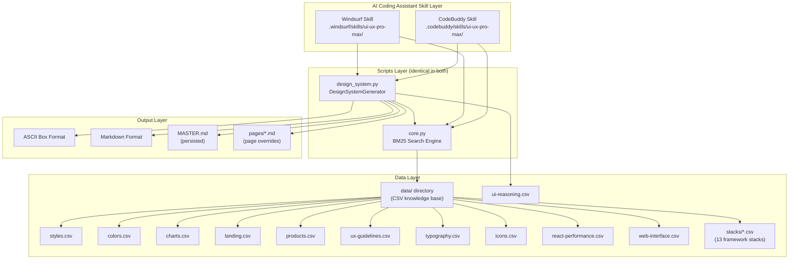
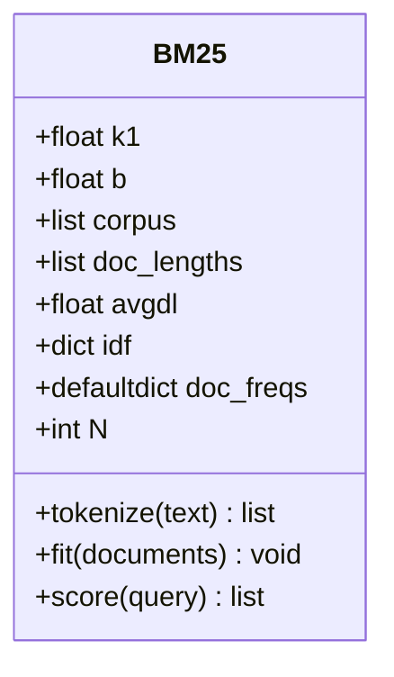
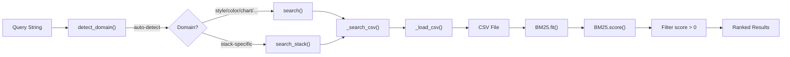
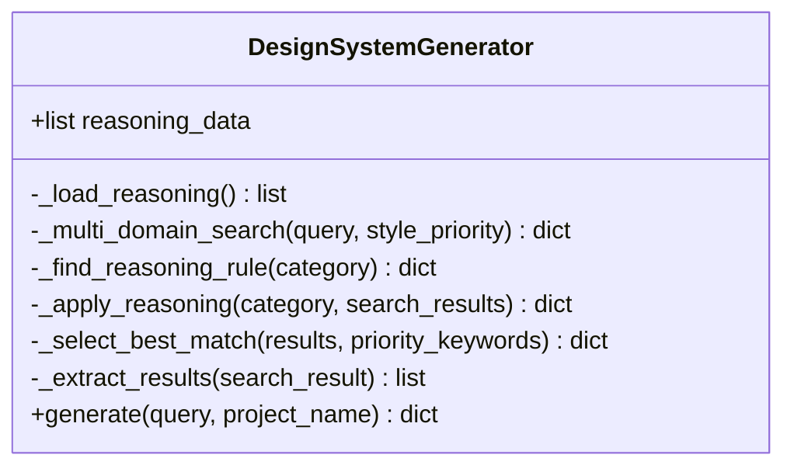
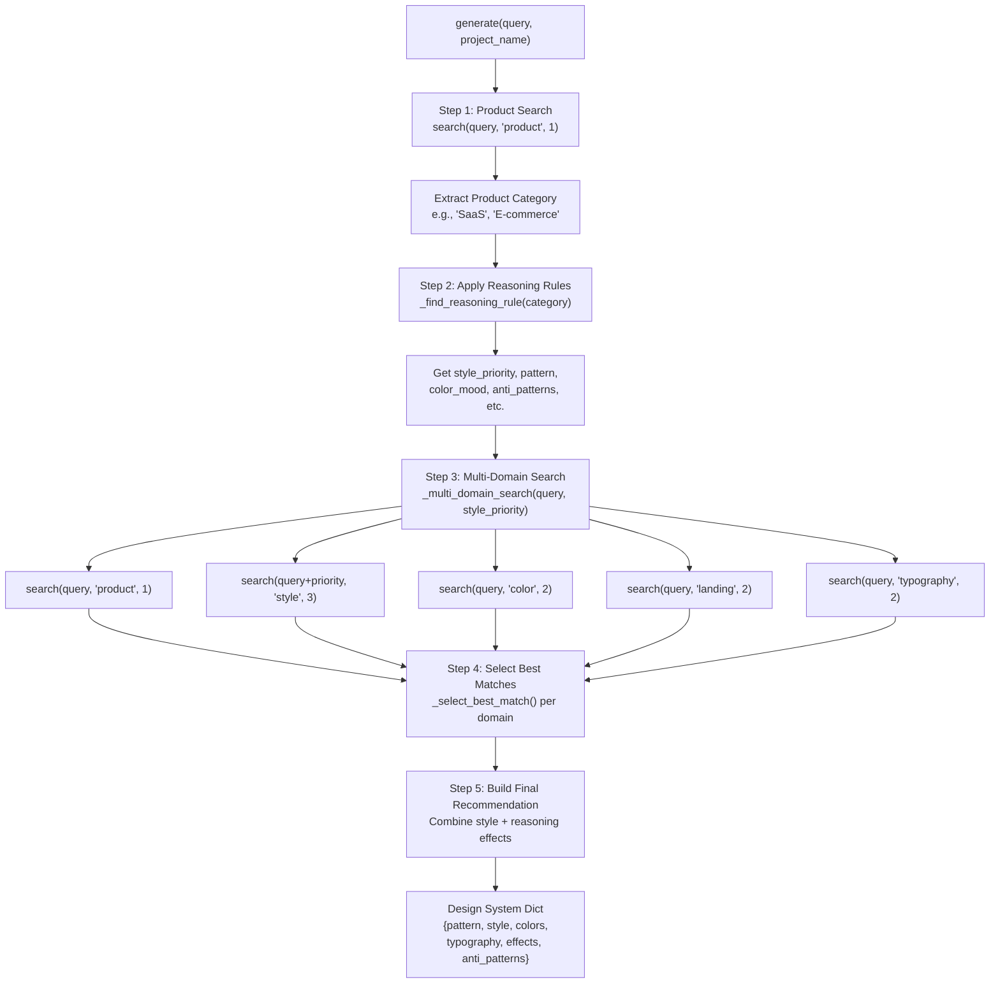
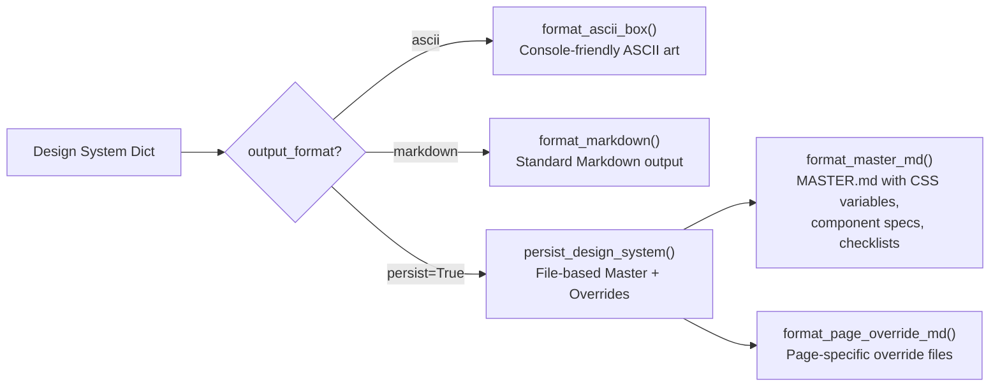
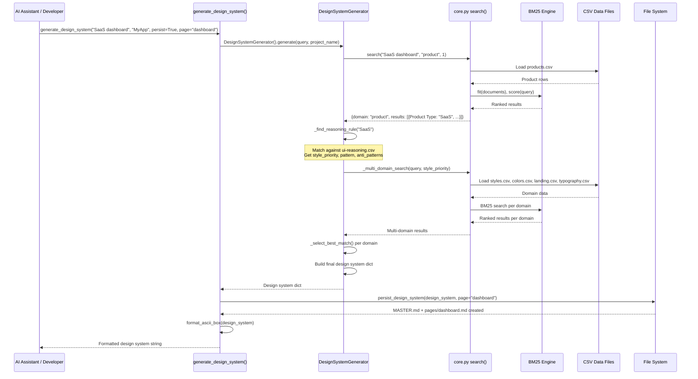
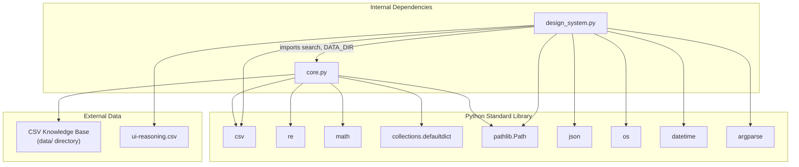
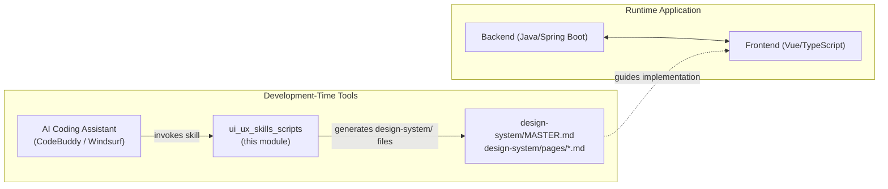

# UI/UX Skills Scripts Module

## Introduction

The **ui_ux_skills_scripts** module is a Python-based design intelligence engine that powers the "UI/UX Pro Max" skill for AI coding assistants. It provides a BM25-powered search system over a curated CSV knowledge base of UI/UX design guidelines, and a `DesignSystemGenerator` that aggregates multi-domain search results—applying reasoning rules—to produce comprehensive, ready-to-use design system recommendations.

The module is deployed as an AI assistant skill in two parallel locations:

| Location | Target Assistant |
|---|---|
| `.codebuddy/skills/ui-ux-pro-max/scripts/` | CodeBuddy |
| `.windsurf/skills/ui-ux-pro-max/scripts/` | Windsurf |

Both copies are **identical** in functionality. The duplication exists solely to register the skill with each respective AI coding assistant's skill discovery mechanism.

---

## Architecture Overview



---

## Core Components

### 1. BM25 Search Engine (`core.py`)

The `BM25` class implements the **Okapi BM25** ranking algorithm—a probabilistic text retrieval model that ranks documents by relevance to a given query. It is the foundational search primitive for the entire module.

#### BM25 Algorithm Parameters

| Parameter | Default | Description |
|---|---|---|
| `k1` | 1.5 | Term frequency saturation control. Higher values give more weight to repeated terms. |
| `b` | 0.75 | Document length normalization. 1.0 = full normalization, 0.0 = no normalization. |

#### BM25 Class Methods



**`tokenize(text)`** — Normalizes text by lowercasing, removing punctuation via regex (`[^\w\s]`), splitting on whitespace, and filtering tokens shorter than 3 characters.

**`fit(documents)`** — Builds the BM25 index:
1. Tokenizes all documents into the corpus
2. Computes document lengths and average document length (`avgdl`)
3. Builds document frequency (`doc_freqs`) counts per unique term
4. Computes Inverse Document Frequency (IDF) for each term using: `idf = log((N - freq + 0.5) / (freq + 0.5) + 1)`

**`score(query)`** — Scores all documents against the query and returns a list of `(index, score)` tuples sorted by descending score. The scoring formula per term:

```
score = idf * (tf * (k1 + 1)) / (tf + k1 * (1 - b + b * doc_len / avgdl))
```

---

### 2. Search Functions (`core.py`)

The search layer wraps the BM25 engine with domain-aware configuration and CSV data loading.



#### Domain Configuration (`CSV_CONFIG`)

The module supports **10 search domains**, each mapped to a CSV file with specific search and output columns:

| Domain | CSV File | Search Columns | Purpose |
|---|---|---|---|
| `style` | `styles.csv` | Style Category, Keywords, Best For, Type, AI Prompt Keywords | Visual design styles (Minimalism, Glassmorphism, etc.) |
| `color` | `colors.csv` | Product Type, Notes | Color palettes by product type |
| `chart` | `charts.csv` | Data Type, Keywords, Best Chart Type, Accessibility Notes | Data visualization recommendations |
| `landing` | `landing.csv` | Pattern Name, Keywords, Conversion Optimization, Section Order | Landing page layout patterns |
| `product` | `products.csv` | Product Type, Keywords, Primary Style Recommendation, Key Considerations | Product-type design guidance |
| `ux` | `ux-guidelines.csv` | Category, Issue, Description, Platform | UX best practices with Do/Don't |
| `typography` | `typography.csv` | Font Pairing Name, Category, Mood/Style Keywords, Best For, Heading Font, Body Font | Font pairing recommendations |
| `icons` | `icons.csv` | Category, Icon Name, Keywords, Best For | Icon library recommendations |
| `react` | `react-performance.csv` | Category, Issue, Keywords, Description | React performance guidelines |
| `web` | `web-interface.csv` | Category, Issue, Keywords, Description | Web accessibility/interface guidelines |

#### Stack Configuration (`STACK_CONFIG`)

The module supports **13 technology stacks** with framework-specific guidelines:

| Stack | CSV File |
|---|---|
| `html-tailwind` | `stacks/html-tailwind.csv` |
| `react` | `stacks/react.csv` |
| `nextjs` | `stacks/nextjs.csv` |
| `astro` | `stacks/astro.csv` |
| `vue` | `stacks/vue.csv` |
| `nuxtjs` | `stacks/nuxtjs.csv` |
| `nuxt-ui` | `stacks/nuxt-ui.csv` |
| `svelte` | `stacks/svelte.csv` |
| `swiftui` | `stacks/swiftui.csv` |
| `react-native` | `stacks/react-native.csv` |
| `flutter` | `stacks/flutter.csv` |
| `shadcn` | `stacks/shadcn.csv` |
| `jetpack-compose` | `stacks/jetpack-compose.csv` |

All stacks share a common column schema (`_STACK_COLS`): Category, Guideline, Description, Do, Don't, Code Good, Code Bad, Severity, Docs URL.

#### Domain Auto-Detection (`detect_domain`)

When no explicit domain is provided, the `detect_domain()` function performs keyword-based scoring against the query string. Each domain has a set of trigger keywords (e.g., `"color"`, `"palette"`, `"hex"` → `color` domain). The domain with the highest keyword match count wins; if no matches are found, it defaults to `"style"`.

#### Key Functions

| Function | Signature | Description |
|---|---|---|
| `_load_csv(filepath)` | `Path → list[dict]` | Loads a CSV file into a list of dictionaries using `csv.DictReader` |
| `_search_csv(filepath, search_cols, output_cols, query, max_results)` | `→ list[dict]` | Core search: builds documents from `search_cols`, runs BM25, returns top results with `output_cols` |
| `detect_domain(query)` | `str → str` | Auto-detects the most relevant domain from query keywords |
| `search(query, domain, max_results)` | `→ dict` | Main search entry point with auto-domain detection; returns domain, query, file, count, and results |
| `search_stack(query, stack, max_results)` | `→ dict` | Searches stack-specific guidelines |

---

### 3. DesignSystemGenerator (`design_system.py`)

The `DesignSystemGenerator` class is the orchestration engine that produces holistic design system recommendations by aggregating searches across multiple domains and applying reasoning rules.



#### Generation Pipeline



#### Reasoning Rule Matching (`_find_reasoning_rule`)

The reasoning engine uses a **three-tier matching strategy** to find the best rule from `ui-reasoning.csv`:

1. **Exact match** — Direct string comparison of `UI_Category` field
2. **Partial match** — Bidirectional substring containment
3. **Keyword match** — Splits category on `/` and `-`, checks if any keyword appears in the category

If no rule is found, a **default fallback** is returned with safe defaults (Minimalism + Flat Design style priority, "Hero + Features + CTA" pattern, MEDIUM severity).

#### Best Match Selection (`_select_best_match`)

When multiple results are returned from a domain search, the best match is selected using a **priority-weighted scoring algorithm**:

| Match Type | Score Weight |
|---|---|
| Exact style name match | Direct return (highest priority) |
| Style Category field match | +10 points |
| Keywords field match | +3 points |
| Any other field match | +1 point |

If no priority keywords score above 0, the first result (highest BM25 score) is returned.

#### Output Structure

The `generate()` method returns a dictionary with the following structure:

```python
{
    "project_name": str,          # Project name or uppercased query
    "category": str,              # Detected product category
    "pattern": {
        "name": str,              # Landing page pattern name
        "sections": str,          # Section order (e.g., "Hero > Features > CTA")
        "cta_placement": str,     # Primary CTA placement guidance
        "color_strategy": str,    # Color strategy for the pattern
        "conversion": str         # Conversion optimization notes
    },
    "style": {
        "name": str,              # Design style name
        "type": str,              # Style type classification
        "effects": str,           # Effects & animation guidance
        "keywords": str,          # Style keywords
        "best_for": str,          # Best use cases
        "performance": str,       # Performance considerations
        "accessibility": str      # Accessibility notes
    },
    "colors": {
        "primary": str,           # Primary hex color
        "secondary": str,         # Secondary hex color
        "cta": str,               # CTA/accent hex color
        "background": str,        # Background hex color
        "text": str,              # Text hex color
        "notes": str              # Color usage notes
    },
    "typography": {
        "heading": str,           # Heading font name
        "body": str,              # Body font name
        "mood": str,              # Mood/style keywords
        "best_for": str,          # Best use cases
        "google_fonts_url": str,  # Google Fonts import URL
        "css_import": str         # CSS @import statement
    },
    "key_effects": str,           # Combined effects guidance
    "anti_patterns": str,         # Patterns to avoid
    "decision_rules": dict,       # Parsed JSON decision rules
    "severity": str               # Severity level (LOW/MEDIUM/HIGH)
}
```

---

### 4. Output Formatters (`design_system.py`)

The module provides three output formatting strategies:

#### Format Comparison



#### ASCII Box Format (`format_ascii_box`)

Produces a fixed-width (90 characters) ASCII art box suitable for terminal/console output. Includes sections for: Pattern, Style, Colors, Typography, Key Effects, Anti-patterns, and a Pre-Delivery Checklist. Long text is automatically wrapped using a word-wrapping algorithm.

#### Markdown Format (`format_markdown`)

Produces standard Markdown with headers, tables (for colors), and code blocks (for CSS imports). Structured with `##` and `###` headers for each design system section.

#### Master + Overrides Persistence Pattern

When `persist=True`, the module writes a **hierarchical file structure**:

```
design-system/
└── <project-slug>/
    ├── MASTER.md              ← Global design rules (always created)
    └── pages/
        ├── dashboard.md       ← Page-specific overrides (if page param given)
        ├── checkout.md
        └── ...
```

**MASTER.md** contains:
- **Global Rules**: Color palette (with CSS variables), typography, spacing variables (7 tokens from `--space-xs` to `--space-3xl`), shadow depths (4 levels)
- **Component Specs**: Ready-to-use CSS for buttons, cards, inputs, and modals—populated with the recommended color values
- **Style Guidelines**: Style name, keywords, best-for, key effects
- **Page Pattern**: Pattern name, conversion strategy, CTA placement, section order
- **Anti-Patterns**: Category-specific anti-patterns plus universal forbidden patterns (emojis as icons, missing cursor:pointer, layout-shifting hovers, etc.)
- **Pre-Delivery Checklist**: 10-item verification checklist

**Page Override files** contain only deviations from the Master, with an explicit override logic header. The `_generate_intelligent_overrides()` function performs layered searches across style, UX, and landing domains to generate context-aware page-specific guidance.

#### Intelligent Page Override Generation

```mermaid
flowchart TD
    PAGE["page_name + page_query"] --> COMBINE["Combine context:<br/>page_name + page_query"]
    COMBINE --> SEARCH1["search(context, 'style', 1)"]
    COMBINE --> SEARCH2["search(context, 'ux', 3)"]
    COMBINE --> SEARCH3["search(context, 'landing', 1)"]
    SEARCH1 --> STYLE["Extract style keywords<br/>→ Infer layout (max-width, grid)"]
    SEARCH2 --> UX["Extract Do/Don't<br/>→ Recommendations & components to avoid"]
    SEARCH3 --> LANDING["Extract section order,<br/>CTA placement, color strategy"]
    STYLE --> DETECT["_detect_page_type()"]
    UX --> BUILD["Build override dict"]
    LANDING --> BUILD
    DETECT --> BUILD
    BUILD --> OUTPUT["Page Override Dict<br/>{layout, spacing, typography,<br/>colors, components, recommendations}"]
```



The `_detect_page_type()` function classifies pages into types (Dashboard, Checkout, Settings, Landing, Authentication, Pricing, Blog, Product Detail, Search Results, Empty State) using keyword pattern matching against the page context.

---

## Entry Points

### Programmatic API

```python
from design_system import generate_design_system

# Basic usage — returns ASCII box string
result = generate_design_system("SaaS dashboard", "My Project")

# Markdown output
result = generate_design_system("e-commerce luxury", "Boutique", output_format="markdown")

# With persistence (Master + page override)
result = generate_design_system(
    "SaaS dashboard", 
    "My Project", 
    persist=True, 
    page="dashboard",
    output_dir="./output"
)
```

### CLI Interface

```bash
python design_system.py "SaaS dashboard" --project-name "My Project" --format markdown
```

| CLI Argument | Flag | Type | Default | Description |
|---|---|---|---|---|
| `query` | _(positional)_ | str | _required_ | Search query (e.g., "SaaS dashboard") |
| `--project-name` | `-p` | str | `None` | Project name for output header |
| `--format` | `-f` | `ascii` \| `markdown` | `ascii` | Output format |

### `generate_design_system()` Parameters

| Parameter | Type | Default | Description |
|---|---|---|---|
| `query` | `str` | _required_ | Search query describing the product/use case |
| `project_name` | `str` | `None` | Optional project name; defaults to uppercased query |
| `output_format` | `str` | `"ascii"` | Output format: `"ascii"` or `"markdown"` |
| `persist` | `bool` | `False` | If True, saves design system to `design-system/` folder |
| `page` | `str` | `None` | Optional page name for page-specific override file |
| `output_dir` | `str` | `None` | Output directory; defaults to current working directory |

---

## Data Flow



---

## Module Dependencies



> **Note:** This module has **zero external Python dependencies**. It relies entirely on the Python standard library, making it highly portable and easy to deploy in any Python 3.x environment.

---

## Relationship to the Broader System

The `ui_ux_skills_scripts` module operates as a **standalone development-time tool** within the IAIHub Toolbox project ecosystem. Unlike the backend Java modules (e.g., [application_bootstrap](application_bootstrap.md), [tool_management](tool_management.md), [forum_module](forum_module.md)) and the [frontend_types](frontend_types.md) TypeScript definitions, this module does not run as part of the application at runtime. Instead, it is invoked by AI coding assistants during development to generate design system recommendations that guide frontend implementation.



The design system files generated by this module (when `persist=True`) serve as **living design documentation** that frontend developers and AI assistants reference when building UI components for the Toolbox application's frontend—covering pages like tool listings, forum posts, user profiles, and dashboards that are defined in the [frontend_types](frontend_types.md) module.

---

## Configuration Reference

### Search Configuration (`SEARCH_CONFIG`)

Used by `DesignSystemGenerator._multi_domain_search()` to control how many results to fetch per domain:

| Domain | Max Results |
|---|---|
| `product` | 1 |
| `style` | 3 |
| `color` | 2 |
| `landing` | 2 |
| `typography` | 2 |

### Global Constants

| Constant | Value | Location | Description |
|---|---|---|---|
| `DATA_DIR` | `../data` (relative to script) | `core.py` | Root directory for all CSV data files |
| `MAX_RESULTS` | `3` | `core.py` | Default maximum results for `search()` |
| `REASONING_FILE` | `"ui-reasoning.csv"` | `design_system.py` | Reasoning rules data file |
| `BOX_WIDTH` | `90` | `design_system.py` | Width of ASCII box output in characters |

---

## Design Decisions & Patterns

### 1. Dual-Deployment Strategy
The identical code is maintained in both `.codebuddy/` and `.windsurf/` directories because each AI coding assistant has its own skill discovery mechanism. Changes must be applied to both copies to maintain parity.

### 2. BM25 Over Vector Search
The module uses BM25 (a lexical matching algorithm) rather than embedding-based vector search. This decision provides:
- **Zero external dependencies** (no ML model loading)
- **Deterministic results** (no model version drift)
- **Fast cold-start** (no model warmup needed)
- **Transparent ranking** (scores are explainable)

### 3. Master + Overrides Pattern
The persistence system implements a hierarchical override pattern where:
- `MASTER.md` contains global, project-wide design rules
- `pages/[page-name].md` files contain only deviations from the Master
- Page files explicitly state they override the Master, with fallback to Master for unspecified rules

This mirrors CSS cascade behavior and allows incremental, page-specific customization without duplicating the full design system.

### 4. Three-Tier Reasoning Matching
The reasoning rule lookup uses a graceful degradation strategy (exact → partial → keyword → fallback default) to ensure a recommendation is always produced, even for product categories not explicitly covered in the reasoning data.

### 5. Intelligent Page Overrides
Rather than hardcoding page-type templates, the `_generate_intelligent_overrides()` function leverages the existing BM25 search infrastructure to dynamically discover relevant style, UX, and landing guidance for each page—making the system extensible without code changes (just add CSV data).
