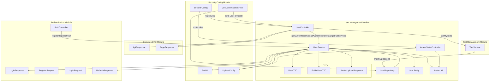
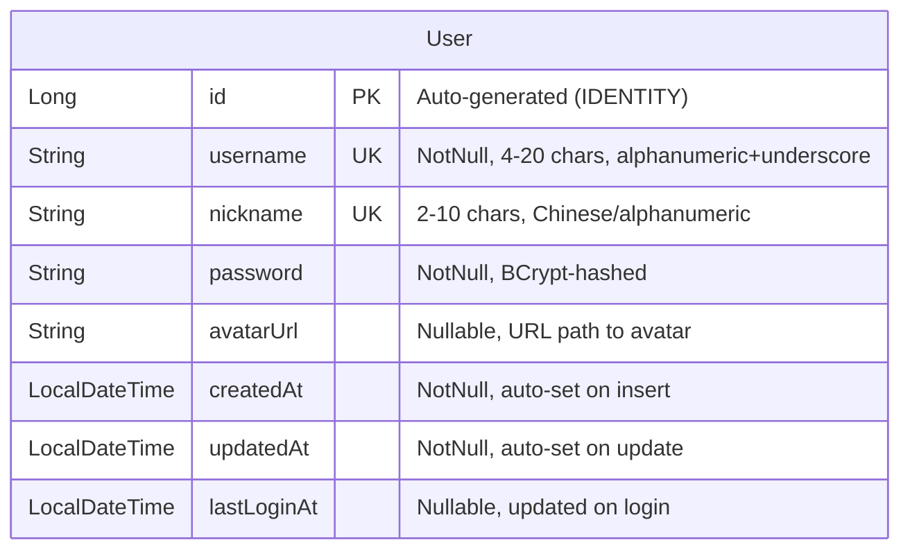
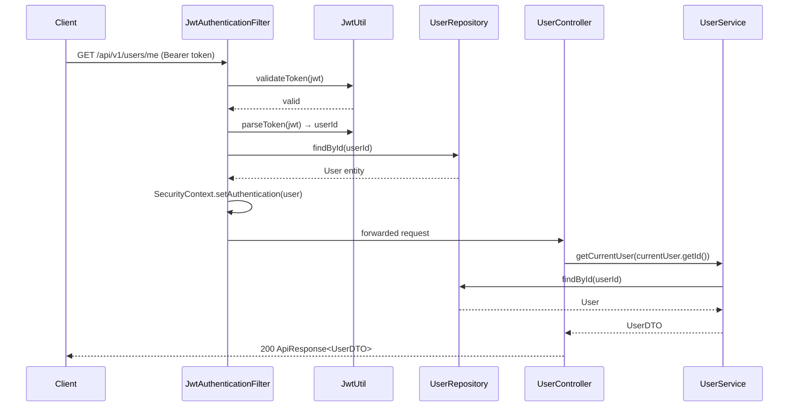
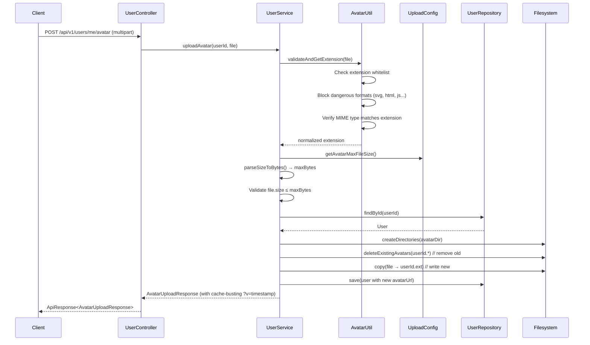
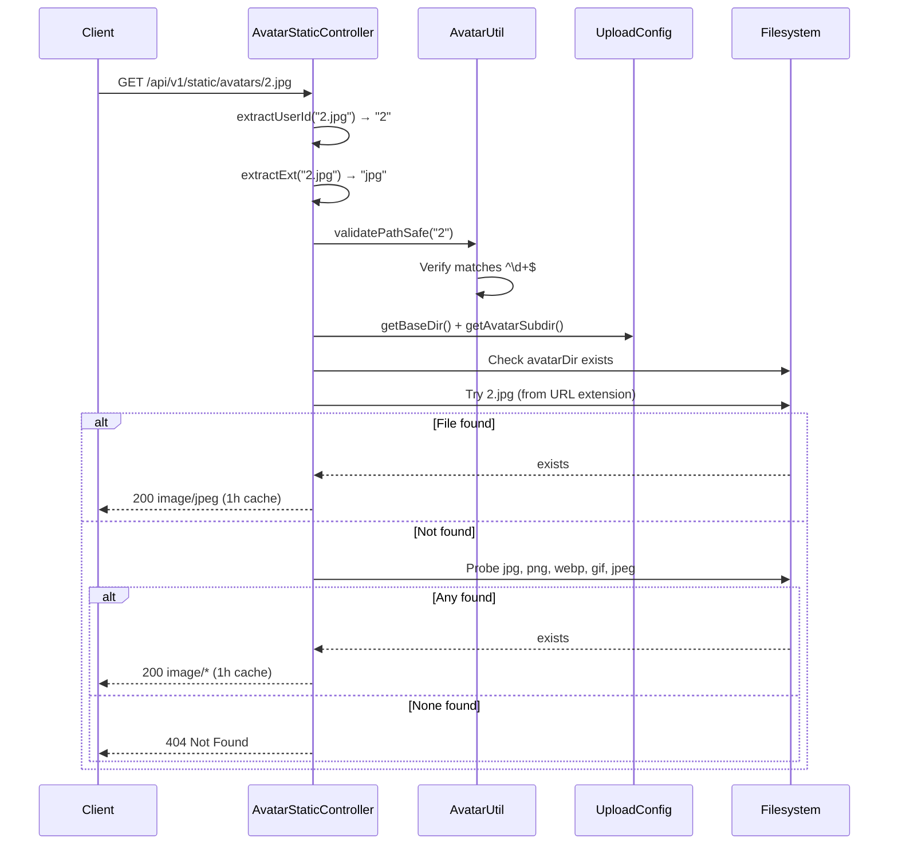
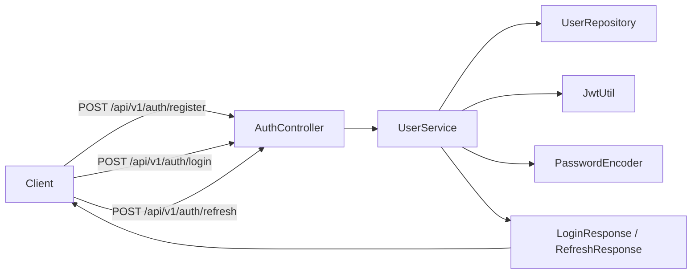
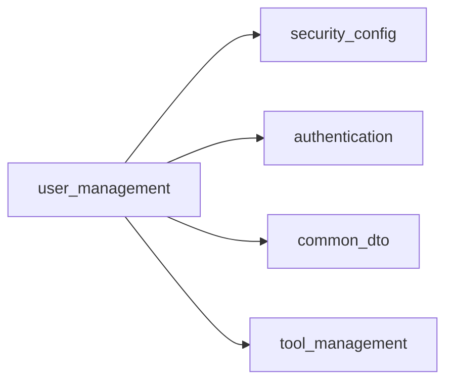

# User Management Module

## Overview

The **User Management** module is the foundational identity layer of the IAIHub Toolbox backend. It provides user registration, authentication (login, token refresh), profile retrieval, and avatar management (upload, delete, static serving). The `User` entity defined here is the central identity model referenced by virtually every other domain module — tools, forum posts, comments, likes, and favorites all link back to a `User`.

While the module's `UserService` also contains authentication logic (register, login, token refresh) that is consumed by the [Authentication](authentication.md) module's `AuthController`, this documentation focuses on the user-profile and avatar-management capabilities exposed through `UserController` and `AvatarStaticController`. For details on the authentication flow (login/register endpoints, JWT issuance), see [Authentication](authentication.md).

---

## Architecture

### Component Summary

| Component | Type | Responsibility |
|-----------|------|----------------|
| `UserController` | REST Controller | Exposes authenticated user profile, avatar CRUD, user's own tools, and public profile endpoints |
| `AvatarStaticController` | REST Controller | Serves avatar image files from the filesystem with path-traversal protection and content negotiation |
| `UserService` | Service | Core business logic: registration, login, token refresh, profile retrieval, avatar upload/delete |
| `UserRepository` | JPA Repository | Data access for `User` entity (find by username/nickname, existence checks) |
| `User` | JPA Entity | Central identity model with username, nickname, password, avatar URL, timestamps |
| `UserDTO` | DTO | Full authenticated-user view (includes `lastLoginAt`) |
| `PublicUserDTO` | DTO | Redacted public-user view (excludes `lastLoginAt` and other sensitive fields) |
| `AvatarUploadResponse` | DTO | Response payload for avatar upload (URL, file size, timestamp) |
| `AvatarUtil` | Utility | Avatar file validation (extension, MIME type, dangerous-format blocking) and path-safety checks |

---

## Data Model

### User Entity

**Key constraints:**
- `username` and `nickname` are both **unique** (enforced via database indexes `idx_user_username` and `idx_user_nickname`).
- `password` is never serialized in any DTO — it is only used internally for authentication.
- Lifecycle callbacks (`@PrePersist`, `@PreUpdate`) automatically maintain `createdAt` and `updatedAt`.

### DTO Comparison

| Field | `UserDTO` (authenticated) | `PublicUserDTO` (public) | `LoginResponse.UserDTO` (auth response) |
|-------|:---:|:---:|:---:|
| `id` | ✅ | ✅ | ✅ |
| `username` | ✅ | ✅ | ✅ |
| `nickname` | ✅ | ✅ | ✅ |
| `avatarUrl` | ✅ | ✅ | ✅ |
| `createdAt` | ✅ | ✅ | ❌ |
| `lastLoginAt` | ✅ | ❌ | ❌ |

---

## API Endpoints

### UserController — `/api/v1/users`

| Method | Path | Auth | Description |
|--------|------|------|-------------|
| `GET` | `/me` | ✅ Required | Returns the authenticated user's full profile (`UserDTO`) |
| `GET` | `/me/tools` | ✅ Required | Paginated list of tools uploaded by the authenticated user (delegates to `ToolService`) |
| `POST` | `/me/avatar` | ✅ Required | Uploads/replaces the authenticated user's avatar (multipart form data) |
| `DELETE` | `/me/avatar` | ✅ Required | Removes the authenticated user's avatar |
| `GET` | `/{id}` | ❌ Public | Returns a public profile (`PublicUserDTO`) for any user by ID |

> **Security note:** The `GET /{id}` and all `/api/v1/static/avatars/**` endpoints are explicitly permitted without authentication in `SecurityConfig`. All other `/api/v1/users/**` endpoints require a valid JWT access token. See [Security Config](security_config.md) for the full route authorization matrix.

### AvatarStaticController — `/api/v1/static/avatars`

| Method | Path | Auth | Description |
|--------|------|------|-------------|
| `GET` | `/{userId}` | ❌ Public | Serves the avatar image for a given user ID (with optional extension) |

The controller probes for the avatar file in a fixed order: if the URL includes an extension (e.g., `/avatars/2.jpg`), it tries that first; otherwise it probes `jpg → png → webp → gif → jpeg`. Responses include a 1-hour public cache-control header.

---

## Core Flows

### Authentication → User Principal Resolution

The `JwtAuthenticationFilter` (see [Security Config](security_config.md)) intercepts every request, extracts the JWT from the `Authorization: Bearer <token>` header, validates it, and loads the `User` entity from `UserRepository`. The `User` object is then set as the Spring Security principal, making it available via `@AuthenticationPrincipal User currentUser` in controller methods.

### Avatar Upload Flow

### Avatar Serving Flow

### Registration & Login (delegated to Authentication module)

Although `UserService` contains the `register()`, `login()`, and `refreshToken()` methods, these are invoked by `AuthController` in the [Authentication](authentication.md) module. The flow is:

For the full authentication endpoint documentation, see [Authentication](authentication.md).

---

## Security Considerations

### Avatar Upload Security

The avatar upload pipeline implements multiple layers of defense:

1. **Extension whitelist** — Only `jpg`, `jpeg`, `png`, `webp`, `gif` are accepted.
2. **Dangerous format blocking** — `svg`, `html`, `htm`, `xml`, `js` are explicitly rejected even if they somehow pass other checks (SVG can carry embedded scripts).
3. **MIME type verification** — The file's declared content type must match an allowed image MIME type, preventing extension spoofing.
4. **File size limit** — Configurable via `app.upload.avatar-max-file-size` (default: `2MB`), parsed by `UserService.parseSizeToBytes()`.
5. **Path traversal prevention** — `AvatarUtil.validatePathSafe()` enforces that user IDs are purely numeric (`^\d+$`), preventing directory traversal attacks on the static serving endpoint.
6. **Old avatar cleanup** — Before writing a new avatar, all existing files matching `{userId}.*` are deleted, preventing orphaned files and ensuring only one avatar per user.

### Data Exposure Control

- `UserDTO` (authenticated view) includes `lastLoginAt` — only returned to the user themselves.
- `PublicUserDTO` (public view) deliberately omits `lastLoginAt` and any other sensitive fields.
- `password` is never included in any DTO; it exists only on the `User` entity for internal authentication use.

---

## Dependencies

### Internal Module Dependencies

| Dependency | Direction | Purpose |
|-----------|-----------|---------|
| [Security Config](security_config.md) | Depends on | `JwtUtil` for token generation/validation, `UploadConfig` for avatar storage paths and size limits, `JwtAuthenticationFilter` sets the `User` principal, `SecurityConfig` defines route authorization |
| [Authentication](authentication.md) | Shared service | `AuthController` calls `UserService.register()`, `login()`, `refreshToken()`; authentication DTOs (`LoginRequest`, `RegisterRequest`, `LoginResponse`, `RefreshResponse`) are defined in the authentication module |
| [Common DTO](common_dto.md) | Depends on | `ApiResponse<T>` wrapper for all responses, `PageResponse<T>` for paginated tool lists |
| [Tool Management](tool_management.md) | Depends on | `ToolService.getMyTools()` is called by `UserController` to list the authenticated user's uploaded tools |

### External Dependencies

| Dependency | Usage |
|-----------|-------|
| Spring Security | `@AuthenticationPrincipal`, `PasswordEncoder` (BCrypt) |
| Spring Data JPA | `UserRepository` extends `JpaRepository` |
| JJWT | Token generation and parsing (via `JwtUtil`) |
| Lombok | `@Data`, `@Builder`, `@RequiredArgsConstructor` for boilerplate reduction |

---

## Configuration

Avatar-related behavior is configured through `UploadConfig` (prefix: `app.upload`):

| Property | Default | Description |
|----------|---------|-------------|
| `app.upload.base-dir` | `~/aifiles` | Root directory for all uploaded files |
| `app.upload.avatar-subdir` | `avatars` | Subdirectory under `base-dir` for avatar storage |
| `app.upload.avatar-max-file-size` | `2MB` | Maximum allowed avatar file size |
| `app.upload.avatar-allowed-extensions` | `jpg, jpeg, png, webp, gif` | Whitelist of allowed avatar extensions |

JWT configuration (consumed via `JwtUtil`):

| Property | Description |
|----------|-------------|
| `app.jwt.secret` | HMAC-SHA signing key |
| `app.jwt.access-token-expiration` | Access token TTL in milliseconds |
| `app.jwt.refresh-token-expiration` | Refresh token TTL in milliseconds |

---

## Cross-Module Usage of User Entity

The `User` entity is the identity backbone of the entire application. Other modules reference it as follows:

| Module | Usage |
|--------|-------|
| [Tool Management](tool_management.md) | `Tool.uploader` → `User` (ManyToOne); `ToolComment.userId`; `ToolLike.userId` |
| [Tool Files](tool_files.md) | Indirectly via tool ownership |
| [Forum Module](forum_module.md) | `ForumPost.author` → `User`; `ForumComment.userId`; `ForumLike.userId`; `PostFavorite.userId` |
| [Overview Stats](overview_stats.md) | User counts in dashboard statistics |
| [MCP Server](mcp_server.md) | User context in tool handler responses |

The `UserRepository` is also directly injected into `JwtAuthenticationFilter` and `ToolService`, making it one of the most widely used repositories in the system.
