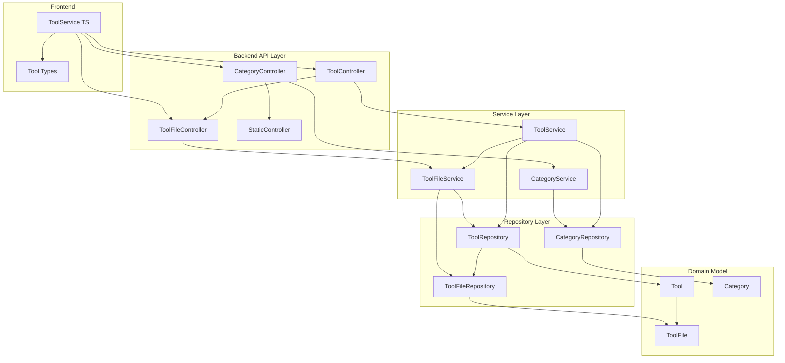
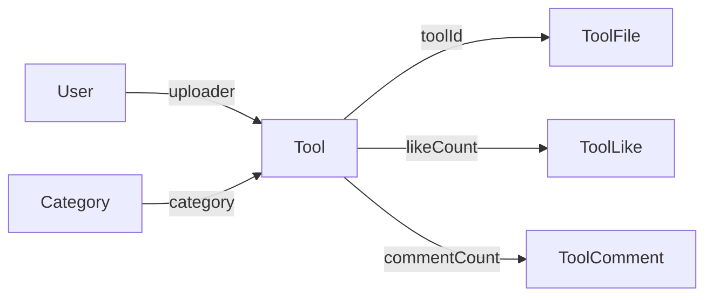
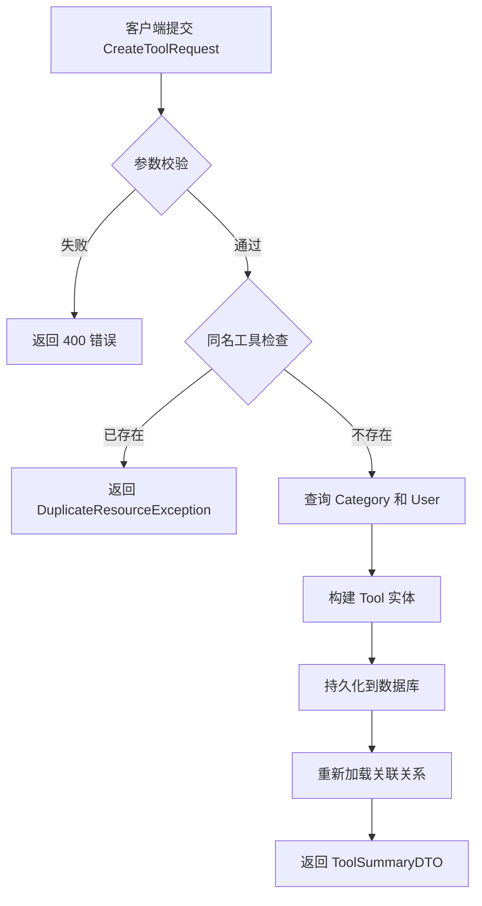
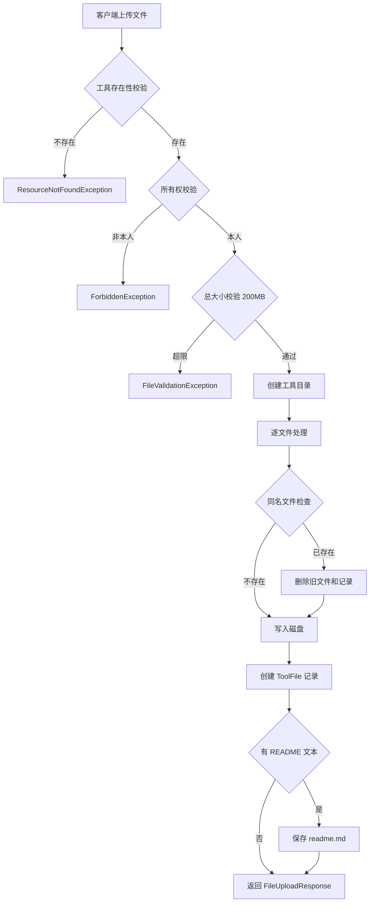
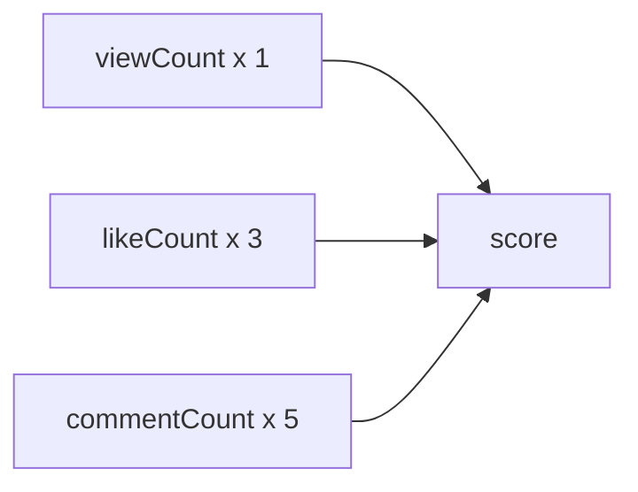
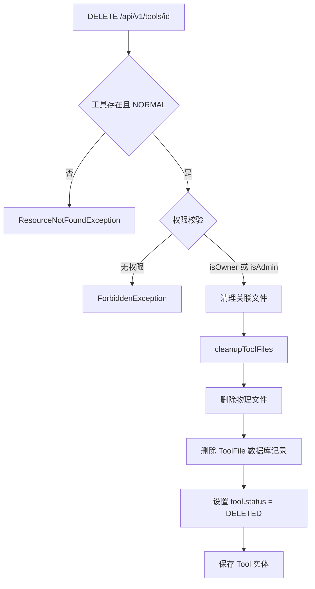

# 工具市场模块

## 1. 模块简介

工具市场是 CodingHub 平台的核心模块，为用户提供 AI 工具的发布、浏览、搜索、下载和互动功能。该模块围绕**工具（Tool）**实体展开，涵盖工具 CRUD、文件上传/下载、分类管理、搜索筛选、评分排行等完整功能链路。

### 核心功能一览

| 功能 | 说明 |
|------|------|
| 工具 CRUD | 创建、查看、更新、软删除工具 |
| 文件管理 | 多文件上传（50MB/个，200MB/次）、下载、替换、删除 |
| 分类管理 | 按分类浏览工具，支持自定义排序 |
| 搜索筛选 | 关键词搜索 + 分类过滤 + 多维排序 |
| 评分系统 | 基于浏览/点赞/评论的加权评分算法 |
| 软删除 | 通过 `status=DELETED` 实现逻辑删除，保留数据可恢复性 |
| README 支持 | 工具可附带 Markdown 格式的说明文档 |

---

## 2. 架构总览

### 2.1 系统分层架构



### 2.2 数据模型关系



---

## 3. 工具 CRUD 流程

### 3.1 创建工具

**API**: `POST /api/v1/tools`

创建工具时需经过以下校验和处理：

1. **参数校验**（`CreateToolRequest`）：
   - `name`：1-100 字符，仅允许字母、数字、中文、下划线和连字符
   - `categoryId`：必填，分类必须存在
   - `content`：必填，最大 5000 字符
   - `version`：必填，语义化版本格式（如 `1.0.0`、`1.0.0-beta`）

2. **唯一性校验**：同一用户在同一分类下不允许上传同名工具（`status=NORMAL`）

3. **默认状态**：`status = NORMAL`，`viewCount/likeCount/commentCount = 0`，`score = 0`



### 3.2 查看工具详情

**API**: `GET /api/v1/tools/{id}`

- 仅查询 `status = NORMAL` 的工具
- 返回 `ToolDetailDTO`，包含完整的工具信息、互动统计和评分
- 使用 `JOIN FETCH` 预加载 `category` 和 `uploader` 关联，避免 N+1 查询

### 3.3 更新工具

**API**: `PUT /api/v1/tools/{id}`

更新操作遵循以下规则：

1. **权限控制**：仅工具上传者本人或 ADMIN/SUPER_ADMIN 可操作
2. **部分更新**：`UpdateToolRequest` 中所有字段可选，仅更新非 null 字段
3. **唯一性重检**：当 `name` 或 `categoryId` 变更时，重新校验同分类下同名约束
4. **版本格式**：版本号遵循语义化版本 `x.y.z[-suffix]`

### 3.4 删除工具（软删除）

**API**: `DELETE /api/v1/tools/{id}`

详见第 8 节「软删除机制」。

---

## 4. 文件上传/下载机制

### 4.1 文件存储架构

文件存储在服务器本地文件系统，目录结构如下：

```
{baseDir}/                    # 默认: ~/aifiles/
  ├── {toolId}/               # 每个工具一个目录
  │   ├── readme.md           # 可选的说明文档
  │   ├── tool-binary.zip     # 工具附件
  │   └── config.yaml         # 配置文件
  └── avatars/                # 用户头像目录
```

存储路径通过 `UploadConfig`（`@ConfigurationProperties(prefix = "app.upload")`）配置：

| 配置项 | 默认值 | 说明 |
|--------|--------|------|
| `baseDir` | `~/aifiles` | 上传根目录 |
| `maxFileSize` | `50MB` | 单文件大小上限 |
| `maxRequestSize` | `200MB` | 单次请求大小上限 |
| `allowedExtensions` | 空（不限制） | 允许的扩展名白名单，空时不校验 |

### 4.2 文件上传流程

**API**: `POST /api/v1/tools/{toolId}/files`（`multipart/form-data`）



**文件校验规则**：

| 校验项 | 规则 |
|--------|------|
| 文件空检查 | 文件不能为空 |
| 单文件大小 | 不超过 50MB |
| 总请求大小 | 不超过 200MB |
| 文件名 | 不能为空，经过 `cleanPath` 安全处理 |
| 扩展名 | 仅在 `allowedExtensions` 非空时校验 |

**同名文件替换机制**：上传同名文件时，系统自动删除旧文件的物理文件和数据库记录，然后写入新文件。此设计确保 `storedPath` 唯一约束不被违反。

### 4.3 文件下载

**API**: `GET /api/v1/tools/{toolId}/files/{fileId}/download`

- 无需认证，公开访问
- 响应包含 `Content-Disposition: attachment` 头，触发浏览器下载
- 根据 `ToolFile.contentType` 设置 MIME 类型，默认 `application/octet-stream`
- 以 `InputStreamResource` 流式传输，适合大文件

### 4.4 文件列表查询

**API**: `GET /api/v1/tools/{toolId}/files`

返回 `FileListResponse`，包含：
- `toolId`：工具 ID
- `folderPath`：工具文件夹相对路径
- `files`：文件列表（`ToolFileDTO[]`）
- `readmeExists`：README 文件是否存在

### 4.5 文件删除

**API**: `DELETE /api/v1/tools/{toolId}/files/{fileId}`

- 仅工具上传者本人可删除
- 同时删除物理文件和数据库记录

### 4.6 工具清理

当工具被软删除时，`ToolFileService.cleanupToolFiles(toolId)` 负责：
1. 遍历并删除该工具的所有物理文件
2. 删除工具文件夹
3. 批量删除数据库中的 `ToolFile` 记录

---

## 5. 分类管理

### 5.1 分类模型

`Category` 实体是工具的分类标签，结构简洁：

| 字段 | 类型 | 说明 |
|------|------|------|
| `id` | `Long` | 主键，自增 |
| `name` | `String(50)` | 分类名称，唯一约束 |
| `icon` | `String(255)` | 分类图标标识 |
| `sortOrder` | `Integer` | 排序权重，升序排列 |
| `createdAt` | `LocalDateTime` | 创建时间 |

### 5.2 分类 API

**API**: `GET /api/v1/categories`

- 返回所有分类，按 `sortOrder` 升序排列
- 特殊处理：名称为 `"API"` 的分类在前端展示时自动替换为 `"插件"`
- 分类数据通过 `CategoryDTO` 返回，包含 `id`、`name`、`icon`、`sortOrder`

### 5.3 分类与工具的关联

- 工具必须关联一个有效分类（`category_id NOT NULL`）
- 数据库索引 `idx_tool_category` 覆盖 `(category_id, status)`，加速分类筛选查询
- 分类查询使用 `findAllByOrderBySortOrderAsc()` 保证有序

---

## 6. 工具搜索与筛选

### 6.1 API 参数

**API**: `GET /api/v1/tools`

| 参数 | 类型 | 默认值 | 说明 |
|------|------|--------|------|
| `categoryId` | `Long` | null | 按分类过滤 |
| `keyword` | `String` | null | 按工具名称模糊搜索 |
| `sortBy` | `String` | `"latest"` | 排序方式：`latest`（最新）/ `name`（名称） |
| `page` | `int` | `0` | 页码（从 0 开始） |
| `size` | `int` | `12` | 每页数量（上限 100） |

### 6.2 查询实现

`ToolRepository` 提供两个核心查询方法：

**按时间排序**（默认）- `findByFilters`：

```sql
SELECT t FROM Tool t
WHERE t.status = 'NORMAL'
  AND (:categoryId IS NULL OR t.category.id = :categoryId)
  AND (:keyword IS NULL OR t.name LIKE %:keyword%)
ORDER BY t.createdAt DESC
```

**按名称排序** - `findByFiltersOrderByName`：

```sql
SELECT t FROM Tool t
WHERE t.status = 'NORMAL'
  AND (:categoryId IS NULL OR t.category.id = :categoryId)
  AND (:keyword IS NULL OR t.name LIKE %:keyword%)
ORDER BY t.name ASC
```

两个查询均自动过滤 `status = DELETED` 的工具，确保软删除的工具不出现在列表中。

### 6.3 我的工具

`ToolService.getMyTools()` 提供当前用户专属的工具列表，额外按 `uploaderId` 过滤：

```sql
SELECT t FROM Tool t
WHERE t.uploader.id = :uploaderId AND t.status = 'NORMAL'
  AND (:categoryId IS NULL OR t.category.id = :categoryId)
  AND (:keyword IS NULL OR t.name LIKE %:keyword%)
ORDER BY t.createdAt DESC
```

### 6.4 分页机制

使用 Spring Data 的 `Pageable` 实现分页：
- `PageRequest.of(page, Math.min(size, 100))` 限制每页最大 100 条
- 返回 `PageResponse<ToolSummaryDTO>`，包含 `content`、`totalElements`、`totalPages`、`page`、`size`

---

## 7. 评分算法

### 7.1 评分公式



工具的综合评分计算公式：

```
score = viewCount * 1 + likeCount * 3 + commentCount * 5
```

**设计理念**：通过加权系数反映不同互动行为的价值权重——评论（5）> 点赞（3）> 浏览（1），鼓励深度互动而非简单浏览。

### 7.2 评分更新时机

评分在以下操作时自动重新计算：

| 触发操作 | 调用方法 | 说明 |
|----------|----------|------|
| 浏览工具详情 | `incrementViewCount()` | viewCount +1 后重算 score |
| 用户点赞 | `incrementLikeCount()` | likeCount +1 后重算 score |
| 取消点赞 | `decrementLikeCount()` | likeCount -1 后重算 score（不低于 0） |
| 新增评论 | `incrementCommentCount()` | commentCount +1 后重算 score |

所有增量操作均在 `Tool` 实体内部完成，保证数据一致性。`updateScore()` 方法使用 `BigDecimal` 精确计算，避免浮点精度问题。

### 7.3 评分展示

`ToolDetailDTO` 中返回完整的互动统计：

| 字段 | 类型 | 说明 |
|------|------|------|
| `viewCount` | `Integer` | 浏览次数 |
| `likeCount` | `Integer` | 点赞数 |
| `commentCount` | `Integer` | 评论数 |
| `score` | `BigDecimal(10,2)` | 综合评分 |

---

## 8. 软删除机制

### 8.1 设计原则

工具市场采用**逻辑删除**（软删除）策略，而非物理删除：

- 保留数据可恢复性
- 维护关联数据完整性（评论、点赞等）
- 避免级联删除风险

### 8.2 实现方式

`Tool` 和 `ToolFile` 实体均定义了 `Status` 枚举：

```java
public enum Status {
    NORMAL,   // 正常状态
    DELETED   // 已删除状态
}
```

**删除流程**：



### 8.3 查询过滤

所有面向用户的查询均通过 `WHERE status = 'NORMAL'` 自动过滤已删除工具：

- `findByIdAndStatusNormal()` — 单条查询
- `findByFilters()` — 列表查询
- `findByUploaderIdAndFilters()` — 用户工具列表

### 8.4 数据库约束

`tool` 表的唯一约束 `uk_tool_uploader_name_category` 覆盖 `(uploader_id, name, category_id, status)` 四列。这意味着：
- 同一用户在同一分类下的同名工具只能有一个处于 `NORMAL` 状态
- 软删除后的工具名称可以被重新使用（因为 status 值不同）

---

## 9. 前端服务层

### 9.1 类型定义

**`frontend/src/types/tool.ts`** 定义了工具相关的 TypeScript 类型：

```typescript
// 工具详情 DTO
interface ToolDetailDTO {
  id: number;
  name: string;
  categoryName: string;
  categoryIcon: string;
  content: string;
  uploaderId: number;
  uploaderUsername: string;
  createdAt: string;
  updatedAt: string;
  viewCount?: number;
  likeCount?: number;
  commentCount?: number;
  score?: number;
  isLiked?: boolean;
}

// 工具摘要
interface ToolSummary {
  id: number;
  name: string;
  categoryName: string;
  categoryIcon: string;
  uploaderUsername: string;
  createdAt: string;
}
```

### 9.2 服务接口

**`frontend/src/services/tool.ts`** 封装了工具相关的 API 调用：

| 函数 | HTTP 方法 | 端点 | 说明 |
|------|-----------|------|------|
| `getToolDetail(id)` | GET | `/tools/{id}` | 获取工具详情 |
| `getTool(id)` | GET | `/tools/{id}` | 获取工具（别名） |
| `likeTool(id)` | POST | `/tools/{id}/like` | 点赞工具 |
| `unlikeTool(id)` | DELETE | `/tools/{id}/like` | 取消点赞 |
| `getLikeStatus(id)` | GET | `/tools/{id}/like-status` | 查询点赞状态 |
| `getComments(id)` | GET | `/tools/{id}/comments` | 获取评论列表 |
| `addComment(id, content)` | POST | `/tools/{id}/comments` | 添加评论 |

前端通过 `ToolDetailVO` 扩展了 `ToolDetailDTO`，增加了 `isLiked` 字段用于标识当前用户的点赞状态，与[统一互动](统一互动.md)模块的点赞/评论功能集成。

---

## 10. 关键源文件索引

| 层级 | 文件路径 |
|------|----------|
| Controller | `controller/ToolController.java` — 工具 CRUD API |
| Controller | `controller/ToolFileController.java` — 文件上传/下载 API |
| Controller | `controller/CategoryController.java` — 分类查询 API |
| Controller | `controller/StaticController.java` — README 静态资源 |
| Service | `service/ToolService.java` — 工具业务逻辑 |
| Service | `service/ToolFileService.java` — 文件管理业务逻辑 |
| Service | `service/CategoryService.java` — 分类业务逻辑 |
| Model | `model/Tool.java` — 工具实体（含评分算法） |
| Model | `model/ToolFile.java` — 工具文件实体 |
| Model | `model/Category.java` — 分类实体 |
| Repository | `repository/ToolRepository.java` — 工具数据访问 |
| Repository | `repository/ToolFileRepository.java` — 文件数据访问 |
| Repository | `repository/CategoryRepository.java` — 分类数据访问 |
| Config | `config/UploadConfig.java` — 上传配置 |
| DTO | `dto/CreateToolRequest.java` — 创建请求 |
| DTO | `dto/UpdateToolRequest.java` — 更新请求 |
| DTO | `dto/ToolSummaryDTO.java` — 工具摘要 |
| DTO | `dto/ToolDetailDTO.java` — 工具详情 |
| DTO | `dto/FileUploadResponse.java` — 上传响应 |
| DTO | `dto/FileListResponse.java` — 文件列表响应 |
| DTO | `dto/ToolFileDTO.java` — 文件信息 |
| DTO | `dto/CategoryDTO.java` — 分类信息 |
| DTO | `dto/PageResponse.java` — 分页响应 |
| Frontend | `frontend/src/types/tool.ts` — 前端类型定义 |
| Frontend | `frontend/src/services/tool.ts` — 前端 API 服务 |

---

## 11. 交叉引用

- **[认证与用户](认证与用户.md)**：工具创建/更新/删除操作依赖 JWT 认证获取当前用户（`@AuthenticationPrincipal User`），权限校验基于 `Role.USER / ADMIN / SUPER_ADMIN` 体系
- **[统一互动](统一互动.md)**：工具的点赞（`ToolLike`）和评论（`ToolComment`）功能由统一互动模块提供，互动数据同步更新工具的 `likeCount`、`commentCount` 和 `score`
