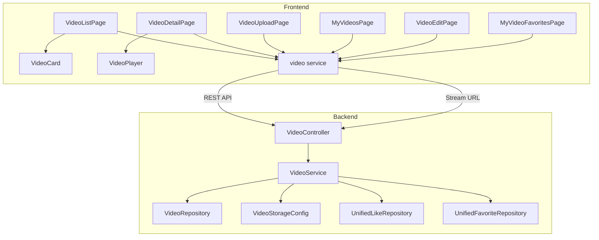
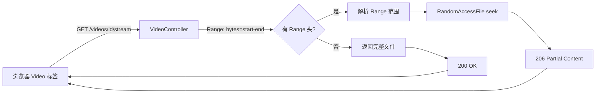
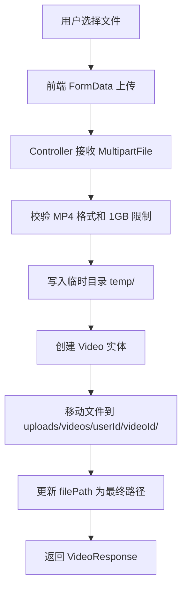

# 微课视频模块

微课视频是 CodingHub 平台的核心内容模块之一，支持用户上传、管理和在线观看短视频教程。该模块实现了视频文件的上传存储、HTTP Range 流式播放、封面管理以及基础的 CRUD 操作，并与 [统一互动](统一互动.md) 模块集成，提供点赞、收藏和评论功能。

## 架构概览



## 后端组件

### Controller 层

#### VideoController

路径：`controller/video/VideoController.java`

负责视频相关的所有 REST API 端点，映射到 `/api/v1/videos`。

| 方法 | 端点 | 说明 | 认证要求 |
|------|------|------|----------|
| `uploadVideo` | `POST /` | 上传视频文件（multipart） | 需要登录 |
| `getVideoList` | `GET /` | 分页获取视频列表 | 无需登录 |
| `getVideoDetail` | `GET /{id}` | 获取视频详情（自动增加播放量） | 可选登录 |
| `updateVideo` | `PUT /{id}` | 更新视频标题和描述 | 需要登录（作者或管理员） |
| `deleteVideo` | `DELETE /{id}` | 软删除视频 | 需要登录（作者或管理员） |
| `streamVideo` | `GET /{id}/stream` | 视频流播放（支持 HTTP Range） | 无需登录 |
| `getMyVideos` | `GET /my` | 获取当前用户上传的视频 | 需要登录 |

#### VideoInteractionController（已废弃）

路径：`controller/video/VideoInteractionController.java`

> **注意：** 该 Controller 已标注 `@Deprecated`，视频互动功能已迁移至 [统一互动](统一互动.md) 模块。保留仅为向后兼容，新代码请使用 `UnifiedInteractionController`。

### Service 层

#### VideoService

路径：`service/video/VideoService.java`

核心业务逻辑，负责视频的上传、查询、更新、删除和流式播放。

**关键方法：**

1. **`uploadVideo`** — 视频上传流程：
   - 校验文件格式（仅 MP4）和大小（上限 1 GB）
   - 生成唯一文件名（`时间戳_原文件名`）
   - 先写入临时目录，创建数据库实体后移动到最终路径
   - 最终路径格式：`uploads/videos/{userId}/{videoId}/original.mp4`

2. **`getVideoDetail`** — 获取详情时自动递增播放量，同时通过 `UnifiedLikeRepository` 和 `UnifiedFavoriteRepository` 查询当前用户的点赞和收藏状态。

3. **`updateVideo` / `deleteVideo`** — 权限校验遵循 `isOwner || isAdmin` 规则，删除操作为软删除（将 `status` 设为 `DELETED`）。

4. **`getVideoFilePath`** — 返回视频文件的磁盘绝对路径，供 Controller 层的流式播放使用。

5. **`streamVideo`** — 返回 `Resource` 对象（兼容方法，Controller 层已改用 `RandomAccessFile` 方式）。

#### VideoInteractionService（已废弃）

路径：`service/video/VideoInteractionService.java`

> 已标注 `@Deprecated`，点赞、收藏、评论功能已迁移至 [统一互动](统一互动.md) 模块的 `UnifiedLikeService`、`UnifiedFavoriteService`、`UnifiedCommentService`。

### Model 层

#### Video 实体

路径：`model/video/Video.java`，对应数据库表 `video`。

| 字段 | 类型 | 说明 |
|------|------|------|
| `id` | `Long` | 主键，自增 |
| `title` | `String(200)` | 视频标题 |
| `description` | `TEXT` | 视频描述 |
| `filePath` | `String(500)` | 文件相对路径 |
| `fileName` | `String(255)` | 原始文件名 |
| `fileSize` | `Long` | 文件大小（字节） |
| `duration` | `Integer` | 时长（秒），默认 0 |
| `coverUrl` | `String(500)` | 封面图 URL |
| `uploaderId` | `Long` | 上传者 ID |
| `status` | `VideoStatus` | 状态枚举，默认 `NORMAL` |
| `viewCount` | `Integer` | 播放次数 |
| `likeCount` | `Integer` | 点赞数 |
| `commentCount` | `Integer` | 评论数 |
| `createdAt` | `LocalDateTime` | 创建时间 |
| `updatedAt` | `LocalDateTime` | 更新时间 |

**索引设计：**
- `idx_video_uploader`：`(uploader_id, status)` — 按用户查询已上传视频
- `idx_video_status_created`：`(status, created_at DESC)` — 按时间倒序获取视频列表

**计数方法：** `incrementViewCount()`、`incrementLikeCount()`、`decrementLikeCount()`、`incrementCommentCount()` 直接在实体上操作，避免循环内数据库请求。

#### VideoStatus 枚举

路径：`model/video/VideoStatus.java`

```java
public enum VideoStatus {
    NORMAL,   // 正常状态
    DELETED   // 软删除
}
```

#### 已废弃的实体

以下实体已标注 `@Deprecated`，对应数据库表名加了 `_deprecated` 后缀，互动功能已迁移至 [统一互动](统一互动.md) 模块：

- `VideoComment` → 表 `video_comment_deprecated`
- `VideoLike` → 表 `video_like_deprecated`
- `VideoFavorite` → 表 `video_favorite_deprecated`

### Repository 层

#### VideoRepository

路径：`repository/video/VideoRepository.java`

| 方法 | 说明 |
|------|------|
| `findByStatusOrderByCreatedAtDesc` | 按状态分页查询，按创建时间倒序 |
| `findByUploaderIdAndStatusOrderByCreatedAtDesc` | 按上传者和状态分页查询 |
| `findByIdAndStatus` | 按 ID 和状态查找单个视频 |

### 配置层

#### VideoStorageConfig

路径：`config/VideoStorageConfig.java`

通过 `@PostConstruct` 在应用启动时初始化视频存储目录。

- **配置项：** `app.upload.base-dir`（默认 `~/aifiles`）
- **存储路径：** `{base-dir}/uploads/videos/`
- **初始化逻辑：** 检测目录是否存在，不存在则自动创建

### DTO 层

| DTO | 用途 |
|-----|------|
| `VideoUploadRequest` | 上传请求参数（title、description） |
| `VideoUpdateRequest` | 更新请求参数（title、description） |
| `VideoResponse` | 视频详情响应（含 userLiked、userFavorited） |
| `VideoListItem` | 列表项（轻量，含上传者信息） |
| `VideoCommentRequest` | 评论请求（已废弃） |
| `VideoCommentResponse` | 评论响应（已废弃） |
| `VideoInteractionResponse` | 互动响应（已废弃） |

## 视频流播放机制

视频播放采用 HTTP Range 请求实现断点续传和拖拽播放，Controller 层直接使用 `RandomAccessFile` 进行精确的文件偏移读取。



**关键参数：**

- 默认每次最多读取 1 MB 数据（`rangeStart + 1024 * 1024 - 1`）
- 响应头包含 `Accept-Ranges: bytes`、`Content-Range`
- 缓存策略：`no-cache, no-store, must-revalidate`

## 前端组件

### 类型定义

路径：`frontend/src/types/video.ts`

| 类型 | 说明 |
|------|------|
| `VideoListItem` | 视频列表项，包含播放量、点赞数等统计 |
| `VideoDetail` | 视频详情，额外包含 `userLiked`、`userFavorited` 状态 |
| `VideoComment` | 评论结构（与旧接口对应） |
| `VideoUploadRequest` | 上传请求参数 |
| `VideoUpdateRequest` | 更新请求参数 |
| `VideoPageResponse` | 分页响应结构 |

### Service 层

路径：`frontend/src/services/video.ts`

`videoService` 对象封装了所有视频相关的 API 调用：

| 方法 | 说明 |
|------|------|
| `uploadVideo(file, title, desc, onProgress)` | 带进度回调的视频上传，超时 10 分钟 |
| `getVideoList(page, size)` | 分页获取视频列表 |
| `getVideoDetail(id)` | 获取视频详情 |
| `getStreamUrl(id)` | 返回流播放 URL（非 API 调用） |
| `updateVideo(id, data)` | 更新视频信息 |
| `deleteVideo(id)` | 删除视频 |
| `getMyVideos(page, size)` | 获取我的视频 |
| `toggleLike(id)` / `toggleFavorite(id)` | 点赞/收藏切换（旧接口） |
| `getComments(id, page, size)` / `addComment(id, content)` | 评论操作（旧接口） |
| `getMyFavorites(page, size)` | 获取我的收藏（旧接口） |

> **建议：** 互动相关操作（点赞、收藏、评论）请使用 [统一互动](统一互动.md) 模块的 `interactionApi` 和 `useInteraction` composable。

### 页面组件

| 页面 | 路径 | 说明 |
|------|------|------|
| `VideoListPage` | `pages/video/VideoListPage.vue` | 视频列表页，分页展示所有视频 |
| `VideoDetailPage` | `pages/video/VideoDetailPage.vue` | 视频详情页，含播放器和评论区 |
| `VideoUploadPage` | `pages/video/VideoUploadPage.vue` | 视频上传页，含进度条 |
| `MyVideosPage` | `pages/video/MyVideosPage.vue` | 我的视频管理页 |
| `VideoEditPage` | `pages/video/VideoEditPage.vue` | 视频编辑页（标题、描述） |
| `MyVideoFavoritesPage` | `pages/video/MyVideoFavoritesPage.vue` | 我收藏的视频列表 |

### 基础组件

| 组件 | 路径 | 说明 |
|------|------|------|
| `VideoCard` | `components/video/VideoCard.vue` | 视频卡片，用于列表展示 |
| `VideoPlayer` | `components/video/VideoPlayer.vue` | 视频播放器，支持流式播放 |

## 数据流

### 视频上传流程



### 视频详情查询流程

1. 前端调用 `GET /api/v1/videos/{id}`
2. `VideoService` 查询 `Video` 实体（状态必须为 `NORMAL`）
3. 调用 `incrementViewCount()` 增加播放量
4. 若用户已登录，通过 `UnifiedLikeRepository` 和 `UnifiedFavoriteRepository` 查询点赞和收藏状态
5. 组装 `VideoResponse`（含上传者信息、互动状态）返回

## 与其他模块的关系

| 关联模块 | 关系说明 |
|----------|----------|
| [统一互动](统一互动.md) | 视频的点赞、收藏、评论功能已迁移至统一互动模块，`VideoService` 直接注入 `UnifiedLikeRepository` 和 `UnifiedFavoriteRepository` 查询互动状态 |
| 用户模块 | 视频详情和列表项中包含上传者信息（用户名、昵称、头像），通过 `UserRepository` 查询 |
| 文件存储 | 视频文件存储在 `{base-dir}/uploads/videos/` 目录下，按 `userId/videoId/` 组织目录结构 |

## API 端点汇总

| 方法 | 端点 | 请求参数 | 响应类型 |
|------|------|----------|----------|
| POST | `/api/v1/videos` | `file` (MultipartFile), `title`, `description` | `VideoResponse` |
| GET | `/api/v1/videos` | `page`, `size` | `PageResponse<VideoListItem>` |
| GET | `/api/v1/videos/{id}` | — | `VideoResponse` |
| PUT | `/api/v1/videos/{id}` | `VideoUpdateRequest` (JSON) | `VideoResponse` |
| DELETE | `/api/v1/videos/{id}` | — | `Void` |
| GET | `/api/v1/videos/{id}/stream` | `Range` 请求头 | 视频流 (video/mp4) |
| GET | `/api/v1/videos/my` | `page`, `size` | `PageResponse<VideoListItem>` |
