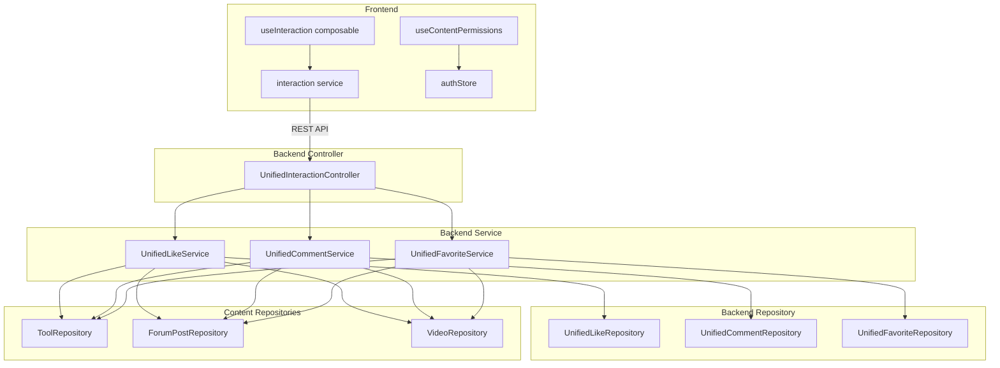
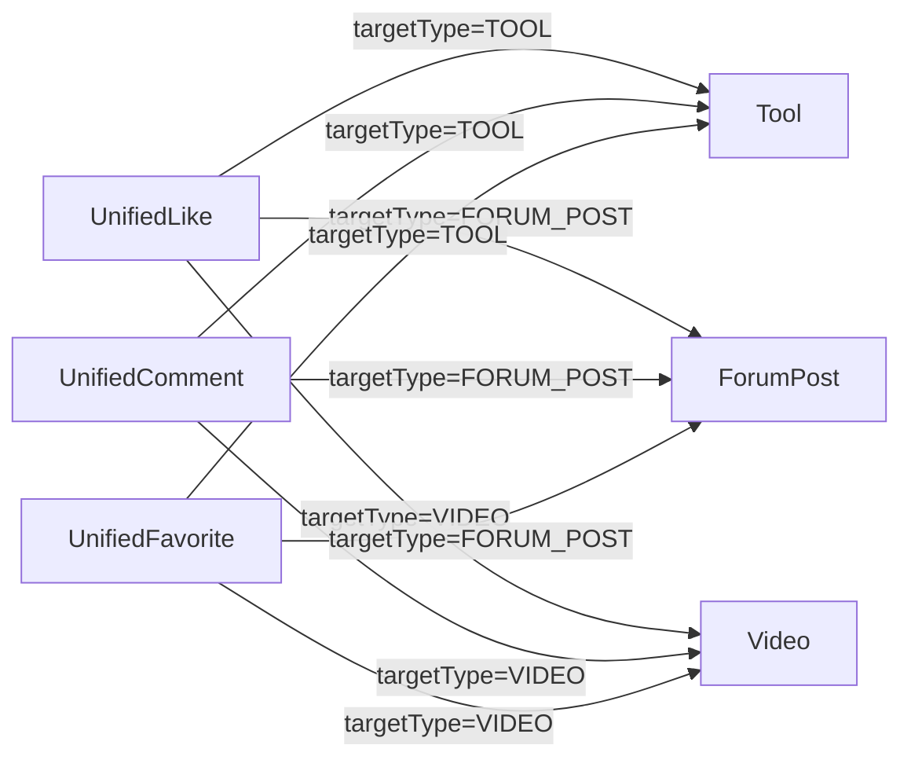
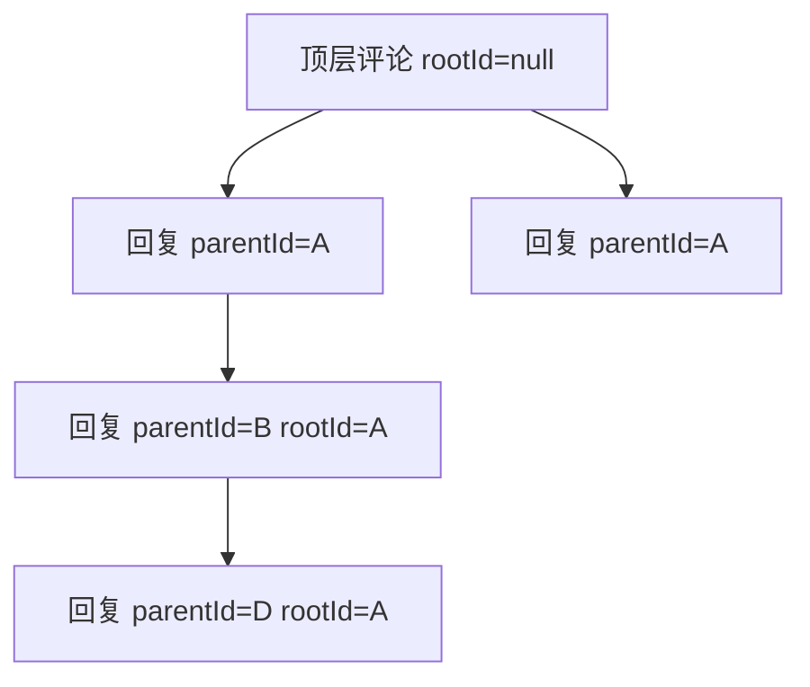
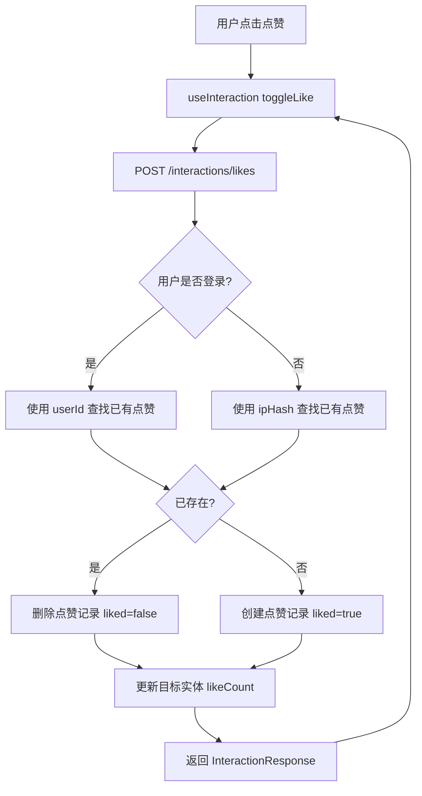

# 统一互动模块

统一互动是 CodingHub 平台的横切模块，为所有内容类型（工具、论坛帖子、视频）提供统一的点赞、评论和收藏能力。该模块采用多态设计，通过 `target_type + target_id` 组合将互动行为与具体内容解耦，取代了原先各模块独立的互动表（`ToolLike`、`ForumLike`、`VideoLike` 等），显著降低了代码重复并简化了 API 接口。

## 架构概览



## 设计原则

### 多态目标模型

统一互动的核心思想是用 `targetType`（VARCHAR(20)）和 `targetId`（BIGINT）代替外键关联，使同一套表和 API 支持多种内容类型。



### TargetType 枚举

路径：`model/TargetType.java`

```java
public enum TargetType {
    TOOL,        // 工具
    FORUM_POST,  // 论坛帖子
    VIDEO;       // 微课视频

    public static TargetType fromString(String value);
}
```

`fromString` 方法对传入字符串做大小写无关校验，非法值抛出 `BusinessException(400)`。扩展新内容类型只需新增枚举值和对应的 Repository 依赖。

## 后端组件

### Controller 层

#### UnifiedInteractionController

路径：`controller/UnifiedInteractionController.java`

统一入口，映射到 `/api/v1/interactions`，按功能分为三组端点：

**点赞（Likes）**

| 方法 | 端点 | 说明 | 认证要求 |
|------|------|------|----------|
| `toggleLike` | `POST /likes` | 切换点赞状态（支持匿名） | 可选登录 |
| `getLikeStatus` | `GET /likes/status` | 查询点赞状态和计数 | 可选登录 |

**评论（Comments）**

| 方法 | 端点 | 说明 | 认证要求 |
|------|------|------|----------|
| `addComment` | `POST /comments` | 添加评论（支持回复） | 可选登录 |
| `getComments` | `GET /comments` | 分页获取评论列表 | 无需登录 |
| `deleteComment` | `DELETE /comments/{id}` | 删除评论 | 需要登录（作者或管理员） |

**收藏（Favorites）**

| 方法 | 端点 | 说明 | 认证要求 |
|------|------|------|----------|
| `toggleFavorite` | `POST /favorites` | 切换收藏状态 | 需要登录 |
| `getMyFavorites` | `GET /favorites` | 分页获取我的收藏列表 | 需要登录 |
| `getFavoriteStatus` | `GET /favorites/status` | 查询收藏状态 | 需要登录 |

**辅助方法：**

- `getCurrentUser()` — 从 `SecurityContext` 获取当前用户，未登录返回 `null`
- `computeIpHash(request)` — 将客户端 IP 做 SHA-256 哈希，支持 `X-Forwarded-For` 代理头

### Service 层

#### UnifiedLikeService

路径：`service/UnifiedLikeService.java`

**核心逻辑：**

1. 通过 `TargetType.fromString()` 校验目标类型合法性
2. 调用 `validateTargetExists()` 验证目标内容存在且未被删除
3. 根据用户是否登录，分别使用 `userId` 或 `ipHash` 作为唯一标识
4. Toggle 语义：已点赞则删除，未点赞则创建
5. 同步更新目标实体的 `likeCount` 字段

**匿名点赞机制：**

未登录用户通过 IP 地址的 SHA-256 哈希值标识身份。Controller 层计算 IP 哈希后传入 Service 层，Repository 层通过 `ipHash` 字段查询和操作。这确保了同一 IP 只能对同一目标点赞一次，同时不存储明文 IP。

**唯一约束：**

- 登录用户：`uk_like_user (target_type, target_id, user_id)`
- 匿名用户：`uk_like_anon (target_type, target_id, ip_hash)`

#### UnifiedCommentService

路径：`service/UnifiedCommentService.java`

**核心逻辑：**

1. 校验评论内容非空，经 `XssSanitizer.sanitize()` 过滤 XSS
2. 验证目标内容存在
3. 若有 `parentId`，查找父评论并计算 `rootId`（线程根节点）
4. 创建 `UnifiedComment` 实体并保存
5. 同步递增目标实体的 `commentCount`

**嵌套评论模型：**



- `parentId`：直接父评论 ID，用于标识回复关系
- `rootId`：线程根评论 ID，用于快速查询同一讨论串下的所有评论
- 顶层评论的 `parentId` 和 `rootId` 均为 `null`
- 回复评论时，`rootId` 取父评论的 `rootId`（若父评论无 `rootId` 则取父评论 ID）

**删除权限：**

- 评论作者本人可删除
- `ADMIN` 或 `SUPER_ADMIN` 角色可删除
- 删除时同步递减目标实体的 `commentCount`

#### UnifiedFavoriteService

路径：`service/UnifiedFavoriteService.java`

**核心逻辑：**

1. 收藏功能要求用户必须登录（未登录抛出 `BusinessException(401)`）
2. Toggle 语义：已收藏则删除，未收藏则创建
3. 获取收藏列表时，根据 `targetType` 分发到不同构建方法，返回实际资源的 DTO

**收藏列表返回类型：**

| targetType | 返回 DTO | 说明 |
|------------|----------|------|
| `TOOL` | `ToolSummaryDTO` | 含分类名称、图标、上传者信息 |
| `FORUM_POST` | `ForumPostSummaryDTO` | 含标题、作者昵称、统计数据 |
| `VIDEO` | `VideoListItem` | 含标题、封面、上传者信息、统计数据 |

**唯一约束：** `uk_fav (user_id, target_type, target_id)` — 每个用户对每个目标只能收藏一次。

### Model 层

#### UnifiedLike

路径：`model/UnifiedLike.java`，对应表 `unified_like`。

| 字段 | 类型 | 说明 |
|------|------|------|
| `id` | `Long` | 主键 |
| `targetType` | `String(20)` | 目标类型（TOOL / FORUM_POST / VIDEO） |
| `targetId` | `Long` | 目标 ID |
| `userId` | `Long` | 用户 ID（登录用户） |
| `ipHash` | `String(64)` | IP 哈希（匿名用户） |
| `createdAt` | `LocalDateTime` | 创建时间 |

**索引：** `idx_like_target (target_type, target_id)`

#### UnifiedComment

路径：`model/UnifiedComment.java`，对应表 `unified_comment`。

| 字段 | 类型 | 说明 |
|------|------|------|
| `id` | `Long` | 主键 |
| `targetType` | `String(20)` | 目标类型 |
| `targetId` | `Long` | 目标 ID |
| `userId` | `Long` | 用户 ID（登录用户，匿名时为 null） |
| `userName` | `String(50)` | 匿名用户填写的显示名 |
| `parentId` | `Long` | 父评论 ID |
| `rootId` | `Long` | 线程根评论 ID |
| `content` | `TEXT` | 评论内容（经 XSS 过滤） |
| `likeCount` | `Integer` | 评论自身的点赞数 |
| `createdAt` | `LocalDateTime` | 创建时间 |
| `updatedAt` | `LocalDateTime` | 更新时间 |

**索引：**
- `idx_comment_target (target_type, target_id, created_at)` — 按目标查询评论列表
- `idx_comment_root (root_id)` — 按线程根查询子评论

#### UnifiedFavorite

路径：`model/UnifiedFavorite.java`，对应表 `unified_favorite`。

| 字段 | 类型 | 说明 |
|------|------|------|
| `id` | `Long` | 主键 |
| `targetType` | `String(20)` | 目标类型 |
| `targetId` | `Long` | 目标 ID |
| `userId` | `Long` | 用户 ID（必填） |
| `createdAt` | `LocalDateTime` | 创建时间 |

**索引：** `idx_fav_user (user_id, target_type)` — 按用户和类型查询收藏列表

### Repository 层

| Repository | 关键查询方法 |
|------------|-------------|
| `UnifiedLikeRepository` | `findBy...AndUserId` / `findBy...AndIpHash`（分别对应登录和匿名） |
| `UnifiedCommentRepository` | `findByTargetTypeAndTargetIdOrderByCreatedAtAsc`（时间正序分页） |
| `UnifiedFavoriteRepository` | `findByUserIdAndTargetTypeOrderByCreatedAtDesc`（按用户和类型分页） |

### DTO 层

#### InteractionRequest

路径：`dto/InteractionRequest.java`

统一的请求体，适用于所有互动操作：

| 字段 | 类型 | 必填 | 说明 |
|------|------|------|------|
| `targetType` | `String` | 是 | 目标类型（TOOL / FORUM_POST / VIDEO） |
| `targetId` | `Long` | 是 | 目标 ID |
| `content` | `String` | 评论时必填 | 评论内容 |
| `parentId` | `Long` | 否 | 父评论 ID（回复时使用） |
| `userName` | `String` | 否 | 匿名评论时的显示名 |

#### InteractionResponse

路径：`dto/InteractionResponse.java`

统一响应体，使用 `@JsonInclude(NON_NULL)` 只返回非空字段：

| 字段 | 场景 |
|------|------|
| `liked`, `likeCount` | 点赞切换 |
| `favorited` | 收藏切换 |
| `id`, `targetType`, `targetId`, `userId`, `userName`, `userNickname`, `userAvatarUrl`, `parentId`, `rootId`, `content`, `commentLikeCount`, `createdAt` | 评论操作 |

提供两个工厂方法：
- `InteractionResponse.likeToggle(liked, likeCount)` — 构建点赞响应
- `InteractionResponse.favoriteToggle(favorited)` — 构建收藏响应

## 前端组件

### Service 层

路径：`frontend/src/services/interaction.ts`

`interactionApi` 对象封装了统一互动的所有 API 调用：

| 方法 | 参数 | 说明 |
|------|------|------|
| `toggleLike(targetType, targetId)` | 目标类型和 ID | 切换点赞 |
| `getLikeStatus(targetType, targetId)` | 目标类型和 ID | 查询点赞状态 |
| `addComment(targetType, targetId, content, parentId?, userName?)` | 目标信息 + 评论内容 | 添加评论 |
| `getComments(targetType, targetId, page, size)` | 目标信息 + 分页参数 | 获取评论列表 |
| `deleteComment(commentId)` | 评论 ID | 删除评论 |
| `toggleFavorite(targetType, targetId)` | 目标类型和 ID | 切换收藏 |
| `getMyFavorites(targetType, page, size)` | 类型 + 分页参数 | 获取我的收藏 |
| `getFavoriteStatus(targetType, targetId)` | 目标类型和 ID | 查询收藏状态 |

### useInteraction Composable

路径：`frontend/src/composables/useInteraction.ts`

封装点赞、收藏、评论的完整状态管理和 API 调用逻辑，组件只需传入 `targetType` 和 `targetId` 即可获得所有互动能力。

**状态管理：**

```typescript
const {
  liked, likeCount, likeLoading,     // 点赞状态
  favorited, favoriteLoading,         // 收藏状态
  comments, commentsTotalElements,    // 评论列表
  commentsPage, commentsLoading,      // 评论分页
  commentSubmitting,                  // 评论提交中
  loadLikeStatus, toggleLike,         // 点赞操作
  loadFavoriteStatus, toggleFavorite, // 收藏操作
  loadComments, addComment,           // 评论操作
  deleteComment,                      // 删除评论
} = useInteraction('VIDEO', videoId)
```

**防重复提交：** `likeLoading` 和 `favoriteLoading` 防止用户在请求进行中重复点击。

### useContentPermissions Composable

路径：`frontend/src/composables/useContentPermissions.ts`

根据当前登录用户判断是否有编辑/删除权限：

```typescript
const { canEdit, canDelete } = useContentPermissions(() => video.uploaderId)
```

**权限规则：** `userId === ownerId || authStore.isAdmin`

- `authStore.isLoggedIn` 为 `false` 时直接返回 `false`
- `authStore.isAdmin` 涵盖 `ADMIN` 和 `SUPER_ADMIN` 角色

## API 端点汇总

| 方法 | 端点 | 请求体 / 参数 | 认证 |
|------|------|---------------|------|
| POST | `/api/v1/interactions/likes` | `{ targetType, targetId }` | 可选 |
| GET | `/api/v1/interactions/likes/status` | `?targetType=&targetId=` | 可选 |
| POST | `/api/v1/interactions/comments` | `{ targetType, targetId, content, parentId?, userName? }` | 可选 |
| GET | `/api/v1/interactions/comments` | `?targetType=&targetId=&page=&size=` | 无需 |
| DELETE | `/api/v1/interactions/comments/{id}` | — | 需要 |
| POST | `/api/v1/interactions/favorites` | `{ targetType, targetId }` | 需要 |
| GET | `/api/v1/interactions/favorites` | `?targetType=&page=&size=` | 需要 |
| GET | `/api/v1/interactions/favorites/status` | `?targetType=&targetId=` | 需要 |

### 请求示例

**切换点赞（登录用户）：**

```json
POST /api/v1/interactions/likes
Authorization: Bearer <token>

{
  "targetType": "VIDEO",
  "targetId": 42
}
```

**响应：**

```json
{
  "code": 200,
  "message": "success",
  "data": {
    "liked": true,
    "likeCount": 15
  }
}
```

**添加嵌套评论（匿名）：**

```json
POST /api/v1/interactions/comments

{
  "targetType": "TOOL",
  "targetId": 7,
  "content": "这个工具很实用",
  "parentId": 23,
  "userName": "游客小明"
}
```

## 数据流

### 点赞切换流程



### 评论提交流程

1. 前端调用 `addComment`，传入 `targetType`、`targetId`、`content`、可选 `parentId`
2. Service 层校验内容非空，经 XSS 过滤
3. 若有 `parentId`，查找父评论并计算 `rootId`
4. 登录用户自动获取 `userNickname` 和 `userAvatarUrl`，匿名用户使用传入的 `userName`
5. 保存评论并递增目标实体的 `commentCount`
6. 前端 Composable 自动重新加载当前页评论列表

## 与其他模块的关系

| 关联模块 | 关系说明 |
|----------|----------|
| [微课视频](微课视频.md) | `VIDEO` 目标类型，`VideoService` 直接注入 `UnifiedLikeRepository` 和 `UnifiedFavoriteRepository` 查询互动状态；旧的视频互动表已废弃 |
| 工具模块 | `TOOL` 目标类型，工具的点赞和评论通过统一互动模块处理 |
| 论坛模块 | `FORUM_POST` 目标类型，论坛帖子的点赞、评论和收藏通过统一互动模块处理 |
| 用户模块 | 评论响应中包含用户昵称和头像，通过 `UserRepository` 查询；权限判断依赖 `User.getRole()` |
| XSS 防护 | 评论内容通过 `XssSanitizer.sanitize()` 过滤，与全局 XSS 防护策略一致 |

## 扩展指南

如需支持新的内容类型（如「教程」模块），只需：

1. 在 `TargetType` 枚举中新增 `TUTORIAL` 值，并更新 `VALID_VALUES`
2. 在三个 Service 的 `validateTargetExists`、`updateLikeCount`、`incrementCommentCount` 等方法中增加对应的 `switch` 分支
3. 在 `UnifiedFavoriteService` 中增加 `buildTutorialFavorites` 方法
4. 前端 `TargetType` 类型中添加 `'TUTORIAL'`

无需新建表、Controller 或 API 端点。
