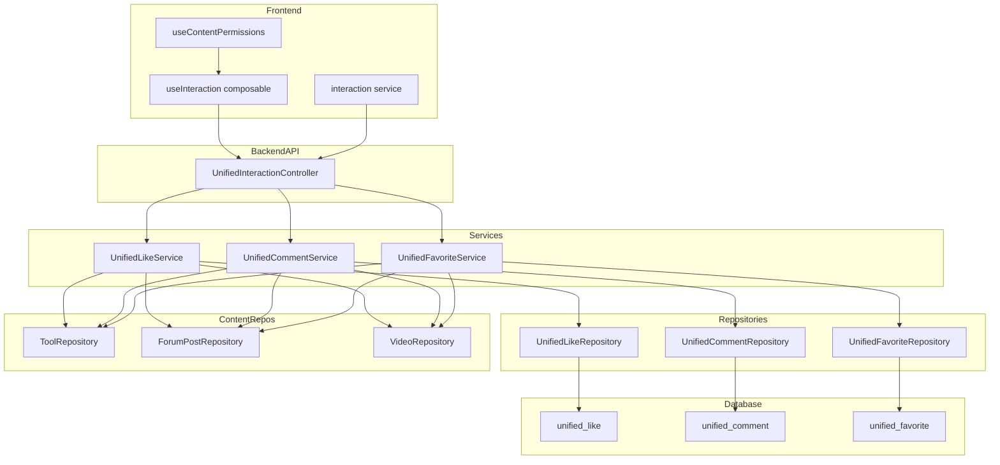
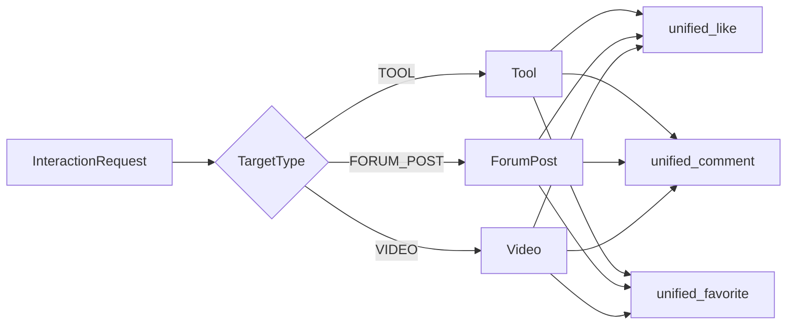
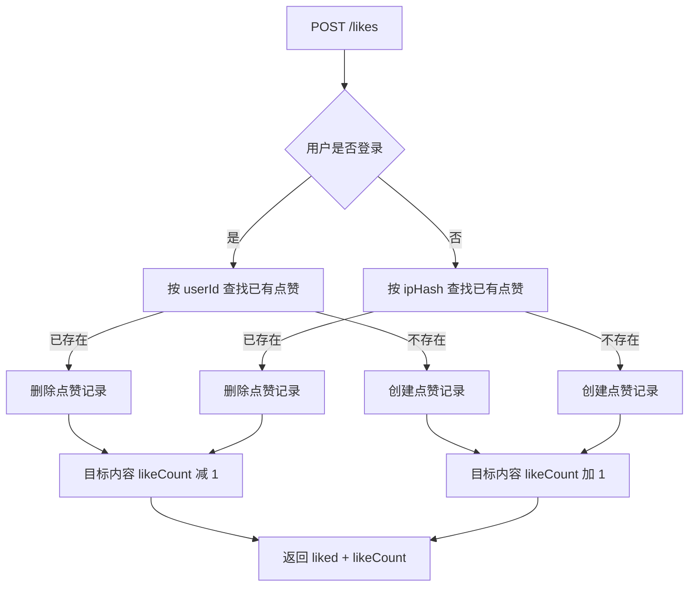
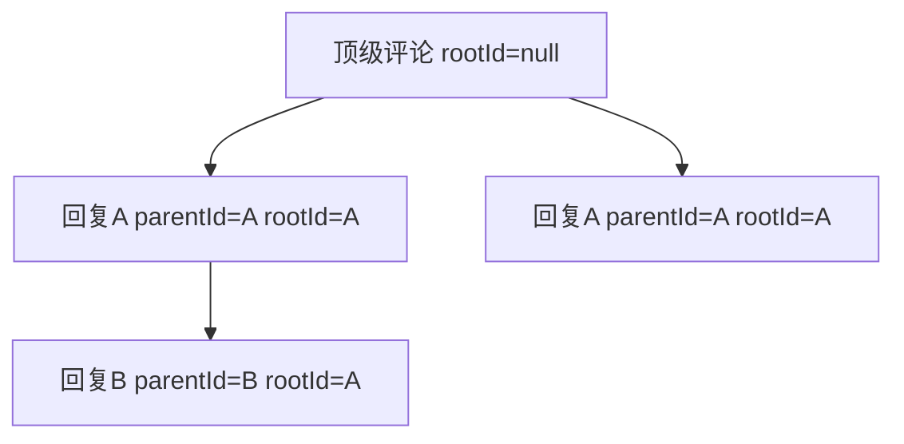
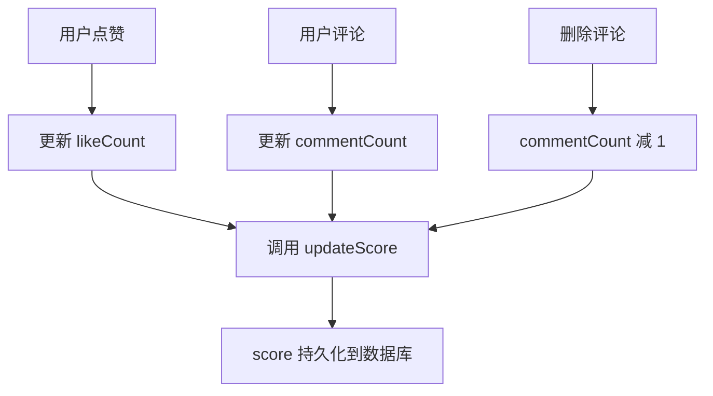

# 统一互动模块

## 1. 模块简介

统一互动模块是 CodingHub 平台的**跨内容类型互动基础设施**，为[工具市场](工具市场.md)、[论坛社区](论坛社区.md)、[微课视频](微课视频.md)三大内容模块提供统一的**点赞**、**评论**、**收藏**能力。该模块通过 `TargetType` 枚举实现多态设计，用一套 API、三张数据表替代了原先各模块独立的互动系统（`ToolLike`、`ToolComment`、`ForumLike`、`ForumComment`、`PostFavorite` 等），大幅降低了重复代码和维护成本。

### 核心功能一览

| 功能 | 支持登录用户 | 支持匿名用户 | 需要登录 |
|------|:----------:|:----------:|:-------:|
| 点赞 / 取消点赞 | ✅ | ✅（IP hash） | ❌ |
| 发表评论 | ✅ | ✅（提供 userName） | ❌ |
| 删除评论 | ✅（所有者或管理员） | ❌ | ✅ |
| 收藏 / 取消收藏 | ✅ | ❌ | ✅ |
| 查看我的收藏列表 | ✅ | ❌ | ✅ |

---

## 2. 架构概览



### API 路由总览

所有接口前缀：`/api/v1/interactions`

| HTTP 方法 | 路径 | 说明 | 认证 |
|-----------|------|------|------|
| `POST` | `/likes` | 切换点赞状态 | 可选 |
| `GET` | `/likes/status` | 查询点赞状态 | 可选 |
| `POST` | `/comments` | 发表评论（支持嵌套回复） | 可选 |
| `GET` | `/comments` | 分页获取评论列表 | 无需 |
| `DELETE` | `/comments/{id}` | 删除评论 | 必须（所有者/管理员） |
| `POST` | `/favorites` | 切换收藏状态 | 必须 |
| `GET` | `/favorites` | 获取当前用户收藏列表 | 必须 |
| `GET` | `/favorites/status` | 查询收藏状态 | 必须 |

---

## 3. TargetType 多态设计

`TargetType` 是一个枚举类型，定义了统一互动系统可以作用的内容类型：

```java
public enum TargetType {
    TOOL,          // 工具市场中的工具
    FORUM_POST,    // 论坛社区中的帖子
    VIDEO;         // 微课视频中的视频
}
```

### 设计原则



- **统一存储**：三种互动类型（点赞/评论/收藏）各使用一张表，通过 `target_type` + `target_id` 组合定位目标内容。
- **类型安全**：`TargetType.fromString()` 方法对输入字符串做大小写无关校验，非法值抛出 `BusinessException(400)`。
- **扩展友好**：新增内容类型只需在枚举中添加新值，并在各 Service 的 `switch` 分支中添加对应处理逻辑。
- **软删除感知**：每种目标类型在查询时均校验 `status` 字段，已删除的内容（`DELETED` 状态）不允许互动。

---

## 4. 点赞 Toggle 机制

### 核心流程



### IP Hash 匿名去重

对于未登录用户，系统通过 **SHA-256 IP 哈希** 实现去重：

1. **获取 IP**：优先读取 `X-Forwarded-For` 头（支持反向代理），否则使用 `request.getRemoteAddr()`。
2. **计算哈希**：对 IP 字符串计算 SHA-256，输出 64 位十六进制字符串。
3. **隐私保护**：数据库中仅存储哈希值，不保存原始 IP。

### 数据库唯一约束

`unified_like` 表设置了两组唯一约束，确保同一用户对同一目标不会重复点赞：

| 约束名 | 列组合 | 适用场景 |
|--------|--------|----------|
| `uk_like_user` | `target_type, target_id, user_id` | 登录用户 |
| `uk_like_anon` | `target_type, target_id, ip_hash` | 匿名用户 |

索引 `idx_like_target` 覆盖 `(target_type, target_id)`，加速目标内容的点赞查询。

---

## 5. 评论系统

### 评论数据模型

`unified_comment` 表的关键字段：

| 字段 | 类型 | 说明 |
|------|------|------|
| `target_type` | VARCHAR(20) | 目标内容类型（TOOL/FORUM_POST/VIDEO） |
| `target_id` | BIGINT | 目标内容 ID |
| `user_id` | BIGINT | 评论者用户 ID（登录用户） |
| `user_name` | VARCHAR(50) | 评论者昵称（匿名用户） |
| `parent_id` | BIGINT | 直接父评论 ID（嵌套回复时使用） |
| `root_id` | BIGINT | 根评论 ID（用于线程化展示） |
| `content` | TEXT | 评论内容（经 XSS 过滤） |
| `like_count` | INT | 评论自身的点赞数 |

### 嵌套回复机制

评论支持两级嵌套（父-子结构），通过 `parentId` 和 `rootId` 实现：



- **顶级评论**：`parentId = null`，`rootId = null`
- **一级回复**：`parentId = 被回复评论ID`，`rootId = 被回复评论ID`（若被回复的是顶级评论）
- **深层回复**：`parentId = 被回复评论ID`，`rootId = 继承自父评论的 rootId`

### XSS 安全防护

所有评论内容在入库前经过 `XssSanitizer.sanitize()` 处理，过滤潜在的跨站脚本攻击载荷。这是项目全局的安全约束。

### 分页查询

评论列表使用 Spring Data 分页查询，按 `createdAt` 升序排列：

- 默认每页 20 条
- 最大每页 100 条（服务端强制限制 `Math.min(size, 100)`）
- 返回 `PageResponse<InteractionResponse>`，包含 `totalElements`、`totalPages`、`page`、`size`

### 删除权限

评论删除遵循 **所有者或管理员** 权限模型：

```
isOwner = comment.userId == currentUserId
isAdmin = currentUser.role in [ADMIN, SUPER_ADMIN]
允许删除 = isOwner || isAdmin
```

不满足条件时抛出 `ForbiddenException`。删除时同步递减目标实体的 `commentCount`。

---

## 6. 收藏功能

### 与点赞的区别

| 维度 | 点赞 | 收藏 |
|------|------|------|
| 匿名用户 | 支持（IP hash） | 不支持，必须登录 |
| Toggle 机制 | 相同 | 相同 |
| 列表查询 | 无 | 支持按类型分页查看我的收藏 |
| 返回内容 | `liked` + `likeCount` | `favorited` |

### 收藏列表的多态返回

`GET /favorites?targetType=TOOL` 接口根据目标类型返回不同的 DTO：

| targetType | 返回 DTO | 包含字段 |
|------------|----------|----------|
| `TOOL` | `ToolSummaryDTO` | id, name, version, categoryName, categoryIcon, uploader 信息 |
| `FORUM_POST` | `ForumPostSummaryDTO` | id, title, authorId, authorNickname, viewCount, likeCount, commentCount |
| `VIDEO` | `VideoListItem` | id, title, coverUrl, duration, viewCount, likeCount, commentCount, uploader 信息 |

收藏列表过滤已删除内容（`status != NORMAL` 的记录不会返回），并使用 `Hibernate.initialize()` 确保懒加载关联对象正确初始化。

### 数据库约束

`unified_favorite` 表通过唯一约束 `uk_fav`（`user_id, target_type, target_id`）保证每个用户对同一目标只能收藏一次。

---

## 7. 评分联动机制

### updateScore 算法

当用户点赞或评论时，系统自动触发目标内容的评分重算。[工具市场](工具市场.md)的 `Tool` 和[论坛社区](论坛社区.md)的 `ForumPost` 均采用相同的加权公式：

```
score = viewCount x 1 + likeCount x 3 + commentCount x 5
```

| 指标 | 权重 | 说明 |
|------|:----:|------|
| viewCount | x1 | 浏览量的基础分 |
| likeCount | x3 | 点赞的高权重贡献 |
| commentCount | x5 | 评论的最高权重，体现深度互动 |

### 触发时机



具体触发点：

| 互动操作 | Tool 评分 | ForumPost 评分 | Video 评分 |
|----------|:---------:|:--------------:|:----------:|
| 点赞/取消点赞 | ✅ `Tool.updateScore()` | ✅ `ForumPost.updateScore()` | ❌ 无评分 |
| 添加评论 | ✅ `Tool.updateScore()` | ✅ `ForumPost.updateScore()` | ❌ 无评分 |
| 删除评论 | ✅ `Tool.updateScore()` | ✅ `ForumPost.updateScore()` | ❌ 无评分 |

**注意**：[微课视频](微课视频.md)的 `Video` 模型目前未实现 `updateScore` 方法，互动操作仅更新 `likeCount` / `commentCount` 计数，不涉及评分计算。

---

## 8. 前端设计

### interaction.ts — API 服务层

位于 `frontend/src/services/interaction.ts`，封装了所有统一互动的 HTTP 请求：

```typescript
export type TargetType = 'TOOL' | 'FORUM_POST' | 'VIDEO'

export const interactionApi = {
  toggleLike,       // POST /interactions/likes
  getLikeStatus,    // GET  /interactions/likes/status
  getComments,      // GET  /interactions/comments
  addComment,       // POST /interactions/comments
  deleteComment,    // DELETE /interactions/comments/:id
  toggleFavorite,   // POST /interactions/favorites
  getMyFavorites,   // GET  /interactions/favorites
  getFavoriteStatus // GET  /interactions/favorites/status
}
```

### useInteraction — 核心 Composable

位于 `frontend/src/composables/useInteraction.ts`，为任意内容页面提供一站式互动状态管理：

```typescript
const {
  // 点赞
  liked, likeCount, likeLoading,
  loadLikeStatus, toggleLike,
  // 收藏
  favorited, favoriteLoading,
  loadFavoriteStatus, toggleFavorite,
  // 评论
  comments, commentsTotalElements, commentsTotalPages,
  commentsPage, commentsLoading, commentSubmitting,
  loadComments, addComment, deleteComment
} = useInteraction('TOOL', toolId)
```

**设计特点**：

- **参数化复用**：通过 `(targetType, targetId)` 参数，同一 composable 可用于工具详情页、帖子详情页、视频播放页。
- **防抖保护**：`likeLoading` 和 `favoriteLoading` 防止用户快速重复点击。
- **自动刷新**：`addComment` 和 `deleteComment` 操作后自动重新加载当前页评论。
- **错误容忍**：`loadFavoriteStatus` 对未登录用户静默失败，不抛出错误。

### useContentPermissions — 权限判断

位于 `frontend/src/composables/useContentPermissions.ts`，判断当前用户是否有权编辑/删除内容：

```typescript
const { canEdit, canDelete } = useContentPermissions(() => tool.uploaderId)
```

权限规则：`userId === ownerId || authStore.isAdmin`。该 composable 与互动模块配合使用，在 UI 层面控制删除按钮的可见性。

---

## 9. 数据模型与数据库表

### unified_like

| 列名 | 类型 | 约束 | 说明 |
|------|------|------|------|
| `id` | BIGINT | PK, AUTO_INCREMENT | 主键 |
| `target_type` | VARCHAR(20) | NOT NULL | 目标类型 |
| `target_id` | BIGINT | NOT NULL | 目标 ID |
| `user_id` | BIGINT | 可空 | 登录用户 ID |
| `ip_hash` | VARCHAR(64) | 可空 | 匿名用户 IP 哈希 |
| `created_at` | DATETIME | — | 创建时间 |

### unified_comment

| 列名 | 类型 | 约束 | 说明 |
|------|------|------|------|
| `id` | BIGINT | PK, AUTO_INCREMENT | 主键 |
| `target_type` | VARCHAR(20) | NOT NULL | 目标类型 |
| `target_id` | BIGINT | NOT NULL | 目标 ID |
| `user_id` | BIGINT | 可空 | 评论者用户 ID |
| `user_name` | VARCHAR(50) | 可空 | 匿名评论者昵称 |
| `parent_id` | BIGINT | 可空 | 父评论 ID |
| `root_id` | BIGINT | 可空 | 根评论 ID |
| `content` | TEXT | NOT NULL | 评论内容 |
| `like_count` | INT | 默认 0 | 评论点赞数 |
| `created_at` | DATETIME | — | 创建时间 |
| `updated_at` | DATETIME | — | 更新时间 |

### unified_favorite

| 列名 | 类型 | 约束 | 说明 |
|------|------|------|------|
| `id` | BIGINT | PK, AUTO_INCREMENT | 主键 |
| `target_type` | VARCHAR(20) | NOT NULL | 目标类型 |
| `target_id` | BIGINT | NOT NULL | 目标 ID |
| `user_id` | BIGINT | NOT NULL | 用户 ID |
| `created_at` | DATETIME | — | 创建时间 |

---

## 10. DTO 设计

### InteractionRequest（请求体）

```java
public class InteractionRequest {
    @NotBlank String targetType;  // 必填：TOOL / FORUM_POST / VIDEO
    @NotNull  Long targetId;      // 必填：目标内容 ID
    String content;               // 评论专用：评论内容
    Long parentId;                // 评论专用：父评论 ID
    String userName;              // 评论专用：匿名用户昵称
}
```

该 DTO 统一了点赞、评论、收藏三种操作的请求参数，非必需字段按操作类型忽略。

### InteractionResponse（响应体）

```java
@JsonInclude(JsonInclude.Include.NON_NULL)
public class InteractionResponse {
    // 点赞响应
    Boolean liked;
    Integer likeCount;
    // 收藏响应
    Boolean favorited;
    // 评论响应
    Long id;
    String targetType, content, userName, userNickname, userAvatarUrl;
    Long targetId, userId, parentId, rootId;
    Integer commentLikeCount;
    LocalDateTime createdAt;
}
```

通过 `@JsonInclude(NON_NULL)` 注解，不同类型的响应仅序列化相关字段，避免冗余的 null 值。

工厂方法：
- `InteractionResponse.likeToggle(liked, likeCount)` — 构造点赞响应
- `InteractionResponse.favoriteToggle(favorited)` — 构造收藏响应

---

## 11. 与旧版独立互动系统的关系

### 历史背景

在统一互动模块引入之前，各内容模块各自维护独立的互动实体和接口：

| 旧模块 | 旧实体 | 旧接口 |
|--------|--------|--------|
| [工具市场](工具市场.md) | `ToolLike`, `ToolComment` | `/api/v1/tools/{id}/like`, `/api/v1/tools/{id}/comments` |
| [论坛社区](论坛社区.md) | `ForumLike`, `ForumComment` | `/api/forum/likes`, 帖子评论接口 |
| 帖子收藏 | `PostFavorite` | `/api/v1/post-favorites` |

### 迁移状态

当前项目中，旧版实体类（`ToolLike`、`ToolComment`、`PostFavorite`、`ForumLike`、`ForumComment`）仍然存在于代码库中，但新的互动操作已统一走 `/api/v1/interactions` 路由。前端新页面应使用 `useInteraction` composable 和 `interactionApi`，不应再调用旧版接口。

### 迁移建议

1. **新页面**：一律使用统一互动 API。
2. **旧页面**：逐步将旧版互动组件替换为 `useInteraction`。
3. **数据迁移**：如需将旧表数据合并到 `unified_like` / `unified_comment` / `unified_favorite`，需编写一次性迁移脚本。
4. **清理**：待所有前端页面迁移完成后，移除旧版实体、Repository、Service 和 Controller 接口。

---

## 12. 关键源文件索引

### 后端

| 文件 | 路径 | 职责 |
|------|------|------|
| UnifiedInteractionController | `controller/UnifiedInteractionController.java` | REST API 入口，8 个端点 |
| UnifiedLikeService | `service/UnifiedLikeService.java` | 点赞 toggle、状态查询、计数更新 |
| UnifiedCommentService | `service/UnifiedCommentService.java` | 评论增删查、XSS 过滤、计数更新 |
| UnifiedFavoriteService | `service/UnifiedFavoriteService.java` | 收藏 toggle、收藏列表、多态 DTO 构建 |
| UnifiedLike | `model/UnifiedLike.java` | 点赞实体，双唯一约束 |
| UnifiedComment | `model/UnifiedComment.java` | 评论实体，支持嵌套回复 |
| UnifiedFavorite | `model/UnifiedFavorite.java` | 收藏实体，仅登录用户 |
| TargetType | `model/TargetType.java` | 目标类型枚举（TOOL/FORUM_POST/VIDEO） |
| InteractionRequest | `dto/InteractionRequest.java` | 统一请求 DTO |
| InteractionResponse | `dto/InteractionResponse.java` | 统一响应 DTO，NON_NULL 序列化 |

### 前端

| 文件 | 路径 | 职责 |
|------|------|------|
| interaction.ts | `services/interaction.ts` | API 服务封装，类型定义 |
| useInteraction.ts | `composables/useInteraction.ts` | 互动状态管理 composable |
| useContentPermissions.ts | `composables/useContentPermissions.ts` | 内容权限判断 composable |

---

## 13. 扩展指南

如需支持新的内容类型（如「教程」模块），只需：

1. 在 `TargetType` 枚举中新增 `TUTORIAL` 值，并更新 `VALID_VALUES`
2. 在三个 Service 的 `validateTargetExists`、`updateLikeCount`、`incrementCommentCount` 等方法中增加对应的 `switch` 分支
3. 在 `UnifiedFavoriteService` 中增加 `buildTutorialFavorites` 方法
4. 前端 `TargetType` 类型中添加 `'TUTORIAL'`

无需新建表、Controller 或 API 端点。

---

## 14. 交叉引用

- [工具市场](工具市场.md) — `Tool` 实体的 `incrementLikeCount()`、`incrementCommentCount()`、`updateScore()` 方法由统一互动模块调用
- [论坛社区](论坛社区.md) — `ForumPost` 实体的 `updateScore()` 在点赞/评论时自动触发，影响帖子排序
- [微课视频](微课视频.md) — `Video` 实体的计数器由统一互动模块更新，但暂未接入评分系统
