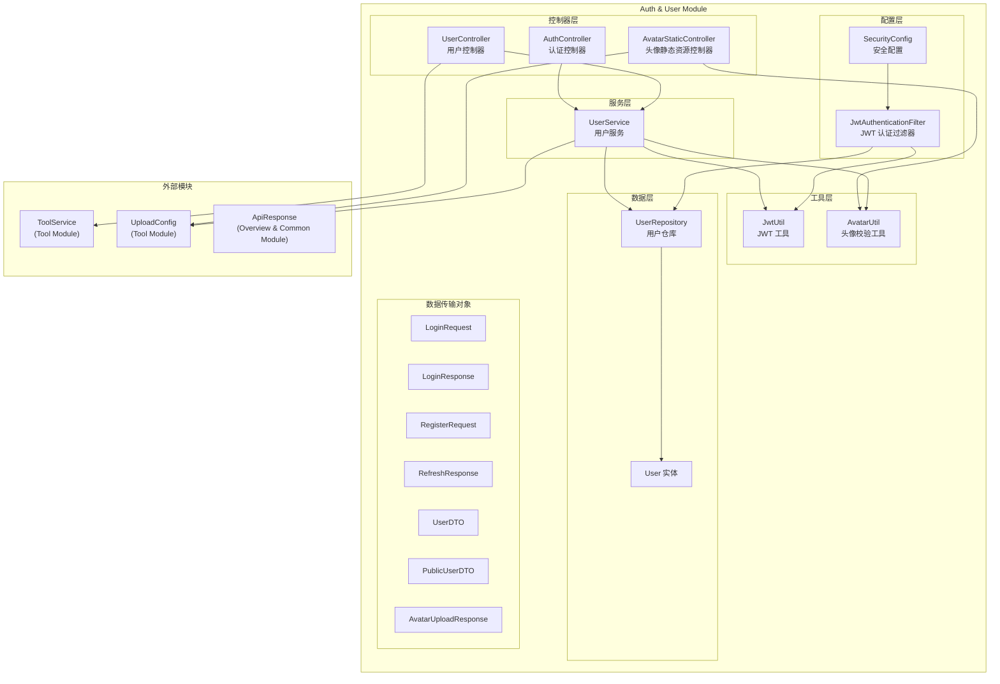
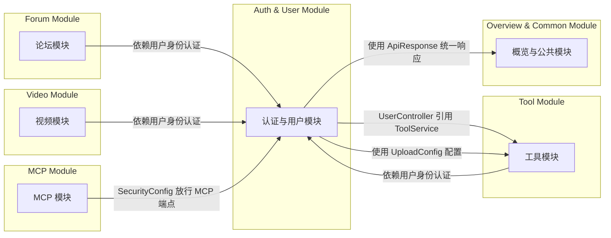
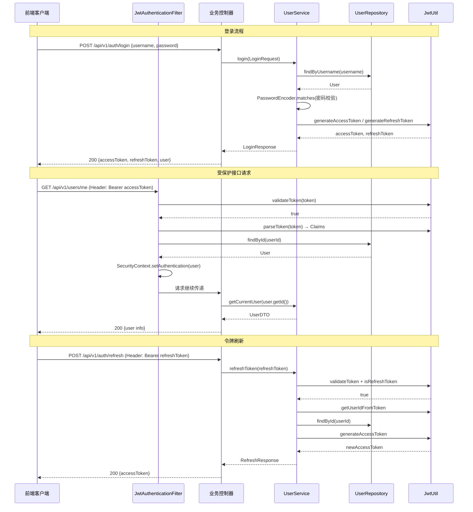
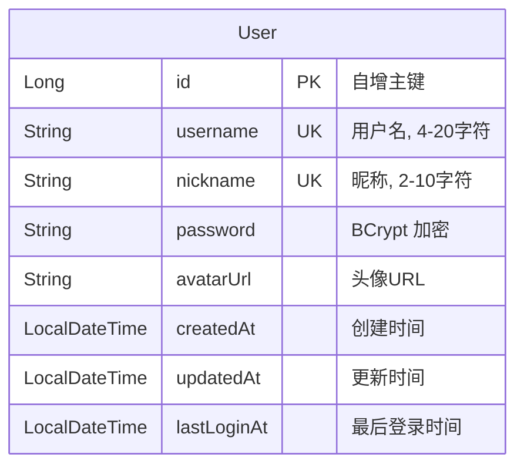

# Auth & User Module（认证与用户模块）

## 1. 模块简介

认证与用户模块是 IAIHub Toolbox 平台的核心基础模块，负责用户身份认证、授权、用户信息管理以及头像文件管理。该模块为平台中的所有其他业务模块（工具模块、论坛模块、视频模块等）提供统一的身份验证和用户信息支撑。

### 核心职责

| 职责 | 说明 |
|------|------|
| 用户注册与登录 | 支持用户名/密码注册和登录，返回 JWT 令牌 |
| 令牌管理 | 基于 JWT 的 Access Token / Refresh Token 双令牌机制 |
| 请求认证 | 通过 JWT 过滤器对受保护接口进行身份验证 |
| 安全配置 | Spring Security 统一安全策略，CORS 跨域配置 |
| 用户信息管理 | 当前用户信息查询、公开用户资料查询 |
| 头像管理 | 头像上传、删除、静态资源服务 |

## 2. 架构概览



## 3. 子模块划分

本模块按职责划分为三个子模块，各子模块详细文档如下：

### 3.1 认证子模块（Authentication）

负责用户注册、登录、令牌刷新以及全局安全配置。包含 JWT 令牌的生成、验证和请求过滤机制。

- **核心组件**：`AuthController`、`UserService`（认证相关方法）、`JwtUtil`、`JwtAuthenticationFilter`、`SecurityConfig`
- **数据对象**：`LoginRequest`、`LoginResponse`、`RegisterRequest`、`RefreshResponse`
- **详细文档**：[认证子模块.md](认证子模块.md)

### 3.2 用户管理子模块（User Management）

负责用户信息查询、公开资料展示以及用户与工具的关联查询。

- **核心组件**：`UserController`、`UserService`（用户信息相关方法）、`User`、`UserRepository`
- **数据对象**：`UserDTO`、`PublicUserDTO`
- **详细文档**：[用户管理子模块.md](用户管理子模块.md)

### 3.3 头像管理子模块（Avatar Management）

负责头像文件的上传、删除、校验和静态资源服务，包含路径安全防护。

- **核心组件**：`AvatarStaticController`、`AvatarUtil`、`UserService`（头像相关方法）
- **数据对象**：`AvatarUploadResponse`
- **详细文档**：[头像管理子模块.md](头像管理子模块.md)

## 4. 模块间依赖关系



### 依赖说明

| 依赖方向 | 说明 |
|----------|------|
| → Tool Module | `UserController` 注入 `ToolService` 以查询当前用户的工具列表；`UploadConfig` 提供头像上传目录和文件大小限制配置 |
| → Overview & Common Module | 使用 `ApiResponse` 统一响应封装格式 |
| Tool/Forum/Video → 本模块 | 其他业务模块依赖本模块提供的 JWT 认证机制，通过 `@AuthenticationPrincipal User` 获取当前登录用户 |
| MCP → 本模块 | `SecurityConfig` 中对 `/mcp/**` 和 `/sse` 端点进行放行配置 |

## 5. API 端点概览

### 认证端点（`/api/v1/auth`）

| 方法 | 路径 | 认证 | 说明 |
|------|------|------|------|
| POST | `/api/v1/auth/register` | 否 | 用户注册，返回令牌和用户信息 |
| POST | `/api/v1/auth/login` | 否 | 用户登录，返回令牌和用户信息 |
| POST | `/api/v1/auth/refresh` | 否（需 Refresh Token） | 刷新 Access Token |

### 用户端点（`/api/v1/users`）

| 方法 | 路径 | 认证 | 说明 |
|------|------|------|------|
| GET | `/api/v1/users/me` | 是 | 获取当前登录用户信息 |
| GET | `/api/v1/users/me/tools` | 是 | 获取当前用户的工具列表（分页） |
| POST | `/api/v1/users/me/avatar` | 是 | 上传头像（multipart/form-data） |
| DELETE | `/api/v1/users/me/avatar` | 是 | 删除头像 |
| GET | `/api/v1/users/{id}` | 否 | 获取指定用户的公开资料 |

### 头像静态资源端点（`/api/v1/static/avatars`）

| 方法 | 路径 | 认证 | 说明 |
|------|------|------|------|
| GET | `/api/v1/static/avatars/{userId}` | 否 | 获取用户头像图片 |

## 6. 认证流程



## 7. 安全策略

### JWT 双令牌机制

| 令牌类型 | 用途 | 过期时间配置 | Claims |
|----------|------|-------------|--------|
| Access Token | 接口认证 | `app.jwt.access-token-expiration` | `subject=userId`, `email`, `type=access` |
| Refresh Token | 刷新 Access Token | `app.jwt.refresh-token-expiration` | `subject=userId`, `email`, `type=refresh` |

### Spring Security 配置要点

- **CSRF**：已禁用（无状态 REST API）
- **Session**：`STATELESS`（不创建 HTTP Session）
- **CORS**：允许所有来源、标准 HTTP 方法、所有请求头，支持凭证
- **密码加密**：`BCryptPasswordEncoder`
- **公开端点**：`/api/v1/auth/**`、工具/视频的 GET 请求、头像静态资源、公开用户资料、MCP 端点
- **认证过滤器**：`JwtAuthenticationFilter` 在 `UsernamePasswordAuthenticationFilter` 之前执行

## 8. 数据模型

### User 实体



### DTO 对比

| DTO | 用途 | 包含字段 |
|-----|------|---------|
| `LoginResponse.UserDTO` | 登录/注册响应 | id, username, nickname, avatarUrl |
| `UserDTO` | 当前用户完整信息 | id, username, nickname, avatarUrl, createdAt, lastLoginAt |
| `PublicUserDTO` | 公开用户资料 | id, username, nickname, avatarUrl, createdAt |

## 9. 前端类型定义

前端 TypeScript 类型定义位于 `frontend/src/types/index.ts`：

```typescript
export interface User {
  id: number
  username: string
  nickname?: string
  avatarUrl?: string | null
  createdAt?: string
  lastLoginAt?: string
}

export interface LoginRequest {
  username: string
  password: string
}

export interface RegisterRequest {
  username: string
  nickname: string
  password: string
}
```

## 10. 异常处理

本模块使用的自定义异常（继承自 `BusinessException`）：

| 异常类 | HTTP 状态码 | 使用场景 |
|--------|------------|---------|
| `UnauthorizedException` | 401 | 登录失败、无效令牌、用户不存在 |
| `DuplicateResourceException` | 409 | 用户名或昵称已被注册 |
| `UserNotFoundException` | 404 | 用户 ID 不存在 |
| `AvatarValidationException` | 400 | 头像文件校验失败（格式、大小、路径安全） |
