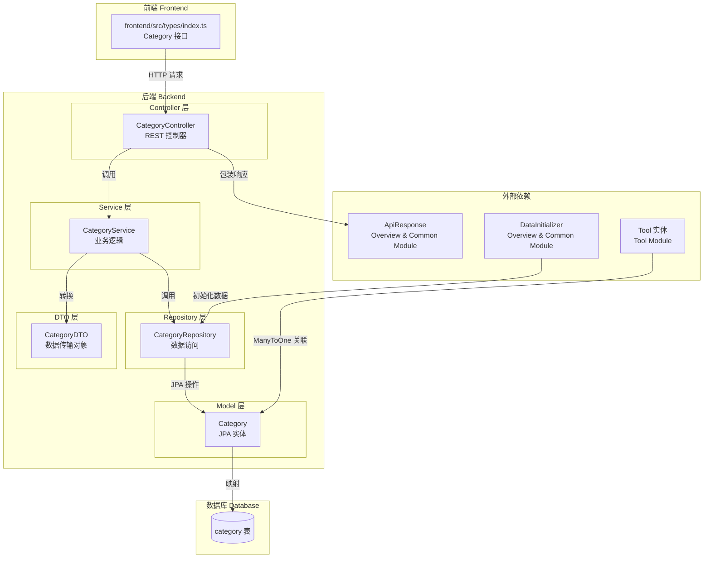
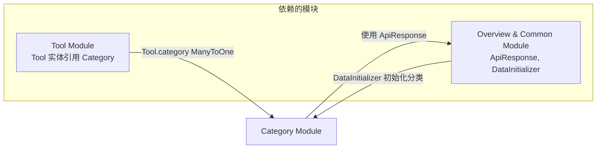
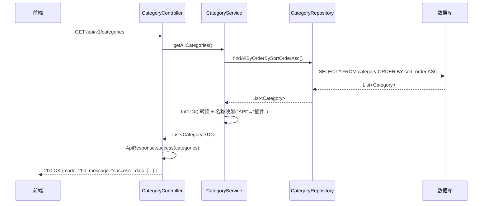
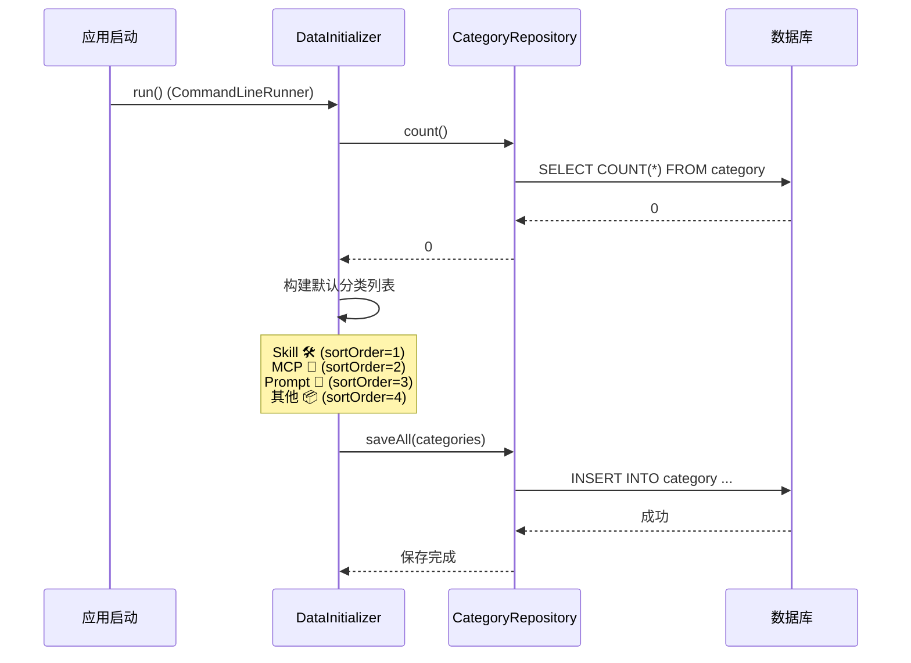

# 分类模块 (Category Module)

## 1. 模块简介

分类模块（Category Module）是工具广场平台的基础支撑模块，负责管理工具的分类体系。它为 [Tool Module](Tool%20Module.md) 中的工具提供分类标签功能，使用户能够按类别浏览和检索工具。该模块采用经典的 Spring Boot 分层架构，提供分类数据的查询接口，并在系统启动时通过 [Overview & Common Module](Overview%20%26%20Common%20Module.md) 中的 `DataInitializer` 自动初始化默认分类数据。

## 2. 架构概览

### 2.1 分层架构图



### 2.2 模块依赖关系



## 3. 核心组件

### 3.1 CategoryController — 分类控制器

| 属性 | 值 |
|------|-----|
| **文件路径** | `backend/src/main/java/com/iaihub/toolbox/controller/CategoryController.java` |
| **请求基路径** | `/api/v1/categories` |
| **依赖** | `CategoryService` |

提供分类查询的 REST API 接口：

| HTTP 方法 | 路径 | 描述 | 返回值 |
|-----------|------|------|--------|
| `GET` | `/api/v1/categories` | 获取所有分类列表（按排序字段升序排列） | `ApiResponse<List<CategoryDTO>>` |

> **说明**：响应体使用 [Overview & Common Module](Overview%20%26%20Common%20Module.md) 中的 `ApiResponse` 进行统一包装，包含 `code`、`message` 和 `data` 三个字段。

### 3.2 CategoryService — 分类服务

| 属性 | 值 |
|------|-----|
| **文件路径** | `backend/src/main/java/com/iaihub/toolbox/service/CategoryService.java` |
| **依赖** | `CategoryRepository` |

核心方法：

| 方法 | 描述 |
|------|------|
| `getAllCategories()` | 获取所有分类，按 `sortOrder` 升序排列，返回 `List<CategoryDTO>` |
| `toDTO(Category)` | （私有）将 `Category` 实体转换为 `CategoryDTO`，包含名称映射逻辑 |

**特殊业务逻辑**：在 `toDTO` 方法中，会将分类名称 `"API"` 统一映射为 `"插件"`，实现前端展示名称的动态转换，而数据库中仍保留原始名称。

### 3.3 Category — 分类实体

| 属性 | 值 |
|------|-----|
| **文件路径** | `backend/src/main/java/com/iaihub/toolbox/model/Category.java` |
| **表名** | `category` |
| **注解** | `@Entity`, `@Data`, `@Builder` |

字段定义：

| 字段名 | 类型 | 约束 | 描述 |
|--------|------|------|------|
| `id` | `Long` | 主键，自增 | 分类唯一标识 |
| `name` | `String` | 非空，唯一，最大50字符 | 分类名称 |
| `icon` | `String` | 最大255字符 | 分类图标（Emoji 或 URL） |
| `sortOrder` | `Integer` | 非空，默认0 | 排序权重（升序） |
| `createdAt` | `LocalDateTime` | 非空，不可更新 | 创建时间（`@PrePersist` 自动设置） |

**实体关系**：`Category` 被 [Tool Module](Tool%20Module.md) 中的 `Tool` 实体以 `@ManyToOne` 关联，一个分类可以包含多个工具。

### 3.4 CategoryRepository — 分类数据访问层

| 属性 | 值 |
|------|-----|
| **文件路径** | `backend/src/main/java/com/iaihub/toolbox/repository/CategoryRepository.java` |
| **继承** | `JpaRepository<Category, Long>` |

自定义查询方法：

| 方法 | 描述 |
|------|------|
| `findAllByOrderBySortOrderAsc()` | 查询所有分类，按 `sortOrder` 升序排列 |

### 3.5 CategoryDTO — 分类数据传输对象

| 属性 | 值 |
|------|-----|
| **文件路径** | `backend/src/main/java/com/iaihub/toolbox/dto/CategoryDTO.java` |
| **注解** | `@Data`, `@Builder` |

字段定义：

| 字段名 | 类型 | 描述 |
|--------|------|------|
| `id` | `Long` | 分类唯一标识 |
| `name` | `String` | 分类名称（可能经过映射转换） |
| `icon` | `String` | 分类图标 |
| `sortOrder` | `Integer` | 排序权重 |

### 3.6 前端类型定义 — Category 接口

| 属性 | 值 |
|------|-----|
| **文件路径** | `frontend/src/types/index.ts` |

```typescript
export interface Category {
  id: number
  name: string
  icon: string
  sortOrder: number
}
```

前端 `Category` 接口与后端 `CategoryDTO` 字段一一对应，用于类型安全的数据交互。

## 4. 数据流与处理流程

### 4.1 获取分类列表流程



### 4.2 系统启动时的分类数据初始化



> **说明**：默认分类数据由 [Overview & Common Module](Overview%20%26%20Common%20Module.md) 中的 `DataInitializer` 在应用首次启动时自动创建。默认包含 4 个分类：Skill、MCP、Prompt、其他。

## 5. 与其他模块的关系

| 关联模块 | 关系描述 |
|----------|----------|
| [Tool Module](Tool%20Module.md) | `Tool` 实体通过 `@ManyToOne` 关联 `Category`，每个工具必须归属于一个分类。工具的创建（`CreateToolRequest`）和更新（`UpdateToolRequest`）都需要指定 `categoryId`。 |
| [Overview & Common Module](Overview%20%26%20Common%20Module.md) | 提供 `ApiResponse` 统一响应包装；`DataInitializer` 负责分类数据的初始化。 |

## 6. API 接口示例

### 请求

```http
GET /api/v1/categories
```

### 响应

```json
{
  "code": 200,
  "message": "success",
  "data": [
    {
      "id": 1,
      "name": "Skill",
      "icon": "🛠️",
      "sortOrder": 1
    },
    {
      "id": 2,
      "name": "MCP",
      "icon": "🔌",
      "sortOrder": 2
    },
    {
      "id": 3,
      "name": "Prompt",
      "icon": "💬",
      "sortOrder": 3
    },
    {
      "id": 4,
      "name": "其他",
      "icon": "📦",
      "sortOrder": 4
    }
  ]
}
```

## 7. 设计说明

### 7.1 名称映射机制

`CategoryService.toDTO()` 方法中包含一个名称映射规则：将数据库中存储的 `"API"` 分类名称在返回给前端时转换为 `"插件"`。这一设计使得：

- **数据库层**：保留原始的、技术性的分类名称，便于维护和迁移
- **展示层**：向用户展示更友好的中文名称
- **扩展性**：未来可通过配置化或数据库映射表来替代硬编码逻辑

### 7.2 排序机制

分类通过 `sortOrder` 字段实现自定义排序，数值越小排列越靠前。`CategoryRepository.findAllByOrderBySortOrderAsc()` 方法确保分类列表始终按此字段升序返回，保证前端展示的一致性。

### 7.3 只读设计

当前模块仅提供查询接口（`GET`），不包含分类的创建、更新和删除操作。分类数据的管理通过 `DataInitializer` 在系统启动时自动完成，简化了运维流程。如需动态管理分类，可在此基础上扩展 CRUD 接口。
