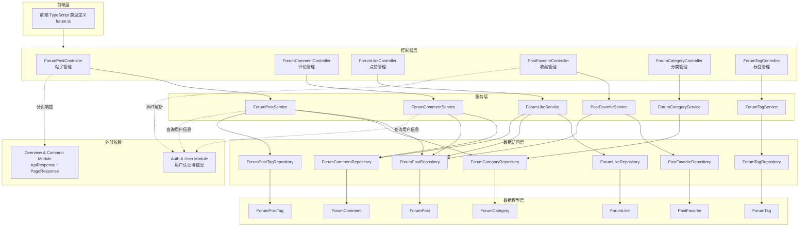
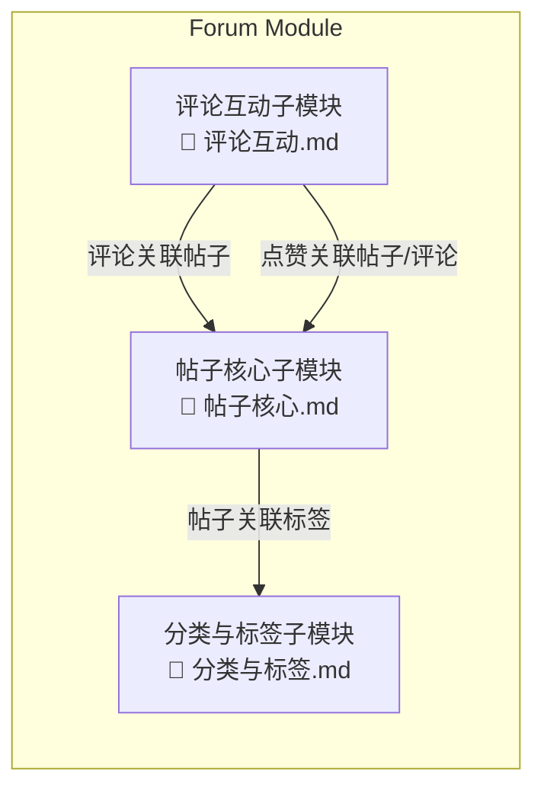
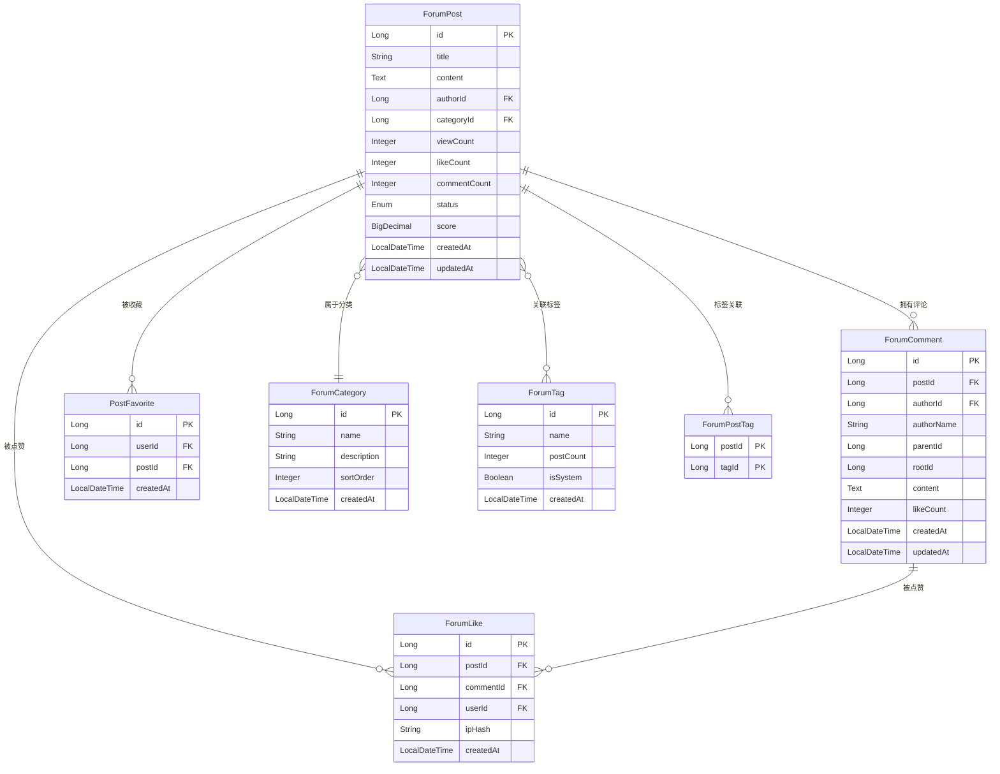
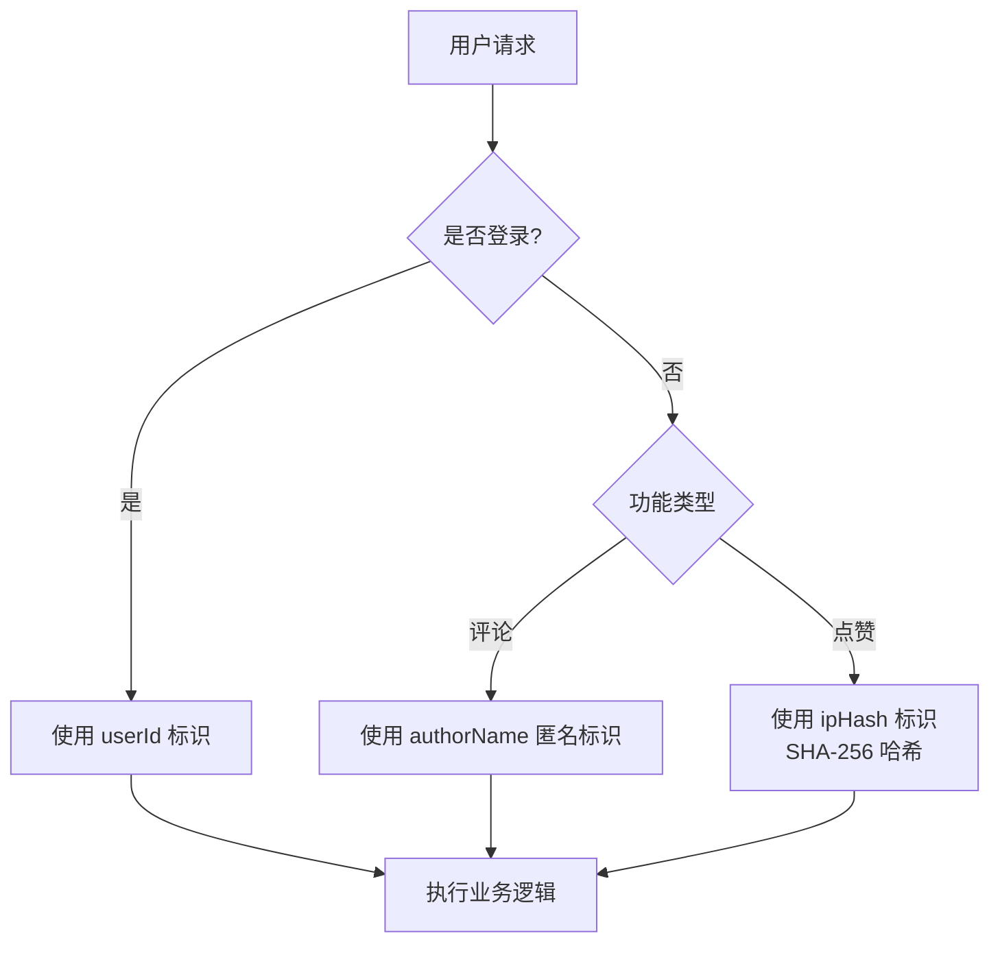
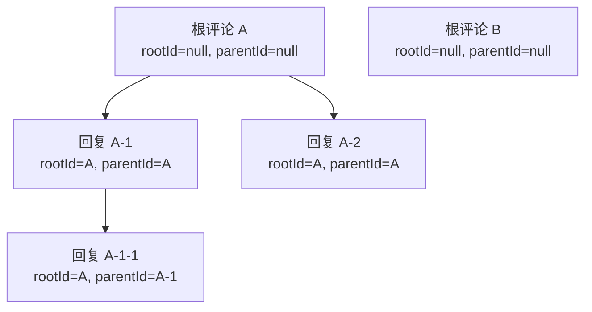

# Forum Module（论坛模块）

## 1. 模块简介

Forum Module 是 IAIHub Toolbox 平台的社区论坛核心模块，提供完整的帖子发布、评论互动、点赞收藏、分类标签等功能。该模块采用 Spring Boot 分层架构，支持登录用户与匿名用户的双重交互模式，是平台用户交流与知识分享的核心载体。

### 核心功能

| 功能领域 | 说明 |
|---------|------|
| 帖子管理 | 帖子的创建、编辑、删除、列表查询、详情查看、搜索 |
| 评论系统 | 支持一级评论与多级回复，匿名/登录用户均可评论 |
| 点赞系统 | 支持帖子和评论点赞，登录用户与匿名用户（IP哈希）均可参与 |
| 收藏功能 | 登录用户可收藏帖子，查看收藏列表 |
| 分类管理 | 论坛帖子分类，支持排序展示 |
| 标签系统 | 帖子标签管理，支持热门标签推荐 |

## 2. 架构概览

### 2.1 整体架构图



### 2.2 子模块划分

Forum Module 按功能职责划分为三个子模块：



| 子模块 | 文档 | 说明 |
|--------|------|------|
| 帖子核心子模块 | [帖子核心.md](帖子核心.md) | 帖子 CRUD、搜索、帖子-标签关联、收藏功能 |
| 评论互动子模块 | [评论互动.md](评论互动.md) | 评论系统（含多级回复）、点赞系统（帖子/评论） |
| 分类与标签子模块 | [分类与标签.md](分类与标签.md) | 论坛分类管理、标签管理（含热门标签） |

## 3. 数据模型概览

### 3.1 ER 关系图



### 3.2 核心数据模型说明

#### ForumPost（帖子）

帖子的核心实体，包含标题、内容、作者、分类等基本信息，同时维护浏览数、点赞数、评论数等统计字段。帖子具有 **评分机制**（`score`），计算公式为：

```
score = viewCount × 1 + likeCount × 3 + commentCount × 5
```

帖子状态（`ForumPostStatus`）枚举：
- `NORMAL` — 正常状态
- `DELETED` — 已删除（软删除）
- `HIDDEN` — 已隐藏

#### ForumComment（评论）

支持 **两级评论结构**：一级评论的 `parentId` 为空，回复评论通过 `parentId` 指向父评论，`rootId` 指向根评论，便于构建评论树。评论支持匿名发布（`authorName` 字段）和登录用户发布（`authorId` 字段）。

#### ForumLike（点赞）

统一管理帖子和评论的点赞记录。通过 `postId` 或 `commentId` 区分点赞对象，支持登录用户（`userId`）和匿名用户（`ipHash`，SHA-256 哈希后的 IP 地址）两种身份。

#### PostFavorite（收藏）

记录用户对帖子的收藏关系，通过 `user_id` + `post_id` 唯一约束防止重复收藏。

## 4. API 接口总览

### 4.1 帖子管理 API

| 方法 | 路径 | 说明 | 认证 |
|------|------|------|------|
| GET | `/api/forum/posts` | 获取帖子列表（支持分类筛选、关键词搜索、分页） | 否 |
| GET | `/api/forum/posts/my` | 获取当前用户的帖子 | 是 |
| GET | `/api/forum/posts/{id}` | 获取帖子详情（自动增加浏览数） | 否 |
| POST | `/api/forum/posts` | 创建帖子 | 是 |
| PUT | `/api/forum/posts/{id}` | 更新帖子（仅作者） | 是 |
| DELETE | `/api/forum/posts/{id}` | 删除帖子（软删除，仅作者） | 是 |

### 4.2 评论 API

| 方法 | 路径 | 说明 | 认证 |
|------|------|------|------|
| GET | `/api/forum/posts/{postId}/comments` | 获取帖子的评论列表 | 否 |
| POST | `/api/forum/posts/{postId}/comments` | 创建评论/回复 | 可选 |
| DELETE | `/api/forum/comments/{id}` | 删除评论（仅作者） | 是 |

### 4.3 点赞 API

| 方法 | 路径 | 说明 | 认证 |
|------|------|------|------|
| POST | `/api/forum/likes` | 点赞（帖子或评论） | 可选 |
| DELETE | `/api/forum/likes` | 取消点赞（仅帖子） | 可选 |

### 4.4 收藏 API

| 方法 | 路径 | 说明 | 认证 |
|------|------|------|------|
| POST | `/api/v1/post-favorites/{postId}` | 添加收藏 | 是 |
| DELETE | `/api/v1/post-favorites/{postId}` | 取消收藏 | 是 |
| GET | `/api/v1/post-favorites` | 获取用户收藏列表 | 是 |
| GET | `/api/v1/post-favorites/posts` | 获取用户收藏的帖子 | 是 |
| GET | `/api/v1/post-favorites/check/{postId}` | 检查是否已收藏 | 是 |

### 4.5 分类 API

| 方法 | 路径 | 说明 | 认证 |
|------|------|------|------|
| GET | `/api/forum/categories` | 获取所有分类（按排序） | 否 |

### 4.6 标签 API

| 方法 | 路径 | 说明 | 认证 |
|------|------|------|------|
| GET | `/api/forum/tags` | 获取所有标签 | 否 |
| GET | `/api/forum/tags/hot` | 获取热门标签（Top 10） | 否 |
| POST | `/api/forum/tags` | 创建标签 | 是 |

## 5. 关键设计说明

### 5.1 双重身份认证模式

Forum Module 的评论和点赞功能支持 **登录用户** 与 **匿名用户** 两种身份：



- **评论**：匿名用户通过 `authorName` 字段自定义昵称，登录用户自动使用用户信息
- **点赞**：匿名用户通过 IP 地址的 SHA-256 哈希值标识，防止重复点赞
- **收藏**：仅支持登录用户

### 5.2 帖子评分机制

帖子通过 `score` 字段进行热度排序，评分公式为：

```
score = viewCount × 1 + likeCount × 3 + commentCount × 5
```

该评分用于 [Overview & Common Module](Overview%20%26%20Common%20Module.md) 中的帖子排行榜（`PostRankDto`）展示。

### 5.3 软删除策略

帖子删除采用 **软删除** 机制，将状态设置为 `DELETED` 而非物理删除，保留数据完整性。查询时通过 `ForumPostStatus.NORMAL` 过滤，确保已删除帖子不会出现在列表中。

### 5.4 评论树结构

评论系统通过 `parentId` 和 `rootId` 两个字段构建评论树：



- `parentId`：直接父评论 ID
- `rootId`：根评论 ID（一级评论的 rootId 为 null，回复的 rootId 继承自父评论的 rootId 或 parentId）

## 6. 跨模块依赖

| 依赖模块 | 依赖内容 | 说明 |
|---------|---------|------|
| [Auth & User Module](Auth%20%26%20User%20Module.md) | `User`、`UserRepository`、`JwtUtil` | 用户认证、用户信息查询、JWT 令牌解析 |
| [Overview & Common Module](Overview%20%26%20Common%20Module.md) | `ApiResponse`、`PageResponse` | 统一 API 响应格式、分页响应封装 |

### 6.1 与 Auth & User Module 的交互

- **帖子服务**：通过 `UserRepository` 查询作者用户名和昵称
- **评论服务**：通过 `UserRepository` 查询评论作者昵称；通过 `@AuthenticationPrincipal User` 获取当前登录用户
- **收藏控制器**：通过 `JwtUtil` 从请求头解析用户 ID
- **点赞控制器**：通过 `@AuthenticationPrincipal User` 获取当前登录用户

### 6.2 与 Overview & Common Module 的交互

- **PostRankDto**：用于首页帖子排行榜展示
- **PostSearchResult**：用于 MCP 模块的帖子搜索结果
- **ApiResponse**：收藏控制器使用统一响应格式

## 7. 前端类型定义

前端 TypeScript 类型定义位于 `frontend/src/types/forum.ts`，与后端 DTO 保持一致：

| 前端类型 | 对应后端 DTO/模型 | 说明 |
|---------|------------------|------|
| `ForumPost` | `ForumPostDTO` | 帖子详情 |
| `ForumPostCreateRequest` | `ForumPostCreateRequest` | 创建帖子请求 |
| `ForumComment` | `ForumCommentDTO` | 评论详情 |
| `ForumCommentCreateRequest` | `ForumCommentCreateRequest` | 创建评论请求 |
| `ForumCategory` | `ForumCategoryDTO` | 分类信息 |
| `ForumTag` | `ForumTagDTO` | 标签信息 |
| `ForumLikeRequest` | `ForumLikeRequest` | 点赞请求 |
| `PageResponse<T>` | Spring `Page<T>` | 分页响应 |

## 8. 子模块详细文档

- 📄 [帖子核心.md](帖子核心.md) — 帖子管理、帖子-标签关联、收藏功能
- 📄 [评论互动.md](评论互动.md) — 评论系统、点赞系统
- 📄 [分类与标签.md](分类与标签.md) — 分类管理、标签管理
