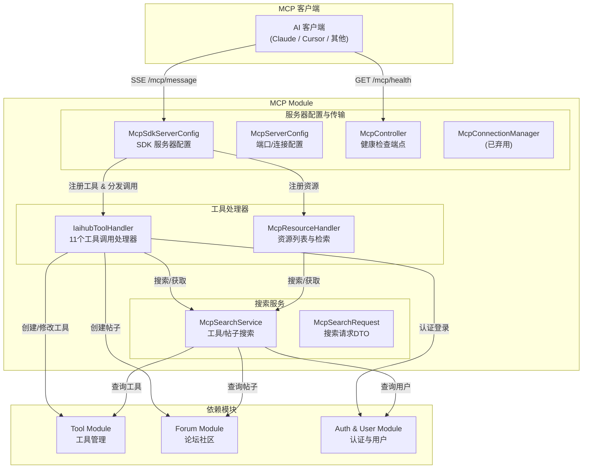
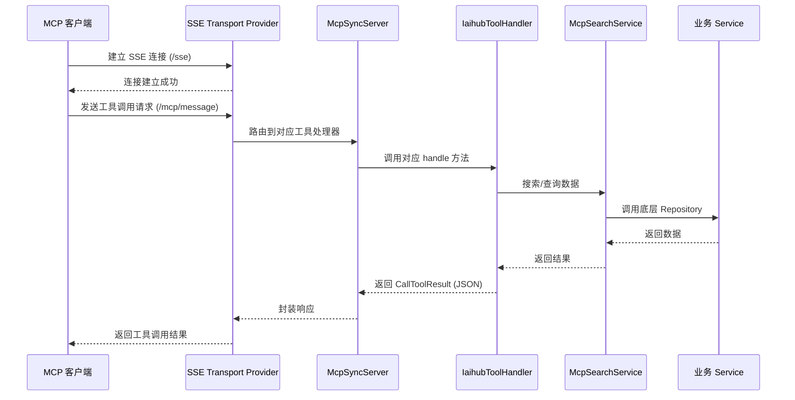
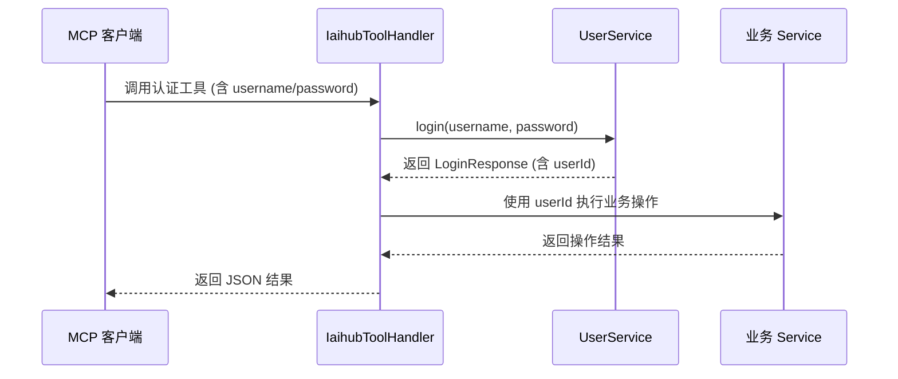
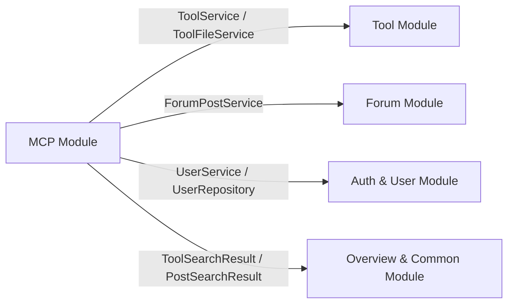

# MCP Module

## 概述

MCP（Model Context Protocol）模块是 IAIHub Toolbox 平台的核心集成层，基于 **MCP SDK 2.0.0** 实现，为 AI 客户端（如 Claude Desktop、Cursor 等）提供标准化的工具调用接口。通过 MCP 协议，AI 客户端可以搜索工具、获取工具详情、下载文件、创建/修改工具、搜索和创建社区帖子等，实现 AI 与平台数据的深度交互。

MCP Server 在独立端口（默认 `8082`）运行，通过 SSE（Server-Sent Events）传输协议与客户端通信，注册了 **11 个工具**，覆盖工具管理和论坛社区的核心操作。

## 架构总览

## 子模块说明

MCP Module 由三个子模块组成，各子模块职责清晰、层次分明：

| 子模块 | 文档 | 职责 |
|--------|------|------|
| MCP服务器配置子模块 | [MCP服务器配置子模块.md](MCP服务器配置子模块.md) | MCP Server 的初始化、SSE 传输配置、工具注册、健康检查及连接管理 |
| MCP工具处理子模块 | [MCP工具处理子模块.md](MCP工具处理子模块.md) | 11 个 MCP 工具的具体业务逻辑处理，包括搜索、详情、创建、修改、删除等操作 |
| MCP搜索服务子模块 | [MCP搜索服务子模块.md](MCP搜索服务子模块.md) | 封装工具和帖子的数据检索逻辑，作为工具处理器与底层数据层的桥梁 |

## 核心工作流程

### MCP 工具调用流程

### 认证工具调用流程

对于需要认证的工具（如创建工具、创建帖子、修改工具、删除文件），MCP 客户端需在调用参数中传入用户名和密码：

## 注册的 MCP 工具一览

| 工具名称 | 描述 | 是否需要认证 |
|----------|------|:------------:|
| `h3_coding_hub_tool_search` | 搜索工具列表，支持关键词和分类筛选 | 否 |
| `h3_coding_hub_tool_get` | 获取工具详情，包括完整 markdown 文档 | 否 |
| `h3_coding_hub_tool_files` | 获取工具文件下载信息 | 否 |
| `h3_coding_hub_post_search` | 搜索社区帖子 | 否 |
| `h3_coding_hub_post_get` | 获取帖子内容，包括完整 markdown | 否 |
| `h3_coding_hub_tool_download` | 获取工具文件的下载链接 | 否 |
| `h3_coding_hub_tool_create` | 创建新工具 | 是 |
| `h3_coding_hub_post_create` | 创建新帖子 | 是 |
| `h3_coding_hub_tool_file_upload` | 获取文件上传接口信息 | 否 |
| `h3_coding_hub_tool_modify` | 修改已创建的工具 | 是 |
| `h3_coding_hub_tool_file_delete` | 删除工具文件 | 是 |

## 跨模块依赖关系

MCP Module 作为集成层，依赖以下模块的核心服务：

- **[Tool Module](Tool Module.md)**：通过 `ToolService`、`ToolFileService` 实现工具的创建、修改和文件管理；通过 `ToolRepository`、`ToolFileRepository` 实现工具数据检索
- **[Forum Module](Forum Module.md)**：通过 `ForumPostService` 实现帖子创建；通过 `ForumPostRepository` 实现帖子数据检索
- **[Auth & User Module](Auth & User Module.md)**：通过 `UserService` 实现认证登录；通过 `UserRepository` 查询用户信息

## 技术要点

- **MCP SDK 2.0.0**：使用原生 Java MCP SDK，通过 `HttpServletSseServerTransportProvider` 处理 SSE 传输
- **独立端口部署**：MCP Server 运行在独立端口（默认 8082），与主应用隔离
- **SSE 传输协议**：通过 `/sse` 端点建立连接，`/mcp/message` 端点处理消息
- **认证机制**：需要认证的工具通过 MCP 客户端传入用户名/密码，由 `UserService.login()` 完成认证
- **版本自动递增**：修改工具时若未指定版本号，系统自动将最后一位数字 +1（如 `1.0.0` → `1.0.1`）
- **JSON 序列化**：使用 Jackson `ObjectMapper` 统一序列化工具调用结果
