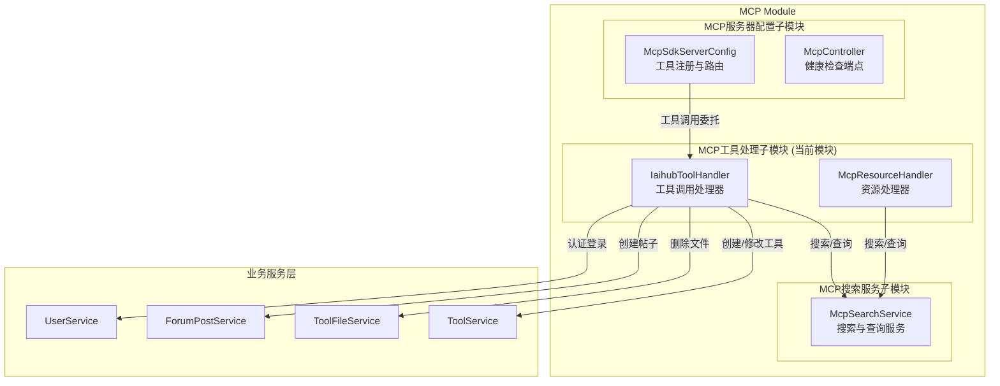
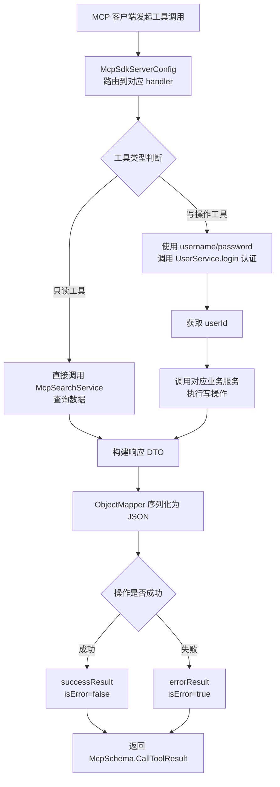
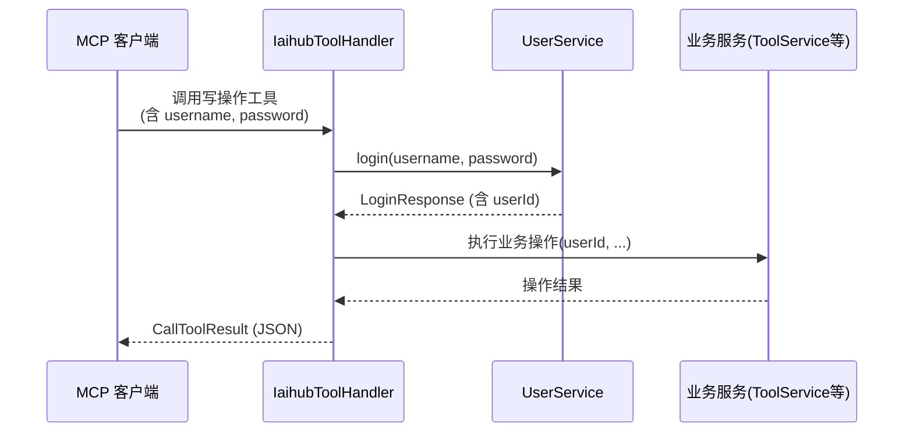
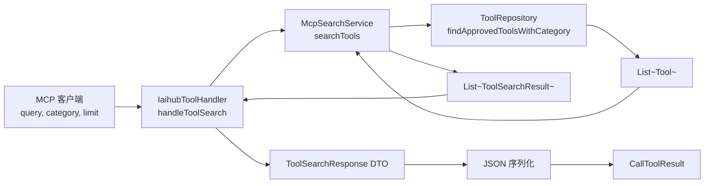
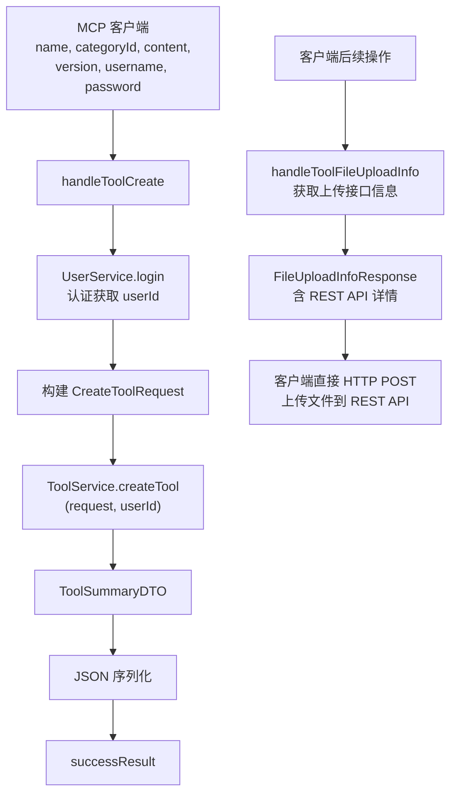
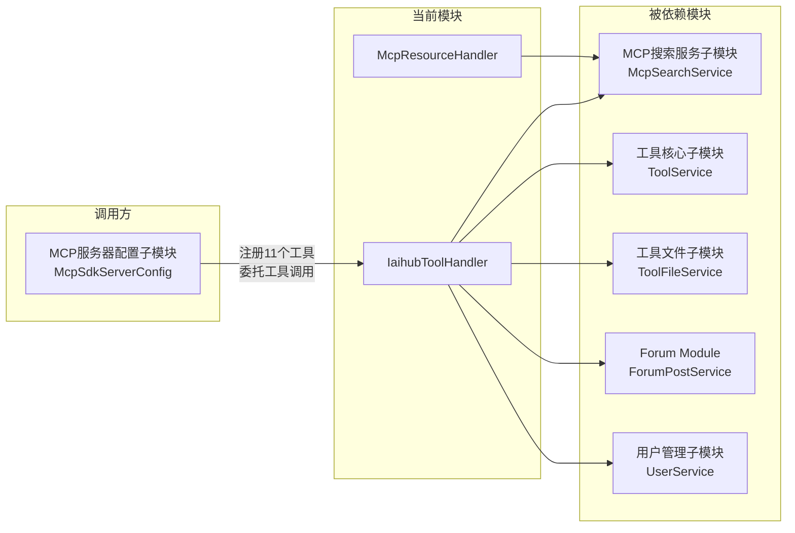
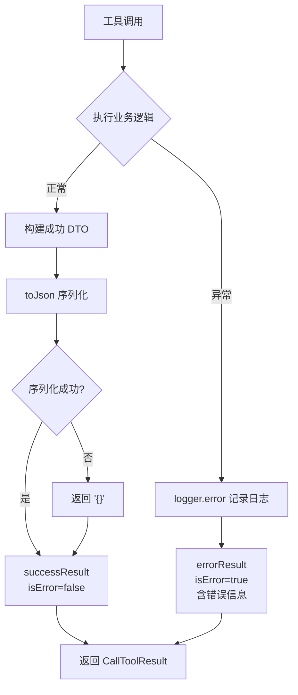

# MCP工具处理子模块

## 简介

MCP工具处理子模块是 MCP（Model Context Protocol）服务器的核心业务逻辑层，负责接收来自 MCP 客户端的工具调用请求，并将其转化为对平台后端各业务服务的实际操作。该子模块实现了 11 个 MCP 工具的处理逻辑，涵盖工具搜索、详情获取、文件管理、帖子搜索与创建、以及需要认证的写操作（创建工具、修改工具、删除文件等）。

本子模块包含两个核心组件：
- **IaihubToolHandler**：MCP 工具调用处理器，实现所有 11 个工具的业务逻辑
- **McpResourceHandler**：MCP 资源处理器，提供工具列表和内容检索能力

## 架构概览



## 组件详解

### IaihubToolHandler

`IaihubToolHandler` 是本子模块的核心组件，作为 Spring `@Component` 注入到 `McpSdkServerConfig` 中。它接收来自 MCP SDK 服务器的工具调用请求，执行业务逻辑后返回 `McpSchema.CallToolResult`。

#### 依赖关系

| 依赖 | 来源模块 | 用途 |
|------|----------|------|
| `McpSearchService` | [MCP搜索服务子模块](MCP搜索服务子模块.md) | 工具/帖子搜索与详情查询 |
| `ToolService` | [工具核心子模块](工具核心子模块.md) | 创建工具、修改工具 |
| `ToolFileService` | [工具文件子模块](工具文件子模块.md) | 删除工具文件 |
| `ForumPostService` | [Forum Module](Forum%20Module.md) | 创建论坛帖子 |
| `UserService` | [用户管理子模块](用户管理子模块.md) | 认证登录（写操作需要） |
| `ObjectMapper` | Spring 框架 | JSON 序列化 |

#### 工具调用处理流程



#### 支持的 MCP 工具列表

本处理器共实现 11 个工具，分为**只读工具**和**认证写操作工具**两大类：

##### 只读工具（无需认证）

| 工具名称 | 处理方法 | 功能描述 |
|----------|----------|----------|
| `h3_coding_hub_tool_search` | `handleToolSearch` | 按关键词和分类搜索工具列表 |
| `h3_coding_hub_tool_get` | `handleToolGet` | 获取工具详情（含完整 markdown 文档） |
| `h3_coding_hub_tool_files` | `handleToolFiles` | 获取工具关联的文件列表 |
| `h3_coding_hub_post_search` | `handlePostSearch` | 按关键词搜索社区帖子 |
| `h3_coding_hub_post_get` | `handlePostGet` | 获取帖子详情（含完整 markdown） |
| `h3_coding_hub_tool_download` | `handleToolDownload` | 获取工具文件的下载链接 |
| `h3_coding_hub_tool_file_upload` | `handleToolFileUploadInfo` | 获取文件上传 REST API 接口信息 |

##### 认证写操作工具（需要 username/password）

| 工具名称 | 处理方法 | 功能描述 |
|----------|----------|----------|
| `h3_coding_hub_tool_create` | `handleToolCreate` | 创建新工具 |
| `h3_coding_hub_post_create` | `handlePostCreate` | 创建新帖子 |
| `h3_coding_hub_tool_modify` | `handleToolModify` | 修改已有工具（支持版本自动递增） |
| `h3_coding_hub_tool_file_delete` | `handleToolFileDelete` | 删除工具下的指定文件 |

#### 认证机制

写操作工具采用**参数传递式认证**：MCP 客户端在调用工具时传入 `username` 和 `password` 参数，处理器内部调用 `UserService.login()` 完成认证并获取 `userId`，再以该用户身份执行业务操作。



#### 版本号自动递增机制

`handleToolModify` 方法支持版本号自动递增功能。当客户端未传入 `version` 参数时，系统会读取当前工具版本号并自动递增最后一位数字：

| 当前版本 | 递增后 | 说明 |
|----------|--------|------|
| `1.0.0` | `1.0.1` | 标准递增 |
| `1.0.0-beta` | `1.0.1-beta` | 保留后缀 |
| `1.0.alpha` | `1.0.alpha.1` | 非数字结尾追加 `.1` |
| `null`/空 | `1.0.1` | 默认起始版本 |

#### 内部响应 DTO

`IaihubToolHandler` 内部定义了多个静态 DTO 类用于构建 JSON 响应：

```mermaid
classDiagram
    class ToolSearchResponse {
        +List~ToolSearchResult~ tools
        +int count
    }
    class ToolDetailResponse {
        +Long id
        +String name
        +String version
        +String content
        +String category
    }
    class ToolFilesResponse {
        +List~FileInfo~ files
        +int count
        +Long toolId
    }
    class FileInfo {
        +String fileName
        +Long fileSize
        +String downloadUrl
        +String createdAt
    }
    class PostSearchResponse {
        +List~PostSearchResult~ posts
        +int count
    }
    class PostDetailResponse {
        +Long id
        +String title
        +String content
        +Long authorId
        +String createdAt
    }
    class FileDownloadResponse {
        +Long fileId
        +String fileName
        +Long fileSize
        +String contentType
        +String downloadUrl
        +String createdAt
    }
    class FileUploadInfoResponse {
        +Long toolId
        +String toolName
        +String uploadUrl
        +String httpMethod
        +String contentType
        +String formFields
        +String limits
        +String instruction
    }
    class FileDeleteResponse {
        +Long toolId
        +Long fileId
        +boolean deleted
    }
    class ErrorResponse {
        +String error
    }
```



### McpResourceHandler

`McpResourceHandler` 提供 MCP 资源层面的工具列表和内容检索能力，主要服务于 MCP 协议中的资源（Resource）概念。

#### 功能方法

| 方法 | 功能 |
|------|------|
| `listTools()` | 返回工具列表，每个工具包含 name、description 和 inputSchema，最多返回 50 条 |
| `searchTools(query, category, limit)` | 委托 `McpSearchService` 执行工具搜索 |
| `getToolContent(toolId)` | 获取指定工具的 markdown 内容 |

#### 资源列表格式

`listTools()` 方法返回的工具资源结构如下：

```json
{
  "name": "h3_coding_hub_tool_{toolId}",
  "description": "{工具名称} - {工具描述}",
  "inputSchema": {
    "type": "object",
    "properties": {
      "toolId": {
        "type": "integer",
        "description": "Tool ID"
      }
    }
  }
}
```

## 数据流

### 工具搜索数据流



### 创建工具完整流程



### 文件上传信息响应

`handleToolFileUploadInfo` 方法返回的 `FileUploadInfoResponse` 包含完整的 REST API 上传指引，客户端据此直接通过 HTTP Multipart POST 上传文件，无需经过 MCP 协议：

| 字段 | 示例值 |
|------|--------|
| `uploadUrl` | `/api/v1/tools/{toolId}/files` |
| `httpMethod` | `POST` |
| `contentType` | `multipart/form-data` |
| `formFields` | `files (必填, 文件列表), readme (可选, markdown文本)` |
| `limits` | `50MB per file, 200MB total` |
| `instruction` | 自动拼接的使用说明 |

## 与其他模块的交互关系



### 交互说明

| 交互方向 | 说明 |
|----------|------|
| **MCP服务器配置子模块 → 当前模块** | `McpSdkServerConfig` 在启动时注册 11 个工具，每个工具的 `callHandler` 委托给 `IaihubToolHandler` 的对应方法 |
| **当前模块 → MCP搜索服务子模块** | 通过 `McpSearchService` 执行所有只读查询操作（搜索工具/帖子、获取详情、获取文件列表） |
| **当前模块 → 工具核心子模块** | 通过 `ToolService` 执行工具创建和修改操作 |
| **当前模块 → 工具文件子模块** | 通过 `ToolFileService` 执行文件删除操作 |
| **当前模块 → Forum Module** | 通过 `ForumPostService` 执行帖子创建操作 |
| **当前模块 → 用户管理子模块** | 通过 `UserService.login()` 完成写操作的认证 |

## 错误处理

所有工具处理方法均采用统一的异常处理策略：

1. **try-catch 包裹**：每个 handler 方法内部使用 try-catch 捕获所有异常
2. **错误日志**：捕获异常后通过 SLF4J 记录错误日志
3. **错误响应**：返回 `errorResult`，设置 `isError=true`，包含中文错误描述
4. **JSON 序列化容错**：`toJson` 方法在序列化失败时返回 `"{}"` 而非抛出异常



## 设计特点

1. **统一入口**：所有 MCP 工具调用通过 `IaihubToolHandler` 统一处理，便于维护和扩展
2. **参数式认证**：写操作通过参数传递认证信息，无需维护 MCP 会话状态，适配无状态 MCP 协议
3. **REST API 桥接**：文件上传等不适合通过 MCP 协议传输的操作，通过返回 REST API 指引让客户端直接调用 HTTP 接口
4. **版本自动递增**：工具修改时支持版本号智能递增，减少客户端负担
5. **内部 DTO 隔离**：响应 DTO 定义为内部静态类，避免污染公共 DTO 包，同时保持响应结构的自包含性
