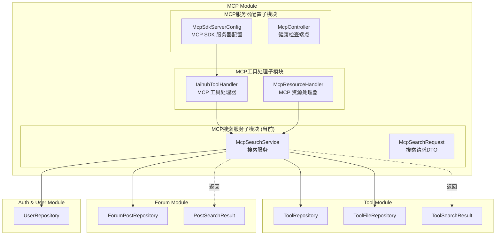
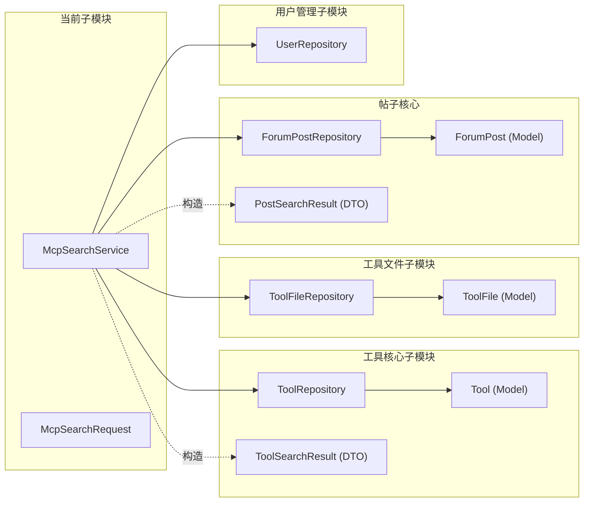
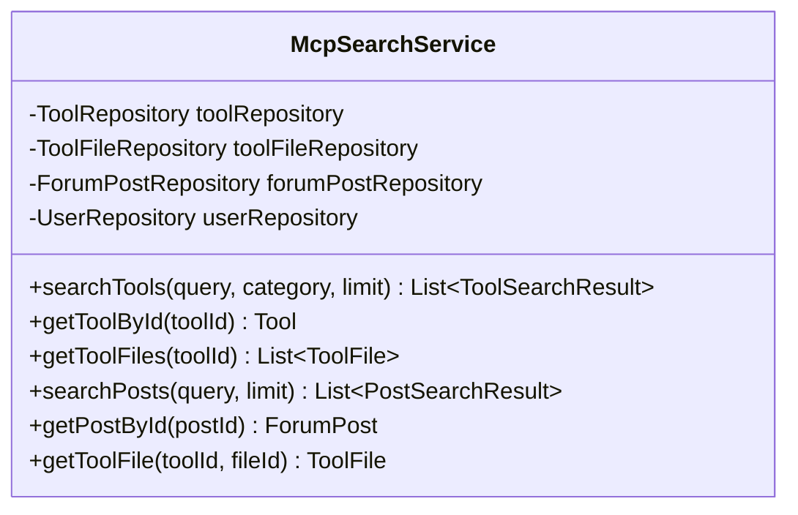
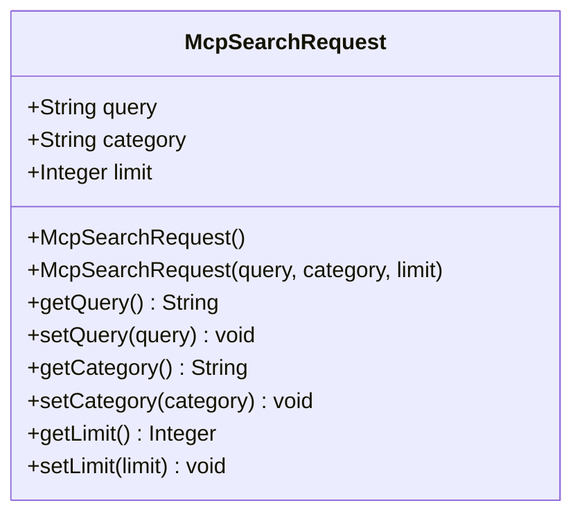
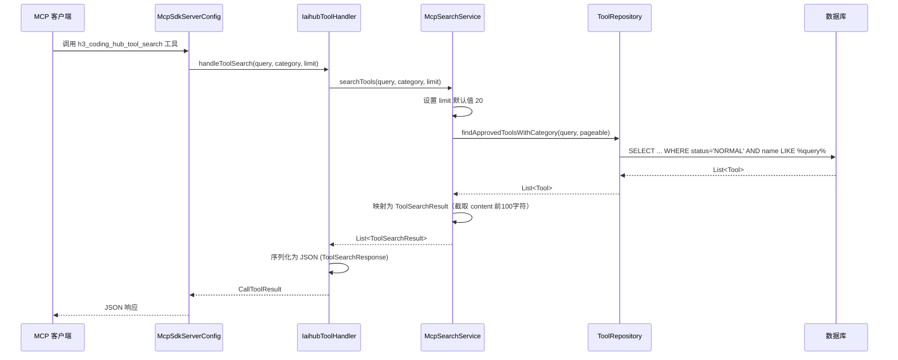
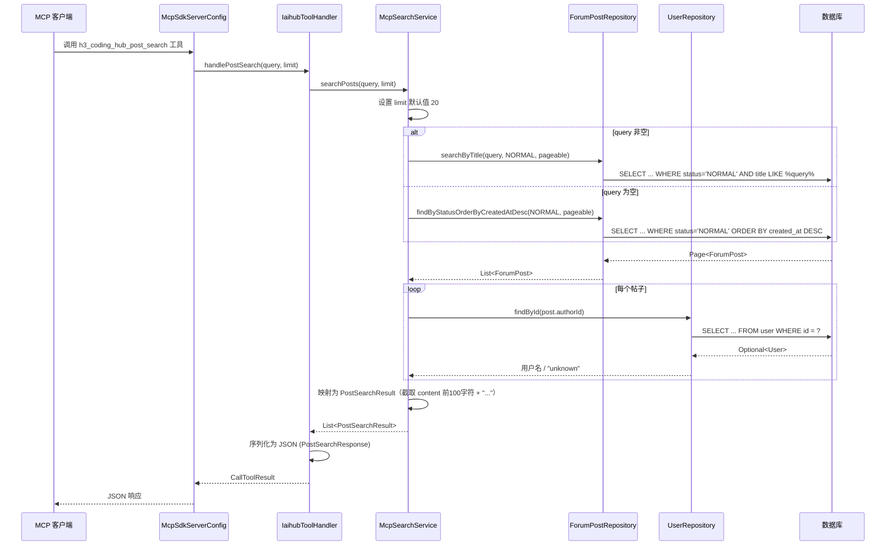
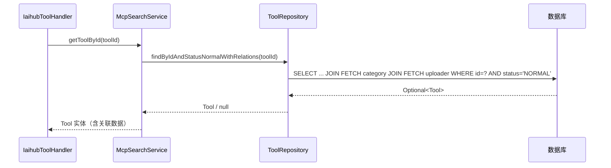

# MCP搜索服务子模块

## 概述

MCP搜索服务子模块是 [MCP Module](MCP模块.md) 的三个子模块之一，负责为 MCP（Model Context Protocol）服务器提供统一的数据检索能力。该子模块封装了工具（Tool）和论坛帖子（ForumPost）的搜索与详情查询逻辑，作为 MCP 工具处理层与底层数据仓库之间的桥梁，使 AI 客户端能够通过 MCP 协议检索平台上的工具和帖子内容。

### 核心职责

- **工具搜索**：按关键词搜索已审核通过的工具列表，返回摘要信息
- **工具详情查询**：根据工具 ID 获取完整工具信息（含分类、上传者等关联数据）
- **工具文件检索**：获取指定工具下的文件列表及单个文件详情
- **帖子搜索**：按标题关键词搜索论坛帖子，返回摘要及作者信息
- **帖子详情查询**：根据帖子 ID 获取完整帖子内容

### 子模块组成

| 组件 | 类型 | 文件路径 | 说明 |
|------|------|----------|------|
| `McpSearchService` | Service | `backend/.../service/McpSearchService.java` | 核心搜索服务，封装工具与帖子的检索逻辑 |
| `McpSearchRequest` | DTO | `backend/.../dto/McpSearchRequest.java` | 搜索请求参数 DTO，含输入校验注解 |

---

## 架构设计

### 模块在系统中的位置

### 依赖关系

### 被调用关系

`McpSearchService` 被以下两个组件调用：

| 调用方 | 所属子模块 | 调用方法 | 用途 |
|--------|-----------|----------|------|
| `IaihubToolHandler` | MCP工具处理子模块 | `searchTools`, `getToolById`, `getToolFiles`, `searchPosts`, `getPostById`, `getToolFile` | 处理 MCP 客户端的工具调用请求，将结果序列化为 JSON 返回 |
| `McpResourceHandler` | MCP工具处理子模块 | `searchTools`, `getToolById` | 提供 MCP 资源列表和工具内容读取 |

---

## 核心组件详解

### McpSearchService

搜索服务核心类，通过构造函数注入四个 Repository，提供六项检索能力。

#### 类结构

#### 方法说明

##### 1. `searchTools(String query, String category, Integer limit)`

搜索已审核通过（`status = NORMAL`）的工具列表。

| 参数 | 类型 | 说明 |
|------|------|------|
| `query` | `String` | 搜索关键词，匹配工具名称 |
| `category` | `Integer` | 分类筛选（当前实现中未直接使用，预留参数） |
| `limit` | `Integer` | 返回数量限制，默认 20 |

**处理流程**：
1. 设置 `limit` 默认值为 20
2. 调用 `toolRepository.findApprovedToolsWithCategory()` 查询状态为 NORMAL 且名称匹配关键词的工具（JOIN FETCH 分类信息）
3. 将 `Tool` 实体映射为 `ToolSearchResult`，其中 `description` 截取 `content` 前 100 个字符
4. 使用 `@Transactional(readOnly = true)` 保证只读事务

**返回的 `ToolSearchResult` 字段**：

| 字段 | 来源 | 说明 |
|------|------|------|
| `id` | `tool.getId()` | 工具 ID |
| `name` | `tool.getName()` | 工具名称 |
| `description` | `tool.getContent()` 前100字符 | 工具描述摘要 |
| `category` | `tool.getCategory().getName()` | 分类名称 |
| `version` | `tool.getVersion()` | 版本号，默认 "1.0.0" |
| `createdAt` | `tool.getCreatedAt().toString()` | 创建时间 |

##### 2. `getToolById(Long toolId)`

根据工具 ID 获取工具详情，包含分类和上传者关联数据。

- 调用 `toolRepository.findByIdAndStatusNormalWithRelations()`，使用 JOIN FETCH 一次性加载 `category` 和 `uploader` 关联实体
- 返回完整的 `Tool` 实体，若不存在返回 `null`

##### 3. `getToolFiles(Long toolId)`

获取指定工具下状态为 NORMAL 的文件列表。

- 调用 `toolFileRepository.findByToolIdAndStatusNormal()`
- 返回 `List<ToolFile>`

##### 4. `searchPosts(String query, Integer limit)`

搜索论坛帖子，支持按标题关键词搜索或获取最新帖子列表。

| 参数 | 类型 | 说明 |
|------|------|------|
| `query` | `String` | 搜索关键词，匹配帖子标题 |
| `limit` | `Integer` | 返回数量限制，默认 20 |

**处理流程**：
1. 设置 `limit` 默认值为 20
2. 若 `query` 非空：调用 `forumPostRepository.searchByTitle()` 按标题模糊搜索状态为 NORMAL 的帖子
3. 若 `query` 为空：调用 `forumPostRepository.findByStatusOrderByCreatedAtDesc()` 获取最新帖子
4. 将 `ForumPost` 实体映射为 `PostSearchResult`：
   - 通过 `userRepository.findById()` 查询作者用户名，若找不到则返回 "unknown"
   - `summary` 截取 `content` 前 100 个字符并追加 "..."
5. 返回 `List<PostSearchResult>`

**返回的 `PostSearchResult` 字段**：

| 字段 | 来源 | 说明 |
|------|------|------|
| `id` | `post.getId()` | 帖子 ID |
| `title` | `post.getTitle()` | 帖子标题 |
| `summary` | `post.getContent()` 前100字符 + "..." | 帖子摘要 |
| `authorName` | `userRepository.findById(authorId)` | 作者用户名 |
| `createdAt` | `post.getCreatedAt().toString()` | 创建时间 |

##### 5. `getPostById(Long postId)`

根据帖子 ID 获取完整帖子实体。

- 调用 `forumPostRepository.findById()`
- 返回 `ForumPost` 实体，若不存在返回 `null`

##### 6. `getToolFile(Long toolId, Long fileId)`

获取指定工具下的特定文件详情。

- 调用 `toolFileRepository.findByIdAndToolId()`，同时匹配 `fileId` 和 `toolId`
- 返回 `ToolFile` 实体，若不存在返回 `null`

---

### McpSearchRequest

MCP 搜索请求的参数 DTO，提供输入校验。

#### 类结构

#### 字段与校验规则

| 字段 | 类型 | 校验规则 | 默认值 | 说明 |
|------|------|----------|--------|------|
| `query` | `String` | `@Size(max = 200)` | `null` | 搜索关键词，最长 200 字符 |
| `category` | `String` | 无 | `null` | 分类名称 |
| `limit` | `Integer` | `@Min(1)`, `@Max(100)` | `20` | 返回数量限制，范围 1-100 |

> **注意**：`setLimit()` 方法内部对 `null` 值做了保护，传入 `null` 时会自动设为 20。

---

## 数据流

### 工具搜索数据流

### 帖子搜索数据流

### 工具详情查询数据流

---

## MCP 工具注册映射

`McpSearchService` 的方法通过 `IaihubToolHandler` 被注册为以下 MCP 工具，供 AI 客户端调用：

| MCP 工具名称 | 调用的 Service 方法 | 说明 |
|-------------|-------------------|------|
| `h3_coding_hub_tool_search` | `searchTools()` | 搜索工具列表 |
| `h3_coding_hub_tool_get` | `getToolById()` | 获取工具详情 |
| `h3_coding_hub_tool_files` | `getToolFiles()` | 获取工具文件列表 |
| `h3_coding_hub_tool_download` | `getToolFile()` | 获取文件下载信息 |
| `h3_coding_hub_post_search` | `searchPosts()` | 搜索社区帖子 |
| `h3_coding_hub_post_get` | `getPostById()` | 获取帖子详情 |

> MCP 工具的注册逻辑位于 [MCP服务器配置子模块](MCP服务器配置子模块.md) 的 `McpSdkServerConfig` 中，工具处理逻辑位于 [MCP工具处理子模块](MCP工具处理子模块.md) 的 `IaihubToolHandler` 中。

---

## 跨模块依赖关系

本子模块作为数据检索的统一入口，依赖以下模块的 Repository 和 DTO：

| 依赖模块 | 依赖组件 | 用途 |
|---------|---------|------|
| [工具核心子模块](工具核心子模块.md) | `ToolRepository`, `Tool` (Model), `ToolSearchResult` (DTO) | 工具搜索与详情查询 |
| [工具文件子模块](工具文件子模块.md) | `ToolFileRepository`, `ToolFile` (Model) | 工具文件检索 |
| [帖子核心](帖子核心.md) | `ForumPostRepository`, `ForumPost` (Model), `PostSearchResult` (DTO) | 帖子搜索与详情查询 |
| [用户管理子模块](用户管理子模块.md) | `UserRepository` | 帖子搜索时查询作者用户名 |

---

## 设计特点

### 1. 只读事务优化
`searchTools()` 方法使用 `@Transactional(readOnly = true)` 注解，提示数据库引擎可以进行只读优化，避免脏检查开销。

### 2. 摘要截取策略
- **工具搜索**：`content` 截取前 100 个字符作为 `description`，避免返回过长的工具文档
- **帖子搜索**：`content` 截取前 100 个字符并追加 "..." 作为 `summary`

### 3. 关联数据预加载
`getToolById()` 使用 `findByIdAndStatusNormalWithRelations()`，通过 JPQL 的 `JOIN FETCH` 一次性加载 `category` 和 `uploader` 关联实体，避免 N+1 查询问题。

### 4. 状态过滤
所有查询均过滤 `status = NORMAL`，确保 MCP 客户端只能检索到已审核通过的内容：
- 工具：`Tool.Status.NORMAL`
- 帖子：`ForumPostStatus.NORMAL`
- 工具文件：`ToolFile.Status.NORMAL`（通过 `findByToolIdAndStatusNormal`）

### 5. 容错处理
- `getToolById()`、`getPostById()`、`getToolFile()` 在数据不存在时返回 `null`，由调用方 `IaihubToolHandler` 负责生成友好的错误消息
- 帖子搜索中作者查询失败时返回 "unknown"，不影响搜索结果的整体返回

### 6. 参数默认值
- `limit` 参数在 `McpSearchRequest`（DTO 层）和 `McpSearchService`（Service 层）均有默认值 20 的保护，确保即使客户端不传该参数也能正常工作
