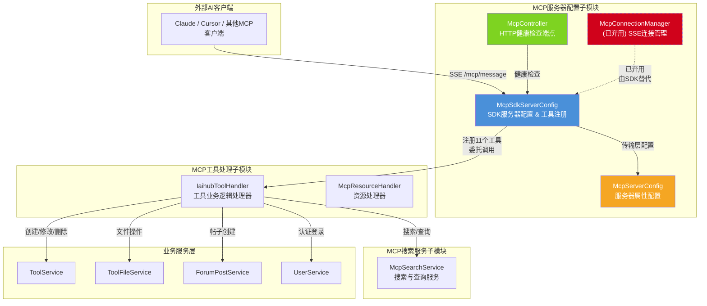
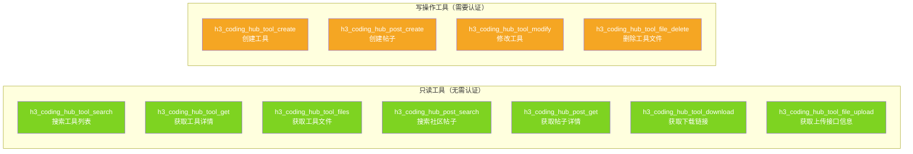
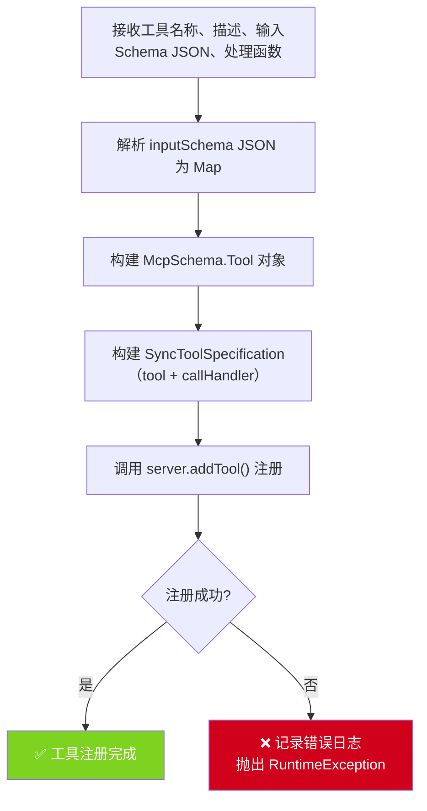
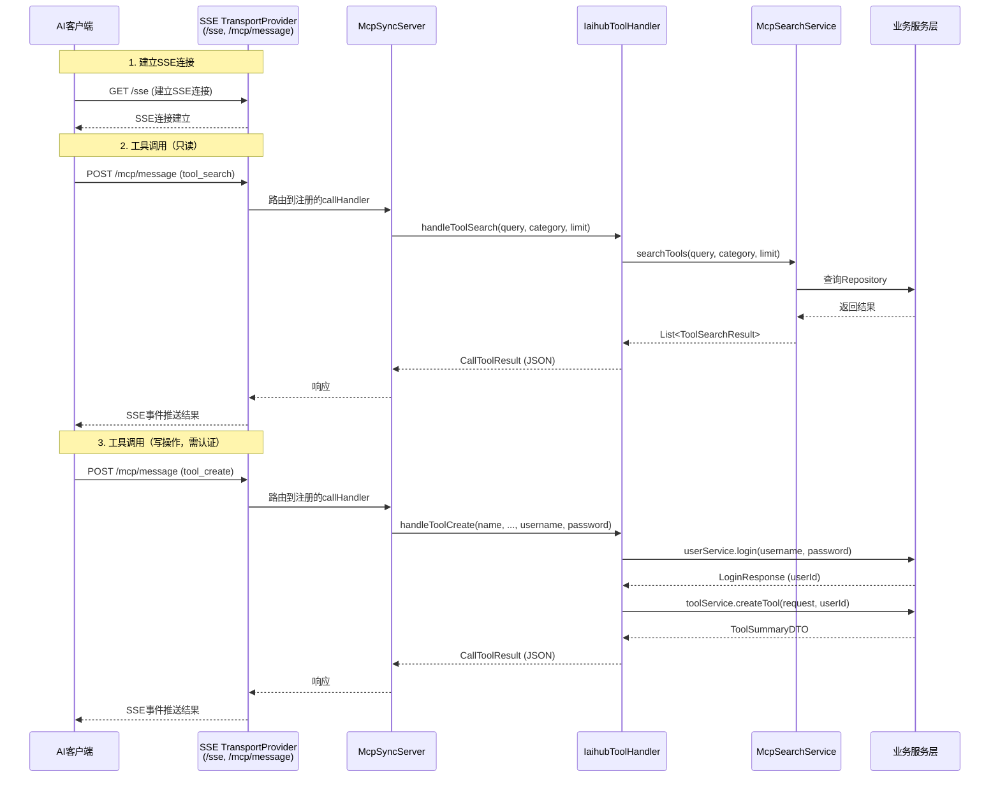
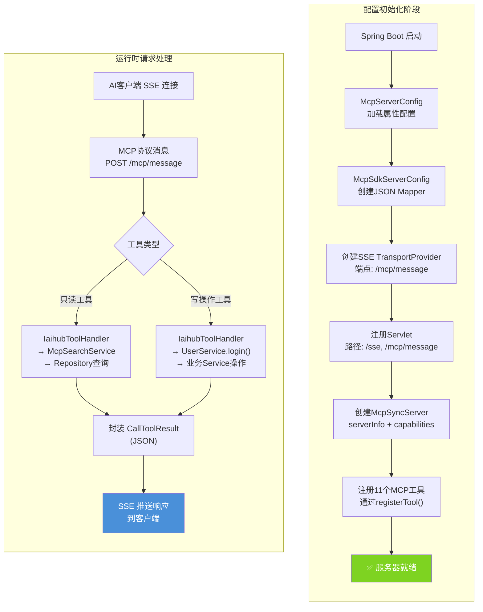
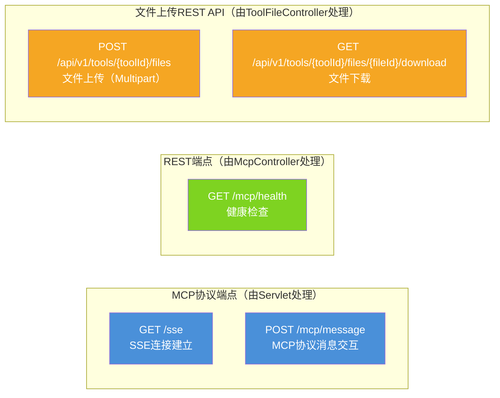
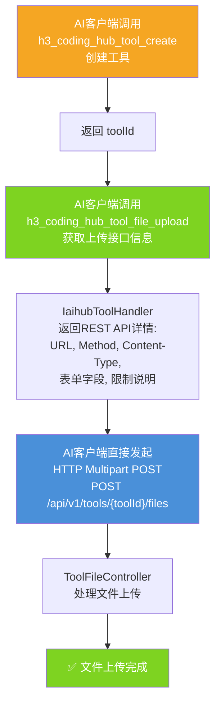

# MCP服务器配置子模块

## 简介

MCP服务器配置子模块是 MCP Module 的核心基础设施层，负责 MCP（Model Context Protocol）服务器的初始化、配置、传输层搭建以及连接管理。该子模块基于原生 Java MCP SDK 2.0.0 构建，通过 SSE（Server-Sent Events）传输协议为外部 AI 客户端（如 Claude、Cursor 等）提供标准化的工具调用接口。

子模块共注册 **11 个 MCP 工具**，涵盖工具搜索、工具详情获取、文件管理、帖子搜索与创建、工具创建与修改等全链路操作，使 AI 客户端能够以标准化协议与 H3CodingHub 平台进行深度交互。

---

## 架构概览



---

## 核心组件

### 1. McpSdkServerConfig — SDK 服务器配置与工具注册

**文件路径**: `backend/src/main/java/com/iaihub/toolbox/mcp/McpSdkServerConfig.java`

这是整个 MCP 子模块的核心配置类，承担以下职责：

#### 1.1 传输层配置

| Bean 名称 | 类型 | 职责 |
|-----------|------|------|
| `mcpJsonMapper` | `JacksonMcpJsonMapper` | 基于 Jackson 的 JSON 序列化/反序列化 |
| `servletSseServerTransportProvider` | `HttpServletSseServerTransportProvider` | SSE 传输层，消息端点为 `/mcp/message` |
| `customServletBean` | `ServletRegistrationBean` | 将 SSE Servlet 注册到 `/sse` 和 `/mcp/message` 路径 |
| `mcpSyncServer` | `McpSyncServer` | 同步 MCP 服务器实例，注册所有工具 |

#### 1.2 服务器信息

```java
McpServer.sync(transportProvider)
    .serverInfo("H3CodingHub-MCP-Server", "2.0.0")
    .capabilities(McpSchema.ServerCapabilities.builder()
        .tools(true)
        .logging()
        .build())
    .build();
```

- **服务器名称**: `H3CodingHub-MCP-Server`
- **协议版本**: `2.0.0`
- **能力声明**: 支持工具（tools）和日志（logging）

#### 1.3 已注册的 11 个 MCP 工具



**工具详细参数说明：**

| 工具名称 | 描述 | 必填参数 | 可选参数 | 需认证 |
|----------|------|----------|----------|--------|
| `h3_coding_hub_tool_search` | 搜索工具列表 | — | `query`, `category`, `limit`(默认20) | 否 |
| `h3_coding_hub_tool_get` | 获取工具详情（含完整 markdown） | `toolId` | — | 否 |
| `h3_coding_hub_tool_files` | 获取工具文件下载信息 | `toolId` | — | 否 |
| `h3_coding_hub_post_search` | 搜索社区帖子 | — | `query`, `limit`(默认20) | 否 |
| `h3_coding_hub_post_get` | 获取帖子内容（含完整 markdown） | `postId` | — | 否 |
| `h3_coding_hub_tool_download` | 获取文件下载链接（相对路径） | `toolId`, `fileId` | — | 否 |
| `h3_coding_hub_tool_file_upload` | 获取文件上传 REST API 信息 | `toolId` | — | 否 |
| `h3_coding_hub_tool_create` | 创建新工具 | `name`, `categoryId`, `content`, `version`, `username`, `password` | — | 是 |
| `h3_coding_hub_post_create` | 创建新帖子 | `title`, `content`, `categoryId`, `username`, `password` | — | 是 |
| `h3_coding_hub_tool_modify` | 修改已创建的工具 | `toolId`, `username`, `password` | `name`, `categoryId`, `content`, `version` | 是 |
| `h3_coding_hub_tool_file_delete` | 删除工具文件 | `toolId`, `fileId`, `username`, `password` | — | 是 |

> **认证机制说明**：需要认证的工具通过 MCP 客户端传入 `username` 和 `password` 参数完成登录，密码默认为 `123456`。详见 [MCP工具处理子模块](MCP工具处理子模块.md) 中 `IaihubToolHandler` 的认证流程。

#### 1.4 工具注册机制

`registerTool` 私有方法封装了工具注册的通用流程：



---

### 2. McpServerConfig — 服务器属性配置

**文件路径**: `backend/src/main/java/com/iaihub/toolbox/config/McpServerConfig.java`

通过 `@ConfigurationProperties(prefix = "mcp.server")` 绑定配置文件中的 MCP 服务器参数。

| 属性 | 类型 | 默认值 | 说明 |
|------|------|--------|------|
| `port` | `int` | `8082` | MCP 服务器独立监听端口 |
| `host` | `String` | `0.0.0.0` | 监听地址（0.0.0.0 表示所有网卡） |
| `enabled` | `boolean` | `true` | 是否启用 MCP 服务器 |
| `maxConnections` | `int` | `10` | 最大并发连接数 |
| `connectionTimeoutMs` | `int` | `30000` | 连接超时时间（毫秒） |

**配置示例（application.yml）：**

```yaml
mcp:
  server:
    port: 8082
    host: 0.0.0.0
    enabled: true
    max-connections: 10
    connection-timeout-ms: 30000
```

---

### 3. McpController — HTTP 健康检查端点

**文件路径**: `backend/src/main/java/com/iaihub/toolbox/controller/McpController.java`

提供 MCP 服务器的健康检查 REST 端点，用于监控和运维。

| 端点 | 方法 | 路径 | 说明 |
|------|------|------|------|
| 健康检查 | `GET` | `/mcp/health` | 返回服务器状态、版本、名称和时间戳 |

**响应示例：**

```json
{
    "status": "ok",
    "version": "1.0.0",
    "mcpServer": "H3CodingHub-MCP-Server",
    "timestamp": "2024-01-15T08:30:00Z"
}
```

> **注意**：实际的 SSE 连接和 MCP 协议交互由 `McpSdkServerConfig` 中注册的 `HttpServletSseServerTransportProvider` Servlet 处理，路径为 `/sse` 和 `/mcp/message`。`McpController` 仅提供辅助的健康检查功能。

---

### 4. McpConnectionManager — SSE 连接管理器（已弃用）

**文件路径**: `backend/src/main/java/com/iaihub/toolbox/mcp/McpConnectionManager.java`

> ⚠️ **已弃用**：该组件标记为 `@Deprecated`，连接管理已由 MCP SDK 的 `HttpServletSseServerTransportProvider` 内部处理。保留此代码仅用于向后兼容参考。

该组件原本提供以下功能：

| 方法 | 说明 |
|------|------|
| `registerEmitter(SseEmitter)` | 注册新的 SSE 连接，设置超时回调 |
| `broadcastEvent(String, Object)` | 向所有连接广播事件 |
| `sendToEmitter(SseEmitter, String, Object)` | 向指定连接发送消息 |
| `getActiveConnectionCount()` | 获取活跃连接数 |
| `heartbeat()` | 心跳检测，移除超时连接 |
| `shutdown()` | 关闭所有连接 |

**内部类：**

- **`SseEmitter`**：Spring `SseEmitter` 的包装类，避免与 Java SE 命名冲突，提供 `onCompletion`、`onTimeout`、`onError`、`send`、`complete` 等方法。
- **`SseEmitterEvent`**：SSE 事件构建器，支持链式调用设置事件名称和数据。

**SSE 超时配置**：`30 * 60 * 1000L`（30 分钟）

---

## 组件交互关系



---

## 数据流架构



---

## 依赖关系

```mermaid
graph TD
    subgraph "本子模块"
        McpSdkServerConfig
        McpServerConfig
        McpController
        McpConnectionManager
    end

    subgraph "MCP工具处理子模块"
        IaihubToolHandler
        McpResourceHandler
    end

    subgraph "MCP搜索服务子模块"
        McpSearchService
        McpSearchRequest
    end

    subgraph "Auth & User Module"
        UserService["UserService"]
        LoginRequest["LoginRequest"]
        LoginResponse["LoginResponse"]
    end

    subgraph "Tool Module"
        ToolService["ToolService"]
        ToolFileService["ToolFileService"]
        CreateToolRequest["CreateToolRequest"]
        UpdateToolRequest["UpdateToolRequest"]
        ToolSummaryDTO["ToolSummaryDTO"]
        ToolDetailDTO["ToolDetailDTO"]
    end

    subgraph "Forum Module"
        ForumPostService["ForumPostService"]
        ForumPostCreateRequest["ForumPostCreateRequest"]
        ForumPostDTO["ForumPostDTO"]
    end

    subgraph "MCP SDK 2.0.0"
        SDK["io.modelcontextprotocol.*<br/>McpServer, McpSyncServer<br/>HttpServletSseServerTransportProvider<br/>McpSchema, McpServerFeatures"]
    end

    McpSdkServerConfig -->|"依赖"| SDK
    McpSdkServerConfig -->|"注入"| IaihubToolHandler
    McpSdkServerConfig -->|"注入"| McpServerConfig
    McpController -->|"注入"| SDK
    IaihubToolHandler -->|"调用"| McpSearchService
    IaihubToolHandler -->|"调用"| ToolService
    IaihubToolHandler -->|"调用"| ToolFileService
    IaihubToolHandler -->|"调用"| ForumPostService
    IaihubToolHandler -->|"调用"| UserService
    McpResourceHandler -->|"调用"| McpSearchService

    style McpSdkServerConfig fill:#4a90d9,color:#fff
    style SDK fill:#9b9b9b,color:#fff
```



### 外部依赖

| 依赖 | 说明 |
|------|------|
| **MCP SDK 2.0.0** (`io.modelcontextprotocol.*`) | 提供 MCP 协议核心实现，包括同步服务器、SSE 传输、Schema 定义 |
| **Jackson** (`com.fasterxml.jackson.*`) | JSON 序列化/反序列化，通过 `JacksonMcpJsonMapper` 集成到 MCP SDK |
| **Spring Boot** | 提供 `@Configuration`、`@Bean`、`ServletRegistrationBean` 等 IoC 容器支持 |

### 跨模块依赖

| 依赖模块 | 依赖组件 | 用途 |
|----------|----------|------|
| [MCP工具处理子模块](MCP工具处理子模块.md) | `IaihubToolHandler` | 11 个 MCP 工具的业务逻辑实现 |
| [MCP工具处理子模块](MCP工具处理子模块.md) | `McpResourceHandler` | MCP 资源列表与内容查询 |
| [MCP搜索服务子模块](MCP搜索服务子模块.md) | `McpSearchService` | 工具/帖子搜索与详情查询 |
| [Auth & User Module](Auth_User_Module.md) | `UserService`, `LoginRequest`, `LoginResponse` | 写操作工具的认证登录 |
| [Tool Module](Tool_Module.md) | `ToolService`, `ToolFileService`, `CreateToolRequest`, `UpdateToolRequest` | 工具创建、修改、文件管理 |
| [Forum Module](Forum_Module.md) | `ForumPostService`, `ForumPostCreateRequest` | 帖子创建 |

---

## 端点与路由总览



> 文件上传/下载端点由 [Tool Module](Tool_Module.md) 的 `ToolFileController` 提供，MCP 工具 `h3_coding_hub_tool_file_upload` 和 `h3_coding_hub_tool_download` 返回这些 REST API 的地址信息，由 AI 客户端直接调用。

---

## 文件上传工作流

`h3_coding_hub_tool_file_upload` 工具采用特殊的两阶段设计模式，因为 MCP 协议本身不支持二进制文件传输：



**上传限制**：
- 单文件最大：50MB
- 总上传大小最大：200MB
- 表单字段：`files`（必填，文件列表）、`readme`（可选，markdown 文本）

---

## 版本自动递增机制

`h3_coding_hub_tool_modify` 工具支持版本号自动递增。当客户端不传 `version` 参数时，系统自动在当前版本号最后一位 +1：

| 当前版本 | 递增后版本 | 说明 |
|----------|-----------|------|
| `1.0.0` | `1.0.1` | 标准递增 |
| `1.0.0-beta` | `1.0.1-beta` | 保留后缀 |
| `1.0.alpha` | `1.0.alpha.1` | 非数字结尾追加 `.1` |
| `1` | `1.1` | 无小数点追加 `.1` |
| `null` / 空 | `1.0.1` | 默认版本 |

---

## 配置与部署

### 独立端口部署

MCP 服务器在独立端口（默认 `8082`）运行，与主应用端口隔离，确保 MCP 协议流量不影响主业务接口性能。

### 关键配置项

```yaml
# application.yml
mcp:
  server:
    port: 8082                    # MCP服务器端口
    host: 0.0.0.0                 # 监听地址
    enabled: true                 # 是否启用
    max-connections: 10           # 最大连接数
    connection-timeout-ms: 30000  # 连接超时(ms)
```

### 客户端连接配置

AI 客户端（如 Claude Desktop）连接配置示例：

```json
{
  "mcpServers": {
    "h3-coding-hub": {
      "url": "http://mcp_server_ip:8082/sse"
    }
  }
}
```

---

## 设计决策与注意事项

### 1. 为什么使用原生 MCP SDK 而非自定义实现

- **协议合规性**：原生 SDK 确保 MCP 协议规范的完整实现
- **维护成本**：SDK 升级即可获得新特性，无需自行跟进协议变更
- **连接管理**：SDK 内部的 `HttpServletSseServerTransportProvider` 已处理 SSE 连接生命周期

### 2. McpConnectionManager 弃用原因

原 `McpConnectionManager` 是自定义的 SSE 连接管理器，存在以下问题：
- 重复实现了 SDK 已提供的连接管理功能
- 心跳检测逻辑不完整
- 并发安全性依赖手动管理

迁移到 SDK 后，连接管理由 `HttpServletSseServerTransportProvider` 内部处理，代码更简洁可靠。

### 3. 认证策略

写操作工具采用**参数传递认证**模式（username/password 作为工具参数传入），而非 HTTP Header 认证。这是因为：
- MCP 协议工具调用不原生支持 HTTP Header 传递
- AI 客户端可以灵活传入不同用户身份
- 默认密码 `123456` 降低了集成门槛

### 4. 文件上传的两阶段设计

MCP 协议基于 JSON 文本交互，无法直接传输二进制文件。因此采用"告知接口信息 → 客户端直接 HTTP 调用"的两阶段模式，兼顾协议合规与功能完整性。
