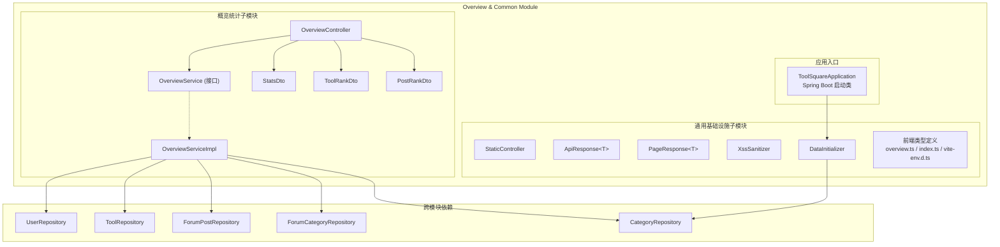
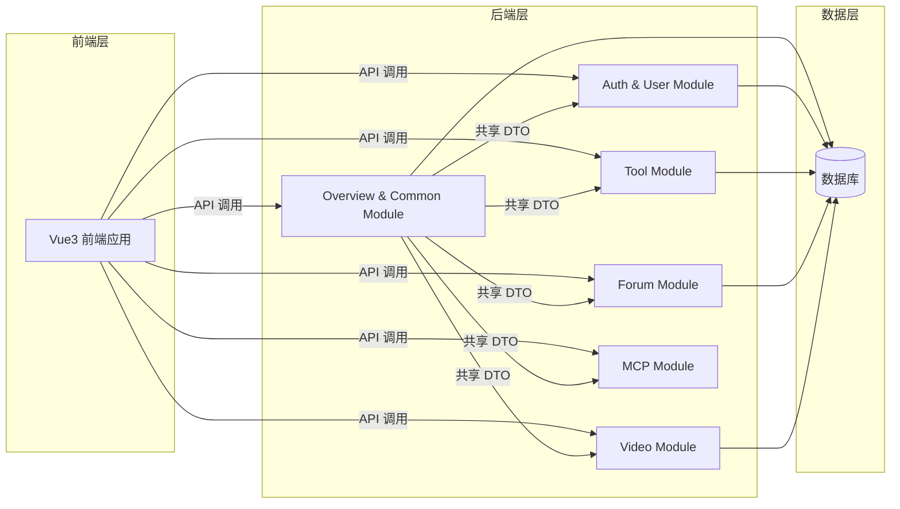
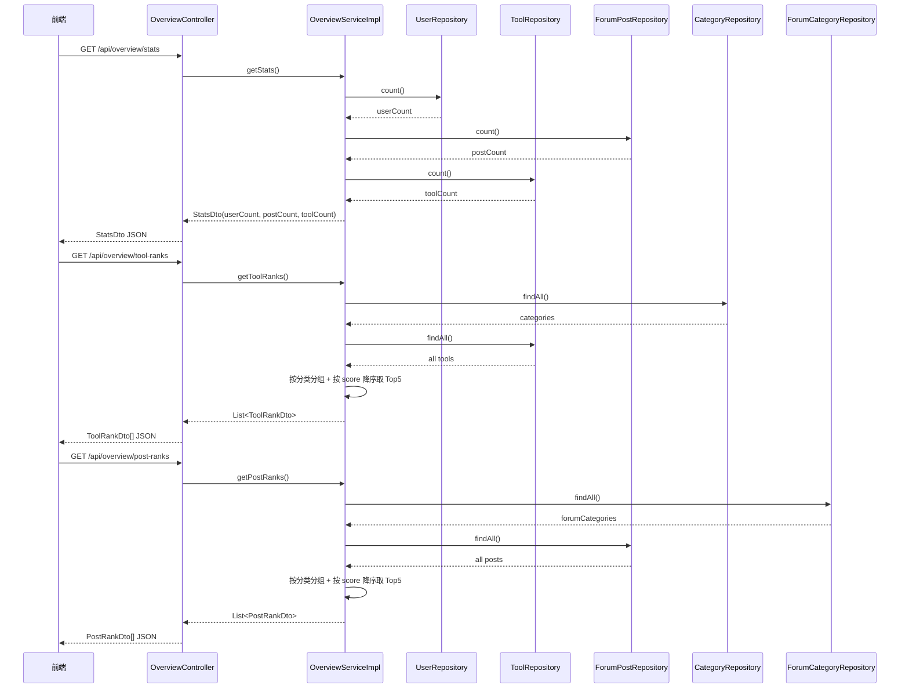
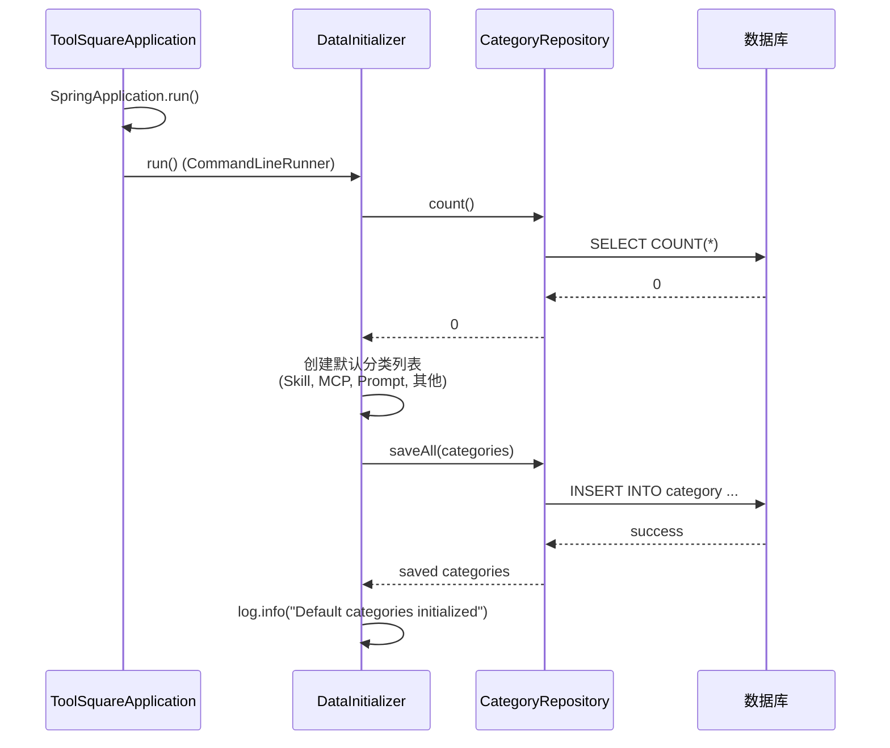
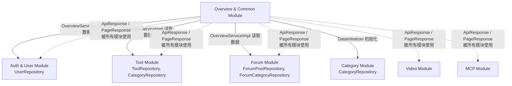

# Overview & Common Module（概览与通用模块）

## 1. 模块简介

**Overview & Common Module** 是 IAIHub ToolSquare 平台的基础设施模块，承担两大核心职责：

1. **概览统计**：为平台首页提供全局统计数据（用户数、帖子数、工具数）以及工具和帖子的分类排行榜。
2. **通用基础设施**：提供全系统共享的通用 DTO（`ApiResponse`、`PageResponse`）、安全工具（`XssSanitizer`）、数据初始化（`DataInitializer`）、静态资源服务（`StaticController`）以及 Spring Boot 应用入口（`ToolSquareApplication`）。

该模块是整个系统的"地基"，被其他所有业务模块（Auth & User、Tool、Forum、Video、MCP 等）所依赖。

---

## 2. 架构概览



### 模块在系统中的位置



---

## 3. 子模块概览

本模块可拆分为两个子模块，详细文档请参阅各自的文档文件：

### 3.1 概览统计子模块

负责为平台首页提供全局统计数据和分类排行榜功能。

| 组件 | 类型 | 职责 |
|------|------|------|
| `OverviewController` | REST 控制器 | 提供 `/api/overview/stats`、`/api/overview/tool-ranks`、`/api/overview/post-ranks` 三个端点 |
| `OverviewService` | 服务接口 | 定义概览统计的业务方法契约 |
| `OverviewServiceImpl` | 服务实现 | 聚合多个 Repository 数据，计算统计和排行榜 |
| `StatsDto` | DTO | 封装用户数、帖子数、工具数统计 |
| `ToolRankDto` | DTO | 封装工具排行榜条目（分类、工具名、评分） |
| `PostRankDto` | DTO | 封装帖子排行榜条目（分类、帖子标题、评分） |

> 📄 详细文档请参阅：[概览统计子模块.md](概览统计子模块.md)

### 3.2 通用基础设施子模块

提供全系统共享的基础组件，包括通用响应封装、分页响应、XSS 防护、数据初始化、静态资源服务和应用入口。

| 组件 | 类型 | 职责 |
|------|------|------|
| `ToolSquareApplication` | 启动类 | Spring Boot 应用入口，自动配置和组件扫描 |
| `ApiResponse<T>` | 通用 DTO | 统一 API 响应封装（code、message、data），提供 `success`、`created`、`error` 工厂方法 |
| `PageResponse<T>` | 通用 DTO | 分页响应封装（content、totalElements、totalPages、page、size） |
| `XssSanitizer` | 工具类 | XSS 攻击防护，对用户输入进行 HTML 转义和恶意脚本过滤 |
| `DataInitializer` | 配置组件 | 实现 `CommandLineRunner`，应用启动时初始化默认工具分类数据 |
| `StaticController` | REST 控制器 | 提供 `/api/v1/readme` 端点，返回项目 README 内容 |
| 前端类型定义 | TypeScript | `overview.ts`、`index.ts`、`vite-env.d.ts` 定义前端共享类型 |

> 📄 详细文档请参阅：[通用基础设施子模块.md](通用基础设施子模块.md)

---

## 4. 核心数据流

### 4.1 概览统计数据流



### 4.2 应用启动与数据初始化流程



---

## 5. 评分机制说明

工具和帖子的排行榜基于统一的评分公式：

```
score = viewCount × 1 + likeCount × 3 + commentCount × 5
```

| 互动行为 | 权重 |
|----------|------|
| 浏览（view） | ×1 |
| 点赞（like） | ×3 |
| 评论（comment） | ×5 |

该评分逻辑在 `Tool` 模型和 `ForumPost` 模型中分别实现（详见 [Tool Module](Tool%20Module.md) 和 [Forum Module](Forum%20Module.md)），本模块的 `OverviewServiceImpl` 仅读取已计算好的 `score` 字段进行排序。

---

## 6. 跨模块依赖关系

本模块作为基础设施层，与其他模块存在以下依赖关系：



### 依赖说明

| 依赖方向 | 说明 |
|----------|------|
| → [Auth & User Module](Auth%20%26%20User%20Module.md) | `OverviewServiceImpl` 通过 `UserRepository` 统计用户总数 |
| → [Tool Module](Tool%20Module.md) | `OverviewServiceImpl` 通过 `ToolRepository` 和 `CategoryRepository` 统计工具数和生成工具排行榜 |
| → [Forum Module](Forum%20Module.md) | `OverviewServiceImpl` 通过 `ForumPostRepository` 和 `ForumCategoryRepository` 统计帖子数和生成帖子排行榜 |
| → [Category Module](Category%20Module.md) | `DataInitializer` 通过 `CategoryRepository` 初始化默认分类数据 |
| ← [Auth & User Module](Auth%20%26%20User%20Module.md) | `ApiResponse<T>` 和 `PageResponse<T>` 作为通用响应封装被使用 |
| ← [Tool Module](Tool%20Module.md) | `ApiResponse<T>` 和 `PageResponse<T>` 作为通用响应封装被使用 |
| ← [Forum Module](Forum%20Module.md) | `ApiResponse<T>` 和 `PageResponse<T>` 作为通用响应封装被使用 |
| ← [Video Module](Video%20Module.md) | `ApiResponse<T>` 和 `PageResponse<T>` 作为通用响应封装被使用 |
| ← [MCP Module](MCP%20Module.md) | `ApiResponse<T>` 和 `PageResponse<T>` 作为通用响应封装被使用 |

---

## 7. API 端点一览

| 端点 | 方法 | 描述 | 返回类型 |
|------|------|------|----------|
| `/api/overview/stats` | GET | 获取平台全局统计数据 | `StatsDto` |
| `/api/overview/tool-ranks` | GET | 获取工具分类排行榜（每分类 Top 5） | `List<ToolRankDto>` |
| `/api/overview/post-ranks` | GET | 获取帖子分类排行榜（每分类 Top 5） | `List<PostRankDto>` |
| `/api/v1/readme` | GET | 获取项目 README 内容（Markdown 格式） | `String` |

---

## 8. 前端类型定义

本模块包含以下前端 TypeScript 类型定义文件：

### `frontend/src/types/overview.ts`
定义概览统计相关类型：`StatsDto`、`ToolRankDto`、`PostRankDto`，与后端 DTO 一一对应。

### `frontend/src/types/index.ts`
定义全系统共享类型，包括：
- `ApiResponse<T>` — 统一 API 响应封装
- `PageResponse<T>` — 分页响应封装
- `User`、`Category`、`ToolSummary`、`ToolDetail` 等跨模块共享类型
- `LoginRequest`、`RegisterRequest` 等认证相关类型
- `CreateToolRequest`、`UpdateToolRequest`、`ToolFile` 等工具相关类型

### `frontend/src/vite-env.d.ts`
Vite 环境类型声明，定义 `ImportMetaEnv`（包含 `VITE_API_BASE_URL`）和 `ImportMeta` 接口，以及 `.vue` 模块声明。

---

## 9. 技术栈

| 层级 | 技术 |
|------|------|
| 后端框架 | Spring Boot |
| ORM | Spring Data JPA / Hibernate |
| 安全防护 | Apache Commons Text（HTML 转义） |
| 前端框架 | Vue 3 + TypeScript |
| 构建工具 | Vite |
| 代码简化 | Lombok（`@Data`、`@Builder` 等） |
