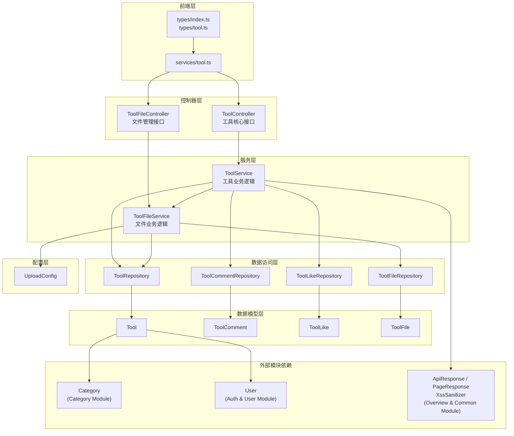
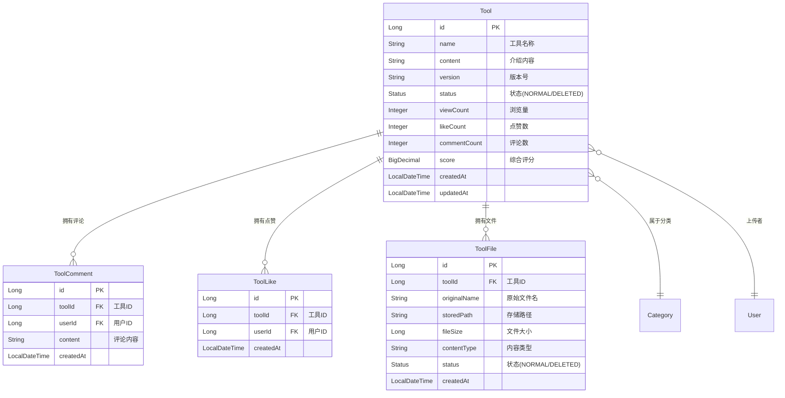
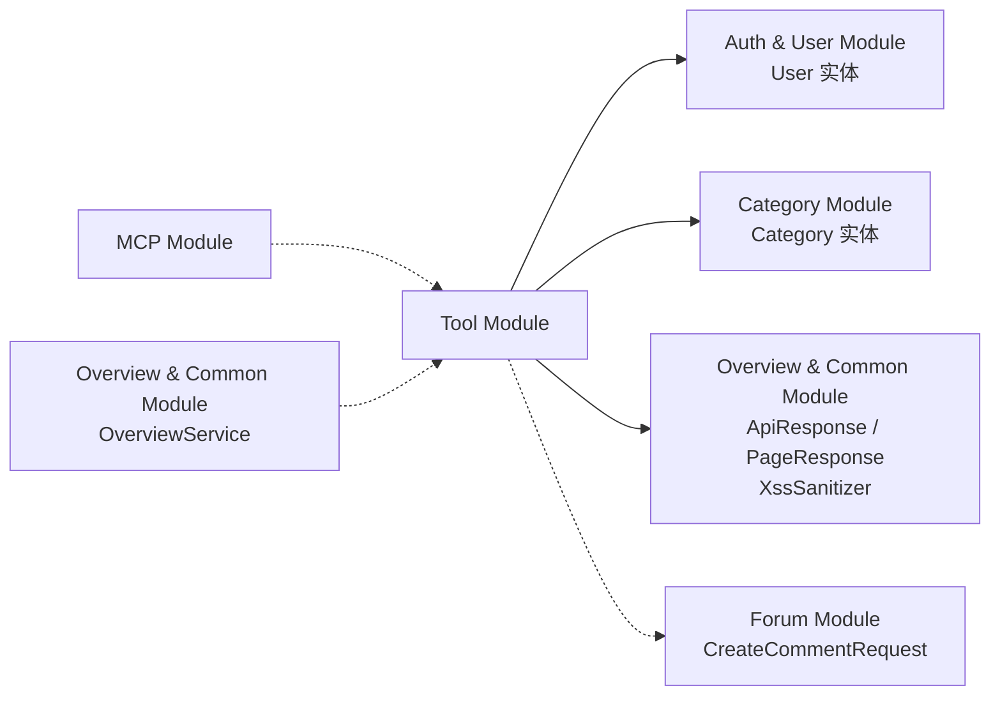
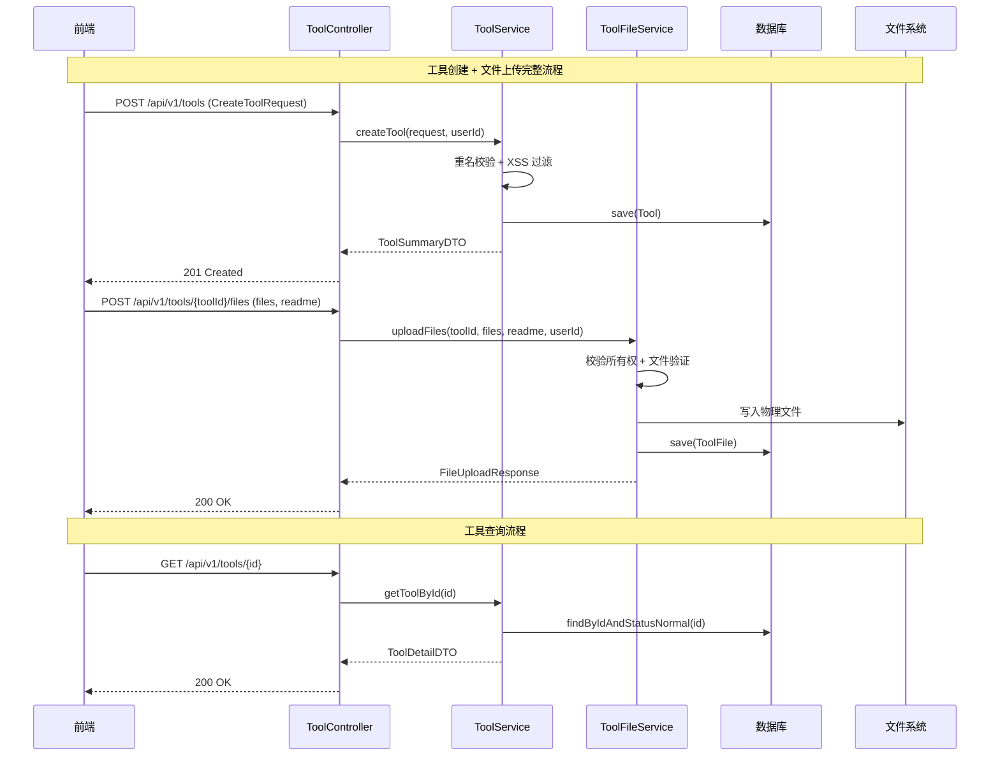

# Tool Module（工具模块）

## 1. 模块简介

Tool Module 是 IAIHub 工具箱平台的核心业务模块，负责工具的完整生命周期管理，包括工具的创建、查询、更新、删除，以及工具的点赞、评论等社交互动功能，同时支持工具附件文件的上传、下载和管理。该模块为用户提供了工具分享与协作的完整能力。

### 核心功能

- **工具 CRUD**：创建、查询（分页/详情）、更新、删除工具
- **社交互动**：点赞/取消点赞、评论功能
- **文件管理**：工具附件的上传、下载、删除，支持 README 文件
- **评分系统**：基于浏览量、点赞数、评论数的综合评分算法
- **搜索与排序**：按分类、关键词过滤，支持按时间/名称排序

## 2. 架构概览



## 3. 子模块划分

Tool Module 按职责划分为两个子模块：

| 子模块 | 说明 | 文档 |
|--------|------|------|
| 工具核心子模块 | 工具的 CRUD、点赞、评论等核心业务逻辑 | [工具核心子模块.md](工具核心子模块.md) |
| 工具文件子模块 | 工具附件文件的上传、下载、删除及存储管理 | [工具文件子模块.md](工具文件子模块.md) |

## 4. 数据模型



### 评分算法

Tool 实体内置了综合评分算法，评分公式为：

```
score = viewCount × 1 + likeCount × 3 + commentCount × 5
```

每当浏览量、点赞数或评论数发生变化时，`updateScore()` 方法会自动重新计算评分。该评分用于 [Overview & Common Module](Overview%20&%20Common%20Module.md) 中的工具排行榜功能。

## 5. API 接口概览

### 工具核心接口（ToolController）

| 方法 | 路径 | 说明 | 认证 |
|------|------|------|------|
| GET | `/api/v1/tools` | 分页查询工具列表 | 否 |
| GET | `/api/v1/tools/{id}` | 获取工具详情 | 否 |
| POST | `/api/v1/tools` | 创建工具 | 是 |
| PUT | `/api/v1/tools/{id}` | 更新工具 | 是（仅作者） |
| DELETE | `/api/v1/tools/{id}` | 删除工具 | 是（仅作者） |
| POST | `/api/v1/tools/{id}/like` | 点赞工具 | 是 |
| DELETE | `/api/v1/tools/{id}/like` | 取消点赞 | 是 |
| GET | `/api/v1/tools/{id}/like-status` | 查询点赞状态 | 可选 |
| POST | `/api/v1/tools/{id}/comments` | 添加评论 | 是 |
| GET | `/api/v1/tools/{id}/comments` | 获取评论列表 | 否 |

### 工具文件接口（ToolFileController）

| 方法 | 路径 | 说明 | 认证 |
|------|------|------|------|
| POST | `/api/v1/tools/{toolId}/files` | 上传文件 | 可选 |
| GET | `/api/v1/tools/{toolId}/files` | 获取文件列表 | 否 |
| DELETE | `/api/v1/tools/{toolId}/files/{fileId}` | 删除文件 | 是（仅作者） |
| GET | `/api/v1/tools/{toolId}/files/{fileId}/download` | 下载文件 | 否 |

## 6. 跨模块依赖关系



| 依赖模块 | 依赖内容 | 说明 |
|----------|----------|------|
| [Auth & User Module](Auth%20&%20User%20Module.md) | `User` 实体 | 工具上传者关联，评论用户信息 |
| [Category Module](Category%20Module.md) | `Category` 实体 | 工具分类关联 |
| [Overview & Common Module](Overview%20&%20Common%20Module.md) | `ApiResponse`、`PageResponse`、`XssSanitizer` | 统一响应封装、分页响应、XSS 防护 |
| [Forum Module](Forum%20Module.md) | `CreateCommentRequest` | 工具评论复用论坛的评论请求 DTO |
| [MCP Module](MCP%20Module.md) | `ToolRepository` 方法 | MCP Server 通过 Repository 查询工具数据 |

## 7. 数据流概览



> 工具核心业务逻辑的详细流程图（创建、删除、点赞、评论）请参见 [工具核心子模块.md](工具核心子模块.md)。
> 文件上传、下载、删除的详细流程图请参见 [工具文件子模块.md](工具文件子模块.md)。

## 8. 前端类型定义

前端使用 TypeScript 定义了与后端 DTO 对应的类型接口，主要分布在以下文件中：

- `frontend/src/types/index.ts`：`ToolSummary`、`ToolDetail`、`CreateToolRequest`、`UpdateToolRequest`、`ToolFile`、`FileListResponse`、`FileUploadResponse`
- `frontend/src/types/tool.ts`：`ToolDetailDTO`、`ToolSummary`
- `frontend/src/services/tool.ts`：`ToolDetailVO`（扩展自 `ToolDetailDTO`）、`Comment`，以及工具详情、点赞、评论等 API 调用函数

## 9. 安全机制

| 安全措施 | 实现方式 | 说明 |
|----------|----------|------|
| XSS 防护 | `XssSanitizer.sanitize()` | 工具内容和评论内容在保存前进行 HTML 转义 |
| 权限控制 | `@AuthenticationPrincipal` | 创建/更新/删除操作需认证，更新/删除仅限作者 |
| 输入校验 | `@Valid` + Jakarta Validation | 请求 DTO 使用 `@NotBlank`、`@Size`、`@Pattern` 等注解校验 |
| 软删除 | `Status.DELETED` | 工具和文件采用软删除策略，不物理删除记录 |
| 文件校验 | `ToolFileService.validateFile()` | 校验文件大小（单文件 50MB，总计 200MB）和可选扩展名白名单 |
