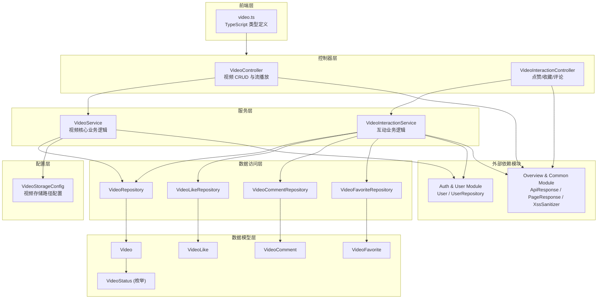
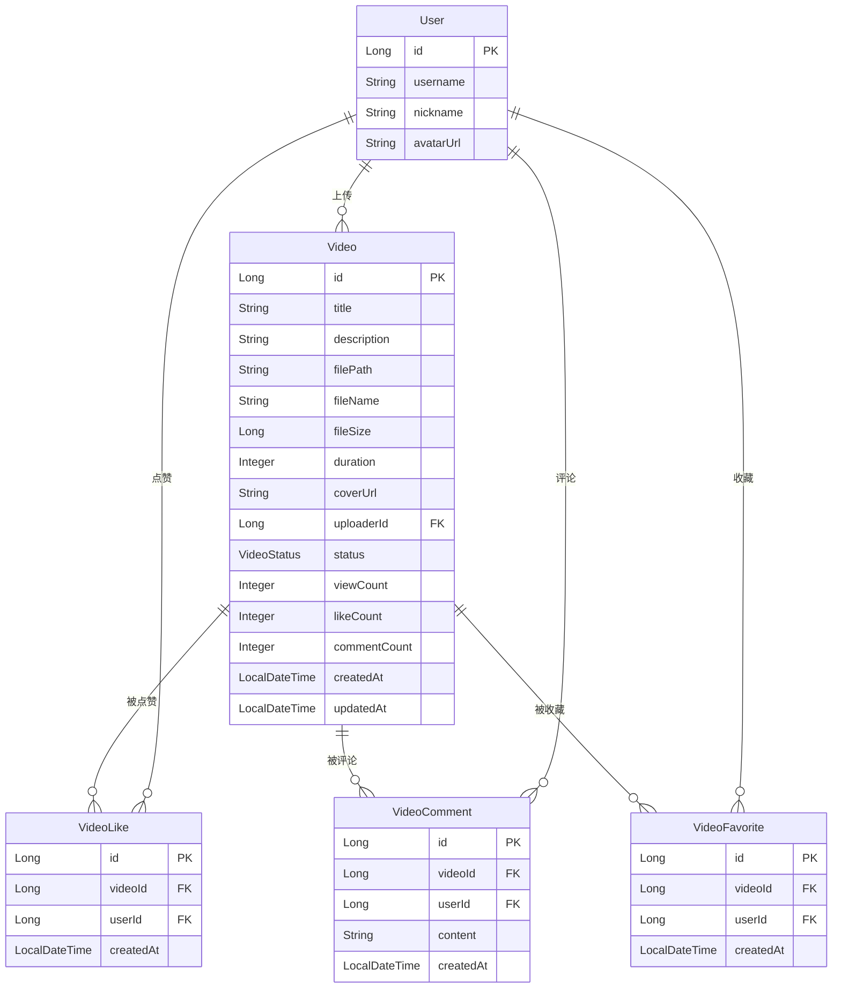
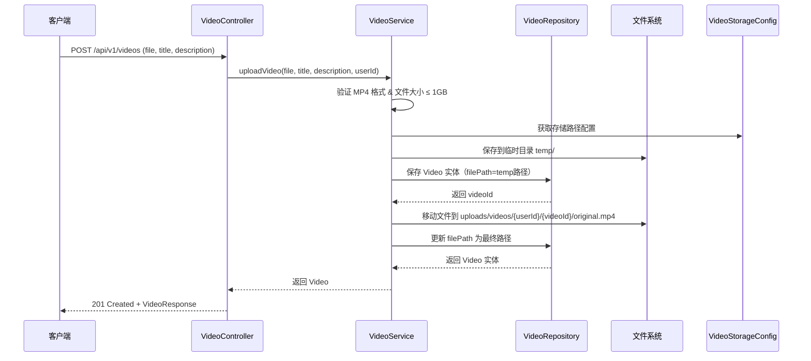
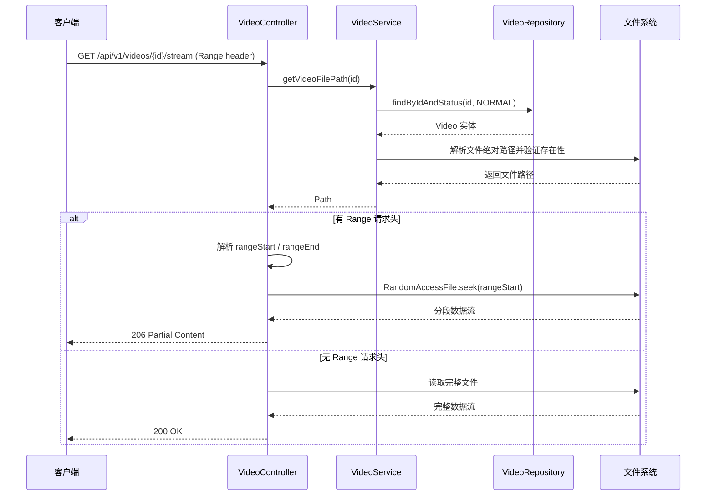

# Video Module（视频模块）

## 1. 模块简介

Video Module 是 IAIHub Toolbox 平台的视频管理模块，提供视频上传、播放、管理以及用户互动（点赞、收藏、评论）等完整功能。该模块支持 MP4 格式视频文件的上传与存储，通过 HTTP Range 请求实现视频流式播放，并具备完善的用户互动机制。

### 核心功能

| 功能领域 | 说明 |
|---------|------|
| 视频上传 | 支持 MP4 格式，最大 1GB，自动生成唯一文件名并存储到结构化目录 |
| 视频播放 | 基于 HTTP Range 的流式播放，支持分段加载与随机定位 |
| 视频管理 | 视频信息的查看、更新、删除（软删除） |
| 用户互动 | 点赞（toggle）、收藏（toggle）、评论（含 XSS 过滤） |
| 个人中心 | 查看自己上传的视频列表与收藏列表 |

## 2. 架构概览

## 3. 子模块划分

Video Module 按职责划分为两个子模块：

| 子模块 | 文档 | 说明 |
|--------|------|------|
| 视频核心子模块 | [视频核心子模块.md](视频核心子模块.md) | 负责视频的上传、存储、播放、CRUD 管理及存储配置 |
| 视频互动子模块 | [视频互动子模块.md](视频互动子模块.md) | 负责视频的点赞、收藏、评论等用户互动功能 |

## 4. 数据模型关系

## 5. API 接口总览

### 5.1 视频核心接口（VideoController）

| 方法 | 路径 | 说明 | 认证 |
|------|------|------|------|
| POST | `/api/v1/videos` | 上传视频 | ✅ |
| GET | `/api/v1/videos` | 获取视频列表（分页） | ❌ |
| GET | `/api/v1/videos/{id}` | 获取视频详情 | 可选 |
| PUT | `/api/v1/videos/{id}` | 更新视频信息 | ✅ |
| DELETE | `/api/v1/videos/{id}` | 删除视频（软删除） | ✅ |
| GET | `/api/v1/videos/{id}/stream` | 视频流播放（支持 Range） | ❌ |
| GET | `/api/v1/videos/my` | 获取我上传的视频 | ✅ |

### 5.2 视频互动接口（VideoInteractionController）

| 方法 | 路径 | 说明 | 认证 |
|------|------|------|------|
| POST | `/api/v1/videos/{id}/like` | 切换点赞状态 | ✅ |
| POST | `/api/v1/videos/{id}/favorite` | 切换收藏状态 | ✅ |
| GET | `/api/v1/videos/{id}/comments` | 获取评论列表（分页） | ❌ |
| POST | `/api/v1/videos/{id}/comments` | 添加评论 | ✅ |
| GET | `/api/v1/videos/my/favorites` | 获取我的收藏列表 | ✅ |

## 6. 视频上传与存储流程

## 7. 视频流播放流程

## 8. 跨模块依赖

Video Module 依赖以下外部模块：

| 依赖模块 | 依赖组件 | 用途 |
|---------|---------|------|
| [Auth & User Module](Auth%20%26%20User%20Module.md) | `User`, `UserRepository` | 获取上传者信息（用户名、昵称、头像） |
| [Overview & Common Module](Overview%20%26%20Common%20Module.md) | `ApiResponse`, `PageResponse` | 统一 API 响应封装与分页响应 |
| [Overview & Common Module](Overview%20%26%20Common%20Module.md) | `XssSanitizer` | 评论内容 XSS 过滤 |

## 9. 技术要点

### 9.1 视频存储策略

- **存储根目录**：通过 `app.upload.base-dir` 配置，默认为 `~/aifiles`
- **目录结构**：`{baseDir}/uploads/videos/{userId}/{videoId}/original.mp4`
- **临时目录**：上传时先存入 `temp/` 目录，获取 videoId 后再移动到最终路径
- **自动创建**：`VideoStorageConfig` 在 `@PostConstruct` 阶段自动创建所需目录

### 9.2 软删除机制

视频删除采用软删除策略，通过 `VideoStatus` 枚举（`NORMAL` / `DELETED`）标记状态。所有查询均通过 `findByIdAndStatus(id, VideoStatus.NORMAL)` 过滤已删除视频，确保数据可追溯。

### 9.3 互动计数维护

`Video` 实体内置计数器（`viewCount`、`likeCount`、`commentCount`），通过实体方法（`incrementViewCount()`、`incrementLikeCount()` 等）在事务中同步更新，避免额外查询开销。

### 9.4 唯一约束

`VideoLike` 和 `VideoFavorite` 表均设置了 `(video_id, user_id)` 联合唯一约束，确保同一用户对同一视频只能有一条点赞/收藏记录，支持 toggle 操作的幂等性。

### 9.5 前端类型定义

前端 TypeScript 类型定义位于 `frontend/src/types/video.ts`，与后端 DTO 保持一一对应关系，包括 `VideoListItem`、`VideoDetail`、`VideoComment`、`VideoInteractionResponse` 等接口。
