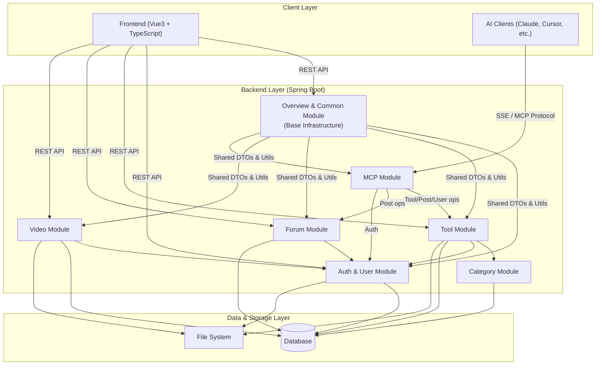

# CodingHub Repository Overview

## Purpose
CodingHub (IAIHub Toolbox) is a comprehensive platform designed for developers and AI enthusiasts to share tools, engage in community discussions, and share videos. It provides a robust set of features including user authentication, tool management with file uploads, a community forum with comments and likes, video streaming, and an MCP (Model Context Protocol) server that allows AI clients (like Claude Desktop) to interact with the platform's data and services.

## End-to-End Architecture

## Core Modules Documentation

- [Auth & User Module](Auth%20&%20User%20Module.md): Handles user registration, login, JWT authentication, and avatar management.
- [Tool Module](Tool%20Module.md): Manages the lifecycle of tools, including CRUD operations, likes, comments, and file uploads.
- [Category Module](Category%20Module.md): Provides tool categorization and initialization of default categories.
- [Forum Module](Forum%20Module.md): Powers the community forum with posts, comments, likes, favorites, categories, and tags.
- [Video Module](Video%20Module.md): Handles video uploads, streaming (HTTP Range), and user interactions (likes, comments, favorites).
- [MCP Module](MCP%20Module.md): Implements the Model Context Protocol server, allowing AI clients to search, create, and manage tools and forum posts.
- [Overview & Common Module](Overview%20&%20Common%20Module.md): Provides base infrastructure, including shared DTOs, XSS sanitization, data initialization, and platform overview statistics.