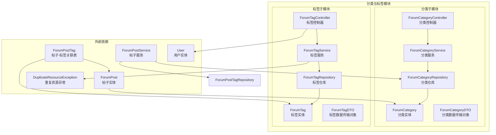
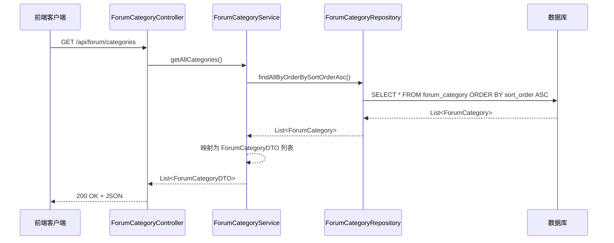
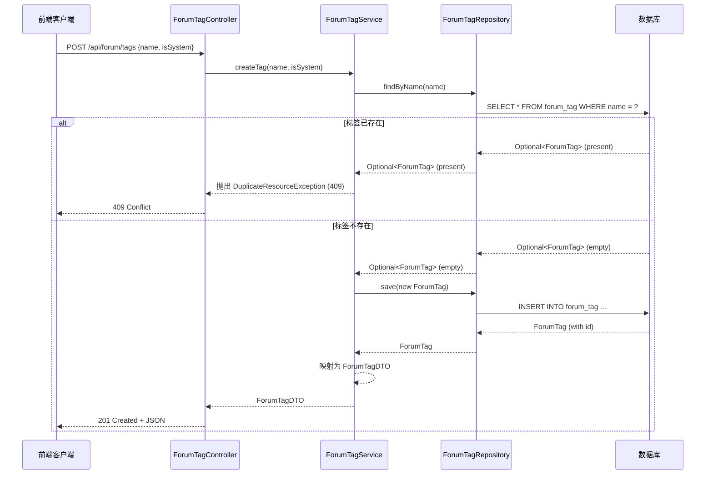
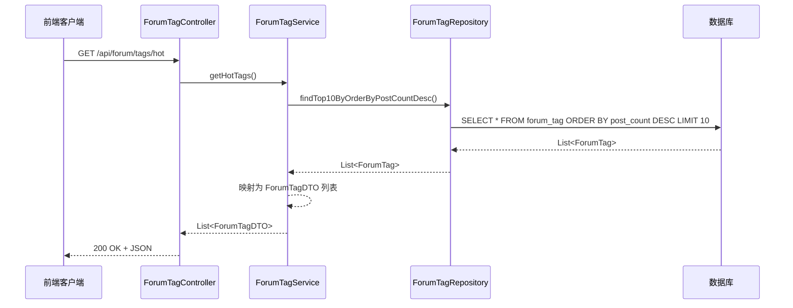
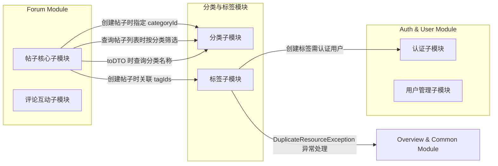

# 分类与标签模块

## 模块简介

分类与标签模块是 [Forum Module](Forum%20Module.md)（论坛模块）的核心子模块之一，负责论坛帖子的分类管理与标签管理。该模块为论坛帖子提供两种维度的组织方式：

- **分类（Category）**：预定义的、互斥的帖子归类方式，每个帖子必须归属于一个分类。分类具有排序权重，支持按顺序展示。
- **标签（Tag）**：灵活的、可多选的帖子标记方式，一个帖子可以关联多个标签。标签支持系统标签与用户自定义标签，并按使用频次（帖子数）排序展示热门标签。

该模块与 [帖子核心](Forum%20Module.md) 子模块紧密协作：帖子创建时必须指定分类，可选关联多个标签；帖子列表查询支持按分类筛选。

---

## 架构概览



---

## 组件详解

### 一、分类子模块

#### 1. ForumCategory（分类实体）

| 属性 | 类型 | 说明 |
|------|------|------|
| `id` | `Long` | 主键，自增 |
| `name` | `String` | 分类名称，不可为空，唯一，最大50字符 |
| `description` | `String` | 分类描述，最大255字符 |
| `sortOrder` | `Integer` | 排序权重，默认0，值越小越靠前 |
| `createdAt` | `LocalDateTime` | 创建时间，通过 `@PrePersist` 自动设置 |

**数据库表**：`forum_category`

#### 2. ForumCategoryRepository（分类仓库）

继承 `JpaRepository<ForumCategory, Long>`，提供自定义查询方法：

| 方法 | 说明 |
|------|------|
| `findAllByOrderBySortOrderAsc()` | 按排序权重升序获取所有分类 |

#### 3. ForumCategoryService（分类服务）

| 方法 | 说明 |
|------|------|
| `getAllCategories()` | 获取所有分类，按 `sortOrder` 升序排列，返回 `ForumCategoryDTO` 列表 |

> **注意**：当前 `postCount` 字段硬编码为 `0`，尚未实现实际帖子数量统计。

#### 4. ForumCategoryController（分类控制器）

**基础路径**：`/api/forum/categories`

| HTTP 方法 | 路径 | 说明 | 认证要求 |
|-----------|------|------|----------|
| `GET` | `/api/forum/categories` | 获取所有分类列表 | 无需认证 |

#### 5. ForumCategoryDTO（分类数据传输对象）

```java
public record ForumCategoryDTO(
    Long id,
    String name,
    String description,
    Integer sortOrder,
    Integer postCount
)
```

---

### 二、标签子模块

#### 1. ForumTag（标签实体）

| 属性 | 类型 | 说明 |
|------|------|------|
| `id` | `Long` | 主键，自增 |
| `name` | `String` | 标签名称，不可为空，唯一，最大50字符 |
| `postCount` | `Integer` | 关联帖子数量，默认0 |
| `isSystem` | `Boolean` | 是否为系统标签，默认 `false` |
| `createdAt` | `LocalDateTime` | 创建时间，通过 `@PrePersist` 自动设置 |

**数据库表**：`forum_tag`

#### 2. ForumTagRepository（标签仓库）

继承 `JpaRepository<ForumTag, Long>`，提供自定义查询方法：

| 方法 | 说明 |
|------|------|
| `findByName(String name)` | 按名称查找标签，返回 `Optional` |
| `findTop10ByOrderByPostCountDesc()` | 获取帖子数最多的前10个热门标签 |
| `findByNameContaining(String keyword)` | 按关键词模糊搜索标签 |

#### 3. ForumTagService（标签服务）

| 方法 | 说明 |
|------|------|
| `getAllTags()` | 获取所有标签列表 |
| `getHotTags()` | 获取热门标签（按帖子数降序取前10） |
| `createTag(String name, boolean isSystem)` | 创建新标签，名称重复时抛出 `DuplicateResourceException`（HTTP 409） |

**创建标签流程**：
1. 检查标签名称是否已存在（`findByName`）
2. 若已存在，抛出 `DuplicateResourceException`（状态码 409）
3. 创建并保存新标签
4. 返回 `ForumTagDTO`

#### 4. ForumTagController（标签控制器）

**基础路径**：`/api/forum/tags`

| HTTP 方法 | 路径 | 说明 | 认证要求 |
|-----------|------|------|----------|
| `GET` | `/api/forum/tags` | 获取所有标签列表 | 无需认证 |
| `GET` | `/api/forum/tags/hot` | 获取热门标签（前10） | 无需认证 |
| `POST` | `/api/forum/tags` | 创建新标签 | 需要认证（`@AuthenticationPrincipal`） |

**创建标签请求体**：

```java
public record TagCreateRequest(String name, Boolean isSystem)
```

| 字段 | 类型 | 说明 |
|------|------|------|
| `name` | `String` | 标签名称（必填） |
| `isSystem` | `Boolean` | 是否为系统标签，默认 `false` |

#### 5. ForumTagDTO（标签数据传输对象）

```java
public record ForumTagDTO(
    Long id,
    String name,
    Integer postCount,
    Boolean isSystem
)
```

---

## 数据模型关系

```mermaid
erDiagram
    ForumCategory ||--o{ ForumPost : "分类下包含帖子"
    ForumPost ||--o{ ForumPostTag : "帖子关联标签"
    ForumTag ||--o{ ForumPostTag : "标签被帖子引用"

    ForumCategory {
        Long id PK
        String name UK
        String description
        Integer sortOrder
        LocalDateTime createdAt
    }

    ForumTag {
        Long id PK
        String name UK
        Integer postCount
        Boolean isSystem
        LocalDateTime createdAt
    }

    ForumPost {
        Long id PK
        String title
        String content
        Long authorId FK
        Long categoryId FK
        Integer viewCount
        Integer likeCount
        Integer commentCount
        String status
        BigDecimal score
        LocalDateTime createdAt
        LocalDateTime updatedAt
    }

    ForumPostTag {
        Long postId PK, FK
        Long tagId PK, FK
    }
```



**关系说明**：
- `ForumPost` 与 `ForumCategory`：**多对一**关系。每个帖子必须归属一个分类（`categoryId` 不可为空），通过 `ForumPost.categoryId` 外键关联。
- `ForumPost` 与 `ForumTag`：**多对多**关系。通过中间表 `forum_post_tag`（`ForumPostTag` 实体）关联，使用复合主键 `(postId, tagId)`。

---

## API 交互流程

### 获取分类列表流程



### 创建标签流程



### 获取热门标签流程



---

## 与其他模块的交互



### 关键交互点

| 交互方 | 方向 | 说明 |
|--------|------|------|
| [帖子核心子模块](Forum%20Module.md) → 分类子模块 | 依赖 | `ForumPostService` 在创建帖子时验证 `categoryId`，在 `toDTO` 中查询分类名称 |
| [帖子核心子模块](Forum%20Module.md) → 标签子模块 | 依赖 | `ForumPostService` 在创建帖子时通过 `ForumPostTagRepository` 关联标签 |
| 标签子模块 → [认证子模块](Auth%20%26%20User%20Module.md) | 依赖 | `ForumTagController.createTag` 使用 `@AuthenticationPrincipal User` 获取当前认证用户 |
| 标签子模块 → [Overview & Common Module](Overview%20%26%20Common%20Module.md) | 依赖 | `ForumTagService` 使用 `DuplicateResourceException`（继承自 `BusinessException`）处理重复标签 |

---

## 前端类型定义

前端类型定义位于 `frontend/src/types/forum.ts`：

```typescript
// 分类类型
interface ForumCategory {
  id: number;
  name: string;
  description: string;
  sortOrder: number;
  postCount: number;
}

// 标签类型
interface ForumTag {
  id: number;
  name: string;
  postCount: number;
  isSystem: boolean;
}
```

---

## API 接口汇总

| HTTP 方法 | 路径 | 功能 | 认证 | 响应类型 |
|-----------|------|------|------|----------|
| `GET` | `/api/forum/categories` | 获取所有分类（按排序权重升序） | 否 | `List<ForumCategoryDTO>` |
| `GET` | `/api/forum/tags` | 获取所有标签 | 否 | `List<ForumTagDTO>` |
| `GET` | `/api/forum/tags/hot` | 获取热门标签（前10） | 否 | `List<ForumTagDTO>` |
| `POST` | `/api/forum/tags` | 创建新标签 | 是 | `ForumTagDTO` (201) |

---

## 设计说明与注意事项

### 分类与标签的区别

| 维度 | 分类（Category） | 标签（Tag） |
|------|------------------|-------------|
| 关系类型 | 多对一（帖子→分类） | 多对多（帖子↔标签） |
| 必填性 | 帖子必须指定分类 | 帖子可选关联标签 |
| 创建方式 | 仅系统预置（无创建API） | 支持用户创建（需认证） |
| 排序方式 | 按 `sortOrder` 升序 | 按 `postCount` 降序（热门） |
| 系统标识 | 无 | 有 `isSystem` 字段区分系统/用户标签 |

### 已知限制

1. **分类帖子数未实现**：`ForumCategoryService.getAllCategories()` 中 `postCount` 硬编码为 `0`，未实际统计各分类下的帖子数量。
2. **标签帖子数同步**：`ForumTag.postCount` 字段的更新逻辑不在本模块内，需由 [帖子核心子模块](Forum%20Module.md) 在帖子创建/删除时维护。
3. **分类管理接口缺失**：当前仅提供分类查询接口，未提供分类的创建、更新、删除接口，分类数据通过 [DataInitializer](Overview%20%26%20Common%20Module.md) 在系统启动时预置。
4. **标签删除接口缺失**：当前未提供标签删除接口。
