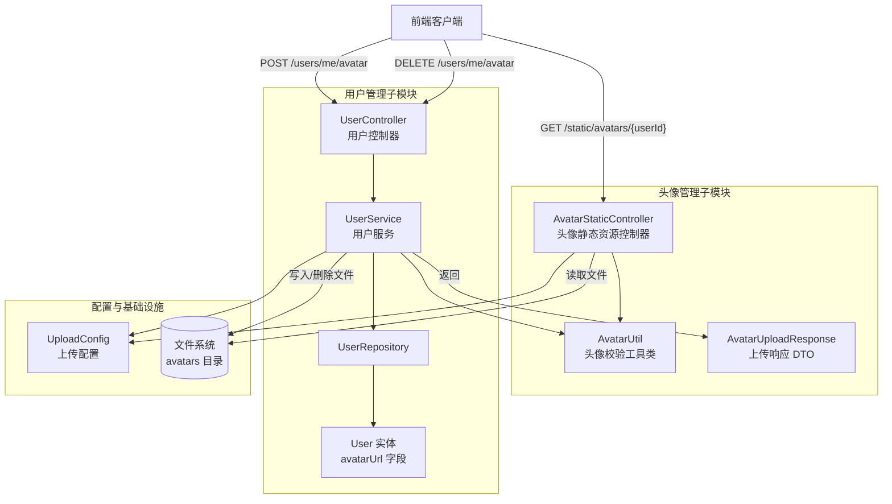
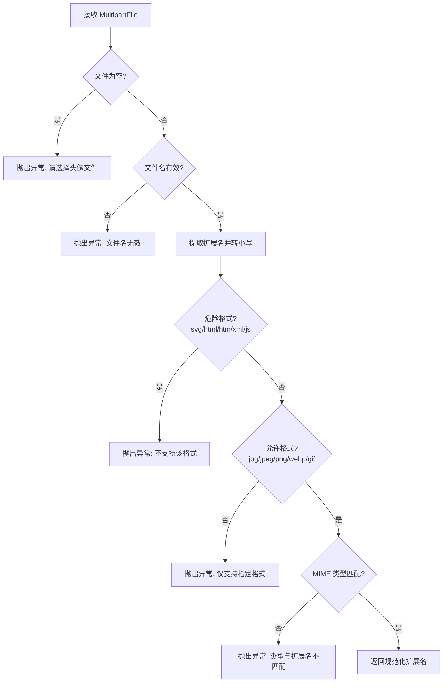
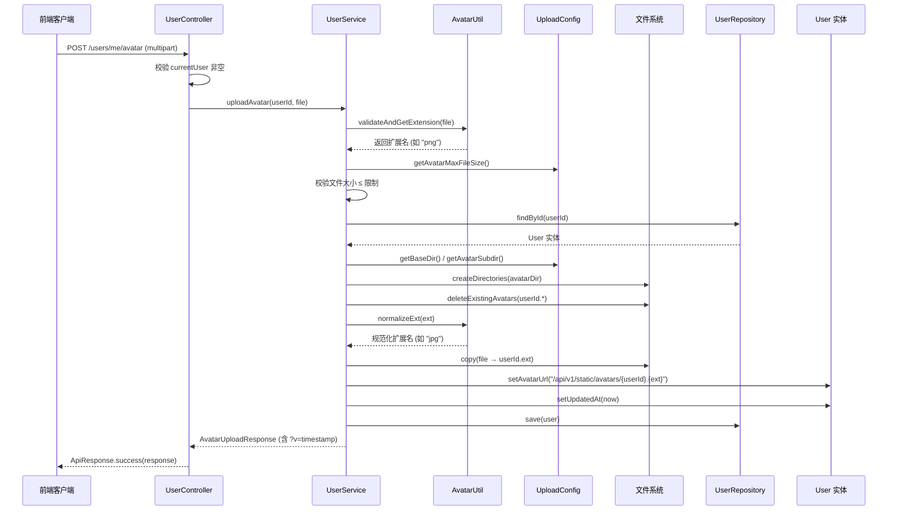
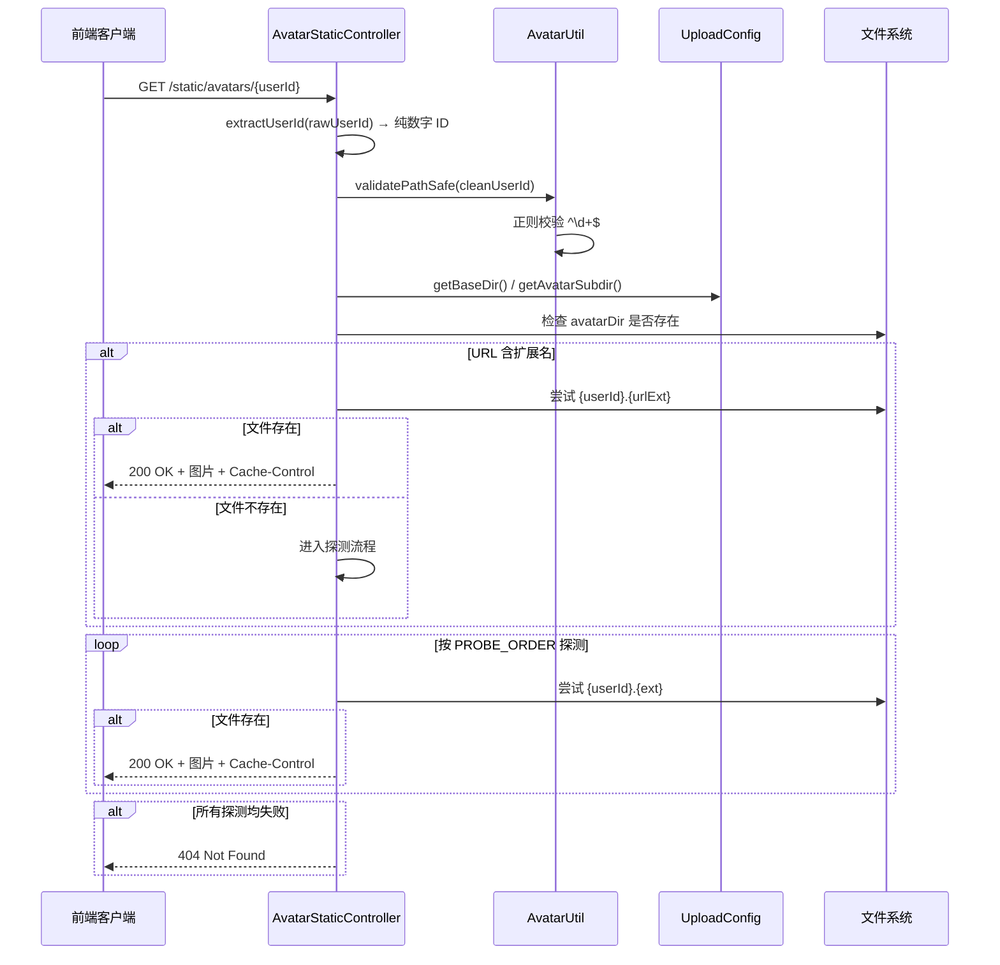
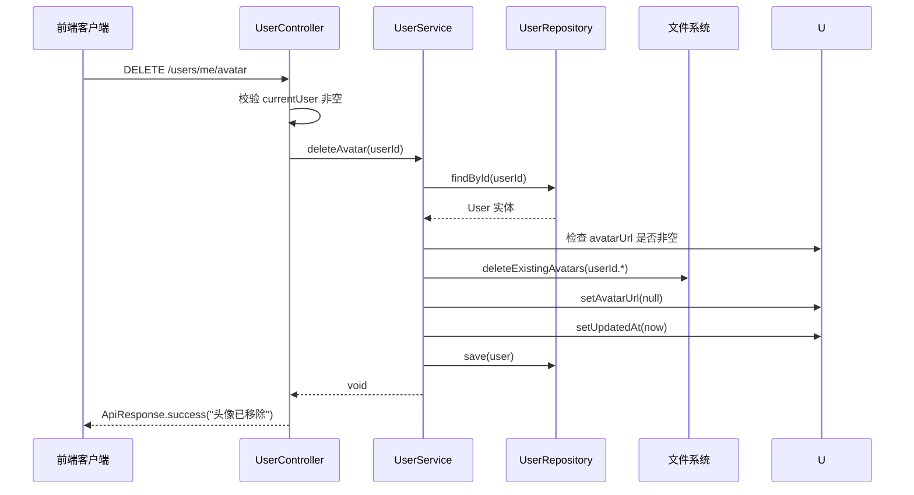
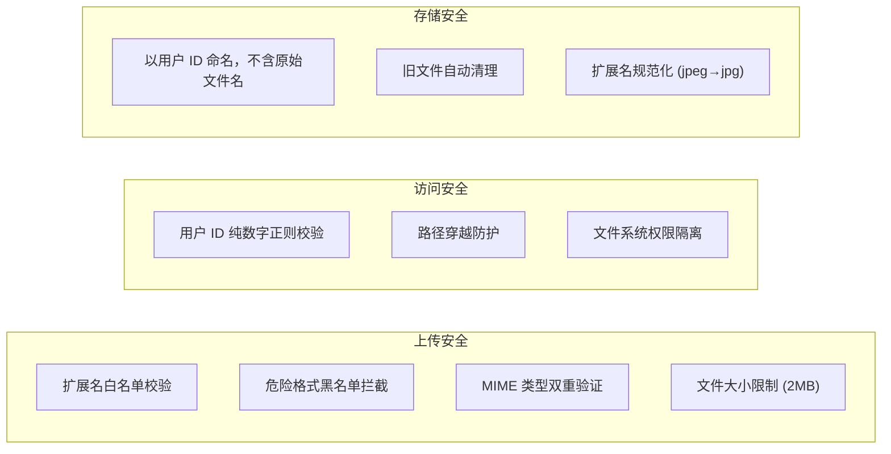
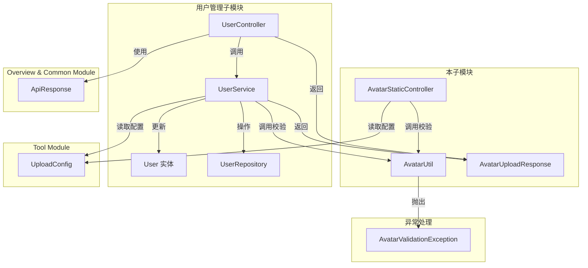

# 头像管理子模块

## 概述

头像管理子模块是 **Auth & User Module** 的子模块之一，负责用户头像文件的上传校验、静态资源服务与删除管理。该子模块通过文件系统存储头像图片，并提供 HTTP 静态资源端点供前端访问，同时与 [用户管理子模块](用户管理子模块.md) 中的 `UserService` 和 `UserController` 紧密协作，完成头像的完整生命周期管理。

### 核心职责

| 职责 | 说明 |
|------|------|
| 头像上传校验 | 校验文件扩展名、MIME 类型、文件大小，防止上传危险格式文件 |
| 头像静态服务 | 通过 HTTP 端点提供头像图片的访问，支持多格式探测与缓存控制 |
| 路径安全防护 | 防止路径穿越攻击，确保仅允许纯数字用户 ID 访问 |
| 头像删除管理 | 删除旧头像文件并清理用户实体中的头像 URL |

---

## 架构总览



---

## 核心组件

### 1. AvatarStaticController — 头像静态资源控制器

**文件路径**: `backend/src/main/java/com/iaihub/toolbox/controller/AvatarStaticController.java`

**路由前缀**: `/api/v1/static/avatars`

该控制器负责将文件系统中存储的头像图片以 HTTP 静态资源的形式对外提供服务。它支持通过用户 ID 直接访问头像，并具备多格式探测能力。

#### 端点详情

| 方法 | 路径 | 说明 |
|------|------|------|
| GET | `/{userId}` | 根据用户 ID 获取头像图片 |

#### 工作机制

1. **用户 ID 提取**: URL 中的 `userId` 可能包含扩展名（如 `2.jpg`），控制器通过 `extractUserId()` 方法提取纯数字 ID
2. **路径安全校验**: 调用 `AvatarUtil.validatePathSafe()` 确保用户 ID 为纯数字，防止路径穿越攻击
3. **扩展名优先匹配**: 如果 URL 中指定了扩展名（如 `/avatars/2.png`），优先尝试该扩展名对应的文件
4. **多格式探测**: 若未指定扩展名或指定扩展名文件不存在，按 `jpg → png → webp → gif → jpeg` 顺序探测
5. **缓存控制**: 响应设置 `Cache-Control: max-age=3600, public`，缓存 1 小时
6. **Content-Type 自动推断**: 根据文件扩展名设置正确的 `MediaType`（如 `jpg/jpeg` → `image/jpeg`）

#### 探测顺序

```java
private static final List<String> PROBE_ORDER = List.of("jpg", "png", "webp", "gif", "jpeg");
```

---

### 2. AvatarUtil — 头像校验工具类

**文件路径**: `backend/src/main/java/com/iaihub/toolbox/util/AvatarUtil.java`

该工具类为不可实例化的 final 类（私有构造函数），提供头像文件上传校验与路径安全验证的静态方法。

#### 方法说明

| 方法 | 签名 | 说明 |
|------|------|------|
| `validateAndGetExtension` | `String validateAndGetExtension(MultipartFile file)` | 校验上传文件的有效性并返回规范化扩展名 |
| `validatePathSafe` | `void validatePathSafe(String userIdStr)` | 校验用户 ID 是否为纯数字，防止路径穿越 |
| `normalizeExt` | `String normalizeExt(String ext)` | 规范化扩展名（`jpeg` → `jpg`，null → `jpg`） |

#### 校验规则

**文件上传校验 (`validateAndGetExtension`)**:



**允许的扩展名白名单**:
- `jpg`, `jpeg`, `png`, `webp`, `gif`

**危险扩展名黑名单**（显式拒绝）:
- `svg`, `html`, `htm`, `xml`, `js`

**允许的 MIME 类型**:
- `image/jpeg`, `image/png`, `image/webp`, `image/gif`

**路径安全校验 (`validatePathSafe`)**:
- 使用正则 `^\d+$` 校验，确保用户 ID 仅包含数字字符
- 防止通过构造恶意路径（如 `../../etc/passwd`）进行路径穿越攻击

---

### 3. AvatarUploadResponse — 头像上传响应 DTO

**文件路径**: `backend/src/main/java/com/iaihub/toolbox/dto/AvatarUploadResponse.java`

头像上传成功后返回给客户端的响应数据结构。

| 字段 | 类型 | 说明 |
|------|------|------|
| `avatarUrl` | `String` | 头像访问 URL（含版本时间戳参数，用于缓存失效） |
| `fileSize` | `Long` | 上传文件大小（字节） |
| `uploadedAt` | `LocalDateTime` | 上传时间 |

> **版本时间戳机制**: `avatarUrl` 末尾附加 `?v={timestamp}` 参数，确保每次上传新头像后前端缓存立即失效，避免显示旧头像。

---

## 与用户管理子模块的协作

头像的上传与删除入口位于 [用户管理子模块](用户管理子模块.md) 的 `UserController` 和 `UserService` 中。头像管理子模块提供校验工具和静态服务能力，由 `UserService` 调用完成完整业务流程。

### 头像上传端点（位于 UserController）

| 方法 | 路径 | Content-Type | 说明 |
|------|------|------|------|
| POST | `/api/v1/users/me/avatar` | `multipart/form-data` | 上传当前用户头像 |
| DELETE | `/api/v1/users/me/avatar` | - | 删除当前用户头像 |

### UserService 中的头像处理逻辑

`UserService` 中的 `uploadAvatar` 和 `deleteAvatar` 方法实现了头像的完整业务流程，它们调用本子模块的 `AvatarUtil` 进行校验，并操作文件系统完成存储。

---

## 业务流程

### 头像上传流程



### 头像静态访问流程



### 头像删除流程



---

## 文件存储结构

```
{baseDir}/                          ← UploadConfig.baseDir (默认 ~/aifiles)
├── avatars/                        ← UploadConfig.avatarSubdir
│   ├── 1.jpg                       ← 用户 ID 为 1 的头像
│   ├── 2.png                       ← 用户 ID 为 2 的头像
│   ├── 42.webp                     ← 用户 ID 为 42 的头像
│   └── ...
├── tools/                          ← 工具附件目录（属于 Tool Module）
└── ...
```

**命名规则**: `{userId}.{normalizedExt}` — 以用户 ID 作为文件名，扩展名经过 `AvatarUtil.normalizeExt()` 规范化处理。

**旧文件清理**: 上传新头像时，`UserService.deleteExistingAvatars()` 使用通配符 `{userId}.*` 删除该用户所有旧格式的头像文件，确保同一用户仅保留一个头像文件。

---

## 配置项

头像管理子模块的配置通过 `UploadConfig`（位于 [Tool Module](Tool_Module.md) 的配置中，但被 Auth & User Module 共享使用）进行管理：

| 配置项 | 属性前缀 | 默认值 | 说明 |
|--------|----------|--------|------|
| `baseDir` | `app.upload.base-dir` | `~/aifiles` | 上传文件根目录 |
| `avatarSubdir` | `app.upload.avatar-subdir` | `avatars` | 头像子目录名 |
| `avatarMaxFileSize` | `app.upload.avatar-max-file-size` | `2MB` | 头像文件大小上限 |
| `avatarAllowedExtensions` | `app.upload.avatar-allowed-extensions` | `jpg, jpeg, png, webp, gif` | 头像允许的扩展名 |

> `UploadConfig` 在 `@PostConstruct` 阶段自动创建头像目录（若不存在），确保系统启动后头像存储路径可用。

---

## 安全机制



### 安全要点

1. **双重扩展名校验**: 先检查危险格式黑名单（svg/html/htm/xml/js），再检查允许格式白名单
2. **MIME 类型一致性**: 文件扩展名与 `Content-Type` 必须匹配，防止伪装文件
3. **路径穿越防护**: `validatePathSafe()` 使用 `^\d+$` 正则确保用户 ID 仅含数字
4. **文件名安全**: 存储时使用 `{userId}.{ext}` 命名，完全丢弃原始文件名，避免注入风险
5. **文件大小限制**: 默认 2MB 上限，通过 `UploadConfig.avatarMaxFileSize` 可配置

---

## 依赖关系



### 外部依赖说明

| 依赖 | 来源模块 | 用途 |
|------|----------|------|
| `UserController` | [用户管理子模块](用户管理子模块.md) | 提供头像上传/删除的 HTTP 端点 |
| `UserService` | [用户管理子模块](用户管理子模块.md) | 实现头像上传/删除的核心业务逻辑 |
| `User` | [用户管理子模块](用户管理子模块.md) | 持有 `avatarUrl` 字段的用户实体 |
| `UploadConfig` | [Tool Module](Tool_Module.md) | 提供上传路径、大小限制等配置 |
| `ApiResponse` | [Overview & Common Module](Overview_Common_Module.md) | 统一 API 响应封装 |
| `AvatarValidationException` | 异常处理模块 | 头像校验失败时抛出的自定义异常 |

---

## API 接口汇总

### 头像管理相关接口

| 方法 | 路径 | 认证 | 说明 | 响应类型 |
|------|------|------|------|----------|
| POST | `/api/v1/users/me/avatar` | ✅ 需要 | 上传当前用户头像 | `ApiResponse<AvatarUploadResponse>` |
| DELETE | `/api/v1/users/me/avatar` | ✅ 需要 | 删除当前用户头像 | `ApiResponse<Void>` |
| GET | `/api/v1/static/avatars/{userId}` | ❌ 公开 | 获取用户头像图片 | `ResponseEntity<Resource>` |

> **认证说明**: 头像上传和删除接口需要 JWT 认证（通过 `@AuthenticationPrincipal User` 获取当前用户），头像静态访问接口为公开访问（在 [认证子模块](认证子模块.md) 的 `SecurityConfig` 中配置为白名单路径）。

---

## 错误处理

| 异常 | 触发场景 | HTTP 状态码 |
|------|----------|-------------|
| `AvatarValidationException` | 文件为空、文件名无效、危险格式、不允许的格式、MIME 不匹配 | 400 Bad Request |
| `AvatarValidationException` | 文件大小超过限制 | 400 Bad Request |
| `AvatarValidationException` | 用户 ID 非纯数字（路径穿越尝试） | 400 Bad Request |
| `AvatarValidationException` | 未登录用户尝试上传/删除 | 400 Bad Request |
| `UserNotFoundException` | 用户不存在 | 404 Not Found |
| `RuntimeException` | 无法创建头像目录或写入文件 | 500 Internal Server Error |
