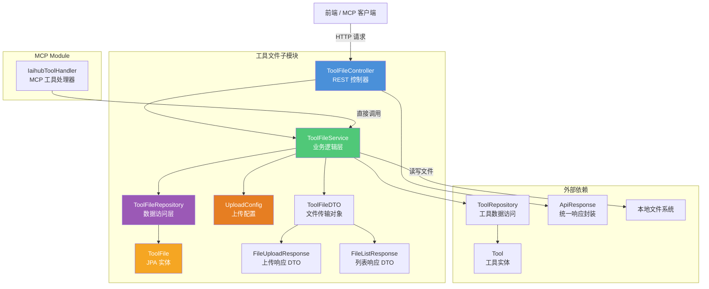
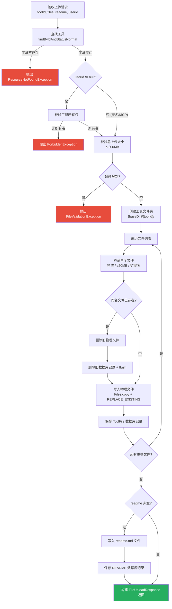
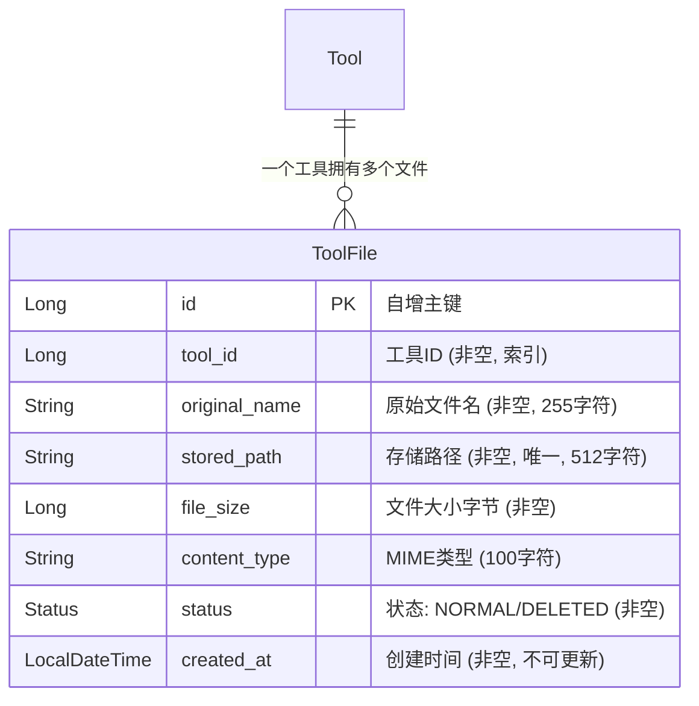
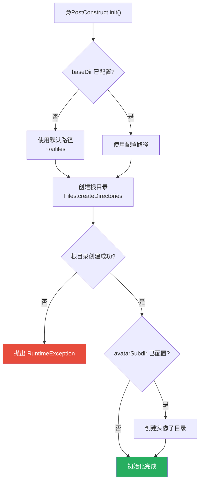
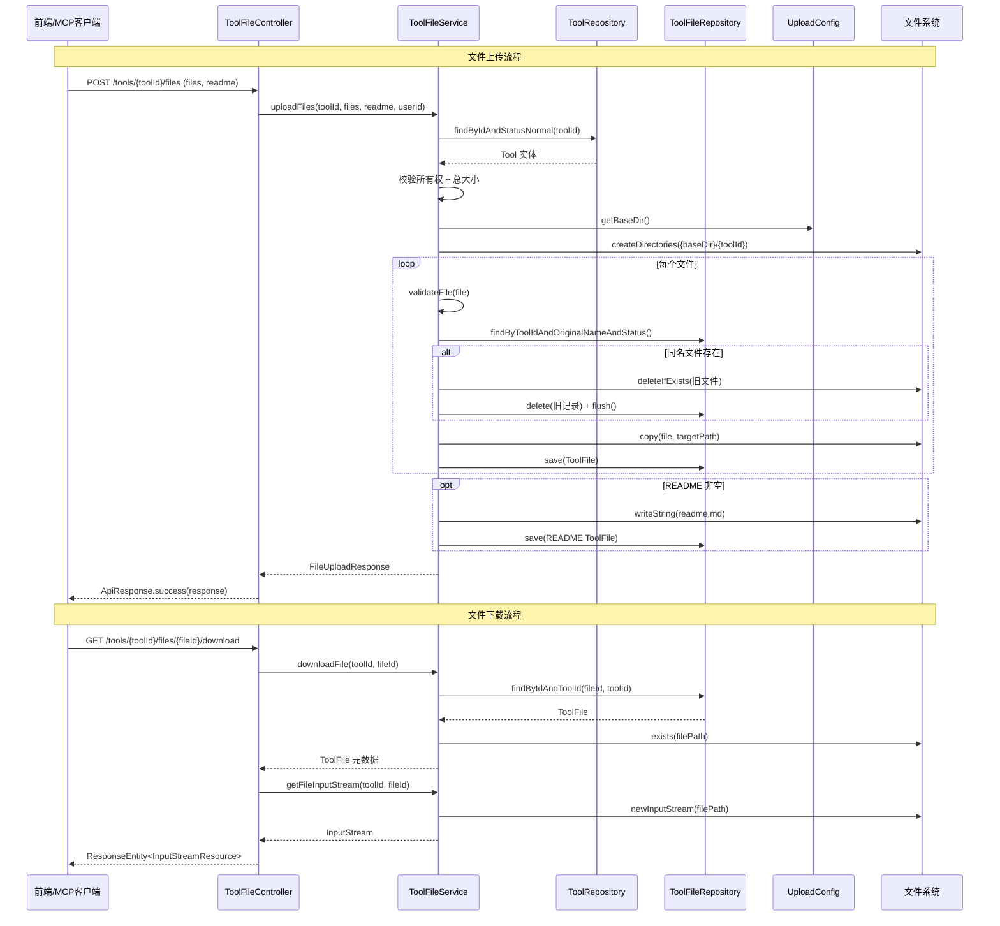
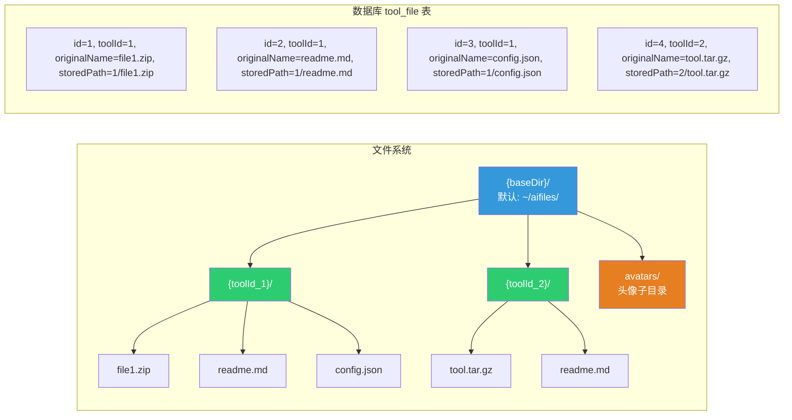
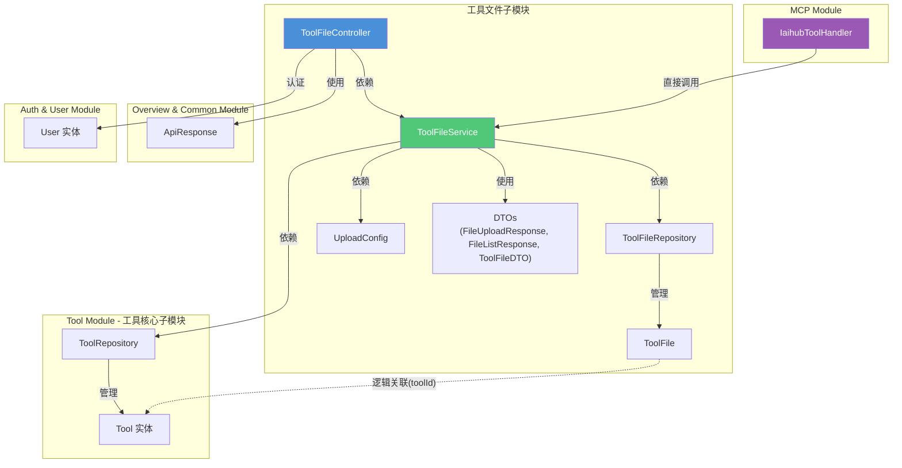

# 工具文件子模块

## 模块简介

工具文件子模块是 **Tool Module** 的子模块之一，负责管理工具附件文件的全生命周期操作，包括文件上传、列表查询、文件下载和文件删除。该模块通过本地文件系统存储物理文件，并使用数据库记录文件元数据，实现文件与工具实体的关联管理。

模块支持多文件批量上传、README 文件自动生成、同名文件替换、文件所有权校验等核心功能，同时为 [MCP Module](MCP%20Module.md) 提供文件操作能力，使 MCP 客户端能够通过编程方式管理工具附件。

---

## 架构总览



---

## 核心组件

### 1. ToolFileController — 文件 REST 控制器

**文件路径：** `backend/src/main/java/com/iaihub/toolbox/controller/ToolFileController.java`

控制器提供工具附件的 CRUD REST API，所有接口均挂载在 `/api/v1/tools/{toolId}/files` 路径下。

| HTTP 方法 | 路径 | 功能 | 认证要求 |
|-----------|------|------|----------|
| `POST` | `/api/v1/tools/{toolId}/files` | 批量上传文件 + README | 可选（匿名上传由 MCP 场景使用） |
| `GET` | `/api/v1/tools/{toolId}/files` | 获取工具文件列表 | 无 |
| `DELETE` | `/api/v1/tools/{toolId}/files/{fileId}` | 删除指定文件 | 必须登录且为工具所有者 |
| `GET` | `/api/v1/tools/{toolId}/files/{fileId}/download` | 下载文件 | 无 |

**关键设计：**
- 上传接口使用 `@AuthenticationPrincipal(expression = "null")` 允许匿名访问，支持 MCP 客户端场景下的匿名上传
- 删除接口强制要求认证用户身份，并校验工具所有权
- 下载接口返回 `ResponseEntity<InputStreamResource>`，支持流式传输大文件

---

### 2. ToolFileService — 文件业务逻辑层

**文件路径：** `backend/src/main/java/com/iaihub/toolbox/service/ToolFileService.java`

核心业务服务，封装所有文件操作的逻辑，包括文件验证、物理存储、数据库记录管理和清理。

#### 核心方法

| 方法 | 事务 | 功能说明 |
|------|------|----------|
| `uploadFiles(toolId, files, readme, userId)` | 读写 | 批量上传文件，支持 README 写入和同名文件替换 |
| `getToolFiles(toolId)` | 只读 | 查询工具下所有正常状态文件，检测 README 是否存在 |
| `downloadFile(toolId, fileId)` | 只读 | 获取文件元数据，校验物理文件是否存在 |
| `getFileInputStream(toolId, fileId)` | 只读 | 获取文件输入流，用于流式下载 |
| `deleteToolFile(toolId, fileId, userId)` | 读写 | 删除物理文件和数据库记录，需校验所有权 |
| `cleanupToolFiles(toolId)` | 读写 | 清理工具下所有文件（物理文件 + 文件夹 + 数据库记录） |

#### 文件上传流程



#### 文件验证规则

| 验证项 | 规则 | 异常类型 |
|--------|------|----------|
| 文件非空 | `file.isEmpty()` 为 false | `FileValidationException` |
| 单文件大小 | ≤ 50MB (`MAX_FILE_SIZE`) | `FileValidationException` |
| 总请求大小 | ≤ 200MB (`MAX_REQUEST_SIZE`) | `FileValidationException` |
| 文件名有效 | `StringUtils.cleanPath` 后非空 | `FileValidationException` |
| 扩展名白名单 | 仅当 `allowedExtensions` 配置非空时校验 | `FileValidationException` |

> **注意：** 扩展名校验默认关闭（`allowedExtensions` 为空列表）。如需启用白名单，在 `application.yml` 中配置 `app.upload.allowed-extensions`。

#### 同名文件替换策略

当上传的文件名与已有文件冲突时，采用 **物理删除 + 数据库删除 + flush** 的策略：
1. 删除旧物理文件（`Files.deleteIfExists`）
2. 物理删除旧数据库记录（`toolFileRepository.delete` + `flush`），释放唯一约束
3. 写入新物理文件（`Files.copy` + `REPLACE_EXISTING`）
4. 保存新数据库记录

---

### 3. ToolFile — 文件实体模型

**文件路径：** `backend/src/main/java/com/iaihub/toolbox/model/ToolFile.java`

JPA 实体，映射 `tool_file` 数据库表，记录工具附件的元数据。

#### 实体结构



#### 字段说明

| 字段 | 类型 | 约束 | 说明 |
|------|------|------|------|
| `id` | `Long` | 主键, 自增 | 文件记录唯一标识 |
| `toolId` | `Long` | 非空, 索引 | 关联的工具 ID |
| `originalName` | `String` | 非空, 255字符 | 用户上传时的原始文件名 |
| `storedPath` | `String` | 非空, 唯一, 512字符 | 相对于 baseDir 的存储路径，格式为 `{toolId}/{fileName}` |
| `fileSize` | `Long` | 非空 | 文件大小（字节） |
| `contentType` | `String` | 100字符 | 文件的 MIME 类型 |
| `status` | `Status` | 非空, 20字符 | 文件状态枚举：`NORMAL`（正常）/ `DELETED`（已删除） |
| `createdAt` | `LocalDateTime` | 非空, 不可更新 | 创建时间，由 `@PrePersist` 自动设置 |

#### 状态枚举

```java
public enum Status {
    NORMAL,   // 正常状态
    DELETED   // 已删除状态
}
```

> **注意：** 当前实现中，文件删除采用物理删除（`deleteById`），`DELETED` 状态主要用于查询过滤。`cleanupToolFiles` 方法也是物理删除所有记录。

---

### 4. ToolFileRepository — 数据访问层

**文件路径：** `backend/src/main/java/com/iaihub/toolbox/repository/ToolFileRepository.java`

继承 `JpaRepository<ToolFile, Long>`，提供工具文件的数据库操作。

#### 查询方法

| 方法 | 返回类型 | 说明 |
|------|----------|------|
| `findByToolId(Long toolId)` | `List<ToolFile>` | 查询工具下所有文件（含已删除） |
| `findByToolIdAndStatusNormal(Long toolId)` | `List<ToolFile>` | 查询工具下所有正常状态文件（JPQL 自定义查询） |
| `findByToolIdAndOriginalNameAndStatus(Long, String, Status)` | `Optional<ToolFile>` | 按工具ID + 文件名 + 状态精确查找（用于同名检测） |
| `findByIdAndToolId(Long id, Long toolId)` | `Optional<ToolFile>` | 按文件ID + 工具ID 查找（确保文件属于指定工具） |
| `deleteByToolId(Long toolId)` | `void` | 批量删除工具下所有文件记录（`@Modifying` + JPQL） |

---

### 5. UploadConfig — 上传配置

**文件路径：** `backend/src/main/java/com/iaihub/toolbox/config/UploadConfig.java`

使用 `@ConfigurationProperties(prefix = "app.upload")` 绑定配置，在 `@PostConstruct` 阶段自动初始化上传目录。

#### 配置项

| 配置属性 | 默认值 | 说明 |
|----------|--------|------|
| `baseDir` | `~/aifiles` | 文件上传根目录（未配置时使用用户主目录下的 `aifiles`） |
| `maxFileSize` | `50MB` | 单文件最大大小 |
| `maxRequestSize` | `200MB` | 单次请求最大总大小 |
| `allowedExtensions` | `[]` (空) | 工具附件允许的扩展名白名单（空时不校验） |
| `avatarSubdir` | `avatars` | 头像子目录名 |
| `avatarMaxFileSize` | `2MB` | 头像最大大小 |
| `avatarAllowedExtensions` | `jpg, jpeg, png, webp, gif` | 头像允许的扩展名 |

#### 初始化流程



> **说明：** `UploadConfig` 同时服务于工具文件子模块和 [头像管理子模块](Auth%20&%20User%20Module.md)（头像子目录配置），但头像相关的配置项在本模块中不使用。

---

### 6. DTO 数据传输对象

#### ToolFileDTO

**文件路径：** `backend/src/main/java/com/iaihub/toolbox/dto/ToolFileDTO.java`

文件信息的标准传输对象，用于所有文件相关响应中。

| 字段 | 类型 | 说明 |
|------|------|------|
| `id` | `Long` | 文件记录 ID |
| `toolId` | `Long` | 所属工具 ID |
| `originalName` | `String` | 原始文件名 |
| `storedPath` | `String` | 存储路径 |
| `fileSize` | `Long` | 文件大小（字节） |
| `contentType` | `String` | MIME 类型 |
| `createdAt` | `LocalDateTime` | 创建时间 |

#### FileUploadResponse

**文件路径：** `backend/src/main/java/com/iaihub/toolbox/dto/FileUploadResponse.java`

文件上传接口的响应对象。

| 字段 | 类型 | 说明 |
|------|------|------|
| `toolId` | `Long` | 工具 ID |
| `files` | `List<ToolFileDTO>` | 已保存的文件列表 |
| `readmeSaved` | `boolean` | README 是否已保存 |

#### FileListResponse

**文件路径：** `backend/src/main/java/com/iaihub/toolbox/dto/FileListResponse.java`

文件列表查询的响应对象。

| 字段 | 类型 | 说明 |
|------|------|------|
| `toolId` | `Long` | 工具 ID |
| `folderPath` | `String` | 文件夹路径（相对路径，如 `1`） |
| `files` | `List<ToolFileDTO>` | 文件列表 |
| `readmeExists` | `boolean` | README 文件是否存在 |

---

## 组件交互关系



---

## 文件存储结构



**存储路径规则：**
- 物理路径：`{baseDir}/{toolId}/{originalName}`
- 数据库 `storedPath`：`{toolId}/{originalName}`（相对于 baseDir）
- README 文件固定命名为 `readme.md`，存储在工具文件夹根目录

---

## 模块依赖关系



### 依赖说明

| 依赖方向 | 被依赖组件 | 依赖说明 |
|----------|-----------|----------|
| ToolFileController → ToolFileService | ToolFileService | 控制器委托所有业务逻辑给服务层 |
| ToolFileController → ApiResponse | ApiResponse | 统一 API 响应封装（来自 [Overview & Common Module](Overview%20&%20Common%20Module.md)） |
| ToolFileController → User | User | 通过 `@AuthenticationPrincipal` 获取当前登录用户 |
| ToolFileService → ToolFileRepository | ToolFileRepository | 文件元数据的 CRUD 操作 |
| ToolFileService → ToolRepository | ToolRepository | 校验工具存在性和所有权（来自 [工具核心子模块](工具核心子模块.md)） |
| ToolFileService → UploadConfig | UploadConfig | 获取文件存储根目录和扩展名白名单配置 |
| IaihubToolHandler → ToolFileService | ToolFileService | MCP 处理器直接调用文件服务进行文件删除等操作（来自 [MCP Module](MCP%20Module.md)） |

---

## API 接口详情

### 上传文件

```
POST /api/v1/tools/{toolId}/files
Content-Type: multipart/form-data
```

**请求参数：**

| 参数 | 类型 | 必填 | 说明 |
|------|------|------|------|
| `toolId` | Path | 是 | 工具 ID |
| `files` | MultipartFile[] | 是 | 文件列表（支持多文件） |
| `readme` | String | 否 | README 内容（Markdown 文本） |

**响应示例：**

```json
{
  "code": 200,
  "message": "文件上传成功",
  "data": {
    "toolId": 1,
    "files": [
      {
        "id": 10,
        "toolId": 1,
        "originalName": "plugin.zip",
        "storedPath": "1/plugin.zip",
        "fileSize": 1048576,
        "contentType": "application/zip",
        "createdAt": "2024-01-15T10:30:00"
      }
    ],
    "readmeSaved": true
  }
}
```

### 获取文件列表

```
GET /api/v1/tools/{toolId}/files
```

**响应示例：**

```json
{
  "code": 200,
  "message": "success",
  "data": {
    "toolId": 1,
    "folderPath": "1",
    "files": [...],
    "readmeExists": true
  }
}
```

### 删除文件

```
DELETE /api/v1/tools/{toolId}/files/{fileId}
Authorization: Bearer {token}
```

**权限要求：** 必须为工具所有者

### 下载文件

```
GET /api/v1/tools/{toolId}/files/{fileId}/download
```

**响应：** 二进制文件流，`Content-Disposition: attachment; filename="原始文件名"`

---

## 与 MCP Module 的集成

工具文件子模块通过 `ToolFileService` 为 [MCP Module](MCP%20Module.md) 的 `IaihubToolHandler` 提供以下能力：

| MCP 操作 | 调用方法 | 说明 |
|----------|----------|------|
| 获取工具文件列表 | `searchService.getToolFiles(toolId)` | 通过 McpSearchService 间接查询 |
| 获取文件下载链接 | `searchService.getToolFile(toolId, fileId)` | 返回 REST API 下载 URL |
| 获取文件上传信息 | `handleToolFileUploadInfo(toolId)` | 返回上传 API 详情供 MCP 客户端调用 |
| 删除工具文件 | `toolFileService.deleteToolFile(toolId, fileId, userId)` | 使用 MCP 客户端传入的账号密码认证后删除 |

> MCP 客户端通过传入用户名/密码进行认证，获取 `userId` 后调用 `ToolFileService` 的方法完成文件操作。详见 [MCP Module](MCP%20Module.md) 文档。

---

## 异常处理

模块中使用的自定义异常及其触发场景：

| 异常类型 | 触发场景 | HTTP 状态码 |
|----------|----------|-------------|
| `ResourceNotFoundException` | 工具不存在、文件不存在、物理文件丢失 | 404 |
| `ForbiddenException` | 非工具所有者尝试上传/删除文件 | 403 |
| `FileValidationException` | 文件为空、超大小限制、扩展名不允许、文件保存失败 | 400 |

> 异常的具体处理和 HTTP 状态码映射由全局异常处理器统一管理，详见 [Overview & Common Module](Overview%20&%20Common%20Module.md)。

---

## 配置参考

在 `application.yml` 中配置工具文件上传相关参数：

```yaml
app:
  upload:
    base-dir: /data/aifiles          # 文件存储根目录（默认: ~/aifiles）
    max-file-size: 50MB              # 单文件最大大小
    max-request-size: 200MB          # 单次请求最大总大小
    allowed-extensions:              # 扩展名白名单（空列表=不限制）
      # - zip
      # - tar.gz
      # - json
    avatar-subdir: avatars           # 头像子目录（头像模块使用）
    avatar-max-file-size: 2MB        # 头像最大大小（头像模块使用）
    avatar-allowed-extensions:       # 头像允许扩展名（头像模块使用）
      - jpg
      - jpeg
      - png
      - webp
      - gif
```

---

## 相关模块文档

- [工具核心子模块](工具核心子模块.md) — Tool 实体、ToolService 及工具 CRUD 管理
- [MCP Module](MCP%20Module.md) — MCP 协议集成，通过 IaihubToolHandler 调用文件服务
- [Overview & Common Module](Overview%20&%20Common%20Module.md) — ApiResponse 统一响应封装、全局异常处理
- [Auth & User Module](Auth%20&%20User%20Module.md) — 用户认证与权限校验（UploadConfig 中的头像配置也服务于本模块的头像管理子模块）
