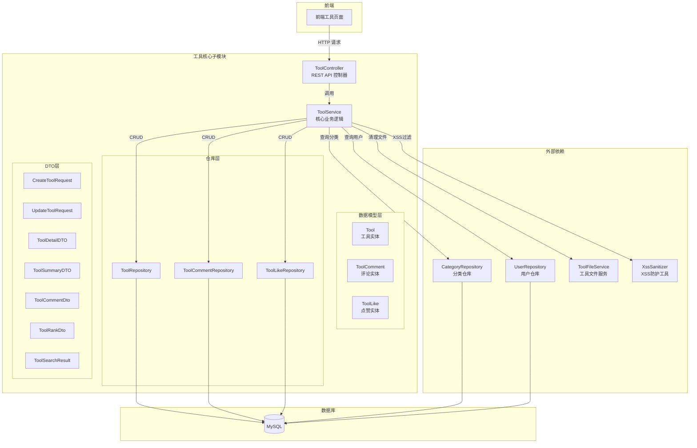
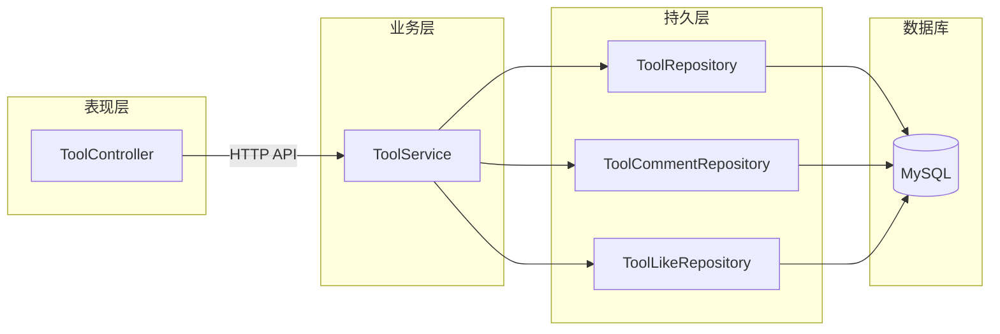
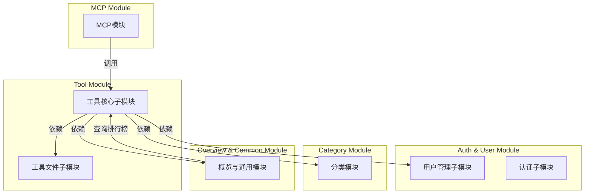
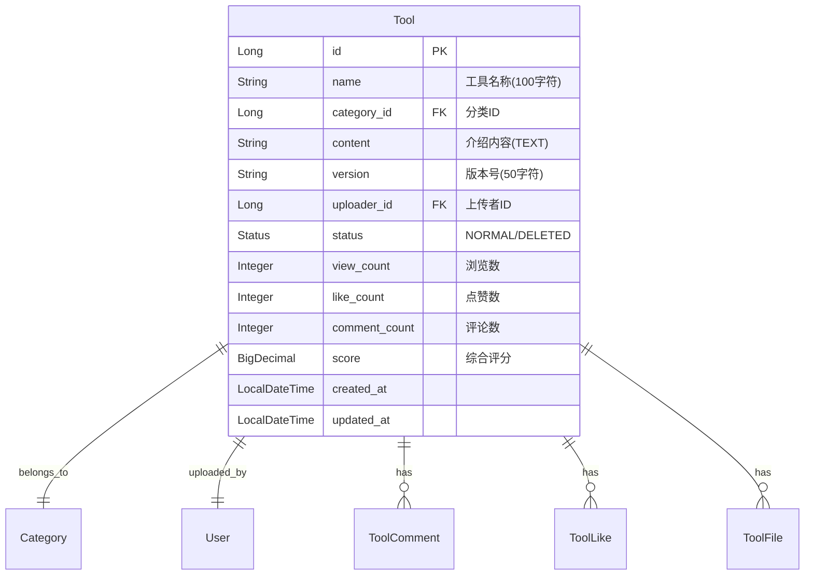
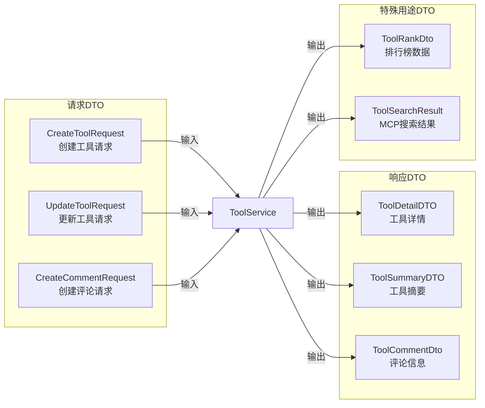
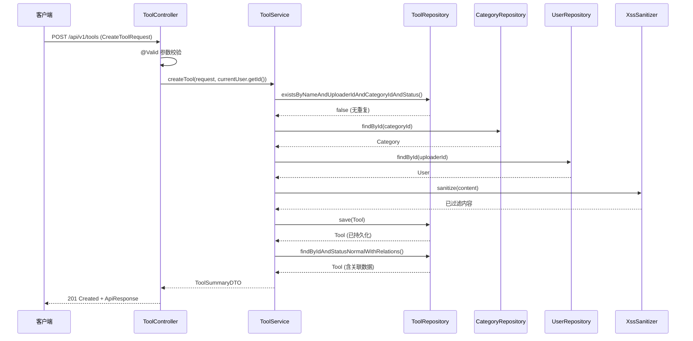
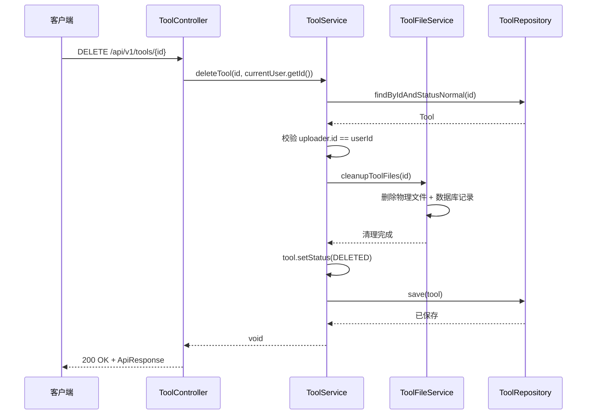
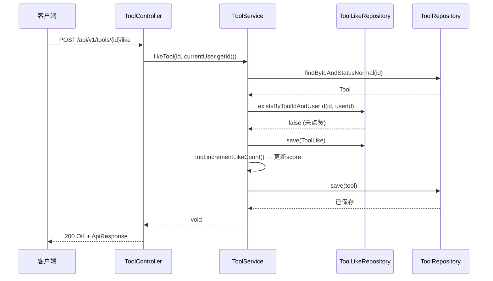
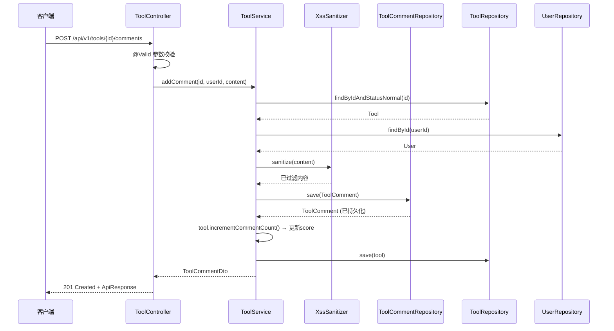
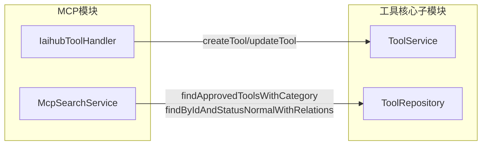

# 工具核心子模块

## 模块概述

工具核心子模块是 **Tool Module** 的核心组成部分，负责工具的完整生命周期管理，包括工具的创建、查询、更新、删除（软删除），以及工具的社交互动功能（点赞、评论）。该子模块是整个工具广场平台的基础业务模块，为前端工具展示页面、MCP Server 工具搜索接口和首页排行榜数据提供核心支撑。

工具核心子模块与 [工具文件子模块](工具文件子模块.md) 共同构成完整的 Tool Module，前者管理工具元数据与互动数据，后者管理工具关联的文件资源。

---

## 架构设计

### 整体架构



### 分层架构

本模块采用经典的 **Controller → Service → Repository** 三层架构：



### 模块依赖关系



---

## 核心组件详解

### 1. ToolController — REST API 控制器

**文件路径：** `backend/src/main/java/com/iaihub/toolbox/controller/ToolController.java`

ToolController 是工具核心子模块的 API 入口，提供工具的 CRUD 操作及社交互动接口。所有接口均挂载在 `/api/v1/tools` 路径下，统一使用 `ApiResponse<T>` 包装返回结果。

#### API 接口清单

| HTTP 方法 | 路径 | 功能 | 认证要求 | 返回类型 |
|-----------|------|------|----------|----------|
| GET | `/api/v1/tools` | 分页查询工具列表 | 无 | `PageResponse<ToolSummaryDTO>` |
| GET | `/api/v1/tools/{id}` | 获取工具详情 | 无 | `ToolDetailDTO` |
| POST | `/api/v1/tools` | 创建工具 | 需登录 | `ToolSummaryDTO` |
| PUT | `/api/v1/tools/{id}` | 更新工具 | 需登录（仅作者） | `ToolDetailDTO` |
| DELETE | `/api/v1/tools/{id}` | 删除工具 | 需登录（仅作者） | `Void` |
| POST | `/api/v1/tools/{id}/like` | 点赞工具 | 需登录 | `Void` |
| DELETE | `/api/v1/tools/{id}/like` | 取消点赞 | 需登录 | `Void` |
| GET | `/api/v1/tools/{id}/like-status` | 查询点赞状态 | 可选登录 | `Boolean` |
| POST | `/api/v1/tools/{id}/comments` | 添加评论 | 需登录 | `ToolCommentDto` |
| GET | `/api/v1/tools/{id}/comments` | 获取评论列表 | 无 | `List<ToolCommentDto>` |

#### 查询参数说明

工具列表查询（GET `/api/v1/tools`）支持以下查询参数：

| 参数 | 类型 | 默认值 | 说明 |
|------|------|--------|------|
| `categoryId` | Long | null | 按分类筛选 |
| `keyword` | String | null | 按工具名称模糊搜索 |
| `sortBy` | String | `latest` | 排序方式：`latest`（最新）/ `name`（名称） |
| `page` | int | 0 | 页码（从0开始） |
| `size` | int | 12 | 每页条数（最大100） |

---

### 2. ToolService — 核心业务逻辑

**文件路径：** `backend/src/main/java/com/iaihub/toolbox/service/ToolService.java`

ToolService 是工具核心子模块的业务核心，封装了所有工具相关的业务逻辑，包括：

#### 核心业务方法

| 方法 | 事务类型 | 功能描述 |
|------|----------|----------|
| `getTools()` | 只读 | 分页查询工具列表，支持分类筛选、关键词搜索和排序 |
| `getToolById()` | 只读 | 根据ID获取工具详情 |
| `createTool()` | 读写 | 创建新工具，含重名校验和XSS过滤 |
| `updateTool()` | 读写 | 更新工具信息，含权限校验和重名校验 |
| `deleteTool()` | 读写 | 软删除工具，同时清理关联文件 |
| `likeTool()` | 读写 | 点赞工具，幂等操作 |
| `unlikeTool()` | 读写 | 取消点赞 |
| `isLikedByUser()` | 读写 | 查询用户是否已点赞 |
| `incrementViewCount()` | 读写 | 增加浏览数并更新评分 |
| `addComment()` | 读写 | 添加评论，含XSS过滤 |
| `getComments()` | 只读 | 获取工具评论列表 |
| `getMyTools()` | 只读 | 查询用户自己上传的工具 |

#### 关键业务规则

**1. 工具创建重名校验**
- 同一用户在同一分类下不允许上传同名工具
- 校验条件：`name + uploaderId + categoryId + status(NORMAL)` 唯一

**2. 工具更新权限控制**
- 仅工具上传者本人可编辑
- 更新时若名称或分类变更，需重新进行重名校验（排除自身）

**3. 软删除机制**
- 删除操作仅将 `status` 设为 `DELETED`，不物理删除记录
- 删除前调用 `ToolFileService.cleanupToolFiles()` 清理关联的物理文件

**4. XSS 防护**
- 工具内容和评论内容在保存前均经过 `XssSanitizer.sanitize()` 处理
- 详见 [概览与通用模块](概览与通用模块.md) 中的 XssSanitizer 组件

**5. 评分计算模型**

工具评分（`score`）基于互动数据自动计算，公式为：

```
score = viewCount × 1 + likeCount × 3 + commentCount × 5
```

每次浏览、点赞、评论操作都会触发评分自动更新。该评分用于首页工具排行榜，详见 [概览与通用模块](概览与通用模块.md)。

---

### 3. 数据模型层

#### Tool 实体

**文件路径：** `backend/src/main/java/com/iaihub/toolbox/model/Tool.java`



**数据库索引设计：**

| 索引名 | 字段 | 用途 |
|--------|------|------|
| `idx_tool_category` | `category_id, status` | 按分类查询工具 |
| `idx_tool_uploader` | `uploader_id, status` | 查询用户上传的工具 |
| `idx_tool_name_status` | `name, status` | 按名称搜索 |
| `idx_tool_version` | `version` | 按版本查询 |
| `uk_tool_uploader_name_category` | `uploader_id, name, category_id, status` | 重名校验唯一约束 |

**状态枚举：**
- `NORMAL` — 正常状态，可被查询和展示
- `DELETED` — 已删除（软删除），查询时自动过滤

**生命周期回调：**
- `@PrePersist` — 创建时自动设置 `createdAt`、`updatedAt` 和默认 `status`
- `@PreUpdate` — 更新时自动刷新 `updatedAt`

#### ToolComment 实体

**文件路径：** `backend/src/main/java/com/iaihub/toolbox/model/ToolComment.java`

| 字段 | 类型 | 说明 |
|------|------|------|
| `id` | Long | 主键 |
| `toolId` | Long | 关联工具ID |
| `userId` | Long | 评论用户ID |
| `content` | String(TEXT) | 评论内容（已XSS过滤） |
| `createdAt` | LocalDateTime | 创建时间 |

> **注意：** ToolComment 使用 `toolId` 和 `userId` 作为外键字段而非 JPA 关系映射，采用轻量级关联设计以提升查询性能。

#### ToolLike 实体

**文件路径：** `backend/src/main/java/com/iaihub/toolbox/model/ToolLike.java`

| 字段 | 类型 | 说明 |
|------|------|------|
| `id` | Long | 主键 |
| `toolId` | Long | 关联工具ID |
| `userId` | Long | 点赞用户ID |
| `createdAt` | LocalDateTime | 创建时间 |

**唯一约束：** `uk_tool_like_tool_user (tool_id, user_id)` — 确保同一用户对同一工具只能点赞一次。

---

### 4. 仓库层（Repository）

#### ToolRepository

**文件路径：** `backend/src/main/java/com/iaihub/toolbox/repository/ToolRepository.java`

| 方法 | 功能 | 使用场景 |
|------|------|----------|
| `findByFilters()` | 按分类+关键词分页查询（按创建时间降序） | 工具列表页默认排序 |
| `findByFiltersOrderByName()` | 按分类+关键词分页查询（按名称升序） | 工具列表页按名称排序 |
| `findByIdAndStatusNormal()` | 查询正常状态的工具 | 获取工具详情 |
| `findByIdAndStatusNormalWithRelations()` | 查询工具并预加载关联（分类、上传者） | 创建工具后重新获取 |
| `findByUploaderIdAndFilters()` | 按上传者+分类+关键词分页查询 | "我的工具"页面 |
| `existsByNameAndUploaderIdAndCategoryIdAndStatus()` | 重名校验 | 创建工具时 |
| `existsByNameAndUploaderIdAndCategoryIdAndStatusAndIdNot()` | 重名校验（排除自身） | 更新工具时 |
| `findApprovedToolsWithCategory()` | 查询工具并预加载分类 | MCP 搜索 |
| `findTop10ByStatusAndNameContainingIgnoreCase()` | 按名称模糊搜索Top10 | MCP 搜索 |
| `findTop10ByStatusOrderByCreatedAtDesc()` | 获取最新10条工具 | MCP 搜索 |
| `countByStatus()` | 按状态统计数量 | 首页统计 |

#### ToolCommentRepository

**文件路径：** `backend/src/main/java/com/iaihub/toolbox/repository/ToolCommentRepository.java`

| 方法 | 功能 |
|------|------|
| `findByToolIdOrderByCreatedAtDesc()` | 按工具ID查询评论（按创建时间降序） |

#### ToolLikeRepository

**文件路径：** `backend/src/main/java/com/iaihub/toolbox/repository/ToolLikeRepository.java`

| 方法 | 功能 |
|------|------|
| `existsByToolIdAndUserId()` | 检查用户是否已点赞 |
| `findByToolIdAndUserId()` | 查询点赞记录 |
| `deleteByToolIdAndUserId()` | 删除点赞记录 |

---

### 5. DTO 层

本模块定义了以下数据传输对象，用于在 API 层和业务层之间传递数据：



#### 请求 DTO

**CreateToolRequest** — 创建工具请求

| 字段 | 类型 | 验证规则 | 说明 |
|------|------|----------|------|
| `name` | String | 必填，1-100字符，仅允许字母/数字/中文/下划线/连字符 | 工具名称 |
| `categoryId` | Long | 必填 | 分类ID |
| `content` | String | 必填，最大5000字符 | 介绍内容 |
| `version` | String | 必填，标准版本号格式（如 `1.0.0`） | 版本号 |

**UpdateToolRequest** — 更新工具请求

所有字段均为可选，仅传入的字段会被更新。

| 字段 | 类型 | 验证规则 | 说明 |
|------|------|----------|------|
| `name` | String | 1-100字符，同名称格式校验 | 工具名称 |
| `categoryId` | Long | — | 分类ID |
| `content` | String | 最大5000字符 | 介绍内容 |
| `version` | String | 标准版本号格式 | 版本号 |

#### 响应 DTO

**ToolSummaryDTO** — 工具摘要（列表页使用）

| 字段 | 类型 | 说明 |
|------|------|------|
| `id` | Long | 工具ID |
| `name` | String | 工具名称 |
| `version` | String | 版本号 |
| `categoryName` | String | 分类名称 |
| `categoryIcon` | String | 分类图标 |
| `uploaderUsername` | String | 上传者用户名 |
| `uploaderNickname` | String | 上传者昵称 |
| `createdAt` | LocalDateTime | 创建时间 |

**ToolDetailDTO** — 工具详情（详情页使用）

在 `ToolSummaryDTO` 基础上扩展以下字段：

| 字段 | 类型 | 说明 |
|------|------|------|
| `content` | String | 介绍内容 |
| `uploaderId` | Long | 上传者ID |
| `updatedAt` | LocalDateTime | 更新时间 |
| `viewCount` | Integer | 浏览数 |
| `likeCount` | Integer | 点赞数 |
| `commentCount` | Integer | 评论数 |
| `score` | BigDecimal | 综合评分 |

**ToolCommentDto** — 评论信息

| 字段 | 类型 | 说明 |
|------|------|------|
| `id` | Long | 评论ID |
| `content` | String | 评论内容 |
| `username` | String | 评论者用户名 |
| `createdAt` | LocalDateTime | 创建时间 |

#### 特殊用途 DTO

**ToolRankDto** — 工具排行榜数据，供 [概览与通用模块](概览与通用模块.md) 的 OverviewService 使用，按分类分组展示各分类下评分最高的工具。

**ToolSearchResult** — MCP 搜索结果，供 [MCP模块](MCP模块.md) 的 McpSearchService 使用，包含工具摘要信息（含内容前100字符截取）。

---

## 核心业务流程

### 工具创建流程



### 工具删除流程（软删除）



### 点赞流程



### 评论流程



---

## 跨模块交互

### 与认证子模块的交互

工具核心子模块通过 Spring Security 的 `@AuthenticationPrincipal User` 注解获取当前登录用户信息。认证流程详见 [认证子模块](认证子模块.md)。

- **创建/更新/删除工具**：需要用户已认证，通过 JWT Token 解析获取用户身份
- **点赞/评论**：需要用户已认证
- **查询工具列表/详情/评论**：无需认证
- **查询点赞状态**：可选认证（未登录返回 `false`）

### 与用户管理子模块的交互

ToolService 通过 `UserRepository` 查询用户信息（用户名、昵称），用于构建 DTO 响应。详见 [用户管理子模块](用户管理子模块.md)。

### 与分类模块的交互

ToolService 通过 `CategoryRepository` 查询分类信息，工具创建和更新时需校验分类是否存在。详见 [分类模块](分类模块.md)。

### 与工具文件子模块的交互

ToolService 在删除工具时调用 `ToolFileService.cleanupToolFiles()` 清理关联的物理文件和数据库记录。详见 [工具文件子模块](工具文件子模块.md)。

### 与概览与通用模块的交互

- **OverviewServiceImpl** 直接使用 `ToolRepository` 查询工具数据，按分类分组计算排行榜（`ToolRankDto`），每个分类取评分最高的5个工具
- **OverviewServiceImpl** 使用 `toolRepository.count()` 统计工具总数用于首页统计
- 详见 [概览与通用模块](概览与通用模块.md)

### 与 MCP 模块的交互

- **IaihubToolHandler** 调用 `ToolService.createTool()` 和 `ToolService.updateTool()` 实现 MCP 客户端的工具创建和修改
- **McpSearchService** 直接使用 `ToolRepository` 的查询方法实现工具搜索功能，返回 `ToolSearchResult`
- MCP 模块的工具修改操作支持版本号自动递增
- 详见 [MCP模块](MCP模块.md)



---

## 安全机制

### 1. 认证与授权

| 操作 | 认证要求 | 授权规则 |
|------|----------|----------|
| 查询工具列表/详情/评论 | 无需认证 | — |
| 创建工具 | 需登录 | 任何已认证用户 |
| 更新工具 | 需登录 | 仅工具上传者 |
| 删除工具 | 需登录 | 仅工具上传者 |
| 点赞/取消点赞 | 需登录 | 任何已认证用户 |
| 添加评论 | 需登录 | 任何已认证用户 |

权限校验在 ToolService 层实现，通过比较 `tool.getUploader().getId()` 与当前用户ID判断操作权限，不匹配时抛出 `ForbiddenException`。

### 2. XSS 防护

所有用户输入的文本内容（工具介绍内容、评论内容）在持久化前均经过 `XssSanitizer.sanitize()` 处理，该工具会：
- 转义 HTML 特殊字符（`&`, `<`, `>`, `"`, `'` 等）
- 移除 `javascript:` 协议
- 移除 `on*=` 事件处理器属性

详见 [概览与通用模块](概览与通用模块.md) 中的 XssSanitizer 组件。

### 3. 输入校验

请求 DTO 使用 Jakarta Validation 注解进行参数校验：
- 工具名称：长度限制（1-100字符）+ 格式限制（仅字母/数字/中文/下划线/连字符）
- 版本号：标准语义化版本格式（如 `1.0.0`、`1.0.0-beta`）
- 内容长度：最大5000字符
- 分页参数：每页最大100条

### 4. 数据完整性

- **唯一约束**：同一用户在同一分类下不能上传同名工具（数据库层 + 应用层双重校验）
- **软删除**：工具删除采用状态标记而非物理删除，保证数据可追溯
- **事务管理**：所有写操作使用 `@Transactional` 注解，确保数据一致性

---

## 评分模型

工具评分（`score`）是衡量工具热度的综合指标，用于首页排行榜展示。

### 计算公式

```
score = viewCount × 1 + likeCount × 3 + commentCount × 5
```

### 权重设计

| 指标 | 权重 | 设计理由 |
|------|------|----------|
| 浏览数 | ×1 | 基础热度指标，权重最低 |
| 点赞数 | ×3 | 主动认可行为，权重中等 |
| 评论数 | ×5 | 深度互动行为，权重最高 |

### 触发时机

评分在以下操作中自动更新：
- `incrementViewCount()` — 浏览工具详情时
- `incrementLikeCount()` / `decrementLikeCount()` — 点赞/取消点赞时
- `incrementCommentCount()` — 添加评论时

评分数据通过 [概览与通用模块](概览与通用模块.md) 的 `OverviewServiceImpl.getToolRanks()` 方法聚合展示在首页排行榜中。
