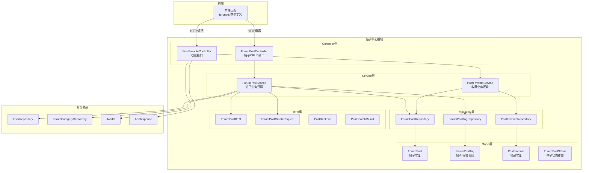
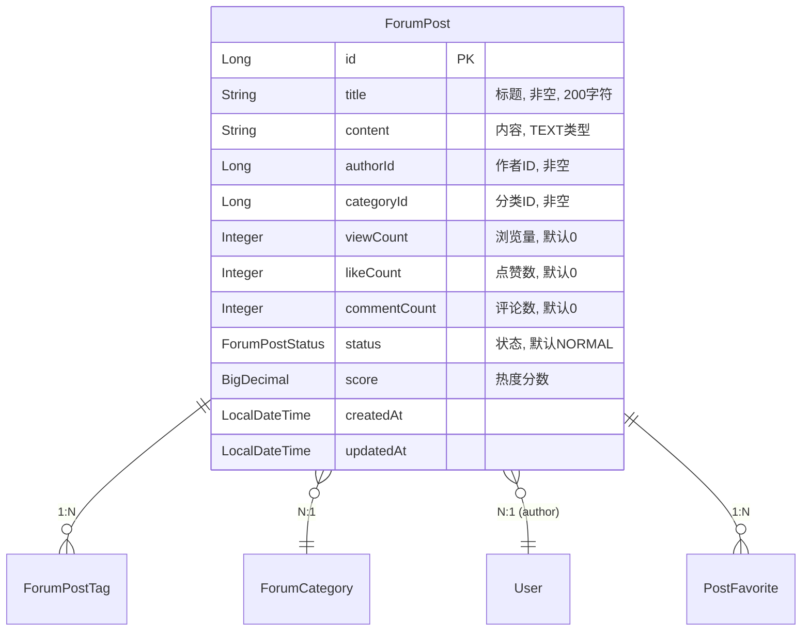
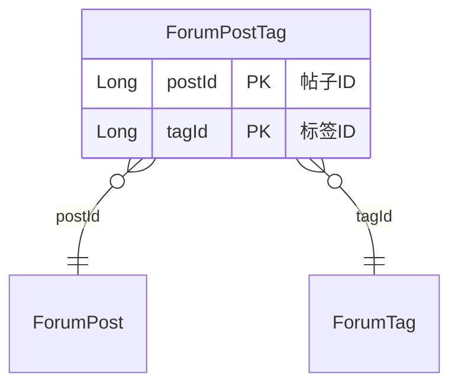
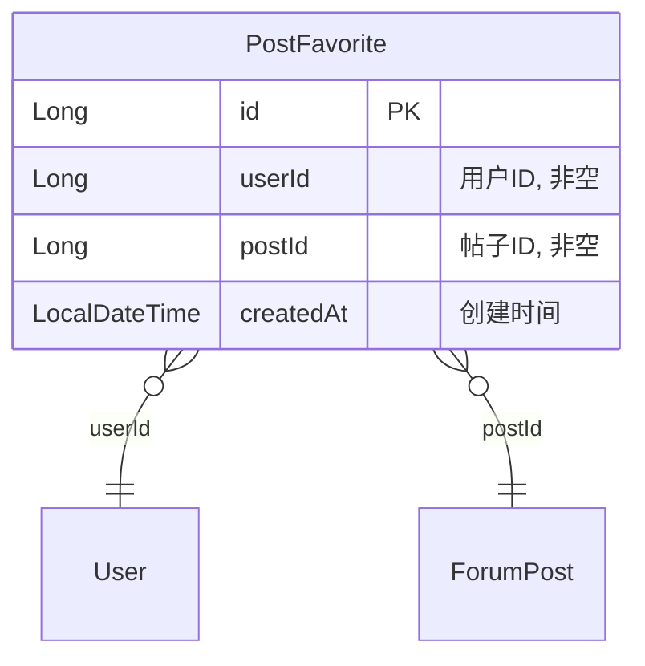
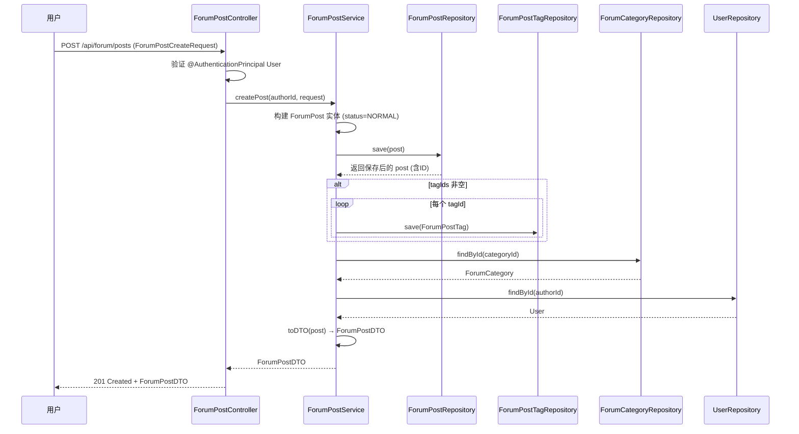
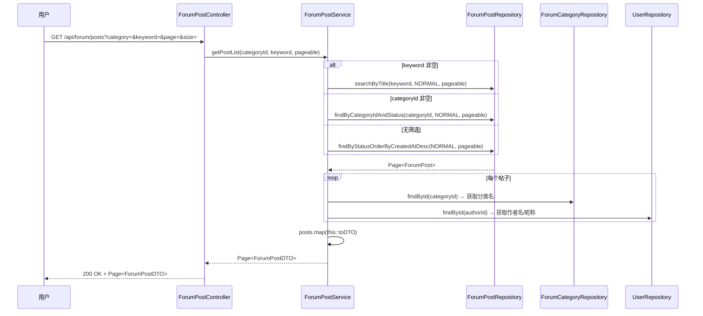
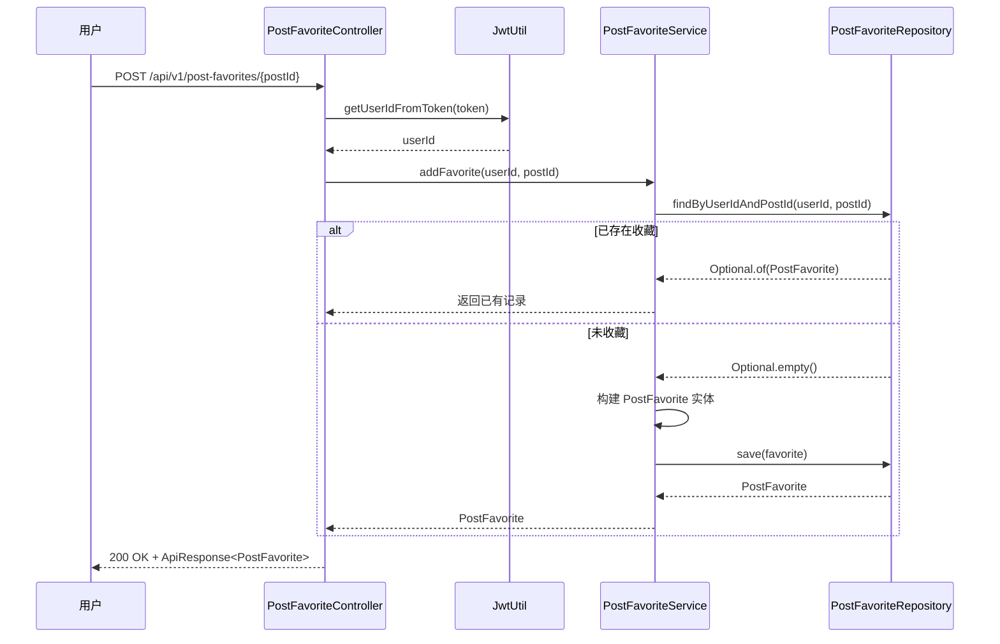
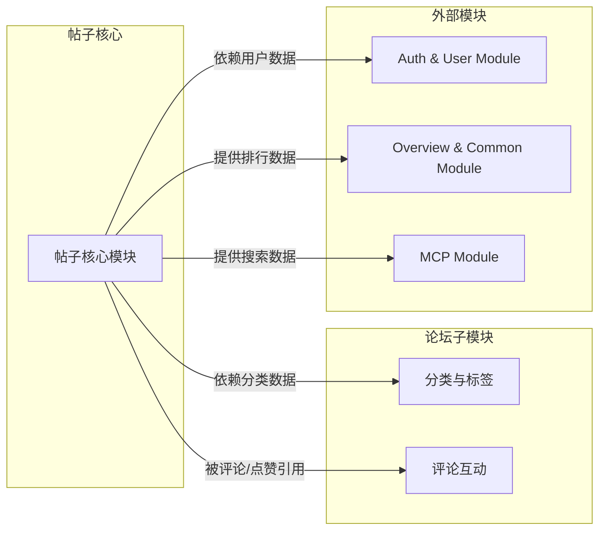

# 帖子核心模块

## 简介

帖子核心模块是论坛系统（Forum Module）的核心子模块，负责论坛帖子的全生命周期管理，包括帖子的创建、查询、更新、删除（CRUD），以及帖子收藏功能。该模块是论坛内容体系的基石，为评论互动、分类标签等子模块提供帖子数据支撑。

帖子核心模块包含两大功能域：
- **帖子管理**：帖子的发布、编辑、删除、列表浏览、详情查看及浏览量统计
- **帖子收藏**：用户对帖子的收藏/取消收藏、收藏列表查询及收藏状态检查

---

## 架构总览



---

## 组件详解

### 1. 帖子管理域

#### ForumPostController — 帖子控制器

帖子内容的 REST API 入口，提供帖子的增删改查接口。通过 `@AuthenticationPrincipal User` 获取当前登录用户，实现身份认证与权限校验。

| HTTP 方法 | 路径 | 功能 | 认证要求 |
|-----------|------|------|----------|
| GET | `/api/forum/posts` | 获取帖子列表（支持分类/关键词筛选） | 无 |
| GET | `/api/forum/posts/my` | 获取当前用户的帖子 | 需登录 |
| GET | `/api/forum/posts/{id}` | 获取帖子详情（自动增加浏览量） | 无 |
| POST | `/api/forum/posts` | 创建帖子 | 需登录 |
| PUT | `/api/forum/posts/{id}` | 更新帖子（仅作者） | 需登录 + 作者权限 |
| DELETE | `/api/forum/posts/{id}` | 删除帖子（仅作者，软删除） | 需登录 + 作者权限 |

#### ForumPostService — 帖子服务

核心业务逻辑层，负责帖子的完整生命周期管理。

**关键业务逻辑：**

- **列表查询策略**：根据参数优先级执行不同查询 — 关键词搜索 > 分类筛选 > 全量列表
- **浏览量统计**：`getPostById` 方法在返回详情时自动递增 `viewCount`
- **权限校验**：更新和删除操作验证 `authorId` 与当前用户 ID 是否一致，不一致抛出 `ForbiddenException`
- **软删除机制**：删除操作将帖子状态设为 `DELETED`，而非物理删除
- **标签关联**：创建帖子时批量写入 `ForumPostTag` 关联记录
- **DTO 转换**：`toDTO` 方法将实体转换为 DTO，同时关联查询分类名称和作者信息

#### ForumPost — 帖子实体



**热度评分算法：**

帖子实体内置评分计算方法 `updateScore()`，采用加权评分模型：

```
score = viewCount × 1 + likeCount × 3 + commentCount × 5
```

| 互动类型 | 权重 | 说明 |
|----------|------|------|
| 浏览量 | ×1 | 基础权重，反映曝光度 |
| 点赞数 | ×3 | 中等权重，反映认可度 |
| 评论数 | ×5 | 最高权重，反映参与度 |

该评分用于 [概览与通用模块](Overview_与通用.md) 中的帖子排行榜功能（`PostRankDto`）。

#### ForumPostStatus — 帖子状态枚举

| 状态值 | 说明 |
|--------|------|
| `NORMAL` | 正常状态，默认值 |
| `DELETED` | 已删除（软删除） |
| `HIDDEN` | 已隐藏 |

#### ForumPostTag — 帖子标签关联实体

使用复合主键（`@IdClass`）实现帖子与标签的多对多关联，通过中间表 `forum_post_tag` 维护。



#### ForumPostRepository — 帖子数据访问

提供以下查询方法：

| 方法 | 说明 |
|------|------|
| `findByStatusOrderByCreatedAtDesc` | 按状态查询，按创建时间倒序 |
| `findByCategoryIdAndStatus` | 按分类和状态查询 |
| `findByAuthorIdAndStatus` | 按作者和状态查询 |
| `searchByTitle` | 按标题关键词模糊搜索（JPQL） |

数据库索引优化：`author_id`、`category_id`、`created_at` 字段均建有索引。

#### ForumPostDTO / ForumPostCreateRequest — 数据传输对象

- **ForumPostDTO**（Java Record）：帖子完整信息展示，包含作者名称、分类名称等关联数据
- **ForumPostCreateRequest**（Java Record）：帖子创建/更新请求，使用 JSR-303 验证注解（`@NotBlank`、`@NotNull`）

---

### 2. 帖子收藏域

#### PostFavoriteController — 收藏控制器

提供帖子收藏的 REST API，使用 `JwtUtil` 从请求头解析用户身份。

| HTTP 方法 | 路径 | 功能 |
|-----------|------|------|
| POST | `/api/v1/post-favorites/{postId}` | 收藏帖子 |
| DELETE | `/api/v1/post-favorites/{postId}` | 取消收藏 |
| GET | `/api/v1/post-favorites` | 获取用户收藏列表 |
| GET | `/api/v1/post-favorites/posts` | 获取用户收藏的帖子列表 |
| GET | `/api/v1/post-favorites/check/{postId}` | 检查是否已收藏 |

> **注意**：收藏控制器使用 `JwtUtil` 手动解析 JWT Token 获取用户 ID，与帖子控制器使用 `@AuthenticationPrincipal` 的方式不同。

#### PostFavoriteService — 收藏服务

**关键业务逻辑：**

- **幂等收藏**：`addFavorite` 方法先检查是否已存在收藏记录，存在则直接返回，避免重复收藏
- **安全删除**：`removeFavorite` 方法先验证记录存在再删除
- **收藏帖子查询**：`getUserFavoritePosts` 先查询收藏记录，再批量查询帖子实体

#### PostFavorite — 收藏实体



数据库层面通过 `@UniqueConstraint` 确保 `(user_id, post_id)` 组合唯一，防止重复收藏。

#### PostFavoriteRepository — 收藏数据访问

| 方法 | 说明 |
|------|------|
| `findByUserIdAndPostId` | 查询特定用户的特定帖子收藏记录 |
| `findByUserId` | 查询用户所有收藏记录 |
| `deleteByUserIdAndPostId` | 按用户和帖子删除收藏记录 |

---

### 3. 辅助 DTO

#### PostRankDto — 帖子排行 DTO

用于 [概览与通用模块](Overview_与通用.md) 的帖子热度排行榜展示，包含帖子 ID、分类名称、帖子标题和热度分数。

#### PostSearchResult — 帖子搜索结果 DTO

用于 [MCP模块](MCP.md) 的 MCP 搜索接口返回，包含帖子摘要信息（ID、标题、摘要、作者名、创建时间）。

---

## 数据流

### 帖子创建流程



### 帖子列表查询流程



### 帖子收藏流程



---

## 模块依赖关系



### 依赖说明

| 依赖方向 | 依赖模块 | 说明 |
|----------|----------|------|
| → 分类与标签 | [分类与标签](分类与标签.md) | `ForumPostService` 通过 `ForumCategoryRepository` 查询分类名称；帖子通过 `ForumPostTag` 关联标签 |
| → Auth & User | [Auth & User Module](Auth_与_User.md) | `ForumPostService` 通过 `UserRepository` 查询作者信息；`PostFavoriteController` 使用 `JwtUtil` 解析用户身份 |
| ← 评论互动 | [评论互动](评论互动.md) | 评论和点赞模块引用帖子实体，更新 `commentCount` 和 `likeCount` |
| ← Overview & Common | [Overview_与通用](Overview_与通用.md) | 概览模块通过 `PostRankDto` 消费帖子热度排行数据 |
| ← MCP | [MCP](MCP.md) | MCP 模块通过 `PostSearchResult` 消费帖子搜索结果 |

---

## API 接口汇总

### 帖子管理接口 (`/api/forum/posts`)

| HTTP 方法 | 路径 | 功能 | 认证 |
|-----------|------|------|------|
| GET | `/` | 帖子列表（支持分类/关键词筛选） | 无 |
| GET | `/my` | 我的帖子 | 需登录 |
| GET | `/{id}` | 帖子详情 | 无 |
| POST | `/` | 创建帖子 | 需登录 |
| PUT | `/{id}` | 更新帖子 | 需登录+作者 |
| DELETE | `/{id}` | 删除帖子 | 需登录+作者 |

### 帖子收藏接口 (`/api/v1/post-favorites`)

| HTTP 方法 | 路径 | 功能 | 认证 |
|-----------|------|------|------|
| POST | `/{postId}` | 添加收藏 | 需登录 |
| DELETE | `/{postId}` | 取消收藏 | 需登录 |
| GET | `/` | 收藏记录列表 | 需登录 |
| GET | `/posts` | 收藏帖子列表 | 需登录 |
| GET | `/check/{postId}` | 检查收藏状态 | 需登录 |

---

## 设计要点

### 软删除策略

帖子删除采用软删除机制，将 `status` 设为 `DELETED` 而非物理删除。所有列表查询均过滤 `status = NORMAL`，确保已删除帖子不会出现在公开列表中，同时保留数据完整性。

### 权限控制

- **帖子管理**：通过 `@AuthenticationPrincipal User` 获取认证用户，在 Service 层校验 `authorId` 一致性
- **收藏管理**：通过 `JwtUtil` 手动解析 Token 获取 `userId`
- **异常处理**：权限不足抛出 `ForbiddenException`（403），资源不存在抛出 `ResourceNotFoundException`（404）

### 数据一致性

- 收藏表通过数据库唯一约束 `(user_id, post_id)` 保证幂等性
- 帖子的 `likeCount`、`commentCount` 由 [评论互动](评论互动.md) 模块维护更新
- 帖子创建和更新操作使用 `@Transactional` 保证事务一致性

### 性能优化

- `ForumPost` 实体在 `author_id`、`category_id`、`created_at` 上建立数据库索引
- 列表查询使用 Spring Data JPA 分页，避免全量加载
- `toDTO` 转换中分类和作者信息通过 `findById` 查询（存在 N+1 查询优化空间）
