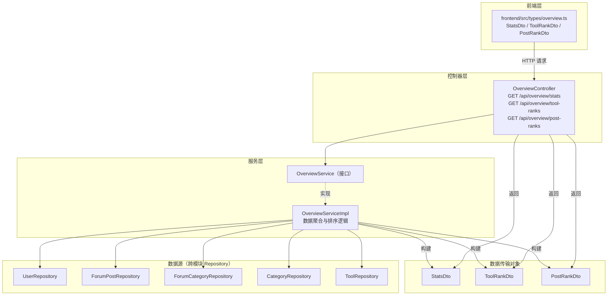
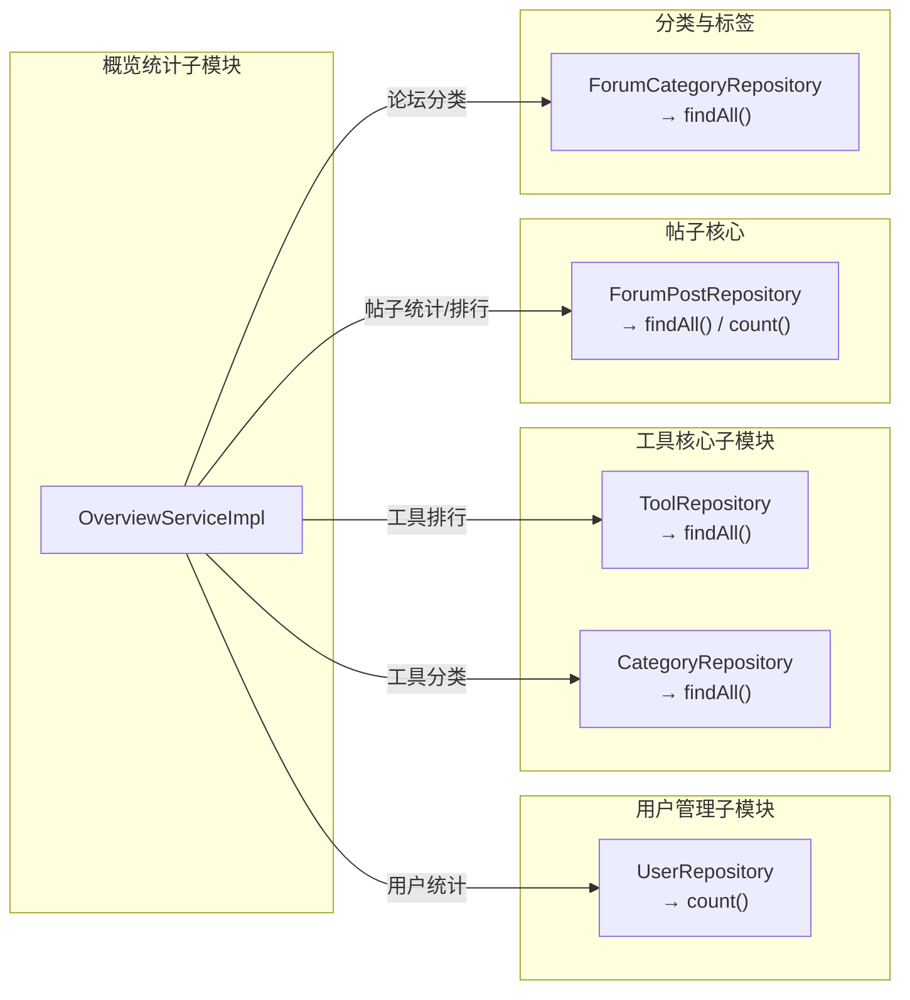
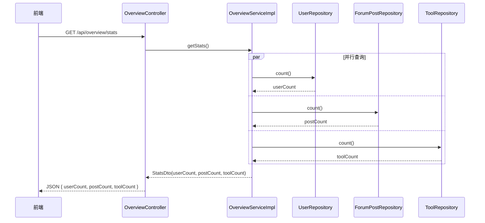
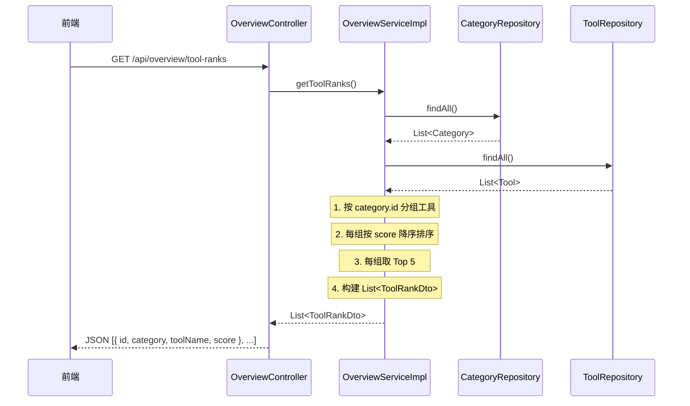
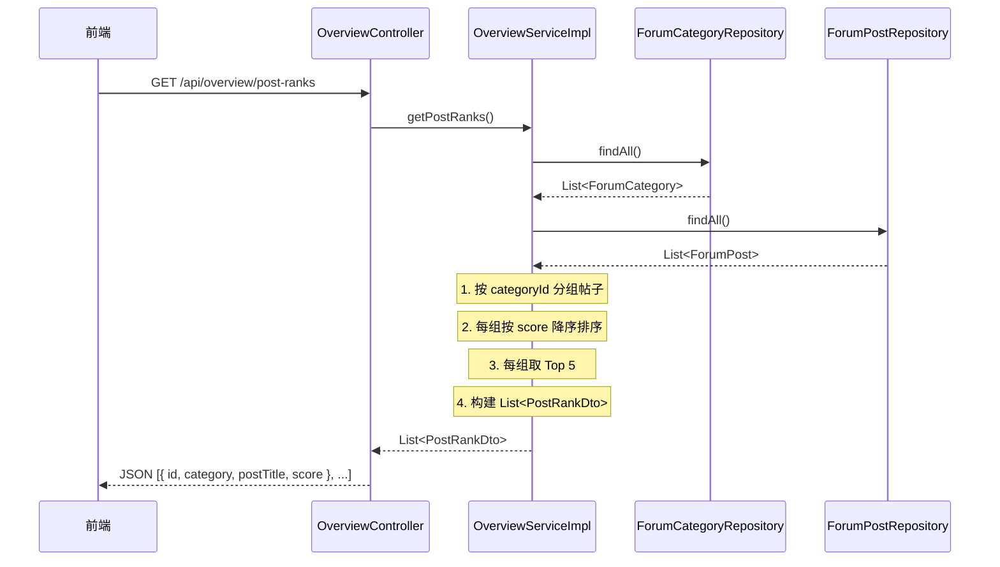
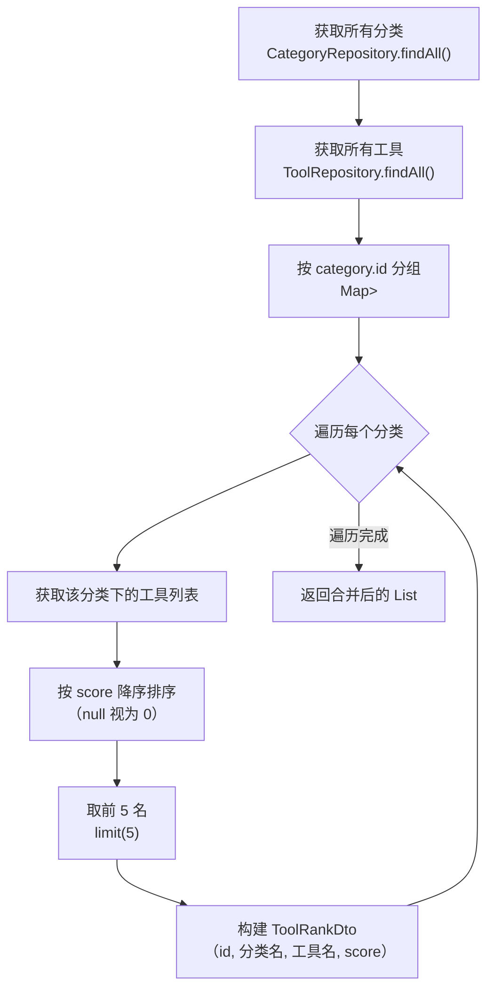

# 概览统计子模块

## 简介

概览统计子模块是 **Overview & Common Module** 的核心子模块之一，负责为平台首页/概览页面提供聚合统计数据。该子模块通过跨模块数据聚合，为前端提供三类关键信息：

1. **平台统计概览** — 用户数、帖子数、工具数的总量统计
2. **工具排行榜** — 按工具分类分组，每个分类下按评分（score）降序取前 5 名工具
3. **帖子排行榜** — 按论坛分类分组，每个分类下按评分（score）降序取前 5 名帖子

该子模块本身不维护独立的数据存储，而是作为只读聚合层，从用户管理、工具管理、论坛、分类等多个模块的 Repository 中提取数据进行计算和组装。

---

## 架构总览



---

## 核心组件

### 1. OverviewController（控制器）

| 属性 | 值 |
|------|-----|
| **路径** | `backend/.../controller/OverviewController.java` |
| **基路径** | `/api/overview` |
| **依赖** | `OverviewService` |

提供三个 RESTful GET 端点，均为公开接口（无需认证）：

| 端点 | 返回类型 | 说明 |
|------|----------|------|
| `GET /api/overview/stats` | `StatsDto` | 平台总量统计（用户数、帖子数、工具数） |
| `GET /api/overview/tool-ranks` | `List<ToolRankDto>` | 工具排行榜（按分类分组，每组 Top 5） |
| `GET /api/overview/post-ranks` | `List<PostRankDto>` | 帖子排行榜（按分类分组，每组 Top 5） |

### 2. OverviewService（服务接口）

| 属性 | 值 |
|------|-----|
| **路径** | `backend/.../service/OverviewService.java` |
| **类型** | 接口 |

定义了三个方法契约：

```java
StatsDto getStats();
List<ToolRankDto> getToolRanks();
List<PostRankDto> getPostRanks();
```

### 3. OverviewServiceImpl（服务实现）

| 属性 | 值 |
|------|-----|
| **路径** | `backend/.../service/OverviewServiceImpl.java` |
| **类型** | `@Service` |
| **依赖** | `UserRepository`, `ForumPostRepository`, `ForumCategoryRepository`, `CategoryRepository`, `ToolRepository` |

#### 核心逻辑

**`getStats()`** — 平台统计

直接调用各 Repository 的 `count()` 方法获取总量，构建 `StatsDto` 返回。

**`getToolRanks()`** — 工具排行榜

1. 从 `CategoryRepository` 获取所有工具分类
2. 从 `ToolRepository` 获取全部工具，按 `category.id` 分组
3. 对每个分类下的工具按 `score` 降序排序，取前 5 名
4. 构建 `ToolRankDto` 列表返回

**`getPostRanks()`** — 帖子排行榜

1. 从 `ForumCategoryRepository` 获取所有论坛分类
2. 从 `ForumPostRepository` 获取全部帖子，按 `categoryId` 分组
3. 对每个分类下的帖子按 `score` 降序排序，取前 5 名
4. 构建 `PostRankDto` 列表返回

> **评分算法说明：** Tool 和 ForumPost 的 `score` 字段采用统一的加权计算公式：
> `score = viewCount × 1 + likeCount × 3 + commentCount × 5`
>
> 该评分在各自模块的实体中通过 `updateScore()` 方法维护，概览统计子模块仅读取该字段进行排序，不参与评分计算。详见 [工具核心子模块](工具核心子模块.md) 和 [帖子核心](帖子核心.md)。

### 4. 数据传输对象（DTO）

#### StatsDto

| 字段 | 类型 | 说明 |
|------|------|------|
| `userCount` | `Long` | 平台注册用户总数 |
| `postCount` | `Long` | 论坛帖子总数 |
| `toolCount` | `Long` | 工具总数 |

#### ToolRankDto

| 字段 | 类型 | 说明 |
|------|------|------|
| `id` | `Long` | 工具 ID |
| `category` | `String` | 所属分类名称 |
| `toolName` | `String` | 工具名称 |
| `score` | `BigDecimal` | 工具评分 |

#### PostRankDto

| 字段 | 类型 | 说明 |
|------|------|------|
| `id` | `Long` | 帖子 ID |
| `category` | `String` | 所属论坛分类名称 |
| `postTitle` | `String` | 帖子标题 |
| `score` | `BigDecimal` | 帖子评分 |

### 5. 前端类型定义

| 属性 | 值 |
|------|-----|
| **路径** | `frontend/src/types/overview.ts` |

TypeScript 接口与后端 DTO 一一对应，字段名和语义完全匹配，前端直接消费后端返回的 JSON。

---

## 跨模块依赖关系

概览统计子模块作为聚合层，依赖以下模块的数据源：



| 依赖模块 | 使用的 Repository | 调用方法 | 用途 |
|----------|-------------------|----------|------|
| [用户管理子模块](用户管理子模块.md) | `UserRepository` | `count()` | 统计用户总数 |
| [工具核心子模块](工具核心子模块.md) | `ToolRepository` | `findAll()` | 获取全部工具用于排行 |
| Category Module | `CategoryRepository` | `findAll()` | 获取工具分类列表 |
| [帖子核心](帖子核心.md) | `ForumPostRepository` | `count()`, `findAll()` | 统计帖子总数 + 获取全部帖子用于排行 |
| [分类与标签](分类与标签.md) | `ForumCategoryRepository` | `findAll()` | 获取论坛分类列表 |

---

## 数据流程

### 统计概览数据流



### 工具排行榜数据流



### 帖子排行榜数据流



---

## 排行榜排序逻辑详解

工具和帖子的排行榜采用相同的排序策略，以下以工具为例：



> **注意：** 当前实现使用 `findAll()` 全量加载后内存分组排序，适用于中小规模数据。若数据量增长显著，建议优化为数据库层面的分组查询与排序。

---

## API 接口示例

### 获取平台统计

```
GET /api/overview/stats
```

**响应示例：**
```json
{
  "userCount": 1280,
  "postCount": 3560,
  "toolCount": 420
}
```

### 获取工具排行榜

```
GET /api/overview/tool-ranks
```

**响应示例：**
```json
[
  { "id": 1, "category": "AI助手", "toolName": "智能写作助手", "score": 156.00 },
  { "id": 5, "category": "AI助手", "toolName": "代码生成器", "score": 98.00 },
  { "id": 12, "category": "数据处理", "toolName": "数据清洗工具", "score": 75.00 }
]
```

### 获取帖子排行榜

```
GET /api/overview/post-ranks
```

**响应示例：**
```json
[
  { "id": 101, "category": "技术讨论", "postTitle": "Spring Boot 最佳实践", "score": 230.00 },
  { "id": 205, "category": "技术讨论", "postTitle": "微服务架构分享", "score": 185.00 },
  { "id": 310, "category": "问答求助", "postTitle": "如何优化 JPA 查询", "score": 120.00 }
]
```

---

## 设计特点与注意事项

### 设计特点

1. **纯只读聚合层** — 本子模块不写入任何数据，仅从其他模块读取并聚合，职责单一清晰
2. **接口与实现分离** — `OverviewService` 接口与 `OverviewServiceImpl` 实现分离，便于扩展和测试
3. **统一评分体系** — 工具和帖子共用相同的评分公式（`view×1 + like×3 + comment×5`），排行榜逻辑高度对称
4. **前后端类型对齐** — 前端 TypeScript 接口与后端 Java DTO 字段完全一致，减少序列化/反序列化风险

### 注意事项

| 关注点 | 说明 |
|--------|------|
| **性能** | 当前使用 `findAll()` 全量加载后内存排序，数据量大时可能存在性能瓶颈 |
| **空值处理** | score 为 null 时按 `BigDecimal.ZERO` 处理，category 为 null 时按 `0L` 分组 |
| **无分页** | 排行榜接口返回扁平列表（所有分类的 Top 5 合并），无分页机制 |
| **无缓存** | 每次请求均实时查询数据库，高频访问场景可考虑引入缓存 |
| **安全性** | 接口为公开只读，不涉及敏感数据，无需认证（具体安全策略由 [认证子模块](认证子模块.md) 的 `SecurityConfig` 统一配置） |
