# 用户管理子模块

## 概述

用户管理子模块是 **Auth & User Module** 的核心子模块之一，负责用户数据模型的定义、用户信息的查询与管理、以及头像文件的处理。该子模块为系统提供用户身份的基础数据支撑，同时与[认证子模块](认证子模块.md)紧密协作，共同完成用户注册、登录、令牌刷新等认证流程。

本子模块包含以下核心组件：

| 层级 | 组件 | 职责 |
|------|------|------|
| Controller | `UserController` | 暴露用户管理相关的 REST API 端点 |
| Service | `UserService` | 用户业务逻辑，包括注册、登录、令牌刷新、信息查询、头像管理 |
| Model | `User` | JPA 实体，映射数据库 `user` 表 |
| Repository | `UserRepository` | Spring Data JPA 数据访问层 |
| DTO | `UserDTO` | 认证用户的完整信息传输对象 |
| DTO | `PublicUserDTO` | 公开用户信息传输对象（不含敏感字段） |

> **注意**：`UserService` 中同时包含了认证相关方法（`register`、`login`、`refreshToken`），这些方法由[认证子模块](认证子模块.md)的 `AuthController` 调用。头像文件校验逻辑由[头像管理子模块](头像管理子模块.md)的 `AvatarUtil` 提供。

---

## 架构设计

### 模块架构图

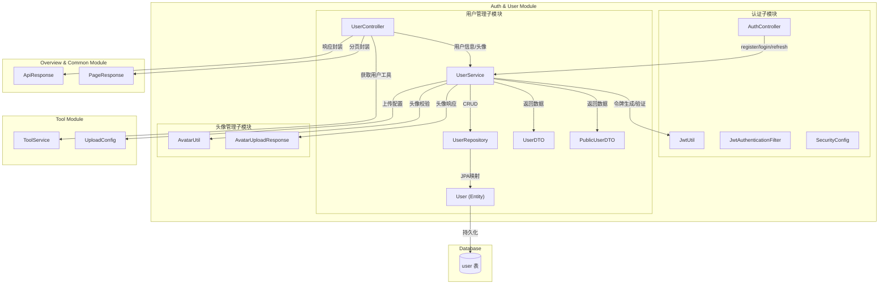

### 分层职责

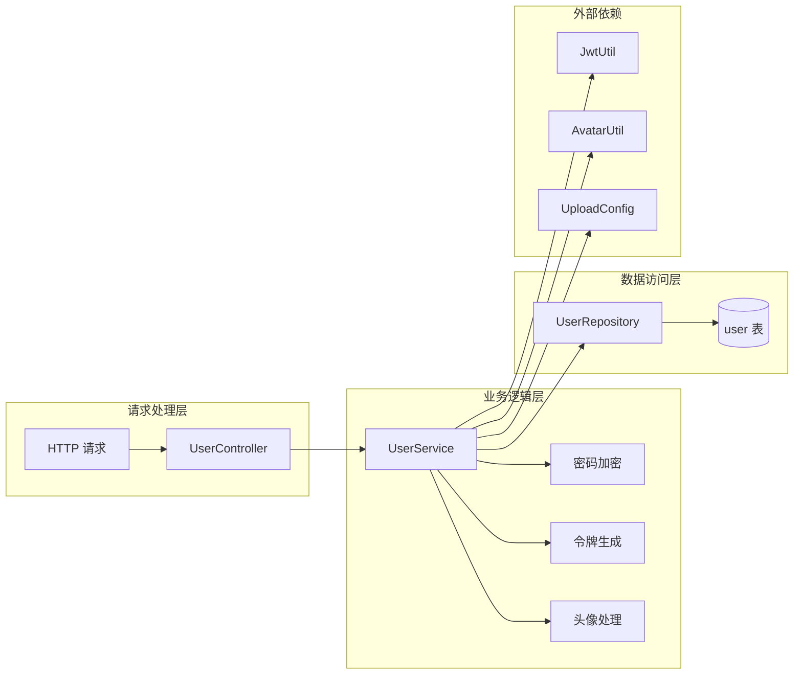

---

## 核心组件详解

### 1. User 实体模型

`User` 是系统的核心 JPA 实体，映射数据库中的 `user` 表，存储用户的基本信息。

**字段说明：**

| 字段 | 类型 | 约束 | 说明 |
|------|------|------|------|
| `id` | `Long` | 主键，自增 | 用户唯一标识 |
| `username` | `String` | 非空，唯一，最长100字符 | 登录用户名 |
| `nickname` | `String` | 唯一，最长50字符 | 用户昵称 |
| `password` | `String` | 非空，最长255字符 | 加密后的密码（BCrypt） |
| `avatarUrl` | `String` | 最长255字符 | 头像访问路径 |
| `createdAt` | `LocalDateTime` | 非空，不可更新 | 创建时间（`@PrePersist` 自动设置） |
| `updatedAt` | `LocalDateTime` | 非空 | 更新时间（`@PrePersist` / `@PreUpdate` 自动设置） |
| `lastLoginAt` | `LocalDateTime` | 可空 | 最后登录时间 |

**数据库索引：**

- `idx_user_username`：`username` 列唯一索引，加速按用户名查询
- `idx_user_nickname`：`nickname` 列唯一索引，加速按昵称查询

**生命周期回调：**

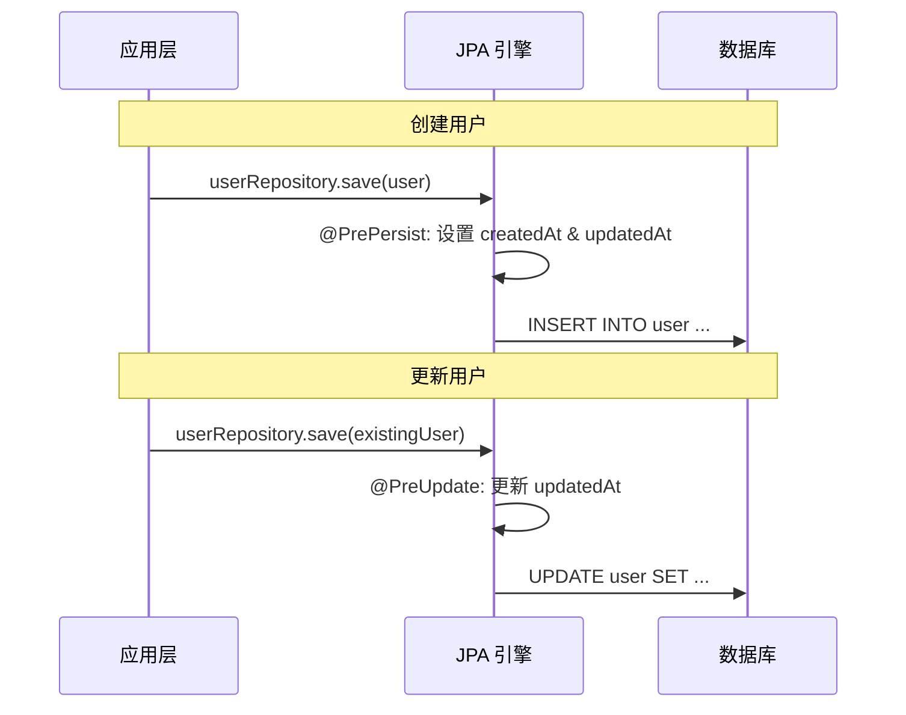

### 2. UserRepository 数据访问层

继承 `JpaRepository<User, Long>`，提供标准 CRUD 操作，并扩展以下自定义查询方法：

| 方法 | 返回类型 | 说明 |
|------|----------|------|
| `findByUsername(String)` | `Optional<User>` | 按用户名查询用户（登录时使用） |
| `findByNickname(String)` | `Optional<User>` | 按昵称查询用户 |
| `existsByUsername(String)` | `boolean` | 检查用户名是否已存在（注册时使用） |
| `existsByNickname(String)` | `boolean` | 检查昵称是否已存在（注册时使用） |

### 3. UserService 业务服务层

`UserService` 是用户管理子模块的核心，承载了用户管理的全部业务逻辑。其方法可分为两大类：

#### 3.1 认证相关方法（供[认证子模块](认证子模块.md)调用）

| 方法 | 事务 | 说明 |
|------|------|------|
| `register(RegisterRequest)` | `@Transactional` | 用户注册：校验用户名/昵称唯一性 → 密码加密存储 → 生成 JWT 令牌对 |
| `login(LoginRequest)` | — | 用户登录：验证凭据 → 更新最后登录时间 → 生成 JWT 令牌对 |
| `refreshToken(String)` | — | 令牌刷新：验证刷新令牌有效性 → 生成新的访问令牌 |

#### 3.2 用户信息管理方法

| 方法 | 事务 | 说明 |
|------|------|------|
| `getCurrentUser(Long)` | — | 获取当前登录用户的完整信息，返回 `UserDTO` |
| `getPublicProfile(Long)` | — | 获取指定用户的公开信息，返回 `PublicUserDTO` |
| `uploadAvatar(Long, MultipartFile)` | `@Transactional` | 上传/替换用户头像 |
| `deleteAvatar(Long)` | `@Transactional` | 删除用户头像 |

#### 3.3 头像上传流程

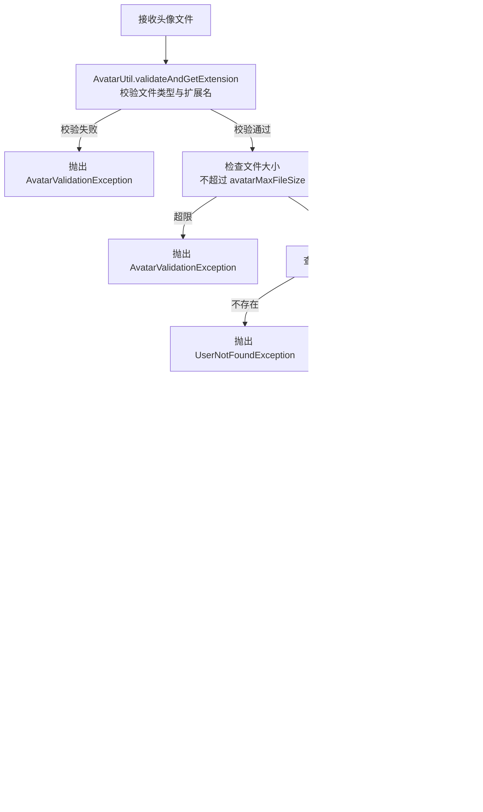

**头像文件安全校验规则（由 `AvatarUtil` 提供）：**

- 允许的扩展名：`jpg`、`jpeg`、`png`、`webp`、`gif`
- 禁止的扩展名（安全风险）：`svg`、`html`、`htm`、`xml`、`js`
- MIME 类型必须与扩展名匹配
- 文件大小不超过配置上限（默认 `2MB`）
- `jpeg` 扩展名会被规范化为 `jpg`

### 4. UserController REST 控制器

提供 `/api/v1/users` 前缀下的用户管理 API 端点。

**API 端点一览：**

| 方法 | 路径 | 认证 | 说明 |
|------|------|------|------|
| `GET` | `/api/v1/users/me` | 需登录 | 获取当前登录用户信息 |
| `GET` | `/api/v1/users/me/tools` | 需登录 | 获取当前用户发布的工具列表（分页） |
| `POST` | `/api/v1/users/me/avatar` | 需登录 | 上传/替换当前用户头像 |
| `DELETE` | `/api/v1/users/me/avatar` | 需登录 | 删除当前用户头像 |
| `GET` | `/api/v1/users/{id}` | 公开 | 获取指定用户的公开信息 |

**`/me/tools` 端点查询参数：**

| 参数 | 类型 | 默认值 | 说明 |
|------|------|--------|------|
| `categoryId` | `Long` | — | 按分类筛选（可选） |
| `keyword` | `String` | — | 关键词搜索（可选） |
| `sortBy` | `String` | `latest` | 排序方式 |
| `page` | `int` | `0` | 页码（从0开始） |
| `size` | `int` | `12` | 每页条数 |

> 该端点委托给 [Tool Module](Tool_Module.md) 的 `ToolService.getMyTools()` 方法处理。

### 5. DTO 数据传输对象

#### UserDTO vs PublicUserDTO 对比

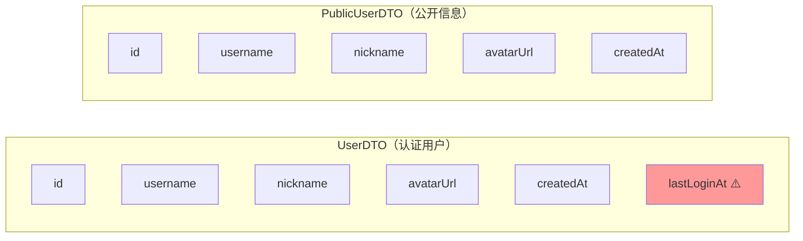

| 字段 | `UserDTO` | `PublicUserDTO` | 说明 |
|------|-----------|-----------------|------|
| `id` | ✅ | ✅ | 用户ID |
| `username` | ✅ | ✅ | 用户名 |
| `nickname` | ✅ | ✅ | 昵称 |
| `avatarUrl` | ✅ | ✅ | 头像URL |
| `createdAt` | ✅ | ✅ | 创建时间 |
| `lastLoginAt` | ✅ | ❌ | 最后登录时间（敏感信息，仅认证用户可见） |

`PublicUserDTO` 的设计遵循**最小信息暴露原则**，确保公开接口不泄露用户的登录时间等敏感信息。

---

## 数据流

### 用户注册流程

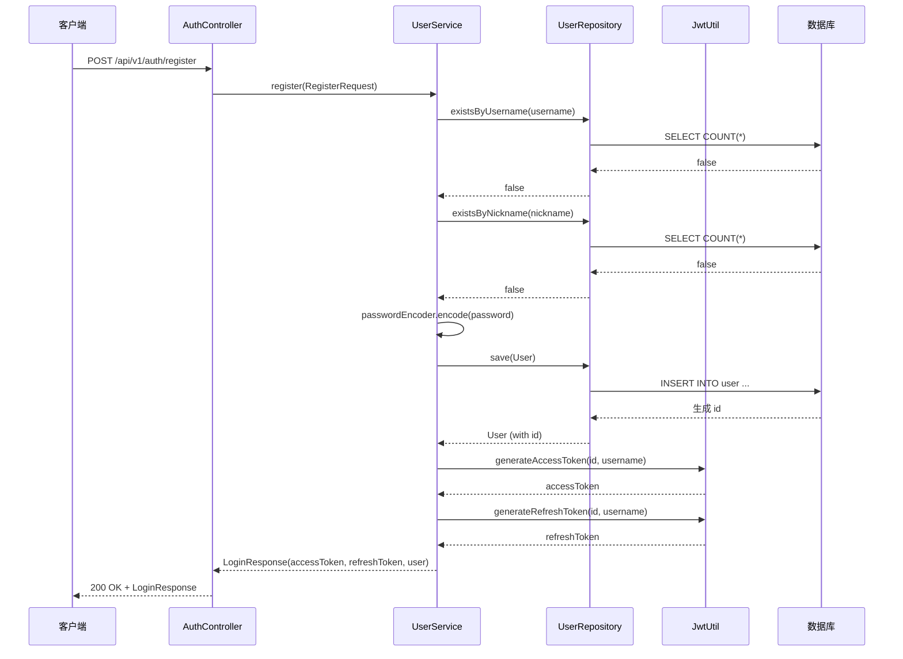

### 用户登录流程

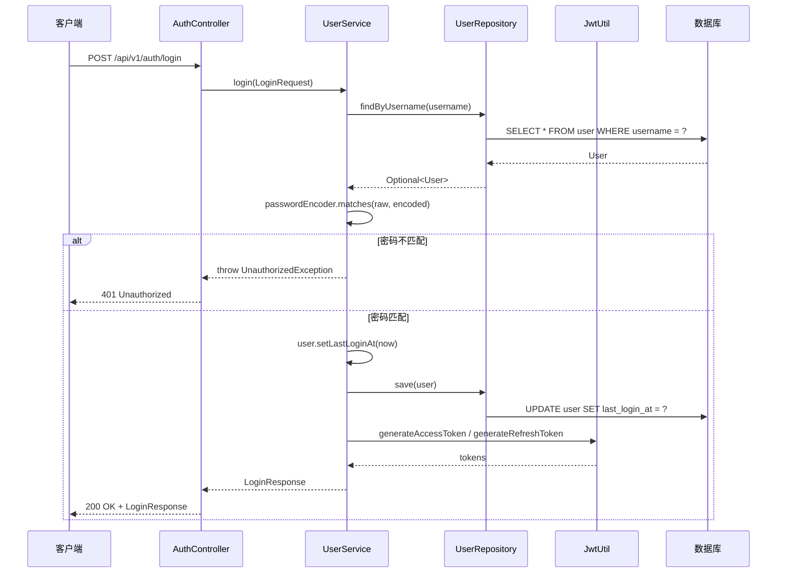

### 获取当前用户信息流程

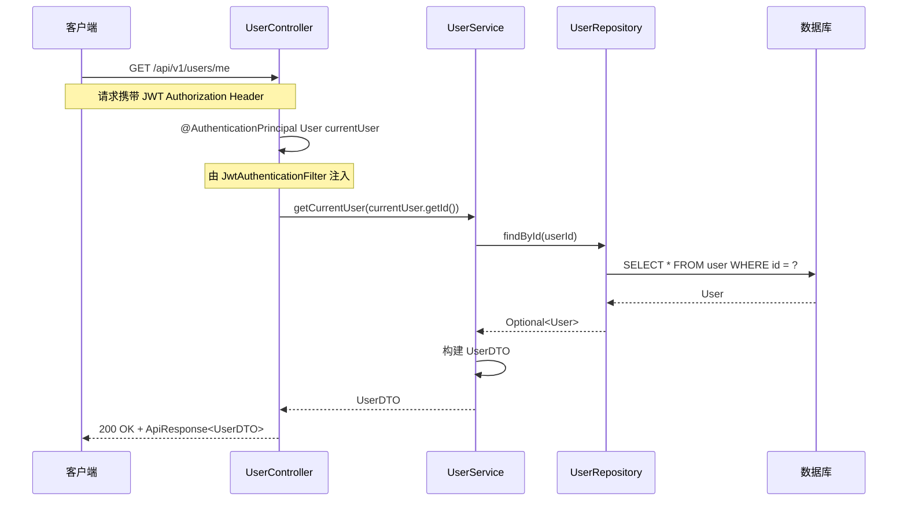

### 头像上传流程

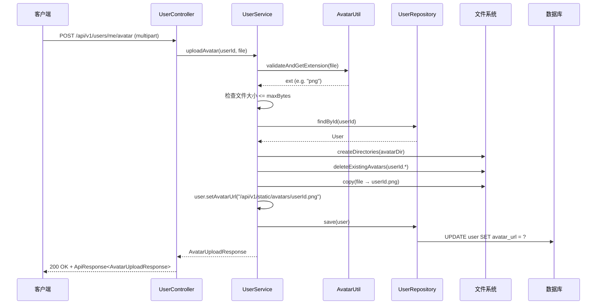

---

## 依赖关系

### 外部依赖

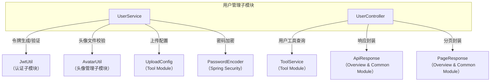

### 被依赖关系

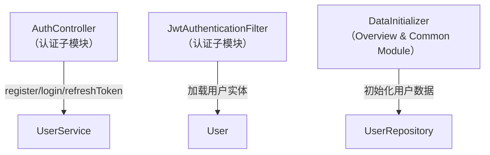

### 依赖汇总

| 依赖方向 | 依赖组件 | 所属模块 | 用途 |
|----------|----------|----------|------|
| → | `JwtUtil` | [认证子模块](认证子模块.md) | JWT 令牌生成与验证 |
| → | `AvatarUtil` | [头像管理子模块](头像管理子模块.md) | 头像文件类型与扩展名校验 |
| → | `UploadConfig` | [Tool Module](Tool_Module.md) | 上传目录与文件大小限制配置 |
| → | `ToolService` | [Tool Module](Tool_Module.md) | 查询用户发布的工具列表 |
| → | `ApiResponse` / `PageResponse` | [Overview & Common Module](Overview_and_Common_Module.md) | API 响应封装 |
| → | `PasswordEncoder` | Spring Security | 密码 BCrypt 加密与验证 |
| ← | `AuthController` | [认证子模块](认证子模块.md) | 调用注册/登录/令牌刷新方法 |
| ← | `JwtAuthenticationFilter` | [认证子模块](认证子模块.md) | JWT 认证时加载 `User` 实体 |
| ← | `DataInitializer` | [Overview & Common Module](Overview_and_Common_Module.md) | 系统初始化时创建默认用户 |

---

## 配置项

用户管理子模块的运行行为受以下配置项控制（定义于 `UploadConfig`，前缀 `app.upload`）：

| 配置项 | 默认值 | 说明 |
|--------|--------|------|
| `app.upload.base-dir` | `~/aifiles` | 上传文件根目录 |
| `app.upload.avatar-subdir` | `avatars` | 头像文件子目录 |
| `app.upload.avatar-max-file-size` | `2MB` | 头像文件大小上限 |
| `app.upload.avatar-allowed-extensions` | `jpg, jpeg, png, webp, gif` | 头像允许的扩展名 |
| `app.jwt.secret` | — | JWT 签名密钥 |
| `app.jwt.access-token-expiration` | — | 访问令牌有效期（毫秒） |
| `app.jwt.refresh-token-expiration` | — | 刷新令牌有效期（毫秒） |

---

## 异常处理

`UserService` 中涉及的异常类型及其触发场景：

| 异常类 | 触发场景 | HTTP 状态码 |
|--------|----------|-------------|
| `DuplicateResourceException` | 注册时用户名或昵称已存在 | 409 Conflict |
| `UnauthorizedException` | 登录凭据错误、刷新令牌无效、用户不存在 | 401 Unauthorized |
| `UserNotFoundException` | 头像操作时用户不存在 | 404 Not Found |
| `AvatarValidationException` | 头像文件校验失败（格式/大小/类型不匹配） | 400 Bad Request |
| `RuntimeException` | 头像目录创建失败或文件写入失败 | 500 Internal Server Error |

---

## 安全设计要点

1. **密码安全**：使用 Spring Security 的 `PasswordEncoder`（BCrypt）对密码进行加密存储，明文密码从不持久化。
2. **信息隔离**：通过 `UserDTO` 和 `PublicUserDTO` 的分离，确保公开接口不暴露 `lastLoginAt` 等敏感字段。
3. **头像文件安全**：
   - 扩展名白名单机制，拒绝 `svg`、`html` 等潜在 XSS 风险格式
   - MIME 类型与扩展名双重校验
   - 文件大小限制防止 DoS 攻击
   - 头像文件以 `userId.ext` 命名，避免路径遍历风险
4. **认证集成**：`UserController` 的 `/me` 系列端点通过 `@AuthenticationPrincipal User` 获取当前认证用户，由[认证子模块](认证子模块.md)的 `JwtAuthenticationFilter` 在请求预处理阶段注入。
